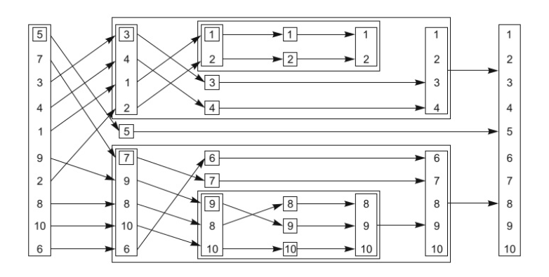
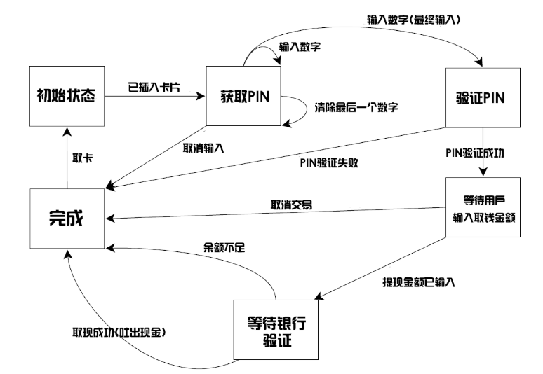
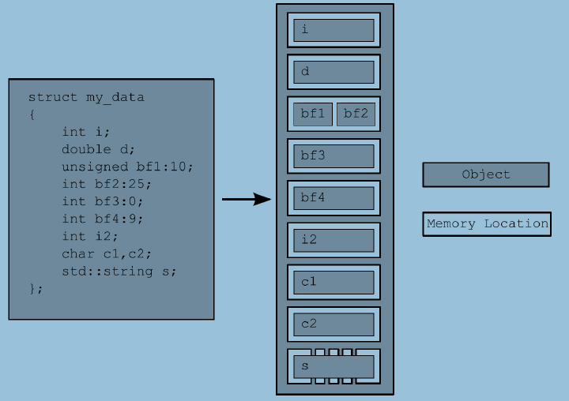

# CPP并发编程
## 1 简单使用
###  目标
> 1. 什么是并发和多线程
> 2. 为什么需要并发和多线程
> 3. c++中的并发史
> 4. 简单实例
### 1.1 什么是并发和多线程
简单说并发就是同一时间点，可以处理不同的事情。比如边走路边说话。
#### 1.1.1 计算机系统中的并发

并发的途径：多进程并发（开销大，通信信号，套接字，文件，管道等，但是更容易编写安全的并发代码如：Erlang），多线程并发（通信，共享内存--解决数据访问不一致的问题）
在资源的角度讲，多线程会减轻操作系统的负担，性能也比较好。所有c++语言进行了支持。但是在线程间通信并没有专门的进行处理。所以这部分需要开发者自己实现。

### 1.2 为什么需要并发和多线程
主要有两个原因：SOC(关注点分离)和性能。
#### 1.2.1 关注点分离
仅仅为了解耦业务逻辑，可以将相关和无关的代码进行解耦。这种方式不再依赖CPU中的可用内核数量。因为对线程的划分是基于概念上的设计，而不是一种增加吞吐量的尝试。
#### 1.2.2为了性能
主要是多核时代的到来。
提升性能有两种：将单个任务进行并行设计（业务效果最明显的）和对数据的并行（对数据的不同部分进行相同的处理例如图像并行计算）。
#### 1.2.3不要盲目使用并发
建立在上面两点的基础上，性能收益比不上成本，或者关注分离不是特别清晰。
其中主要
1. 太多线程占用资源，如32位的4G内存，1M一个线程的话只支持4096个。
2. C/S架构，建议使用线程池
3. 注意线程切换带来的影响

### 1.3 c++中的并发和多线程
#### 1.3.1 c++的多线程史
1998年的c++标准不承认线程的存在，并且各种语言元素的操作效果是按照顺序的抽象机器编写的。不仅如此，内存模型还没有正式定义，因此如果没有编译器特定的扩展，就不能在1998 c++标准编写多线程应用程序。  
当然，编译器供应商可以自由地向该语言添加扩展，而用于多线程的C API(比如POSIX C标准和Microsoft Windows API中的API)的流行使得许多c++编译器供应商使用各种特定于平台的扩展来支持多线程。这种编译器支持通常仅限于允许在平台上使用相应的C API，并确保c++运行时库(例如异常处理机制的代码)在多线程的情况下工作。虽然很少有编译器厂商提供正式的支持多线程的内存模型，但编译器和处理器的实际行为已经足够好，已经编写了大量的多线程c++程序。  
c++程序员不满足于使用特定于平台的C API来处理多线程，他们已经开始寻找类库来提供面向对象的多线程工具。应用程序框架，如MFC和通用框架。诸如Boost和ACE之类的c++库已经积累了一组c++类，这些类包装了底层特定于平台的API，并为简化任务的多线程提供了更高级的工具。虽然类库的精确细节有很大的不同，特别是在启动新线程方面，但是类的总体形状有很多共同之处。 一个特别重要的设计是许多c++类库所共有的，它为程序员提供了相当大的好处， 一直以来使用的资源获取是初始化(RAII)的习惯用法，用锁来确保互斥对象在退出相关作用域时被解锁。  
在许多情况下，现有C ++编译器的多线程支持与特定于平台的API和与平台无关的类库（如Boost和ACE）的可用性相结合，为编写多线程C ++代码提供了坚实的基础，因此有 可能有数百万行C ++代码作为多线程应用程序的一部分编写。 但是缺乏标准支持意味着有时候缺乏线程感知内存模型会导致问题，特别是对于那些试图通过使用处理器硬件知识或者编写跨平台代码来获得更高性能的人来说。 编译器的实际行为因平台而异。
#### 1.3.2 c++新标准中的并发支持
随着新的c++ 11标准的发布，这一切都发生了变化。不仅有一个全新的线程感知内存模型，而且c++标准库已经扩展到包括管理线程的类(参见第2章)，保护共享数据(参见第三章),线程之间的同步操作(参见第4章)和低级原子操作(参见第5章)。  
新的c++线程库在很大程度上是基于通过使用前面提到的c++类库积累的经验。特别是，Boost线程库被用作新库所基于的主要模型，其中许多类与Boost中的相应类和结构相同。随着新标准的发展，这是一个双向流，Boost线程库本身也发生了变化，以匹配c++标准，所以从Boost过渡过来的用户应该会感到非常自在。 
除了线程库，还有一些C++的新特性在附录A中进行扩展。  
另外就是C++的原子操作使得程序员可以不使用汇编语言就可以写一些高效的代码（跨平台）。
#### 1.3.3 c++线程库的效率
C++标准库考虑了跨平台以及对汇编原子操作的封装和抽象。虽然封装了底层操作系统API。但是在应用上其性价比还是比较高的。
#### 1.3.4 特定平台特性
尽管C ++线程库为多线程和并发提供了相当全面的工具，但在任何给定的平台上都会有特定于平台的工具，这些工具超出了所提供的范围。 为了在不放弃使用标准C ++线程库的好处的情况下轻松访问这些工具，C ++线程库中的类型可以提供native_handle（）成员函数，该函数允许使用平台直接操作底层实现 -  特定的API。 就其本质而言，使用native_handle（）执行的任何操作完全取决于平台，并且超出了本书的范围（以及标准C ++库本身）。
### 1.4 体验
好的，所以你有一个漂亮，有光泽的C ++ 11兼容编译器。 接下来是什么？ 多线程C ++程序是什么样的？ 它看起来非常像任何其他C ++程序，通常包含变量，类和函数。 唯一真正的区别是某些功能可能同时运行，因此您需要确保共享数据对于并发访问是安全的，如第3章所述。当然，为了同时运行功能，必须使用特定的功能和对象 管理不同的线程。
#### 1.4.1 入门
让我们从一个经典的例子开始：打印“Hello World”的程序。这里显示了一个非常简单的Hello，World程序在单个线程中运行，当我们移动到多个线程时作为基线：  
```
#pragma once
#include <iostream>
#include <thread>
#include "AbstrctDemo.h"
using namespace std;
class Listing11 :
	public Demo {
public:
	void hello() {
		cout << "hello Concurrent world" << endl;
	}
	void run() override {
		thread t([this]() {
			this->hello();
		});
		t.join();
	}
};
```
所有这个程序都是将“Hello World”写入标准输出流。让我们将它与下面列表中显示的简单Hello，Concurrent World程序进行比较，该程序启动一个单独的线程来显示消息。  
1. 添加头文件
2. 独立的函数
3. join防止主线程提前退出
### 1.5 总结
本章中，提及了并发与多线程的含义,以及在你的应用程序中为什么你会选择使用(或不使用)
它。还提及了多线程在C++中的发展历程，从1998标准中完全缺乏支持，经历了各种平台相
关的扩展，再到新的C++11标准中具有合适的多线程支持。芯片制造商选择了以多核心的形
式，使得更多任务可以同时执行的方式来增加处理能力，而不是增加单个核心的执行速度。
在这个趋势下，C++多线程来的正是时候，它使得程序员们可以利用新的CPU，带来的更加
强大的硬件并发。
## 2 线程管理
> 章节内容
> * 创建线程，指定代码块在新线程的多种方式
> * 等待线程结束，与线程分离
> * 线程的唯一标志  

您已经决定使用多个线程。现在该做什么?如何启动这些线程，如何检查它们是否已经完成，如何对它们进行监视?c++标准库使大多数线程管理任务相对容易，几乎所有通过std::thread对象管理的任务都与给定的线程相关联，您将看到这一点。对于那些不那么简单的任务，库提供了从基本构建块构建所需内容的灵活性。  
我将首先介绍一些基本知识:启动线程、等待它完成，或者在后台运行它。然后，我们将继续研究在线程函数启动时向它传递额外的参数，以及如何将线程的所有权从一个std::thread对象转移到另一个std::thread对象。最后，我们将研究如何选择要使用的线程数量并标识特定的线程。  
### 2.1 线程基本管理
每个c++程序至少有一个线程，由c++运行时启动:运行main()的线程。然后，您的程序可以启动具有另一个函数作为入口点的其他线程。然后，这些线程彼此并发地运行，并与初始线程一起运行。就像程序从main()返回时程序退出一样，当指定的入口点函数返回时，线程退出。正如您将看到的，如果线程有一个std::thread对象，那么您可以等待它完成;但首先你必须启动它，让我们看看启动线程。  
#### 2.1.1 启动线程
正如您在第1章中看到的，线程是通过构造一个std::thread对象开始的，该对象指定在该线程上运行的任务。在最简单的情况下，该任务只是一个普通的空返回函数，不接受任何参数。这个函数在它自己的线程上运行，直到它返回，然后线程停止。在另一个极端,这个任务可以是一个函数对象,需要额外的参数和执行一系列的独立操作,通过某种指定消息传递系统的运行,和线程停止只有当它的信号,再通过某种消息传递系统。线程要做什么或者从哪里启动并不重要，但是使用c++线程库启动线程总是可以归结为构造std::thread对象:  
线程的创建可以提供函数对象的方式，也可以通过lambda表达式进行创建。其中函数对象的时候需要注意。如果使用如下方式，只是进行了函数的声明并没有进行创建。
```
std::thread my_thread(background_task());
```
真正的创建发格式有两种分别如下
```
std::thread my_thread((background_task())); // 1
std::thread my_thread{background_task()}; // 2
```
#### 2.1.2 等待线程结束
主要通过join的方式进行等待线程结束，一般调用join时，特别是在面向对象时，常常析构或者其他方式进行调用，因此通常可以使用joinable先进行判断后再进行调用。
#### 2.1.3 异常等待
一般在多线程中，常常会对一些复杂的操作进行线程创建，避免对主线程的耗时。但是这些复杂的操作使用不当或者其他问题时（如IO等操作）通常会抛出异常，这时就需要对线程的join就需要一些异常的捕获。常见的模式如下。
```
struct func; // 定义在清单2.1中
void f()
{
int some_local_state=0;
func my_func(some_local_state);
std::thread t(my_func);
try
{
do_something_in_current_thread();
}
catch(...)
{
t.join(); // 1
throw;
}
t.join(); // 2
}
```
这样可以通过异常捕获，保证线程退出后，函数才结束。另一种使用的是面向对象的思想。利用RALL(资源获取即初始化的方式)在析构函数中进行join。
#### 2.1.4 后台线程
主要使用detach进行线程的分离（守护线程），需要注意的是线程一旦分离，那么就无法join了。常常对于监听者模式中使用，当对象状态或者其他数据发生变化时。使后台线程进行相应的耗时或者其他模块的业务变化。
### 2.2 将参数传递给线程函数
向线程函数传递参数时需要注意一些非拷贝（指针或者引用）数据的时效性。
### 2.3 转移线程拥有权
主要通过移动语义std::move的方式进行转移。另外该方式的使用的作用主要是扩展线程的使用范围。
### 2.4 选择线程运行数量
这一部分主要与CPU内核有关，常常在项目用为了充分使用cpu的性能选择线程的并发数。
### 2.5 线程识别
每个线程都有一个线程id。win中，线程的id从1开始。
```
std::thread::id master_thread;
void some_core_part_of_algorithm()
{
if(std::this_thread::get_id()==master_thread)
{
do_master_thread_work();
}
do_common_work();
}
```
### 2.6 总结
本章讨论了C++标准库中基本的线程管理方式：启动线程，等待结束和不等待结束(因为需要
它们运行在后台)。并了解应该如何在线程启动前，向线程函数中传递参数，如何转移线程的
所有权，如何使用线程组来分割任务。最后，讨论了使用线程标识来确定关联数据，以及特
殊线程的特殊解决方案。虽然，现在已经可以纯粹的依赖线程，使用独立的数据，做独立的
任务(如同清单2.8)，但在某些情况下，线程确实需要有共享数据。第3章会讨论共享数据和线
程的直接关系。第4章会讨论在(有/没有)共享数据情况下的线程同步操作。
## 3 线程间数据共享
主要内容
> * 共享数据带来的问题
> * 使用互斥量保护数据
> * 数据保护的替代方案
### 3.1 共享数据带来的问题
主要是多个线程对相同的数据进行操作时可能会带来一定的问题。  
不变量(invariants)的概念对程序员们编写的程序会有一定的帮助——对于特殊结构体的描
述；比如，“变量包含列表中的项数”。不变量通常会在一次更新中被破坏，特别是比较复杂的
数据结构，或者一次更新就要改动很大的数据结构。  
双链表中每个节点都有一个指针指向列表中下一个节点，还有一个指针指向前一个节点。其
中不变量就是节点A中指向“下一个”节点B的指针，还有前向指针。为了从列表中删除一个节
点，其两边节点的指针都需要更新。当其中一边更新完成时，不变量就被破坏了，直到另一
边也完成更新；在两边都完成更新后，不变量就又稳定了。   
  
线程间潜在问题就是修改共享数据，致使不变量遭到破坏。当不做些事来确保在这个过程中
不会有其他线程进行访问的话，可能就有线程访问到刚刚删除一边的节点；这样的话，线程
就读取到要删除节点的数据(因为只有一边的连接被修改，如图3.1(b))，所以不变量就被破
坏。破坏不变量的后果是多样，当其他线程按从左往右的顺序来访问列表时，它将跳过被删
除的节点。在一方面，如有第二个线程尝试删除图中右边的节点，那么可能会让数据结构产
生永久性的损坏，使程序崩溃。无论结果如何，都是并行代码常见错误：条件竞争。  
#### 3.1.1 条件竞争
并发中竞争条件的形成，取决于一个以上线程的相对执行顺序，每个线程都抢着完成自己的
任务。大多数情况下，即使改变执行顺序，也是良性竞争，其结果可以接受。例如，有两个
线程同时向一个处理队列中添加任务，因为系统提供的不变量保持不变，所以谁先谁后都不
会有什么影响。当不变量遭到破坏时，才会产生条件竞争，比如双向链表的例子。并发中对
数据的条件竞争通常表示为恶性条件竞争，我们对不产生问题的良性条件竞争不感兴
趣。 C++  标准中也定义了数据竞争这个术语，一种特殊的条件竞争：并发的去修改一个独立
对象(参见5.1.2节)，数据竞争是(可怕的)未定义行为的起因。  
当完成一个操作需要修改两个或多个不同的数据片段时，通常会出现有问题的竞态条件，例如示例中的两个链接指针。因为操作必须访问两个单独的数据片段，所以必须在单独的指令中修改它们，并且当其中一个操作已经完成时，另一个线程可能会访问数据结构。竞争条件通常很难找到，也很难复制，因为机会的窗口很小。如果修改是作为连续的CPU指令进行的，则出现prob的机会  
#### 3.1.2 避免恶性条件竞争
主要有3种方式
1. 对数据结构进行保护，确保只有修改线程才能看到不变量被破坏的中间状态。
2. 无锁编程（原子化）
3. 事务支持（c++还不支持）
### 3.2 使用互斥量保护共享数据
当访问共享数据前，使用互斥量将相关数据锁住，再当访问结束后，再将数据解锁。线程库
需要保证，当一个线程使用特定互斥量锁住共享数据时，其他的线程想要访问锁住的数据，
都必须等到之前那个线程对数据进行解锁后，才能进行访问。这就保证了所有线程能看到共
享数据，而不破坏不变量。
#### 3.2.1 C++中使用互斥量
C++中通过实例化 std::mutex  创建互斥量，通过调用成员函数lock()进行上锁，unlock()进行
解锁。不过，不推荐实践中直接去调用成员函数，因为调用成员函数就意味着，必须记住在
每个函数出口都要去调用unlock()，也包括异常的情况。C++标准库为互斥量提供了一个RAII
语法的模板类 std::lock_guard  ，其会在构造的时候提供已锁的互斥量，并在析构的时候进行
解锁，从而保证了一个已锁的互斥量总是会被正确的解锁。下面的程序清单中，展示了如何
在多线程程序中，使用 std::mutex  构造的 std::lock_guard  实例，对一个列表进行访问保
护。 std::mutex  和 std::lock_guard  都在 <mutex>  头文件中声明。
#### 3.2.2 精心组织代码来保护共享数据
使用互斥量来保护数据，并不是仅仅在每一个成员函数中都加入一个 std::lock_guard  对象那
么简单；一个迷失的指针或引用，将会让这种保护形同虚设。不过，检查迷失指针或引用是
很容易的，只要没有成员函数通过返回值或者输出参数的形式向其调用者返回指向受保护数
据的指针或引用，数据就是安全的。如果你还想往祖坟上刨，就没这么简单了。在确保成员
函数不会传出指针或引用的同时，检查成员函数是否通过指针或引用的方式来调用也是很重
要的(尤其是这个操作不在你的控制下时)。函数可能没在互斥量保护的区域内，存储着指针或
者引用，这样就很危险。  
#### 3.2.3 发现接口内在的条件竞争 
因为使用了互斥量或其他机制保护了共享数据，就不必再为条件竞争所担忧吗？并不是，你
依旧需要确定数据受到了保护。回想之前双链表的例子，为了能让线程安全地删除一个节
点，需要确保防止对这三个节点(待删除的节点及其前后相邻的节点)的并发访问。如果只对指
向每个节点的指针进行访问保护，那就和没有使用互斥量一样，条件竞争仍会发生——除了
指针，整个数据结构和整个删除操作需要保护。
1. 通过引用传入值
2. 通过非抛出异常的拷贝和移动构造
3. 返回指向弹出值的指针。
#### 3.2.4 死锁问题以及解决方案
一对线程需要对他们所有的互斥量做一些操作，其中每个线程都有一个互斥量，且等待另一个解锁。这样没有线程能工作，因为他们都在等待对方释放互斥量。这种情况就是死锁，它的最大问题就是由两个或两个以上的互斥量来锁定一个操作。  
一般的建议是：以相同的顺序获取锁（但是交换两个相同结构--具有锁的情况时会产品问题）
结果方案：
```
// 这里的std::lock()需要包含<mutex>头文件
class some_big_object;
void swap(some_big_object& lhs,some_big_object& rhs);
class X
{
private:
some_big_object some_detail;
std::mutex m;
public:
X(some_big_object const& sd):some_detail(sd){}
friend void swap(X& lhs, X& rhs)
{
if(&lhs==&rhs)
return;
std::lock(lhs.m,rhs.m); // 1
std::lock_guard<std::mutex> lock_a(lhs.m,std::adopt_lock);
// 2
std::lock_guard<std::mutex> lock_b(rhs.m,std::adopt_lock);
// 3
swap(lhs.some_detail,rhs.some_detail);
}
};
```
#### 3.2.5 死锁避免
1. 避免锁嵌套
2. 避免在持有锁时调用用户提供的代码
3. 使用固定顺序获取锁
4. 使用锁的层次结构  
即为每一个锁分配层号，当线程想获取锁时，如果该层锁已经被低层锁持有，那么上锁失败。   
锁的层次结构其实就是锁的一个包装类上进行使用，使用时候所都是有层级的。   
```
//
// Created by RS on 2019/1/29.
//

#ifndef CLION_HIERARCHICALMUTEX_H
#define CLION_HIERARCHICALMUTEX_H


#include <mutex>

class HierarchicalMutex {
     std::mutex internalMutex;
     uint64_t  const hierarchyValue;
     uint64_t previousHierarchyValue;
     static  thread_local uint64_t thisThreadHierarchyValue;
     void checkForHierarchyViolation(){
         if(thisThreadHierarchyValue<=hierarchyValue){
             throw  std::logic_error("mutex hierarchy violated");
         }
     }
     void updateHierarchyValue(){
         previousHierarchyValue=thisThreadHierarchyValue;
         thisThreadHierarchyValue=hierarchyValue;
     }

public:
    explicit HierarchicalMutex(uint64_t value):hierarchyValue(value),
                                               previousHierarchyValue(0){

     }
     void lock(){
         checkForHierarchyViolation();
         internalMutex.lock();
         updateHierarchyValue();
     }
     void unlock(){
         thisThreadHierarchyValue=previousHierarchyValue;
         internalMutex.unlock();
     }
     bool try_lock(){
         checkForHierarchyViolation();
         if(!internalMutex.try_lock()){
             return  false;
         }
         updateHierarchyValue();
         return true;
     }
};
#endif //CLION_HIERARCHICALMUTEX_H
```
#### 3.2.6 独占锁(std::unique_lock)
std::unqiue_lock  使用更为自由的不变量，这样 std::unique_lock  实例不会总与互斥量的数据类型相关，使用起来要比 std:lock_guard  更加灵活。    
1. std::adopt_lock作为第二个参数传入构造函数，可以对互斥量进行管理   
2. std::defer_lock作为第二个参数传递进去，表明互斥量应保持解锁状态。   
```
.h
//
// Created by RS on 2019/1/30.
//
#ifndef CLION_DEMO39_H
#define CLION_DEMO39_H
#include <mutex>
#include <iostream>
#include "Abstruct.h"
class BigObj{
public:
    BigObj(int x1,int y1):x(x1),y(y1){}
    int x=0;
    int y=0;
};
void swap3(BigObj &left,BigObj &right);
class Demo39 :public Abstruct{
public:
    BigObj sodata;
    std::mutex mutex;
public:
    Demo39(BigObj const& sd):sodata(sd){}
    friend void swap(Demo39 & lhs,Demo39& rhs);
    void run() override {
        BigObj obj1({2,3});
        BigObj obj2({4,5});
        Demo39 demo39(obj1);
        Demo39 demo391(obj2);
        std::cout<<demo39.sodata.x<<std::endl;
        swap(demo39,demo391);
        std::cout<<demo39.sodata.x<<std::endl;
    }
};
#endif //CLION_DEMO39_H
.cpp
//
// Created by RS on 2019/1/30.
//

#include "Demo39.h"

void swap3(BigObj &left,BigObj &right){
    BigObj tmp=left;
    left=right;
    right=tmp;
}

void swap(Demo39 &lhs, Demo39 &rhs) {
    if(&lhs==&rhs){
        return;
    }
    std::unique_lock<std::mutex> lock_a(lhs.mutex,std::defer_lock);
    std::unique_lock<std::mutex> lock_b(rhs.mutex,std::defer_lock);
    std::lock(lock_a,lock_b);//互斥量在这里上锁
    swap3(lhs.sodata,rhs.sodata);
}
```
> 需要注意：由于std::unique_lock对象一般比std::lock_guard大，功能也多，因此性能没有std::lock_guard好。
#### 3.2.7 不同域中互斥量所有权的传递
如果源是左值那么可以直接返回，如果是右值，那么需要显式的调用移动成左值。
```
/**
* 网关方法
**/
std::unique_lock<std::mutex> getLock(){
    extern std::mutex someMutex;
    std::unique_lock<std::mutex> lk(someMutex);
    prepareData();
    return  lk;
}
void processData(){
    std::unique_lock<std::mutex> lk(getLock());
    doSomeThing();
}
```
#### 3.2.8 锁的粒度
主要是锁的时间以及频率。
### 3.3 保护共享数据的替代设施
C++  标准提供了一种纯粹保护共享数据初始化过程的机制。（主要是一些只读数据的创建） 
#### 3.3.1 保护共享数据的初始化过程
//比如单例模式中使用双重检查锁的方式对其进行构建。
```
void foo() {
        std::unique_lock<std::mutex> lk(resource_mutex);//所有县城在此进行序列化
        if(!resource_ptr){
            resource_ptr.reset(new SomeResource);
        }
        lk.unlock();
        resource_ptr->dosomething();
    }
    void undefined_behaiour_with_doble_checked_locking(){
        if(!resource_ptr){//第一次校验
            std::lock_guard<std::mutex> lk(resource_mutex);
            if(!resource_ptr){//第二次校验
                resource_ptr->reset();
            }
        }
        resource_ptr->dosomething();
    }
```
其实双重校验存在潜在的条件竞争，因为没有未被锁保护的的读取操作没有与其他线程里被锁保护的写入操作进行同步。因此就会产生条件竞争。所以c++进行了标准库的提供。使得条件竞争的处理更为方便。  
标准库方案：std::once_flag与std::call_once的使用。  
#### 3.3.2 保护很少更新的数据结构
试想，为了将域名解析为其相关IP地址，我们在缓存中的存放了一张DNS入口表。通常，给
定DNS数目在很长的一段时间内保持不变。虽然，在用户访问不同网站时，新的入口可能会
被添加到表中，但是这些数据可能在其生命周期内保持不变。所以定期检查缓存中入口的有
效性，就变的十分重要了；但是，这也需要一次更新，也许这次更新只是对一些细节做了改
动。
对于这种类型的操作最方便的是读写锁，但是标准委员会并未通过。但是对于boost委员会通过了，因此对于boost开发者可能读写锁的方式比价简便。 
   
因此对于更新操作，可以使用std::lock_gurad<boost::shared_mutex> 和std::unique_lock<boost::shared_mutex>上锁。对于查询或者读取操作只需要使用boost::shared_lock<boost::shared_mutex>获取访问权。    
**需要注意的是共享锁并不是万能的，对于多核处理器器性能上的收益需要反复验证才可以使用。**  
demo:
```
class dns_entry{

};
class dns_cache{
    std::map<std::string ,dns_entry> entrys;
    mutable boost::shared_mutex entryMutex;
public:
    dns_entry findEntry(std::string const & domain)const {
        boost::shared_lock<boost::shared_mutex> lk(entryMutex);
        auto const it=entrys.find(domain);
        return (it==entrys.end())? dns_entry():it->second;
    }
    void update_or_add_entry(std::string const & domain,dns_entry const & dnsDetails){
        std::lock_guard<boost::shared_mutex> lk(entryMutex);
        entrys[domain]=dnsDetails;
    }
};
```
#### 3.3.3 锁的嵌套
这种方式首先不推荐使用。大多数情况下如果使用该方式，那么就需要对你的设计进行改动了。
使用是使用std::recursive_mutex作为互斥信号。需要注意的是当你lock3次的时候，就需要对其unlock3次（允许同一线程重复锁住互斥信号）
### 3.4 本章总结
主要讨论数据共享时引起的问题。比如死锁，std::call_once()和boost::shared_mutex等。  
需要注意的另一方面没有考虑的就是等待其他线程作为输入情况的。常见的比如，生产者消费者分别处于两个线程时，我们需要一些方法让一个线程等待其他线程完成任务，但在等待过程中不占用CPU就需要进行同步并发的操作
## 4 同步并发操作
> 本章主要内容
> * 等待时间
> * 带有期望的等待一次性事件
> * 在限定时间内等待
> * 使用同步操作简化代码  
上一章仅仅谈了数据的保护的问题。当还想对单独的线程进行同步的时候。例如在一个线程完成前，可能需要等待两一个线程执行完成。这就需要线程等待一个特定时间的发生，或者等待某一个条件达成。这可能需要定期检查“任务完成标识”，或将类似的东西放到共享数据中，但是这与理想情况还是差很多。像这种情况就需要在线程中进行同步，c++标准提供类一些比较简便的同步工具（其他语言也有类似的方案），cpp中形式上表现为条件变量和期望。
### 4.1 等待一个事件或者其他条件
当一个线程等待另一个线程完成任务时
1. 持续检查共享数据标志（用于做保护工作的互斥量--消耗cpu严重），直到另一个线程完成工作时重设该位。
2. 周期性间歇的方法（std::this_thread::sleep_for()）
```
    bool flag;
    std::mutex m;
    void waitForFlag(){
        std::unique_lock<std::mutex> lk(m);
        while (!flag){
            lk.unlock();
            std::this_thread::sleep_for(std::chrono::milliseconds(200));
            lk.lock();
        }
    }
```
3. 条件变量（等待唤醒机制--推荐）
#### 4.1.1
c++标准库对条件变量有两套实现：std::condition_variable 和std::condition_variable_any。两者都依赖与一个互斥量（为了同步）；前者仅限于std::mutex一起工作，而后者可以和任何满足最低标准的互斥量一起工作，从而加上了_any的后缀。因为后者更为通用，因此可能会有额外的开销。只有当对灵活性有硬性要求时才使用后者。  
demo
```
    std::mutex mut;
    std::queue<int> data_queue;
    std::condition_variable data_cond;

    bool moreDataToPrepare() {
        return false;
    }

    void dataPreparationThread() {
        while (moreDataToPrepare()) {
            int const data = 3;//生产数据
            std::lock_guard<std::mutex> lk(mut);
            data_queue.push(data);
            data_cond.notify_one();
        }
    }
    bool isLast(int da){//终止条件
        return false;
    }
    void dataProcessingThread(){
        while (true){
            std::unique_lock<std::mutex> lk(mut);
            data_cond.wait(lk,[]{return !data_queue.empty();});//lambda表达式作为等待的条件..如果为false阻塞并解锁，当条件复杂的时候可以传入函数对象
            int data=data_queue.front();
            data_queue.pop();
            lk.unlock();
//            ..dosomething
            if(isLast(data)){
                break;
            }
        }
    }
```
需要注意dataProcessingThread方法中使用的是unique_lock.因为wait检查当不满足lambda表达式时，就会阻塞并且等待。当准备数据的线程调用notify_one时，处理数据线程就会苏醒，从新获取互斥所。并且对条件再次进行检查，当满足条件时，就会返回，并继续持有锁。这就是为什么使用unique_lock。（如果使用了lock_guard那么线程会在睡眠期间保持锁住状态，这样生产者就无法获取到互斥量）  
在调用wait()的过程中，一个条件变量可能会去检查给定条件若干次；然而，它总是在互斥量被锁定时这样做，当且仅当提供测试条件的函数返回true时，它就会立即返回。当等待线程重新获取互斥量并检查条件时，如果它并非直接响应另一个线程的通知，这就是所谓的伪唤醒(spurious wakeup)。因为任何伪唤醒的数量和频率都是不确定的，这里不建议使用一个有副作用的函数做条件检查。当你这样做了，就必须做好多次产生副作用的心理准备。
#### 4.1.2 使用条件变量构建线程安全队列
demo
``` .h
template<typename T>
class ThreadSafeQueue {
public:
    ThreadSafeQueue() {

    }

    ThreadSafeQueue(const ThreadSafeQueue &other) {
        std::lock_guard<std::mutex> lk(mut);
        data_queue=other.data_queue;
    }

    ThreadSafeQueue &operator=(const ThreadSafeQueue &)= delete;//不允许简单的赋值
    void push(T newValue);

    bool tryPop(T &value);

    std::shared_ptr<T> tryPop();

    void waitAndPop(T &value);

    std::shared_ptr<T> waitAndPop();

    bool empty() const;

private:
    mutable std::mutex mut;//1 互斥量必须是可变的
    std::queue<T> data_queue;
    std::condition_variable data_cond;
};
```
```.cpp
//
// Created by RS on 2019/2/12.
//

#include <iostream>
#include "Demo43.h"


template<typename T>
void ThreadSafeQueue<T>::waitAndPop(T &value) {
    std::unique_lock<std::mutex> lk(mut);
    data_cond.wait(lk, [this] { return !data_queue.empty(); });
    value = data_queue.front();
    data_queue.pop();
}

template<typename T>
std::shared_ptr<T> ThreadSafeQueue<T>::waitAndPop() {
    std::unique_lock<std::mutex> lk(mut);
    data_cond.wait(lk,[this]{return ! data_queue.empty();});
    std::shared_ptr<T> res(std::make_shared<T>(data_queue.front()));
    data_queue.pop();
    return  res;
}

template<typename T>
bool ThreadSafeQueue<T>::tryPop(T &value) {
    std::lock_guard<std::mutex> lk(mut);
    if(data_queue.empty())
        return false;
    value=data_queue.front();
    data_queue.pop();
    return true;
}

template<typename T>
std::shared_ptr<T> ThreadSafeQueue<T>::tryPop() {
        std::lock_guard<std::mutex> lk(mut);
        if(data_queue.empty()){
            return std::shared_ptr<T> ();
        }
        std::shared_ptr<T> res(std::make_shared<T>(data_queue.front()));
        data_queue.pop();
        return res;
}

template<typename T>
bool ThreadSafeQueue<T>::empty() const {
    std::lock_guard<std::mutex> lk(mut);
    return data_queue.empty();
}

template<typename T>
void ThreadSafeQueue<T>::push(T newValue) {
    std::lock_guard<std::mutex> lk(mut);
    data_queue.push(newValue);
    data_cond.notify_one();
}
```
线程安全的队列对于pop采用了两种方式，一种是等待，一种是返回空的方式。对于单独的任务线程使用wait方式比较合适。  
需要注意，当线程只等待一次，当条件为true时，它就不会再等待条件变量了。所以一个条件变量可能并非同步机是最好的选择，尤其是，条件在等待一组可用的数据块时。在这种情况下，Future就是一个合适的选择了。
### 4.2 使用future等待一次性事件
C++标准库模型中将等待一次性事件成为期望(future)有两种形式,唯一期望(std::future<>)和共享期望(std::shared_future<>).std::future<>实例只能与一个指定事件相关联，而std::shared_future的实例就能关联多个事件。后者的实现，所有实例都会同时变成就绪状态，并且他们可以访问与事件相关的任何数据。需要注意，其同步过程仍然必须使用互斥量或者类似同步机制进行访问保护。不过当多个线程对一个std::shared_future<>实例的副本进行访问，是不需要期望同步的。  
最基本的一次性事件，就是一个后台运行处的计算结果。  
#### 4.2.1 带返回值的后台任务(std::async)
假设，你有一个需要长时间的运算，你需要其能计算出一个有效的值，但是你现在并不迫切需要这个值。可能你已经找到了生命、宇宙，以及万物的答案，就像道格拉斯·亚当斯[1]一样。你可以启动一个新线程来执行这个计算，但是这就意味着你必须关注如何传回计算的结果，因为std::thread并不提供直接接收返回值的机制。这里就需要std::async函数模板(也是在头文<future>中声明的)了。  
当任务的结果你不着急要时，你可以使用std::async启动一个异步任务。与std::thread对象等待的方式不同，std::async会返回一个std::future对象，这个对象持有最终计算出来的结果。当你需要这个值时，你只需要调用这个对象的get()成员函数；并且会阻塞线程直到“期望”状态为就绪为止；之后，返回计算结果。下面清单中代码就是一个简单的例子。  
```
#include <future>
#include <iostream>
int find_the_answer_to_ltuae();
void do_other_stuff();
int main()
{
  std::future<int> the_answer=std::async(find_the_answer_to_ltuae);
  do_other_stuff();
  std::cout<<"The answer is "<<the_answer.get()<<std::endl;
}
```
与std::thread 做的方式一样，std::async允许你通过添加额外的调用参数，向函数传递额外的参数。当第一个参数是一个指向成员函数的指针，第二个参数提供有这个函数成员类的具体对象(不是直接的，就是通过指针，还可以包装在std::ref中)，剩余的参数可作为成员函数的参数传入。否则，第二个和随后的参数将作为函数的参数，或作为指定可调用对象的第一个参数。就如std::thread，当参数为右值(rvalues)时，拷贝操作将使用移动的方式转移原始数据。这就允许使用“只移动”类型作为函数对象和参数。  
```.h
//
// Created by RS on 2019/2/14.
//

#ifndef CONACTION_DEMO47_H
#define CONACTION_DEMO47_H


#include <string>
#include "../Abstruct.h"
struct X{
    void foo(int,std::string const&);
    std::string bar(std::string const&);
};
struct Y{
    double operator()(double);
};
/**
 * 删除拷贝构造以及赋值构造
 * 重载右值操作(包含赋值和拷贝)
 */
class MoveOnly{
public:
    MoveOnly(){}
    MoveOnly(MoveOnly&&){}
    MoveOnly(MoveOnly const&)= delete;
    MoveOnly&operator=(MoveOnly&&){}
    MoveOnly&operator=(MoveOnly const&)= delete;
    void operator()();
};
class Demo47 : public Abstruct{
public:
    void run() override;
};
#endif //CONACTION_DEMO47_H
```
```.cpp
//
// Created by RS on 2019/2/14.
//

#include "Demo47.h"
#include <iostream>
#include <future>

void Demo47::run() {
    X x;
    auto f1 = std::async(&X::foo, &x, 42, "hello");//调用p->foo(42,"hello")
    auto f2 = std::async(&X::bar, x, "good bye");//调用的是副本
    std::cout << f2.get() << std::endl;
    Y y;
    auto f3 = std::async(Y(), 3.141);//调用tmpy(3.141) tmpy通过Y的移动构造函数得到
    auto f4 = std::async(std::ref(y), 2.718);
    std::cout << f3.get() << std::endl;
    std::cout << f4.get() << std::endl;
//    X baz(X&);
//    std::async(baz,std::ref(x));//调用baz(x)
    auto f5 = std::async(MoveOnly());//通过std::move(MoveOnly())构造得到的
}
void X::foo(int foi, std::string const &fstring) {
    std::cout << foi << " :" << fstring << std::endl;
}
std::string X::bar(std::string const &bar) {
    return bar + "-bar";
}
double Y::operator()(double a) {
    return a * a;
}
void MoveOnly::operator()() {
    std::cout << "MoveOnly::operator()" << std::endl;
}
```
其实std::async的执行可以指定是否在新线程上执行。  
```
auto f6=std::async(std::launch::async,Y(),1.2);//在新线程上执行
auto f7=std::async(std::launch::deferred,baz,std::ref(x));//在wait或get()调用时执行
auto f8=std::async(std::launch::deferred|std::launch::async,baz,std::ref(x));//实现选择执行方式
auto f9=std::async(baz,std::ref(x));
f7.wait();
```
通过std::async的方式获取std::future并不是唯一的。  
* 你也可以将任务包装进一个std::packaged_task实例中。
* 也可以通过编写代码使用std::promise类型模板显示设置值。
> std::packaged_task 比std::promise具有更高层的抽象。所以从高抽象的模板说起。
#### 4.2.2 任务与期望
std::packaged_task<>对一个函数或者可调用对象，绑定一个期望。当std::packaged_task<>对象被调用，它就会调用相关函数或可调用对象，将期望状态置为就绪，返回值也会被存储为相关数据。当一个粒度较大的操作可以被分解为独立子任务时，其中每个子任务就可以包含在一个std::packaged_task<>实例中，之后这个实例传递到任务调度器或者线程池中。对任务的细节进行抽象，调度器仅处理std::packaged_task<>实例，而非处理单独的函数。  
std::packaged_task<>的模板参数是一个函数签名，比如void()就是一个没有参数也没有返回值的函数，或int(std::string&,double*)就是一个非const引用的std::string 和一个指向double类型的指针，并且返回类型是int.当你构造出一个std::packaged_task<>实例时，你必须传入一个函数或可调用对象，这个函数可调用的对象需要能接收指定的参数和返回可转换为制定返回类型的值。类型可以不完全匹配；你可以用一个int类型的参数和返回一个float类型的函数，来构建std::packaged_task< double(double)>的实例，因为在这里类型是可以隐式转换的。

指定函数签名的返回类型可以用来标识，从get_future()返回的std::future< >类型，不过函数签名的参数列表，可以用来指定“打包任务”的函数操作符。如例如模板偏特化std::packaged_task< std::string(std::vector< char*>,int)>将在下面的代码清单中使用。  
```
template <>
class packaged_task<std::string(std::vector<char>*,int) >{
public:
    template <typename Callable>
    explicit packaged_task(Callable&&f);
    std::future<std::string> get_future();
    void operator()(std::vector<char>*,int);
};
```
以上偏特化后的类是一个可调用对象，
1. 可以传递到std::thread中
2. 可以传递到另一函数中直接调用（可以为函数调用操作符提供所需参数，返回值作为异步结果存储在std::future中，通过get_futrue获取）
3. 可以将一个任务包含进对象，并且在检索期望之前，将std::packaged_task对象传入，以便调用时能及时找到。  
**线程间传递任务**
比如类似gui方面的业务，当一个线程需要更新界面时，他需要发出一条信息给正确的线程，让特定的线程来做界面更新。std::packaged_task不需要发送信息给gui相关线程就可以完成这种功能。

```
//
// Created by RS on 2019/2/15.
//
#ifndef CONACTION_DEMO49_H
#define CONACTION_DEMO49_H
#include <mutex>
#include <deque>
#include <future>
#include <iostream>
#include "../Abstruct.h"
#include <chrono>
#include <iostream>
#include <string>
/**
 * 消息驱动的模型(类似于观察者模式实现的功能)
 * 后台线程负责构造指令
 *
 * Demo线程负责解析并执行
 */
class Demo49 : public Abstruct{
public:
    Demo49(){
        guiBgThread=new std::thread([&]{
            gui_bg_thread();
        });
        guiBgThread->detach();
    }
    void run() override{
        Demo49 demo49;
        demo49.GuiThread();
    }
    bool GuiShutdownMessageReceived(){
        if(str=="Y"){
            return true;
        }else{
            return false;
        }

    }
    void GetAndProcessGuiMessage(){
//        doMsg();
    }
    void doMsg(){
        std::cout<<"处理指令："<<str<<std::endl;
    }
    void GuiThread(){//1 主线程
        while (!GuiShutdownMessageReceived()){//2循环直到收到关闭图形界面信息
            GetAndProcessGuiMessage();//3轮询消息界面处理
            std::packaged_task<int()> task;
            {
                std::lock_guard<std::mutex> lk(m);
                if(tasks.empty()){//4当队列中没有任务时
//                    std::this_thread::sleep_for(std::chrono::seconds(3));
                    continue;
                }

                task=std::move(tasks.front());//5有任务时
                tasks.pop_front();
            }
            task();//6 直接调用--这里“期望与任务相关，当执行完成时，其状态会被置为"就绪状态"
        }
    }
    template <typename Func>
    std::future<int> post_task_for_gui_thread(Func f){//添加任务
        std::packaged_task<int()> task(f);//7 创建打包任务
        auto res=task.get_future();//8 调用获取future对象
        std::lock_guard<std::mutex> lk(m);//9任务加入队列之前加锁
        tasks.push_back(std::move(task));//10期望将返回调用函数
        return  res;//
    }
    void gui_bg_thread(){
        while (true){
            std::cout<<"请输入消息(是否关闭“Y/N”)"<<std::endl;
            std::cin >> str;
            auto fu=post_task_for_gui_thread([=]{
                std::cout<<"balabala:"<<str<<std::endl;
                return str.length();
            });

           std::cout<< "长度："<<fu.get()<<std::endl;
        }
    }
private:
    std::thread * guiBgThread;
    std::string str;
    std::mutex m;
    std::deque<std::packaged_task<int()>> tasks;
};
#endif //CONACTION_DEMO49_H
```
#### 4.2.3 使用std::promises
目前常见的网络连接方式是一个连接一个线程。这样容易将系统资源耗尽。常用的处理方法是每个线程同时处理多个连接事件。   
考虑一个线程处理多个连接事件，来自不同的端口连接的数据包基本上是以乱序方式进行处理的；同样的，数据包也将以乱序的方式进入队列。这样会出现应用不是等待数据发送成功就是等待新一批来自指定网络接口的数据接收成功。（一对std::promise/std::future会为这种方式提供一个可行的机制，在期望上可以阻塞等待线程，同时提供数据的线程可以使用组合中的承诺来对相关值进行设置，以及将期望的状态置为就绪）。  
```
#include <future>
void process_connections(connection_set& connections){
    while(!done(connections))//1
    {
        for(connection_iterator connection=connections.begin();end=connections.end();++conncection){//2
            if(connection->has_incoiming_data()){//3
                data_packet data=connection->incoming();
                std::promise<payload_type> & p=connection->get_promise(data.id);//4
                p.set_value(data.payload);
            }
            if(connection->has_outgoing_data()){//5
                outgoing_packet data=connection->top_of_outgoing_queue();
                connection->send(data.payload);
                data.promise.set_value(true);//6
            }
        }
    }
}
```
#### 4.2.4 为“期望”存储“异常”
为期望存储异常两种常见机制  
1. 常见任务 
```
double square_root(double x){
    if(x< 0){
        throw std::out_of_range("x<0");
    }
    return sqrt(x);
}
test(){
    std::future<double> f=std::async(square_root,-1);
    double y=f.get();//此处抛出异常，std::package_task任务也是这样的
}
```
2. std::promise存储异常
```
extern std::promise<double> some_promise;
try{
    some_promise.set_value(calculate_value());
}catch(...){
    some_promise.set_exception(std::current_exception());//current_exception来检索抛出的异常，也可以用std::copy_exception（）创建一个新的异常
}
```
demo(等待一次性事件)  
```
//
// Created by RS on 2019/2/19.
//
#ifndef CONACTION_DEMO410_H
#define CONACTION_DEMO410_H
#include <thread>
#include <future>
#include "../Abstruct.h"
#include <stdlib.h>
#include <iostream>
class Demo410 : public Abstruct{
public:
    void run() override{
        Demo410 de;
        de.manthread();
    }
    Demo410(){
        std::thread t([&]{//数据提供者
                auto slint=rand();
                std::this_thread::sleep_for(std::chrono::seconds(slint%3));
                dataPro.set_value(slint);
        });
        t.join();
    }
    void manthread(){//消费者
            auto data=dataPro.get_future();
            try {
                std::cout<<"消费者:"<<data.get()<<std::endl;
            }catch (std::exception& e){
                std::cout<<e.what()<<std::endl;
            }
    }

private:
    std::promise<int> dataPro;
};
#endif //CONACTION_DEMO410_H
```
#### 4.2.5 多个线程的等待
需要注意std::future<>是一个等待一次性的事件。那么当多个线程等待同一个事件时？（std::future是只移动的）。。。。。但是需要注意std::shared_future是可拷贝的。
std::future并不是线程安全的。

demo   
```
#ifndef CONACTION_DEMO4101_H
#define CONACTION_DEMO4101_H
#include <future>
#include <iostream>
#include "../Abstruct.h"
/**
 * 多个线程共享future
 */
class Demo4101 : public Abstruct{
public:
    void run() override{
        Demo4101 demo4101;
        demo4101.threadmuti();
    }
    Demo4101(){
        ready_future=data.get_future().share();
        std::thread t([=]{
            data.set_value(234);
        });
        t.detach();
    }
    void threadmuti(){
        for(int i=0;i<9;i++){
            std::thread t([=]{
//                ready_future.wait();
               std::cout<<std::this_thread::get_id()<<":"<< ready_future.get()<<std::endl;
            });
            t.join();
        }
    }
private:
    std::promise<int> data;
    std::shared_future<int> ready_future;
};
#endif //CONACTION_DEMO4101_H
```
### 4.3 限定等待时间
两种常见的超时方式1，“时延”（时间间隔）。2绝对超时（时间点）。  
其中在等待一个时间的（条件变量中）具有的wait_for()与wait_until()成员函数都具有等待机制。
#### 4.3.1 时钟
时钟包含了四种不同的信息：  
* 现在时间
* 时间类型
* 时钟节拍
* 通过时钟节拍分布判断时钟是否稳定(特别需要注意当计算性能时最好使用std::chrono::steady_clock来度量时间间隔)    

时钟节拍：指的是1/x秒（在不同的硬件上有不同的值），由时钟周期决定。比如一个时钟周期有25个节拍的时钟节拍描述为：std::radio<1,25>   
```
//
// Created by RS on 2019/2/19.
//
#ifndef CONACTION_TIMEUTILS_H
#define CONACTION_TIMEUTILS_H
#include "../Abstruct.h"
#include <iostream>
#include <chrono>
#include "timeutils.h"
#include <ctime>
#include <iomanip>
class timeutils: public Abstruct {
public:
    timeutils():start(std::chrono::steady_clock::now()){
    }
    void run() override{
        timeutils t;
        t.reset();
        auto sys= std::chrono::system_clock::now();
        std::time_t now=std::chrono::system_clock::to_time_t(sys);
        std::cout << std::put_time(std::localtime(&now),"%F %T") << std::endl;
        std::cout << t.getMic() << std::endl;
        std::cout << t.getmill() << std::endl;
    }
    void reset(){
        start=std::chrono::steady_clock::now();
    }
    uint64_t getmill(){
        return std::chrono::duration_cast<std::chrono::milliseconds >(std::chrono::steady_clock::now()-start).count();
    }
    uint64_t getMic(){
        return std::chrono::duration_cast<std::chrono::microseconds >(std::chrono::steady_clock::now()-start).count();
    }
private:
    std::chrono::steady_clock::time_point  start;
};
#endif //CONACTION_TIMEUTILS_H
```
#### 4.3.2 时延
主要通过std::chrono::duration< , >函数对时间进行处理，具有两个模板参数,第一个为类型（int/long/double/short），第二个为指定部分std::ratio<60,1>表示一分钟。例如将毫秒存在double中（std::chrono::duration< double,std::ratio< 1,1000>>）  
>>  需要注意的是std::chrono::duration_cast<>(ms);采用的是截断而不是舍入的方式

```
std::future<int> f=std::async(some_task);
if(f.wait_for(std::chrono::milliseconds(35))==std::future_status::ready){
    do_something_with(f.get());
}
```
1. std::future_status::deferred (期望任务延迟了)
2. std::future_status::ready （期望状态该表）
3. std::future_status::timeout (超时)

#### 4.3.3 时间点
主要通过std::chrono::time_point<,>类型对时间点进行处理。实例中第一个参数用来指定使用的时钟，第二个参数用来标识时间的计量单位（特化的std::chrono::duration<>）。例如你可以指定一个时间点std::chrono::time_point< std::chrono::system_clock,std::chrono::minutes> 
```
//
// Created by RS on 2019/2/20.
//
#ifndef CONACTION_DEMO411_H
#define CONACTION_DEMO411_H
#include <condition_variable>
#include <vector>
#include <iostream>
#include "../Abstruct.h"
/**
 * 等待一个具有超时功能的条件变量
 * 这里使用生产者消费者模型,一个生产者，多个消费者
 */
class Demo411 : public Abstruct {
public:
    Demo411() {
        tpro = new std::thread([=] {//生产者
            while (true) {
                std::lock_guard<std::mutex> lk(m);
                auto res = std::rand();
                cv.notify_one();
                ve.push_back(res);
            }
        });
    }
    ~Demo411() {
        if (tpro != nullptr) {
            if (tpro->joinable()) {
                tpro->join();
            }
        }
    }
    void run() override {
        Demo411 de;
        de.waitLoop();
    }
    void waitLoop() {//消费者
        auto const timeout = std::chrono::steady_clock::now() + std::chrono::milliseconds(1);
        std::unique_lock<std::mutex> lk(m);
        while (true) {
            if (cv.wait_until(lk, timeout) == std::cv_status::no_timeout) {
                auto res = ve.back();
                std::cout << std::this_thread::get_id() << ":" << res << std::endl;
                if (res % 10 == 3) {
                    break;
                }
                ve.pop_back();
            } else {
                std::cout << "time out" << std::endl;
                continue;
            }
        }
    }
private:
    std::thread *tpro;
    std::vector<int> ve;
    std::mutex m;
    std::condition_variable cv;
};
#endif //CONACTION_DEMO411_H
```
#### 4.3.4 具有超时功能的函数
使用超时的最简单方式就是，对一个特定线程添加一个延迟处理；当这个线程无所事事时，就不会占用可供其他线程处理的时间.
1. std::this_thread::sleep_for()与std::this_thread::sleep_until()  
2. 条件变量与期望配合使用    

其实锁也具有超时功能  
需要注意并不是所有的互斥锁都支持超时，如std::mutex与std::recursive_mutex就不支持超时锁。但是std::timed_mutex和std::recursive_timed_mutex支持。这两种类型也有try_lock_for()和try_lock_until()成员函数，可以在一段时间内尝试，或在指定时间点前获取互斥锁。  
| 类型                                                   | 函数                                                                             | 返回值                                                                                                                                                                              |
| ------------------------------------------------------ | -------------------------------------------------------------------------------- | ----------------------------------------------------------------------------------------------------------------------------------------------------------------------------------- |
| std::this_thread[namespace]                            | sleep_for(duration) <br/> sleep_until(time_point)                                | N/A                                                                                                                                                                                 |
| std::condition_variable或std::condition_variable_any   | wait_for(lock,duration)<br/>wait_until(lock,time_point)<br/>                     | std::cv_status::time_out<br/>std::cv_status::no_timeout                                                                                                                             |
| std::condition_variable或std::condition_variable_any   | wait_for(lock,duration,predicate)<br/>wait_until(lock,time_point,predicate)<br/> | bool-当唤醒时，返回谓词的结果                                                                                                                                                       |
| std::timed_mutex或std::recursive_timed_mutex           | try_lock_for(duration)<br/>try_lock_until(time_point)                            | bool -获取锁时返回ture ,否则返回false                                                                                                                                               |
| std::unique_lock<TimedLockable>                        | unique_lock(lockable,duration)<br/>unique_lock(lockable,time_point)              | 当获取锁时返回true否则返回false                                                                                                                                                     |
| std::unique_lock<TimedLockable>                        | try_lock_for(duration)<br/>try_lock_until(time_point)                            | 当获取锁时返回true否则返回false                                                                                                                                                     |
| std::future< ValueType>或std::shared_future<ValueType> | wait_for(duration)<br/>wait_until(time_point)                                    | 当等待超时时，返回std::future_status::timeout.<br/>当“期望”准备返回就绪时，返回std::future_status::ready<br/>当“期望”持有一个为启动的延迟函数，返回std::future_status::deferred |
现在，我们讨论的机制有：条件变量、“期望”、“承诺”还有打包的任务。是时候从更高的角度去看待这些机制，怎么样使用这些机制，简化线程的同步操作。
### 4.4 使用同步操作简化代码
同步工具的使用在本章称为构建块，你可以只关注那些需要同步的操作。而非具体的机制。
#### 4.4.1 使用期望的函数化编程function project(FP)
函数化编程其实就是将函数的模块功能化，使其不依赖于外部传入的数据。如sin/cons/tan等。
比如函数化的快排算法  
  
```
#include "Demo412.h"
#include <list>
#include <iostream>
#include <algorithm>

template <typename T>
std::list<T> sequential_quick_sort(std::list<T> input){//如input 5,7,3,4,1,9,2,8,10,6
    if(input.empty()){
        return input;
    }
    std::list<T> result;
    result.splice(result.begin(),input,input.begin());//1移动元素
    T const& pivot=*result.begin();//2为了避免使用过多的拷贝，这里使用引用 5
    auto divide_point=std::partition(input.begin(),input.end(),[&](T const& t){return t<pivot;});//3找到分割点--有多少个元素比他小 9
    std::list<T> lower_part;
    lower_part.splice(lower_part.end(),input,input.begin(),divide_point);//4//移动小的那一部分到lower_part
    auto new_lower(sequential_quick_sort(std::move(lower_part)));//5递归小的那一部分
    auto new_higher(sequential_quick_sort(std::move(input)));//递归大的那一部分
    result.splice(result.end(),new_higher);//result中只有一个中间值，后边添加高的块
    result.splice(result.begin(),new_lower);//result中前面移动排好序的（经过递归)的数据
    return result;
}
void Demo412::run() {
    std::list<int> a{5,7,3,4,1,9,2,8,10,6};
    a=sequential_quick_sort<int>(a);
    for(auto i:a){
        std::cout<<i<<std::endl;
    }
}
```
future版本--利用多个线程async  
```
//
// Created by RS on 2019/2/20.
//

#include "Demo412.h"
#include "../othertest/timeutils.h"
#include <list>
#include <iostream>
#include <algorithm>
#include <future>
#include <sstream>
template<typename T>
std::list<T> sequential_quick_sort(std::list<T> input) {//如input 5,7,3,4,1,9,2,8,10,6
    if (input.empty()) {
        return input;
    }
    std::list<T> result;
    result.splice(result.begin(), input, input.begin());//1移动元素
    T const &pivot = *result.begin();//2为了避免使用过多的拷贝，这里使用引用 5
    auto divide_point = std::partition(input.begin(), input.end(),
                                       [&](T const &t) { return t < pivot; });//3找到分割点--有多少个元素比他小 9
    std::list<T> lower_part;
    lower_part.splice(lower_part.end(), input, input.begin(), divide_point);//4//移动小的那一部分到lower_part
    auto new_lower(sequential_quick_sort(std::move(lower_part)));//5递归小的那一部分
    auto new_higher(sequential_quick_sort(std::move(input)));//递归大的那一部分

    result.splice(result.end(), new_higher);//result中只有一个中间值，后边添加高的块
    result.splice(result.begin(), new_lower);//result中前面移动排好序的（经过递归)的数据
    return result;

}

template<typename T>
std::list<T> parallel_quick_sort(std::list<T> input) {
    if (input.empty()) {
        return input;
    }
    std::list<T> result;
    result.splice(result.begin(), input, input.begin());
    T const &pivot = *result.begin();
    auto divide_point = std::partition(input.begin(), input.end(), [&](const T &valu) { return valu < pivot; });
    std::list<T> lowPart;
    lowPart.splice(lowPart.end(), input, input.begin(), divide_point);
    std::future<std::list<T> > newLow = std::async(&parallel_quick_sort<T>, std::move(lowPart));
//    std::future<std::list<T>> newHigh = std::async(&parallel_quick_sort<T>, std::move(input));
 auto newHigh=parallel_quick_sort<T>(std::move(input));
    result.splice(result.begin(), newLow.get());
    result.splice(result.end(), newHigh);
//    result.splice(result.end(), newHigh.get());
    return result;
}
/**
 * 这里可以看出并不是线程越多越快
 */
void Demo412::run() {
    std::list<int> a{5, 7, 3, 4, 1, 9, 2, 8, 10, 6,2,23,324,534,5,34,534,5,12,345,34,534,534,234,12332,1,12,12,87,34,5,445,4,4,56,56,567,67,6776,6767,32,534,5,34,53,5,34,5,};
    for (int i = 0; i < 1000; ++i) {
        a.push_back(rand());
    }
    uint64_t mi=0;
    timeutils t;
    t.reset();
    auto b = sequential_quick_sort<int>(a);
    mi= t.getMic();
    std::cout<<mi<<std::endl;
    t.reset();
    auto c = parallel_quick_sort<int>(a);
    mi= t.getMic();
    std::cout<<mi<<std::endl;
    std::stringstream ss1;
    std::stringstream ss2;
    for (auto i:b) {
        ss1<<i;
    }
    std::cout<<std::endl;
    for (auto i:c) {
        ss2<<i;
    }
    if(ss1.str()==ss2.str()){
        std::cout<<"ture"<<std::endl;
    }
}
```
future 方式2-std::packaged_task 方式的实现   
```
template<typename F,typename A>
 auto  spawn_task(F&& f,A&& a)-> std::future<typename std::result_of<F(A&&)>::type>
{
    typedef std::result_of<F(A&&)>::type result_type;
    std::packaged_task<result_type(A&&)>   task(std::move(f));
    std::future<result_type> res(task.get_future());
    std::thread t(std::move(task),std::move(a));
    t.detach();
    return res;
}
template<typename T>
std::list<T> packaged_quick_sort(std::list<T> input) {
    if (input.empty()) {
        return input;
    }
    std::list<T> result;
    result.splice(result.begin(), input, input.begin());
    T const &pivot = *result.begin();
    auto divide_point = std::partition(input.begin(), input.end(), [&](const T &valu) { return valu < pivot; });
    std::list<T> lowPart;
    lowPart.splice(lowPart.end(), input, input.begin(), divide_point);
    std::future<std::list<T> > newLow = spawn_task(&parallel_quick_sort<T>, std::move(lowPart));
//    std::future<std::list<T>> newHigh = std::async(&parallel_quick_sort<T>, std::move(input));
    auto newHigh=parallel_quick_sort<T>(std::move(input));
    result.splice(result.begin(), newLow.get());
    result.splice(result.end(), newHigh);
//    result.splice(result.end(), newHigh.get());
    return result;
}
```

packaged_task与async分析  
packaged_task可以与任务队列进行添加任务。一般需要为函数结果创建一个std::packaged_task对象，可以从这个对象中获取期望，或在线程中执行它，返回期望。其本身并不提供太多的好处（并且事实上会造成大规模超额任务），但是他会为转型一个更复杂的实现铺平道路，例如实现要给想队列中添加任务，而后使用线程池的方式来运行他们。当然async更适合与你知道你在干什么，并且要完全控制在线程池中构建或者执行过任务的线程。  
函数化编程可算作是并发编程的范型；并且也是通讯顺序进程(CSP,Communicating Sequential Processer[3],)的范型，这里线程理论上是完全分开的，也就是没有共享数据，但是有通讯通道允许信息在不同线程间进行传递。这种范型被Erlang语言所采纳，并且在MPI(Message Passing Interface，消息传递接口)上常用来做C和C++的高性能运算。  
#### 4.4.2 使用消息传递的同步操作
真正通讯顺序处理是没有共享数据的，所有消息都是通过消息队列传递，但是因为C++线程共享一块地址空间，所以达不到真正通讯顺序处理的要求。这里就需要有一些约定了：作为一款应用或者是一个库的作者，我们有责任确保在我们的实现中，线程不存在共享数据。当然，为了线程间的通信，消息队列是必须要共享的，具体的细节可以包含在库中。   
  


### 4.5 本章总结
本章主要讨论了各式各样的同步操作,从基本的条件变量,到期望承诺,再到打包任务.  
## 5 c++内存模型和对原子类型的操作
>> * C++11内存模型
>> * 标准库提供的原子类型
>> * 使用各种原子类型
>> * 原子操作实现线程同步功能

C++11中具有一个多线程感知内存模型.这种内存模型支持C++11中的同步操作,并将其封装在底层,C++是一个系统级别的编程语言,标准委员会的目标之一就是不需要比c++还要底层的高级语言.  

### 5.1 内存模型基础
主要包含两个方面
1. 基本结构:与事务在内存中的布局有关
2. 并发 

#### 5.1.1 对象和内存位置
在一个c++程序中所有数据都是由对象组成,与其他语言不同,c++中对象仅仅是C++数据构建块的一个声明.  
无论对象是一个怎样的类型,一个对象都会存储在一个或者多个内存位置上,每一个内存位置不是一个标量类型的对象,就是一个标量类型的子对象.  
例如下面结构体
  
需要记住4个原则:
1. 每一个变量都是一个对象,包括作为其成员变量的对象. 
2. 每个对象至少占有一个内存位置
3. 基本类型都有确定的内存位置(无论类型大小如何,即使他们是相邻的,或是数组的一部分)
4. 相邻位域是相同内存中的一部分
   
#### 5.1.3 对象,内存位置和并发
为了避免条件竞争,两个线程就需要一定的执行顺序,当多于两个线程访问同一个内存地址时,对每隔访问这都需要定义一个顺序
>> 当程序中对同一内存地址中的数据访问存在竞争时,你可以使用原子操作来避免未定义的行为.当然,这不会影响竞争的产生.原子操作并没有指定访问顺序,但原子操作把程序拉回了定义行为的区域.  

#### 5.1.4 修改顺序
在C++程序中的对象都有确定好的修改顺序,这个顺序不同于执行中的顺序,但是在给定的执行程序中所有线程都需要准守这个顺序.
1. 如果对象不是一个原子类型,你必须确保有足够的同步操作.
2. 如果你使用原子操作,编译器就有责任替你做必要的同步

### 5.2 c++ 中的原子操作和原子类型
原子操作是个不可分割的操作。 在系统的所有线程中，你是不可能观察到原子操作完成了一半这种情况的； 它要么就是做了，要么就是没做，只有这两种可能。  
#### 5.2.1 标准原子类型
标准原子类型定义在头文件< atomic> 中。这些类型上的所有操作都是原子的，在语言定义中只有这些类型的操作是原子的，不过你可以用互斥锁来模拟原子操作。  
实际上,标准的原子类型自己的实现:它们都有一个(几乎)is_lock_free()成员函数,该函数可以查询某原子类型的操作是使用的原子指令还是编译器和库内部用了一个锁.  
1. std::atomic_flag类型不提供is_lock_free成员函数.,该类型是一个简单的布尔标志:当你有一个简单无锁的布尔标志时,你可以使用其实现一个简单的锁,并且实现其他基础的原子类型.(基本使用原则是cas与clear)  
2. 其他的原子类型可以通过std::atomic< >类型模版而访问到,并且拥有更多的功能,但可能不都是无锁的.  
3. 可以使用下表中的原子类型集,同一程序中使用2或者3方案中的任意一种即可.

| 标准原子类型的备选名3 | 相关std::atomic< >特化类2 | 标准原子类型的备选名3 | 相关std::atomic< >特化类2        |
| :-------------------- | :------------------------ | :-------------------- | :------------------------------- |
| 原子类型              | 相关特化类                | 原子类型              | 相关特化类                       |
| atomic_bool           | std::atomic< bool>        | atomic_char           | std::atomic< char>               |
| atomic_schar          | std::atomic< signed char> | atomic_uchar          | std::atomic< unsigned char>      |
| atomic_int            | std::atomic< int>         | atomic_uint           | std::atomic< unsigned>           |
| atomic_short          | std::atomic< short>       | atomic_ushort         | std::atomic< unsigned short>     |
| atomic_long           | std::atomic< long>        | atomic_ulong          | std::atomic< unsigned long>      |
| atomic_llong          | std::atomic< long long>   | atomic_ullong         | std::atomic< unsigned long long> |
| atomic_char16_t       | std::atomic< char16_t>    | atomic_char32_t       | std::atomic< char32_t>           |
| atomic_wchar_t        | std::atomic< wchar_t>     |                       |                                  |

C++标准库不仅提供了基本原子类型,还定义了与原子类型对应的非原子类型
| 原子类型定义         | 标准库中相关类型定义 | 原子类型定义          | 标准库中相关类型定义 |
| :------------------- | :------------------- | :-------------------- | :------------------- |
| atomic_int_least8_t  | int_least8_t         | atomic_uint_least8_t  | uint_least8_t        |
| atomic_int_least16_t | int_least16_t        | atomic_uint_least16_t | uint_least16_t       |
| atomic_int_least32_t | int_least32_t        | atomic_uint_least32_t | uint_least32_t       |
| atomic_int_least64_t | int_least64_t        | atomic_uint_least64_t | uint_least64_t       |
| atomic_int_fast8_t   | int_fast8_t          | atomic_uint_fast8_t   | uint_fast8_t         |
| atomic_int_fast16_t  | int_fast16_t         | atomic_uint_fast16_t  | uint_fast16_t        |
| atomic_int_fast32_t  | int_fast32_t         | atomic_uint_fast32_t  | uint_fast32_t        |
| atomic_int_fast64_t  | int_fast64_t         | atomic_uint_fast64_t  | uint_fast64_t        |
| atomic_intptr_t      | intptr_t             | aotmic_uintptr_t      | uintptr_t            |
| atomic_size_t        | size_t               | atomic_ptrdiff_t      | ptrdiff_t            |
| atomic_intmax_t      | intmax_t             | atomic_uintmax_t      | uintmax_t            |

std::atomic< >类模板不仅仅一套特化的类型,其作为一个原发模板也可以使用用户定义类型创建对应的原子变量.因为是一个通用类模板,操作被限制为load( )store( )(赋值和转换为用户类型),exchage(),compare_exchange_weak()和compare_exchage_strong().  
每种函数类型的操作都有一个可选内存排序参数,这个参数可以用来指定所需存储的顺序.,以上操作分为三类:  
1. store操作,可选如下顺序:memory_order_relaxed,memory_order_release,memory_order_seq_cst
2. load操作,可选如下顺序:memory_order_relaxed,memory_order_consumer,memory_order_acquire,memory_order_seq_cst.
3. Read-modify-write(读改写操作),可选如下顺序:memory_order_relaxed,memory_order_consume,memory_order_acquire,memory_order_release,memory_order_acq_rel,memory_order_seq_cst.

所有操作默认的顺序都是memory_order_seq_cst.
#### 5.2.2 std::atomic_flag的相关操作
std::atomic_flag是最简单的标准原子类型,它表示了一个布尔标志.这个类型可以在两个状态间切换:设置和清除.    
>> 给类型必须被ATOMIC_FLAG_INIT初始化为清除状态

```
std::atomic_flag f=ATOMIC_FLAG_INIT;
```
该对象只能做三种事情:销毁-clear(),清除或设置(查询之前的值)-test_and_test().clear和test_and_set成员函数可以指定好内存顺序.clear()是一个存储操作.所以不能有memory_order_acuire或memory_order_acq_rel语义.但test_and_set是一个读改写操作.所有可以应用于任何内存顺序标签.  

>> std::atomic_flag对象是不能拷贝和赋值进行构造的.  

```
#ifndef CONACTION_SPINLOCK_MUTEX_H
#define CONACTION_SPINLOCK_MUTEX_H
#include <atomic>
/**
 * 使用std::atomic_flag实现自旋互斥锁
 */
class spinlock_mutex {
    std::atomic_flag flag;
public:
    spinlock_mutex():flag(ATOMIC_FLAG_INIT){}
    void lock(){
        while(flag.test_and_set(std::memory_order_acquire));
    }
    void unlock(){
        flag.clear(std::memory_order_release);
    }
};
#endif //CONACTION_SPINLOCK_MUTEX_H
```
>> 由于std::atomic_flag局限性太强,因为它没有非修改查询操作,它甚至不能像普通的布尔标志那样使用.所以最好使用std::atomic< bool>,接下来让我们看看如何使用它.  

#### 5.2.3 std::atomic的相关操作
最基本的原子整型类型就是std::atomic< bool>.如你所料,它有着比std::atomic_flag更加齐全的布尔标志特性.虽然它依旧不能拷贝构造和拷贝赋值,但是你看可以使用一个非原子的bool类型构造它
```
std::atomic< bool> b(true);
b=false;
```
>> store是一个存储操作,而load()是一个加载操作.exchange()是一个"读-改-写"操作

```
std::atomic< bool>b;
bool x=b.load(std::memory_order_acquire);
b.stroe(true);
x=b.exchage(false,std::memory_order_acq_rel);
```
**存储一个新值(或旧值)取决于当前值**
它的形式表现为compare_exchage_weak()和compare_exchange_strong()成员函数.
因为compare_exchange_weak()可以"伪失败",所以通常使用这样的模板
```
bool expected=false;
extern atomic<bool> b;
while(!b.compare_exchagne_weak(expected,true)&&! expected);
```

#### 5.2.4 std::atomic:指针运算
#### 5.2.4 标准的原子整形的相关操作
#### 5.2.4 std::atomic< >主要类的模版
#### 5.2.4 原子操作的释放函数


### 5.3 同步操作和强制顺序
### 5.4 总结

## 6 设计基于锁的并发数据结构
>> * 并发数据结构设计的意义
>> * 如何设计
>> * 实现为并发设计的数据结构
### 6.1 为并发设计的意义
设计并发数据结构意味着多个线程可以并发的访问这个数据结构,线程可对这个数据结构做相同或者不同的操作,并且每一个线程都能在自己的自治域中看到该数据结构.且在多线程环境下,无数据丢失和损坏,所有的数据需要维持原样,且无条件竞争.这样的数据结构称之为线程安全的数据结构.
**数据结构并发设计的指导与建议**
设计并发数据结构需要有两个方面的考量一是确保访问是安全的,二是能真正的并发访问.   
需要考虑的问题
1. 锁的范围中的操作,是否允许在所外进行?
2. 数据结构中的不同区域是否能被不同的互斥量所保护?
3. 所有操作都需要同级互斥量保护?
4. 能否对数据结构进行简单的修改,以增加爱并发访问的概率,且不影响操作语义?

这些问题都源于一个指导思想:如何让序列化访问最小化,让真实并发最大化.
### 6.2 基于锁的并发数据结构
设计一些简单的数据结构:使用互斥量和锁的方式来保护数据.  
#### 6.2.1 线程安全的栈
```
#ifndef CONACTION_THREADSAFE_STACK_H
#define CONACTION_THREADSAFE_STACK_H
#include <exception>
#include <stack>
#include <mutex>
struct empty_stack: std::exception{
    const char *what() const override {
        return exception::what();
    }
};
using  GuardLock=std::lock_guard<std::mutex>;
template <class T>
class threadsafe_stack {
private:
    std::stack<T> data;
    mutable std::mutex m;
public:
    threadsafe_stack()= default;
    threadsafe_stack(const threadsafe_stack& other){
        GuardLock lock(other.m);
        data=other.data;
    }
    threadsafe_stack&operator=(const threadsafe_stack& )= delete;
    void push(T new_value){
        GuardLock lock(m);
        data.push(std::move(new_value));
    }
    std::shared_ptr<T> pop(){
        GuardLock lock(m);
        if(data.empty()) throw empty_stack();
        std::shared_ptr<T> const res(std::make_shared<T>(std::move(data.top())));
        data.pop();
        return  res;
    }
    void pop(T& value){
        GuardLock  lock(m);
        if(data.empty()) throw empty_stack();
        value=std::move(data.top());
        data.pop();
    }
    bool empty()const{
        GuardLock  lock(m);
        return data.empty();
    }
};
#endif //CONACTION_THREADSAFE_STACK_H
```
#### 6.2.2 线程安全队列-使用锁和条件变量
线程安全队列
```
#ifndef CONACTION_THREADSAFE_QUEUE2_H
#define CONACTION_THREADSAFE_QUEUE2_H

#include <mutex>
#include <queue>
/**
 * 使用智能指针的方式主要是避免在std::shared_ptr 创建的时候抛出异常或者内存申请失败的情况.将只能指针的创建放在push过程中
 * @tparam T
 */
template <typename T>
class threadsafe_queue2 {
    using GuardLock=std::lock_guard<std::mutex>;
    using UniqueLock=std::unique_lock<std::mutex>;
private:
    mutable std::mutex mut;
    std::queue<std::shared_ptr<T>> data_queue;
    std::condition_variable data_cond;
public:
    void wait_and_pop(T& value){
        UniqueLock lk(mut);
        data_cond.wait(mut,[=]{
            return! data_queue.empty();
        });
        value=std::move(*data_queue.front());//1这里的引用需要解引用才可以得到其引用
        data_queue.pop();
    }
    bool try_pop(T& value){
        GuardLock lk(mut);
        if(data_queue.empty()){
            return false;
        }
        value=std::move(*data_queue.front());//2这里的引用需要解引用才可以得到其引用
        data_queue.pop();
        return  true;
    }
    std::shared_ptr<T> wait_and_pop(){
        UniqueLock lk(mut);
        data_cond.wait(mut,[=]{return !data_queue.empty();});
        auto res=data_queue.front();//3
        data_queue.pop();
        return res;
    }
    std::shared_ptr<T> try_pop(){
        GuardLock lk(mut);
        if(data_queue.empty())
            return std::shared_ptr<T>();
        auto res=data_queue.front();//4
        data_queue.pop();
        return res;
    }
    void push(T newValue){
        std::shared_ptr<T> data(std::make_shared(std::move(newValue)));//5
        GuardLock  lk(mut);
        data_queue.push(data);
        data_cond.notify_one();
    }
    bool empty()const{
        GuardLock lk(mut);
        return data_queue.empty();
    }
};


#endif //CONACTION_THREADSAFE_QUEUE2_H
```
#### 6.2.3 线程安全队列-使用细粒度锁和条件变量
使用一个互斥量对一个数据队列进行保护,为了使用细粒度锁,需要看一下队列内部的组成结构,并且讲一个互斥量与每个数据相关联.  


### 6.3 基于锁设计更加复杂的数据结构
### 6.4 小结
## 7 设计无锁并发数据结构
## 8 设计并发代码
## 9 线程管理强化
## 10 测试和调试多线程应用程序

## 附录A c++ 11语言特性
## 附录B 并发库的简要比较
## 附录C 一个消息传递框架和完整的ATM示例
## 附录D C++线程库API
