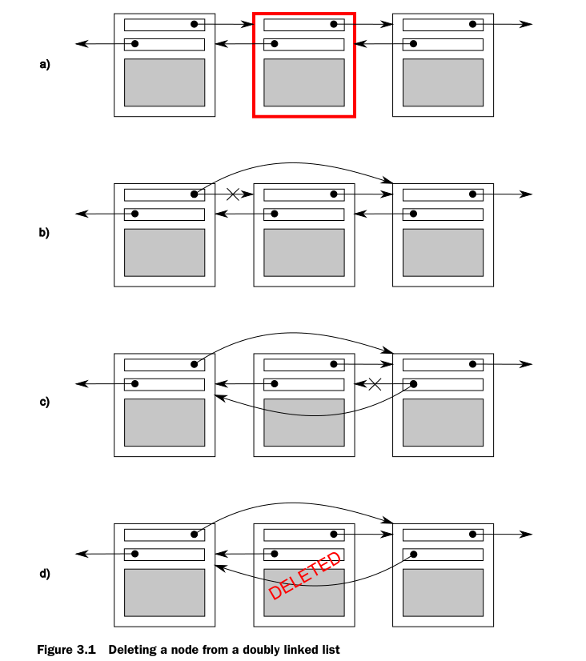

# CPP并发编程
## 1 简单使用
###  目标
> 1. 什么是并发和多线程
> 2. 为什么需要并发和多线程
> 3. c++中的并发史
> 4. 简单实例
### 1.1 什么是并发和多线程
简单说并发就是同一时间点，可以处理不同的事情。比如边走路边说话。
#### 1.1.1 计算机系统中的并发

并发的途径：多进程并发（开销大，通信信号，套接字，文件，管道等，但是更容易编写安全的并发代码如：Erlang），多线程并发（通信，共享内存--解决数据访问不一致的问题）
在资源的角度讲，多线程会减轻操作系统的负担，性能也比较好。所有c++语言进行了支持。但是在线程间通信并没有专门的进行处理。所以这部分需要开发者自己实现。

### 1.2 为什么需要并发和多线程
主要有两个原因：SOC(关注点分离)和性能。
#### 1.2.1 关注点分离
仅仅为了解耦业务逻辑，可以将相关和无关的代码进行解耦。这种方式不再依赖CPU中的可用内核数量。因为对线程的划分是基于概念上的设计，而不是一种增加吞吐量的尝试。
#### 1.2.2为了性能
主要是多核时代的到来。
提升性能有两种：将单个任务进行并行设计（业务效果最明显的）和对数据的并行（对数据的不同部分进行相同的处理例如图像并行计算）。
#### 1.2.3不要盲目使用并发
建立在上面两点的基础上，性能收益比不上成本，或者关注分离不是特别清晰。
其中主要
1. 太多线程占用资源，如32位的4G内存，1M一个线程的话只支持4096个。
2. C/S架构，建议使用线程池
3. 注意线程切换带来的影响

### 1.3 c++中的并发和多线程
#### 1.3.1 c++的多线程史
1998年的c++标准不承认线程的存在，并且各种语言元素的操作效果是按照顺序的抽象机器编写的。不仅如此，内存模型还没有正式定义，因此如果没有编译器特定的扩展，就不能在1998 c++标准编写多线程应用程序。  
当然，编译器供应商可以自由地向该语言添加扩展，而用于多线程的C API(比如POSIX C标准和Microsoft Windows API中的API)的流行使得许多c++编译器供应商使用各种特定于平台的扩展来支持多线程。这种编译器支持通常仅限于允许在平台上使用相应的C API，并确保c++运行时库(例如异常处理机制的代码)在多线程的情况下工作。虽然很少有编译器厂商提供正式的支持多线程的内存模型，但编译器和处理器的实际行为已经足够好，已经编写了大量的多线程c++程序。  
c++程序员不满足于使用特定于平台的C API来处理多线程，他们已经开始寻找类库来提供面向对象的多线程工具。应用程序框架，如MFC和通用框架。诸如Boost和ACE之类的c++库已经积累了一组c++类，这些类包装了底层特定于平台的API，并为简化任务的多线程提供了更高级的工具。虽然类库的精确细节有很大的不同，特别是在启动新线程方面，但是类的总体形状有很多共同之处。 一个特别重要的设计是许多c++类库所共有的，它为程序员提供了相当大的好处， 一直以来使用的资源获取是初始化(RAII)的习惯用法，用锁来确保互斥对象在退出相关作用域时被解锁。  
在许多情况下，现有C ++编译器的多线程支持与特定于平台的API和与平台无关的类库（如Boost和ACE）的可用性相结合，为编写多线程C ++代码提供了坚实的基础，因此有 可能有数百万行C ++代码作为多线程应用程序的一部分编写。 但是缺乏标准支持意味着有时候缺乏线程感知内存模型会导致问题，特别是对于那些试图通过使用处理器硬件知识或者编写跨平台代码来获得更高性能的人来说。 编译器的实际行为因平台而异。
#### 1.3.2 c++新标准中的并发支持
随着新的c++ 11标准的发布，这一切都发生了变化。不仅有一个全新的线程感知内存模型，而且c++标准库已经扩展到包括管理线程的类(参见第2章)，保护共享数据(参见第三章),线程之间的同步操作(参见第4章)和低级原子操作(参见第5章)。  
新的c++线程库在很大程度上是基于通过使用前面提到的c++类库积累的经验。特别是，Boost线程库被用作新库所基于的主要模型，其中许多类与Boost中的相应类和结构相同。随着新标准的发展，这是一个双向流，Boost线程库本身也发生了变化，以匹配c++标准，所以从Boost过渡过来的用户应该会感到非常自在。 
除了线程库，还有一些C++的新特性在附录A中进行扩展。  
另外就是C++的原子操作使得程序员可以不使用汇编语言就可以写一些高效的代码（跨平台）。
#### 1.3.3 c++线程库的效率
C++标准库考虑了跨平台以及对汇编原子操作的封装和抽象。虽然封装了底层操作系统API。但是在应用上其性价比还是比较高的。
#### 1.3.4 特定平台特性
尽管C ++线程库为多线程和并发提供了相当全面的工具，但在任何给定的平台上都会有特定于平台的工具，这些工具超出了所提供的范围。 为了在不放弃使用标准C ++线程库的好处的情况下轻松访问这些工具，C ++线程库中的类型可以提供native_handle（）成员函数，该函数允许使用平台直接操作底层实现 -  特定的API。 就其本质而言，使用native_handle（）执行的任何操作完全取决于平台，并且超出了本书的范围（以及标准C ++库本身）。
### 1.4 体验
好的，所以你有一个漂亮，有光泽的C ++ 11兼容编译器。 接下来是什么？ 多线程C ++程序是什么样的？ 它看起来非常像任何其他C ++程序，通常包含变量，类和函数。 唯一真正的区别是某些功能可能同时运行，因此您需要确保共享数据对于并发访问是安全的，如第3章所述。当然，为了同时运行功能，必须使用特定的功能和对象 管理不同的线程。
#### 1.4.1 入门
让我们从一个经典的例子开始：打印“Hello World”的程序。这里显示了一个非常简单的Hello，World程序在单个线程中运行，当我们移动到多个线程时作为基线：  
```
#pragma once
#include <iostream>
#include <thread>
#include "AbstrctDemo.h"
using namespace std;
class Listing11 :
	public Demo {
public:
	void hello() {
		cout << "hello Concurrent world" << endl;
	}
	void run() override {
		thread t([this]() {
			this->hello();
		});
		t.join();
	}
};
```
所有这个程序都是将“Hello World”写入标准输出流。让我们将它与下面列表中显示的简单Hello，Concurrent World程序进行比较，该程序启动一个单独的线程来显示消息。  
1. 添加头文件
2. 独立的函数
3. join防止主线程提前退出
### 1.5 总结
本章中，提及了并发与多线程的含义,以及在你的应用程序中为什么你会选择使用(或不使用)
它。还提及了多线程在C++中的发展历程，从1998标准中完全缺乏支持，经历了各种平台相
关的扩展，再到新的C++11标准中具有合适的多线程支持。芯片制造商选择了以多核心的形
式，使得更多任务可以同时执行的方式来增加处理能力，而不是增加单个核心的执行速度。
在这个趋势下，C++多线程来的正是时候，它使得程序员们可以利用新的CPU，带来的更加
强大的硬件并发。
## 2 线程管理
> 章节内容
> * 创建线程，指定代码块在新线程的多种方式
> * 等待线程结束，与线程分离
> * 线程的唯一标志  

您已经决定使用多个线程。现在该做什么?如何启动这些线程，如何检查它们是否已经完成，如何对它们进行监视?c++标准库使大多数线程管理任务相对容易，几乎所有通过std::thread对象管理的任务都与给定的线程相关联，您将看到这一点。对于那些不那么简单的任务，库提供了从基本构建块构建所需内容的灵活性。  
我将首先介绍一些基本知识:启动线程、等待它完成，或者在后台运行它。然后，我们将继续研究在线程函数启动时向它传递额外的参数，以及如何将线程的所有权从一个std::thread对象转移到另一个std::thread对象。最后，我们将研究如何选择要使用的线程数量并标识特定的线程。  
### 2.1 线程基本管理
每个c++程序至少有一个线程，由c++运行时启动:运行main()的线程。然后，您的程序可以启动具有另一个函数作为入口点的其他线程。然后，这些线程彼此并发地运行，并与初始线程一起运行。就像程序从main()返回时程序退出一样，当指定的入口点函数返回时，线程退出。正如您将看到的，如果线程有一个std::thread对象，那么您可以等待它完成;但首先你必须启动它，让我们看看启动线程。  
#### 2.1.1 启动线程
正如您在第1章中看到的，线程是通过构造一个std::thread对象开始的，该对象指定在该线程上运行的任务。在最简单的情况下，该任务只是一个普通的空返回函数，不接受任何参数。这个函数在它自己的线程上运行，直到它返回，然后线程停止。在另一个极端,这个任务可以是一个函数对象,需要额外的参数和执行一系列的独立操作,通过某种指定消息传递系统的运行,和线程停止只有当它的信号,再通过某种消息传递系统。线程要做什么或者从哪里启动并不重要，但是使用c++线程库启动线程总是可以归结为构造std::thread对象:  
线程的创建可以提供函数对象的方式，也可以通过lambda表达式进行创建。其中函数对象的时候需要注意。如果使用如下方式，只是进行了函数的声明并没有进行创建。
```
std::thread my_thread(background_task());
```
真正的创建发格式有两种分别如下
```
std::thread my_thread((background_task())); // 1
std::thread my_thread{background_task()}; // 2
```
#### 2.1.2 等待线程结束
主要通过join的方式进行等待线程结束，一般调用join时，特别是在面向对象时，常常析构或者其他方式进行调用，因此通常可以使用joinable先进行判断后再进行调用。
#### 2.1.3 异常等待
一般在多线程中，常常会对一些复杂的操作进行线程创建，避免对主线程的耗时。但是这些复杂的操作使用不当或者其他问题时（如IO等操作）通常会抛出异常，这时就需要对线程的join就需要一些异常的捕获。常见的模式如下。
```
struct func; // 定义在清单2.1中
void f()
{
int some_local_state=0;
func my_func(some_local_state);
std::thread t(my_func);
try
{
do_something_in_current_thread();
}
catch(...)
{
t.join(); // 1
throw;
}
t.join(); // 2
}
```
这样可以通过异常捕获，保证线程退出后，函数才结束。另一种使用的是面向对象的思想。利用RALL(资源获取即初始化的方式)在析构函数中进行join。
#### 2.1.4 后台线程
主要使用detach进行线程的分离（守护线程），需要注意的是线程一旦分离，那么就无法join了。常常对于监听者模式中使用，当对象状态或者其他数据发生变化时。使后台线程进行相应的耗时或者其他模块的业务变化。
### 2.2 将参数传递给线程函数
向线程函数传递参数时需要注意一些非拷贝（指针或者引用）数据的时效性。
### 2.3 转移线程拥有权
主要通过移动语义std::move的方式进行转移。另外该方式的使用的作用主要是扩展线程的使用范围。
### 2.4 选择线程运行数量
这一部分主要与CPU内核有关，常常在项目用为了充分使用cpu的性能选择线程的并发数。
### 2.5 线程识别
每个线程都有一个线程id。win中，线程的id从1开始。
```
std::thread::id master_thread;
void some_core_part_of_algorithm()
{
if(std::this_thread::get_id()==master_thread)
{
do_master_thread_work();
}
do_common_work();
}
```
### 2.6 总结
本章讨论了C++标准库中基本的线程管理方式：启动线程，等待结束和不等待结束(因为需要
它们运行在后台)。并了解应该如何在线程启动前，向线程函数中传递参数，如何转移线程的
所有权，如何使用线程组来分割任务。最后，讨论了使用线程标识来确定关联数据，以及特
殊线程的特殊解决方案。虽然，现在已经可以纯粹的依赖线程，使用独立的数据，做独立的
任务(如同清单2.8)，但在某些情况下，线程确实需要有共享数据。第3章会讨论共享数据和线
程的直接关系。第4章会讨论在(有/没有)共享数据情况下的线程同步操作。
## 3 线程间数据共享
主要内容
> * 共享数据带来的问题
> * 使用互斥量保护数据
> * 数据保护的替代方案
### 3.1 共享数据带来的问题
主要是多个线程对相同的数据进行操作时可能会带来一定的问题。  
不变量(invariants)的概念对程序员们编写的程序会有一定的帮助——对于特殊结构体的描
述；比如，“变量包含列表中的项数”。不变量通常会在一次更新中被破坏，特别是比较复杂的
数据结构，或者一次更新就要改动很大的数据结构。  
双链表中每个节点都有一个指针指向列表中下一个节点，还有一个指针指向前一个节点。其
中不变量就是节点A中指向“下一个”节点B的指针，还有前向指针。为了从列表中删除一个节
点，其两边节点的指针都需要更新。当其中一边更新完成时，不变量就被破坏了，直到另一
边也完成更新；在两边都完成更新后，不变量就又稳定了。   
  
线程间潜在问题就是修改共享数据，致使不变量遭到破坏。当不做些事来确保在这个过程中
不会有其他线程进行访问的话，可能就有线程访问到刚刚删除一边的节点；这样的话，线程
就读取到要删除节点的数据(因为只有一边的连接被修改，如图3.1(b))，所以不变量就被破
坏。破坏不变量的后果是多样，当其他线程按从左往右的顺序来访问列表时，它将跳过被删
除的节点。在一方面，如有第二个线程尝试删除图中右边的节点，那么可能会让数据结构产
生永久性的损坏，使程序崩溃。无论结果如何，都是并行代码常见错误：条件竞争。  
#### 3.1.1 条件竞争
并发中竞争条件的形成，取决于一个以上线程的相对执行顺序，每个线程都抢着完成自己的
任务。大多数情况下，即使改变执行顺序，也是良性竞争，其结果可以接受。例如，有两个
线程同时向一个处理队列中添加任务，因为系统提供的不变量保持不变，所以谁先谁后都不
会有什么影响。当不变量遭到破坏时，才会产生条件竞争，比如双向链表的例子。并发中对
数据的条件竞争通常表示为恶性条件竞争，我们对不产生问题的良性条件竞争不感兴
趣。 C++  标准中也定义了数据竞争这个术语，一种特殊的条件竞争：并发的去修改一个独立
对象(参见5.1.2节)，数据竞争是(可怕的)未定义行为的起因。  
当完成一个操作需要修改两个或多个不同的数据片段时，通常会出现有问题的竞态条件，例如示例中的两个链接指针。因为操作必须访问两个单独的数据片段，所以必须在单独的指令中修改它们，并且当其中一个操作已经完成时，另一个线程可能会访问数据结构。竞争条件通常很难找到，也很难复制，因为机会的窗口很小。如果修改是作为连续的CPU指令进行的，则出现prob的机会  
#### 3.1.2 避免恶性条件竞争
主要有3种方式
1. 对数据结构进行保护，确保只有修改线程才能看到不变量被破坏的中间状态。
2. 无锁编程（原子化）
3. 事务支持（c++还不支持）
### 3.2 使用互斥量保护共享数据
当访问共享数据前，使用互斥量将相关数据锁住，再当访问结束后，再将数据解锁。线程库
需要保证，当一个线程使用特定互斥量锁住共享数据时，其他的线程想要访问锁住的数据，
都必须等到之前那个线程对数据进行解锁后，才能进行访问。这就保证了所有线程能看到共
享数据，而不破坏不变量。
#### 3.2.1 C++中使用互斥量
C++中通过实例化 std::mutex  创建互斥量，通过调用成员函数lock()进行上锁，unlock()进行
解锁。不过，不推荐实践中直接去调用成员函数，因为调用成员函数就意味着，必须记住在
每个函数出口都要去调用unlock()，也包括异常的情况。C++标准库为互斥量提供了一个RAII
语法的模板类 std::lock_guard  ，其会在构造的时候提供已锁的互斥量，并在析构的时候进行
解锁，从而保证了一个已锁的互斥量总是会被正确的解锁。下面的程序清单中，展示了如何
在多线程程序中，使用 std::mutex  构造的 std::lock_guard  实例，对一个列表进行访问保
护。 std::mutex  和 std::lock_guard  都在 <mutex>  头文件中声明。
#### 3.2.2 精心组织代码来保护共享数据
使用互斥量来保护数据，并不是仅仅在每一个成员函数中都加入一个 std::lock_guard  对象那
么简单；一个迷失的指针或引用，将会让这种保护形同虚设。不过，检查迷失指针或引用是
很容易的，只要没有成员函数通过返回值或者输出参数的形式向其调用者返回指向受保护数
据的指针或引用，数据就是安全的。如果你还想往祖坟上刨，就没这么简单了。在确保成员
函数不会传出指针或引用的同时，检查成员函数是否通过指针或引用的方式来调用也是很重
要的(尤其是这个操作不在你的控制下时)。函数可能没在互斥量保护的区域内，存储着指针或
者引用，这样就很危险。  
#### 3.2.3 发现接口内在的条件竞争 
因为使用了互斥量或其他机制保护了共享数据，就不必再为条件竞争所担忧吗？并不是，你
依旧需要确定数据受到了保护。回想之前双链表的例子，为了能让线程安全地删除一个节
点，需要确保防止对这三个节点(待删除的节点及其前后相邻的节点)的并发访问。如果只对指
向每个节点的指针进行访问保护，那就和没有使用互斥量一样，条件竞争仍会发生——除了
指针，整个数据结构和整个删除操作需要保护。
1. 通过引用传入值
2. 通过非抛出异常的拷贝和移动构造
3. 返回指向弹出值的指针。
#### 3.2.4 死锁问题以及解决方案
一对线程需要对他们所有的互斥量做一些操作，其中每个线程都有一个互斥量，且等待另一个解锁。这样没有线程能工作，因为他们都在等待对方释放互斥量。这种情况就是死锁，它的最大问题就是由两个或两个以上的互斥量来锁定一个操作。  
一般的建议是：以相同的顺序获取锁（但是交换两个相同结构--具有锁的情况时会产品问题）
结果方案：
```
// 这里的std::lock()需要包含<mutex>头文件
class some_big_object;
void swap(some_big_object& lhs,some_big_object& rhs);
class X
{
private:
some_big_object some_detail;
std::mutex m;
public:
X(some_big_object const& sd):some_detail(sd){}
friend void swap(X& lhs, X& rhs)
{
if(&lhs==&rhs)
return;
std::lock(lhs.m,rhs.m); // 1
std::lock_guard<std::mutex> lock_a(lhs.m,std::adopt_lock);
// 2
std::lock_guard<std::mutex> lock_b(rhs.m,std::adopt_lock);
// 3
swap(lhs.some_detail,rhs.some_detail);
}
};
```
#### 3.2.5 死锁避免
1. 避免锁嵌套
2. 避免在持有锁时调用用户提供的代码
3. 使用固定顺序获取锁
4. 使用锁的层次结构  
即为每一个锁分配层号，当线程想获取锁时，如果该层锁已经被低层锁持有，那么上锁失败。   
锁的层次结构其实就是锁的一个包装类上进行使用，使用时候所都是有层级的。   
```
//
// Created by RS on 2019/1/29.
//

#ifndef CLION_HIERARCHICALMUTEX_H
#define CLION_HIERARCHICALMUTEX_H


#include <mutex>

class HierarchicalMutex {
     std::mutex internalMutex;
     uint64_t  const hierarchyValue;
     uint64_t previousHierarchyValue;
     static  thread_local uint64_t thisThreadHierarchyValue;
     void checkForHierarchyViolation(){
         if(thisThreadHierarchyValue<=hierarchyValue){
             throw  std::logic_error("mutex hierarchy violated");
         }
     }
     void updateHierarchyValue(){
         previousHierarchyValue=thisThreadHierarchyValue;
         thisThreadHierarchyValue=hierarchyValue;
     }

public:
    explicit HierarchicalMutex(uint64_t value):hierarchyValue(value),
                                               previousHierarchyValue(0){

     }
     void lock(){
         checkForHierarchyViolation();
         internalMutex.lock();
         updateHierarchyValue();
     }
     void unlock(){
         thisThreadHierarchyValue=previousHierarchyValue;
         internalMutex.unlock();
     }
     bool try_lock(){
         checkForHierarchyViolation();
         if(!internalMutex.try_lock()){
             return  false;
         }
         updateHierarchyValue();
         return true;
     }
};
#endif //CLION_HIERARCHICALMUTEX_H
```
#### 3.2.6 独占锁(std::unique_lock)
std::unqiue_lock  使用更为自由的不变量，这样 std::unique_lock  实例不会总与互斥量的数据类型相关，使用起来要比 std:lock_guard  更加灵活。    
1. std::adopt_lock作为第二个参数传入构造函数，可以对互斥量进行管理   
2. std::defer_lock作为第二个参数传递进去，表明互斥量应保持解锁状态。   
```
.h
//
// Created by RS on 2019/1/30.
//
#ifndef CLION_DEMO39_H
#define CLION_DEMO39_H
#include <mutex>
#include <iostream>
#include "Abstruct.h"
class BigObj{
public:
    BigObj(int x1,int y1):x(x1),y(y1){}
    int x=0;
    int y=0;
};
void swap3(BigObj &left,BigObj &right);
class Demo39 :public Abstruct{
public:
    BigObj sodata;
    std::mutex mutex;
public:
    Demo39(BigObj const& sd):sodata(sd){}
    friend void swap(Demo39 & lhs,Demo39& rhs);
    void run() override {
        BigObj obj1({2,3});
        BigObj obj2({4,5});
        Demo39 demo39(obj1);
        Demo39 demo391(obj2);
        std::cout<<demo39.sodata.x<<std::endl;
        swap(demo39,demo391);
        std::cout<<demo39.sodata.x<<std::endl;
    }
};
#endif //CLION_DEMO39_H
.cpp
//
// Created by RS on 2019/1/30.
//

#include "Demo39.h"

void swap3(BigObj &left,BigObj &right){
    BigObj tmp=left;
    left=right;
    right=tmp;
}

void swap(Demo39 &lhs, Demo39 &rhs) {
    if(&lhs==&rhs){
        return;
    }
    std::unique_lock<std::mutex> lock_a(lhs.mutex,std::defer_lock);
    std::unique_lock<std::mutex> lock_b(rhs.mutex,std::defer_lock);
    std::lock(lock_a,lock_b);//互斥量在这里上锁
    swap3(lhs.sodata,rhs.sodata);
}
```
> 需要注意：由于std::unique_lock对象一般比std::lock_guard大，功能也多，因此性能没有std::lock_guard好。
#### 3.2.7 不同域中互斥量所有权的传递
如果源是左值那么可以直接返回，如果是右值，那么需要显式的调用移动成左值。
```
/**
* 网关方法
**/
std::unique_lock<std::mutex> getLock(){
    extern std::mutex someMutex;
    std::unique_lock<std::mutex> lk(someMutex);
    prepareData();
    return  lk;
}
void processData(){
    std::unique_lock<std::mutex> lk(getLock());
    doSomeThing();
}
```
#### 3.2.8 锁的粒度
主要是锁的时间以及频率。
### 3.3 保护共享数据的替代设施
C++  标准提供了一种纯粹保护共享数据初始化过程的机制。（主要是一些只读数据的创建） 
#### 3.3.1 保护共享数据的初始化过程
//比如单例模式中使用双重检查锁的方式对其进行构建。
```
void foo() {
        std::unique_lock<std::mutex> lk(resource_mutex);//所有县城在此进行序列化
        if(!resource_ptr){
            resource_ptr.reset(new SomeResource);
        }
        lk.unlock();
        resource_ptr->dosomething();
    }
    void undefined_behaiour_with_doble_checked_locking(){
        if(!resource_ptr){//第一次校验
            std::lock_guard<std::mutex> lk(resource_mutex);
            if(!resource_ptr){//第二次校验
                resource_ptr->reset();
            }
        }
        resource_ptr->dosomething();
    }
```
其实双重校验存在潜在的条件竞争，因为没有未被锁保护的的读取操作没有与其他线程里被锁保护的写入操作进行同步。因此就会产生条件竞争。所以c++进行了标准库的提供。使得条件竞争的处理更为方便。  
标准库方案：std::once_flag与std::call_once的使用。  
#### 3.3.2 保护很少更新的数据结构
试想，为了将域名解析为其相关IP地址，我们在缓存中的存放了一张DNS入口表。通常，给
定DNS数目在很长的一段时间内保持不变。虽然，在用户访问不同网站时，新的入口可能会
被添加到表中，但是这些数据可能在其生命周期内保持不变。所以定期检查缓存中入口的有
效性，就变的十分重要了；但是，这也需要一次更新，也许这次更新只是对一些细节做了改
动。
对于这种类型的操作最方便的是读写锁，但是标准委员会并未通过。但是对于boost委员会通过了，因此对于boost开发者可能读写锁的方式比价简便。 
   
因此对于更新操作，可以使用std::lock_gurad<boost::shared_mutex> 和std::unique_lock<boost::shared_mutex>上锁。对于查询或者读取操作只需要使用boost::shared_lock<boost::shared_mutex>获取访问权。    
**需要注意的是共享锁并不是万能的，对于多核处理器器性能上的收益需要反复验证才可以使用。**  
demo:
```
class dns_entry{

};
class dns_cache{
    std::map<std::string ,dns_entry> entrys;
    mutable boost::shared_mutex entryMutex;
public:
    dns_entry findEntry(std::string const & domain)const {
        boost::shared_lock<boost::shared_mutex> lk(entryMutex);
        auto const it=entrys.find(domain);
        return (it==entrys.end())? dns_entry():it->second;
    }
    void update_or_add_entry(std::string const & domain,dns_entry const & dnsDetails){
        std::lock_guard<boost::shared_mutex> lk(entryMutex);
        entrys[domain]=dnsDetails;
    }
};
```
#### 3.3.3 锁的嵌套
这种方式首先不推荐使用。大多数情况下如果使用该方式，那么就需要对你的设计进行改动了。
使用是使用std::recursive_mutex作为互斥信号。需要注意的是当你lock3次的时候，就需要对其unlock3次（允许同一线程重复锁住互斥信号）
### 3.4 本章总结
主要讨论数据共享时引起的问题。比如死锁，std::call_once()和boost::shared_mutex等。  
需要注意的另一方面没有考虑的就是等待其他线程作为输入情况的。常见的比如，生产者消费者分别处于两个线程时，我们需要一些方法让一个线程等待其他线程完成任务，但在等待过程中不占用CPU就需要进行同步并发的操作
## 4 同步并发操作
> 本章主要内容
> * 等待时间
> * 带有期望的等待一次性事件
> * 在限定时间内等待
> * 使用同步操作简化代码  
上一章仅仅谈了数据的保护的问题。当还想对单独的线程进行同步的时候。例如在一个线程完成前，可能需要等待两一个线程执行完成。这就需要线程等待一个特定时间的发生，或者等待某一个条件达成。这可能需要定期检查“任务完成标识”，或将类似的东西放到共享数据中，但是这与理想情况还是差很多。像这种情况就需要在线程中进行同步，c++标准提供类一些比较简便的同步工具（其他语言也有类似的方案），cpp中形式上表现为条件变量和期望。
### 4.1 等待一个事件或者其他条件
当一个线程等待另一个线程完成任务时
1. 持续检查共享数据标志（用于做保护工作的互斥量--消耗cpu严重），直到另一个线程完成工作时重设该位。
2. 周期性间歇的方法（std::this_thread::sleep_for()）
```
    bool flag;
    std::mutex m;
    void waitForFlag(){
        std::unique_lock<std::mutex> lk(m);
        while (!flag){
            lk.unlock();
            std::this_thread::sleep_for(std::chrono::milliseconds(200));
            lk.lock();
        }
    }
```
3. 条件变量（等待唤醒机制--推荐）
#### 4.1.1
c++标准库对条件变量有两套实现：std::condition_variable 和std::condition_variable_any。两者都依赖与一个互斥量（为了同步）；前者仅限于std::mutex一起工作，而后者可以和任何满足最低标准的互斥量一起工作，从而加上了_any的后缀。因为后者更为通用，因此可能会有额外的开销。只有当对灵活性有硬性要求时才使用后者。  
demo
```
    std::mutex mut;
    std::queue<int> data_queue;
    std::condition_variable data_cond;

    bool moreDataToPrepare() {
        return false;
    }

    void dataPreparationThread() {
        while (moreDataToPrepare()) {
            int const data = 3;//生产数据
            std::lock_guard<std::mutex> lk(mut);
            data_queue.push(data);
            data_cond.notify_one();
        }
    }
    bool isLast(int da){//终止条件
        return false;
    }
    void dataProcessingThread(){
        while (true){
            std::unique_lock<std::mutex> lk(mut);
            data_cond.wait(lk,[]{return !data_queue.empty();});//lambda表达式作为等待的条件..如果为false阻塞并解锁，当条件复杂的时候可以传入函数对象
            int data=data_queue.front();
            data_queue.pop();
            lk.unlock();
//            ..dosomething
            if(isLast(data)){
                break;
            }
        }
    }
```
需要注意dataProcessingThread方法中使用的是unique_lock.因为wait检查当不满足lambda表达式时，就会阻塞并且等待。当准备数据的线程调用notify_one时，处理数据线程就会苏醒，从新获取互斥所。并且对条件再次进行检查，当满足条件时，就会返回，并继续持有锁。这就是为什么使用unique_lock。（如果使用了lock_guard那么线程会在睡眠期间保持锁住状态，这样生产者就无法获取到互斥量）  
在调用wait()的过程中，一个条件变量可能会去检查给定条件若干次；然而，它总是在互斥量被锁定时这样做，当且仅当提供测试条件的函数返回true时，它就会立即返回。当等待线程重新获取互斥量并检查条件时，如果它并非直接响应另一个线程的通知，这就是所谓的伪唤醒(spurious wakeup)。因为任何伪唤醒的数量和频率都是不确定的，这里不建议使用一个有副作用的函数做条件检查。当你这样做了，就必须做好多次产生副作用的心理准备。
#### 4.1.2 使用条件变量构建线程安全队列
demo
``` .h
template<typename T>
class ThreadSafeQueue {
public:
    ThreadSafeQueue() {

    }

    ThreadSafeQueue(const ThreadSafeQueue &other) {
        std::lock_guard<std::mutex> lk(mut);
        data_queue=other.data_queue;
    }

    ThreadSafeQueue &operator=(const ThreadSafeQueue &)= delete;//不允许简单的赋值
    void push(T newValue);

    bool tryPop(T &value);

    std::shared_ptr<T> tryPop();

    void waitAndPop(T &value);

    std::shared_ptr<T> waitAndPop();

    bool empty() const;

private:
    mutable std::mutex mut;//1 互斥量必须是可变的
    std::queue<T> data_queue;
    std::condition_variable data_cond;
};
```
```.cpp
//
// Created by RS on 2019/2/12.
//

#include <iostream>
#include "Demo43.h"


template<typename T>
void ThreadSafeQueue<T>::waitAndPop(T &value) {
    std::unique_lock<std::mutex> lk(mut);
    data_cond.wait(lk, [this] { return !data_queue.empty(); });
    value = data_queue.front();
    data_queue.pop();
}

template<typename T>
std::shared_ptr<T> ThreadSafeQueue<T>::waitAndPop() {
    std::unique_lock<std::mutex> lk(mut);
    data_cond.wait(lk,[this]{return ! data_queue.empty();});
    std::shared_ptr<T> res(std::make_shared<T>(data_queue.front()));
    data_queue.pop();
    return  res;
}

template<typename T>
bool ThreadSafeQueue<T>::tryPop(T &value) {
    std::lock_guard<std::mutex> lk(mut);
    if(data_queue.empty())
        return false;
    value=data_queue.front();
    data_queue.pop();
    return true;
}

template<typename T>
std::shared_ptr<T> ThreadSafeQueue<T>::tryPop() {
    std::lock_guard<std::mutex> lk(mut);
    if(data_queue.empty()){
        return std::shared_ptr<T> ();
    }
    std::shared_ptr<T> res(std::make_shared<T>(data_queue.front()));
    data_queue.pop();
    return res;
}

template<typename T>
bool ThreadSafeQueue<T>::empty() const {
    std::lock_guard<std::mutex> lk(mut);
    return data_queue.empty();
}

template<typename T>
void ThreadSafeQueue<T>::push(T newValue) {
    std::lock_guard<std::mutex> lk(mut);
    data_queue.push(newValue);
    data_cond.notify_one();
}
```
线程安全的队列对于pop采用了两种方式，一种是等待，一种是返回空的方式。对于单独的任务线程使用wait方式比较合适。  
需要注意，当线程只等待一次，当条件为true时，它就不会再等待条件变量了。所以一个条件变量可能并非同步机是最好的选择，尤其是，条件在等待一组可用的数据块时。在这种情况下，Future就是一个合适的选择了。
### 4.2 使用future等待一次性事件
C++标准库模型中将等待一次性事件成为期望(future)有两种形式,唯一期望(std::future<>)和共享期望(std::shared_future<>).std::future<>实例只能与一个指定事件相关联，而std::shared_future的实例就能关联多个事件。后者的实现，所有实例都会同时变成就绪状态，并且他们可以访问与事件相关的任何数据。需要注意，其同步过程仍然必须使用互斥量或者类似同步机制进行访问保护。不过当多个线程对一个std::shared_future<>实例的副本进行访问，是不需要期望同步的。  
最基本的一次性事件，就是一个后台运行处的计算结果。  
#### 4.2.1 带返回值的后台任务
假设，你有一个需要长时间的运算，你需要其能计算出一个有效的值，但是你现在并不迫切需要这个值。可能你已经找到了生命、宇宙，以及万物的答案，就像道格拉斯·亚当斯[1]一样。你可以启动一个新线程来执行这个计算，但是这就意味着你必须关注如何传回计算的结果，因为std::thread并不提供直接接收返回值的机制。这里就需要std::async函数模板(也是在头文<future>中声明的)了。  
当任务的结果你不着急要时，你可以使用std::async启动一个异步任务。与std::thread对象等待的方式不同，std::async会返回一个std::future对象，这个对象持有最终计算出来的结果。当你需要这个值时，你只需要调用这个对象的get()成员函数；并且会阻塞线程直到“期望”状态为就绪为止；之后，返回计算结果。下面清单中代码就是一个简单的例子。  
```
#include <future>
#include <iostream>
int find_the_answer_to_ltuae();
void do_other_stuff();
int main()
{
  std::future<int> the_answer=std::async(find_the_answer_to_ltuae);
  do_other_stuff();
  std::cout<<"The answer is "<<the_answer.get()<<std::endl;
}
```

#### 4.2.2 任务与期望
#### 4.2.3 使用std::promises
#### 4.2.4 为“期望”存储“异常”
#### 4.2.5 多个线程的等待

### 4.3 限定等待时间
### 4.4 使用同步操作简化代码
### 4.5 本章总结
## 5 c++内存模型和对原子类型的操作
## 6 设计基于锁的并发数据结构
## 7 设计无锁并发数据结构
## 8 设计并发代码
## 9 线程管理强化
## 10 测试和调试多线程应用程序

## 附录A c++ 11语言特性
## 附录B 并发库的简要比较
## 附录C 一个消息传递框架和完整的ATM示例
## 附录D C++线程库API
