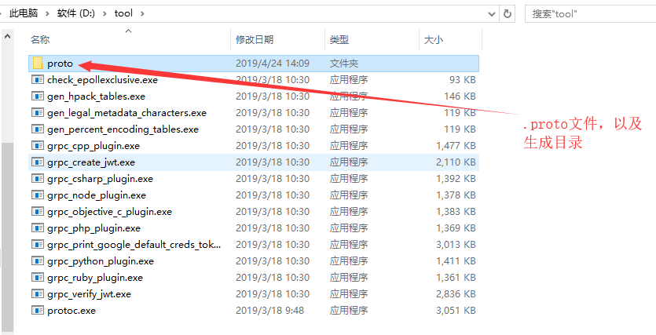
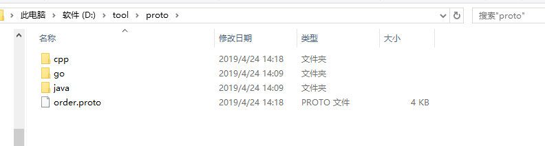
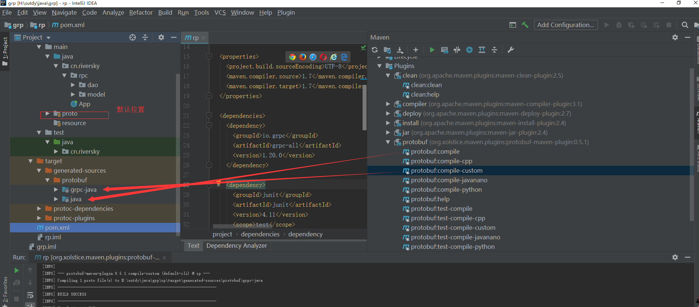
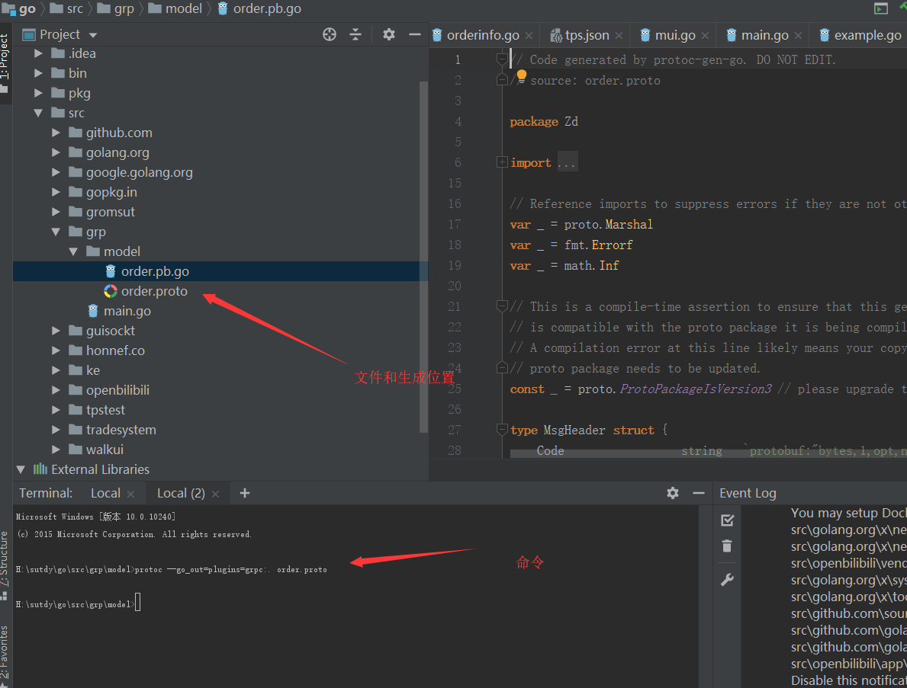

# 1. 定义
```
syntax ="proto3";
option java_multiple_files=true;
option java_package ="cn.riversky.zd.rpc.model";
option java_outer_classname="ZdOrder";
package zd;
message MsgHeader{
    string code=1;
    string localSystemCode=2;
    string systemCode=3;
    string todayCanUse=4;
    string  errorCode=5;
    string accountNo=6;
    string exchangeCode=7;
    string clientNo=8;
    string errorMsg=9;
}
message ReqOrder{
    MsgHeader header=1;
    string userId=2;
    string systemId=3;
    string incId=4;
    string bidOrAsk=5;
    double premium=6;//
    int64 quantity=7;
    double limitPremium=8;
    uint32  block=9;
    string orderType=10;
    string dataType=11;
    uint32 date=12;
    string triggerDateType=13;
    uint32  triggerDate=14;
    string  account=15;
}
message ResOrder{
    MsgHeader header=1;
    uint64 orderNumber=17;
    int64 quantity=2;
    double limitPremium=3;
    double premium=4;
    string orderType=5;
    string systemId=6;
    string incId=7;
    string bidOrAsk=8;
    string orderType2=9;
    string orderId=10;
    string dateType=11;
    string userId=12;
    //返回的时间UTC
    uint32  tvSec=13;
    int32  tvNsec=14;
    //boost::posix_time::ptime start_time;
    bool combo=15;
    bool result=16;
}
message ReqUpdate{
    string systemId=1;
    string localSystem=2;
    string customerId=3;
    string incId=4;
    int64 orderNumber=5;
    string bidOrAsk=6;
    double  oldPremium=7;
    double newPremium=8;
    int64 orginQuantity=9;
    int64 newQuantity=10;
    string account=11;
    double oldTriggerPrice=12;
    double newTriggerPrice=13;
    int64 minDealQuantity=14;
}
message ResUpdate{
    uint64 orderId=1;
    int64 orgQuantity=2;
    int64 remainingQuantity=3;
    double premium=4;
    double limitPremium=5;
    uint32  tvSec=6;
    int32   tvNsec=7;
    string incId=8;
    string orderType=9;
    string systemId=10;
    string localSystem=11;
    string customerId=12;
    string account=13;
    string errorCode=14;
    string errorMsg=15;
    uint32  bidOrAsk=16;
    uint32  changeReason=17;
    bool combo=18;
}
message ReqDelete{
    string incId=1; //合约id
    int64 orderNumber=2; //单号
    string bidOrAsk=3; //买卖方向
    string account=4;
    string systemId=5;
    string localSystem=6;
    string customerId=7;
}
message ResDelete{
    int64 orderNumber=1; //单号 交易所单号
    string systemId=2;
    string customerId=3;
    string localSystem=4;
    string incId=5;
    string account=6;
    string orderType=7;
    int64 quantity=8;
    int64 remainingQuantity=9; //剩余量
    int64 cancelQuantity=10;

    uint32  tvSec=11;
    int32  tvNsec=12;
    uint32 bidOrAsk=13;
    uint32  changeReason=14;
    string code=15;
    string msg=16;
    bool combo=17;
    bool dealySend=18;
}
//成交信息
message DealInfo{
    uint64 orderNumber=1;
    int64 tradeNumber=2;
    int64 dealQuantity=3;
    int64 remQuantity=4;
    double dealPrice=5;
    uint32 tvSec=6;
    int32 tvNsec=7;
    string dealDate=8; //成交日期
    string dealTime=9; //成交时间
    string systemId=10; //系统号
    string customerId=11;
    string localSystem=12;
    string incId=13;
    string buyOrAsk=14;
    string account=15;
    bool combo=16;
}
message DealRep{
    string msg=1;
}
service OrderDao{
    rpc InsertOrder(ReqOrder) returns (ResOrder){}
    rpc UpdateOrder(ReqUpdate) returns (ResUpdate){}
    rpc DeleteOrder(ReqDelete)returns (ResDelete){}
    rpc SendDealInfo(DealInfo)returns (DealRep ){}
}
```
# 2. 生成  
  
  
这里主要生成cpp  go java版本

## 2.1. cpp 版本
```
protoc -I ./proto --cpp_out ./proto/cpp  --grpc_out ./proto/cpp --plugin=protoc-gen-grpc=grpc_cpp_plugin  order.proto

./protoc -I ./proto --cpp_out ./proto/cpp  --grpc_out ./proto/cpp --plugin=protoc-gen-grpc=./grpc_cpp_plugin.exe  zdrpc.proto
```
## 2.2. java版本  

```
protoc -I ./proto --java_out ./proto/java --grpc_out ./proto/java --plugin=protoc-gen-grpc=grpc_java_plugin  order.proto
```
需要与IDEA或者其他的IDE中利用maven或者gradle使用
maven 方案
依赖
```
<dependency>
      <groupId>io.grpc</groupId>
      <artifactId>grpc-all</artifactId>
      <version>1.20.0</version>
</dependency>
```
生成
```
<build>
    <extensions>
      <extension>
        <groupId>kr.motd.maven</groupId>
        <artifactId>os-maven-plugin</artifactId>
        <version>1.5.0.Final</version>
      </extension>
    </extensions>
    <plugins>
      <plugin>
        <groupId>org.xolstice.maven.plugins</groupId>
        <artifactId>protobuf-maven-plugin</artifactId>
        <version>0.5.1</version>
        <configuration>
          <protocArtifact>com.google.protobuf:protoc:3.7.1:exe:${os.detected.classifier}</protocArtifact>
          <pluginId>grpc-java</pluginId>
          <pluginArtifact>io.grpc:protoc-gen-grpc-java:1.20.0:exe:${os.detected.classifier}</pluginArtifact>
        </configuration>
        <executions>
          <execution>
            <goals>
              <goal>compile</goal>
              <goal>compile-custom</goal>
            </goals>
          </execution>
        </executions>
      </plugin>
    </plugins>
  </build>
```
>>  生成时需要注意1. 在main下建立proto文件夹（proto在里面）  2.生成方案如图  
  
gradle 方案
```
android 
compile 'io.grpc:grpc-okhttp:1.20.0'
compile 'io.grpc:grpc-protobuf-lite:1.20.0'
compile 'io.grpc:grpc-stub:1.20.0'
非安卓依赖
compile 'io.grpc:grpc-netty-shaded:1.20.0'
compile 'io.grpc:grpc-protobuf:1.20.0'
compile 'io.grpc:grpc-stub:1.20.0'
```
生成  
```
apply plugin: 'com.google.protobuf'

buildscript {
  repositories {
    mavenCentral()
  }
  dependencies {
    classpath 'com.google.protobuf:protobuf-gradle-plugin:0.8.8'
  }
}

protobuf {
  protoc {
    artifact = "com.google.protobuf:protoc:3.7.1"
  }
  plugins {
    grpc {
      artifact = 'io.grpc:protoc-gen-grpc-java:1.20.0'
    }
  }
  generateProtoTasks {
    all()*.plugins {
      grpc {}
    }
  }
}
```
## 2.3. Go 生成  
```
go get -u github.com/golang/protobuf/protoc-gen-go 
git clone https://github.com/grpc/grpc-go.git $GOPATH/src/google.golang.org/grpc
git clone https://github.com/golang/net.git $GOPATH/src/golang.org/x/net    
git clone https://github.com/golang/text.git $GOPATH/src/golang.org/x/text    
go get -u github.com/golang/protobuf/{proto,protoc-gen-go}   
git clone https://github.com/google/go-genproto.git $GOPATH/src/google.golang.org/genproto

cd $GOPATH/src/  
go install google.golang.org/grpc
```
生成命令
  
```
protoc --go_out=plugins=grpc:. order.proto
```
## python生成


# 3. 服务端创建

## C++
```
#pragma once
#include "order.grpc.pb.h"
#include <iostream>
#include <memory>
#include <string>
#include <grpcpp/grpcpp.h>
using namespace Zd;
using namespace grpc;
/**
 *发送端
 *Date :[4/24/2019 ]
 *Author :[RS]
 */
class OrderServer final :public Zd::OrderCommunicationDao::Service
{
public:
	OrderServer();
	~OrderServer();
public:
	virtual Status InsertOrder(::grpc::ServerContext* context, const ReqOrder* request, ResOrder* response) override;
	virtual Status UpdateOrder(::grpc::ServerContext* context, const ReqUpdate* request, ResUpdate* response)override;
	virtual Status DeleteOrder(::grpc::ServerContext* context, const ReqDelete* request, ResDelete* response)override;
public:
	void static Start() {
		std::thread t([]() {
			std::string serviceadd("192.168.1.159:50051");
			ServerBuilder builder;
			OrderServer server;
			builder.AddListeningPort(serviceadd, InsecureServerCredentials()).RegisterService(&server);
			std::unique_ptr <Server> serv(builder.BuildAndStart());
			serv->Wait();
		});
		t.detach();
	}
};
```
## Java
```
package cn.riversky.rpc.server;

import cn.riversky.rpc.dao.OrderCommunicationDaoGrpc;
import cn.riversky.rpc.model.*;
import io.grpc.Server;
import io.grpc.ServerBuilder;
import io.grpc.stub.StreamObserver;
import org.slf4j.Logger;
import org.slf4j.LoggerFactory;

import java.io.IOException;

public class OrderServer extends OrderCommunicationDaoGrpc.OrderCommunicationDaoImplBase {
    public static final Logger LOGGER= LoggerFactory.getLogger(OrderServer.class);
    @Override
    public void insertOrder(ReqOrder request, StreamObserver<ResOrder> responseObserver) {
        ResOrder order=ResOrder.newBuilder().setIncId("HIS").build();
        responseObserver.onNext(order);
        responseObserver.onCompleted();
    }

    @Override
    public void updateOrder(ReqUpdate request, StreamObserver<ResUpdate> responseObserver) {
        super.updateOrder(request, responseObserver);
    }

    @Override
    public void deleteOrder(ReqDelete request, StreamObserver<ResDelete> responseObserver) {
        super.deleteOrder(request, responseObserver);
    }
    public static void Start(int port) throws IOException {
        Server server;
        server= ServerBuilder.forPort(port)
                .addService(new OrderServer())
                .build().start();
        LOGGER.info("Server started,litening on "+port);
        Runtime.getRuntime().addShutdownHook(new Thread(()->{
            LOGGER.error("shortdown");
            server.shutdown();
        }));

    }

    public static void main(String[] args)  {
        try {
            Start(50051);
            Thread.sleep(100000000);
        } catch (IOException e) {
            e.printStackTrace();
        } catch (InterruptedException e) {
            e.printStackTrace();
        }


    }
}

```
## Go
```
package grp

import (
	"context"
	"google.golang.org/grpc"
	"grp/model"
	"log"
	"net"
)
const (
	port=":50051"
)
type server struct {
}
func (s* server)InsertOrder(ctx context.Context,in *Zd.ReqOrder)(* Zd.ResOrder, error){
	log.Printf("Received:%v",in.IncId)
	return &Zd.ResOrder{IncId:address},nil
}
func (s* server)UpdateOrder(ctx context.Context ,in *Zd.ReqUpdate)(*Zd.ResUpdate, error)  {
	log.Printf("Received:%v",in.IncId)
	return &Zd.ResUpdate{IncId:address},nil
}
func (s* server)DeleteOrder(ctx context.Context ,in *Zd.ReqDelete)( *Zd.ResDelete, error)  {
	log.Printf("Received:%v",in.IncId)
	return &Zd.ResDelete{IncId:address},nil
}
func StartServer(){
	listener, e := net.Listen("tcp", port)
	if e!=nil{
		log.Println("fialed to listen")
	}
	s := grpc.NewServer()
	Zd.RegisterOrderCommunicationDaoServer(s,&server{})
	if err:=s.Serve(listener);err!=nil{
		log.Println("faile to server:",err)
	}
}
```
# 4. 客户端创建
## java 
```
public class App {
    public static final Logger logger= LoggerFactory.getLogger(App.class);
    public static void main(String[] args) throws InterruptedException {
        long l = System.nanoTime();
        init();
        long l2 = System.nanoTime();
        logger.error("平均性能每单:{}豪秒", (l2-l)/1000/1000000);
    }

    public static void init() {
        OrderStub localhost = new OrderStub("192.168.1.159", 50051);
        ReqOrder order = ReqOrder.newBuilder().build();
        Integer loop = 1000;

//        ExecutorService executorService = Executors.newFixedThreadPool(4);
        for (int j = 0; j < loop; j++) {
//            executorService.submit(() -> {
                localhost.inSertOrder(order);
//            });
        }
    }
}
```
## go
```
import (
	"golang.org/x/net/context"
	"google.golang.org/grpc"
	"grp/model"
	"log"
	"time"
)

const(
	address="192.168.1.159:50051"
)
func Start(){
	conn, e := grpc.Dial(address, grpc.WithInsecure())
	if e!=nil{
		log.Fatalf("did not connect:%v",e)
	}
	defer conn.Close()
	c:=Zd.NewOrderCommunicationDaoClient(conn)
	ctx, cancel := context.WithTimeout(context.Background(), time.Second)
	defer cancel()
	loop:=10000
	time1 := time.Now()
	for  i :=0;i< loop;i++ {
		resOrder, err := c.InsertOrder(ctx, &Zd.ReqOrder{IncId: address})
		if err!=nil{
			log.Println("count not gree")
		}
		log.Println("%v",resOrder)
	}
	elapsed := time.Since(time1)
	log.Println("耗时:",elapsed/10000)
}
```
## cpp 
```
class Client
{
public:
	Client(std::shared_ptr<grpc::Channel> channel) :stub_(OrderCommunicationDao::NewStub(channel)) {}
	~Client() {}
	bool InsertOrder(const ReqOrder& req, ResOrder & res) {
		//客户端的上下文。它可以用来传达额外的信息     
		//服务器和/或调整某些RPC行为。
		grpc::ClientContext context;
		auto status = stub_->InsertOrder(&context, req, &res);
		if (status.ok()) {
			return true;
		}
		else {
			std::cout << status.error_code() << ": " << status.error_message()
				<< std::endl;
			return false;
		}
	}
public:
	static void Test() {
		utils::TimerClock timer;
		Client clent(grpc::CreateChannel("192.168.1.159:50051", grpc::InsecureChannelCredentials()));
		ReqOrder req;
		ResOrder res;
		int loop = 1000;
		timer.reset();
		for (int i = 0; i < loop; ++i)
		{
			if (clent.InsertOrder(req, res)) {
				std::cout << res.incid() << std::endl;
			}
		}
		auto rest = timer.getMills();
		std::cout << "耗时:" << rest / loop << "毫秒" << std::endl;
	}
private:

	std::unique_ptr<Zd::OrderCommunicationDao::Stub> stub_;
};
```
# 性能比较  
|服务端\客户端|cpp|go|java(block)|
|:--|:--|:--|:--|
|cpp|2.2ms|0.3ms|7ms|
|go|2.143ms|0.5ms|2ms|
|java|0.36ms|0.2ms|1.1ms|