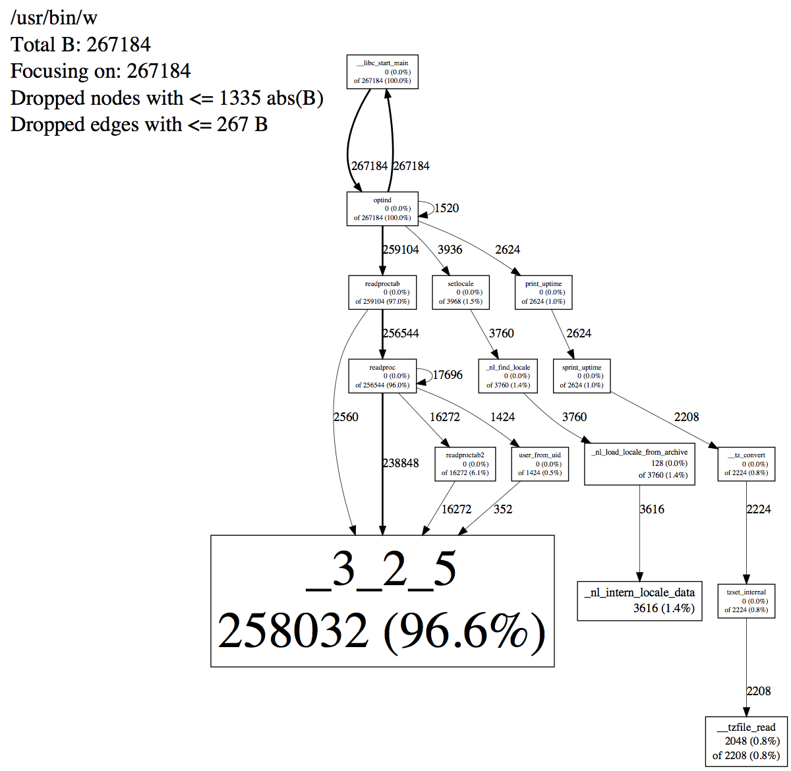
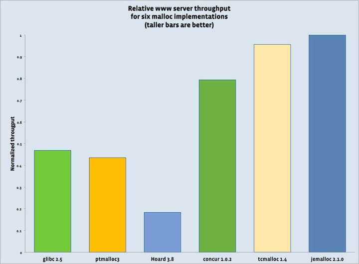

# 1. 对比
[引用](http://www.cnhalo.net/2016/06/13/memory-optimize/)    
## 概述  

对象为
```
class User {
public:
	int a;
	int age;
	double price;
};
void testSingleThread(int sizemalloc) {
	for (; sizemalloc > 0; sizemalloc--)
	{
		auto p = malloc(sizeof(User));
		delete p;
	}
}
void testMulThread(int thradsize, int sizemallco) {
	vector<thread*> pvector;
	for (; thradsize > 0; thradsize--)
	{
		pvector.push_back(new thread([sizemallco]() {
			testSingleThread(sizemallco);
		}));
	}
	for (auto pthread : pvector) {
		pthread->join();
	}
}
```

单线程对象数100000,多线程每个对象数100000   

release  

| |单线程耗时|单线程平均每个对象耗时|多线程耗时|多线程每个对象耗时|
|:--|:--|:--|:--|:--|
|malloc-windows|4.489ms|44.89ns|12.484ms|15.606ns|
|jemalloc-4.3.1|3.274ms|32.74ns|10.797ms|13.49ns|
|tcmalloc-2.7|0.723ms|7.23ns|7.026ms|8.78311ns|

# 2. jemalloc 
jemalloc是一个通用的malloc（3）实现，强调了碎片避免和可扩展的并发支持。jemalloc于2005年首次作为FreeBSD libc分配器使用，从那以后它已经进入许多依赖于其可预测行为的应用程序。2010年，jemalloc开发工作范围扩大到包括开发人员支持功能，如堆分析和广泛的监控/调优钩子。现代jemalloc版本继续被集成到FreeBSD中，因此多功能性仍然至关重要。正在进行的开发工作趋势是将jemalloc作为广泛的苛刻应用的最佳分配器之一，并消除/减轻对现实应用产生实际影响的弱点。  
[源码](https://github.com/jemalloc/jemalloc)  
## 2.1. 背景
### 2.1.1. 历史
jemalloc最初是作为编程语言运行时Jason Evans在2005年开发的内存分配器，但语言设计的改变使得分配器变得多余。当时，FreeBSD需要一个SMP可扩展的分配器，因此他将jemalloc集成到FreeBSD的libc中，然后对可伸缩性和碎片行为进行了一系列改进。  
在2007年末，Mozilla项目努力改进Firefox 3.0版本的内存使用量，而jemalloc则用于解决微软Windows平台上Firefox的碎片问题。你可以在这里阅读关于劳动的成果。许多一般的jemalloc增强都是由Firefox相关的努力引起的。最近，在2010年，Mozilla赞助将Apple Mac OS X支持集成到独立的jemalloc中，并在2012年提供了MinGW Windows支持。  
从2009年开始，Jason Evans调整了jemalloc来处理Facebook服务器常常运行的极端负载，并添加了许多支持开发和监控的功能。Facebook在许多组件中使用jemalloc，这些组件是服务其网站所不可或缺的，截至2017年，一个小型Facebook团队推动了持续的开发和维护。  
### 2.1.2. 使用场景
jemalloc是一个通用malloc(3)实现，强调碎片避免和可扩展的并发支持。它旨在用作系统提供的内存分配器，如FreeBSD的libc库，以及链接到C / C ++应用程序。jemalloc提供了许多超出标准分配器功能的内省，内存管理和调优功能。作为一个极端的例子，竞技场可以用作池分配器; 即竞技场可用于通用分配，然后整个竞技场作为单一操作被销毁。  
### 2.1.3. 主要使用者
*  FreeBSD  
*  NetBSD  
*  Mozilla Firefox  
*  Varnish  
*  Cassandra  
*  Redis  
*  hhvm  
*  MariaDB  
*  Aerospike  
*  Android  
### 2.1.4. 附加文档
* [jemalloc（3）手册页](http://jemalloc.net/jemalloc.3.html):API和支持选项
* [演讲视频](https://youtu.be/RcWp5vwGlYU?list=PLn0nrSd4xjjZoaFwsTnmS1UFj3ob7gf7s)  
* [faceBook工程文档](http://www.facebook.com/notes/facebook-engineering/scalable-memory-allocation-using-jemalloc/480222803919)  
* [原始论文](http://people.freebsd.org/~jasone/jemalloc/bsdcan2006/jemalloc.pdf)  
## 2.2. 入门
以下所有示例假定在类Unix机器上的标准开发人员环境，类似于以下shell环境变量配置，其中<path>对应于脚本--prefix=<path>使用的设置configure，以便shell可以找到jemalloc-config：  
```
export PATH="<path>/bin:${PATH}"
```
有几种方法可以将jemalloc集成到应用程序中。以下是一些示例，从最简单到最常见：  
1 使用LD_PRELOAD环境变量在运行时将jemalloc注入应用程序。请注意，这仅在您的应用程序不静态链接malloc实现时才有效。  
```
LD_PRELOAD=`jemalloc-config --libdir`/libjemalloc.so.`jemalloc-config --revision` app
```
2 在build时将jemalloc链接到应用程序，但将其用作通用的malloc实现：
```
cc app.c -o app -L`jemalloc-config --libdir` -Wl,-rpath,`jemalloc-config --libdir` -ljemalloc `jemalloc-config --libs`
```
3 显式调用jemalloc的方式(请参阅--with-jemalloc-prefix配置选项)  

将jemalloc集成到应用程序中后，您可以通过多种方式使用特殊功能：  
1.   设置/etc/malloc.conf符号链接或MALLOC_CONF环境变量以调整jemalloc，例如  
```
export MALLOC_CONF="prof:true,lg_prof_sample:1,prof_accum:false,prof_prefix:jeprof.out"
```
1.   直接调用应用程序中的jemalloc功能：  
```
cc ex_stats_print.c -o ex_stats_print -I`jemalloc-config --includedir` \
-L`jemalloc-config --libdir` -Wl,-rpath,`jemalloc-config --libdir` \
-ljemalloc `jemalloc-config --libs`
```
ex_stats_print.c:  
```
#include <stdlib.h>
#include <jemalloc/jemalloc.h>

void  do_something(size_t i) {
        // Leak some memory.
        malloc(i * 100);
}

int  main(int argc, char **argv) {
        for (size_t i = 0; i < 1000; i++) {
                do_something(i);
        }

        // Dump allocator statistics to stderr.
        malloc_stats_print(NULL, NULL, NULL);

        return 0;
}
```
## 2.3. 用例
### 2.3.1. 内存检查
推荐工具[valgrind](http://valgrind.org/)进行内存调试,jemelloc5.0之后已从集成中移除,但是jemalloc中有一些基本的功能.  
如果jemalloc配置了--enable-debug指定的，则编译各种断言，可以检测双重释放，未对齐的指针等。这些检查对于正确运行的应用程序是不必要的，但它们在开发期间可能会有所帮助。需要注意的是，许多断言与竞技场数据结构有关，但线程缓存可以防止与竞技场相关的断言及时运行。禁用线程缓存（MALLOC_CONF=tcache:false）往往会使jemalloc的内部断言更有效地捕获应用程序错误，尤其是双重释放。  
如果jemalloc配置了--enable-fill指定，您可以MALLOC_CONF=junk:true在环境中设置告诉malloc()用0xa5字节填充对象，并用字节free()填充释放的内存0x5a。应用程序偶然从内存中获取归零是很常见的malloc()，这可以隐藏由于缺少初始化代码而导致的错误。另一个常见错误是在释放对象后访问它。如果您的应用程序与junk:true指定的选项行为不同，则代码中的某个地方存在错误。同样，如果问题是间歇性的，并且MALLOC_CONF=zero:true问题消失了，那么你的应用程序可能依赖于获取归零内存malloc()。  
### 2.3.2. 基本分配器统计
```
#include <stdlib.h>
#include <jemalloc/jemalloc.h>

void  do_something(size_t i) {
        // Leak some memory.
        malloc(i * 100);
}

int  main(int argc, char **argv) {
        for (size_t i = 0; i < 1000; i++) {
                do_something(i);
        }

        // Dump allocator statistics to stderr.
        malloc_stats_print(NULL, NULL, NULL);

        return 0;
}
```
会产生如下输出  
```
___ Begin jemalloc statistics ___
Version: 3.6.0-366-g85ae064e96387347915973dcc1ac15e553259bc9
Assertions disabled
Run-time option settings:
  opt.abort: false
  opt.lg_chunk: 21
  opt.dss: "secondary"
  opt.narenas: 16
  opt.lg_dirty_mult: 3 (arenas.lg_dirty_mult: 3)
  opt.stats_print: false
  opt.junk: "false"
  opt.quarantine: 0
  opt.redzone: false
  opt.zero: false
  opt.tcache: true
  opt.lg_tcache_max: 15
  opt.prof: false
  opt.prof_prefix: "jeprof"
  opt.prof_active: true (prof.active: false)
  opt.prof_thread_active_init: true (prof.thread_active_init: false)
  opt.lg_prof_sample: 19
  opt.prof_accum: false
  opt.lg_prof_interval: -1
  opt.prof_gdump: false
  opt.prof_final: false
  opt.prof_leak: false
CPUs: 4
Arenas: 16
Pointer size: 8
Quantum size: 16
Page size: 4096
Min active:dirty page ratio per arena: 8:1
Maximum thread-cached size class: 32768
Chunk size: 2097152 (2^21)
Allocated: 55410400, active: 59056128, metadata: 2861824, resident: 61739008, mapped: 65011712
Current active ceiling: 60817408

arenas[0]:
assigned threads: 1
dss allocation precedence: secondary
min active:dirty page ratio: 8:1
dirty pages: 14418:0 active:dirty, 0 sweeps, 0 madvises, 0 purged
                            allocated      nmalloc      ndalloc    nrequests
small:                        1781472          786            0           96
large:                       53628928          858            0          858
huge:                               0            0            0            0
total:                       55410400         1644            0          954
active:                      59056128
mapped:                      62914560
metadata: mapped: 1597440, allocated: 180352
bins:           size ind    allocated      nmalloc      ndalloc    nrequests      curregs      curruns regs pgs  util       nfills     nflushes      newruns       reruns
                   8   0          800          100            0            0          100            1  512   1 0.195            1            0            1            0
                     ---
                 112   7        11200          100            0            0          100            1  256   7 0.390            1            0            1            0
                 128   8          256            2            0            2            2            1   32   1 0.062            0            0            1            0
                     ---
                 224  11        22400          100            0            0          100            1  128   7 0.781            1            0            1            0
                     ---
                 320  13        20480           64            0            0           64            1   64   5 1                1            0            1            0
                     ---
                 448  15        28672           64            0            0           64            1   64   7 1                1            0            1            0
                 512  16         5120           10            0            0           10            2    8   1 0.625            1            0            2            0
                 640  17        20480           32            0            0           32            1   32   5 1                1            0            1            0
                 768  18        12288           16            0            0           16            1   16   3 1                1            0            1            0
                 896  19        43904           49            0           17           49            2   32   7 0.765            1            0            2            0
                1024  20        10240           10            0            0           10            3    4   1 0.833            1            0            3            0
                1280  21        20480           16            0            0           16            1   16   5 1                1            0            1            0
                1536  22        15360           10            0            0           10            2    8   3 0.625            1            0            2            0
                1792  23        28672           16            0            0           16            1   16   7 1                1            0            1            0
                2048  24        20480           10            0            0           10            5    2   1 1                1            0            5            0
                2560  25        25600           10            0            0           10            2    8   5 0.625            1            0            2            0
                3072  26        30720           10            0            0           10            3    4   3 0.833            1            0            3            0
                3584  27        35840           10            0            0           10            2    8   7 0.625            1            0            2            0
                4096  28        40960           10            0            0           10           10    1   1 1                1            0           10            0
                5120  29       189440           37            0           27           37           10    4   5 0.925            2            0           10            0
                6144  30        61440           10            0            0           10            5    2   3 1                1            0            5            0
                7168  31        71680           10            0            0           10            3    4   7 0.833            1            0            3            0
                8192  32        81920           10            0            0           10           10    1   2 1                1            0           10            0
               10240  33       307200           30            0           20           30           15    2   5 1                3            0           15            0
               12288  34       245760           20            0           10           20           20    1   3 1                2            0           20            0
               14336  35       430080           30            0           20           30           15    2   7 1                3            0           15            0
large:          size ind    allocated      nmalloc      ndalloc    nrequests      curruns
               16384  36       327680           20            0           20           20
               20480  37       839680           41            0           41           41
               24576  38      1007616           41            0           41           41
               28672  39      1204224           42            0           42           42
               32768  40      1343488           41            0           41           41
               40960  41      3358720           82            0           82           82
               49152  42      4079616           83            0           83           83
               57344  43      4702208           82            0           82           82
               65536  44      5373952           82            0           82           82
               81920  45     13434880          164            0          164          164
               98304  46     16121856          164            0          164          164
              114688  47      1835008           16            0           16           16
                     ---
huge:           size ind    allocated      nmalloc      ndalloc    nrequests   curhchunks
                     ---
--- End jemalloc statistics ---
```  
如果您已阅读jemalloc（3）手册页，则输出非常明显。从历史上看，此类统计数据的目的是为了帮助理解jemalloc在内部响应应用程序的内存分配活动所做的事情，以便改进分配器。实际上，统计数据对应用程序开发人员也很有用; 它们强调了jemalloc在系统调用，当前内存使用，碎片等方面的作用。如果分配器出现意外行为，请在采用更复杂的分析之前浏览统计数据以寻找明显的原因。  
请注意，默认情况下，jemalloc使用线程本地存储进行对象缓存，并且只有在除了统计信息收集之外由于某种原因必须锁定竞技场时，统计信息才会合并到竞技场统计计数器。因此，这些计数器往往略微过时，但对于已经运行超过一小段时间的非玩具应用来说，不准确性是相当小的。也就是说，当应用程序退出时，jemalloc会合并所有统计信息。像这样运行应用程序以打印最终统计信息：  
```
MALLOC_CONF = stats_print：true ./ex_stats_print
```
这些统计信息是准确的（只要其他线程在应用程序退出期间未分配）。  
### 2.3.3. 通过mallctl*()进行自查  
进行如下编译  
```
cc ex_mallctl.c -o ex_mallctl -I${JEMALLOC_PATH}/include -L${JEMALLOC_PATH}/lib \
-Wl,-rpath,${JEMALLOC_PATH}/lib -ljemalloc
```
ex_mallctl.c:  
```
#include <stdio.h>
#include <stdlib.h>
#include <stdint.h>
#include <jemalloc/jemalloc.h>

void
do_something(size_t i)
{

        // Leak some memory.
        malloc(i * 100);
}

int
main(int argc, char **argv)
{
        size_t i, sz;

        for (i = 0; i < 100; i++) {
                do_something(i);

                // Update the statistics cached by mallctl.
                uint64_t epoch = 1;
                sz = sizeof(epoch);
                mallctl("epoch", &epoch, &sz, &epoch, sz);

                // Get basic allocation statistics.  Take care to check for
                // errors, since --enable-stats must have been specified at
                // build time for these statistics to be available.
                size_t sz, allocated, active, metadata, resident, mapped;
                sz = sizeof(size_t);
                if (mallctl("stats.allocated", &allocated, &sz, NULL, 0) == 0
                    && mallctl("stats.active", &active, &sz, NULL, 0) == 0
                    && mallctl("stats.metadata", &metadata, &sz, NULL, 0) == 0
                    && mallctl("stats.resident", &resident, &sz, NULL, 0) == 0
                    && mallctl("stats.mapped", &mapped, &sz, NULL, 0) == 0) {
                        fprintf(stderr,
                            "Current allocated/active/metadata/resident/mapped: %zu/%zu/%zu/%zu/%zu\n",
                            allocated, active, metadata, resident, mapped);
                }
        }

        return (0);
}
```
输出  
```
Current allocated/active/metadata/resident/mapped: 181152/225280/1317632/1363968/4194304
Current allocated/active/metadata/resident/mapped: 192352/253952/1317632/1392640/4194304
Current allocated/active/metadata/resident/mapped: 214752/282624/1317632/1421312/4194304
...
Current allocated/active/metadata/resident/mapped: 1081056/1220608/1317632/2359296/4194304
Current allocated/active/metadata/resident/mapped: 1081056/1220608/1317632/2359296/4194304
Current allocated/active/metadata/resident/mapped: 1081056/1220608/1317632/2359296/4194304
```

### 2.3.4. 泄漏检查
jemalloc的堆配置文件输出文件是gperftools创建的文件的功能超集  
如何在生产应用程序中查找内存泄漏？就此而言，如果没有泄漏，但应用程序因非明显原因耗尽内存会怎么样？堆分析可以提供帮助。    
让我们从简单的情况开始，在这种情况下，可以关闭应用程序并查看在退出时仍分配的内存。我们将看到的违规应用程序是w：  
```
MALLOC_CONF = prof_leak：true，lg_prof_sample：0，prof_final：true \
LD_PRELOAD = $ {JEMALLOC_PATH} /lib/libjemalloc.so.2 w
```
当程序退出时，这将导致类似以下输出：  
```
<jemalloc>: Leak summary: 267184 bytes, 473 objects, 20 contexts
<jemalloc>: Run jeprof on "jeprof.19678.0.f.heap" for leak detail
```
要了解有关泄漏的更多信息，请运行：  
```
jeprof --show_bytes `which w` jeprof.19678.0.f.heap
    Using local file /usr/bin/w.
Using local file jeprof.19678.0.f.heap.
Welcome to jeprof!  For help, type 'help'.
(jeprof) top
Total: 267184 B
  258032  96.6%  96.6%   258032  96.6% _3_2_5
    3616   1.4%  97.9%     3616   1.4% _nl_intern_locale_data
    2048   0.8%  98.7%     2208   0.8% __tzfile_read
    1024   0.4%  99.1%     1024   0.4% getpwnam
    1024   0.4%  99.5%     1072   0.4% getpwuid
     448   0.2%  99.6%      448   0.2% __gconv_lookup_cache
     384   0.1%  99.8%      384   0.1% getutent
     224   0.1%  99.9%      224   0.1% strdup
     160   0.1%  99.9%      160   0.1% __tzstring
     128   0.0% 100.0%     3760   1.4% _nl_load_locale_from_archive
      48   0.0% 100.0%       48   0.0% get_mapping
```
要生成泄漏发生位置的调用图的PDF，请运行：  
```
jeprof --show_bytes --pdf `which w` jeprof.19678.0.f.heap > w.pdf
```
结果如下：  
  
### 2.3.5. 堆分析
除了退出时采用泄漏检查,jemalloc也可以在配置文件中转储.  
环境变量  
*  export MALLOC_CONF="lg_prof_interval:N"，分配活动中，每流转 1 « N 个字节，将采样统计数据转储到文件。
*  export MALLOC_CONF="prof_gdump:true"，当总分配量创新高时，将采样统计数据转储到文件。
*  在程序内主动触发转储：mallctl("prof.dump", NULL, NULL, NULL, 0)
```
1. 转储到指定的文件名。在MALLOC_CONF中将prof设置为true：  
export MALLOC_CONF="prof:true,prof_prefix:jeprof.out"
然后执行类似于以下C代码的代码：  
const char *fileName = "heap_info.out";
mallctl("prof.dump", NULL, NULL, &fileName, sizeof(const char *));
2.  使用自动文件名生成。除了prof之外，在MALLOC_CONF中设置prof_prefix：  
export MALLOC_CONF="prof:true,prof_prefix:jeprof.out"  
执行类似于以下C代码的代码：  
mallctl("prof.dump", NULL, NULL, NULL, 0);  
```
jeprof可以比较生成的一系列配置文件转储中的任意两个，并显示在中间时间内发生的分配活动。使用--base = <base>标志指定第一个配置文件。   
通过指定，可以启动启用了性能分析但非活动的应用程序MALLOC_CONF=prof_active:false。这仅在应用程序在执行期间通过“prof.active” mallctl 手动激活/取消激活分析时才有用。用例包括：  
* 初始化完成后激活分析，以便配置文件仅显示在稳态执行期间分配的对象。
* 转储配置文件，激活配置文件30秒，停用配置文件后等待30秒，然后转储另一个配置文件并用于jeprof比较两个转储。这将集中于在稳态执行期间分配但长期存在的对象。这些对象是解释内存增长的主要候选者。  
遍历调用堆栈以捕获回溯通常是计算密集型的。因此，对于长寿命，重载应用使用精确的泄漏检查是不可行的。分配的统计抽样使得可以将计算开销保持在较低水平，同时可以大致了解应用程序如何利用内存。有关控制采样间隔的信息，请参阅该选项。[lg_prof_sample](http://jemalloc.net/jemalloc.3.html#opt.lg_prof_sample) [MALLOC_CONF](http://jemalloc.net/jemalloc.3.html#tuning)  
### 2.3.6. 调优
本文档总结了使用jemalloc进行性能微调的常用方法（自5.1.0起）。jemalloc的默认配置往往在实践中运行得相当好，大多数应用程序不应该调整任何选项。但是，为了涵盖广泛的应用程序并避免病态情况，默认设置有时保持保守和次优，即使对于许多常见工作负载也是如此。当jemalloc针对特定应用程序/工作负载进行适当调整时，通常会将系统级别指标提高几个百分点，或进行有利的权衡。  
性能调优的显着运行时选项  
可以通过malloc_conf设置运行时选项 。  
*  background_thread
启用jemalloc后台线程通常会改善应用程序线程的尾部延迟，因为未使用的内存清除将转移到专用后台线程。此外，使用后台线程可避免因应用程序不活动而导致的意外清除延迟。  
建议：background_thread:true当允许jemalloc托管线程时  
*  metadata_thp  
允许jemalloc将透明的大页面用于其内部元数据通常可以显着减少TLB未命中，特别是对于具有大内存占用和频繁分配/释放活动的程序。由于使用大页面，元数据内存使用量可能会增加。  
建议用于分配密集型程序：metadata_thp:auto或者 metadata_thp:always，预计可以以较小的内存成本提高CPU利用率。  
*  dirty_decay_ms和 muzzy_decay_ms  
衰减时间决定了jemalloc将未使用的页面返回操作系统的速度，因此可以在CPU和内存使用之间进行相当简单的权衡。较短的衰减时间可以更快地清除未使用的页面以减少内存使用（通常以清除所花费的CPU周期为代价），反之亦然。  
建议：根据所需的权衡来调整值。  
*  narenas  
默认情况下，jemalloc使用多个竞技场来减少内部锁争用。然而，高竞技场计数也可能增加整体内存碎片，因为竞技场独立管理内存。当在分配器级别不期望高度并行性时，较低数量的竞技场通常会提高内存使用率。  
建议：如果预期低并行度，请在监视CPU和内存使用情况时尝试降低竞技场计数。  
* percpu_arena
基于运行CPU启用动态线程到竞技场关联。这有可能改善局部性，例如，当存在线程到CPU亲和性时。  
建议：尝试percpu_arena:percpu或者percpu_arena:phycpu预计处理器之间的线程迁移是不常见的  

例子：  
高资源消耗应用程序，优先考虑CPU利用率：  
```
background_thread:true,metadata_thp:auto combined with relaxed decay time (increased dirty_decay_ms and / or muzzy_decay_ms, e.g. dirty_decay_ms:30000,muzzy_decay_ms:30000).
```
高资源消耗应用程序，优先考虑内存使用情况：  
```
background_thread:true combined with shorter decay time (decreased dirty_decay_ms and / or muzzy_decay_ms, e.g. dirty_decay_ms:5000,muzzy_decay_ms:5000), and lower arena count (e.g. number of CPUs).
```
低资源消耗应用： 
```
narenas:1,lg_tcache_max:13 combined with shorter decay time (decreased dirty_decay_ms and / or muzzy_decay_ms,e.g. dirty_decay_ms:1000,muzzy_decay_ms:0).
```
非常保守 - 不惜一切代价最小化内存使用，仅适用于分配活动非常少见的情况：  
```
narenas:1,tcache:false,dirty_decay_ms:0,muzzy_decay_ms:0
```
请注意，建议将abort_conf:true非法选项中立即中止的选项组合在一起。  
**其他**  
除了运行时选项之外，还有一些通过jemalloc提高应用程序性能的编程方法。  
*  明确的竞技场
手动创建的竞技场可以通过各种方式帮助提高绩效，例如通过管理地点和特定用途的争用。例如，应用程序可以使用mallocx（）从专用领域显式分配频繁访问的对象， 以改善局部性。此外，明确的竞技场通常受益于单独调整的选项，例如，如果预期频繁重用，则放松的衰减时间。
*  范围钩子
扩展挂钩允许自定义管理底层内存。一个用于性能目的的用例是利用大页面 - 例如， HHVM 使用具有自定义扩展挂钩的显式竞技场来管理频繁访问的数据的1GB大页面，这显着减少了TLB未命中。
* 明确的线程到竞技场绑定  
应用程序中的某些线程通常具有不同的内存访问/分配模式。具有繁重工作负载的线程通常受益于显式绑定，例如，将非常活跃的线程绑定到专用场所可以减少分配器级别的争用。
## 2.4. facebook文档解读
吞吐量最大的的三个挑战  
1. 分配和解除分配必须快速。 
2. 活动内存和RAM使用之间的关系必须一致(碎片最小化)如果碎片导致RAM使用量每天增加1 GiB，那么设计为仅留下少量空间的应用程序将在几天内失败  
3. 内存堆分析(09年facebook添加)  
### 2.4.1. 核心算法和数据结构  
C和C ++编程语言依赖于一个非常基本的无类型分配器API，它主要由五个函数组成：malloc（）， posix_memalign（），calloc（）， realloc（）和free（）。  
jemalloc结合了一些原创想法和一组相当大的想法，这些想法首先在其他分配器中得到验证。以下是这些想法和分配理念的结合，它们结合起来形成了jemalloc。  
*  根据大小等级隔离小对象，并在重用期间优先选择低地址。这种布局策略起源于[phkmalloc](http://phk.freebsd.dk/pubs/malloc.pdf)，是jemalloc可预测的低碎片行为的关键。    
*  仔细选择大小类(受[Vam](http://citeseerx.ist.psu.edu/viewdoc/download?doi=10.1.1.59.4350&rep=rep1&type=pdf)启发)如果大小类间隔很远，则对象将倾向于具有过多的不可用尾随空间（内部碎片）。随着大小类计数的增加，专用于当前未充分利用的对象大小（外部碎片）的未​​使用内存将趋于相应增加。  
*  对分配器元数据开销施加严格限制。对于所有大小的类，忽略碎片，jemalloc将元数据限制为不到总内存使用量的2％。  
*  最小化活动页面集。操作系统内核按页面管理虚拟内存（通常每页4 KiB），因此将所有数据集中到尽可能少的页面非常重要。phkmalloc验证了这个原则  
*   最小化锁争用.jemalloc的独立领域被启发[lkmalloc](ftp://ftp.cs.utexas.edu/pub/garbage/submit/readable/plarson23.ps)，但随着时间的推移，[tcmalloc](https://code.google.com/p/google-perftools/) 非常清楚，它的更好，以避免完全同步，所以jemalloc还实现特定线程缓存。  
*  如果它不是通用的，那就不够好了。当jemalloc首次被整合到FreeBSD中时，它对某些应用程序存在严重的碎片问题，并且提出了在操作系统中包含多个分配器的建议，即开发人员有权根据应用程序特征做出明智的选择。正确的解决方案是大大简化jemalloc的布局算法，以提高性能和可预测性。  

jemalloc实现了三个主要的大小类类别如下（假设64位系统上的默认配置）：
*  Small: [8]，[16,32,48，...，128]，[192,256,320，...，512]，[768,1024,1280，...，3840]  
*  Large: [4 KiB，8 KiB，12 KiB，...，4072 KiB]  
*  Huge: [4 MiB，8 MiB，12 MiB，......]    

虚拟内存在逻辑上划分为大小:4MB,因此，可以通过指针操作在恒定时间内找到小/大对象（内部指针）的分配器元数据，并通过全局红黑树在对数时间内查找Huge对象（块对齐）的元数据。  
线程以Round-robin绑定对应的竞技场Chunk,他们维护自己的块，从中为小/大对象雕刻页面运行。无论哪个线程执行释放，释放的内存总是返回到它所来自的竞技场Chunk。  
   
每个竞技场块包含元数据（主要是页面映射），然后是一个或多个页面运行。小对象组合在一起，每个页面运行开始时有额外的元数据，而大对象彼此独立，并且它们的元数据完全驻留在竞技场块头中。每个竞技场通过红黑树（每个大小类一个）跟踪非完整的小对象页面运行，并始终使用具有该大小类的最低地址的非完整运行来服务分配请求。每个竞技场跟踪可用的页面通过两个红黑树运行 - 一个用于clean的页面运行，另一个用于dirty的页面运行。页面运行优先从dirty树中分配，使用最低的最佳拟合。  
  
每个线程都维护一个小对象的缓存，以及大小有限的大对象（默认为32 KiB）。因此，绝大多数分配请求在访问竞技场之前首先检查缓存的可用对象。通过线程缓存进行分配不需要任何锁定，而通过竞技场进行分配需要锁定竞技场箱（每个小型班级一个）和/或整个竞技场。  
线程缓存的主要目标是减少同步事件的数量。因此，每个大小类的最大缓存对象数限制在一个允许在实践中减少10-100倍同步的级别。较高的缓存限制将进一步加速某些应用程序的分配，但在一般情况下以不可接受的分段成本。为了进一步限制碎片，线程缓存执行增量“垃圾收集”（GC），其中时间是根据分配请求来度量的。未使用一个或多个GC通道的缓存对象将使用指数衰减方法逐渐刷新到各自的场地。  
**Facebook推动的创新**    
在2009年，一位Facebook工程师可能通过说“jemalloc的一致性和可靠性很好，但它不够快，加上我们需要更好的方法来监控它实际上在做什么”这样的事情来总结jemalloc的有效性。  
**速度**   
*  重写了线程缓存:我们在数据结构（每个大小类的单链接LIFO）和大小控制（每个大小类的硬限制，加上完全独立于其他线程的增量GC）方面选择了一个非常简单的设计。   
*  增加互斥粒度: 重构了同步逻辑以在系统调用期间丢弃所有互斥锁。   
*  重写脏页清除:使得脏页的最大数量与总内存使用量成比例，而不是常量。我们还隔离了干净和脏的未使用页面，而不是将它们合并，以便优先重新使用脏页并减少总脏页清除量。尽管此更改稍微增加了虚拟内存使用量，但它对吞吐量产生了显着的积极影响。     
*  新的红黑树实现:具有相同的低内存开销（每个节点有两个指针字段），但插入/删除速度快约30％。这种恒定因子的改进实际上对我们的一个应用程序很重要。之前的实施基于左倾的2-3-4红黑树，并且所有操作仅使用向下传球进行。虽然这种迭代方法避免了递归或对父指针的需要，但是如果在后续向上传递期间懒惰地恢复树一致性，则需要额外的树操作。实验表明，最佳的红黑树实现必须进行惰性修复。此外，修复通常可以在完成向上通过之前终止，并且在这种情况下递归展开是不可接受的成本。   
**自检**  
jemalloc一直能够在应用程序出口处以人类可读的形式打印详细的内部统计信息，但这对于长时间运行的服务器应用程序来说是有限的，因此我们暴露了malloc_stats_print（），以便应用程序 可以重复调用它。不幸的是，这仍然给消费者带来了解析负担，因此我们添加了在BSD的sysctl（）系统调用之后模式化的 mallctl *（） API ，以提供对各个统计信息的访问。我们在mallctl *（）方面 重新实现了 malloc_stats_print（）以确保完全覆盖，并且随着时间的推移，我们还扩展了此工具以提供其他控件，例如线程缓存刷新和强制脏页清除。   
内存泄漏诊断是一项重大挑战，尤其是在需要现场生产条件来暴露泄漏时。Google的tcmalloc提供了一个适合生产用途的优秀堆分析工具，我们发现它非常宝贵。但是，我们越来越多地面临一些应用程序的困境，因为只有jemalloc能够充分控制内存使用，但只有tcmalloc提供了足够的工具来理解内存利用率。因此，我们为jemalloc添加了兼容的堆分析功能。这使我们能够利用tcmalloc附带的后处理工具。  
性能比较  
  
用于比较服务器总吞吐量。这些机器在一小时内提供了类似但不完全相同的请求。我们以4分钟的间隔（总共15个样本）进行采样，测量吞吐量与CPU消耗成反比，并计算相对平均值    

# 3. 谷歌tcmalloc  
[原文地址](https://github.com/gperftools/gperftools/wiki)  
声称是最快的malloc; 线程和STL特别适用。另外：线程友好的堆检查器，堆分析器和cpu-profiler。  
## 3.1. 介绍
gperftools是一个高性能多线程malloc()实现的集合 ，加上一些非常漂亮的性能分析工具。  
[下载地址](https://github.com/gperftools/gperftools/releases/tag/gperftools-2.7)  
## 3.2. 具有线程缓存的Malloc
### 3.2.1. 动机  
TCMalloc比glibc 2.3 malloc（作为一个名为ptmalloc2的独立库提供）和我测试的其他malloc更快。ptmalloc2需要大约300纳秒才能在2.8 GHz P4上执行malloc / free对（对于小对象）。对于相同的操作对，TCMalloc实现大约需要50纳秒。速度对于malloc实现很重要，因为如果malloc不够快，应用程序编写者倾向于在malloc之上编写自己的自定义空闲列表。这可能导致额外的复杂性和更多的内存使用，除非应用程序编写者非常小心地适当调整空闲列表的大小并从空闲列表中清除空闲对象。  
### 3.2.2. 使用
常规连接为libtcmalloc库,当然也可以连接libtcmalloc_minimal,当使用该方式时,不包含堆分析,和堆检查器功能(Windows只支持libtcmalloc_minimal).  
### 3.2.3. 基本思想
TCMalloc为每个线程分配线程本地缓存。线程本地缓存满足小分配。根据需要将对象从中央数据结构移动到线程本地缓存中，并使用周期性垃圾收集将内存从线程本地缓存迁移回中央数据结构。  
  
TCMalloc将大小<= 256K（“小”对象）的对象与较大对象区别对待。使用页面级分配器直接从中央堆分配大对象（页面是8K对齐的内存区域）。即，大对象总是页面对齐并占据整数页面.  
可以将一系列页面划分为一系列小对象，每个小对象的大小相同。例如，一页（4K）的运行可以被分成32个大小为128字节的对象。  
### 3.2.4. 小对象的分配
每个小对象大小映射到大约88个可分配大小类中的一个。例如，961到1024字节范围内的所有分配都会向上舍入到1024.大小类间隔开，以便小的大小分隔8个字节，较大的大小分隔16个字节，甚至更大的大小分隔32个字节，依此类推。控制最大间距，以便当分配请求刚刚超过大小类的末尾并且必须向上舍入到下一个类时，不会浪费太多空间。  
线程缓存包含每个size-class的单​​个链接的自由对象列表。  
  
分配小对象时：（1）我们将其大小映射到相应的大小类。（2）查看当前线程的线程缓存中的相应空闲列表。（3）如果空闲列表不为空，我们从列表中删除第一个对象并将其返回。遵循此快速路径时，TCMalloc根本不会获取任何锁定。这有助于显着加速分配，因为锁定/解锁对在2.8 GHz Xeon上大约需要100纳秒。  
如果空闲列表为空：（1）我们从这个大小类的中央空闲列表中获取一堆对象（所有线程共享中央空闲列表）。（2）将它们放在线程本地空闲列表中。（3）将一个新获取的对象返回给应用程序。  
如果中央空闲列表也是空的：（1）我们从中央页面分配器分配一系列页面。（2）将run分成这个size-class的一组对象。（3）将新对象放在中央空闲列表中。（4）和以前一样，将其中一些对象移动到线程本地空闲列表中。  
### 调整线程缓存自由列表的大小  
正确调整线程缓存空闲列表的大小非常重要。如果免费列表太小，我们需要经常访问中央免费列表。如果空闲列表太大，我们将浪费内存，因为对象在空闲列表中闲置。  
请注意，线程缓存对于解除分配和分配一样重要。没有缓存，每次释放都需要将内存移动到中央空闲列表。此外，一些线程具有不对称的alloc / free行为（例如，生产者和消费者线程），因此正确调整空闲列表的大小变得更加棘手。  
为了适当地调整空闲列表的大小，我们使用慢启动算法来确定每个单独空闲列表的最大长度。随着更频繁地使用空闲列表，其最大长度增加。但是，如果空闲列表更多地用于解除分配而不是分配，则其最大长度将仅增长到可以立即有效地将整个列表有效地移动到中央空闲列表的点。  
下面的伪代码说明了这种慢启动算法。请注意，这num_objects_to_move是特定于每个大小类。通过移动具有众所周知长度的对象列表，中央缓存可以在线程缓存之间有效地传递这些列表。如果线程缓存需要少于num_objects_to_move，则中央空闲列表上的操作具有线性时间复杂度。始终使用num_objects_to_move作为传输到中央缓存和从中央缓存传输的对象数量的缺点是它浪费了不需要所有这些对象的线程中的内存。  
```
Allocation
  if freelist empty {
    fetch min(max_length, num_objects_to_move) from central list;
    if max_length < num_objects_to_move {  // slow-start
      max_length++;
    } else {
      max_length += num_objects_to_move;
    }
  }

Deallocation
  if length > max_length {
    // Don't try to release num_objects_to_move if we don't have that many.
    release min(max_length, num_objects_to_move) objects to central list
    if max_length < num_objects_to_move {
      // Slow-start up to num_objects_to_move.
      max_length++;
    } else if max_length > num_objects_to_move {
      // If we consistently go over max_length, shrink max_length.
      overages++;
      if overages > kMaxOverages {
        max_length -= num_objects_to_move;
        overages = 0;
      }
    }
  }
```
### 中等对象分配  
中等对象大小（256K≤大小≤1MB）向上舍入到页面大小（8K）并由中央页面堆处理。中央页面堆包含128个空闲列表的数组。该k条目是由k + 1页面组成的运行的免费列表：  
  
### 大对象分配  
1MB或更多的分配被认为是大量分配。可以满足这些分配的可用内存跨度在按大小排序的红黑树中进行跟踪。分配遵循最佳拟合 算法：搜索树以找到大于所请求分配的最小可用空间跨度。分配是从该范围中划分出来的，剩下的空间将重新插入到大对象树中，或者可能重新插入到一个较小的自由列表中。如果没有空闲存储器位于，可适配于分配请求跨度，我们从系统取存储器(sbrk, mmap, or by mapping in portions of /dev/mem)    
如果长度> k的页面运行满足k页的分配，则运行的其余部分将重新插入页堆中的相应空闲列表中。  
### 跨度  
由TCMalloc管理的堆由一组页面组成。一系列连续页面由Span对象表示。跨度可以分配，也可以是免费的。如果空闲，则span是页堆链接列表中的条目之一。如果已分配，则它是已传递给应用程序的大对象，或者已分割为一系列小对象的一组页面。如果拆分为小对象，则会在跨度中记录对象的大小等级。  
可以使用由页码索引的中央阵列来查找页面所属的跨度。例如，跨度a占用2页，跨度b占1页，跨度c占5页，跨度d占3页。   
  
在32位地址空间中，中心阵列由一个2级基数树表示，其中根包含32个条目，每个叶包含2 ^ 14个条目（32位地址空间具有2 ^ 19个8K页，并且树的第一级将2 ^ 19页划分为2 ^ 5）。这导致中央阵列的起始内存使用量为64KB空间（2 ^ 14 * 4字节），这似乎是可以接受的。  
在64位计算机上，我们使用3级基数树。  
### 释放
当一个对象被释放时，我们计算其页码并在中心数组中查找它以找到相应的span对象。跨度告诉我们对象是否很小，如果它很小，它的大小级别。如果对象很小，我们将它插入当前线程的线程缓存中的相应空闲列表中。如果线程缓存现在超过预定大小（默认为2MB），我们运行垃圾收集器，将未使用的对象从线程缓存移动到中央空闲列表中。  
如果对象很大，则跨度告诉我们对象覆盖的页面范围。假设这个范围是[p,q]。我们还查找页面p-1和页面的跨度q+1。如果这些相邻跨度中的任何一个是自由的，我们将它们与[p,q]跨度合并 。生成的span将插入页堆中的相应空闲列表中。  
### 小对象的中央自由列表  
如前所述，我们为每个大小级别保留一个中央免费列表。每个中央空闲列表都被组织为两级数据结构：一组跨度和每个跨度的自由对象的链接列表。  
通过从某个范围的链接列表中删除第一个条目，从中央空闲列表分配对象。（如果所有跨度都有空链表，则首先从中央页堆分配适当大小的跨度。）  
通过将对象添加到其包含范围的链接列表，将对象返回到中央空闲列表。如果链接列表长度现在等于跨度中的小对象总数，则此跨度现在完全空闲并返回到页面堆。  
### 线程缓存的垃圾收集  
从线程缓存中收集对象的垃圾可以控制缓存的大小，并将未使用的对象返回到中央空闲列表。有些线程需要大型缓存才能很好地执行，而其他线程则可以通过很少或根本没有缓存。当线程缓存超过它时max_size，垃圾收集开始，然后线程与其他线程竞争更大的缓存。  
垃圾收集仅在重新分配期间运行。我们遍历缓存中的所有空闲列表，并将一些对象从空闲列表移动到相应的中央列表。  
从空闲列表移动的对象数量是使用每列表低水位标记确定的L。 L 记录自上次垃圾回收以来列表的最小长度。请注意，我们可以通过L最后一个垃圾收集中的对象缩短列表， 而无需对中央列表进行任何额外访问。我们使用此历史记录作为将来访问的预测器，并将L/2 对象从线程缓存空闲列表移动到相应的中央空闲列表。该算法具有良好的属性，如果线程停止使用特定大小，则该大小的所有对象将快速从线程高速缓存移动到中央空闲列表，其他线程可以使用它们。  
如果一个线程始终释放更多的特定大小的对象而不是它分配的对象，则此L/2行为将导致至少 L/2对象始终位于空闲列表中。为了避免以这种方式浪费内存，我们缩小freelist的最大长度以收敛num_objects_to_move  
```
Garbage Collection
  if (L != 0 && max_length > num_objects_to_move) {
    max_length = max(max_length - num_objects_to_move, num_objects_to_move)
  }
```
线程缓存越过它的事实表明线程max_size将从更大的缓存中受益。简单地增加max_size会在具有大量活动线程的程序中使用过多的内存。开发人员可以使用标志--tcmalloc_max_total_thread_cache_bytes绑定内存。  
每个线程缓存都以较小的max_size （例如64KB）开始，因此空闲线程不会预先分配它们不需要的内存。每次缓存运行垃圾收集时，它也会尝试增加它max_size。如果线程高速缓存大小的总和小于--tcmalloc_max_total_thread_cache_bytes，则 max_size容易增长。如果不是，则线程高速缓存1将尝试通过减少线程高速缓存2来从线程高速缓存2（拾取的循环）中窃取max_size。通过这种方式，更活跃的线程会更频繁地从其他线程窃取内存，而不是从内存中窃取内存。大多数空闲线程最终都有小缓存，活动线程最终会有大缓存。请注意，此窃取可能导致线程高速缓存大小的总和大于--tcmalloc_max_total_thread_cache_bytes，直到线程高速缓存2释放某些内存以触发垃圾回收。
## 3.3. 堆检查
## 3.4. 堆分析
## 3.5. cpu分析
## 3.6. pprof和远程服务
## 3.7. 简单demo
* 使用
```
gcc [...] -ltcmalloc
```
* 堆检查
```
gcc [...] -o myprogram -ltcmalloc
HEAPCHECK=normal ./myprogram
```
* 堆分析
```
gcc [...] -o myprogram -ltcmalloc
HEAPPROFILE=/tmp/netheap ./myprogram
```
* Cpu Profiler
```
gcc [...] -o myprogram -lprofiler
CPUPROFILE=/tmp/profile ./myprogram
```
**样本输出**  
堆分析器可以弹出一个窗口，将信息显示为有向图：  
  
cpu profiler可以生成加权调用图  
  


# Jemalloc泄漏分析
```
___ Begin jemalloc statistics ___
Version: 0.0.0-0-g0000000000000000000000000000000000000000
Assertions disabled
config.malloc_conf: ""
Run-time option settings:
  opt.abort: false
  opt.lg_chunk: 16
  opt.dss: "secondary"
  opt.narenas: 16
  opt.purge: "ratio"
  opt.lg_dirty_mult: 3 (arenas.lg_dirty_mult: 3)
  opt.junk: "false"
  opt.quarantine: 0
  opt.redzone: false
  opt.zero: false
  opt.tcache: true
  opt.lg_tcache_max: 15
  opt.stats_print: false
Arenas: 16
Min active:dirty page ratio per arena: 8:1
Quantum size: 16
Page size: 4096
Maximum thread-cached size class: 32768
Allocated: 169488, active: 204800, metadata: 1352704, resident: 1413120, mapped: 1769472, retained: 0
Current active ceiling: 262144
```

泄漏
```
___ Begin jemalloc statistics ___
Version: 0.0.0-0-g0000000000000000000000000000000000000000
Assertions disabled
config.malloc_conf: ""
Run-time option settings:
  opt.abort: false
  opt.lg_chunk: 16
  opt.dss: "secondary"
  opt.narenas: 16
  opt.purge: "ratio"
  opt.lg_dirty_mult: 3 (arenas.lg_dirty_mult: 3)
  opt.junk: "false"
  opt.quarantine: 0
  opt.redzone: false
  opt.zero: false
  opt.tcache: true
  opt.lg_tcache_max: 15
  opt.stats_print: false
Arenas: 16
Min active:dirty page ratio per arena: 8:1
Quantum size: 16
Page size: 4096
Maximum thread-cached size class: 32768
Allocated: 800169472, active: 800210944, metadata: 54690432, resident: 854851584, mapped: 855179264, retained: 0
Current active ceiling: 800325632
```