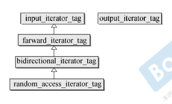
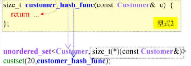
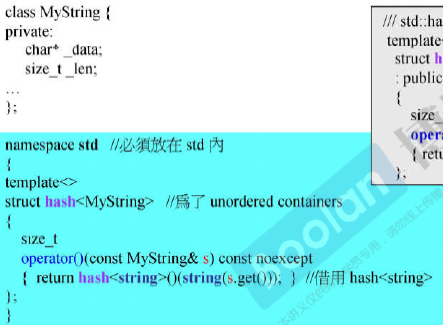
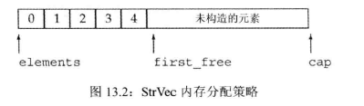

# 1. 开始 

主要介绍C++的大部分基础内容：类型/变量/表达式/语句以及函数。
### 1.0.1. 编写一个简单的程序
c++程序由函数组成，一个函数包含四个部分：返回类型，函数名，一个括号包含的形参列表以及函数体。
```
#include <iostream>
int main() {
    std::cout << "Hello, World!" << std::endl;
    return 0;
}
```
对于GUN编译器使用编译命令为：$ g++ -o prog1 main.cpp
### 1.0.2. 初识输入输出
基本的iostream库包含两个基础类型istream和ostream，分别表示输入流和输出流。  
**标准输入输出对象**
标准库定义了4个IO对象cin标准输入，cout标准输出,cerr标准错误，clog用来输出一般性的信息。
```
void StartDemo1::run() {
    std::string value,value2,value3 = "";
    std::cin >> value>>value2>>value3;
    std::cout<<"cout:"<<value<<std::endl;
    std::clog<<"clog:"<<value2<<std::endl;
    std::cerr<<"cerr:"<<value3<<std::endl;
}
```
>> 需要注意一般的io操作应该保证“一直刷新流”。否则如果程序崩溃则io缓存数据会没有处理
### 1.0.3. 注释简介
两种注释//(单行注释)或/**/(注释块)
### 1.0.4. 控制流
一般的设计语言常见的顺序语句常见的有while for if switch 等等
#### 1.0.4.1. while语句
循环语句当然还有do-while这种类型的循环
```
while (condition)
    statement
```
习题
```test
void demo19() {
    int i = 50;
    int result = 0;
    while (i < 101) {
        result += i++;
    }
    std::cout << "50-100 sum:" << result << std::endl;
}
void demo110(int i){
    while (i){
        std::cout<<i--<<std::endl;
    }
}
void demo111(){
    std::cout<<"please input two num for print:"<<std::endl;
    int a,b;
    std::cin>>a>>b;
    int min=a<b?a:b;
    while(a>b){
        if(b!=min){
            std::cout<<b<<",";
        }
        b++;
    }
    std::cout<<std::endl;
    while (a<b){
        if(a!=min){
            std::cout<<a<<",";
        }
        a++;
    }
    std::cout<<std::endl;
}
```
#### 1.0.4.2. for语句
for循环其实可以用于替换while,比如Golang就采用了此策略，在Golang语法中没有while语句。
#### 1.0.4.3. 读取数量不定的输入数据
```
void demo143(){
    int sum=0,value=0;
    while (std::cin>>value){
        sum+=value;
    }
    std::cout<<"sum:"<<sum<<std::endl;
}
```
#### 1.0.4.4. if语句
```
void demo144(){
    int cur=0,val=0;
    if(std::cin>>cur){
        int cnt=1;
        while (std::cin>>val){
            if(val==cur){
                cnt++;
            } else{
                std::cout<<cur<<":"<<cnt<<std::endl;
                cur=val;
                cnt=1;
            }
        }
        std::cout<<cur<<":"<<val<<std::endl;
    }
}
```
### 1.0.5. 类简介
对类的理解：
1. 类名
2. 定义位置
3. 支持操作
```header
#ifndef CODE_SALES_ITEM_H
#define CODE_SALES_ITEM_H
#include <iostream>
#include <string>
class Sales_item {
    friend std::istream &operator>>(std::istream &, Sales_item &);
    friend std::ostream &operator<<(std::ostream &, const Sales_item &);
    friend bool operator<(const Sales_item &, const Sales_item &);
    friend bool operator==(const Sales_item &, const Sales_item &);
    friend  Sales_item  operator+(const Sales_item& lhs, const Sales_item& rhs);
public:
    Sales_item() : units_sold(0), revenue(0.0) {}
    Sales_item(const std::string &book):bookNo(book),units_sold(0),revenue(0.0){}
    Sales_item(std::istream &is){
        is>>*this;
    }
    Sales_item& operator +=(const Sales_item& rhs){
        units_sold+=rhs.units_sold;
        revenue+=rhs.revenue;
        return * this;
    }
    std::string isbn()const{
        return bookNo;
    }
    double avg_price()const {
        if(units_sold)
            return  revenue/units_sold;
        else
            return 0;
    }
    void setBookNo(const std::string &bookNo);
    void setUnits_sold(unsigned int units_sold);
    void setRevenue(double revenue);
private:
    std::string bookNo;
    unsigned units_sold = 0;
    double revenue = 0.0;
};
#endif //CODE_SALES_ITEM_H
```
```.cpp
#include "Sales_item.h"
std::ostream& operator<<(std::ostream& out, const Sales_item& s)
{
    out <<"<<" <<s.isbn() << " " << s.units_sold << " " << s.revenue << " " << s.avg_price();
    return out;
}
std::istream& operator>>(std::istream& in, Sales_item& s)
{
    double price;
    in >> s.bookNo >> s.units_sold >> price;
    // check that the inputs succeeded
    if (in)
        s.revenue = s.units_sold * price;
    else
        s = Sales_item();  // input failed: reset object to default state
    return in;
}
Sales_item operator+(const Sales_item& lhs, const Sales_item& rhs)
{
    Sales_item ret(lhs);  // copy (|lhs|) into a local object that we'll return
    ret += rhs;           // add in the contents of (|rhs|)
    return ret;           // return (|ret|) by value
}
bool operator==(const Sales_item &lhs, const Sales_item &rhs)
{
    // must be made a friend of Sales_item
    return lhs.units_sold == rhs.units_sold &&
           lhs.revenue == rhs.revenue &&
           lhs.isbn() == rhs.isbn();
}
bool operator<(const Sales_item &lhs, const Sales_item &rhs)
{
    // must be made a friend of Sales_item
    return  lhs.isbn() < rhs.isbn();
}
void Sales_item::setUnits_sold(unsigned int units_sold) {
    Sales_item::units_sold = units_sold;
}
void Sales_item::setRevenue(double revenue) {
    Sales_item::revenue = revenue;
}
bool operator!=(const Sales_item &lhs, const Sales_item &rhs)
{
    return !(lhs == rhs); // != defined in terms of operator==
}
```
### 1.0.6. 书店程序
程序目的，计算total数据  
```
void demo16(){
    Sales_item total;//保存下一条记录
    if(std::cin>>total){
        Sales_item trans;//保存和变量
        while (std::cin>>trans){
            if(total.isbn()==trans.isbn())
                total+=trans;
            else{
                std::cout<<total<<std::endl;
                total=trans;
            }
        }
        std::cout<<total<<std::endl;//打印最后一本书的结果
    }else{
        std::cerr<<"No data?!"<<std::endl;
    }
}
```
# 2. C++基础
主要包含变量和基本类型，字符串，向量和数组，表达式，语句，函数，类等概念。  
语言的基本特征：  
* 整形、字符型等内置类型
* 变量，用来为对象命名
* 表达式和语句，用于操作上述数据类型的具体值
* if while等控制结构，这些结构允许我们有选择地执行一些语句或者重复地执行一些语句。
* 函数，用于定义可供随时调用的计算单元。
## 2.1. 变量和基本类型
数据类型是程序的基础：主要定义数据以及在数据上的操作。  
### 2.1.1. 基本内置类型
C++定义了包括*算术类型(arithmetictype)* 和*空类型(void)* 在内的基本数据类型。  
>> 算术类型：字符、整型数、布尔值和浮点数  
>> 空类型不对应具体的值，仅用于一些特殊的场合，例如当函数不返回任何值时的空类型作为返回类型。
#### 2.1.1.1. 算术类型
算术类型包含两类：整形(包含字符和布尔值)和浮点型。  
| 类型        | 含义           | 最小尺寸     |
| ----------- | -------------- | ------------ |
| bool        | 布尔类型       | 未定义       |
| char        | 字符           | 8位          |
| wchar_t     | 宽字符         | 16位         |
| char16_t    | Unicode字符    | 16位         |
| char32_t    | Unicode字符    | 32位         |
| short       | 短整型         | 16位         |
| int         | 整型           | 16位         |
| long        | 长整型         | 32位         |
| long long   | 长整型         | 64位         |
| float       | 单精度浮点数   | 6为有效数字  |
| double      | 双精度浮点数   | 10位有效数字 |
| long double | 扩展精度浮点数 | 10位有效数字 |
>>浮点型可以表示单精度、双精度、扩展精度值。C++标准制定了一个浮点数有效位数的最小值，然而大多数编译器都实现了更高的精度。通常，float以一个字（32bit）表示，double(64bit)，long double(96或128表示)。类型long double则常常被用于有特殊浮点需求的硬件。它的实现不同精度也不同。  

类型选择的经验：  
* 明确数值不能为负时是，使用无符号类型。
* 使用int执行整数运算。如果数值超过了int那么选用 long long
* 算术表达式不要使用char和bool.只有在存放字符或布尔值时才使用它们。
* 执行浮点数运算选用double,因为float通常精度不够，而且双精度浮点和单精度浮点数在计算代价上相差无几，某些机器上double性能更好。不推荐使用long double，其消耗不容忽视。  
#### 2.1.1.2. 类型转换
类型表示的范围决定了转换的过程：  
* 当一个非布尔类型转换为bool是，初始值为0则false,其他为ture.
* bool->other 。false为0,true为1
* 浮点数->整数。结果值将仅保留浮点数中小数点之前的部分。
* 整数-》浮点数。小数部分记为0.如果该整数所占的空间超过了浮点类型的容量。精度可能有损失。
* 当赋unsigned 一个超出表示范围的数时。为模数值总量后的余数。如-1赋给8bit的unsigned char的结果为255.
* 当赋给带符号数一个超出范围的值时。结果是未定义的。可能继续工作，可能崩溃也可能生成垃圾数据。
**含有无符号类型的表达式**
uint32=int32+uint32 或者uint32 +int 32  
```
    uint32_t  u=10;
    int32_t i=-42;
    std::cout<<i+i<<std::endl;
    std::cout<<u+i<<std::endl;
    std::cout<<i+u<<std::endl;
    》-84
    》4294967264
    》4294967264
```
#### 2.1.1.3. 字面值常量
*整型和浮点型字面值*  
整型字面值具有：十进制，八进制（0)，十六进制(0x)等形式.  
<table>
<tr><th colspan=2>整型字面值</th></tr>
<tr><td>后缀</td><td>最小匹配类型</td></tr>
<tr><td>u or U</td><td>unsigned</td></tr>
<tr><td>l or L</td><td>long</td></tr>
<tr><td>ll</td><td>long long</td></tr>
</table>
浮点型字面值默认的为double。  
<table>
<tr><th colspan=2>浮点型字面值</th></tr>
<tr><td>后缀</td><td>类型</td></tr>
<tr><td>f or F</td><td>float</td></tr>
<tr><td>l or L</td><td>long double</td></tr>
</table>
*字符和字符串字面值*   

单引号（字符），双引号（字符串）。
*转义序列*  
C++语言有两类字符是不能直接使用的，一类是**不可打印**的字符，一类是特殊字符。这两类需要用到转义序列。常见的序列如：  
>> 换行符（\n）横向制表符(\t) 报警响铃符(\a) 纵向制表符(\v) 退格符(\b) 双引号(\ ") 反斜线(\ \ ) 问号 (\ ?) 单引号(\ ')  回车符(\r) 进纸符(\f)  

*指定字面值类型*    
<table>
<tr><th colspan=3>字符和字符串字面值</th><tr>
<tr><td>前缀</td><td>含义</td><td>类型</td><tr>
<tr><td>u</td><td>unicode 16字符</td><td>char16_t</td><tr>
<tr><td>U</td><td>unicode 32字符</td><td>char32_t</td><tr>
<tr><td>L</td><td>宽字符</td><td>wchar_t</td><tr>
<tr><td>u8</td><td>UTF-8(仅用于字符串字面常量)</td><td>char</td><tr>
</table>

```
 int m1=12,d1=7,m2=012,d2=07;
 std::cout<<m1<<" "<<d1<<std::endl;
 std::cout<<m2<<" "<<d2<<std::endl;
 >> 12 7
 >> 10 7
```
### 2.1.2. 变量
变量提供一个具名的可供程序操作的存储空间。每个变量都有数据类型(数据类型决定着变量所占空间的大小和布局方式、该空间能存储的值的范围，以及变量能参与的运算)    
#### 2.1.2.1. 变量定义
形式: 首先是类型说明符号,随后紧跟由一个或者多个变量名组成的列表.其中变量名以逗号分隔,最后以分号结束.  
初始化:当类在创建时获得了一个特定值.我们就说这个对象被初始化了.需要注意的是,C++中初始化不是赋值,初始化的含义是创建变量时赋予一个初始值,而赋值的含义是吧对象的当前值擦除,并用一个新值来替代.  
默认初始化,如果是内置类型的变量未被显式初始化,他的值由定义的位置决定.定义于任何函数之外的变量被初始化为0.定义于函数体内部类型变量将不被初始化.  
```
#ifndef CODE_STARTDEMO20_H
#define CODE_STARTDEMO20_H
#include <iostream>
#include "../RunTest.h"
class StartDemo20 : public RunTest{
private:
    int a,b;
public:
    void run() override {
        int c;
        std::cout<<a<<" :"<<b<<": "<< c<<std::endl;//c 报错,a,b为0
    }
};
#endif //CODE_STARTDEMO20_H
```
#### 2.1.2.2. 变量声明和定义的关系
为了支持分离式编译,C++语言将声明和定义区分开来.  
声明:使得名字为程序所知,一个文件如果想使用别处定义的名字,则必须包含对那个名字的声明,而定义负责创建与名字相关的实体.   
需要注意的是变量只能被定义一次,但是可以被多次生明,如果仅仅是声明,可以添加extern关键字.  
>> 声明和定义微不足道,但实际上却非常重要.如果要在多个文件中使用同一变量,就必须将声明和定义分离.
#### 2.1.2.3. 标识符
C++的标识符由字母数字和下划线组成,其中必须以字母或者下划线开始.  
C++的关键字:    
| c++关键字  |              |           |                  |          |
| :--------: | :----------: | :-------: | :--------------: | :------: |
|  alignas   |   continue   |  friend   |     register     |   true   |
|  alignof   |   decltype   |   goto    | reinterpret_cast |   try    |
|    asm     |   default    |    if     |      return      | typedef  |
|    auto    |    delete    |  inline   |      short       |  typeid  |
|    bool    |      do      |    int    |      signed      | typename |
|   break    |    double    |   long    |      sizeof      |  union   |
|    case    | dynamic_cast |  mutable  |      static      | unsigned |
|   catch    |     else     | namespace |  static_assert   |  using   |
|    char    |     enum     |    new    |   static_cast    | virtual  |
|  char16_t  |   explicit   | noexcept  |      struct      |   void   |
|  char32_t  |    export    |  nullptr  |      switch      | volatile |
|   class    |    extern    | operator  |     template     | wchar_t  |
|   const    |    false     |  private  |       this       |  while   |
| consterxpr |    float     | protected |   thread_local   |          |
| const_cast |     for      |  public   |      throw       |          |

| c++操作符替代名 |              |        |       |        |
| :-------------: | :----------: | :----: | :---: | :----: | :---: |
|       and       | bitand compl | not_eq | or_eq | xor_eq |
|      bitor      |     not      |   or   |  xor  | and_eq |       |
#### 2.1.2.4. 名字的作用域 
全局作用域:全局作用域一旦声明之后,在整个程序范围内都可以使用.   
块作用于:一般为花括号范围内的局部非静态的定义.  
嵌套作用于: 作用于可以彼此包含,被包含的(嵌套)的作用于称为内层作用域,包含着别的作用域的作用域称为外层作用域.  
>> 一般块作用域的命名最好避开全局作用于的变量名称.如果不可避免或者其他原因最好使用::显式指出.  

### 2.1.3. 复合类型
复合类型是指基于其他类型定义的类型.这里简单的介绍两种:指针和引用.  
#### 2.1.3.1. 引用
>>C++11 中新增了一种引用:右值引用.这种引用主要用于内置类.  
  
引用:对对象起了另外一个名字.一般在初始化变量时,初始值会被拷贝到新建的对象中.然而定义引用时,程序把引用和它的初始值绑定在一起,而不是将初始值拷贝给引用.(一旦初始化完成,引用将和它的初始值对象一直绑定在一起.因为无法令引用重新绑定到另外一个对象,因此引用必须初始化)    

```
#ifndef CODE_STARTDEMO20_H
#define CODE_STARTDEMO20_H
#include <iostream>
#include "../RunTest.h"
class StartDemo20 : public RunTest{
private:
    int a,b;
    StartDemo20& fuben(){//返回引用是否正确
        return * this;
    }
    friend std::ostream & operator<<(std::ostream& os, const StartDemo20 & th);
public:
    StartDemo20(int a=0, int b=0) : a(a), b(b) {}
    void run() override {
       StartDemo20 de(1,2);
       StartDemo20 d23=de.fuben();
       d23.a=4;
       std::cout<<de<<std::endl;
       std::cout<<d23<<std::endl;
    }
};
std::ostream &operator<<(std::ostream& os, const StartDemo20 &th) {
    return os<<th.a<<":"<<th.b<<std::endl;
}
#endif //CODE_STARTDEMO20_H
```

>>对于输入能用引用尽量用引用,并且注意const的使用.返回值(接收者)也尽量用引用(特别是连续操作形式的类)  

#### 2.1.3.2. 指针
指针是指向另外一种类型的符合类型.与引用类似,指针也实现了对其他对象的间接访问.  
指针与引用的区别:  
1. 指针本身就是一个对象,允许对指针赋值和拷贝,而且在指针的生命周期中,它可以先后指向几个不同的对象.  
2. 指针无须在定义时赋值.和其他内置类型一样,在块作用域内定义的指针如果没有被初始化,也将拥有一个不确定的值.  
 
**获取对象的地址**  
使用&获取
**指针值**  
指针的值状态:
1. 指向一个对象
2. 指向紧邻对象所占空间的下一个位置
3. 空指针,意味着指针没有指向任何对象
4. 无效指针,也就是上述情况之外的其他值
  
**利用指针访问对象**  
如果指针指向了一个对象,则允许使用解引用符(操作符*)来访问该对象:
**空指针**  
空指针不指向任何对象,在试图使用一个指针之前的代码可以首先检查它是否为空,空指针的三种形式nullptr(推荐),0,NULL.  
>> 使用未初始化的指针是引发错误的一大原因.因此建议初始化所有指针,如果不清楚,那么就把他初始化0或者nullptr.

**赋值和指针** 

指针和引用都能提供对其他对象的间接访问,然而在具体实现细节上二者有很大的不同,其中最重要的一点就是引用本身并非一个对象.一旦定义了引用,就无法令其再绑定到其他对象,之后使用的这个引用都是访问它最初绑定的那个引用.    
使用==或!=比较指针时,当指针相等时有三种可能:  
1. 它们都为空
2. 都指向同一个对象
3. 都指向同一个对象的下一地址
>> 需要注意的是当要给指针指向某个对象,同时另一个指针指向对象的下一地址,此时可能出现两个指针值相同的情况,即指针相等.   

**void * 指针**
void* 是一种特殊类型的指针,可以用于存放任意对象的地址.
#### 2.1.3.3. 理解符合类型的声明
```
int i=123,*p=&i,&r=i;
```
>>对于基本数据类型和类型修饰符的关系,其实后者不过是声明符的一部分而已.

**指向指针的指针** 
注意定义和解引用时需要多个*来进行操作.
**指向指针的引用**
引用本身不是一个对象,因此不能定义指向引用的指针.但指针是对象,所以存在对指针的引用.
```
int i=42;
int *p;//p是一个int型指针
int * &r=p;//r是对指针p的一个引用
r=&i;//r引用了一个指针,因此给r复制&i就是令p指向i
*r=0;//解引用r得到i,也就是p指向的对象,将i的值改为0
```
### 2.1.4. const限定符
const对象一旦创建后其值就不能改变,所以const对象必须初始化.  
**默认情况下，对象仅在文件内有效**
默认情况下,const对象被设定尽在文件内有效,当多个文件中出现了同名的const变量时,其实等同于在不同的文件中分别定义了独立的变量.(如果想被其他文件访问到,需要加extern不安简直)  
#### 2.1.4.1. const的引用
可以把引用绑定到const对象上,就像绑定到其他对象上一样,我们称之为对常量的引用.  
>> 常量引用是对const的引用.严格来说并不存在常量引用.因为引用不是一个对象,所以我们没法让引用本身恒定不变.事实上,由于c++语言并不允许随意改变引用所绑定的对象,所以从这层意义上理解所有的引用又都算是常量.引用的对象是常量还是非常量可以决定其所能参与的操作,却无论如何都不会影响到引用和对象的绑定关系.  
临时量:例如double dval=3.14;const int & ri=dval;ri会绑定一个转换后的int类型的临时量.  

#### 2.1.4.2. 指针和const
需要注意两种:
1. 指向常量的指针
```
const double pi=3.14;
const double * ptr=&pi;
```
2. 常量指针(该指针指向的位置不能改,但是内容可以修改)
```
int errNumb=0;
int* const ptr_err=&errNumb;//常量指针
const int pi=3.14159;
const int * const ptr_pi=&pi;//指向常量对象的常量指针
```
#### 2.1.4.3. 顶层const
指针本身是一个对象,它又可以指向另外一个对象,因此指针本身是不是常量以及指针所指的是不是一个常量就是相互独立的问题.  用名称顶层const表示指针本身是个常量,底层const表示指针所指的对象是一个常量.  
const int * const p3=p2;//靠右的是顶层const,靠左的是底层const  
#### 2.1.4.4. constexpr和常量表达式
常量表达式(const expression)是指不会改变并且在编译过程就能得到计算结果的表达式.  
**constexpr变量**  
c++11 规定,允许将变量声明为constexpr类型以便由编译器来验证变量的值是否是一个常量表达式.声明为constexpr的变量一定是一个常量,而且必须用常量表达式初始化.
```
constexpr int mf=20;//20是常量表达式
constexpr int limit=mf+1;//mf +1 是常量表达式
constexpr int sz=size();//只有当size是一个constexpr函数时才是一条正确的声明语句
```
### 2.1.5. 处理类型
#### 2.1.5.1. 类型别名
类型别名有两种方式进行实现(type alias)
1. 传统的方法是使用关键字typedef 
   ```
   typedef double wages;//wages是double的同义词
   typedef wages base,*p;//base 是double的同义词,p是double* 的同义词
   ```
2. 新标准中的新方法是使用别名声明来定义类型的别名:
```
using SI=Sales_item;//SI是Sales_item的同义词
```
>> 特别需要注意**指针/常量/类型别名**
```
typedef char * pstring;
const pstring cstr=0;//cstr是一个常量指针.
const pstring *ps;//ps是一个指针,它的对象是指向char的常量指针
```
#### 2.1.5.2. auto类型说明符
c++11新标准引入了auto类型说明符,用它可以让编译器替代我们去分析表达式所属的类型.
**符合类型/常量/auto**
编译器推断出来的auto类型有时候和初始值的类型并不完全一样,编译器会适当地改变结果类型使其更符合初始化规则.  
需要注意的是auto一般会忽略掉顶层const,同时底层const则会保留下来(现象是指针的位置可以指向别处,但是内部原来的内部仍为常量)
```
const int ci=i,&cr=ci;
auto b=ci;//b是一个整数(ci的顶层const 特性被忽略掉了)
auto c=cr;//c是一个整数(cr是ci的别名,ci本身是一个顶层const)
auto d=&i;//d是一个整型指针(整数的地址就是指向整数的指针)
auto e=&ci;//e是一个指向整数常量的指针(对苍凉对象取地址是一种底层const)
```
#### 2.1.5.3. decltype类型指示符
类型提示符decltype:从表达式的类型推断出要定义的变量的类型,但是不想用该表达式的值初始化变量. (想使用表达式结果类型,但是不想用表达式的值)  
需要注意的是该类型与auto效果不同,它会原样的采用类型.  
**decltype和引用**
有些表达式返回一个引用类型.这种情况发生时,意味着表达式的结果对象能作为一条赋值语句的左值.这样的类型数据必须初始化  
```
int i=42,*p=&i,&r=i;
decltype(r+0) c;//正确加法结果为int,因此b是一个未初始化的int
decltype(*p) c;//错误:c是int& ,必须初始化
decltype((i)) d;//错误:d是int& ,必须初始化
decltype(i) e;//正确e是一个未初始化的int
```
>> 切记:decltype((variable))---注意是双层括号,的结果永远是引用,而decltype(variable)的结果只有当variable本身就是一个引用时才是引用.  
### 2.1.6. 自定义数据结构
```
struct Sales_data{
    std::string bookNo;
    unsigned units_sold=0;
    double revenue=0.0;
}
```
c++11 新标准规定,可以为数据成员提供一个类内初始值,创建对象时,雷内初始值将用于初始化数据成员.没有初始值的成员将被默认初始化.
初始化顺序demo:(列表初始化>类内初始化)->构造函数调用
```
#ifndef CONACTION_DEMO26_H
#define CONACTION_DEMO26_H
#include <iostream>
#include "../Abstruct.h"
class Demo26: public Abstruct {
private :
    int a=1;
public:
    Demo26(){
        std::cout<<"a:---"<<a<<std::endl;
        a=3;
    };
//    Demo26():a(getValue()){//1
//        std::cout<<"a:---"<<a<<std::endl;
//        a=3;//2
//    };
    int getValue(){
        std::cout<<": init    -----"<<a<<std::endl;
        return  2;
    }

    void run() override {
        std::cout<<": run    -----"<<a<<std::endl;
    }
};
#endif //CONACTION_DEMO26_H
```
#### 2.1.6.1. 编写自己的头文件
>> 头文件一旦改变,相关的源文件必须重新编译以获取更新过的声明.  
防卫式声明类似上述  
``` 
ifndef CONACTION_DEMO26_H
#define CONACTION_DEMO26_H
....
#endif //CONACTION_DEMO26_H
```
## 2.2. 字符串,向量和数组  
### 2.2.1. 命名空间的using声明  
using 是为了区分空间,方便代码的编写.  
**头文件不应包含using 声明** 
### 2.2.2. 标准库类型string  
>> c++标准库一方面对库类型所提供的操作做出了详细规定,另一方面也对库的实现者做出一些性能上的需求.因此,标准库类型对于一般应用场合来说有足够的效率.  
#### 2.2.2.1. 定义和初始化string
常见的初始化方式:  
```
string s1;//默认初始化,是是一个空串
string s2(s1);//s2是s1的副本
string s2=s1;//等价于s2(s1)
string s3("value");//s3是字面值"value"的副本,除了字面值最后的那个空字符外
string s3="value";//等价于s3("value")
string s4(n,'c');//把s4初始化为连续n个字符c组成的串
```
**直接初始化和拷贝初始化**
c++语言有几种不同的初始化方式.如果使用等号初始化一个变量,执行的是拷贝初始化,编译器把等号右侧的初始值拷贝到新创建的对象中去.反之则使用直接初始化.
#### 2.2.2.2. string对象上的操作
| string 操作    |
| :------------- | :-------------------------------------------- |
| os<< s         | 将s写到输出流os当中,返回os                    |
| is>> s         | 从is中读取字符串赋给s,字符串以空白分割,返回is |
| getlines(is,s) | 从is中读取一行赋值给s,返回is                  |
| e.empty()      | s为空返回ture,否则false                       |
| e.size()       | 返回s中字符的个数                             |
| s[n ]          | 返回s中第n个字符的引用,位置n从0计起           |
| s1+s2          | 返回连接后的结果                              |
| s1=s2          | 用s2的副本代替s1中原来的字符                  |
| s1==s2         | 如果两个字符串完全相同则返回ture              |
| s1!=s2         | 等性判断对字母的大小写敏感                    |
| <,<=,> ,>=     | 利用字典序比较                                |

**字面值和string对象相加**
>>注意为了与c兼容c++语言中的字符串字面值并不是标准库string类型的对象.因此两个字面值是不可以相加的.
```
void run() override {
        int a=3;
//      std::string b="q"+"3";//错误两个字符串字面值是不可以直接相加的
        std::string b="q"+std::string("3");//两个字符串字面值是不可以直接相加的
    }
```
#### 2.2.2.3. 处理string对象中的字符
cctype头文件中定义了一组标准库函数处理这部分工作.  
| cctype头文件中的函数 |                                                                   |
| :------------------- | :---------------------------------------------------------------- |
| isalnum(c)           | 字母或者数字                                                      |
| isalpha(c)           | 字母                                                              |
| iscntrl(c)           | 控制字符                                                          |
| isdigit(c)           | 数字                                                              |
| isgraph(c)           | 不是空格但可打印                                                  |
| islower(c)           | 小写                                                              |
| isprint(c)           | 可打印                                                            |
| ispunct(c)           | c是标点符号(即不是控制字符,数字,字母,可打印空白中的一种)          |
| isspace(c)           | 空白(即为空格/横向制表符/纵向制表符/回车符/换行符/进纸符中的一种) |
| isupper(c)           | 大写字母                                                          |
| isxdigit(c)          | 十六进制数字                                                      |
| tolower(c)           | 如果是大写字母,这输出小写字母,否则原样输出c                       |
| toupper(c)           | 如果是小写字母,这输出大写字母,否则原样输出c                       |
 
 >> c++标准库中除了定义c++语言外,也兼容了c语言的标准库,C语言的头文件形如name.h,c++这将这些文件命名为cname.也就是去掉了.h后缀,而在文件name之前添加了字母c.

 **遍历**
 推荐for(:)形式,如果需要修改值那么就是用&方式类型接收.如果是字处理一部分字符(推荐使用下标运算符或者迭代器)
 >>下标运算符的合法性需要注意,下标类型为string::size_type.c++标准并不要求标准库检测下标是否合法,一旦使用了一个超出范围的下标,就会产生不可预知的结果.
### 2.2.3. 标准库类型vector
标准库类型vector表示对象的集合,其中所有对象的类型都相同.集合中每个对象都有要给与之对应的索引,索引用于访问对象.因为vector容纳着其他对象,所以它也常被称作容器.  
#### 2.2.3.1. 定义和初始化vecotr
| 初始化vecotr对象的方法 |
| :--------------------- | :----------------------------------------------------- |
| vector<T> v1           | v1 是一个空vector,它潜在的元素是T类型的,执行默认初始化 |
| vector<T> v2(v1)       | v2中包含有v1所有元素的副本                             |
| vector<T> v2=v1        | 等价于v2(v1),v2中包含有v1所有元素的副本                |
| vector<T> v3(n,val)    | v3包含了n个重复元素,每个元素的值都是val                |
| vector<T> v4(n)        | v4包含了n个重复地执行了值初始化的对象                  |
| vector<T> v5{a,b,c...} | v5包含了初始值个数的元素,每个元素被赋予相应的初始值    |

#### 2.2.3.2. 向vector对象中添加元素
push_back
>> vector对象能高效地快速地添加元素.因此既然vector对象能高效地增长,那么在定义vector对象的时候设定其大小也就没什么必要了,事实上如果这么做性能可能更差.只有一种例外情况,就是所有all元素的值都一样.一旦元素的值有所不同,更有效的办法是先定义一个vector对象,再在运行时向其中添加具体值.
**范围for语句体内不应改变其所遍历序列的大小**

#### 2.2.3.3. 其他vector操作
| vecotr支持的操作 |
| :--------------- | :----------------------------------------------------------------- |
| v.empty()        | 如果v不含有任何元素,返回真;否则返回假                              |
| v.size()         | 个数                                                               |
| v.push_back(t)   | 尾部添加一个值                                                     |
| v[n ]            | 返回第n个位置上的元素                                              |
| v1=v2            | 用v2中的元素的拷贝替换v1中的元素                                   |
| v1={a,b,c...}    | 用列表中的元素拷贝替换v1中的元素                                   |
| v==v2            | v1和v2相等当且仅当他们的元素数量相同且对应位置的元素值都相同返回真 |
| v!=v2            |
| <,<=,>,>=        | 以字典序进行比较                                                   |

### 2.2.4. 迭代器介绍
所有标准库容器都可以使用迭代器,但是其中只有少数几种才同时支持下表运算符. 
#### 2.2.4.1. 使用迭代器
和指针不一样的是获取迭代器不是使用取地址符,有迭代器的类型同时拥有返回迭代器的成员(如begin和end)
>> 如果容器为空,这begin和end返回的是同一个迭代器,都是尾后迭代器. 

| 标准容器迭代器的运算符 |
| :--------------------- | :----------------------------------------------------------------------------------------------------------------- |
| *iter                  | 返回迭代器iter所指元素的引用                                                                                       |
| iter->mem              | 解引用iter并获取该元素的名为mem的成员,等价于(*iter).mem                                                            |
| ++iter                 | 令iter指示容器中的下一个元素                                                                                       |
| --iter                 | 令iter指示容器中上一个元素                                                                                         |
| iter1==iter2           | 判断两个迭代器是否相等(不相等),如果两个迭代器指示的是同一个元素或者他们是同一个容器的尾后迭代器,则相等;反之,不相等 |
| iter1!=iter2           |

>>  需要注意迭代器类型有两种一种是iterator和const_iterator  
>>  谨记,但凡是使用了迭代器的循环体,都不要向迭代器所属的容器添加元素.  
#### 2.2.4.2. 迭代器的运算
string和vector的迭代器提供了更多的额外的运算符,一方面可使得迭代器的每次移动跨过多个元素,另外也支持迭代器进行关系运算.  
| vector和string迭代器支持的运算 |
| :----------------------------- | :-------------------------------------------------------------------------------------------------------------------------------------------------------------------------- |
| iter+n                         | 迭代器加上一个整数值仍得一个迭代器,迭代器指示的新位置与原来的相比向前移动了若干个元素,结果迭代器或者指示容器内的一个元素,或者指示容器尾元素的下一个位置                     |
| iter-n                         | 迭代器减去一个证书值仍得一个迭代器,迭代器指示的新位置与原来的相比向前移动了若干个元素，结果迭代器或者只是容器内的一个元素，或者指示容器尾元素的下一个位置                   |
| iter1+=n                       | 迭代器加法的复合赋值语句,将iter1加n的结果赋值给iter1                                                                                                                        |
| iter1-=n                       | 迭代器减法的复合赋值语句,将iter1减n的结果赋值给iter1                                                                                                                        |
| iter1-iter2                    | 两个迭代器相减的结果是它们之间的距离,也就是说,将运算符右侧的迭代器向前移动差值个元素后将得到左侧的迭代器.草鱼运算的两个迭代器必须指向同一个容器中的元素或者尾元素的下一位置 |
| >,>=,<,<=                      | 迭代器的关系运算符,如果某迭代器指向的容器位置在另一个迭代器所指位置之前,则说明前者小于后者,参与运算的两个迭代器必须指向的是同一个容器中的元素或者尾元素的下一位置.          |
**二分查找之迭代器**
```
#include "../RunTest.h"
#include <vector>
#include <iostream>
class Demo342 : public RunTest {
public:
    void run() override {
        std::vector<int> a{1,2,3,4,5,6,7,8};
        auto va=search(a,7);
        std::cout<<"ans:"<<a[va]<<std::endl;
    }
    template<typename T>
    int search(std::vector<T> &v, const T &value) {
        auto beg = v.begin(), end = v.end(), mid = v.begin() + (v.end()-v.begin()) / 2;
        while (mid != end && *mid != value) {
            if(*mid>value){
                end=mid-1;
            }else{
                beg=mid;
            }
            mid=beg+(end-beg)/2;
        }
        return mid-v.begin();
    }
};
```
### 2.2.5. 数组
如果不清楚元素的确切个数，请使用vector.  
#### 2.2.5.1. 定义和初始化内置数组
数组是一种复合类型。数组的声明形如a[d ]，其中a是数组的名字，d是数组的维度，维度说明了数组中元素的个数，因此必须大于0.数组中元素的个数也属于数组类型的一部分，编译的时候维度应该是已知的，也就是说维度必须是一个常量表达式。
>> 和内置类型的变量一样，如果在函数内部定义了某种内置类型的数组，那么默认初始化会令数组含有未定义的值。
**显式初始化数组元素**
```
const unsigned sz=3;
int ia1[sz] ={0,1,2};
int a2[]={0,1,2};
int a3[5]={0,1,2,3};//补0
string a4[3]={"hi","bye"};//等价于a4[]={"hi","bye",""};
int a5[2]={0,1,2};//错误初始值过多
```
**字符数组的特殊性**
当用字符串字面值初始化字符数组的时候会在结尾添加\0；
```
char a1[]={'C','+','+'};//列表初始化，没有空字符串
char a2[]={'c1','+','+','\0'};//列表初始化，含有显示的空字符
char a3[]="C++";//自动添加表示字符串结束的空串
const char a4[6]="Daniel";//错误；没有空间可存放空字符
```
**不允许拷贝和赋值**
```
int a[]={0,1,2};//含有3个整数的数组
int a1[]=a;//错误，不允许使用一个数组初始化另一个数组
a2=a;//错误，不能把一个数组直接赋值给另一个数组
```
>> 一些编译器支持数组的赋值，这就是所谓的编译器扩展，但是一般来说，最好避免使用非标准特性，因为含有非标准性的程序可能在其他编译器上无法正常工作。

**理解复杂的数组声明**
```
int *ptrs[10];//ptrs是含有10个整形指针的数组
int &refs[10]=/*?*/;//错误；不存在引用的数组
int (* Parray)[10]=&arr;//Parray是指向一个含有10个整数的数组
int (&arrRef)[10]=arr;//arrRef引用一个含有10个整数的数组；
int * (&arry)[10]=ptrs;//arry是数组的引用，该数组包含10个指针
```
>> 理解数组声明的含义，最好的办法是从数组的名字开始按照由内向外的顺序阅读

#### 2.2.5.2. 访问数组元素
遍历支持range的形式，并且支持下标方式的使用。
>> 大多数常见的安全问题都源于缓冲区溢出错误。当数组或其他类型数据结构的下标越界并试图访问非法内存区域时，就会产生此类错误。
#### 2.2.5.3. 指针和数组
在c++语言中，使用数组的时候编译器一般会把它转换成指针。
```
string nums[]={"one","tow","three"};//数组的元素是string 对象
string *p=&nums[0];//p指向nums的第一个元素
string *p2=nums;//等价于p2=&nums[0]
```
>>在大多数表达式中，使用数组类型的对象其实是使用一个指向该数组首元素的指针。  

需要注意的是，在一些情况下，数组的操作实际上是指针的操作，也就是说使用数组作为一个auto变量的初始值时，推断得到的类型是指针而非数组
```
int ia[]={1,2,3,4,5,6,7,8,9,10};//ia是一个含有10个整数的数组
auto ia2(ia);//ia2是一个整型指针，指向ia的第一个元素
ia2=42;//错误，ia2是一个指针，不能用int值给指针赋值。
```
**指针也是迭代器**
**标准库函数begin和end**
新标准库引入了两个名为begin和end函数。这两个函数与容器中的两个同名成员功能类似，不过数组毕竟不是类类型，因此这两个函数不是成员函数。  
```
int ia[]={0,1,2,3,4,5,6,7,8,9};//ia是一个含有10个整数的数组
int *beg=begin(ia);
int *last=end(ia);//指向arr尾元素的下一位置的指针
```
#### 2.2.5.4. C风格字符串
>> 尽管C++支持C风格的字符串，但是C++程序中最好还是不要使用它们。这是因为C风格字符串不仅使用起来不方便，而且极易引发程序漏洞，是诸多安全问题的根本原因。

**C标准库String函数** 
| C风格字符串的函数 |
| :---------------- | :-------------------------------------------------------------------------------------- |
| strlen(p)         | 返回p的长度，空字符不计算在内                                                           |
| strcmp(p1,p2)     | 比较p1和p2的相等性.如果p1==p2，返回0，如果p1>p2,返回一个正值，如果p1< p2 返回一个负值。 |
| strcat(p1,p2)     | 将p2附加到p1之后，返回p1                                                                |
| strcpy(p1,p2)     | 将p2拷贝给p1，返回p1                                                                    |
>> 上面的函数不负责验证其字符串参数

```
char ca[]={'C','+','+'};//不以空字符结束
cout<<strlen(ca)<<endl;//严重错误，ca没有以空字符结束
```
**比较字符串**
需要注意字符串（string可以比较，但是字符数组就不可以直接比较，必须strcmp（ca1,ca2）>0）  
>>对大多数应用来说，使用标准库string要比使用c风格字符串更安全，更高效。  

#### 2.2.5.5. 与旧代码的接口
**混用string对象和C风格字符串**
1. 允许使用以空字符结束的字符数组来初始化string对象或为string对象赋值。
2. 在string对象的加法运算中允许使用空字符结束的字符数组作为其中一个运算对象。
   
**使用数组初始化vector对象**
不允许使用一个数组为另一个内置类型的数组赋初值，也不允许使用vector对象初始化数组。相反允许数组来初始化vector对象。
```
int int_arr[]={1,2,3,4,5,65};
vector<int> ivec(begin(int_arr),end(int_arr));
```
>> 建议：尽量使用标准库类型而非数组，现在的C++程序尽量使用vector和迭代器，避免使用内置数组和指针；应该尽量使用string，避免使用c风格基于数组的字符串。
### 2.2.6. 多维数组  

顺序容器为程序员提供了控制元素存储和访问顺序的能力.  
**多维数组的初始化**
```
int ia[3][4]={
    {0,1,2,3},
    {0,1,2,3},
    {0,1,2,3}
}
int ia1[3][4]={0,1,2,3,0,1,2,3，0,1,2,3}
```
**多维数组的下标引用**
```
ia[2][3]=arr[0][0][0];
int (&row)[4]=ia[1];//把row绑定到ia的第二个4元素数组上
```
**使用范围for语句处理多维数组**
```
size_t cnt=0;
for(auto &row:ia){
    for(auto & col:row){
        col=cnt;
        ++cnt;
    }
}
```
>> 使用范围for语句处理多维数组，除了最内层的循环外，其他所有循环的控制变量都应该是引用类型。  

**指针和多维数组**
当程序使用多维数组的名字时，也会自动将其转换成指向数组首元素的指针。
>> 定义指向多维数组的指针时，千万别忘了这个多维数组实际上是数组的数组。  

```
int ia[3][4];
int (*p)[4]=ia;//p指向含有4个整数的数组
p=&ia[2];//指向ia的微元素
```
**类型别名简化多维数组的指针**
```
using int_array=int[4];
typedef int int_array[4];//等价于上面
for(int_array *p=ia;p!=ia+3;++p){
    for( int *q=*p;q!=*p+4;++q)
        cout<<*q<<' ';
    cout<<endl;
}
```
## 2.3. 表达式
表达式由一个或多个运算对象组成，对表达式求值将得到一个结果。字面值和变量是最简单的表达式，其结果就是字面值和变量的值。把一个运算符和一个或多个运算对象组合起来可以生成较复杂的表达式。

### 2.3.1. 基础
#### 2.3.1.1. 基本概念  
C++定义了一元运算符和二元运算符。  
作用于一个运算对象的运算符是一元运算符，作用于两个运算对象的运算符是二元运算符。还有一个作用域三个运算对象的运算符的三元运算符。   
**组合运算符和运算对象**
主要是理解运算符的优先级、结合律和求值顺序。  
**运算对象转换**
**重载运算符**
**左值和右值**
c++的表达式要不然是右值要不然是左值。  
当一个对象被用作左值的时候，用的是对象内容，当对象被用作左值的时候，用的是对象的身份（在内存中的位置）  
需要用到左值的几个地方
1. 赋值运算符需要一个(非常量)左值作为其左侧运算对象,返回一个指向该运算对象的指针,这个指针是一个右值.
2. 取地址符作用域一个左值运算对象,返回一个指向该运算对象的指针,这个指针是一个右值.
3. 内置解引用运算符/下标运算符/迭代器引用运算符/string/vector的下标运算符的求值结果都是左值.
4. 内置类型和迭代器的递增递减运算符作用域左值运算对象,其前置版本所得的结果也是左值.  

#### 2.3.1.2. 优先级与结合律
其实写程序时最好用括号处理好这种情况.  
#### 2.3.1.3. 求值顺序
需要注意:
>> 有4种运算符明确规定了对象的求值顺序.
1. &&
2. || 
3. ?:
4. ,  
   
### 2.3.2. 算术运算符
| 算术运算符 |          |             |
| :--------- | :------- | :---------- |
| 运算符     | 功能     | 用法        |
| +          | 一元正号 | + expr      |
| -          | 一元负号 | - expr      |
| *          | 乘法     | expr* expr  |
| /          | 除法     | expr/ expr  |
| %          | 求余     | expr % expr |
| +          | 加法     | expr + expr |
| -          | 减法     | expr-expr   |

>> 按照运算符的优先顺序,一元运算符的优先级最高,接下来是乘法和除法,优先级最低的是加法和减法.  

### 2.3.3. 逻辑和关系运算符
| 逻辑运算符合关系运算符 |        |          |                |
| :--------------------- | :----- | :------- | :------------- |
| 结合律                 | 运算符 | 功能     | 用法           |
| 右                     | !      | 逻辑非   | !expr          |
| 左                     | <      | 小于     | expr<  expr    |
| 左                     | <=     | 小于等于 | expr <= expr   |
| 左                     | >      | 大于     | expr>  expr    |
| 左                     | >=     | 大于等于 | expr <= expr   |
| 左                     | ==     | 相等     | expr==expr     |
| 左                     | !=     | 不等于   | expr!=expr     |
| 左                     | &&     | 逻辑与   | expr&& expr    |
| 左                     | \|\|   | 逻辑或   | expr \|\| expr |

>> 逻辑与和逻辑或都具有短路效应

### 2.3.4. 赋值运算符
赋值运算的左侧必须时一个可修改的左值.  
**赋值运算满足右结合律**

### 2.3.5. 递增和递减运算符
需要注意,为了考虑效率,一般优先使用--/++ i 这样的前缀写法,底层i++/i--一般会用前缀写法实现.(究其原因还是因为对C的考虑)  
**在一条语句中混用解引用和递增运算符**  
```
auto pbeg=v.begin();//输出元素直至遇到第一个负值为止
while(pbeg!=v.end()&& *pbeg>=0){
    cout<< *pbeg++  <<endl;//输出当前值并将pbeg向前移动一个元素(可以理解为解引用优先级比较低)
}
```

### 2.3.6. 成员访问运算符
主要是使用点运算符与箭头运算符
### 2.3.7. 条件运算符
条件运算符(?:)主要用于优化if else
### 2.3.8. 位运算符
位运算符作用于整数类型的运算对象,并把运算对象看成是二进制位的集合.位运算符提供检查和设置二进制位的功能.
一种名为bitset的标准库类型也可以表示任意大小的二进制位集合.
| 位运算符(左结合律) |        |              |
| :----------------- | :----- | :----------- |
| 运算符             | 功能   | 用法         |
| \`|位求反| \` expr |
| <<                 | 左移   | expr<< expr2 |
| >>                 | 右移   | expr>> expr2 |
| &                  | 位与   | expr& expr2  |
| ^                  | 位异或 | expr^ expr2  |
| \|                 | 为或   | expr\| expr2 |

>>关于符号位如何处理没有明确规定,所以强烈建议仅将位运算符用于处理无符号类型


### 2.3.9. sizeof运算符
sizeof运算符返回一条表达式或一个类型名字所占字节数.  
### 2.3.10. 逗号运算符
逗号运算符含有两个运算对象,按照从左向右的顺序依次求值.  
### 2.3.11. 类型转换
在c++语言中某些类型之间有关联,如果两种类型有关联,那么程序需要其中一种类型的运算对象时,可以用另一种关联类型的对象来代替.  
需要注意的是隐式转换:  
* 在大多数表达式中,比int类型小的整形值首先提升为较大的整数类型
* 在条件中,非布尔值转换成变量的类型:在赋值语句中,右侧运算对象转换成左侧运算对象的类型
* 初始化过程中,初始值转换变成变量的类型:在赋值语句中,右侧运算对象转换成左侧运算对象的类型.(explict的用法)
* 如果算术运算或者关系运算的运算对象有多种类型,需要转换成同一种类型
* 函数调用时也会发生类型转换.
  
**算术转换**:把一种算术类型转换成另外一种算术类型.  
**整形提升**:负责把小整数类型转换成较大的整数类型.
**无符号类型的运算对象**:需要注意如果一个运算对象时无符号类型,另外一个运算是带符号类型,而且其中的无符号类型不小于带符号类型,那么带符号的运算对象转换成无符号的.如果带符号的类型大于无符号的类型,那么就依赖于机器了.  
例子:
```
bool flag;short sval;
char cval;unsigned short usval;
int ival;unsigned int uival;
long lval;unsigned long ;
float fval ;double dval;
3.14159L+'a';//a提升为int,然后该int值转换成longdouble
dval_ival;//ival->double
dval+fval;//fval ->double;
ival=dval;//dval转换成(切除小数部分后)int
flag=dval;//如果dval是0,则flag是flase,否则flag是true;
cval+fval;//cval提升为int,然后int转换为float
sval+cval;//两者都提升为int
cval+lval;//cval 转换为long
ival+ulval;//ival转换成unsigned long
uival+lval;//根据所占空间进行转换
usval+ival;//根据unsigned short和int所占空间进行提升
```  
**其他隐式转换**
1. 数组转换成指针:在大多数用到的数组的表达式中,数组自动转换成指向数组首元素的指针
2. 指针转换:c++规定了几种其他的指针转换方式,包括常量整数0,字面值nullptr能转换成任意指针类型,指向任意非常量的指针能转换成void* ,指向任意对象的指针能转换成const void *.
3. 转换成布尔类型:存在一种算术类型或者指针类型向布尔类型自动转换的机制.
4. 转换成常量:允许将指向非常量类型的指针转换成指向相应的常量类型的指针,对于引用也是这样.也就是说非const->const
5. 类类型定义的转换:类类型能定义由编译器自动执行的转换,不过编译器每次只能执行一种类类型的转换.  
   
**显式转换**
命名的强制类型转换:static_cast,dynamic_cast,const_cast,reinterpret_cast.  
static_cast:任何具有明确定义的类型转换,只要不包含底层const,都可以使用static_cast.比如当需要把一个较大的算术类型赋值给较小的类型时,static_cast非常有用.并且表示已经知道并且不在乎潜在的精度损失.  
```
int i,j;//double slope=i/j;
double slope=static_cast<double> (j)/i;

void* p=&slope;
double *dp=static_cast< double*>(p);//找回存在于void*中的指针
```
const_cast:只能改变底层const,其实就是一种去掉const性质.常常使用在重载函数的上下文中.

```
const char *cp;
char *q=static_cast<char* >(cp);//错误:static_cast不能转换掉const性质
static_cast<string>(cp);//正确,字符串字面值转换成string类型
const_cast<string>(cp);//错误:const_cast只能改变常量属性
```
reinterpret_cast:通常为运算对象的位模式提供较低层次上的重新解释.  
```
int* ip;
char *pc=reinterpret_cast<char*>(ip);//使用该方式非常危险
```
>> reinterpret_cast本质上依赖于机器,要想安全使用该方式,必须对涉及的类型和编译器实现转换过程都非常的了解

**旧式的强制转化类型**
根据涉及的类型不同,旧式的强制类型转换分别具有与const_cast,static_cast,reinterpret_cast相似的行为.在某处执行旧式的强制类型转换时,如果换成const_cast和static_cast也合法则其行为一直,否则与reinterpret_cast类似
```
char* pc=(char*)ip;
```
### 2.3.12. 运算符优先级列表
p147(premier 第5版-中文)
## 2.4. 语句
### 2.4.1. 简单语句
C++语言中的大多数语句都是以分号结束,一个表达式末尾加上分号就变成了表达式语句.  
### 2.4.2. 语句作用域
可以在if,switch,while和for语句的控制结构内定义变量.定义在控制结构当众的变量只在相应语句的内部可见,一旦语句结束,变量也就超出了其作用范围了
### 2.4.3. 条件语句
C++语言提供了两种按照条件执行的语句,一种是if语句,另一种是switch语句.  

### 2.4.4. 迭代语句
迭代语句通常称为循环,它的重复执行操作直到满足某个条件才停下来.while和for语句在循环体之前检查条件,do while语句
### 2.4.5. 跳转语句
跳转语句中断当前的执行过程,c++语言提供了4中跳转语句;break,continue,goto,return 
**break**语句负责终止离它最近的while,do while,for或switch语句,并从这些语句之后的第一条语句开始继续执行.  
**continue**语句终止最近的循环中的当前迭代并立即开始下一次迭代.continue语句只能出现在for/while/do while循环内部.
>> 不要使用goto 语句,因为它使得程序即难理解又难修改.  

### 2.4.6. try语句块和异常处理
异常是指存在于运行时的反常行为,这些行为超出了函数正常功能的范围,典型的异常包括失去数据库连接以及遇到意外输入等.  
异常处理机制为程序中异常检测和异常处理这两部分的协作提供了支持,C++语言中,异常处理包括:
* throw表达式,异常检测部分使用throw表达式来表示它遇到了无法处理的问题.  
* try语句块,异常处理部分使用try语句块处理异常.  
* 一套异常类:用于在throw表达式和相关的catch字句之间传递异常的具体信息.  

>> 异常中断了程序的正常流程,异常发生时,调用者请求的一部分计算可能已经完成了,另一部分则尚未完成,通常情况下,略过部分程序意味着某些对象处理到一半就戛然而止,从而导师对象出于无效或未完成的状态,或者资源没有正常释放,等等.那些异常发生期间正确执行了清理工作的程序被称为异常安全的代码.

**标准异常**  
C++标准库定义了一组类,用于报告标准库函数遇到的问题.这些异常类也可以在用户编写的程序中使用,它们分别定义在4个头文件中:
* exception头文件定义了最通用的异常类exception,它只报告异常的发生不提供任何额外信息
* stdexcept头文件定义了几种常用的异常类
* new头文件定义了bad_alloc异常类型
* type_info头文件定义了bad_cast异常类型

|                  | < stdexcept>定义的异常类                      |
| :--------------- | :-------------------------------------------- |
| exception        | 最常见的问题                                  |
| runtime_error    | 只有在运行时才能检测出的问题                  |
| range_error      | 运行时错误:生成的结果超出了有意义的值域范围   |
| overflow_error   | 运行时错误:计算上溢                           |
| underflow_error  | 运行时错误:计算下溢出                         |
| logic_error      | 程序逻辑错误                                  |
| domian_error     | 逻辑错误,参数对应的结果值不存在               |
| invalid_avgument | 逻辑错误:无效的参数                           |
| length_error     | 逻辑错误:试图创建一个超出该类型最大长度的对象 |
| out_of_range     | 逻辑错误:使用一个超出有效范围的值             |
## 2.5. 函数
首先介绍函数的定义和声明,包括参数如何传入函数以及函数如何返回结果.在C++语言中允许重载函数,也就是几个不同的函数可以使用同一个名字.所以介绍重载,以及编译器如何从函数的若干个重载形式中选取一个调用匹配的版本.最后关于函数指针介绍.  
### 2.5.1. 函数基础
函数组成:返回类型,函数名称,形参列表,函数体.  
**局部静态对象**
某些时候,有必要令局部变量的成生命周期贯穿函数调用及之后的事件,可以将局部变量定义成static类型从而获得这样的对象.局部静态对象在程序的执行路径第一次经过对象定义语句时初始化,直到程序终止才被销毁,在此期间即使对象所在的函数结束执行也不会对它有影响.  
```
#ifndef CODE_DEMO611_H
#define CODE_DEMO611_H
#include <cstddef>
#include <iostream>
#include "../RunTest.h"
class Demo611 : public RunTest{
    void run() override {
        for (int i = 0; i < 10; ++i) {
            std::cout<<countCalls()<<std::endl;
        }
    }
    size_t  countCalls(){
        static size_t ctr=0;//只会调用一次
        return  ++ctr;
    }
};
#endif //CODE_DEMO611_H
```

### 2.5.2. 参数传递
>>形参的初始化机制与变量初始化代码一样  

形参的类型决定了形参与实参交互的方式.如果形参是引用类型,它将绑定到对应的实参上,否则,将实参的值拷贝后赋给形参.  
1. 当形参是引用类型时,我们说它对应的实参被引用传递,或者函数被传引用调用.
2. 当实参的值被拷贝给形参时,形参和实参是两个相互独立的对象.我们称之为值传递,或者函数被传值调用.  
   
#### 2.5.2.1. 传值参数  
需要注意就算是传的指针,也是将指针地址复制了一份起到了修改内容的作用.
>> 熟悉C的程序员常常使用指针类型的形参访问函数外部的对象,在C++语言中,建议使用引用类型的形参代替指针.  

#### 2.5.2.2. 传引用参数
**使用引用避免拷贝**
拷贝大的类类型对象或者容器对象比较低效,甚至有的类类型(包括IO类型在内)根本就不支持拷贝操作.当某种类型不支持拷贝操作时,函数只能通过引用形参访问该类型的对象.  
>> 如果函数无须改变引用形参的值,最好将其声明为常量引用.  

**使用引用形参返回额外信息**
主要处理当需要返回多个值,而又不想使用tuple这样的容器时,可以采用该方式.  

#### 2.5.2.3. const形参和实参
**指针或引用形参与const**
最好使用常量引用,因为这个版本既可以接收常量版本的也可以接收非常量版本的.(不修改值的情况下,const作用于方法上也是这样的原则)   
#### 2.5.2.4. 数组形参
数组的两个特殊性质对我们定义和使用作用在数组上的函数有影响,这两个性质分别是:不允许拷贝数组以及使用数组时通常会将其转换成指针.因为不能拷贝数组,所以我们无法以值传递的方式使用数组参数.因为数组会被转换成指针.所以当我们为函数传递一个数组时,实际上传递的是指向数组首元素的指针.  
```
//尽管形式不同,但是这三个print函数是等价的.
//每个函数都有一个const int* 类型的形参
void print(const int*);
void print(const int[]);
void print(const int[10]);
```
>> 和其他使用数组的代码一样,以数组作为形参的函数也必须确保使用数组时不会越界.  

因为数组是以指针的形式传递给函数的,所以一开始函数并不知道数组的确切尺寸,调用者应该为此提供一些额外的信息.
**使用标记指定数组长度**
```
void print(const char * cp){
    if(cp){
        while(*cp){
            cout<<*cp++
        }
    }
}
```
**使用标准库规范**
```
void print(const int *beg,const int *end){
    while(beg!=end)
        cout<<* beg++<<endl;
}
```
**显示传递一个表示数组大小的指针**
```
//const int ia[]等价于const int *ia
//size表示数组的大小,将它显示传给函数
void print(const int ia[],size_t size){
    for(size_t i=0;i!=size;++i){
        cout<<ia[i]<<endl;
    }
}
```

**数组引用形参**
C++语言允许将变量定义成数组的引用,基于同样的道理,形参也可以是数组引用
```
//形参是数组的引用,维度也是类型的一部分
void print(int(&arr)[10]){//&arr两端的括号不可少,表示arr是具有10个整数的引用数组的引用
    for(auto elem:arr)
        cout<<elem<<endl;
}
int k[10]={0};
int j[2]={1,2}
print(k);//正确
print(j);//错误
```
**传递多维数组**
我们曾经介绍过,在C++语言证没有真正的多维数组,其实多维数组就是数组的数组.  
和所有数组一样,当多维数组传递给函数时,真正传递的是指向数组首元素的指针,因此我们处理的是数组的数组,所以首元素本身就是一个数组,指针就是一个指向数组的指针.数组的第二维(以及后面所有维度)的大小都是数组类型的一部分,不能省略  
```
//matrix指向数组的首原属,该书组的元素是由10个整数构成的数组.  
void print(int (*matrix)[10],int rowSize){//*matrix两端的括号不能少
}
```
`int * matrix[10];`指的是10个指针构成数组,`int (* matrix)[10]`西乡含有10个整数的数组的指针.  

#### 2.5.2.5. main:处理命令行选项
>> 需要注意当使用argv中的实参时,一定要记得可选的参数argv[ 1]开始;argv[ 0]保存的是程序的名字而非用户输入  
#### 2.5.2.6. 含有可变形参的函数
C++11为能处理不同数量实参的函数提供了两个方法:如果所有实参类型相同,可以传递一个名为initializer_list的标准库类型;如果实参类型不同,我们可以编写一种特殊的函数(可变参数模板-例如tuple的设计)  
**initializer_list形参**
提供的方法主要有
| 方法                            | 描述                                                                                   |
| :------------------------------ | :------------------------------------------------------------------------------------- |
| initializer_list< T>lst;        | 默认初始化,T类型元素的空列表                                                           |
| initializer_list< T> lst{a,b,c} | lst的元素数量和初始值一样多,lst的袁术是对应初始值的副本;列表中的元素是const            |
| lst2(lst);lst2=lst              | 拷贝或者赋值一个initailzizer_list对象不会拷贝列表中的元素;拷贝后原始列表和副本共享元素 |
| lst.size()                      | 数量                                                                                   |
| lst.begin()                     | 返回指向首元素的指针                                                                   |
| lst.end()                       | 返回尾后元素的指针                                                                     |
>> 和vector不一样的是,initializer_list对象中的元素永远是常量值,我们无法改变initializer_list对象中的元素的值
**省略符形参**
省略符形参是为了便于C++程序访问某些特殊的C代码而设置的,这些代码使用了名为varargs的c标准库功能.
>> 省略符形参应该仅仅用于C和C++通用的类型.特别应该注意的是,大多数类类型的对象在传给省略符形参时都无法正确拷贝.  

### 2.5.3. 返回类型和return语句
**不要返回局部对象的引用或者指针**
>> 要想确保返回值安全,我们不妨提问:引用所引的是在函数之前已经存在的哪个对象?,当然也可以使用std::move实现.  

**引用返回左值**
函数的返回类型决定函数调用是否含有左值.调用一个返回引用的函数得到左值,其他返回类型得到右值.可以使用其他左值那样来使用返回引用函数的调用.  
**列表初始化返回值**
```
vector<string> process(){
    return {"a","b"};
}
```  
**返回数组指针**
因为数组不能拷贝,所以函数不能返回数组,但是可以返回数组的引用或者指针.  
```
typdef int arrT[10];//arrT是一个类型别名,表示的类型是含有10个整数的数组
usint arrT=int[10];同上
arrT* func(int i);//func返回一个指向含有10个整数的数组的指针

//声明一个返回数组指针的函数
int arr[10];//arr是一个含有10个整数的数组
int* p1[10] ;//p1是一个含有10个指针的数组
int (*p2)[10];//p2是一个指针,指向含有10个整数的数组
```
**尾置返回类型**
`auto func(int i)-> int(*)[10]`表示func接收一个int类型的实参,返回一个指针,这个指针含有10个整形的数组  
**使用decltype**
```
int odd[]={1,3,5,7,9};
int even[]={2,4,6,8};
decltype(odd) * arrPtr(int i ){
    return (i%2)?&odd:&even//返回一个指向数组的指针
}
```

### 2.5.4. 函数重载
如果同一个作用域内的几个函数名字相同但形参列表不同,我们称之为重载函数
### 2.5.5. 特殊用途语言特性
#### 2.5.5.1. 默认参数
explicit 的使用需要注意
#### 2.5.5.2. 内联函数和constexpr函数(通常定义在头文件)
>> 内联说明这是向编译器发出一个请求,编译器可以选择忽略这个请求.  
constexpr函数的返回值可以直接给常量赋值
>> constexpr函数不一定返回常量表达式  
#### 2.5.5.3. 调试帮助  
**assert预处理宏**
assert是一种预处理宏.如果为假终止程序,如果为真,assert什么也不做.  
**NDEBUG 预处理变量**
assert的行为依赖于一个名为NDEBUG的预处理变量,如果定义了NDEBUG,则assert什么也不做.默认没有定义NDEBUG,此时assert将执行运行时检查.  
除了C++编译器定义的__func__之外,预处理器还定义了4个对于程序调试有用的名字
```
__FILE__ 存放文件名的字符串字面值
__LINE__ 存放当前行号的整形字面值
__TIME__ 存放文件编译时间的字符串字面值
__DATE__  存放文件编译日期的字符串字面值
```
### 2.5.6. 函数匹配
**候选函数与可行函数**
候选函数:候选函数具备两个特征,一是被调用的函数同名,二是其声明在调用点可见.  
可行函数:可行参数的两个特征是,一是其形参数量与本次调用提供的实参数量相等,二是每个实参类型与对应的形参类型相同,或者能转换成形参的类型.  
#### 2.5.6.1. 实参类型转换
为了确定最佳的匹配,编译器将实参类型到形参类型的转换划分成几个等级  
1. 精确匹配,主要包括  
   * 实参类型和形参类型相同  
   * 实参从数组类型或者函数类型转换成对应的指针类型  
   * 向实参添加顶层const或者从实参中删除顶层const  
2. 通过const转换实现的匹配  
3. 通过类型提升实现的匹配  
4. 通过算术类型转换实现的匹配  
5. 通过类类型转换实现的匹配

### 2.5.7. 函数指针
函数指针时指向函数而非对象,和其他指针一样,函数指针指向某种特定类型.  
`bool(*pf)(const string& ,const string&);`
>> *pf两端的括号必不可少,如果不写这对括号,则pf是一个返回值为bool指针的函数: `bool *pf(const string&,const string&);`
**重载函数指针**
当我们使用重载函数时,上下文必须清晰地界定到底应该选用哪个函数
```
void ff(int*);
void ff(unsigned int);
void (*pf1)(unsigned int)=ff;//pf1指向ff(unsigned)

void (*pf2)(int)=ff;//错误没有任何一个ff与该形参列表匹配
double (*pf3)(int*)=ff;//错误:ff和pf3的返回类型不匹配
```
**函数指针形参**
和数组类似,虽然不能定义函数类型的形参,但是形参可以是指向函数的指针,此时,形参看起来是函数类型,实际上却是当成指针使用:  
```
void useBigger(const string& s1,const string& s2,bool pf(const string&,const string&));//第三个形参是函数类型,他会自动转换成指向函数的指针.
void useBigger(const string& s1,const string& s2,bool(*pf)(const string&,const string&));//等价的声明  

useBigger(s1,s2,lengthCompare);//自动将函数lengthCompare转换成指向该函数的指针
```
简化写法
```
//Func和Func2是函数类型
typedef bool Func(const string&,const string&);
typedef decltype(lengthCompare) Func2;//等价的类型
//FuncP和FuncP2是指向函数的指针
typedef bool (*FuncP)(const string& ,const string&);
typedef decltype(lengthCompare) * FuncP2;//等价的类型


//useBigger的等价声明,其中使用了类型别名
void useBigger(const string&,const string&,Func);
void useBigger(const string&,const string&,FuncP2);
```
**返回指向函数的指针**
和数组类似,虽然不能返回一个函数,但是能返回指向函数类型的指针,然而我们必须吧返回类型写成指针形式,编译器不会自动地将函数返回类型当成对应的指针类型处理.  
```
using F=int(int*,int);//函数类型
using PF=int(*)(int*,int);//指针类型

PF f1(int);//正确,PF是函数指针,f1返回指向函数的指针
F f1(int);//错误,F是函数类型,f1不能返回一个函数
F *f1(int);//正确:显式地指定返回类型是指向函数的指针  

//等价写法
int(*f1(int)) (int*,int);//从内往外读,f1有形参列表,所以f1是函数,f1前面有*,所以f1返回一个指针,然而,指针的类型本身也包含形参列表.所以之子恩指向函数,该函数返回int类型.  
auto f1(int)-> int(*)(int *,int);//等价写法
```
**将auto和decltype用于函数指针类型**
如果我们明确知道返回的函数是哪一个,就能使用decltype简化书写函数指针的返回类型的过程.
```
string::size_type sumLength(const string&,const string&);
string::size_type largeLength(const string&,const stirng&);

decltype(sumLength) * getFun(const string&);
```
## 2.6. 类
类的基本思想是数据抽象和封装.数据抽象是一种依赖于接口和实现分离的编程技术.类的接口包括用户所能执行的操作:类的实现则包括类的数据成员,负责接口实现的函数体以及定义类所需的各种私有函数.  

### 2.6.1. 定义抽象数据类型
**this**
通过该指针识别是哪个对象要调用这个类的方法,另外调用成员时也有this的阴影在里面
**引入const成员函数**
需要注意常量成员函数
```
//伪代码,说明隐式this指针如何使用
std::string Sales_data::isbn(const Sales_data *const this){
    return this->isbn;
}
```
>>  常量对象,以及常量对象的引用或指针都只能调用常量成员函数.  
需要注意的是如果需要左值的操作,函数返回引用.  
**定义类的相关的非成员函数**
一般来说,如果非成员函数时类接口的组成部分,则这些函数的声明应该与类在同一个头文件内.  
**构造函数**
当我们创建类的一个const对象时,知道构造函数完成初始化过程,对象才能真正取得其常量属性,因此,构造函数在const对象的构造过程中可以向其写值.  
**合成的默认构造函数**
类通过一个特殊的构造函数来控制默认初始化过程,这个函数叫做默认构造函数.编译器创建的构造函数被称为*合成的默认构造函数*.  
>> 只有当类没有声明任何构造函数时,编译器才会自动地生成默认构造函数.  
>> 如果类包含有内置类型或者复合类型的成员,则只有当这些成员全都被赋予了类内的初始值时,这个类才适合于使用合成的默认构造函数.比如如果类中包含了一个其他类类型的成员且这个成员的类型没有默认构造函数,那么编译器无法初始化该成员  
>> 需要注意如果编译器不支持类内初始值,那么你的默认构造函数就应该使用构造函数初始化列表来初始化类的每一个成员.  
>> 构造函数不应该轻易覆盖掉类内的初始值,除非新赋值与原值不同,如果你不能使用类内初始值,则所有构造函数都应该显示初始化每隔内置类型的成员.    
**拷贝赋值和析构**
如果我们自己没有定义拷贝,赋值和销毁操作.编译器会生成合成的版本,但是某些类来说合成版本常常无法工作,特别当类需要分配类随想之外的资源时,合成的版本常常失效.  
### 2.6.2. 访问控制与封装
* 定义在public说明符之后的成员在整个程序内可被访问,public成员定义类的接口
* 定义在private说明符之后的成员可以被类的成员函数访问,但是不能被使用该类的代码访问,private 部分封装了类的实现细节.  
>> 使用struct和class 定义类唯一的区别就是默认的访问权限  
**友元**
类可以允许其他类或者函数访问它的非公有成员,方法是令其他类或者函数称为它的友元.  
>> 一般来说,最好在类定义开始或结束前的位置集中声明友元.  
>> 许多编译器并未强制限定友元函数必须在使用之前在类的外部声明  

>> 封装的益处:
>> * 确保用户代码不会无意间破坏封装对象的状态.  
>> * 被封装的类的具体实现细节可以随时改变,而无需调整用户级别的代码.  
>> 一旦把数据定义成private 类的作者就可以比较自由地修改数据了,当实现部分改变时,我们只需要检查类的代码本身以确认这次改变有什么影响;换句话说类的接口不变,用户接口就无需改变.如果数据时public的,则所有使用了原来数据成员的代码都可能失效,这时我们必须定位并重写所有依赖于老版本实现的代码才能重新使用该程序.  
### 2.6.3. 类的其他特性
**可变数据成员**
一个可变数据成员,永远不会是const,即使它是const对象的成员.因此一个const成员函数可以改变一个可变成员的值.  
```
class Screen{
    public:
    void some_member()const{
        ++access_ctr;
    }
    private mutable size_t access_ctr;//即使在一个const对象中也能被修改
}
```
**类内初始值**
>> 当我们提供一个类内初始值时,必须以符号=或者花括号表示
```
class My{
private :
    std::vecotr<Screen> screens{Screen{24,80,''}};
}
```
**返回 *this 的成员函数**
返回引用的话就是左值的,意味着这些函数返回的是对象本身而非对象的副本.  
如果不是返回引用(类型返回值) ,那么就是返回的副本.  
>> 一个const成员函数如果以引用的形式返回* this,那么他的返回类型将是常量引用.  
**基于const的重载**
>> 非常量版本的函数对于常量对象是不可用的,所以只能在一个常量对象上调用const成员函数,另一方便,虽然可以在分常量对象上调用常量版本或非常量版本,但是非常量版本是一个更好的匹配.  
**友元再探**
类之间的友元
```
class Screen{
    friend class Window_mgr;//类之间的友元
    friend void OtherClass:clear(Screen& d);//令成员函数作为友元

}
```
### 2.6.4. 类的作用域
**名字查找与类的作用域**
名字查找(寻找与所有名字最匹配的声明过程)  
1. 首先,在名字所在的块中寻找其声明语句,只考虑在名字的使用之前出现的声明  
2. 如果没有找到,继续查找外层作用域
3. 如果最终没有找到匹配的生命,则程序报错.  
>> 编译器处理完类中的全部声明后才会处理成员函数的定义.  
### 2.6.5. 构造函数再探
**构造函数的初始值有时必不可少**
>> 如果成员时const,引用,或者属于某种未提供默认构造函数的类类型,我们必须通过构造函数初始值列表来为这些成员提供初值.  

>> 在很多类中,初始化和赋值的区别事关底层效率问题:前者直接初始化数据成员,后者先初始化后赋值.  
>> 建议养成构造函数初始值的习惯,避免某些意想不到的编译错误.  
**初始化列表顺序**
初始化顺序与在类中定义的顺序一致,并不是按照初始化列表顺序.  
**委托构造函数**
C++11新标准扩展了委托构造函数,其实就是一个构造调用另一个构造
```
class User{
public:
    User(std::string name_,int age_, double hight_):name(name_),age(age_),hight(hight_){}
    User():User("",0,0){}//委托另一个构造函数
private:
    double hight;
    int age;
    std::string name;
}
```
**默认构造函数的作用**
默认初始化发生的情况   
1. 当我们在块作用域内不使用任何初始值定义一个非静态变量或者数组时    
2. 当一个类本身含有类类型的成员且使用合成的默认构造函数时  
3. 当类类型的成员没有在构造函数初始化列表显式初始化时  
值初始化发生的情况  
1. 在数组初始化的过程中,如果我们提供的初始值数量少于数组大小
2. 当我们不使用初始值定义一个局部静态变量时.  
3. 当我们通过书写形如T()的表达式显式请求值初始化时,其中T是类型名  
>>  在实际中,如果定义了其他构造函数,最好也定义一个默认构造函数  
**隐式的类类型转换**
我们可以为类定义隐式转换规则,如果构造函数只接受一个实参,则它实际上定义了转换为此类类型的隐式转换机制,称这样的函数为转换构造函数.  
>> 能通过一个实参调用的构造函数定义了一条从构造函数的参数类型向类类型隐式转换的规则.  
**explicit构造函数只用于直接初始化**
发生隐式转换的一种情况是我们执行拷贝形式的初始化时(=),此时我们只能使用直接初始化而不能使用 explicit构造函数
>> 当我们用explicit关键字声明构造函数时,它将只能以直接初始化的形式使用.而且编译器将不会在自动转换中使用该构造函数  
**聚合类**
聚合类:使得用户可以直接访问其成员,并且具有特殊的初始化语法形式.当一个类满足如下条件时我们说它是聚合了,(其实就是java中pojo)  
* 所有成员都是public
* 没有任何构造
* 没有类内初始值
* 没有基类也没有virtual函数
**字面值常量类**
数据成员都是字面值类型的聚合类是字面值常量类.如果一个类不是聚合类,但他符合下述要求,也是字面值常量类  
1. 数据成员都不需要是字面值类型.  
2. 类必须至少含有一个cosntexpr构造函数.  
3. 如果一个数据成员含有类内初始值,则内置类型成员的初始值必须是一条常量表达式;或者如果成员属于某种类类型,则初始值必须使用成员自己的constexpr构造函数.
4. 类必须使用析构函数的默认定义,该成员负责销毁类的对象  
主要的标志就是cconstexpr构造函数
```
class Debug{
public:
    constexpr Debug(bool b=ture):hw(b),io(b),other(b){}
    constexpr Debug(bool h, bool i,bool o):hw(h),io(i),other(o){}
    constexpr bool any(){return hw||io||other;}
    void set_io(bool b){io=b};
    void set_hw(bool b){hw=b};
    void set_other(bool b){hw=b};
private:
    bool hw;
    bool io;
    bool other;
}
```
### 2.6.6. 类的静态成员
有时候类需要它的一些成员与类本身直接相关,而不是与类的各个对象保持关联.  
**静态成员**
通过在成员的声明上加上关键字static使得其与类关联在一起,和其他成员一样,静态成员可以是public的或者private的.类型可以是常量,引用,指针,类类型等  
**定义静态函数**
可以在类内部定义也可以在类外部定义静态成员函数,当在类外部定义时,不能重复static关键字,该关键字值出现类内部的声明语句.  
>> 和类的所有成员一样,当我们指向类外部的静态成员时,必须指明成员所属的类名,static关键字则只出现类内部的声明语句中.  
>> 要想确保对象只定义一次,最好的办法是把静态数据成员的定义与其他非内联函数的定义放在同一个文件中.  

>> static 需要注意才c++0X之后的静态内部类实现单例可以由编译器保证线程安全.
# 3. C++ 标准库
标准库的核心是很多容器类和一族泛型算法,这些设施能够帮助我们编写高校整洁的程序.  
## 3.1. IO库
C++语言不直接处理输入输出,而是通过一族定义在标准库中的类型来处理IO,这些类型支持从设备读取数据,向设备写入数据的IO操作,设备可以是文件,控制台,网络设备(一般抽象成文件)等.  
还有一些类型允许内存IO,即string读取数据,向string写入数据.  
### 3.1.1. IO类
|          | IO库类型和头文件                                                                                                                   |
| :------- | :--------------------------------------------------------------------------------------------------------------------------------- |
| 头文件   | 类型                                                                                                                               |
| iostream | istream,wistream从流读取数据<br/>ostream,wostream向流写入数据<br/>iostream,wiostream读写流                                         |
| fstream  | ifstream,wifstream从文件读取数据<br/>ofstream,wofstream向文件写入数据<br/>fstream,wfstream读写文件                                 |
| sstream  | istringstream,wistringstream从string读取数据<br/>ostringstream,wostringstream向string写入数据,stringstream,wstringstream读写string |
**IO类型间的关系**
类型ifstring和istringstream都继承自istream.因此都可以使用istream对象一样来使用ifstream和istringstream对象.也就是说我们是如何使用cin的,就可以同样地使用这些类型的对象,例如可以对一个ifstream或istringstream对象调用getline,也可以使用>> 从一个ifstream或istringstream对象中读取数据.  
**IO对象无拷贝或赋值--一般采用引用方式传递**
**条件状态**
IO操作可能发生错误,一些是可恢复的,一些是不可恢复的.
|                   | IO库条件状态                                                                          |
| :---------------- | :------------------------------------------------------------------------------------ |
| strm::iostate     | strm是一种IO类型,iostate是一种机器相关的类型,提供了表达条件状态的完整功能             |
| strm::badbit      | strm::badbit用来指出流已崩溃                                                          |
| strm::failbit     | strm::failbit用来指出一个IO操作失败了                                                 |
| strm::eofbit      | strm::eofbit用来指出流到达了文件结束                                                  |
| strm::goodbit     | strm::goodbit用来指出流未处于错误状态,此值保证为零                                    |
| s.eof()           | 若流s的eofbit置位,则返回true                                                          |
| s.fail()          | 若流s的failbit或badbit置位,则返回true                                                 |
| s.bad()           | 若流s的 badbit 置位,则返回true                                                        |
| s.good()          | 若流s出于有效状态,则返回true                                                          |
| s.clear()         | 将流s中所有条件状态位复位 , 将流的状态设置为有效,返回void                             |
| s.clear(flags)    | 根据给定的flags标志位,将流s中对应条件状态位复位, flags的类型为strm::iostate. 返回void |
| s.setstate(flags) | 根据给定的flags标志位,将流s中对应条件状态位置位, flags的类型为strm::iostate. 返回void |
| s.rdstate(flags)  | 返回流s的当前条件状态,返回类型为strm::iostate                                         |
**管理条件状态**
```
auto oldstate=cin.rdstate();//记住当前状态
cin.clear();//使cin有效
process_input(cin);//使用cin
cin.setstate(old_state);//将cin置为原有状态
cin.clear(cin.rdstate()&~cin.failbit&~cin.badbit);//复位failbit和badbit,保持其他标志位不变
```
**管理输出缓冲**
每个输出流都管理一个缓冲区,用来保存程序读写数据.  
导致缓冲刷新的原因:  
* 程序正常结束,作为main函数的return操作的一部分,缓冲刷新被执行.  
* 缓冲区满时,需要刷新缓冲,而后新的数据才能继续写入缓冲区.  
* 我们可以使用操纵符如endl来显式刷新缓冲区. 
* 在每个输出操作后,我们可以用操纵符unitbuf设置流的内部状态,来清空缓冲区,默认情况下cerr是设置unitbuf的,因此写到cerr的内容都是立即刷新的.  
* 一个输出流可能被关联到另一个流,这种情况下,当读写被关联的流时,关联到的流的缓冲区会被刷新.例如:默认情况下,cin和cerr都关联到cout.因此,读cin或写cerr都会导致cout的缓冲区被刷新.  
**刷新缓冲区**
```
cout<<"hi"<<endl;//输出hi和一个换行,然后刷新缓冲区  
cout<<"hi"<<flush;//输出hi,然后刷新缓冲区,不附加任何额外字符  
cout<<"hi"<<ends;//输出hi和一个空字符,然后刷新缓冲区  
```  
**unitbuf操纵符**
如果每次输出操作后都刷新缓冲区,我们可以使用unitbuf操纵符,告诉流接下来的每次写操作之后都进行一次flush操作.而nounitbuf操纵符则重置流,恢复到正常的刷新机制.  
```
cout<<unitbuf;//所有的输出操作都会立即刷新缓冲区
//任何输出都立即刷新,无缓冲.  
cout<< nounitbuf;//回到正常的缓冲方式
```  
>> 如果程序崩溃,输出缓冲区不会被刷新.  
**关联输入和输出流**
当一个输入流被关联到一个输出流时,任何视图从输入流读取数据的操作都先刷新到关联的输出流.  
>> 交互式系统通常应该关联输入流和输出流.这意味着所有输出,包括用户提示信息,都会在读操作之前被打印出来.  
```
cin.tie(&cout);//仅仅用来展示:标准库将cin和cout关联在一起  
//old_tie指向当前关联到cin的流,(如果有的话)
ostream * old_tie=cin.tie(nullptr);//cin不再与其他流关联
//将cin与cerr关联,这不是一个好主意, 因为cin应该关联到cout
cin.tie(&cerr);//读取cin会刷新cerr而不是cout
cin.tie(old_tie);//重建cin和cout间的正常关联.  
```
### 3.1.2. 文件输入输出
fstream特有操作
|                       | fstream特有操作                                                                                                                                    |
| :-------------------- | :------------------------------------------------------------------------------------------------------------------------------------------------- |
| fstream fstrm         | 创建一个未绑定的文件流,fstream是头文件fstream中定义的一个类型                                                                                      |
| fstream fstrm(s)      | 创建一个fstream,并打开名为s的文件,s可以是string类型,或者是一个指向C风格字符串的指针.这些构造函数都是explicit的,默认的文件模式mode依赖于fstream类型 |
| fstream fstrm(s,mode) | 与前一个构造类似,但指定mode打开文件                                                                                                                |
| fstrm.open(s)         | 打开一个名为s的文件,并将文件与fstrm绑定.s可以是一个string或一个指向c风格字符串的指针,默认文件mode依赖于fstream的类型,返回void                      |
| fstrm.close()         | 关闭fstrm绑定的文件,返回void                                                                                                                       |
| fstrm.is_open()       | 返回一个bool值,指出与fstrm关联的文件是否成功打开且尚未关闭                                                                                         |
>>  创建文件流对象时,它们可以提供文件名(可选),如果提供了一个文件名,则open会自动被调用  
```
ifstream in(ifile);//构造一个ifstream并打开给定文件
ofstream out;//输出文件流未关联到任何文件
```
使用时需要注意监测是否open成功
```
ifstream in(ifile);
ofstream out;
out.open(ifile+".copy");
if(out)//检查open是否成功{

}
in.close();//关闭文件
in.open(ifile+"2");//打开另一个文件
```
**自动构造和析构**
```
for(auto p=argv+1;p!=argv+argc;++p){
    ifstream input(*p);
    if(input){
        process(input);
    }else
        cerr<<"couldn`topen:  "+string(*p);
}//每隔循环input都会离开作用域,因此会被销毁
```
>> 当fstream对象被销毁时,close会自动被调用. 
**文件模式**
|        | 文件模式                     |
| :----- | :--------------------------- |
| in     | 以读方式打开                 |
| out    | 以写方式打开                 |
| app    | 每次写操作前均定位到文件末尾 |
| ate    | 打开文件后立即定位到文件末尾 |
| trunc  | 截断文件                     |
| binary | 以二进制方式进行IO           |
使用模式限制
* 只可以对输出型设定out模式
* 只可以对输入型设置in模式
* 只有out被设定后才可以trunc模式
* 只要trunc模式没被设定,就可以app模式.在app模式下即使没有显式指定out模式,文件也总是以输出方式被打开  
* 默认情况下,即使我们没有指定trunc,以out模式打开的文件也会被截断.为了保留以out模式打开的文件内容,我们必须同时指定app模式,这样只会将数据追加到文件末尾;或者同时指定in模式,即打开文件进行读写操作
* ate和binary模式可以用于任何类型的文件流对象,且可以与其他任何文件模式组合使用

ifstream 默认模式:in  ofstream默认模式:out  fstream默认模式:in和out  
**以out模式打开文件会丢弃已有数据**
```
//在这几条语句中,file1都被截断
ofstream out("file1");//隐含out+trunc
ofstream out2("file2",ofstream::out);//隐含trunc
ofstream out3("file2",ofstream::out|ofstream::trunc);
//为了保留内容必须显式app模式
ofstream app("file2",ofstream::app);//隐含out
ofstream app1("file2",ofstream::app|ofstream::out);
```
>> 保留被ofstream打开的文件中已有数据的唯一方法是显式指定app或in模式.  
**每次调用open时都会确定文件模式**
对于一个给定流,每当打开文件时,都可以改变其文件模式.
```
ofstream out;//未指定文件打开模式
out.open("scratchpad");//模式隐含设置为输出和阶段
out.close();//关闭out,以便我们将其作用域其他文件
out.open("precious",ofstream::app);//追加方式输出
out.close();
```
>> 每次打开文件时,都要设置文件模式,当默认值不合要求时就需要显式设置了.  
### 3.1.3. string 流
|                 | stringstream特有操作                                                      |
| :-------------- | :------------------------------------------------------------------------ |
| sstream strm    | strm是一个未绑定的stringstream对象,sstream是头文件sstream中定义的一个类型 |
| sstream strm(s) | strm是一个sstream对象,保存strings的一个拷贝,此构造函数时explicit的        |
| strm.str()      | 返回所保存的string的拷贝                                                  |
| strm.str(s)     | 将strings s拷贝到strm中.返回void                                          |
## 3.2. 顺序容器
顺序容器为程序员提供了控制元素存储和访问顺序的能力.
### 3.2.1. 顺序容器概述
选择容器参考的依据  
* 向容器添加或从容器删除元素的代价
* 非顺序访问容器中元素的代价  

|              | 顺序容器类型                                                          |
| :----------- | :-------------------------------------------------------------------- |
| vector       | 可变大小数组.支持快速随机访问.在尾部之外的位置插入或删除元素可能很慢  |
| deque        | 双端队列.支持快速随机访问,在头尾插入删除速度很快                      |
| list         | 双向链表.只支持双向顺序访问.在任何位置进行插入删除都很快              |
| forward_list | 单向链表.只支持单向顺序访问.在链表任何位置进行插入/删除操作速度都很快 |
| array        | 固定大小数组,支持快速随机访问.不能添加或删除元素                      |
| string       | 与vector相似的容器,但是专门保存字符.随机访问快,在尾部插入/删除速度快  |
>> 通常，使用vecotr是最好的选择，除非你有很好的理由选择其他容器。  
### 3.2.2. 容器库概览
介绍所有容器都试用的操作  
|                             | 容器操作                                              |
| :-------------------------- | :---------------------------------------------------- |
| 类型别名                    |                                                       |
| iterator                    | 此容器类型的迭代器类型                                |
| const_iterator              | 可以读取元素，但不能修改元素的迭代器类型              |
| size_type                   | 无符号证书类型，足够保存此容器类型最大可能容器的大小  |
| difference_type             | 带符号整数类型,足够保存两个迭代器之间的距离           |
| value_type                  | 元素类型                                              |
| reference                   | 元素的左值类型;与value_type&含义相同                  |
| const_reference             | 元素的左值类型,即const value_type&                    |
| 构造函数                    |                                                       |
| C c                         | 默认构造函数,构造空容器                               |
| C c1(c2)                    | 构造C2的拷贝C1                                        |
| C c(b,e)                    | 构造c,将迭代器b和e指定范围内的元素拷贝到c-array不支持 |
| C c{a,b,c,d,e}              | 列表初始化c                                           |
| 赋值与swap                  |                                                       |
| c1=c2                       | 将c1中的元素替换为c2中的元素                          |
| c1={a,b,c,d,e,...}          | 将c1中的元素替换为列表中的元素                        |
| a.swap(b)                   | 交换a和b的元素                                        |
| swap(a,b)                   | 与上面等价                                            |
| 大小                        |                                                       |
| c.size()                    | c中元素的数目(不支持forward_list)                     |
| c.max_size()                | c可保存的最大元素数目                                 |
| c.empty()                   | 判空                                                  |
| 添加和删除元素(不适用array) | *在不同的容器中,这些操作的接口都不同*                 |
| c.insert(args)              | 将args中的元素拷贝进c                                 |
| c.emplace(inits)            | 使用inits构造c中的一个元素                            |
| c.erase(args)               | 删除指定的元素                                        |
| c.clear()                   | 删除c中所有的元素,返回void                            |
| 关系运算符                  |                                                       |
| == !=                       | 所有容器都支持该操作                                  |
| <,<=,>,>=                   | 关系运算符(无序关联容器不支持)                        |
| 获取迭代器                  |                                                       |
| c.begin(),c.end()           | 返回指向c的首元素和尾元素之后位置的迭代器             |
| c.cbegin(),c.cend()         | 返回const_iterator                                    |
| 反向容器的额外成员          | *不支持forward_list*                                  |
| reverse_iterator            | 按逆序寻址元素的迭代器                                |
| const_reverse_iterator      | 不能修改元素的逆序顺序迭代器                          |
| c.rbengin(),c.rend()        | 指向c的微元素和首元素之前的位置迭代器                 |
| c.crbegin(),c.crend()       | 返回const_reverse_iterator                            |
**assign赋值操作**
| 容器赋值运算                        |                                                                                 |
| :---------------------------------- | :------------------------------------------------------------------------------ |
| assigned操作不适用于关联容器和array |                                                                                 |
| seq.assign(b,e)                     | 将seq中的元素替换为迭代器b和e所表示的范围中的元素.迭代器b和e不能指向seq中的元素 |
| seq.assign(il)                      | 将seq中的元素替换为初始化列表il中的元素                                         |
| seq.assign(n,t)                     | 将seq中的元素替换为n个值为t的元素                                               |
**使用swap**
>> 除了array外,swap不对任何元素进行拷贝,删除或插入操作,因此可以保证在常数时间内完成.  
>> 只有当其元素类型也定义了相应的比较运算符时,我们才可以使用关系运算符来比较两个容器  
### 3.2.3. 顺序容器操作
>> 容器元素是拷贝:当我们用一个对象来初始化容器时,或将一个对象插入到容器时,实际上放到容器中的是对象值的一个拷贝,而不是对象本身.  
>> 将元素插入到vecotr/deque/string中的任何位置都是合法的.然而比较耗时  
**emplace操作**
新标准引入了三个新成员emplace_front,emplace,emplace_back.这些操作构造而不是拷贝元素,这些操作分别对应push_front,insert,push_back  
```
c.emplace_back("li",12,"男");//
c.push_back("li",12,"男");//错误,没有接受三个参数的pushback版本
c.push_back(User("li",12,"男"));
```
**访问元素**
包括array在内,每隔顺序容器都有一个front成员函数,而除forward_list之外的所有顺序容器都有一个back成员函数.  
>> 对一个空容器调用front和back,就像使用一个越界的下标一样,是一个严重的程序设计错误.  
**访问成员函数的返回是引用**
```
if(!c.empty()){
    c.front()=42;//将42赋予c中的第一个元素
    auto & v=c.back();//获得指向最后一个元素的引用
    v=1024;//改变c中的元素
    auto v2=c.back();//获得一个c.back的拷贝
    v2=0;//未改变c中的元素
}
```
**删除操作**
>> 删除deque中除收尾位置之外的任何元素都会使所有迭代器,引用和指针失效.指向vecotr或strign中删除点之后位置的迭代器,引用和指针都会失效.  
>> 删除元素的成员函数并不检查其参数,在删除元素前,程序员必须确保它是存在的.  
### 3.2.4. vecotr对象是如何增长的
>> 每个vector实现都可以选择自己的分配策略.但是必须遵守一条原色是:只有当迫不得已的时候才分配新的内存空间  
visio stdio  
```
size:1,cap:1
size:2,cap:2
size:3,cap:3
size:4,cap:4
size:5,cap:6
size:7,cap:9
size:10,cap:13
size:14,cap:19
size:20,cap:28
size:29,cap:42
size:43,cap:63
size:64,cap:94
size:95,cap:141
size:142,cap:211
size:212,cap:316
size:317,cap:474
size:475,cap:711
size:712,cap:1066
```

### 3.2.5. 额外的string操作
string是一种顺序容器,除了基本操作,还提供了string类和c风格字符数组之间的相互转换,以及允许我们用下标代替迭代器的版本.  
**string构造的其他方法**
|                       | 构造:*n,len2和pos2都是无符号值                                                                                                             |
| :-------------------- | :----------------------------------------------------------------------------------------------------------------------------------------- |
| string s(cp,n)        | s是cp指向的数组中前几个字符的拷贝,此数组至少应该包含n个字符.                                                                               |
| string s(s2,pos2)     | s是string s2从下标pos2开始的字符拷贝.若pos2>s2.size,构造函数的行为未定义                                                                   |
| string s(s2,pos,len2) | s是string s2(从下标pos2开始len2个字符的拷贝),若pos2>s2.size(),构造函数的行为未定义.不管len2的值是多少,构造函数至多拷贝s2.size()-pos2个字符 |
字串和构造的用法
```
 using namespace std;
    SECTION("construct") {
        const char *cp = "hello World!!!";//以空字符串结束的数组
        char noNull[] = {'H', 'i'};
        string s1(cp);//拷贝cp中的字符知道遇到空字符,s1="Hello World!!!"
        REQUIRE("hello World!!!"==s1);
        string s2(noNull, 2);//从noNull拷贝两个字符;s2=="Hi"
        REQUIRE("Hi"==s2);
        string s3(noNull);//未定义:noNull不是以空字符串结束
        std::cout<<"s3:"<<s3<<std::endl;
        string s4{cp+6,5};//从cp[6]开始拷贝5个字符;s4=="World"
        REQUIRE(s4=="World");
        string s5(s1,6,5);//从s1[6]开始拷贝5个字符;s5="World"
        REQUIRE(s5=="World");
        string s6(s1,6);//从s1[6]开始拷贝,直至s1末尾;s6=="World!!!"
        REQUIRE(s6=="World!!!");
        string s7(s1,6,20);//正确,只拷贝s1到末尾;s7==World!!!
        REQUIRE(s7=="World!!!");
        try {
            string s8(s1,16);//抛出一个out_of_range异常
        }catch (std::exception & e){
            std::cout<<"exception:"<<e.what()<<std::endl;
        }
    }
    SECTION("substr"){
        string s("hello world");
        string s2=s.substr(0,5);
        REQUIRE("hello"==s2);
        string s3=s.substr(6);
        REQUIRE("world"==s3);
        string s4=s.substr(6,11);
        REQUIRE("world"==s4);
        try {
            string s5=s.substr(12);
        }catch (std::exception & e){
            std::cout<<"exception:"<<e.what()<<std::endl;
        }
    }
```
**改变string的其他方法**
string类型支持顺序容器的赋值运算符以及assign,insert和erase操作,此外还有额外的insert和erase版本.  
```
s.insert(s.size(),5,'!');//在末尾插入5个感叹号
s.erase(s.size()-5,5);//从s删除最后5个字符
const char * cp="Stately,plump Buck";
s.assign(cp,7);//s=="Stately"
s.insert(s.size(),cp+7);//s=="Stately,plump Buck"
string s="some string",s2="some other string";
s.insert(0,s2);//在s中位置0之前插入时的拷贝
s.insert(0,s2,0,s2.size());//在s[0]之前插入s2中,s2[0]开始的s2.size()个字符
```
**append和replace函数**
```
string s("C++ primer"),s2=s;//将s和s2初始化为C++Primer
s.insert(s.size()," 4th Ed.");//类似追加->"C++ primer 4th Ed."
s2.append(" 4th Ed.");//等价上面
s.eraser(11,3);//从11删除3个字符->"C++ primer Ed."
s.insert(11,"5th");//s->"C++ primer 5th Ed."
s2.repleace(11,3,"5th")//等价方法:s==s2;
s2.replace(11,3,"Fifth");//s=="C++ primer Fifth Ed."
```
**搜索操作**
string 类提供了6个不同的搜索函数,每隔函数都有4个重载版本.  
>> string 搜索函数返回string::size_type 值,该类型为unsigned 类型.因此,用一个int 或其他带符号类型来保存这些函数的返回值不是一个好主意    

| 搜索操作                      | *搜索操作返回下标,未找到返回npos*                                    |
| :---------------------------- | :------------------------------------------------------------------- |
| s.find(args)                  | 查找s中args第一次出现的位置                                          |
| s.rfind(args)                 | 查找s中最后一次出现的位置                                            |
| s.find_first_of(args)         | 在s中查找args中任何一个字符第一次出现的位置                          |
| s.find_last_of(args)          | 在s中查找args中任何一个字符最后一次出现的位置                        |
| s.find_first_not_of(args)     | 在s中查找第一个不在args中的字符                                      |
| s.find_find_last_not_of(args) | 在s中查找最后一个不在args中的字符                                    |
|                               |                                                                      |
| 四种重载类型                  | *args必须是以下形式之一*                                             |
| c,pos                         | 从s中位置pos开始查找字符c,pos默认为0                                 |
| s2,pos                        | 从s中位置pos开始查找字符串s2,pos默认为0                              |
| cp,pos                        | 从s中位置pos开始查找指针cp指向的以空字符结尾的C风格字符串.pos默认为0 |
| cp,pos,n                      | 从s中pos位置开始查找指针cp指向的数组的前n个字符,pos和n无默认值       |
**指定从哪里搜索**
```
TEST_CASE("StringTest"){
    using namespace std;
    SECTION("#搜索"){
        string::size_type  pos=0;
        string name="asfEDflajdlfjsiofdsf";
        char number='i';
        while ((pos=name.find_first_of(number,pos))!=string::npos){
            cout<<"found number at index: "<<pos<< " element is "<<name[pos]<<endl;
            ++pos;//如果不++那么会一直循环
        }
    }
}
```
**逆向搜索**
```
 SECTION("#逆向搜索"){
        string river("Mississippi");
        auto fistpos=river.find("is");
        auto lastpos=river.rfind("is");
        REQUIRE(fistpos==1);
        REQUIRE(lastpos==4);
    }
```
**compare函数**
根据s是等于,大于还是小于参数指定的字符串,s.compare返回0,正数,负数  
s.compare(args)  
| 几种参数形式       |                                                                   |
| :----------------- | :---------------------------------------------------------------- |
| s2                 | 比较s和s2                                                         |
| pos1,n1,s2         | 将s中从pos1开始的n1个字符与s2进行比较                             |
| pos1,n1,s2,pos2,n2 | 将s中从pos1开始的n1个字符与s2中从pos2开始的n2个字符进行比较       |
| cp                 | 比较s与cp指向的以空字符结尾的字符数组                             |
| pos1,n1,cp         | 将s中从pos1开始的n1个字符与cp指向的以空串结尾的字符数组进行比较   |
| pos1,n1,cp,n2      | 将s中从pos1开始的n1个字符与指针cp指向的地址开始的n2个字符进行比较 |
**数值转换**
新标准引入了多个函数可以实现数值数据域标准库string之间的转换   
```
   SECTION("#change"){
        int i=42;
        string s=std::to_string(i);//将整数i转成字符表示
        double d=stod(s);//将字符串转成double
        string s2="pi = 3.14";
//        auto fi=s2.find_first_of("+-.0123456789");
        d=stod(s2.substr(s2.find_first_of("0123456789")));//转换s中以数字开始的第一个字串,结果是3.14
        cout<<d<<endl;
    }
```
>> 如果string不能转换成一个数值这些函数抛出一个invalid_argument异常，如果转换的数值无法用任何类型来表示则抛出一个out_of_range异常

| string和数值之间的转换 | *b默认为10,表示转换所用的基数,p为size_t指针,用来保存s中第一个非数值字符的下标,默认为0不保存下标*                                                |
| :--------------------- | :---------------------------------------------------------------------------------------------------------------------------------------------- |
| to_string(val)         | 一组重载函数，返回数值val的string表示。val可以是任何算术类型。每个浮点类型和int或更大的类型。都有相应的版本to_string.与往常一样，小整形会被提升 |
| stoi(s,p,b)            | ->int                                                                                                                                           |
| stol(s,p,b)            | ->long                                                                                                                                          |
| stoul(s,p,b)           | -> unsigned long                                                                                                                                |
| stoll(s,p,b)           | ->long long                                                                                                                                     |
| stoull(s,p,b)          | ->unsigned long long                                                                                                                            |
| stof(s,p)              | -> float                                                                                                                                        |
| stod(s,p)              | ->double                                                                                                                                        |
| stold(s,p)             | ->long double                                                                                                                                   |

### 3.2.6. 容器适配器
标准库定义了3个容器适配器,stack,queue,priority_queue.容器,迭代器和函数都有适配器.本质上适配器是一种机制,能使某种事物的行为看起来像另外一种事物一样.  
## 3.3. 泛型算法
标准库并未给每个容器添加大量功能,而是提供了一组算法,这些算法那都独立于特定的容器.  
### 3.3.1. 概述
大多数算法都定义在头文件algorithm中,标准库还在头文件numeric中定义了一组数值泛型算法   
标准库算法查找find
```
TEST_CASE("概述") {
    using namespace std;
    vector<int> vec{1, 2, 3, 4, 5, 5, 6, 6, 42, 23, 1465};
    SECTION("10.1") {
        int val = 42;
        auto result = find(vec.begin(), vec.end(), val);
        if (result != vec.end()) {
            cout << "find" << endl;
            cout<<*result<<endl;
        } else{
            cout<<"not find"<<endl;
        }
    }
}
```
数组也可以使用标准库算法
```
TEST_CASE("数组查找"){
    using namespace std;
    int arr[]={1, 2, 3, 4, 5, 5, 6, 6, 42, 23, 1465};
    int val=42;
    int* result=find(begin(arr),end(arr),val);//使用标准库begin和end获取指针
    if(result!=end(arr)){
        cout << "find" << endl;
        cout<<*result<<endl;
    } else{
        cout << " not find" << endl;
    }
}
```
>> 迭代器令算法不依赖于容器,但算法依赖于元素类型的操作,但是算法那效率需要知道类型,因此出现了迭代器萃取机  
>> 算法永远不要改变底层容器的大小,算法可以改变容器中保存元素的值,也可能在容器内移动元素,但永远不会直接添加或删除元素.  
>> 标准库定义了一类特殊的迭代器,称为插入器inserter.与普通迭代器只能遍历所绑定的容器相比,插入器能做更多的事情.当给这类迭代器赋值时,迭代器可以完成向容器添加元素的效果,但算法自身永远不会做这样的操作.  
### 3.3.2. 初识泛型算法
标准库提供了超过100个算法,但有一致的结构.  
除了少数算法例外,标准库算法都对一个范围内的元素进行操作.我们将此元素范围称为"输入范围".接受输入范围的算法总是使用前两个参数来表示范围,两个参数分别向要处理的第一个元素和尾元素之后位置的迭代器.  
算法分类,只读,改变,重排
#### 3.3.2.1. 只读算法  

**find  count 算法类似**  

**accumulate使用**
算法在头文件numeric中,该函数接受三个参数,其中最后一个是初值  
```
TEST_CASE("概述") {
    using namespace std;
    vector<int> vec{1, 2, 3, 4, 5, 5, 6, 6, 42, 23, 1465};
    SECTION("10.2.1"){
        int sum=accumulate(vec.begin(),vec.end(),0);
        cout<<"sum:"<<sum<<endl;
    }
}
```
只要类型重载了+都支持该操作
```
TEST_CASE("accoument"){
    using namespace std;
    vector<string > vec={"hel","bala","hdad"};
    string my="  ";
    auto res=accumulate(vec.begin(),vec.end(),my);
    cout<<res<<endl;
}
```
**操作两个序列的算法-equal**

作用判断两个序列是否保存相同的值,它将第一个序列中每个序列与第二个序列中的对应元素进行比较.  
算法接收三个迭代器:前两个表示第一个序列中的元素范围,第三个表示第二个序列的首元素
```
equal(v1.cbegin(),v1.cend(),v2.cbegin());//v2中的元素个数>=v1的
```
>>  元素类型可以不同,但是可以用==来进行比较,并且,容器类型也可以不同.  
>>  注意:哪些只接受一个单一迭代器来表示第二个序列的算法,都假定第二个序列至少与第一个序列一样长.  
#### 3.3.2.2. 写容器算法  
必须注意确保序列原大小至少不小于我们算法写入的元素数目,算法不会执行容器操作,因此自身不能改变容器的大小  
**fill**
算法fill的第3个参数就是我们需要重置的值.  
```
fill(vec.begin(),vec.end(),0);//将每个元素重置为0
fill(vec.begin(),vec.begin()+vec.size()/2,10);//将容器的一个自序列设置为10
```
**算法不检查写操作**
fill_n 接收一个单迭代器,一个计数值,和一个值.  
```
vector<int> vec;//空vector
fill_n(vec.begin(),vec.size(),0);//将所有元素重置为0;
```
>> 向目的位置迭代器写入数据的算法假定目的位置足够大,能容纳要写入的元素.  
**介绍back_inserter**
一种保证算法有作古空间来容纳输出数据的方法是使用插入迭代器(insert iterator).通常我们通过一个迭代器向容器元素赋值时,值被赋予迭代器指向的元素.当我们通过一个插入迭代器赋值时,一个与赋值右侧值相等的元素被添加到容器中.  
```
vector<int> vec;//empty
auto it=back_inserter(vec);//通过它赋值会将元素添加到vec中
*it=42;
```  
常常使用back_inserter来创建一个迭代器,作为算法的目的位置来使用,例如
```
vector<int> vec;//空向量
fill_n(back_inserter(vec),10,0);//添加10个元素到vec
```
**拷贝算法**
拷贝算法是另一个向目的迭代器指向的输出序列中的元素写入数据的算法.  
```
TEST_CASE("copy"){
    using namespace std;
    int a1[]={0,12,2,3,4,5,6,7,8,9,0};
    int a2[sizeof(a1)/sizeof(*a1)];
    auto ret=copy(begin(a1),end(a1),begin(a2));//ret指向a2尾后指针
    for(const auto i:a2){
        cout<<i<<endl;
    }
}
```
**替换算法**

```
replace(ilst.begin(),ilst.begin(),0,42);//所有为0的元素修改为42
```
如果希望所有0都替换成42,然后旧的容器不变,将结果放入第3个容器中
```
vector<int> ivec;
replace_copy(li.cbegin(),li.cend(),back_inserter(ivec),0,42);
```
```
TEST_CASE("replacecopy") {
    using namespace std;
    string org = "sfj@fsjl@asldjio@ljfks@asf";
    string tar;
    replace_copy(org.begin(), org.end(), back_inserter(tar), '@', '\0');
    cout<<"tar:"<<tar<<endl;
    printf("%s",tar.c_str());
}
```
```
TEST_CASE("replacecopy") {
    using namespace std;
    string org = "sfj@fsjl@asldjio@ljfks@asf";
    vector<char *> vec;
    vec.push_back(&*org.begin());
    replace_if(org.begin(), org.end(), [&vec](auto &val)-> bool {
        if (val == '@') {
            vec.push_back(&val+1);
            return true;
        }else{
            return false;
        }
    }, '\0');
    cout<<vec.size()<<endl;
    for(auto v:vec){
        cout<<v<<endl;
    }
}
```
#### 3.3.2.3. 容器重排算法
**消除重复单词-sort,unique**
```
TEST_CASE("消除重复单词") {
    using namespace std;
    string line = "the quick red fox jumps over the slow red turtle my he fox";
    vector<string> world;
    //实现split
    char *start = &*line.begin();
    for_each(line.begin(), line.end(), [&world, &start](auto &now) {
        if (now == ' ') {
            string tmp(start, &now);
            world.push_back(tmp);
            start = (&now) + 1;
        }
    });
    world.push_back(string(start));
    for(auto v:world){
        cout<<v<<"  ";
    }
    cout<<endl<<"size"<<world.size()<<endl;
    //排序
    sort(world.begin(), world.end());
    //unique重排输入范围,使得每个单词出现一次,排列在范围的前部,返回指向不重复区域之后的一个位置的迭代器
    auto end_unique = unique(world.begin(), world.end());//只是吧重复内容都扔到vector尾部,给出第一个重复位置的迭代器

    world.erase(end_unique);
    for(auto v:world){
        cout<<v<<"  ";
    }
    cout<<endl<<"size"<<world.size()<<endl;
}
```
### 3.3.3. 定制操作
#### 3.3.3.1. 向算法传递函数
sort算法默认使用的是<运算符
主要是谓词的写法,c++11可以使用lambda表达式进行定制.  
**transform**
替换算法
```
transform(vi.begin(),vi.end(),vi.begin(),[](int i){return i<0?-i:i;};//转换绝对值
```
#### 3.3.3.2. lambda表达式
格式
```
[capture list](parameter list)-> return type{ function body}
```
#### 3.3.3.3. 参数绑定
对于一元谓词和多元谓词之间的适配,产生了参数绑定  
**标准库bind函数**  
它定义在头文件functional中,可以将bind函数看作一个通用的函数适配器,它接受一个可调用对象,生成一个新的可调用对象来适应源对象的参数列表  
一般形式如`auto newCallable=bind(callable,arg_list);`  
其中newCallable本身是一个可调用对象,arg_list是一个逗号分隔的参数列表,对应给定的callable的参数.即当我们调用newCallable时,newCallable会调用callable,并传递给它arg_list中的参数.  
arg_list中的参数可能包含形如_n的名字,其中n是一个整数,这些参数是占位符,表示newCallable的参数,它们占据了传递给newCallable的参数"位置".数值n表示生成可调用对象中参数的位置:_1为newCallable的第一个参数,_2为第二个参数,依次类推.  
```
void hello(int a,double b,std::string c){
    std::cout<<"a:"<<a<<",b:"<<b<<",c"<<c<<std::endl;
}
TEST_CASE("bindTest"){
    using namespace std;
    /**
     * 按照顺序填值,位置待定部分填写占位符
     * 占位符中的_1,_2表示调用时候传入的顺序
     */
    auto hel=std::bind(hello,1,std::placeholders::_1,"hel");
    auto hel1=std::bind(hello,std::placeholders::_2,std::placeholders::_1,"hel");
    hel(2.3);
    hel1(2.3,3);
}
```
**引用参数的绑定**  
对于nocoppy的类进行绑定的时候需要对其引用进行绑定,std::ref()或者const类型的引用std::cref()  
>> 旧标准是bind1st 以及bind2nd来实现的.现在最好使用bind方式.  
### 3.3.4. 再探迭代器
除了基本的迭代器,还有一些迭代器.  
* 插入迭代器(insert iterator):这些迭代器被绑定到一个容器上,可用来向容器插入元素  
* 流迭代器(stream iterator):这些迭代器被绑定到输入或输出流上,可用来遍历所关联的IO流  
* 反向迭代器(reverse iteraotr):这些迭代器向后而不是向前移动.除了forward_list之外的标准库容器都有反向迭代器.  
* 移动迭代器(move iterator):这些专用的迭代器不是拷贝其中的元素.而是移动它们.  
#### 3.3.4.1. 插入迭代器
插入器是一种迭代器适配器,他接受一个容器,生成一个迭代器,能实现给定容器添加元素.当我们通过一个插入迭代器进行赋值时,该迭代器调用容器操作来向给定容器的指定位置插入一个元素.  
|               | 插入迭代器操作                                                                                                                                                       |
| :------------ | :------------------------------------------------------------------------------------------------------------------------------------------------------------------- |
| it=t          | 在t指定的当前位置插入t.假定c是it绑定的容器,依赖于插入迭代器的不同种类,此赋值会分别调用c.push_back(t),c.push_front(t),c.insert(t,p),其中p为传递给inserter的迭代器位置 |
| *it,++it,it++ | 这些操作虽然存在,但不会对it做任何事情.每隔操作都返回it                                                                                                               |
插入器有三种类型差异在于原始插入的位置
* back_inserter
* front_inserter
* inserter  (此函数接受第二个参数,这个参数必须是一个指向给定容器的迭代器.元素将被插入到指定迭代器所表示的元素之前)  

>> 只有在容器支持push_font的情况下,我们才可以使用front_inserter.类似的只要容器支持push_back的情况下,我们才能使用back_inserter.  
```
template <typename T>
std::ostream &print(std::ostream & os,const T  &s,char c){
    return os<<s<<c;
}
TEST_CASE("插入迭代器"){
    list<int> lst={1,2,3,4};
    list<int> lst2,lst3;//empty list
    std::copy(lst.begin(),lst.end(),front_inserter(lst2));
    std::copy(lst.cbegin(),lst.cend(),inserter(lst3,lst3.begin()));
    for_each(lst.begin(),lst.end(),bind(print<int>,std::ref(std::cout),std::placeholders::_1,','));
    std::cout<<endl;
    for_each(lst3.begin(),lst3.end(),bind(print<int>,std::ref(std::cout),std::placeholders::_1,','));
    std::cout<<endl;
    for_each(lst2.begin(),lst2.end(),bind(print<int>,std::ref(std::cout),std::placeholders::_1,','));
}
```
#### 3.3.4.2. iostream迭代器
标准库定义了可以用于这些io类型对象的迭代器istream_iterator读取输入流,ostream_iterator向一个输出流写数据.这些迭代器将它们对应的流当作一个特定类型的元素序列来处理.通过使用流迭代器,我们可以用泛型算法从流对象读取数据以及向其写入数据.  
可以使用输出迭代器序列化某些数据比如
```
TEST_CASE("流迭代器"){
    ostream_iterator<string> out_ier(cout,"@");
    vector<string> msg={"12","23.23","","23.1","","2","fse"};
    for(auto e:msg)
        *out_ier++=e;
    cout<<endl;
    std::copy(msg.begin(),msg.end(),out_ier);
    cout<<endl;
}
```
#### 3.3.4.3. 反向迭代器
```
TEST_CASE("反向迭代器"){
    vector<int> vec={1,2,3,4,45,5,6};
    for_each(vec.rbegin(),vec.rend(),[](auto i){cout<<i;});
    cout<<endl;
}
```
### 3.3.5. 泛型算法结构
算法所要求的迭代器操作可以分为5类
1. 输入迭代器:只读,不写,单遍扫描,只能递增
2. 输出迭代器:只写,不读,单遍扫描,只能递增
3. 前向迭代器:可读写,多变扫描,只能递增
4. 双向迭代器:可读写,多变扫描,可递增递减
5. 随机访问迭代器,可读写,多编扫描,支持全部迭代器运算  
#### 3.3.5.1. 类迭代器
  
随机访问迭代器 (string,array,deque,vector)
双向(list,map,set)
forward(forward_list)
#### 3.3.5.2. 算法形参模式
一般分为4种  
1. alg(beg,end,args)
2. alg(beg,end,dest,args)
3. alg(beg,end,beg2,args)
4. alg(beg,end,beg2,end2,args)
>>  2中向输入迭代器写入数据要保证目标空间足够容纳写入的数据  
>>  3中接收单独的beg2的算法假定从beg2开始的序列与beg和end表示范围至少一样大.  
```
TEST_CASE("去重"){
    vector<int> vec={1,2,3,4,4,5,2,3,6};
    std::sort(vec.begin(),vec.end());
    for_each(vec.begin(),vec.end(),[](auto i){cout<<i;});
    cout<<endl;
    cout<<vec.size()<<endl;
    std::unique(vec.begin(),vec.end());//将重复元素放到尾部
    for_each(vec.begin(),vec.end(),[](auto i){cout<<i;});
    cout<<endl;
    cout<<vec.size()<<endl;
}
```
### 3.3.6. 特定容器算法
主要根据数据结构的特点,普适算法会不可用或者效率低,因此特定容器会有自己的算法,比如list的sort.  
>> 对于list和forward_list,应该优先使用成员函数版本的算法而不是通用算法.  

|                                        | list和forward_list成员函数版本的算法                                                               |
| :------------------------------------- | :------------------------------------------------------------------------------------------------- |
| lst.merge(lst2) / lst.merge(lst2,comp) | 将lst2并入lst,前提必须都是有序的元素将从lst2中删除,合并后lst2为空,第一个版本使用<,下面版本使用comp |
| lst.remove(val) / lst.remove_if(pred)  | 调用erase删除掉与定值相同的或令一元谓词为真的每个元素                                              |
| lst.reverse()                          | 反转lst中元素的顺序                                                                                |
| lst.sort()/lst.sort(comp)              | 使用<或者比较操作排序元素                                                                          |
| lst.unique()/lst.unique(pred)          | 调用erase删除同一个值的连续拷贝,第一版本使用==,第二个使用给定的二元谓词                            |

```
TEST_CASE("list去重"){
    list<int> vec={1,2,3,4,4,5,2,3,6};
    vec.sort();
    for_each(vec.begin(),vec.end(),[](auto i){cout<<i;});
    cout<<endl;
    cout<<vec.size()<<endl;
    vec.unique();//将重复元素放到尾部
    for_each(vec.begin(),vec.end(),[](auto i){cout<<i;});
    cout<<endl;
    cout<<vec.size()<<endl;
}
```
## 3.4. 关联容器
标准库提供了8个关联容器,主要是根据3个维度进行体现的
1. set/map
2. 关键字是否重复
3. 是否有序
map,set,multimap,multiset.
unordered_map,unordered_set,unordered_multimap,unordered_multiset
### 3.4.1. 使用关联容器
使用map->统计出现多少次  
```
TEST_CASE("map统计"){
    map<string,size_t> word_count;
    string word;
    while(cin>>word)
        ++word_count[word];//提取word的计数器并将其加1
    for (auto const & w:word_count) {//对map中的每隔元素打印
        cout<<w.first<<" occurs "<<w.second<<((w.second>1)?"times":" time")<<endl;
    }
}
```
使用set->统计出现多少次中,需要忽略某些单词
```
TEST_CASE("map统计+忽略"){
    map<string,size_t> word_count;
    set<string> exclude={"the","but","and","or"};
    string word;
    while(cin>>word)
        if(exclude.find(word)==exclude.end())
        ++word_count[word];//提取word的计数器并将其加1
    for (auto const & w:word_count) {//对map中的每隔元素打印
        cout<<w.first<<" occurs "<<w.second<<((w.second>1)?"times":" time")<<endl;
    }
}
```
### 3.4.2. 关联容器概述
#### 3.4.2.1. 关联容器的定义
定义map时,必须既指定关键字类型,又指明值类型,而定义一个set时,只需要指明关键字类型,因为set中没有值.   
multi前缀类型  
```
TEST_CASE("multisize"){
    vector<int> ivec;
    for (int i = 0; i < 10; ++i) {
        ivec.push_back(i);
        ivec.push_back(i);
    }
    set<int> iset(ivec.begin(),ivec.end());
    multiset<int> mulset(ivec.begin(),ivec.end());
    cout<<ivec.size()<<endl;//20
    cout<<iset.size()<<endl;//10
    cout<<mulset.size()<<endl;//20
}
```
#### 3.4.2.2. key关键字类型要求
对于有序容器map,multimap,set,multiset,key类型必须定义元素的比较类型(默认<).  
>> 传递给排序算法的可调用对象,必须满足与关联容器中关键字一样的类型要求  
>> 实际编程中,如果一个自定义类型定义了重载了<运算符,则它可以用作关键字类型.  
**使用关键字类型的比较函数**  
```
class User{
public:
    int age;
    string name;
};
TEST_CASE("key compare"){
    auto fu=[](const auto &a,const auto &b)->bool{ return  a.age<b.age;};
    multiset<User, decltype(fu)> bookstore(fu);
    bookstore.insert({12,"li12"});
    bookstore.insert({19,"asf19"});
    bookstore.insert({11,"zhang11"});
    for(auto const i:bookstore){
        cout<<i.name<<endl;
    }
}
>>zhang11
>>li12
>>asf19
```
#### 3.4.2.3. pair类型
pair类似于java中的entry这样的两个数据成员的东西
### 3.4.3. 关联容器操作
|             | 关联容器额外的类型别名                                          |
| :---------- | :-------------------------------------------------------------- |
| key_type    | 此容器类型的关键字类型                                          |
| mapped_type | 每个关键字关联的类型;只适用map                                  |
| value_type  | 对于set与key_type相同,对于map为pair<const key_type,mapped_type> |

```
TEST_CASE("type") {
    set<string>::value_type v1;//string
    set<string>::key_type v2;//string
    map<string,int>::value_type v3;//pair<const string,int>
    map<string,int>::key_type  v4;//string
    map<string,int >::mapped_type v5;//int
}
```
#### 3.4.3.1. 关联容器迭代器
当解引用一个关联容器迭代器时,我们会得到一个类型为容器value_type的值的引用.  
```
TEST_CASE("迭代器"){
    map<string,int> word{{"23",123},{"zhang",234}};
    auto map=word.begin();//*map_it是一个指向pair<const string,size_t> 的引用
    cout<<map->first;
    cout<<" "<<map->second;
//    map->first="new key";//错误;关键字是const的
    ++map->second;
}
```
>> map的value_type是一个pair,我们可以改变pair的值,但不能改变关键字成员的值  
>> set的迭代器时const的  
#### 3.4.3.2. 添加元素
关联容器的insert成员向容器中添加一个元素或一个元素的范围.  
map添加元素的方法  
```
TEST_CASE("mapinsert"){
    map<string,int> word;
    word.insert({"2o",1});
    word.insert(make_pair("word",2));
    word.insert(pair<string,int>("sf",23));
    word.insert(decltype(word)::value_type("wr",23));
    cout<<word.size()<<endl;//4
}
```
|                               | 关联容器insert操作                                                                    |
| :---------------------------- | :------------------------------------------------------------------------------------ |
| c.insert(v)                   | v是value_type类型的对象,arg用来构造一个元素                                           |
| c.emplace(args)               | 对于map和set,只有当关键字不存在时才插入元素,返回值为是否成功插入,mult版本的总是成功的 |
| c.insert(b,e)                 | b,e为value_type的迭代器起始和终止位置                                                 |
| c.insert(il)                  | il是花括号列表                                                                        |
| c.insert(p,v)/emplace(p,args) | 在迭代器位置插入v.一种为直接写入一种是非重复性添加                                    |
```
TEST_CASE("insert和update操作"){
    map<string ,size_t> word;
    auto res1=word.insert({"lisi",32});
    cout<<res1.second<<endl;
    cout<<word.find("lisi")->second<<endl;
    auto res2=word.insert({"lisi",30});//不能更新,想更新的话只能通过迭代器找到然后赋值mappe_type部分
    cout<<res2.second<<endl;
    cout<<word.find("lisi")->second<<endl;
    decltype(word)::value_type si{"lisi",31};
    auto exist=word.emplace(si);//返回pair<value_type,bool>
    cout<<word.find("lisi")->second<<endl;
    if(!exist.second){
        cout<<"exist"<<endl;
    }
}
```
#### 3.4.3.3. 删除元素
|              | 删除版本                                                    |
| :----------- | :---------------------------------------------------------- |
| c.erase(k)   | 从c中删除每隔关键字为k的元素,返回size_type,值删除元素的数量 |
| c.erase(p)   | p为迭代器                                                   |
| c.erase(b,e) | 删除迭代器范围中的元素                                      |
#### 3.4.3.4. 下标操作
map和unordered_map容器提供了下标运算符和一个对应的at函数.
```
TEST_CASE("下标"){
    map<string ,size_t> word;
    word["Anna"]=1;
    word["Anna"]=2;//可以更新数据
    cout<<word["Anna"]<<endl;
    cout<<word["Banmo"]<<endl;
    cout<<word.size()<<endl;//2
    try {
        word.at("balsjf");
    }catch (const exception &e){
        cout<<e.what()<<endl;
    }
}
```
|         | map和unordered_map的下标操作                  |
| :------ | :-------------------------------------------- |
| c[k]    | 更新或添加元素或获取                          |
| c.at(k) | 访问key为k的值,如果不存在抛出out_of_range异常 |
>> 下标可以进行更新操作
>> 对于一个map使用下标操作,器行为与数据和vector上的下标操作很不相同:使用不在一个容器中的关键字作为下标,会添加一个具有此关键字的元素到map中  
>> 如果希望检查的话,也就是带异常检查,需要使用at方式,返回out_of_range
#### 3.4.3.5. 访问元素
| 查找             | *lower_lound和upper_bound不适用于无序容器,下标和at只使用与非const的map和unordered_map* |
| :--------------- | :------------------------------------------------------------------------------------- |
| c.find(k)        | 查找                                                                                   |
| c.count(k)       | 返回关键字等于k的元素数量                                                              |
| c.lower_bound(k) | 返回一个迭代器,指向第一个关键字不小于k的原始                                           |
| c.upper_bound(k) | 返回一个迭代器,指向第一个关键字大于k的原素                                             |
| c.equal_range(k) | 返回一个迭代器pair,表示关键字等于k的范围,若k不存在,pair的两个成员均等于c.end()         |
**在multi中查找元素**  
```
TEST_CASE("multi find"){
    multimap<string,string> autors{{"li","li1"},{"zhang","zhang1"},{"li","li2"},{"li","li3"}};
    string autor="li";
    auto findsi=autors.count(autor);
    auto it=autors.find(autor);
    while (findsi){
        cout<<(it++)->second<<endl;
        --findsi;
    }
}
```
**使用bound得到查找multi**  
```
TEST_CASE("multi find"){
    multimap<string,string> autors{{"li","li1"},{"zhang","zhang1"},{"li","li2"},{"li","li3"}};
    string autor="li";
    auto findsi=autors.count(autor);
    auto it=autors.find(autor);
    while (findsi){
        cout<<(it++)->second<<endl;
        --findsi;
    }
    for(auto beg=autors.lower_bound(autor),end=autors.upper_bound(autor);beg!=end;++beg)//等效方法
        cout<<beg->second<<endl;
}
```
**使用equal_range得到查找multi**
```
TEST_CASE("multi find"){
    multimap<string,string> autors{{"li","li1"},{"zhang","zhang1"},{"li","li2"},{"li","li3"}};
    string autor="li";
    auto findsi=autors.count(autor);
    auto it=autors.find(autor);
    while (findsi){
        cout<<(it++)->second<<endl;
        --findsi;
    }
    for(auto beg=autors.lower_bound(autor),end=autors.upper_bound(autor);beg!=end;++beg)//等效方法
        cout<<beg->second<<endl;
    for(auto pos=autors.equal_range(autor);pos.first!=pos.second;++pos.first)//等效方法3
        cout<<pos.first->second<<endl;
}
```
### 3.4.4. 无序容器
新标准定义了4个无序关联容器.这些容器不使用比较进行元素的组织,而是使用一个哈希函数和关键字类型的的==运算符.  
>>  如果关键字类型固有就是无序的,或者性能测试发现问题可以用哈希技术解决,就可以使用无序容器.  
**管理桶**
无序容器在存储上组织为一组桶,每个桶保存零个或多个元素.无序容器使用一个哈希函数将元素映射到桶.  

|                       | 无序容器管理操作                                                                        |
| :-------------------- | :-------------------------------------------------------------------------------------- |
| 桶接口                |                                                                                         |
| c.bucket_count()      | 正在使用的桶的数目                                                                      |
| c.max_bucket_count()  | 容器能容纳的最多的桶的数量                                                              |
| c.bucket_size(n)      | 第n个桶中有多少个元素                                                                   |
| c.bucket(k)           | 关键字为k的元素在哪个桶中                                                               |
| 桶迭代                |                                                                                         |
| local_iterator        | 可以用来访问桶中元素的迭代器类型                                                        |
| const_local_iteraotr  | 桶迭代器的const版本                                                                     |
| c.begin(n),c.end(n)   | 桶中的首元素迭代器和尾后迭代器                                                          |
| c.cbegin(n),c.cend(n) | const类型的桶中元素迭代器                                                               |
| 哈希策略              |                                                                                         |
| c.load_factor()       | 负载因子,每隔桶中平均元素的数量                                                         |
| c.max_load_factor()   | c试图维护的平均桶大小,返回float值.c会在需要时添加新桶,使得load_factor<= max_load_facotr |
| c.rehash(n)           | 重组存储,使得bucket_count>=n且buck_count>size/max_load_factor                           |
| c.reserve(n)          | 重组存储,使得c可以保存n个元素且不必rehash                                               |
**无需容器对关键字的要求**  
默认情况下,无序容器使用关键字类型的==运算符来比较元素,它们还是用一个hash<key_type>类型的对象来生成每个元素的哈希值.标准库为内置类型包括指针提供了hash模版.对于自定义的类型,必须自己给出自己的hash模版版本.  
三种方案  
1. 类内重载()->也就是函数对象
  
2. 创建容器时指定  
  
3. 标准库中扩展(std命名空间使用片特化版本的hash)

万用的哈希工具
```
#pragma once
#include <cstddef>
#include <string>
#include "model/msg_controller.h"
/**
 *该工具主要是生成足够乱的hash码,主要给unorder工具使用
 *Date :[3/7/2019 ]
 *Author :[RS]
 */
class HashUtils {
private:

	/**
 *可能第二次
 *Date :[3/6/2019 ]
 *Author :[RS]
 */
	template<typename T, typename... Types>
	static void GetHashValue(size_t &seed, const T& val, const Types& ... args) {
		hash_combine(seed, val);
		GetHashValue(seed, args);
	}
	template<typename T>
	static void hash_combine(size_t& seed, const T& val) {
		seed ^= std::hash<T>()(val) + 0x9e3779b9 + (seed << 6) + (seed >> 2);
	}
	/**
 *最后一次调用
 *Date :[3/6/2019 ]
 *Author :[RS]
 */
	template<typename T>
	static void GetHashValue(size_t& seed, const T& val) {
		hash_combine(seed, val);
	}
public:
	/**
	 * 第一次调用
	 *Date :[3/6/2019 ]
	 *Author :[RS]
	 */
	template<typename ...Types>
	static size_t GetHashValue(const Types... args) {
		size_t seed = 0;
		GetHashValue(seed, args...);
		return seed;
	}
};
struct UserMyDemo {
	int age, heigh;
	std::string name;
};
/**
 *融入标准库Demo
 *Date :[3/6/2019 ]
 *Author :[RS]
 */
namespace std {
	template<>
	struct hash<UserMyDemo> {
		size_t operator()(const UserMyDemo& my) {
			return HashUtils::GetHashValue(my.name, my.age, my.heigh);
		}
	};
	template<>
	struct hash< QianEnDecoderAbs> {
		size_t operator()(const QianEnDecoderAbs& my) {
			return HashUtils::GetHashValue(my.enDoderName);
		}
	};
}
```
## 3.5. 动态内存
全局对象在程序启动时分配被创建,在结束时销毁,对于局部自动对象,当我们进入其定义所在的程序块时被创建,在离开块时销毁,局部static对象在第一次使用前分配,在程序结束时销毁.  
除了自动和static独享外,C++还支持动态对象的分配.动态分配的对象的生存期与他们在哪里创建无关,只有当显式地被释放时,这些对象才会销毁.  
除了静态内存和栈内存,每个程序还拥有一个内存池.这部分内存被称为自由空间或堆.程序用堆来存储动态分配的对象,即那些在程序运行时分配的对象.
>> 虽然使用动态内存是必要的,但总所周知,正确地管理的动态内存是非常辣手的.  
### 3.5.1. 动态内存与智能指针
动态内存主要通过一对new 和delete实现.  
为了更容易地使用动态内存,新的标准库提供了两种智能指针类型来管理动态对象.新标准库提供的这两种智能指针的区别在于管理底层指针的方式:sharted_ptr允许多个指针指向同一对象;unique_ptr则独占所指向的对象.标准库还定义了一个名为weak_ptr的伴随类,它是一种弱引用,指向shared_ptr所管理的对象.(在memory头文件中)  
#### 3.5.1.1. shared_ptr类
简单使用
```
TEST_CASE("memtest") {

    shared_ptr<string> p1;
    shared_ptr<list<int>> p2;
    SECTION("sharedptr") {
        if (p1 && p1->empty()) {
            *p1 = "hi";//这样并不能赋值,
        }
    }
}
```
|                  | shared_ptr和unique_ptr都支持的操作                                                   |
| :--------------- | :----------------------------------------------------------------------------------- |
| shared_ptr<T> sq | 空智能指针,可以指向类型为T的对象                                                     |
| unique_ptr<T> up | 空智能指针,可以指向类型为T的对象                                                     |
| p                | 将p用作一个条件判断,如果p指向一个对象,则为true                                       |
| *p               | 解引用,获得它指向的对象                                                              |
| m->mem           | 等价于(*p).mem                                                                       |
| p.get()          | 返回p中保存的指针,要小心使用,若智能指针释放了其对象,返回的指针所指向的对象也就消失了 |
| swap(p,q)        | 交换p和q中的指针                                                                     |
独有操作
|                     | shared_ptr操作                                                                                                                 |
| :------------------ | :----------------------------------------------------------------------------------------------------------------------------- |
| make_shared<T(args) | 返回一个shared_ptr,指向一个动态分配的类型为T的对象.使用args初始化此对象                                                        |
| shared_ptr<T> p(q)  | p是shared_ptr q的拷贝,此操作会递增q中的计数器.q中的指针必须能转换为T*                                                          |
| p=q                 | q和p都是shard_ptr,所保存的指针必须能相互转换.此操作会递减p的引用计数,递增q的引用计数;若p的引用计数变为0,则将其管理的远内存释放 |
| p.unique()          | 若p.use_count()为1,返回true;否则返回false                                                                                      |
| p.use_count()       | 返回与p共享对象的智能指针数量;可能很慢,主要用于调试                                                                            |
**make_shared函数**
最安全的分配和使用动态内存的方法是调用一个名为make_shared的标准库.  
```
TEST_CASE("makeshared"){
    shared_ptr<int> p3=make_shared<int>(42);
    shared_ptr<string> p4=make_shared<string>(10,'9');
    shared_ptr<int> p5=make_shared<int>();
    cout<<*p4<<endl;
    cout<<*p3<<endl;
    auto p6=p3;
    cout<<"p3 use count:"<<p6.use_count()<<endl;
}
```
**shared_ptr的拷贝和赋值**
```
TEST_CASE("shared_ptr 拷贝赋值"){
    auto p=make_shared<int>(42);//p指向只有一个引用者
    auto  q(p);//p和q指向相同的对象,此对象有两个引用者
    auto r=make_shared<int>(42);//r指向一个int只有一个引用者
    r=q;//给r赋值,这时r原先就的对象会自动释放
}
```
>> 到底用一个计数器还是使用其他的数据结构来记录有多少指针共享对象,完全由标准库的具体实现来决定.关键是智能指针类能记录有多少个shared_ptr指向相同的对象,并能在恰当的时候自动释放对象.  
>> shared_ptr 会自动销毁所管理的对象,并且自动释放相关联的内存.  
>> 如果你将shared_ptr存放于一个容器中,而后不需要全部元素,而只使用其中的一部分,要记得用erase删除不再需要的那些元素.  

使用动态内存的三个原因
* 程序不知道自己需要使用多少对象(容器类)
* 程序不知道所需对象的准确类型
* 程序需要在多个对象间共享数据
#### 3.5.1.2. 直接管理内存
C++语言定义了两个运算符来分配和释放动态内存.运算符new分配内存,delete释放new分配的内存.  
自己直接管理内存的类与使用智能指针的类不同,它们不能依赖类对象拷贝,赋值和销毁操作的任何默认定义.  
**自动推断指针类型**
C++11 
```
auto p1=new auto(obj);
```
**动态分配的const对象**
```
const int* pci=new const int(1024);
const string * pcs=new const string;
```
**内存耗尽**
 如果失败会抛出 bad_alloc异常(也可以改变new的方式阻止抛出异常)  
 ```
 int *p1=new int;//如果失败抛出异常
 int *p2=new (nothrow) int ;//如果失败返回null指针 
 ```
第二种方式的形式为定位new(placement new).  
**释放动态内存-销毁对象-释放内存** 
**指针值和delete**
```
TEST_CASE("ptr"){
    int i,*pi1=&i,*pi2=nullptr;
    double *pd=new double(33),*pd2=pd;
//    delete i;//错误:i不是一个指针
//    delete pi1;//未定义pi1指向一个局部变量
    delete pd;//正确
//    delete pd2;//未定义:pd2指向的内存已经被释放
    delete pi2;//正确;释放一个空指针总是没有错误的
    const int*pci=new const int(1024);
    delete pci;//正确:释放一个const对象
}
```
>> 由内置指针(而不是智能指针)管理的动态内存在显式释放前一直都会存在.  
```
class MyU{
public:
    int age;
    string name;
};
template <typename T>
T* useFactory(){
    auto * p=new T();
    return  p;//调用者必须释放内存
}
```
>> 动态内存的管理非常容易出错  
>> 使用new和delete管理动态内存存在的三个常见问题:  
>> * 忘记delete内存.忘记释放动态内存会导致人们常说的内存泄漏问题,因为这种内存用于不可能被归还给自由空间了.查找内存泄漏错误是非常困难的,因为应用程序运行很长时间后,真正耗尽内存时,才能检测到这种错误.   
>> * 使用已经释放掉的对象.通过释放内存后将指针置为空,有时可以检测出这种错误.    
>> * 同一块内存释放两次.当有两个指针指向相同的动态分配对象时,可能发生这种错误.如果对其中一个指针进行了delete操作,对象的内存就被归还给自由空间了.如果我们随后又delete第二个指针,自由空间就可能被破坏了.   
>> 相对于查找和修正这种错误来说,制造出这些错误要简单的多.  
>> **坚持只使用智能指针,就可以避免所有这些问题,对于一块内存,只要在没有任何智能指针指向它的情况下,智能指针才会自动释放**

**避免悬空指针--delete后nullptr赋值**
delete之后nullptr赋值只能提供有限的保护.  
```
int *p(new int(42));//p指向动态内存
auto q=p;//p和q指向相同的内存
delete p;//p和q均变成无效
p=nullptr;//指出p不在绑定任何对象,但是q并没有编程nullptr
```
#### 3.5.1.3. shared_ptr和new结合使用
我们可以使用new返回的指针来初始化智能指针:  
```
shared_ptr<double> p1;s
shared_ptr<int> p2(new int(42));
```
>> 接收指针参数的只能指针构造函数时explicit的,因此不能隐式转换为一个智能指针
```
shared——ptr<int> p1=new int(1024);//错误:必须使用直接初始化形式
```

|                                   | 定义和改变shared_ptr的其他方法                                                                                                                      |
| :-------------------------------- | :-------------------------------------------------------------------------------------------------------------------------------------------------- |
| shared_ptr<T> p(q)                | p管理内置指针q所指向的对象:q必须指向new分配的内存,且能够转换T*类型                                                                                  |
| shared_ptr<T> p(u)                | p从unique_ptr u 那里接管了对象的所有权,将u置空                                                                                                      |
| shared_ptr<T> p(q,d)              | p接管了内置指针q所指向的对象的所有权.q必须能转换为T*类型.p将使用可调用对象d来带起delete                                                             |
| shared_ptr<T> p(p2,d)             | p是shared_ptr p2的拷贝，唯一的区别是p将用可调用对象来替代delete                                                                                     |  |
| p.reset()/p.reset(q)/p.reset(q,d) | 若p是唯一指向其对象的shared_ptr,reset会释放此对象.若传递了可选的参数内置指针q,会令p指向q,否则会将p置空,若还传递了参数d,将会调用d而不是delete来释放q |
**不要混合使用普通指针和智能指针**  
```
/**
*在函数被调用时ptr被创建并初始化
**/
void process(shared_ptr<int> ptr){
   // 使用ptr
}//ptr离开作用域被销毁
```
process的参数是传值方式传递的,因此实参会被拷贝到ptr中,拷贝一个shared_ptr会递增其引用计数,因此在process运行过程中,引用计数至少为2.当process结束时,ptr的引用计数会递减,但不会变为0.因此,当局部变量ptr被销毁时,ptr指向的内存不会被释放.  
```正确方法
shared_ptr<int> p(new int(42));
process(p);//拷贝p会递增它的引用计数,在process中引用计数值为2
int i=*p;//正确引用计数值为1
```
虽然不能传递给process一个内置指针,但可以传递给它一个(临时的shared_ptr),这个shared_ptr是用一个内置指针显式构造的,但是,这样做很可能会导致错误:
```
int* x(new int(25));//危险:x是一个普通指针,不是一个智能指针
process(x);//错误:不能将int* 转换为一个shared_ptr<int>  
process(shared_ptr<int>(x));//合法的,但内存会被释放
int j=*x;//未定义的:x是一个空悬指针!
```
上面调用时,我们会将一个临时的shared_ptr传递给process.当这个调用所在的表达式结束时,这个临时对象就被销毁了.销毁这个临时变量会递减引用计数,此时引用计数就会变为0了,因此当临时对象被销毁时,它所指向的内存会被释放.  
>> 当将一个shared_ptr绑定到一个普通指针时,我们就将内存的管理责任交给了这个shared_ptr.一旦这样做了,我们就不应该再使用内置指针来访问shared_ptr所指向的内存了.  
>> 使用一个内置指针来访问一个智能指针所负责的对象是很危险的,因为我们无法知道对象何时会被销毁.  

**不要使用get初始化另一个智能指针或为智能指针赋值**  
智能指针类型定义了一个名为get的函数,他返回一个内置指针,指向智能指针管理的对象.  
get使用场景:我们需要向不能使用智能指针的代码传递一个内置指针.使用get返回的指针的代码不能delete此指针.  
```
shared_ptr<int> p(new int(42));//引用计数为1
int* q=p.get();//正确,但要注意,不要让它管理的指针被释放
{//新程序块
//未定义:两个独立的shared_ptr指向相同的内存
    shared_ptr<int>(q);
}//程序块结束,q被销毁,它指向的内存被释放
int foo=*p;//未定义:p指向的内存已经被释放
```
需要注意,p和q指向相同的内存.由于他们是相互独立创建的,因此各自的引用计数都是1.当q所在程序块结束时,q被销毁,这会导致q指向的内存被释放.从而p变成了一个空悬指针,意味着当我们试图使用p时,将发生未定义的行为.而且,当p被销毁时,这块内存会被第二次delete.  
>> get用来将指针的访问权限传递给代码,你只要确定代码不会delete指针的情况下,才能使用get.特别是,永远不要用get初始化另一个智能指针或者为另一个智能指针赋值.  

**其他的shared_ptr操作-reset**   
reset可以为新的指针赋予一个shared_ptr:
```
p=new int(1024);//错误:不能就爱那个一个指针赋予shared_ptr
p.reset(new int(1024));//正确:p指向一个新对象
```
与赋值类似 reset会更新引用计数,如果需要的话会释放p指向的对象.reset成员经常与unique一起使用,来控制多个shared_ptr共享的对象.在改变底层对象之前,我们检查自己是否是当前对象仅有的用户.如果不是,在改变之前需要制作一份新的拷贝
```
if(!p.unique()){
    p.reset(new strign(*p));//我们不是唯一用户;分配新的拷贝
}
*p+=newVale;//现在我们知道自己是唯一的用户,可以改变对象的值
```
#### 3.5.1.4. 智能指针和异常  
一般的trycatch中,需要对于资源的正确释放进行复杂的操作,一个简单的确保资源被释放的方法是使用智能指针.  
```
void f(){
    shared_ptr<int> sp(new int(32));//分配一个对象
    //这段代码抛出一个异常,且在f中未被捕获
}//在函数结束时shared_ptr 自动释放内存
```
内置指针:如果new和delete之间发生异常,且异常未在f中捕获,则内存就永远不会被释放了.在函数f之外没有指针指向这块内存,因此就无法释放它了.  
**智能指针和哑类**  
主要是值得是对于非c++的包,通常资源的释放时有对应的方法,而不是在析构里.  
```
struct destination;//表示我们正在连接什么
struct connection;//使用连接需要的信息
connection connect(destination*);//打开连接
viod disconnect(connection;);//关闭给定的连接
void f(destination& d/*其他参数*/){
    //获得一个连接;记住使用完后要关闭它
    connection c=connect(&d);
    //使用连接
    //如果我们在f退出前忘记调用disconnect,就无法关闭c了
}
```
最佳实践--创建shared_ptr,并且制定删除器
```
void end_connection(connection*p){
    disconnect(*p);
}
void f(destionation& d/*其他参数*/){
    connection c=connect(&d);s
    shared_ptr<connection> p(&c,end_connection);
    //使用连接
    //当f退出时(即使是由于异常而退出),connection会被正确关闭
}
```
当我们自己定义删除器时,p被销毁时,它不会对自己保存的指针执行delete,而是调用end_connection.  
>> 智能指针的陷阱
>> 智能指针可以提供对动态分配的内存安全而又方便的管理,但这是建立在正确使用的前提下,使用规范如下:  
>> * 不使用相同的内置指针初始化(或reset)多个智能指针
>> * 不delete get()返回的指针
>> * 不使用get()初始化或reset另一个智能指针
>> * 如果你使用get()返回的指针,记住当最后一个对应的智能指针销毁后,你的指针就变成无效了.  
>> * 如果使用智能指针管理的资源不是new分配的内存,记住传递给它一个删除器.  
#### 3.5.1.5. unique_ptr
一个unique_ptr 拥有他所指向的对象.与shared_ptr不同,某个时刻智能有一个unique_ptr指向一个给定的对象.当unique_ptr被销毁时,它所指向的对象也被销毁.  
初始化:  
```
unique_ptr<double> p1;//可以指向一个double的unique_ptr;
unique_ptr<int> p2(new int(42));//p2指向一个值为42的int
unique_ptr<string> p1(new string("Stegosarrus"));
unique_ptr<string> p2(p1);//错误:unique_ptr不支持拷贝
unique_ptr<string> p3;
p3=p2;//错误unique_ptr不支持赋值
```
|                                     | unique_ptr操作                                                                                                |
| :---------------------------------- | :------------------------------------------------------------------------------------------------------------ |
| unique_ptr<T> u1/unique_ptr<T,D> u2 | 空unique_ptr,可以指向类型为T的对象.u1会使用delete来释放它的指针;u2会使用一个类型为D的可调用对象来释放它的指针 |
| unique_ptr<T,D> u(d)                | 空unique_ptr,指向类型T的对象,用类型D的对象d代替delete                                                         |
| n=nullptr                           | 释放u指向的对象,将u置空                                                                                       |
| u.release()                         | u放弃对指针的控制权,返回指针,并将u置空                                                                        |
| u.reset()                           | 释放u指向的对象                                                                                               |
| u.reset(q)                          | 如果提供了内置指针q,令u指向这个对象;否则将u置位空                                                             |
| u.reset(nullptr)                    |                                                                                                               |
>> 虽然unique_ptr不支持赋值和拷贝,但是可以用过release和reset转移所有权
```
//将所有权从p1->p2
unique_ptr<string> p2(p1.release());//release将p1置空
unique_ptr<string> p3(new string("Text"));//将所有权p3转移给p2
p2.reset(p3.release());//reset释放了p2原来指向的内存
```
>> 需要注意如果我们不使用另一个智能指针来保存release返回的指针,我们的程序就需要负责资源的释放
```
p2.release();//错误:p2不会释放内存,而且我们丢失了指针
auto p=p2.release();正确,但我们必须记得delete(p)
```
**传递和返回unique_ptr**  
在函数的局部作用域内如果返回unique_ptr.会调用移动构造
```
unique_ptr<int> clone(int p){
    //正确
    return unique_ptr<int>(new int(p));
}
//还可以返回局部对象
unique_ptr<int> clone(int p){
    unique_ptr<int> ret(new int(p));
    //...
    return ret;
}
```
**向uniqueptr传递删除器**  
```
class MyU{
public:
    int age;
    string name;

    MyU(int age, const string &name) : age(age), name(name) {}

    virtual ~MyU() {
        cout<<"~MyU()"<<endl;
    }

    int getAge() const {
        return age;
    }
};
TEST_CASE("uniqueptr删除器"){
    function<void(MyU*)> fa=[](auto  u){
        cout<<"deleter"<<endl;
    };
    {
        unique_ptr<MyU, decltype(fa)> u(new MyU(23,"asdf"),fa);
        u->getAge();
    }
    cout<<"ha"<<endl;
}
```
#### 3.5.1.6. weak_ptr
weak_ptr是一种不控制所指向对象生存期的智能指针,它指向由一个shared_ptr管理的对象.将一个weak_ptr绑定到一个shared_ptr不会改变shared_ptr的引用计数.一旦最后一个指向对象的shared_ptr被销毁,对象就会释放.即使有weak_ptr指向对象,对象也会被释放.  
|                   | weak_ptr                                                                   |
| :---------------- | :------------------------------------------------------------------------- |
| weak_ptr<T> w     | 空weak_ptr可以指向类型为T的对象                                            |
| weak_ptr<T> w(sp) | 与shared_ptr sp指向相同对象的weak_ptr.T必须能转换为sp指向的类型            |
| w=p               | p可以是一个shared_ptr或一个weak_ptr.赋值后w与p共享对象                     |
| w.reset()         | 将w置为空                                                                  |
| w.use_count()     | 与w共享对象shared_ptr的数量                                                |
| w.expired()       | 与w.use_count()为0,返回true,否则返回false                                  |
| w.lock()          | 如果expired为true,返回一个空shared_ptr:否则返回一个指向w的对象的shared_ptr |
创建  
```
auto p=make_shared<int>(42);
weak_ptr<int> wp(p);//wp弱共享p;p的引用计数未改变
```
简单使用  
```
TEST_CASE("weakptr"){
    auto p=make_shared<int>(42);
    cout<<p.use_count()<<endl;//1
    weak_ptr<int> wp(p);
    cout<<p.use_count()<<endl;//1
    auto p1=wp.lock();
    cout<<p.use_count()<<endl;//2
    if(auto np=wp.lock()){//如果np不为空条件成立
        cout<<*np<<endl;//42
    }
}
```
面向对象使用  
```
/**
 *对于访问一个不存在的元素的尝试,StrBlobPtr抛出一个异常
 */
class StrBlobPtr {
public:
    StrBlobPtr():curr(0){}
    StrBlobPtr(StrBlobPtr&a,size_t sz=0):wptr(a.data),curr(sz){}
    string& derfer()const{//指针操作
        auto p=check(curr,"dereference past end");
        return (*p)[curr];//(*p)是对象所指向的vector
    }
    StrBlobPtr& incr(){//前缀递增
        //如果curr已经指向尾后位置,就不能递增它
        check(curr,"increment past end of StrBlobPtr");
        ++curr;//推进当前位置
        return * this;
    }
private:
    //若检查成功,check返回一个指向vecotr的shared_ptr
    std::shared_ptr<vector<string >> check(size_t i, const string & msg) const{
        auto ret=wptr.lock();
        if(!ret)
            throw  std::runtime_error("unbound StrBlobPtr");
        if(i>=ret->size())
            throw std::out_of_range(msg);
        return ret;//否则返回指向vector的shared_ptr
    }
    //保存一个weak_ptr,意味着底层vector可能被销毁
    weak_ptr<vector<string >> wptr;
    size_t curr;//在数组中的当前位置
};
```
### 3.5.2. 动态数组
new 和delete运算符一次分配/释放一个对象,但某些应用需要一次为很多对象分配内存的功能.  
>> 大多数应用应该使用标准库容器而不是动态分配的数组.使用容器更为简单,更不容易出现内存管理错误并且可能有更好的性能.  

#### 3.5.2.1. new和数组  
**分配一个数组会得到一个元素类型的指针**  
>> 我们所说的动态数组并不是数组类型   

**初始化动态分配对象的数组**  
默认请下new分配的对象,不管是单个分配的还是数组中的,都是默认初始化的.  
```
int * pia=new int[10];//10个为初始化的int
int * pia2=new int[10]();//10个值初始化为0的int
string * psa=new string[10];//10个空string
string* psb=new string[10]();//10个空string
```
新标准中还提供了花括号列表的方法;  
```
int* pia3=new int[10]{0,1,2,3,4,5,6,7,8,9};
string* psa3=new string[10]{"a","an","the","string(3,'x')};
```
**动态分配一个空数组是合法的**  
**delete 时一定要加[]**  
>> 如果我们在delete一个数组时忘记了方括号,或者在delete一个单一对象的指针时使用了方括号,编译器很可能不会给出警告.我们的程序可能在指向过程中在没有任何警告的情况下行为异常.  
**智能指针和动态数组**  
标准库提供了一个可以管理new分配的数组的unique_ptr版本.为了用一个unique_ptr管理动态数组,必须加上空方括号  
```
//up指向一个包含10个为初始化int的数组
unique_ptr<int[]> up(new int[10]);
up.release();//自动用delete[]销毁其指针  
```
|                    | 指向数组的unique_ptr                                       |
| :----------------- | :--------------------------------------------------------- |
|                    | *指向数组的unique_ptr不支持成员访问运算符(点和箭头运算符)* |
|                    | *其他的unique_ptr操作不变*                                 |
| unique_ptr<T> u    | u可以指向一个动态分配的数组,数组元素类型为T                |
| unique_ptr<T> u(p) | u指向内置指针p所指向的动态分配的数组,p必须能转换为类型T*   |
| u[i]               | 返回u拥有的数组中位置i处的对象,u必须指向一个数组           |
需要注意与unique_ptr不同,shared_ptr不直接支持管理动态数组.如果使用,必须自定义删除器  
```
//为了使用shared_ptr必须提供一个删除器  
shared_ptr<int> sp(new int[10],[](int* p){delete[]p;});
sp.reset();//使用我们提供的lambda释放数组,他是用delete[]
//shared_ptr未定义下标运算符,并且不支持指针的算术运算符
for(size_t i=0;i!=10;++i)
    *(sp.get()+i)=i;//使用get获取一个内置指针
```
#### 3.5.2.2. allocator类
分配器的使用  
```
allocator<string> alloc;//可以分配string的allocator对象
auto const p=alloc.allocate(n);//分配n个为初始化的string
```
|                     | 标准库allocator类及其算法                                                                                                                                                                          |
| :------------------ | :------------------------------------------------------------------------------------------------------------------------------------------------------------------------------------------------- |
| allocator<T> a      | 定义了一个名为a的allocator对象,它可以为类型为T的对象分配内存                                                                                                                                       |
| a.allocate(n)       | 分配一段原始的未构造的内存,保存n个类型为T的对象                                                                                                                                                    |
| a.deallocate(p,n)   | 释放从T*指针p中地址开始的内存,这块内存保存了n个类型为T的对象;p必须是一个闲钱由allocate返回的指针,且n必须是p创建时所要求的大小.在乔勇deallocate之前,用户必须对每隔在这块内存中创建的对象调用destory |
| a.construct(p,args) | p必须是一个类型为T*的指针,指向一块原始内存;arg被传递给类型为T的构造函数,用来在p指向的内存中构造一个对象                                                                                            |
| a.destory(p)        | p为T*类型的指针,此算法对p指向的对象执行析构函数                                                                                                                                                    |
**allocator分配未构造的内存**  
```
auto q=p;//q指向最后构造的元素之后的位置
alloc.construct(q++);//*q为空字符串
alloc.construct(1++,10,'c');//*q为cccccccccc
alloc.construct(q++,"hi");//*q为hi
```
>> 为了使用allocate返回的内存,我们必须使用construct构造对象.使用为构造的内存,其行为是未定义的.  

**拷贝和填充为初始化内存的算法**  
|                              | allocator算法                                                                                                            |
| :--------------------------- | :----------------------------------------------------------------------------------------------------------------------- |
|                              | *这些函数在给定目的位置创建元素,而不是由系统分配内存给他们*                                                              |
| uninitialized_copy(b,e,b2)   | 从迭代器b和e指出的输入范围中拷贝元素到迭代器b2指定的为构造的原始内存中.b2指向的内存必须足够大,能容纳输入序列中元素的拷贝 |
| uninitailized_copy_n(b,n,b2) | 从迭代器b指向的元素开始,拷贝n个元素到b2开始的内存中                                                                      |
| uninitiilized_fill(b,e,t)    | 在迭代器b和e指定的原始内存范围中创建对象,对象的值均为t的拷贝                                                             |
| uninitialized_fill_n(b,n,t)  | 从迭代器b指向的内存地址开始创建n个对象.b必须指向足够大的为构造的原始内存,能够容纳给定数量的对象                          |
```
//需求将vector中元素拷贝到动态内存中,并且再将比其大一倍的空间填充指定元素
auto p=alloc.allocate(vi.size()*2);//分配比vi众元素所占用空间大一倍的动态内存
audo q=uninitialized_copy(vi.begin(),vi.end(),p);//通过拷贝将vi->p
uninitialized_fill_n(q,vi.size(),42)// 将剩余元素初始化为42
```
# 4. 类设计者的工具

## 4.1. 拷贝控制
五大特殊的成员函数  
* 拷贝构造函数
* 拷贝赋值运算符
* 移动构造函数
* 移动赋值运算符
* 析构函数
  
拷贝和移动赋值运算符定义了将一个对象赋予同类型的另一个对象时做什么.析构函数定义了当此类型对象销毁时做什么.我们称这些操作为拷贝控制操作.  
>> 在定义任何C++类时,拷贝控制操作都是必要部分.对于初学者必须定义对象拷贝,移动,赋值或销毁时做什么令其困惑.这种困扰很复杂,因为如果我们不显式定义这些操作,编译器也会为我们定义,但编译器定义的可能并不是我们想要的   
### 4.1.1. 拷贝/赋值与销毁
#### 4.1.1.1. 拷贝构造函数  
如果一个构造函数的第一个参数是自身类型的引用，且任何额外参数都有默认值，则此构造函数是拷贝构造函数。  
拷贝构造函数的第一个参数必须是一个引用类型,因为拷贝函数需要被隐式使用.因此拷贝构造函数通常不应该是explicit的.  
隐式转换情形:  
1. 合成拷贝构造函数.  
合成拷贝构造函数会将其参数的成员逐个拷贝到该类类型的对象(非static).需要注意的是每隔成员的类型决定了它如何拷贝,对类类型的成员,会使用器拷贝构造函数来拷贝,内置类型则直接拷贝.虽然我们不能拷贝一个数组,但合成拷贝构造函数会逐元素地拷贝一个数组类型的成员.如果数组元素是类类型,则使用元素的拷贝构造函数来进行拷贝.  
```
class Sales_data{
public:
    //其他成员和构造函数的定义,如前
    //与合成的拷贝构造函数等价的拷贝构造函数的声明
    Sales_data(const Sales_data& orig):bookNo(orig.bookNo),units_sold(orig.units_sold),reverne(orig.reverne){
    }
private:
    std::string  bookNo;
    int units_sold=0;
    double reverne=0.0;
};
```
2. 拷贝初始化  
当使用直接初始化时,其实是要求编译器使用普通的函数匹配来选择我们提供的最匹配的构造函数.当我们使用拷贝初始化时,我们要求编译器将右侧运算对象拷贝到正在创建的对象中,如果需要的话还需要进行类型转换.  
拷贝初始化通常使用构造函数累完成,但是如果一个类有一个移动构造函数,则会使用移动构造函数而非拷贝构造函数来完成.  
```
TEST_CASE("asf"){
    using namespace std;
    string dots(10,',');//直接初始化
    string s(dots);//直接初始化
    string s2=dots;//拷贝初始化
    string null_book="9-999-9---9999";//拷贝初始化
    string nines=string(100,'9');//拷贝初始化
}
```  
拷贝初始化不仅在我们用=定义变量时会发生,在下列情况也会发生
* 将一个对象作为实参传递给一个非引用类型的形参.  
* 从一个返回类型为非引用类型的函数返回一个对象.  
* 用花括号列表初始化一个数组中的元素或一个聚合类中的成员  

3. 参数和返回值  
在函数调用过程中,具有费引用类型的参数要进行拷贝初始化,类似当一个函数具有非引用的返回类型时,返回值会被用来初始化调用放的结果.  
4. 拷贝初始化限制
如果我们使用的初始化值要求通过一个explicit(必须显式调用)的构造函数来进行类型转换,那么使用拷贝初始化还是直接初始化都无关紧要了. 
```
TEST_CASE("asf"){
    using namespace std;
    vector<int> v1(10);//正确,直接初始化
//    vector<int> v2=10;//错误;接收大小参数的构造函数是explicit的
    void f(vector<int>);//f的参数进行拷贝初始化
//    f(10);//错误;不能用一个explicit的构造函数拷贝一个实参
    f(vector<int>(10));//正确;从一个int直接构造一个临时vector
}
```
5. 编译器可以绕过拷贝构造函数
在拷贝初始化过程中,编译器可以(但不是必须)跳过拷贝/移动构造函数,直接创建对象.  
```
string null_blli="9-999-999-999";//拷贝初始化
string null_book("0-000-0000");//编译器略过了拷贝构造函数
```
但是即使编译器略过了拷贝/移动构造函数,但在这个程序点上,拷贝/移动构造函数必须是存在且可访问的.  
#### 4.1.1.2. 拷贝赋值运算符  
```
Sales_data trans,accom;
trans=accum;//使用Sales_data的拷贝赋值运算符
```
需要注意此刻已经申请好了空间.  
>> 赋值运算符通常应该返回一个指向其左侧运算符对象的引用.  
**合成拷贝赋值运算符**  
默认行为如下:  
```
Sale_data& Sales_data::operator=(const Sales_data& rhs){
    bookNo=rhs.bookNo;//调用string::operaotr =
    units_sold=rhs.units_dsole;
    revernue=rhs.revernue;
    return *this;//返回一个引用
}
```
#### 4.1.1.3. 析构函数
析构函数与构造函数相反,析构函数释放对象使用的资源,并销毁对象的非static数据成员.  
**析构函数调用时机**  
* 变量在依赖作用域时被销毁
* 当一个对象被销毁时,其成员被销毁
* 容器(无论是标准容器还是数组)被销毁时,其元素被销毁
* 对于动态分配的对象,当对其应用delete运算符时被销毁.  
* 对于临时对象,当创建他的完整表达式结束时被销毁.  
```
 {//新作用域
        //p和p2指向动态分配的对象
        Sales_data* p=new Sales_data;//p是一个内置指针
        auto p2=make_shared<Sales_data>();//p2是一个shared_ptr
        Sales_data item(*p);//拷贝构造
        vector<Sales_data> vec;//局部对象
        vec.push_back(*p2);//拷贝p2指向的对象
        delete p;//对p指向的对象执行析构函数
    }//退出局部作用域;对item/p2/和vec调用析构函数
    //销毁p2会递减其引用计数;如果引用计数变成0,对象被释放
    //销毁vec会销毁它的元素.  
```
>> 当指向一个对象的引用或指针离开作用域时,析构函数不会执行.   

**合成析构函数**  
在空的析构函数调用时,string的析构函数会被调用,它将释放bookNo成员所用的内存.  
#### 4.1.1.4. 三/五法则  
有三个基本操作可以控制类的拷贝操作:拷贝构造函数,拷贝赋值运算符,析构函数.    
在新标准加了两个:一个移动构造函数,一个移动赋值操作.  
**需要析构的类也需要拷贝和赋值操作** 
当我们决定一个类是否要定义它自己版本的拷贝控制成员时,一个基本原则是首先确定这个类是否需要一个析构函数.  
通常,对析构函数的需求要比对拷贝构造函数或赋值运算符的需求更为明显.如果这个类需要一个析构函数,我们几乎可以肯定它也需要一个拷贝构造函数和一个拷贝赋值运算符.  
```
class HasPtr{
public:
    HasPtr(const std::string& s=std::string()):ps(new std::string(s)),i(0){}
    ~HasPtr(){
        delete ps;
    }
    //错误:HasPtr需要一个拷贝构造函数和一个拷贝赋值运算符
private:
    std::string * ps;
    int i;
};
```
**需要拷贝操作的类也需要赋值操作**   
如果一个类需要一个拷贝构造函数,几乎可以肯定它也需要一个拷贝赋值运算符.  
>> 无论是需要拷贝构造函数还是拷贝赋值运算符都不必然意味着也需要析构函数.  
#### 4.1.1.5. 使用=default 
显式使用编译器生成合成的版本.  
#### 4.1.1.6. 阻止拷贝  
一般使用单例模式或者其他模式常常会使用到阻止拷贝  
**析构函数不能是删除的成员**  
>> 对于析构函数已删除的类型,不能定义该类型的变量或释放指向该类型动态分配对象的指针.    

**合成的拷贝控制成员可能是删除的**  
对于某些类来说,编译器将合成的成员定义为删除的函数:  

* 如果类的某个成员的*析构函数*是删除的或不可访问的(例如private)则类的合成析构函数被定义为删除的.  
* 如果类的某个成员的*拷贝构造*函数是删除的或不可访问的,则类的合成拷贝构造函数被定义为删除的.如果类的某个成员的析构函数是删除的或不可访问的,则类合成的拷贝构造函数也被定义为删除的.  
* 如果类的某个成员的*拷贝赋值*运算符是删除的或不可访问的,或是某一个const的或引用,则类的合成拷贝赋值运算符被定义为删除的.  
* 如果类的某个成员的*析构函数*是删除的或不可访问的,或是类有一个引用成员,它没有类内初始化器,或是类有一个const成员,他没有类内初始化器且器类型为显示定义默认构造函数,则改了ID额默认构造函数被定义为删除的.  
>> 本质:如果一个类有数据成员不能默认构造,拷贝,赋值或销毁,则对应的成员函数将被定义为删除的.  
>> * 一个成员有删除的或不可用访问的析构函数会导致合成的默认和拷贝构造函数被定义为删除的(因为如果没有这条规则,我们可能会创建出无法被销毁的对象)  
>> * 当不可能拷贝,赋值或销毁类的成员时,类的合成拷贝控制成员就被定义为删除的.  

**private拷贝控制**  
在新标准发布之前控制拷贝和拷贝赋值通过private实现.新标准发布后即可通过=delete实现阻止拷贝.    
### 4.1.2. 拷贝控制和资源管理
通常,管理类外资源的类必须定义拷贝控制成员.  
这种类通过析构函数来释放对象所分配的资源,一旦一个类需要析构函数,那么它几乎肯定也需要一个拷贝构造函数和一个拷贝赋值运算符.  
为了定义这些成员,我们首先必须确定此类型对象的拷贝语义.
**类的行为像一个值**  
意味着它应该也有自己的状态,当我们拷贝一个像值的对象时,副本和原对象是完全独立的.
**类的行为像指针**   
当我们拷贝一个这样类的对象时,副本和原对象使用相同的底层数据,改变副本也会改变原对象.  
#### 4.1.2.1. 行为像值的类  
例如内置类型

#### 4.1.2.2. 行为像指针的类
例如String,或其他包含指针的类型  
### 4.1.3. 交换操作
TODO:  
### 4.1.4. 拷贝控制示例

### 4.1.5. 动态内存管理类
某些类需要在运行时分配可变大小的内存空间,这种类通常可以(也应该)使用标准库容器保存它们的数据.  
**StrVec类定义**  
每个StrVec有3个指针成员指向其元素所使用的内存:
* elements:指向分配的内存中首元素
* first_free:指向最后一个实际元素之后的位置  
* cap:指向分配的内存末尾之后的位置.  

成员方法:
* alloc_n_copy会分配内存,并拷贝给定范围中的元素.  
* free会销毁构造的元素并释放内存  
* chk_n_alloc保证StrVec至少有容纳一个新元素的空间.如果没有空间添加新元素,chk_n_alloc会调用reallocate来分配更多内存.  
* reallocate在内存用完时为StrVec分配新内存.  

```
//类vecotr类内存分配策略的简化实现
class StrVec{
public:
    StrVec()://allocator成员进行默认初始化
        element(nullptr),first_free(nullptr),cap(nullptr){}
    StrVec(const StrVec& s){//拷贝构造函数
        //调用alloc_n_copy分配空间以容纳与s一样多的元素
        auto newdata=alloc_n_copy(s.begin(),s.end());
        elements=newdata.first;
        first_free=cap=newdata.secontd;
    }
    StrVec& operator=(const StrVec&){//拷贝赋值运算符
        //调用alloc_n_copy分配内存,大小与rhs中元素占用空间一样多
        auto data=alloc_n_copy(rhs.begin(),rhs.end());
        free();//旧元素清除
        elements=data.first;
        first_free=cap=data.second;
        return *this;
    }
    ~StrVec(){//析构函数
        free();
    }
    void push_back(const std::string&){//拷贝元素
        chk_n_alloc();//确保空间足够
        alloc.construct(first_free++,s);//在first_free 指向的元素中构造s的副本
    }
    size_t size()const {
        return first_free-elements;
    }
    size_t capacity() const{
        return cap-elements;
    }
    std::string* begin()const {return elements;}
    std::string* end()const {return first_free;}
private:
    Static std::allocator<std::string> alloc;//分配元素
    //被添加元素的函数所使用
    void chk_n_alloc(){
        if(size()==capacity())
            reallocate();
    }
    //工具函数,被拷贝构造,赋值运算符,析构函数所使用
    std::pair<std::string*,std::string*> alloc_n_copy(const std::string* b,const std::string* e){
        //分配空间保存给定范围中的元素
        auto data=alloc.allocate(e-b);
        //初始化并返回一个pair,该pair由data和uninitialized_copy的返回值构成
        return {data,uninitialized_copy(b,e,data)};
    }
    void free(){//销毁元素并释放内存
        //不能传递给deallocate一个空指针,如果elements为0,函数什么也不做
        if(elements){
            //逆序销毁旧元素
            for(auto p=first_free;p!=element;)
                alloc.destory(--p);
            alloc.deallocate(elements,cap-elements);
        }
    }
    void reallocate(){//获得更多元素并拷贝已有元素
        //分配当前大小两倍的内存空间
        auto newcapacity=size()?2*size():1;
        //分配新内存
        auto newdata=alloc.allocate(newcapacity);
        //将数据从就内存移动到新内存
        auto dest=newdata;//指向新数组中下一个空闲位置
        auto elem=elements;//指向旧数组中下一个元素
        for(size_t i=0;i!=size();++i)
            alloc.construct(dest++,std::move(*elem++));
        free();//一旦我们移动完数据就释放旧内存空间
        //更新我们的数据结构,执行新元素  
        elements=newdata;
        first_free=dest;
        cap=elements+newcapacity;
    }
    std::string *element;//指向数组首元素的指针
    std::string *first_free ;//指向数组第一个空闲元素的指针
    std::string *cap;//指向数组尾后位置的指针

}
```
**使用construct**  
当我们使用allocator分配内存是,内存是为构造的,为此必须调用construct为此内存中构造一个对象.  
**alloc_n_copy成员**  
当我们在拷贝或赋值时,可能会调用alloc_n_copy成员.  
```
pair<string*,string*> StrVec::alloc_n_copy(const string* b,const string*e){
    auto data=alloc.allocate(e-b);
    return {data,uninitialized_copy(b,e,data)};
}
```
alloc_n_copy用尾后指针减去首元素指针,来计算需要多少空间,在分配内存后,它必须在此空间中构造给定元素的副本.  
**free成员**  
```
void StrVec::free(){
    if(elements){
        for(auto p=first_free;p!=elements;)
        alloc.destory(--p);//**
        alloc.deallocate(elements,cap-elements);
    }
}
```
**拷贝控制成员**  
```
StrVer::StrVec(const Strvec& s){
    auto newdata=alloc_n_copy(s.begin(),s.end());
    elements=newdata.first;
    first_free=cap=newdata.second;
}
```
alloc_n_copy的返回值是一个指针的pair,其中first成员指向第一个构造的元素,second成员指向最后一个构造的元素之后的位置.由于alloc_n_copy分配的空间恰好容纳给定的元素,cap也指向最后一个构造的元素之后的位置.  
**移动构造函数和std::move**  
通过新标准库引入的两种机制,我们就可以避免string的拷贝,首先有一些标准库类,包括string,都定义了所谓的的"移动构造函数".  
### 4.1.6. 对象移动
新标准的一个最主要的特性是可以移动而非拷贝对象的能力.很多情况下都会发生对象拷贝.在其中某些情况下,对象拷贝后就立即被销毁了.在这些情况下,移动而非拷贝对象会大幅度提升性能.  
使用移动而不是拷贝的另一个原因源于IO类或unique_ptr这样的类,这些类都包含不能被共享的资源(如指针或IO缓冲).因此这些类型不能拷贝但可以移动.  
>>  标准库容器,string和shared_ptr类及支持移动也支持拷贝.IO类和unique_ptr类可以移动但不能拷贝.  
#### 4.1.6.1. 右值引用  
为了支持移动操作,新标准引入了一种新的引用类型--右值引用.如我们看到的右值引用有一个重要的性质(只能绑定到一个将要销毁的对象),因此我们可以自由的将一个右值引用的资源移动到另一个对象中.  
对于常规引用(左值引用)我们不能将其绑定到要求转换的表达式,字面常量或是右值的表达式.  
右值则有完全相反的绑定特征:我们可以将一个右值引用绑定到这类表达式上,但不能将一个右值引用直接绑定到左值上
```
int i=42
TODO: p471
```
## 4.2. 操作重载与类型转换

## 4.3. 面向对象程序设计
## 4.4. 模板与泛型编程  