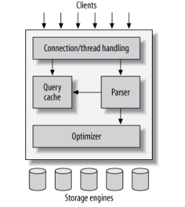
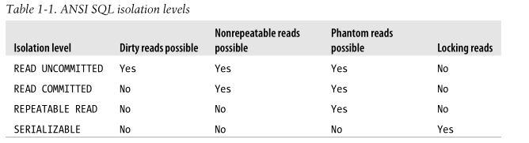

# High Performance MySQL
# 1 MySQL 架构与历史
本章主要介绍服务器架构、各种存储引擎之间的区别，以及这些区别的重要性。另外回顾mysql的历史以及基准测试。

## 1.1 MySQL的逻辑架构

最上层的服务并不是Mysql所独有的，大多数基于网络的客户端/服务器的工具或者服务都有类似的架构。比如连接处理，授权认证，安全等等。  
第二层：核心服务层，主要包括查询解析，分析，优化，缓存以及所有内置函数（例如日期，时间，数学和加密函数），所有跨存储引擎的功能都在这一层实现：存储过程，触发器，视图。  
第三层：包含存储引擎。存储引擎负责Mysql中数据的存储和提取。并且不同的存储引擎之间对上层是完全透明的。不同的引擎之间也不回相互通信。也不回解析SQL（InnoDB例外，它会解析外键定义）  
### 1.1.1 连接的管理与安全
Mysql为每一个客户端开启了一个线程（5.5之前，之后采用线程池--类似于reacter模式进行处理）。
安全上客户端或者应用连接服务端需要认证。认证是基于用户名，原始主机以及密码的信息。当然也可以使用基于ssl的x509认证。一旦客户端连接上，服务端就会通过查询客户端的权限进行表级别的授权。  
### 1.1.2 查询优化与执行
查询时会先构建解析树，然后进行优化重写查询和表的读取顺序以及选择合适的索引。  
优化器不关心第三层的存储引擎，但是存储引擎对于查询优化是有影响的。  
并且对于select语句，在查询之前服务器会先检查查询缓存，如果能够找到对应的查询，服务器就不必再查询解析。  
## 1.2 并发控制
MySQL利用锁的机制进行并发的控制，并发控制主要是服务器层和存储层进行并发控制。
### 1.2.1 读写锁
mysql通过读写锁的机制防止对同一数据产生冲突。
### 1.2.2 锁粒度
一般的常见商业数据库通过在表上施加行级锁，并以各种复杂的方式实现。而mysql提供了多种选择。每种存储引擎都有自己的锁策略和锁粒度。在存储引擎的设计中。锁管理是个非常重要的决定。主要的锁策略主要有两种  
1. 表锁
表锁是最基本的锁策略，并且是开销最小的策略。并且，写锁比读锁具有更好的优先级。
2. 行级锁
行级锁可以最大程度地支持并发处理，同时也带来了锁的开销，InnoDB和XtraDB以及其他的一些存储引擎实现了行级锁。
## 1.3 事务
一个运行良好的事务处理系统必须经过严格的ACID测试。
原子性，一致性，隔离性，持久性。
### 1.3.1 隔离级别
四种隔离级别分别为，
1. 未提交读（脏读）
2. 提交度（不可重复读）
3. 可重复读（幻读）
4. 串行化

### 1.3.2 死锁
死锁是指两个或者多个事务在同一资源上相互占用，并请求锁定对方占用的资源，从而导致恶性循环的现象。
InnoDB处理死锁的方法是将持有最少行锁的事务进行回滚释放锁。
### 1.3.3 事务日志
事务日志其实就是对数据的修改只修改内存副本，然后将修改持久化到磁盘。事务日志采用的是追加的方式，因此写日志的操作是磁盘上的一小块区域内的顺序IO.事务日志持久化后，内存中被修改的数据可以慢慢刷回到磁盘。（预写式日志 write ahead logging）.
### 1.3.4 MySQL中的事务
MySQL中的事务存储引擎主要有InnoDB和NDB Cluster，另外还有一些第三方存储引擎也支持事务，比较知名的有XtraDB和PBXT。  
1. 自动提交（默认）  
需要注意的是非事务型引擎没有提交和回滚概念，该字段没有任何影响。另外就是一些命令，如锁表的行为（ALTER TABLE）执行前都会自动提交事务。MYSQL可以通过设置事务的隔离级别（在下一次事务开始的时候生效）    
2. 事务中混合使用存储引擎  
需要了解在事务中回滚的话，如果数据使用了非事务型的表，那么在非事务的表示不能撤销的。  
3. 隐式和显示锁定
InnoDB采用的是两阶段锁定协议。在事务执行过程中，随时都可以执行锁定，锁只有在执行提交或者回滚时才会释放。并且所有的锁是在同一时刻被释放。InnoDB会根据隔离级别在需要的时候加锁。  
> 注意，一般除了事务中禁用了AUTOCOMMIT，可以使用LOCK TABLES之外，其他任何时候都不要显式地执行LOCK TABLES ,不管使用的是什么存储引擎。
## 1.4 多版本并发控制
大多数的Mysql的事务并不是简单的使用行锁机制。采用更为广泛的是多版本并发控制（MVCC），并且现在主流的如Oracle ,PostgreSQL也使用了这种高效的空间换时间的非锁来实现事务。  
MVCC的工作原理是保持数据在某个时间点的快照。这意味着事务可以看到一致的数据视图，无论它们运行多长时间。这也意味着不同的事务可以同时在相同的表中看到不同的数据。 
每个存储引擎以不同的方式实现MVCC。其中一些变体包括乐观并发控制和悲观并发控制。我们将通过解释InnoDB行为的简化版本来说明MVCC的一种工作方式。  
InnoDB通过在记录中添加两个字段来实现，分别是创建和删除版本（时间） 。每一个事务开启的时候都有一个创建版本（递增-对于同一行数据）。  
需要注意的是MVCC只在REPEATABLE READ 和READ COMMITTED两个级别下工作。
## 1.5 存储引擎
不同的存储引擎保存数据和索引的方式是不同的。但是在定义则是在mysql服务层同意处理的。查询每个数据库对应的表信息如下
```
USE quickfix;
SHOW TABLE STATUS LIKE 'messages'
```

### 1.5.1 InnoDB引擎
目前使用最多的支持事务的存储引擎，特别是5.1版本之后。    
特点  
1. 采用MVCC支持高并发，实现4个标准的隔离界别。并且通过间隙锁防止幻读。  
2. 基于聚簇建立索引。平台独立。  
3. 内部优化。内部实现可预测性读，自动在内存中创建hash索引(自适应哈希索引)，插入缓冲区    
4. 支持热备份。其他引擎不支持热备份。  
### 1.5.2 MyISAM引擎
MYSQL 5.1之前的more存储引擎，提供了大量的特性，如全文索引，压缩，空间函数等。但是该引擎不支持事务和行级锁，崩溃后无法安全恢复。  
1. 存储  
数据文件索引文件（MYD,MYI）分离。存储数据受限于磁盘空间或者os单个文件的最大尺寸。  
2. 特性
* 加锁与并发（对表加锁）
* 修复（可能丢失数据）
* 索引特性（即使是BLOB和等长字段，也可以基于前500个字符创建索引，支持全文索引）
* 延迟更新索引（主要提升写入性能）
3. 压缩表（导入数据后不修改时可以采用）
### 1.5.3 其他引擎
1. Archive引擎（只支持INSERT ,SELECT）
2. csv引擎（不支持索引-但是作为数据交换机制非常有用）
3. Memory引擎（比MyISQM快一个数量级，重启后数据丢失，但是结构还在。支持Hash索引，表级锁，并发写入性能较低）  
4. NDB集群引擎
### 1.5.4 第三方引擎
1. OLTP类引擎  
主要为开源或者github上的。如XtraDB/OLTP,TokuDB,RethinkDB,MySQL AB等。  
2. 面向列的存储引擎  
如Infobright,InfiniDB.
3. 社区存储引擎(不建议生产使用)  
Aria(MYSQL 设计者用来代替MyISAM的一款引擎)  
Groonga(号称准确而高效的全文索引)  
0QGraph支持图操作  
### 1.5.5 引擎的选择
大部分选择InnoDB都是正确的选择，除非特性不具备。例如全文索引的话，建议优先考虑InnoDB加上Sphinx的组合。而不是使用支持全文索引的MyISAM。  
考虑因素：  
1. 事务
支持的话（InnoDB,XtraDB），如果主要是SELECT 和INSERT那么MyISAM推荐（特别是日志型应用）  
2. 备份
如果支持在线热备（InnoDB）
3. 崩溃恢复。（InnoDB）
4. 特有特性
比如只有MyISAM支持地理空间搜索。
### 1.5.6 表的转换
常用的三种方法
1. ALTER TABLE   
例如
```
ALTER TABLE orders ENGINE = MYISAM;
```
需要注意该方式需要执行很长时间，因为会按行复制原表到新表中。同时会添加读锁。  
2. 导出导入  
使用mysqldump 工具导出数据。然后修改文件中的CREATETABLE语句的存储引擎选择。注意同事修改表名（并删除前面的DROP TABLE语句）。  
3. 创建与查询  
方式一
``` 
CREATE TABLE user_table LIKE USER;
ALTER user_table ENGINE=MYISAM ;
INSERT INTO user_table SELECT * FROM USER;
``` 
方式二
``` 
CREATE TABLE user_table LIKE USER;
ALTER user_table ENGINE=MYISAM ;
START TRANSACTION
INSERT INTO user_table SELECT * FROM USER WHERE id BETWEEN X AND Y；
COMMIT;
``` 
# 2 MySQL 基准测试
## 2.1 为什么需要基准测试
1. 验证基于系统的假设是否符合实际情况。  
2. 重现系统中的某些异常行为。   
3. 测试运行情况  
4. 模拟负载  
5. 规划未来业务增长。评估未来项目负载下需要什么样的硬件。  
6. 测试使用可变环境的能力。比如发现系统在随意的并发峰值下的性能表现  
7. 测试不同的硬件软件操作系统配置。  
8. 证明信采购设备是否配置正确。  
## 2.2 基准测试的策略
主要有两种一种是整个系统整体测试，另外是单独测试MySQL。这两种策略也被称为集成式以及单组件式基准测试。  
集成测试的原因  
1. 用户关注整体性能
2. mysql并非总是性能瓶颈
3. 只有整体测试才能发现各部分之间缓存带来的影响。  
4. 整体继承测试更能揭示应用的真是表现。
单独测试
1. 需要不同的schema或查询的性能。
2. 针对应用某个问题测试
### 2.2.1 测试何种数据
## 2.3 基准测试策略
### 2.3.1 基准设计和计划
### 2.3.2 基准应该持续多久
### 2.3.3 系统状态和性能获取
### 2.3.4 获取积累结果
### 2.3.5 运行基准和分析结果
### 2.3.6 绘图的重要性
## 2.4 基准工具
### 2.4.1 完整的工具
### 2.4.2 单组件工具
## 2.5 基准工具
### 2.5.1 http_load
### 2.5.2 Mysql 基准套件
### 2.5.3 sysbench
### 2.5.4 dbt2 TPC-C 
### 2.5.5 Percona TPCC-MySQL工具
## 2.6 总结
# 3 分析服务器性能
最常碰到的三个性能相关的服务请求是:
1. 如何确认服务器是否达到了性能最佳状态
2. 找出某条语句为什么执行不够快
3. 诊断被用户描述成"停顿","堆积"或者"卡死"的某些间歇性疑难故障.
## 3.1 性能优化简介  
误区1 CPU利用率上升并不代表性能出现了问题,有时候反而是缩短了响应时间的必要消耗.CPU利用率只是一种现象,而不是很好的可度量目标.     
误区2 qps的提升,这仅仅是吞吐量的优化,吞吐量的提升可以看做性能优化的副产品.     
如果与优化目标是降低响应时间.最重要的是测量时间花费在了哪个步骤.  
### 3.1.1 通过性能剖析进行优化  
## 3.3 分析MySQL查询


### 3.3.1 服务端负载分析
可以通过分析查询日志进行分析(Files: /var/lib/mysql/slow.log)
pt_qurery_digest工具
```
$ pt-query-digest --limit=100% /var/lib/mysql/slow.log > ptqd1.out
```
结果
```
# Profile
# Rank Query ID           Response time Calls R/Call V/M   Item
# ==== ================== ============= ===== ====== ===== ==============
#    1 0x558CAEF5F387E929 14.6729 35.2% 93956 0.0002  0.00 SELECT sbtest?
#    2 0x737F39F04B198EF6  6.4087 15.4%  9388 0.0007  0.00 SELECT sbtest?
#    3 0x84D1DEE77FA8D4C3  3.8566  9.2%  9389 0.0004  0.00 SELECT sbtest?
#    4 0x3821AE1F716D5205  3.2526  7.8%  9390 0.0003  0.00 SELECT sbtest?
#    5 0x813031B8BBC3B329  3.1080  7.5%  9385 0.0003  0.00 COMMIT
#    6 0xD30AD7E3079ABCE7  2.2880  5.5%  9387 0.0002  0.00 UPDATE sbtest?
#    7 0x6EEB1BFDCCF4EBCD  2.2869  5.5%  9389 0.0002  0.00 SELECT sbtest?
#    8 0xE96B374065B13356  1.7520  4.2%  9384 0.0002  0.00 UPDATE sbtest?
#    9 0xEAB8A8A8BEEFF705  1.6490  4.0%  9386 0.0002  0.00 DELETE sbtest?
#   10 0xF1256A27240AEFC7  1.5952  3.8%  9384 0.0002  0.00 INSERT sbtest?
#   11 0x85FFF5AA78E5FF6A  0.8382  2.0%  9438 0.0001  0.00 BEGIN
```
### 3.3.2 单个查询分析
通过show Profiles命令分析单条命令的执行
```
SET profiling =1;
SELECT * FROM USER;
SHOW PROFILES;
```
结果(单位s) 
```
Query_ID    Duration  Query                                           
--------  ----------  ------------------------------------------------
       3  0.00020900  show create table `gogs`.`team_repo`            
       4  0.00069775  show full fields from `gogs`.`team_repo`        
       5  0.00032800  show keys from `gogs`.`team_repo`               
       6  0.02191575  select * from `gogs`.`team_user` limit 0, 1000  
       7  0.00019650  show create table `gogs`.`team_user`            
       8  0.00066400  show full fields from `gogs`.`team_user`        
       9  0.00032525  show keys from `gogs`.`team_user`               
      10  0.00048075  select * from `gogs`.`team_repo` limit 0, 1000  
      11  0.00032875  show create table `gogs`.`team_repo`            
      12  0.00107975  show full fields from `gogs`.`team_repo`        
      13  0.00051425  show keys from `gogs`.`team_repo`               
      14  0.00031425  set profiling =1                                
      15  0.00074000  select * from user LIMIT 0, 1000                
      16  0.00029675  select * from team_repo LIMIT 0, 1000           
      17  0.00017850  profile                                         
```
更为精细的分析(比如16条)
```
SHOW PROFILE FOR QUERY 16;
```
查询结果  
```
Status                Duration  
--------------------  ----------
starting              0.000027  
checking permissions  0.000005  
Opening tables        0.000011  
init                  0.000011  
System lock           0.000007  
optimizing            0.000003  
statistics            0.000008  
preparing             0.000007  
executing             0.000003  
Sending data          0.000031  
end                   0.000038  
query end             0.000006  
closing tables        0.000006  
freeing items         0.000127  
cleaning up           0.000010  
```
show status; 
主要返回一些计数器(全局),主要显示某些活动读取索引的频繁程度,
SHOW STATUS WHERE Variable_name LIKE 'Handler%' OR variable_name LIKE 'Create%';
```
Variable_name               Value   
--------------------------  --------
Created_tmp_disk_tables     17      
Created_tmp_files           5       
Created_tmp_tables          53      
Handler_commit              19      
Handler_delete              0       
Handler_discover            0       
Handler_external_lock       40      
Handler_mrr_init            0       
Handler_prepare             0       
Handler_read_first          36      
Handler_read_key            64      
Handler_read_last           0       
Handler_read_next           37      
Handler_read_prev           0       
Handler_read_rnd            19      
Handler_read_rnd_next       1353    (没有用到索引的读操作) 
Handler_rollback            0       
Handler_savepoint           0       
Handler_savepoint_rollback  0       
Handler_update              9       
Handler_write               539     
```
### 3.3.3  使用性能能剖析
例如explain
```
EXPLAIN SELECT* FROM USER;
```
结果 
```
    id  select_type  table   partitions  type    possible_keys  key     key_len  ref       rows  filtered  Extra   
------  -----------  ------  ----------  ------  -------------  ------  -------  ------  ------  --------  --------
     1  SIMPLE       user    (NULL)      ALL     (NULL)         (NULL)  (NULL)   (NULL)      14    100.00  (NULL)  
```
# 4 Schema和数据类型优化

## 4.1 选择最佳数据类型
选择类型原则:  
1. 更小的通常更好
2. 简单就好:简单类型需要更少的cpu周期,比如整形比字符串操作代价更低.  
3. 尽量避免NULL

Mysql为了兼容性,支持了很多别名,例如INTEGER,BOOL,NUMERIC,它们都只是别名,使用show CREATE TABLE检查,报告的是基本类型,而不是别名.  
### 4.1.1 整数  
两种:整数和实数.  
整数主要有:TINYINT(8),SMALLINT(16),MEDIUMINT(24),INT(32),BIGINT(64).    
默认是有符号的,如果无符号需要使用UNSIGNED进行属性添加.   
MYSQL中为整数类型指定款物一般是没有意义的:对于存储和计算来说,INT(1)和INT(20)是相同的.  
### 4.1.2 实数类型.  
实数是带有小数部分的数字.  它们不只是为了存储小数部分,也可以使用DECIMAL存储比BIGINT还大的整数.   
FLOAT和DOUBLE类型支持使用标准的浮点运算进行近似计算.    
MySQL5.0和更高版本将数字打包保存到一个二进制字符串中(每4个字节存9个数字).例如:DECIMAL(18,9)小数点两边将各存储9个数字,一共使用9个字节:小数点前的数字用4个字节,小数点后的数字用4个字节,小数点本身占一个字节.  
### 4.1.3 字符串
常用的主要是varchar 和char类型(具体存储细节与存储引擎有关)  
varchar是变长的(需要额外的1或者两个字节存储长度,如果是255以内则1个字节,否则两个字节),变长的优化了性能,但是对于update操作可能会变长.
char类型为定长的,适合存储一些短字符串,不容易产生碎片,比如存储md5(密码的).

需要注意有时候char类型的行为可能有些难以理解,比如(会删除末尾所有的空格)
测试  
```
USE msqlperf;
CREATE TABLE char_test(char_col CHAR(10));
DELETE  FROM char_test;
INSERT INTO char_test(char_col) VALUES ('string1'),('  string2'),('string4  ');
SELECT CONCAT("'",char_col,"'") FROM char_test;
CREATE TABLE varchar_test(char_col VARCHAR(10));
DELETE FROM varchar_test;
INSERT INTO varchar_test(char_col) VALUES ('string1'),('  string2'),('string4  ');
SELECT CONCAT("'",char_col,"'") FROM varchar_test;
```
注意这里的查询结果是不同的

blob和text类型(二进制与字符)  
text家族(TINYTEXT,SMALLTEXT,TEXT,MEDIUMTEXT,LONGTEXT)
blob家族(TINYBLOB,SMALLBLOB,BLOB,MEDIUMBLOB,LONGBLOB)  
需要注意排序的细节(只对每个列的最前面的max_sort_length字节而不是整个字符排序),如果需要减少则可以减小max_sort_length,或者使用order by substring(column ,length)  

使用enum代替字符串
```
CREATE TABLE enum_test( e ENUM('fish','apple','dog') NOT NULL);
INSERT INTO enum_test(e) VALUES ('fish'),('dog'),('apple');
SELECT e+0 FROM enum_test;
SELECT * FROM enum_test ORDER BY FIELD(e,'fish','dog','apple');
```
需要注意,有个不好的地方,就是一旦需要加,就需要update 表的操作.  

### 4.1.4 日期和时间
mysql可以使用许多类型来保存日期和时间(YEAR,DATE),mysql存储时间粒度为s,mariadb支持mic级别.  
日期类型:DATETIME(1001-9999,精度s,8字节存储),TIMESTAMP(UNIX时间戳1970-2038,4字节存储,s级别)
### 4.1.5 基于Bit的数据
```
CREATE TABLE bittest(a BIT(8));
INSERT INTO bittest VALUES(b'00111001');
SELECT a,a+0 FROM bittest;
```
结果
```
a               a+0  
-----------  --------
b'111001'          57
```
### 4.1.6 标识符的选择
为标识类选择合适的数据类型,比较重要,比如int类型的当使用做外键时如果使用TINYINT则可以提升很高的性能.  
整数类型:首选,可以使用AUTO_INCREMENT  
ENUM和SET(尽量避免),但是如果是固定的比如性别等可以使用  
字符串类型(尽量避免,因为比较消耗空间,并且比数字慢,特别是使用MyISAM中,因为会有压缩,导致速度慢6倍左右)  
如果存储UUID,应该移除'-';或者使用UNHEX()函数转换成16字节的数字,并且存储在一个BINARY(16)列中.检索时可以通过HEX()函数来格式化为十六进制格式.  
### 4.1.7 特殊的数据类型
比如低于s级别精度的时间戳,ip地址(推荐使用无符号整数存储IP地址32位,使用内置INET_ATON()和INET_NTOA()转换)
```
SELECT INET_ATON('192.168.1.159');
SELECT INET_NTOA(3232235935);
```
## 4.2 MySQL中的模式设计陷阱
1. 太多的列
2. 太多的关联(12个表以内)  
3. 全能的枚举
## 4.3 范式和反范式
在范式化的数据库中,每隔事实数据会出现并且只出现一次  
比如一对多场景

### 4.3.1 范式的优点和缺点
* 更新操作比反范式的快
* 当数据较好地范式化时,就只有
* 范式化的表通常很小,可以放入内存
* 很少有多余的表意味着检索列表数据时更少需要DISTINCT或者GROUP BY ,非范式化的结构中必须使用DISTINCT或者GROUP BY才能获得一份唯一的部门列表.  
### 4.3.2 反范式利弊  
基本不需要关联,避免了随机IO
假设一个网站,允许用户发送消息,并且一些用户是付费用户,现在想看付费用户最近的10条信息,如果是范式化的
```
select message_text,user_name 
from message 
    inner join user on user.id=message.user_id
where user.account_type='premiumv' 
order by message.published DESC LIMIT 10;
```
这里会全表扫描message表.  
如果反范式的话,将两张表的字段合并一下,并且增加一个索引(account_type,published)就可以不通过关联写出这个查询了.
```
select messge_text,user_name 
from user_message 
where account_type='premiumv'
order by published desc 
limit 10;
```
### 4.3.3 混用范式化和反范式化   
最常见的反范式化数据的方法是复制或者缓存,不同的表中存储相同的特定列.mysql5.0和更新版本中,可以使用触发器更新缓存值,这使得这样的方式变得更简单.  
## 4.4 缓存与汇总表
有时提升性能最好的方法是在同一张表中保存衍生的冗余数据.然而,有时也需要一张完全独立的汇总表或缓存表.
### 4.4.1 实体化视图
### 4.4.2 计数器表
## 4.5 加速修改表
### 4.5.1 仅修改.frm文件
### 4.5.2 快速建立MyISAM索引
## 4.6 总结

# 5 高性能索引
# 6 查询性能优化
# 7 高级MySQL功能
# 8 优化服务器设置
# 9 操作系统和硬件优化
# 10 主从复制
# 11 MySQL扩展
# 12 高可用
# 13 存储云中的MySQL
# 14 应用程序级优化
# 15 备份与恢复
# 16 MySQL用户工具
