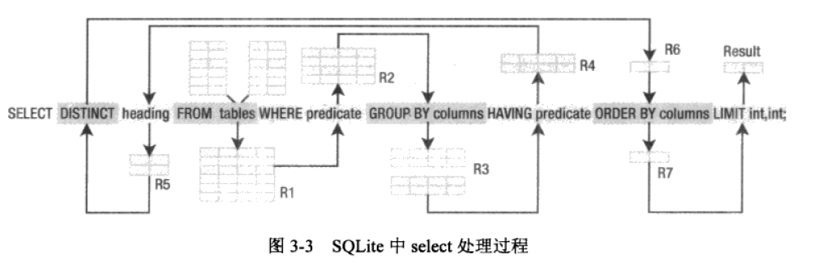
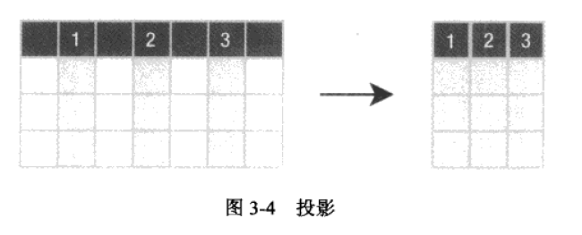
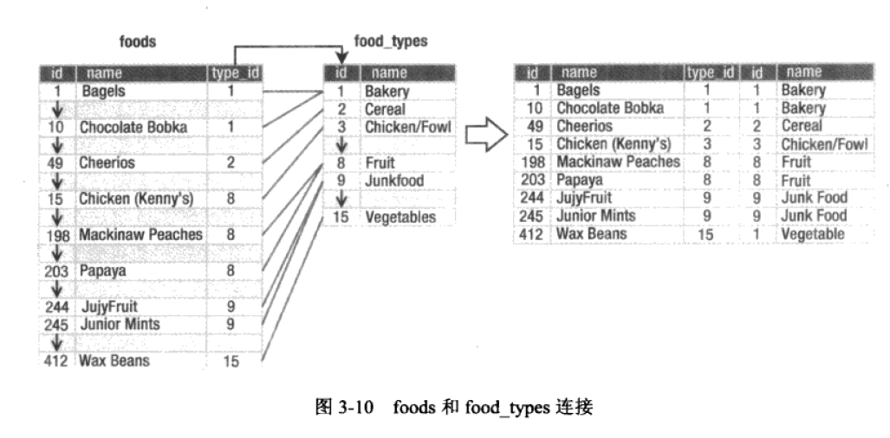
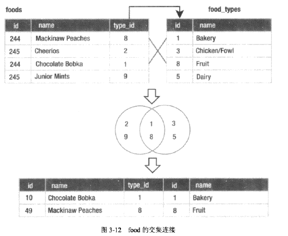

# 1. clion+cmake+vcpkg 的环境搭建使用
cmake 配置项
```
include_directories("H:/libbuild/vcpkg/installed/x64-windows-static/include")
link_directories("H:/libbuild/vcpkg/installed/x64-windows-static/lib/")
```
## 1.1. sqlite获取
使用vcpkg (选择适合你的版本)
```
vcpkg install  sqlite3:x64-windows-static                    
vcpkg install  sqlite3:x86-windows                           
vcpkg install  sqlite3:x86-windows-static 
```
# 2. 操作
## 2.1. 数据库查询  
### 2.1.1. 关系操作  
* 基本操作(限制,投影,笛卡尔积,联合,差,重命名)
* 附加操作(交叉,自然连接,赋值)
* 扩展操作(广义投影,左外连接,右外连接,全外连接)  

通用格式
```
select [distinct] heading 
from tables
where predicate 
group by columns 
hiving predicate 
order by columns 
limit count ,offset;
```
  
#### 2.1.1.1. 投影(select 后)
  
```
select id ,name  from food_types;
```
#### 2.1.1.2. 限制(where 过滤)
其实就是where字句
#### 2.1.1.3. 二元操作
如select 2>4;
#### 2.1.1.4. 函数与聚合  
select upper('hello newman'),length('hello newman'),abs(-12);
聚合类:sum,avg,count,min,max  
#### 2.1.1.5. 分组  
聚合操作不只是能够计算整个结果集的聚合值,还可以吧结果集分为多个组,
该字句介于where和select字句之间,接收where的输出
select type_id ,count(*) from foods group by type_id;
对于统计的结果也可以做过滤
select type_id,count(* ) from foods group by type_id having count(*)< 20;
#### 2.1.1.6. 去掉重复(distinct)
select distinct type_id from foods;
#### 2.1.1.7. 多表连接  
join是多表数据工作的关键,它是select 命令的第一个操作.连接操作的结果作为输入,供select语句的其他部分过滤处理.   
例如food,food_type  
select foods.name,food_types.name from foods,food_types where foods.type_id=food_type.id limit 10;
为了实现连接,数据库需要找出匹配的行,对于第一个表中的每一行,数据库都要查询第二个表的所有行,寻找那些连接字段具有相同值的行,然后将它们的包含关系输入关系中.
过程图  
  
SQLite支持6中不同的连接(内连接使用最普遍)  
* 内连接:通过表中的两个字段进行连接,如前面例子.
  
```
select * from food inner join food_types on  foods.id=food_types.id;
```
* 交叉连接(笛卡尔积,交叉乘积):无连接条件时一般会产生这种情况,select* from foods,food_types;通常不会使用
* 外连接:内连接根据给定关系选择表中的行.外连接选择内连接的所有行外加一些关系之外的行.
  * 左外连接
    ```
    select * from foods left outer join foods_episodes on foods.id=foods_episodes.food_id;
    //该sql中foods是其中的左表,它是左外连接中很重要的表.左外连接试图将foods中所有的行与food_episodes进行连接. 
    ```
  * 右外连接:右表为关键的表.呈现在结果集中,左表中无匹配的字段,为null
  * 全外连接: 左外连接与右外连接的结合.包含所有的行(SQLite不支持全外和右外连接,但是可以通过复合查询执行)  
* 自然连接:它是内连接的另一种形式.自然连接通过表中共有的字段名称将两个表连接起来,因此不用添加连接条件就可以获得内连接的结果(会连接两个表中所有具有相同名称的字段)

语法偏好:
内连接可以使用交叉连接+where子句隐含实现.  
一般形式如下: 
```
select heading form left_table join_type right_table on join_condition;
例如  
select * from foods inner join food_types on foods.id=food_type.food_id;
select * from foods left outer join food_types on foods.id=food_types.food_id;
select * from foods cross join food_types;
```
#### 2.1.1.8. 子查询  
子查询是指select语句中又嵌套select语句.   
一对多,从多的某个字段,查询一中的某个个字段的数据(或者添加额外数据)
```
select count(*) from foods 
where type_id in 
(select id from food_types where name='Bakery' or name='Cereal');
```
添加额外数据
```
select name ,(select count(id) from foods_episodes where food_id=f.id) count from foods f order by count desc limit 10;

select f.name ,types.name from foods f inner join(select * from food_types where id=6) types on f.type_id=types.id;
```
#### 2.1.1.9. 复合查询
复合查询与子查询相反,它是三种特殊的关系操作符(union,intersect,except),交并差
复合查询需要如下一些参数
* (涉及的关系的字段数目必须相同),
* 只能有一个order by子句(在符合查询的最末尾)  
* 复合查询的关系从左向右处理.  

demo(union 默认会消除重复数据,如果想保存使用union all)
挑选频率最好与最低的两个数据
```
select f.* ,top_foods.count from foods f 
inner join 
    (select food_id,count(food_id) as count from foods_episodes group by food_id
    order by count(food_id) desc limit 1)top_foods 
    on f.id=top_foods.food_id
union 
select f.* ,bottom_foods.count from f 
inner join
    (select  food_id,count(food_id) as count from foods_episodes group by food_id
    order by count(food_id)  limit 1)bottom_foods 
    on f.id=top_foods.food_id
order by top_foods.count desc;
```
#### 2.1.1.10. 条件结果
case表达式允许在select语句中处理各种情况.  
demo:
```
select name || case type_id when 7 then ' is drink'
                            when 8 then ' is fruit'
                            when 9 then 'is junkfood'
                            when 13 then 'is seafood'
                            else null
                            end description 
       from foods 
       where description is not null
       order by name 
       limit 10;
```
#### 2.1.1.11. 关于NULL
数据库中null,既不是真也不是假,就是自己null 
| x     | y     | x and y | x or y |
| :---- | :---- | :------ | :----- |
| True  | True  | True    | True   |
| True  | False | False   | True   |
| True  | NULL  | NULL    | True   |
| False | False | False   | False  |
| False | NULL  | False   | NULL   |
| NULL  | NULL  | NULL    | NULL   |


# 3. 高级操作
## 3.1. null和UNIQUE 
定义为UNIQUE的域可以放任意多个NULL,NULL不等于任何值,甚至不等于其他的NULL.  
SQLite自增主键,如果删除数据时可能回收下次分配,所以不一定是暗号严格顺序增长的.  
但是如果在integer primary key 后添加autoincrement ,这就会阻止rowid回收,sqlite会在一个名为sqlite_sequence的系统表中记录该字段的当前最大值. 它在后面的insert语句中只使用比当前值大的.
## 3.2. 时间戳
对于时间defaul 
可以接受三种预定义格式的ANSI/ISO保留字,current_time,current_date,current_timestamp会生成日期时间组合.  

## 3.3. check约束 
如
```
create table foo ( x integer,y integer check(y>x),z integer check(z>abs(y)));
```
## 3.4. 外键约束(关系完整性)   
```
create table table_name (
    column_definition references foreign_table (column_name) 
    on {delete|update} integrity_action  
    [not] deferrable [initially {deferred|immediate},]
);
```
举例
两个基础表  
```
crate table food_types(
    id integer primary key,
    name text
)
create table foods(
    id integer primary key,
    type_id integer,
    name text
)
```
如果保存关系完整性就可以使用(对foods重定义)
```
create table foods(
    id integer primary key,
    type_id integer references food_type(id)  
                    on delete restrict
                    deferrable initially deferred,
    name text
);
```
on delete restrict -sqlite阻止任何这样的删除行为  
完整的定义如下 on delete
```
set null:如果父值被删除,或者不存在了,剩余的子值将修改为null
set default:如果父值被删除,或者不存在了,剩余的子值将修改为默认值
cascade:更新父值时,更新所有预知匹配的子值.删除父值时删除所有的子值(该选项慎用)
restrict:更新或删除父值可能会出现孤立的子值,从而阻止(终止)事务.
no action:不干涉操作执行,只是观察变化.
```
defferable子句是表示立即强制实施还是延迟到整个事务结束时.  


## 3.5. 存储类
|名称|说明|
|:--|:--|
|integer|整数值是全部的数字,整数可以是1,2,3,4,6,8字节.整数的最大范围8字节,SQLlite根据数字的值自动控制整数所占字节数|
|real|实数是十进制数值,SQLite使用8字节的浮点数来存储实数|
|Text|文本|
|blob|二进制对象|
|NULL|SQL对NULL的支持|

测试
```
select typeof(3.14) ,typeof('3.14') ,typeof(314) ,typeof(x'3142'),typeof(NULL)
```

sqlite 的字段可以包含不同的类型
```
drop table domain;
create table domain(x);
insert into domain values (3.142)
insert into domain values ('3.142')
insert into domain values (3142)
insert into domain values (x'3.142')
insert into domain values (null)
select rowid,x,typeof(x) from domain;
```
排序规则
nULL>integer/real>text>blob
## 3.6. 视图  
视图即虚拟表,也称为派生表,因为他的内容都是派生自其它表的查询结果.虽然视图看起来就像基本表一样,但是他们不是基本表.基本表的内容是持久的,而视图的内容是使用时动态产生的.  
demo
```
create view name as select-stmt;
```
### 3.6.1. 场景  
如果经常用到如下查询  
```
select f.name,ft.name,e.name 
from foods f
inner join food_types ft on f.type_id=ft.id
inner join foods_episodes fe on f.id=fe.food_id
inner join episodes e on fe.episode_id=e.id;
```
该查询返回所有的food的名称,以及所在系列.但是不用每次需要这些结果时写出该查询,可以使用
```
create view details  as 
select f.name as fd,ft.name as tp,e.name  as ep,e.season as ssn
from foods f
inner join food_types ft on f.type_id=ft.id
inner join foods_episodes fe on f.id=fe.food_id
inner join episodes e on fe.episode_id=e.id;
```
此外还可以基于该视图进行如下查询
```
select fd as food,ep as episode 
from details 
where ssn=7 and tp like 'Drinks';
```
删除视图
```
drop view name;
```
## 3.7. 索引  
SQLite使用B-tree做索引.
创建命令如下
```
create index [unique] index_name on table_name (columns)
```
>> unique 关键字覆盖index中的所有字段,不管是联合值还是单个值,都必须是唯一的.  

```
create table foo( a text,b text);
create unique index foo_idx on foo(a,b);
insert into foo values('unique','value');
insert into foo values ('unique','value2');
insert into foo values ('unique','value')

会产生如下错误 SQL error: columns a,b not unique
```
如果要删除索引  
```
drop index index_name;
```
### 3.7.1. 排序规则  
demo 在foods.name上创建大小写不敏感的索引
```
create index foods_name_index on foods (name collate nocase);
```
索引查询  
```
.indices foods

或者
.schema foods
```
### 3.7.2. 使用索引  
对于where字句中出现的表达式,SQLite将使用单个字段索引
```
column { = | >|>=|<=|< } expression
expression {= |> | >=|<=| < }  column  
column in (expression -list)
column in (subquery)
```
### 3.7.3. 索引场景
```
create table foo(a,b,c,d);
create index foo on(a,b,c,d);

select * from foo where a=1 and b=2 and d=3;
//其中 第一个和第二个条件将使用索引,第三个不使用(因为SQLite使用多字段索引时,它从左到右智能使用索引,到c的时候已经断了)

select * from foo where a>1 and b=2 and c=3 and d=4
//只使用到a>1 之后 其他的就不合格了

select * from foo where a=1 and b>2 and c=3 and d=4
//在b>2之后就不合格了
```
## 3.8. 触发器  
当具体的表发生特定的数据库事件时,触发执行对应的SQl命令  
创建触发器的一般命令如下  
```
create [temp | temporary] trigger name  [before|after] [insert|delete|update|update of columns] on table action
```
更新触发器  
demo
```
create temp table log(x);
create temp trigger foods_update_log update of name on foods
    begin   
        insert into log values('updated foods: new name =' || new.name);
    end;

begin;
update foods set name='JUJYFRUIT' where name='JujyFruit';
select * from log;
rollback;
```

##  事务  
事务控制命令: begin commit rollback  + savepoint

* 默认情况下自动提交模式

SQLite支持savepoint 和release命令  
如下所示  
```
savepoint justincase; 
rollback [transaction] to justincase;
```
### 冲突解决
即当执行失败时,之前的操作应该怎么办?
* replace:SQL继续执行并不报错,该错误记录删除
* ignore:该行记录保持不变.SQL继续执行并不报错
* fail:之前的成功,之后的不执行
* abort:SQlite恢复命令所做的所有改变并终止命令.
* rollback:事务范围内的操作都回滚
# 4. 第五章简单看一下