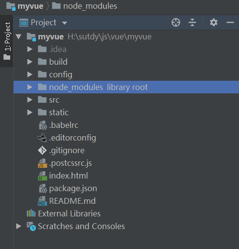
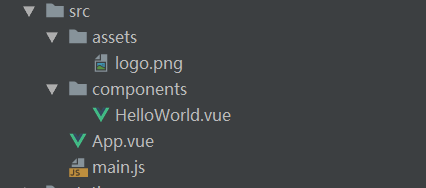

# 什么是vue-cli  
vue-cli 官方提供的一个脚手架（预先定义好的目录结构及基础代码，咱们在创建 Maven 项目时可以选择创建一个骨架项目，这个骨架项目就是脚手架；可以参考我以前写的 LeeSite 项目骨架生成工具），用于快速生成一个 vue 的项目模板  
## 主要功能   
* 统一的目录结构  
* 本地调试
* 热部署
* 单元测试
* 集成打包上线  
## 环境准备
* Node.js(>=6.x,首选8.x)
* git  
## 安装  vue-cli  
1. 安装 Node.js  
[官网下载](http://nodejs.cn/download)  
```
npm install cnpm -g

# 或使用如下语句解决 npm 速度慢的问题
npm install --registry=https://registry.npm.taobao.org
```
2. vue-cli  
```
cnpm install vue-cli -g
#测试  
$ vue list
```
## 创建应用  
```
vue init webpack myvue
```
然后根据需要进行选择  
```
Project name：项目名称，默认 回车 即可
Project description：项目描述，默认 回车 即可
Author：项目作者，默认 回车 即可
Install vue-router：是否安装 vue-router，选择 n 不安装（后期需要再手动添加）
Use ESLint to lint your code：是否使用 ESLint 做代码检查，选择 n 不安装（后期需要再手动添加）
Set up unit tests：单元测试相关，选择 n 不安装（后期需要再手动添加）
Setup e2e tests with Nightwatch：单元测试相关，选择 n 不安装（后期需要再手动添加）
Should we run npm install for you after the project has been created：创建完成后直接初始化，选择 n，我们手动执行
```
**初始化并运行** 
```
cd myvue
npm install
npm run dev
```
# 目录结构  
  
```
build 和 config：WebPack 配置文件  
node_modules：用于存放 npm install 安装的依赖文件
src： 项目源码目录
static：静态资源文件
.babelrc：Babel 配置文件，主要作用是将 ES6 转换为 ES5
.editorconfig：编辑器配置
eslintignore：需要忽略的语法检查配置文件
.gitignore：git 忽略的配置文件
.postcssrc.js：css 相关配置文件，其中内部的 module.exports 是 NodeJS 模块化语法
index.html：首页，仅作为模板页，实际开发时不使用
package.json：项目的配置文件
name：项目名称
version：项目版本
description：项目描述
author：项目作者
scripts：封装常用命令
dependencies：生产环境依赖
devDependencies：开发环境依赖
```
## src 目录
  

### main.js
项目的入口文件，我们知道所有的程序都会有一个入口
```
// The Vue build version to load with the `import` command
// (runtime-only or standalone) has been set in webpack.base.conf with an alias.
import Vue from 'vue'
import App from './App'

Vue.config.productionTip = false

/* eslint-disable no-new */
new Vue({
  el: '#app',
  components: { App },
  template: '<App/>'
})
```
* import Vue from 'vue'：ES6 写法，会被转换成 require("vue"); （require 是 NodeJS 提供的模块加载器）
* import App from './App'：意思同上，但是指定了查找路径，./ 为当前目录
* Vue.config.productionTip = false：关闭浏览器控制台关于环境的相关提示
* new Vue({...})：实例化 Vue  
  * el: '#app'：查找 index.html 中 id 为 app 的元素
  * template: '<App/>'：模板，会将 index.html 中 <div id="app"></div> 替换为 <App />
  * components: { App }：引入组件，使用的是 import App from './App' 定义的 App 组件
### App.vue
组件模板  
```
<template>
  <div id="app">
    
    <HelloWorld/>
  </div>
</template>

<script>
import HelloWorld from './components/HelloWorld'

export default {
  name: 'App',
  components: {
    HelloWorld
  }
}
</script>

<style>
#app {
  <!-- 字体 -->
  font-family: 'Avenir', Helvetica, Arial, sans-serif;
  <!-- 文字平滑效果 -->
  -webkit-font-smoothing: antialiased;
  -moz-osx-font-smoothing: grayscale;
  text-align: center;
  color: #2c3e50;
  margin-top: 60px;
}
</style>

```
* template：HTML 代码模板，会替换 <App /> 中的内容
* import HelloWorld from './components/HelloWorld'：引入 HelloWorld 组件，用于替换 template 中的 < HelloWorld />  
* export default{...}：导出 NodeJS 对象，作用是可以通过 import 关键字导入
  * name: 'App'：定义组件的名称
  * components: { HelloWorld }：定义子组件
>> 关于 < style scoped> 的说明：CSS 样式仅在当前组件有效，声明了样式的作用域