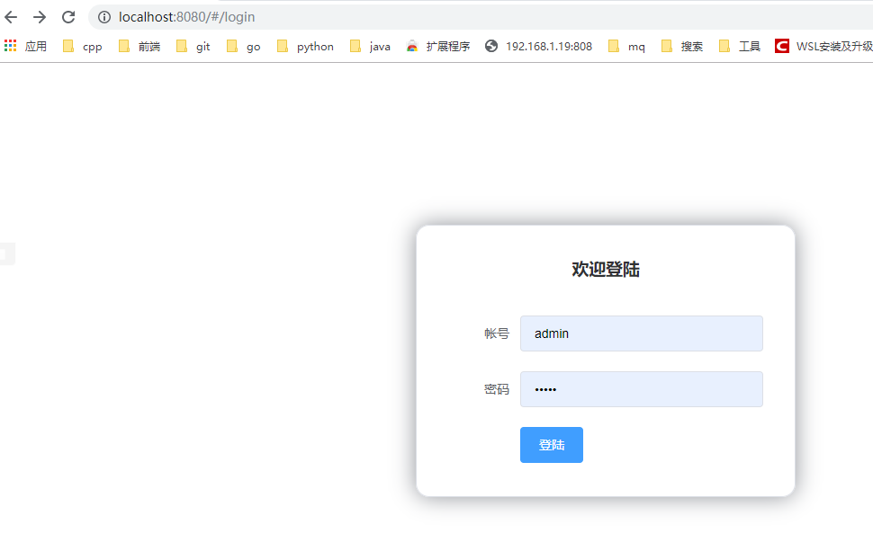

## 概述  
Vue Router 是 Vue.js 官方的路由管理器。它和 Vue.js 的核心深度集成，让构建单页面应用变得易如反掌。包含的功能有：  
*  嵌套的路由/视图表
*  模块化的、基于组件的路由配置
*  路由参数、查询、通配符
*  基于 Vue.js 过渡系统的视图过渡效果
*  细粒度的导航控制
*  带有自动激活的 CSS class 的链接
*  HTML5 历史模式或 hash 模式，在 IE9 中自动降级
*  自定义的滚动条行为

## 安装
vue-router 是一个插件包，所以我们还是需要用 npm/cnpm 来进行安装的。打开命令行工具，进入你的项目目录，输入下面命令。  
```
cnpm install vue-router --save-dev  
```
如果在一个模块化工程中使用它，必须要通过 Vue.use() 明确地安装路由功能：
```
import Vue from 'vue'
import VueRouter from 'vue-router'

Vue.use(VueRouter);
```
##  使用  
1. 先写两个模板页面component 
```
<template>
    <div>
      我是内容页
    </div>
</template>

<script>
    export default {
        name: "Content"
    }
</script>

<style>
  #app {
    font-family: 'Avenir', Helvetica, Arial, sans-serif;
    -webkit-font-smoothing: antialiased;
    -moz-osx-font-smoothing: grayscale;
    text-align: center;
    color: #2c3e50;
    margin-top: 60px;
  }
</style>
```

2. route目录创建index.js(类似于RequestMapping的功能,进行关联)
```
import Vue from 'vue'
// 导入路由插件
import Router from 'vue-router'
// 导入上面定义的组件
import Content from '@/components/Content'

// 安装路由
Vue.use(Router);

// 配置路由
export default new Router({
  routes: [
    {
      // 路由路径
      path: '/content',
      // 路由名称
      name: 'Content',
      // 跳转到组件
      component: Content
    }
  ]
});
```
5. 主页面引入(类似于Spring框架中的MVC引入)
```
import Vue from 'vue'
import App from './App'
// 导入上面创建的路由配置目录
import router from './router'

Vue.config.productionTip = false;

new Vue({
  el: '#app',
  // 配置路由
  router,
  components: { App },
  template: '<App/>'
});
```
6. 页面进行拼接(view中App.vue)
```
<template>
  <div id="app">
    <router-link to="/">首页</router-link>
    <router-link to="/content">内容</router-link>
    <router-view></router-view>
  </div>
</template>

<script>
export default {
  name: 'App'
}
</script>

<style>
  #app {
    font-family: 'Avenir', Helvetica, Arial, sans-serif;
    -webkit-font-smoothing: antialiased;
    -moz-osx-font-smoothing: grayscale;
    text-align: center;
    color: #2c3e50;
    margin-top: 60px;
  }
</style>
```
测试  启动 即可
```
npm run dev
```
## 脚手架项目初始化  
```
#不进行vue-router和测试的安装,也不npm install
vue init webpack hello-vue  
# 进入工程目录
cd hello-vue
# 安装 vue-router
npm install vue-router --save-dev
# 安装 element-ui
npm i element-ui -S
# 安装 SASS 加载器
npm install sass-loader node-sass --save-dev
# 安装依赖
npm install
npm run dev 
```
### npm相关命令
* npm install moduleName：安装模块到项目目录下
* npm install -g moduleName：-g 的意思是将模块安装到全局，具体安装到磁盘哪个位置，要看 npm config prefix 的位置
* npm install -save moduleName：--save 的意思是将模块安装到项目目录下，并在 package 文件的 dependencies 节点写入依赖，-S 为该命令的缩写
* npm install -save-dev moduleName：--save-dev 的意思是将模块安装到项目目录下，并在 package 文件的 devDependencies 节点写入依赖，-D 为该命令的缩写
### 目录结构完善
添加目录view router  
### 路由设计  
```
import vue from "vue";
import Router from "vue-router";
import Login from "../view/Login";
import Main from "../view/Main";
vue.use(Router);
export default  new Router({
  routes:[
    {
      //登陆页面
      path: '/login',
      name: 'Login',
      component: Login
    },{
    //首页
      path:'/main',
      name:'Main',
      component: Main
    }
  ]
});
```
### 登录页-View  
```
<template>
  <div>
    <el-form ref="loginForm" model="form" :rules="rules" label-width="80px" class="login-box">
      <h3 class="login-title">欢迎登陆</h3>
      <el-form-item label="帐号" prop="username">
        <el-input type="text" placeholder="请输入帐号" v-model="form.username"/>
      </el-form-item>
      <el-form-item label="密码" prop="password">
        <el-input type="password" placeholder="密码" v-model="form.password"/>
      </el-form-item>
      <el-form-item>
        <el-button type="primary" v-on:click="onSubmit('loginForm')" >登陆</el-button>
      </el-form-item>
    </el-form>
    <el-dialog title="温馨提示" :visible.sync="dialogVisible" width="30%" :before-close="handleClose">
      <span>请输入帐号和密码</span>
      <span slot="fotter" class="dialog-footer">
        <el-button type="primary" @click="dialogVisible=false">确定</el-button>
      </span>
    </el-dialog>
  </div>
</template>

<script>
  export default {
    name: "Login",
    data() {
      return {
        form: {
          username: '',
          password: ''
        },
        roles: {
          username: [
            {required: true, message: "帐号不可为空", trigger: 'blur'}
          ],
          password: [
            {required: true, message: "密码不可为空", trigger: 'blur'}
          ]
        },
        dialogVisible:false
      }
    },
    methods:{
      onSubmit(formName){
        //为表单绑定验证功能
        this.$refs[formName].validate((valid)=>{
          if(valid){
            //使用 vue-router路由到指定页面,该方式称之为编程式导航
            this.$router.push("/main");
          }else{
            this.dialogVisible=true;
            return false;
          }
        });
      }
    }

  }
</script>

<style  scoped>
  .login-box{
    border:1px solid #DCDFE6;
    width: 350px;
    margin: 180px auto;
    padding: 35px 35px 15px 35px;
    border-radius: 19px;
    -webkit-border-radius: 15px;
    -moz-border-radius: 15px;
    box-shadow: 0 0 25px #909399;
  }
  .login-title{
    text-align:center;
    margin: 0 auto 40px auto;
    color: #303133;
  }
</style>
```
### View主入口
App.vue
```
<template>
  <div id="app">
   <router-view/>
  </div>
</template>

<script>
export default {
  name: 'App',
}
</script>
```
### 项目入口
main.js
```
// The Vue build version to load with the `import` command
// (runtime-only or standalone) has been set in webpack.base.conf with an alias.
import Vue from 'vue'
import App from './App'
import VueRouter from "vue-router";

import router from "./router";
import ElementUI from "element-ui";
import 'element-ui/lib/theme-chalk/index.css'

Vue.use(VueRouter)
Vue.use(ElementUI)

/* eslint-disable no-new */
new Vue({
  el: '#app',
  router,
  render:h=>h(App)
})
```
测试  
  
## 嵌套路由
### 什么是嵌套路由  
嵌套路由又称子路由，在实际应用中，通常由多层嵌套的组件组合而成。同样地，URL 中各段动态路径也按某种结构对应嵌套的各层组件，例如： 
``` 
/user/foo/profile                     /user/foo/posts
+------------------+                  +-----------------+
| User             |                  | User            |
| +--------------+ |                  | +-------------+ |
| | Profile      | |  +------------>  | | Posts       | |
| |              | |                  | |             | |
| +--------------+ |                  | +-------------+ |
+------------------+                  +-----------------+
```
### 创建嵌套视图组件
userProfile
```
<template>
    <div>个人信息</div>
</template>

<script>
    export default {
        name: "UserProfile"
    }
</script>

<style scoped>

</style>

```
userList
```
<template>
    <div >用户列表</div>
</template>

<script>
    export default {
        name: "UserList"
    }
</script>

<style scoped>

</style>
```
### 配置嵌套路由
```
import vue from "vue";
import Router from "vue-router";
import Login from "../view/Login";
import Main from "../view/Main";

/**
 * 嵌套路由
 */
import UserProfile from "../view/user/Profile";
import UserList from "../view/user/List";
vue.use(Router);
export default  new Router({
  routes:[
    {
      //登陆页面
      path: '/login',
      name: 'Login',
      component: Login
    },{
    //首页
      path:'/main',
      name:'Main',
      component:Main,
      // 配置嵌套路由
      children: [
        {path: '/user/profile',component: UserProfile},
        {path: '/user/list',component: UserList}

      ]
    }
  ]
});
```
### 修改首页视图-Main.js
```
<template>
  <div>
    <el-container>
      <el-aside width="200px">
        <el-menu :default-opends="['1']">
          <el-submenu index="1">
            <template slot="title"> <i class="el-icon-caret-right"></i>用户管理 </template>
            <el-menu-item-group>
              <el-menu-item index="1-1">
                <router-link to="/user/profile">个人信息</router-link>
              </el-menu-item>
              <el-menu-item index="1-2">
                <router-link to="/user/list">用户信息</router-link>
              </el-menu-item>
            </el-menu-item-group>

          </el-submenu>
          <el-submenu index="2">
            <template slot="title"><i class="el-icon-caret-right"/> 内容管理</template>
            <el-menu-group>
              <el-menu-item index="2-1">
                  分类管理
              </el-menu-item>
              <el-menu-item index="2-2">
                内容管理
              </el-menu-item>
            </el-menu-group>
          </el-submenu>
        </el-menu>
      </el-aside>
      <el-container>
        <el-header style="text-align:right;font-size: 12px">
          <el-dropdown>
            <i class="el-icon-setting" style="margin-right: 15px"/>
            <el-dropdown-menu slot="dropdown">
              <el-dropdown-item>个人信息</el-dropdown-item>
              <el-dropdown-item>退出登陆</el-dropdown-item>
            </el-dropdown-menu>
          </el-dropdown>
          <span>Rs</span>
        </el-header>
        <el-main>
          <router-view/>
        </el-main>
      </el-container>
    </el-container>
  </div>
</template>

<script>
  export default {
    name: "Main",
  }
</script>

<style scoped>
 .el-header{
   background-color: #B3C0D1;
   color: #333 ;
   line-height: 60px;
 }
  .el-asde{
    color: #333;
  }
</style>
```
### 测试
  
## 参数传递  
我们经常需要把某种模式匹配到的所有路由，全都映射到同个组件。例如，我们有一个 User 组件，对于所有 ID 各不相同的用户，都要使用这个组件来渲染。此时我们就需要传递参数了；  
### 路径匹配方式  
修改路径配置  
```
{path: '/user/profile/:id', name:'UserProfile', component: UserProfile}
```
>>  主要是在 path 属性中增加了 :id 这样的占位符  
**传递参数**  
```
<router-link :to="{name: 'UserProfile', params: {id: 1}}">个人信息</router-link>
```
>>  说明：此时我们将 to 改为了 :to，是为了将这一属性当成对象使用，注意 router-link 中的 name 属性名称 一定要和 路由中的 name 属性名称 匹配，因为这样 Vue 才能找到对应的路由路径；

**代码方式**  
```
this.$router.push({ name: 'UserProfile', params: {id: 1}});
```
**接收方式**  
`{{ $route.params.id }}`  
### 使用props方式  
**修改路由配置**  
```
{path: '/user/profile/:id', name:'UserProfile', component: UserProfile, props: true}
```
传递参数相同(与路径传递)
**接收参数**  
为目标组件添加props属性
```
 export default {
    props: ['id'],
    name: "UserProfile"
  }
```
使用`{{ id }}`
## 组件重定向
重定向的意思大家都明白，但 Vue 中的重定向是作用在路径不同但组件相同的情况下  
**配置重定向**  
```
{
  path: '/main',
  name: 'Main',
  component: Main
},
{
  path: '/goHome',
  redirect: '/main'
}
```
>>  说明：这里定义了两个路径，一个是 /main ，一个是 /goHome，其中 /goHome 重定向到了 /main 路径，由此可以看出重定向不需要定义组件；  

使用:  
```
<router-link to="/goHome">回到首页</router-link>
```
## 路由模式与404
###  路由模式 
路由模式有两种:
* hash：路径带 # 符号，如 http://localhost/#/login
* history：路径不带 # 符

默认为hash,如需使用history
```
export default new Router({
  mode: 'history',
  routes: [
  ]
});
```
### 404处理
模版
```
<template>
    <div>
      页面不存在，请重试！
    </div>
</template>

<script>
    export default {
        name: "NotFount"
    }
</script>

<style scoped>

</style>
```
路由配置  
``` 
{
      path: '*',
      component: NotFound
}

```
## 路由钩子与异步请求  
安装axios
```
npm install axios -S
```
main.js
```
// The Vue build version to load with the `import` command
// (runtime-only or standalone) has been set in webpack.base.conf with an alias.
import Vue from 'vue'
import App from './App'
import VueRouter from "vue-router";

import router from "./router";
import ElementUI from "element-ui";
import 'element-ui/lib/theme-chalk/index.css'
import axios from "axios";
Vue.prototype.axios=axios
Vue.use(VueRouter)
Vue.use(ElementUI)

/* eslint-disable no-new */
new Vue({
  el: '#app',
  router,
  render:h=>h(App)
})

```
使用钩子和异步请求 
```
<template>
  <div>用户列表,用户数量:{{size}}</div>
</template>

<script>
  export default {
    props: ['size'],
    name: "UserList",
    beforeRouteEnter: (to, from, next) => {
      console.log("准备进入用户列表");
       // 注意，一定要在 next 中请求，因为该方法调用时 Vue 实例还没有创建，此时无法获取到 this 对象，在这里使用官方提供的回调函数拿到当前实例

      next(vm => vm.getData());

    },
    beforeRouteLeave: (to, from, next) => {
      console.log("准备离开个人信息页面")
      next();
    },
    methods:{
      getData: function () {
      this.axios({
        method: 'get',
        url:'http://192.168.1.182:10002/marketSub'
      }).then(function (data) {
        console.log(data)
      }).catch(function (error) {
        console.log(error)
      })
      }
    }
  }
</script>

<style scoped>

</style>

```