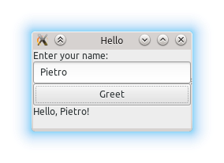

<!-- TOC -->

- [1. 三方开源](#1-%e4%b8%89%e6%96%b9%e5%bc%80%e6%ba%90)
- [2. 安装](#2-%e5%ae%89%e8%a3%85)
	- [2.1. windows](#21-windows)
	- [2.2. linux](#22-linux)
- [3. 开始](#3-%e5%bc%80%e5%a7%8b)
	- [3.1. 简单使用](#31-%e7%ae%80%e5%8d%95%e4%bd%bf%e7%94%a8)
		- [3.1.1. 运行中Uipackage的状态](#311-%e8%bf%90%e8%a1%8c%e4%b8%aduipackage%e7%9a%84%e7%8a%b6%e6%80%81)
		- [3.1.2. ui的构建](#312-ui%e7%9a%84%e6%9e%84%e5%bb%ba)
		- [3.1.3. 事件(Event)](#313-%e4%ba%8b%e4%bb%b6event)
		- [3.1.4. 完成](#314-%e5%ae%8c%e6%88%90)
	- [3.2. 案例2](#32-%e6%a1%88%e4%be%8b2)

<!-- /TOC -->
# 1. 三方开源
https://github.com/andlabs/ui 
# 2. 安装
## 2.1. windows
1. Download/Install MinGW-w64(gcc>8)
2. 设置环境变量
```
CGO_ENABLED=1
CC=path_of_mingw_gcc_win_threads(gcc)
CXX=path_of_mingw_g++_win_threads(g++path)
```   
3. 编译
```
go build
```   
4. 不带控制台的编译
```
go build -ldflags -H=windowsgui
```   

## 2.2. linux
1. Install gcc and gtk3 packages.
2. 设置环境变量
```
CGO_ENABLED=1
CC=gcc
CXX=g++
```
3. 编译  
`CGO_ENABLED=1 CC=gcc CXX=g++ go build`   
# 3. 开始  
## 3.1. 简单使用
在这个例子中，我们将创建一个程序，要求用户输入他们的名字，然后打印出来。 首先，这是完整的（简短！）程序。之后我将讨论每个部分。  
```
package main

import (
	"github.com/andlabs/ui"
     <!-- _ "github.com/andlabs/ui/winmanifest" -->(windows)
)

func main() {
	err:=ui.Main(
        func(){
            input:=ui.NewEntry()
            button:=ui.NewButton("Greet")
            greting:=ui.NewLabel("")
            box:=ui.NewVerticalBox()//垂直布局
            box.Append(ui.NewLabel("Enter your name:"),false)
            box.Append(input,false)
            box.Append(button,false)
            box.Append(greeting,false)
            window:=ui.NewWindow("Hello",200,100,false)
            window.SetMargined(true)
            window.SetChild(box)
            button.OnClicked(func(*ui.Button){
                greeting.SetText("Hello,",input.Text()+"!")
            })
            window.OnClosing(func(* ui.Window) bool{
                ui.Quit()
                return ture
            })
            window.Show()//阻塞ui
		
        }
    )
    if err!=nil{
        panic(err)
    }
}
```
### 3.1.1. 运行中Uipackage的状态
`var window ui.Window`  
首先，我们声明一个类型的全局变量ui.Window。Windows持有其他控件; 所有控件必须属于一个窗口才能在屏幕上显示。（Window本身不是一个控件。）由于技术原因，我们将Window保持为全局，以防止它（以及它的子元素）在内存中移动（就像它是堆栈变量一样）。  
```
go ui.Do(func(){...})
```
您会注意到我们所有的UI工作都是在传递给函数的闭包内完成的 ui.Do()。大多数窗口系统实际上都讨厌在多个线程上运行，因此 ui.Do()妥协是为底层操作系统保持良好和序列化。除了事件处理程序之外，所有UI代码都应该传递给 ui.Do()。  
我们将 ui.Do（）作为goroutine运行，因为它会等待函数在返回之前完成运行，我们甚至还没有启动UI主循环。    
```
err:=ui.Go()
if err!=nil{
    panic(err)
}
```
ui.Go()
### 3.1.2. ui的构建  
界面的构建  

```
input:=ui.NewEntry()
button:=ui.NewButton("Greet")
greeting:=ui.NewLable("")
```
组件的布局
```
stack:=ui.NewVerticalStack(
    ui.NewLabel("Enter your name:),
    input,
    button,
    greeting
)
```
界面布局的加载
```
window=ui.NewWindow("Hello",200,100,stack)
```

### 3.1.3. 事件(Event)  
```
button.OnClicked(func(){
    greeting.SetText("Hello,"+input.Text()+"!")
})
```
```
window.OnClosing(func()bool{
ui.Stop()
return true
})
```
### 3.1.4. 完成
```
window.Show()
```
现在剩下的就是显示窗口。  
构建并运行此程序。 （在windows中，你应该使用它：go build -ldflags -H = windowsgui main.go）你应该在Linux系统上看到这个：  
  

## 3.2. 案例2
```
package kye

import (
	"bufio"
	"bytes"
	"fmt"
	"github.com/andlabs/ui"
	"github.com/astaxie/beego/config"
	"log"
	"net"
	"strconv"
)

func MarkStart() {
	ui.Main(setupMartUi)
}

var mainWin1 *ui.Window
var revChannel = make(chan byte, 4096)

func setupMartUi() {
	mainWin1 = ui.NewWindow("行情数据客户端", 640, 480, true)
	mainWin1.OnClosing(func(*ui.Window) bool {
		ui.Quit()
		return true
	})
	ui.OnShouldQuit(func() bool {
		mainWin1.Destroy()
		return true
	})
	tab := ui.NewTab()
	mainWin1.SetChild(tab)
	mainWin1.SetMargined(true)
	mainPage := MainPage{}
	tab.Append("主配置", mainPage.Start()) //第一个菜单
	tab.SetMargined(0, true)
	//tab.Append("已订阅", subScribePage()) //订阅菜单
	//tab.SetMargined(1, true)
	//tab.Append("行情信息", marketDataPage()) //数据展示菜单
	//tab.SetMargined(2, true)
	mainWin1.Show()
}

type MarketDataPage struct {
}

type ScribePage struct {
}

type MainPage struct {
	vbox          *ui.Box         //主布局
	ipEntry       *ui.Entry       //ip input
	portEntry     *ui.Entry       //端口input
	connBtn       *ui.Button      //连接按钮
	disConnBtn    *ui.Button      // 断开连接
	entryForm     *ui.Form        //连接表单
	jsonConf      config.Configer //配置文件
	subEntry      *ui.Entry       //订阅Entry
	subAppenEntry *ui.Entry       //增量订阅
	subBtn        *ui.Button      //重新订阅发送按钮
	subAppenBtn   *ui.Button      //增量订阅发送按钮
	conn          net.Conn
	label         *ui.Label //读取的信息
}

func (mp *MainPage) Start() *ui.Box {
	mp.initContainner()
	mp.connectGroup()
	mp.subGroup()
	mp.subAppendGroup()
	mp.vbox.Append(mp.label, false)
	mp.eventRegist()
	mp.subEntry.SetText(mp.jsonConf.String("sub"))
	mp.subAppenEntry.SetText(mp.jsonConf.String("sub"))
	return mp.vbox
}
func (mp *MainPage) initContainner() {
	var err error
	mp.jsonConf, err = config.NewConfig("json", "H:\\sutdy\\go\\src\\guisockt\\market.json")
	if err != nil {
		log.Fatal(err)
	}
	mp.label = ui.NewLabel("未接收到广播")
	mp.ipEntry = ui.NewEntry()
	mp.ipEntry.SetText(mp.jsonConf.String("ip"))
	mp.portEntry = ui.NewEntry()
	mp.portEntry.SetText(mp.jsonConf.String("port"))
	mp.connBtn = ui.NewButton("连接")
	mp.disConnBtn = ui.NewButton("断开")
	mp.entryForm = ui.NewForm()
	mp.entryForm.SetPadded(true)
	mp.entryForm.Append("ip", mp.ipEntry, false)
	mp.entryForm.Append("port", mp.portEntry, false)
	mp.entryForm.Append("连接", mp.connBtn, false)
	mp.entryForm.Append("断开", mp.disConnBtn, false)
	mp.subEntry = ui.NewEntry()
	mp.subAppenEntry = ui.NewEntry()
	mp.subAppenBtn = ui.NewButton("增量订阅")
	mp.subBtn = ui.NewButton("订阅")
	mp.vbox = ui.NewVerticalBox()
	mp.vbox.SetPadded(true)
	mp.vbox.Append(ui.NewLabel("配置格式:交易所,合约;交易所,合约"), false)
	mp.vbox.Append(ui.NewHorizontalSeparator(), false)
}
func (mp *MainPage) connectGroup() {
	group := ui.NewGroup("行情连接")
	group.SetMargined(true)
	mp.vbox.Append(group, true)
	group.SetChild(ui.NewNonWrappingMultilineEntry())
	group.SetChild(mp.entryForm)
}
func (mp *MainPage) subGroup() {
	group := ui.NewGroup("订阅")
	group.SetMargined(true)
	mp.vbox.Append(group, true)
	subFrom := ui.NewForm()
	subFrom.SetPadded(true)
	subFrom.Append("订阅信息", mp.subEntry, false)
	subFrom.Append("发送", mp.subBtn, false)
	group.SetChild(subFrom)
}
func (mp *MainPage) subAppendGroup() {
	group := ui.NewGroup("增量订阅")
	group.SetMargined(true)
	mp.vbox.Append(group, true)
	subFrom := ui.NewForm()
	subFrom.SetPadded(true)
	subFrom.Append("增量订阅", mp.subAppenEntry, false)
	subFrom.Append("发送", mp.subAppenBtn, false)
	group.SetChild(subFrom)
}
func (mp *MainPage) eventRegist() {
	mp.subAppenBtn.OnClicked(mp.subAppenHandle)
	mp.connBtn.OnClicked(mp.connectHandle)
	mp.subBtn.OnClicked(mp.subHandle)
	mp.disConnBtn.OnClicked(mp.disConnHandle)
	mp.subBtn.Disable()
	mp.subAppenBtn.Disable()
}

func (mp *MainPage) connectHandle(button *ui.Button) {
	fmt.Println("调用")
	endport := mp.ipEntry.Text() + ":" + mp.portEntry.Text()
	var err error
	mp.conn, err = net.Dial("tcp", endport)
	if err != nil {
		log.Fatal("connect error:", err.Error(), endport)
		return
	}

	go func() {
		reader := bufio.NewReader(mp.conn)
		size:=0
		for{
			line, err := reader.ReadString('}')
			if err != nil {
				log.Fatal(err)
			}
			size++
			fmt.Println(line)
			mp.label.SetText(strconv.Itoa(size)+line)
		}

	}()
	mp.disConnBtn.Enable()
	mp.subAppenBtn.Enable()
	mp.subBtn.Enable()
	mp.connBtn.Disable()

}
func (mp *MainPage) disConnHandle(button *ui.Button) {
	mp.conn.Close()
	mp.disConnBtn.Disable()
	mp.subAppenBtn.Disable()
	mp.subBtn.Disable()
	mp.connBtn.Enable()
}
func (mp *MainPage) subHandle(button *ui.Button) {
	var buf bytes.Buffer
	tmp := "MARKET01@@@+@@@@@@@&" + mp.subEntry.Text()
	res := fmt.Sprintf("{(len=%d)%s}", len(tmp), tmp)
	//sub:="{(len=196)MARKET01@@@+T@@@@@@@&CME,ED1909;CME,ED1908;CME,ED1907;CME,ED1906;CME,ED1905;CME,ED1904;CME,ED1912;CME,CL1912;CME,CL1911;CME,CL1910;CME,CL1909;CME,CL1908;CME,CL1906;CME,CL1907;CME,ES1906;CME,6A1908}"
	buf.WriteString(res)
	_,err:=mp.conn.Write(buf.Bytes())
	if err!=nil {
		mp.disConnBtn.Disable()
		mp.subAppenBtn.Disable()
		mp.subBtn.Disable()
		mp.connBtn.Enable()
	}
}
func (mp *MainPage) subAppenHandle(button *ui.Button) {
	var buf bytes.Buffer
	tmp := "MARKET01@@@+@@@@@demo000404@@&" + mp.subAppenEntry.Text()
	res := fmt.Sprintf("{(len=%d)%s}", len(tmp), tmp)
	//sub:="{(len=196)MARKET01@@@+T@@@@@@@&CME,ED1909;CME,ED1908;CME,ED1907;CME,ED1906;CME,ED1905;CME,ED1904;CME,ED1912;CME,CL1912;CME,CL1911;CME,CL1910;CME,CL1909;CME,CL1908;CME,CL1906;CME,CL1907;CME,ES1906;CME,6A1908}"
	buf.WriteString(res)
	_, err := mp.conn.Write(buf.Bytes())
	if err!=nil {
		mp.disConnBtn.Disable()
		mp.subAppenBtn.Disable()
		mp.subBtn.Disable()
		mp.connBtn.Enable()
	}
}
```
