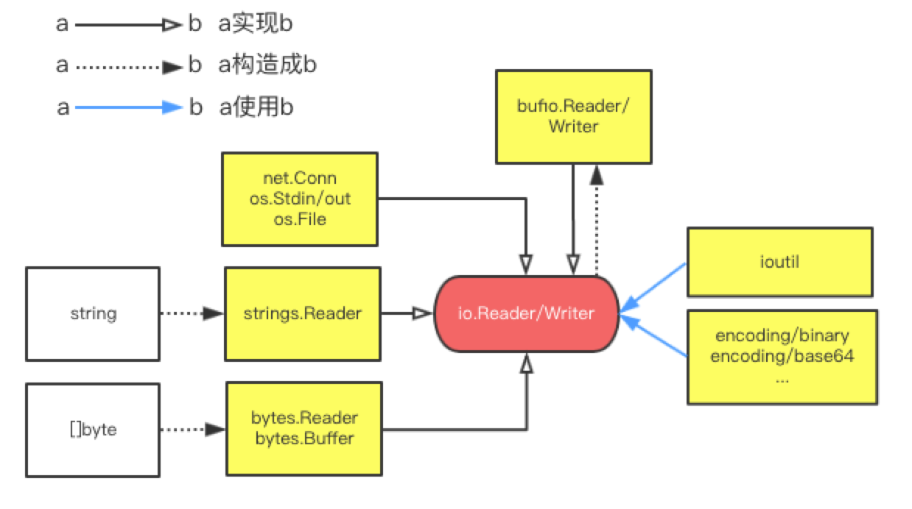

# io.Reader/Writer
Go原生的pkg中有一些核心的interface，其中io.Reader/Writer是比较常用的接口。很多原生的结构都围绕这个系列的接口展开，在实际的开发过程中，你会发现通过这个接口可以在多种不同的io类型之间进行过渡和转化。本文结合实际场景来总结一番。  
## 总览  

围绕io.Reader/Writer，有几个常用的实现：  
* net.Conn, os.Stdin, os.File: 网络、标准输入输出、文件的流读取  
* strings.Reader: 把字符串抽象成Reader  
* bytes.Reader: 把[]byte抽象成Reader
* bytes.Buffer: 把[]byte抽象成Reader和Writer
* ufio.Reader/Writer: 抽象成带缓冲的流读取（比如按行读写）

这些实现对于初学者来说其实比较难去记忆，在遇到实际问题的时候更是一脸蒙圈，不知如何是好。下面用实际的场景来举例
场景举例  
## base64编码成字符串
encoding/base64包中：  
```
func NewEncoder(enc *Encoding, w io.Writer) io.WriteCloser  
```
这个用来做base64编码，但是仔细观察发现，它需要一个io.Writer作为输出目标，并用返回的WriteCloser的Write方法将结果写入目标，下面是Go官方文档的例子  
```
input:=[]byte("foo\x00bar")
encoder:=base64.NewEncoder(base64.StdEncoding,os.Stdout)
encoder.Writer(input)
```
这个例子是将结果写入到Stdout，如果我们希望得到一个字符串呢？观察上面的图，不然发现可以用bytes.Buffer作为目标io.Writer：  
```
input:=[]byte("foo\x00bar")
buffer:=new(bytes.Buffer)
encoder := base64.NewEncoder(base64.StdEncoding, buffer)  
encoder.Write(input) 
fmt.Println(string(buffer.Bytes())  
```
## []byte和struct之间正反序列化
这种场景经常用在基于字节的协议上，比如有一个具有固定长度的结构：  
```
type Protocol struct {
    Version     uint8
    BodyLen     uint16
    Reserved    [2]byte
    Unit        uint8
    Value       uint32
}
```
通过一个[] byte来反序列化得到这个Protocol，一种思路是遍历这个[]byte，然后逐一赋值。其实在encoding/binary包中有个方便的方法：  
```
func Reader(r io.Reader,orderByteOrder,data interface{}) error
```
这个方法从一个io.Reader中读取字节，并已order指定的端模式，来给填充data（data需要是fixed-sized的结构或者类型）。要用到这个方法首先要有一个io.Reader，从上面的图中不难发现，我们可以这么写：  
```
var p Protocol
var bin []byte
//...
binary.Read(bytes.NewReader(bin), binary.LittleEndian, &p)
```
换句话说，我们将一个[]byte转成了一个io.Reader。  
反过来，我们需要将Protocol序列化得到[]byte，使用encoding/binary包中有个对应的Write方法：  
```
func Write(w io.Writer, order ByteOrder, data interface{}) error
```
通过将[]byte转成一个io.Writer即可：  
```
var p Protocol
buffer := new(bytes.Buffer)
//...
binary.Writer(buffer, binary.LittleEndian, p)
bin := buffer.Bytes()
```
## 从流中按行读取
比如对于常见的基于文本行的HTTP协议的读取，我们需要将一个流按照行来读取。本质上，我们需要一个基于缓冲的读写机制（读一些到缓冲，然后遍历缓冲中我们关心的字节或字符）。在Go中有一个bufio的包可以实现带缓冲的读写  
```
func NewReader(rd io.Reader) *Reader
func (b *Reader) ReadString(delim byte) (string, error)
```
这个ReadString方法从io.Reader中读取字符串，直到delim，就返回delim和之前的字符串。如果将delim设置为\n，相当于按行来读取了：  
```
var conn net.Conn
//...
reader := NewReader(conn)
for {
    line, err := reader.ReadString([]byte('\n'))
    //...
}
```