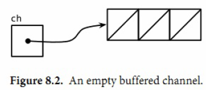

# 1. 入门
# 2. 程序结构
Go语言和其他编程语言一样，一个大的程序是由很多小的基础构件组成的。变量保存值，简单的加法和减法运算被组合成较复杂的表达式。基础类型被聚合为数组或结构体等更复杂的数据结构。然后使用if和for之类的控制语句来组织和控制表达式的执行流程。然后多个语句被组织到一个个函数中，以便代码的隔离和复用。函数以源文件和包的方式被组织。  
## 2.1. 命名
Go语言中的函数名、变量名、常量名、类型名、语句标号和包名等所有的命名，都遵循一个简单的命名规则：一个名字必须以一个字母（Unicode字母）或下划线开头，后面可以跟任意数量的字母、数字或下划线。大写字母和小写字母是不同的：heapSort和Heapsort是两个不同的名字。  
Go语言中类似if和switch的关键字有25个；关键字不能用于自定义名字，只能在特定语法结构中使用。  
```
break default func interface select
case defer go map struct
chan else goto package switch
const fallthrough if range type
continue for import return var
```
此外，还有大约30多个预定义的名字，比如int和true等，主要对应内建的常量、类型和函数。  

```
内建常量: true false iota nil
内建类型: int int8 int16 int32 int64
	uint uint8 uint16 uint32 uint64 uintptr
	float32 float64 complex128 complex64
	bool byte rune string error
内建函数: make len cap new append copy close delete
	complex real imag
	panic recover
```
这些内部预先定义的名字并不是关键字，你可以再定义中重新使用它们。在一些特殊的场景中重新定义它们也是有意义的，但是也要注意避免过度而引起语义混乱。
## 2.2. 声明
Go语言主要有四种类型的声明语句：var、const、type和func，分别对应变量、常量、类型和函数实体对象的声明.第三章将讨论常量的声明，第五章将讨论函数的声明.  
一个Go语言编写的程序对应一个或多个以.go为文件后缀名的源文件中。每个源文件以包的声明语句开始，说明该源文件是属于哪个包。  
包声明语句之后是import语句导入依赖的其它包，然后是包一级的类型、变量、常量、函数的声明语句，包一级的各种类型的声明语句的顺序无关紧要（译注：函数内部的名字则必须先声明之后才能使用）  

```
package main

import "fmt"

const boilingF = 212.0

func main() {
	var f = boilingF
	var c = (f - 32) * 5 / 9
	fmt.Printf("boiling point = %g°F or %g°C\n", f, c)
	// Output:
	// boiling point = 212°F or 100°C
}
```
## 2.3. 变量
var声明语句可以创建一个特定类型的变量，然后给变量附加一个名字，并且设置变量的初始值。变量声明的一般语法如下：  
```
var 变量名字 类型 = 表达式
```
其中“类型”或“= 表达式”两个部分可以省略其中的一个。  
TODO:
```
```
## 2.4. 赋值
## 2.5. 类型
## 2.6. 包和文件
## 2.7. 作用域
# 3. 基础数据类型
# 4. 符合数据类型
在第三章我们讨论了基本数据类型，它们可以用于构建程序中数据结构，是Go语言的世界的原子。在本章，我们将讨论复合数据类型，它是以不同的方式组合基本类型可以构造出来的复合数据类型。我们主要讨论四种类型——数组、slice、map和结构体——同时在本章的最后，我们将演示如何使用结构体来解码和编码到对应JSON格式的数据，并且通过结合使用模板来生成HTML页面。  
数组和结构体是聚合类型；它们的值由许多元素或成员字段的值组成。数组是由同构的元素组成——每个数组元素都是完全相同的类型——结构体则是由异构的元素组成的。数组和结构体都是有固定内存大小的数据结构。相比之下，slice和map则是动态的数据结构，它们将根据需要动态增长。  
## 4.1. 数组
数组是一个由固定长度的特定类型元素组成的序列，一个数组可以由零个或多个元素组成。因为数组的长度是固定的，因此在Go语言中很少直接使用数组。和数组对应的类型是Slice（切片），它是可以增长和收缩动态序列，slice功能也更灵活，但是要理解slice工作原理的话需要先理解数组。  
TODO:
```
```
## 4.2. Slice
## 4.3. Map
## 4.4. 结构体
## 4.5. Json
## 4.6. 文本和HTML模板
# 5. 函数
# 6. 方法
# 7. 接口
# 8. Goroutines和Channels
并发程序指同时进行多个任务的程序，随着硬件的发展，并发程序变得越来越重要。Web服
务器会一次处理成千上万的请求。平板电脑和手机app在渲染用户画面同时还会后台执行各种
计算任务和网络请求。即使是传统的批处理问题--读取数据，计算，写输出--现在也会用并发
来隐藏掉I/O的操作延迟以充分利用现代计算机设备的多个核心。计算机的性能每年都在以非
线性的速度增长。  
Go语言中的并发程序可以用两种手段来实现。本章讲解goroutine和channel，其支持“顺序通
信进程”(communicating sequential processes)或被简称为CSP。CSP是一种现代的并发编程
模型，在这种编程模型中值会在不同的运行实例(goroutine)中传递，尽管大多数情况下仍然是
被限制在单一实例中。第9章覆盖更为传统的并发模型：多线程共享内存，如果你在其它的主
流语言中写过并发程序的话可能会更熟悉一些。第9章也会深入介绍一些并发程序带来的风险
和陷阱。  
尽管Go对并发的支持是众多强力特性之一，但跟踪调试并发程序还是很困难，在线性程序中
形成的直觉往往还会使我们误入歧途。如果这是读者第一次接触并发，推荐稍微多花一些时
间来思考这两个章节中的样例。  
## 8.1. Goroutines  
在Go语言中，每一个并发的执行单元叫作一个goroutine。设想这里的一个程序有两个函数，
一个函数做计算，另一个输出结果，假设两个函数没有相互之间的调用关系。一个线性的程
序会先调用其中的一个函数，然后再调用另一个。如果程序中包含多个goroutine，对两个函
数的调用则可能发生在同一时刻。马上就会看到这样的一个程序。  
如果你使用过操作系统或者其它语言提供的线程，那么你可以简单地把goroutine类比作一个
线程，这样你就可以写出一些正确的程序了。goroutine和线程的本质区别会在9.8节中讲。  
下面的例子，main goroutine将计算菲波那契数列的第45个元素值。由于计算函数使用低效的
递归，所以会运行相当长时间，在此期间我们想让用户看到一个可见的标识来表明程序依然
在正常运行，所以来做一个动画的小图标：  
```
package main
import (
	"fmt"
	"time"
)
func main() {
	go spinner(100 * time.Millisecond)
	const n = 45
	finbN := fib(n)
	fmt.Printf("\r Fibonacci(%d)=%d\n", n, finbN)
}
func spinner(delay time.Duration) {
	for {
		for _, r := range `-\|/` {
			fmt.Printf("\r%c", r)
			time.Sleep(delay)
		}
	}
}
func fib(x int) int {
	if x < 2 {
		return x
	}
	return fib(x-1) + fib(x-2)
}
```
主函数返回时，所有的goroutine都会被直接打断，程序退出。除了从主函
数退出或者直接终止程序之外，没有其它的编程方法能够让一个goroutine来打断另一个的执
行，但是之后可以看到一种方式来实现这个目的，通过goroutine之间的通信来让一个
goroutine请求其它的goroutine，并被请求的goroutine自行结束执行。  
留意一下这里的两个独立的单元是如何进行组合的，spinning和菲波那契的计算。分别在独立
的函数中，但两个函数会同时执行。  
## 8.2. 并发的Clock服务   
网络编程是并发大显身手的一个领域，由于服务器是最典型的需要同时处理很多连接的程
序，这些连接一般来自远彼此独立的客户端。  
在本小节中，我们会讲解go语言的net包，这个
包提供编写一个网络客户端或者服务器程序的基本组件，无论两者间通信是使用TCP，UDP
或者Unix domain sockets。在第一章中我们已经使用过的net/http包里的方法，也算是net包
的一部分。  
我们的第一个例子是一个顺序执行的时钟服务器，它会每隔一秒钟将当前时间写到客户端： 
```
type ClockSever struct {
	ip   string
	port string
}
func handConn(c net.Conn) {
	defer c.Close()
	for {
		_, err := io.WriteString(c, time.Now().Format("15:04:05\n"))
		if err != nil {
			return
		}
		time.Sleep(1 * time.Second)
	}
}
func(c* ClockSever) SetIpPort(ip string, port string)  {
	c.ip=ip
	c.port=port
}
func (c* ClockSever)PrintMyself(){
	fmt.Printf("%s:%s",c.ip,c.port)
}
func (c *ClockSever) Start()  {

	sock := c.ip + ":" + c.port
	listener, err := net.Listen("tcp", sock)
	if err != nil {
		log.Fatal(err)
	}
	for {
		conn, err := listener.Accept()
		if err != nil {
			log.Print(err)
			continue
		}
		handConn(conn)
	}
}
```

Listen函数创建了一个net.Listener的对象，这个对象会监听一个网络端口上到来的连接，在这个例子里我们用的是TCP的localhost:8000端口。listener对象的Accept方法会直接阻塞，直到一个新的连接被创建，然后会返回一个net.Conn对象来表示这个连接。  
由于net.Conn实现了io.Writer接口，我们可以直接向其写入内容。这个死循环会一直执行，直到写入失败。最可能的原因是客户端主动断开连接。这种情况下handleConn函数会用defer调用关闭服务器侧的连接，然后返回到主函数，继续等待下一个连接请求。  

客户端部分:
```
type ClockClient struct {
	ip string
	port string
}
func  (c *ClockClient) Start(ip,port string){
	c.ip=ip
	c.port=port
	conn,err:=net.Dial("tcp",ip+":"+port)
	if err!=nil{
		log.Fatal(err)
	}
	defer conn.Close()
	mustCopy(os.Stdout,conn)
}
func mustCopy(dst io.Writer,src io.Reader)  {
	if _,err:=io.Copy(dst,src);err!=nil{
		log.Fatal(err)
	}
}
```
第二个客户端必须等待第一个客户端完成工作，这样服务端才能继续向后执行；因为我们这里的服务器程序同一时间只能处理一个客户端连接。我们这里对服务端程序做一点小改动，使其支持并发;在handleConn函数调用的地方增加go关键字，让每一次handleConn的调用都进入一个独立的goroutine。  

支持多个客户端的协程方式
```
func (c*ClockSever)StartGoroutines()  {
	sock := c.ip + ":" + c.port
	listener, err := net.Listen("tcp", sock)
	if err != nil {
		log.Fatal(err)
	}
	for {
		conn, err := listener.Accept()
		if err != nil {
			log.Print(err)
			continue
		}
		go handConn(conn)
	}
}
```
## 8.3. echo服务
clock服务器每一个连接都会起一个goroutine。在本节中我们会创建一个echo服务器，这个服务在每个连接中会有多个goroutine。大多数echo服务仅仅会返回他们读取到的内容，就像下面这个简单的handleConn函数所做的一样：  

```
func handleConn(c net.Conn) {
	io.Copy(c, c) // NOTE: ignoring errors
	c.Close()
}
```
服务端
```
type EchoServer struct {
	ip string
	port string
}

func handleConn(c net.Conn)  {
	input:=bufio.NewScanner(c)
	for input.Scan(){
		echo(c,input.Text(),1*time.Second)
	}
	c.Close()
}

func echo(conn net.Conn, text string, duration time.Duration) {
	fmt.Fprintln(conn,"\t",strings.ToLower(text))
	time.Sleep(duration)
	fmt.Fprintln(conn,"\t",text)
	time.Sleep(duration)
	fmt.Fprintln(conn,"\t",strings.ToUpper(text))
}
func (e*EchoServer)Start(ip,port string)  {
	e.port=port
	e.ip=ip
	detippor:=ip+":"+port
	listener, err := net.Listen("tcp", detippor)
	log.Println(detippor)
	if err!=nil{
		log.Fatal("error")
	}
	for  {
		conn, err := listener.Accept()
		if err!=nil {
			log.Fatal("accept error")
		}
		go handleConn(conn)
	}
}
```
echo客户端
```
type  EchoClient struct {
	ip,port,endpoint string
}

func (e*EchoClient)Start(ip,port string)  {
	e.port=port
	e.ip=ip
	e.endpoint=ip+":"+port
	conn, err := net.Dial("tcp", e.endpoint)
	log.Println(e.endpoint)
	if err!=nil{
		log.Fatal("connect error",e.endpoint)
	}
	defer conn.Close()
	go MustCopy(os.Stdout,conn)
	MustCopy(conn,os.Stdin)
}
```
## 8.4. Channels
如果说goroutine是Go语音程序的并发体的话，那么channels它们之间的通信机制。  
channels是一个通信机制，它可以让一个goroutine通过它给另一个goroutine发送值信息。每个channel都有一个特殊的类型，也就是channels可发送数据的类型。一个可以发送int类型数据的channel一般写为chan int。  
使用内置的make函数，我们可以创建一个channel：  
`ch:=make(chan int)`  
和map类似，channel也一个对应make创建的底层数据结构的引用。当我们复制一个channel或用于函数参数传递时，我们只是拷贝了一个channel引用，因此调用者何被调用者将引用同一个channel对象。和其它的引用类型一样，channel的零值也是nil。  
一个channel有发送和接受两个主要操作，都是通信行为。一个发送语句将一个值从一个goroutine通过channel发送到另一个执行接收操作的goroutine。发送和接收两个操作都是用 <- 运算符。   

```
ch <-x  //a send statement
x=<-ch  //a receive expression in an assignment statement
<-ch    //a receive exprement result is discarded
```
Channel还支持close操作,用于关闭channel,随后对基于该channel的任何发送操作都将导致panic异常.对一个已经被close国的channel之行接收操作依然可以成功.如果channel中已经没有数据的话讲产生一个零值的数据。    
使用内置的close函数就可以关闭一个channel：  
`close(ch)`  
以最简单方式调用make函数创建的时一个无缓冲的channel，但是我们也可以指定第二个整形参数，对应channel的容量。如果channel的容量大于零，那么该channel就是带缓冲的channel。  
```
ch = make(chan int) // unbuffered channel
ch = make(chan int, 0) // unbuffered channel
ch = make(chan int, 3) // buffered channel with capacity 3
```
### 8.4.1. 不带缓存的Channels
一个基于无缓存Channels的发送操作将导致发送者goroutine阻塞，直到另一个goroutine在相同的Channels上执行接收操作，当发送的值通过Channels成功传输之后，两个goroutine可以继续执行后面的语句。反之，如果接收操作先发生，那么接收者goroutine也将阻塞，直到有另一个goroutine在相同的Channels上执行发送操作。  
当我们说x事件既不是在y事件之前发生也不是在y事件之后发生，我们就说x事件和y事件是并发的。  
，它在主goroutine中（译注：就是执行main函数的goroutine）将标准输入复制到server，因此当客户端程序关闭标准输入时，后台goroutine可能依然在工作。我们需要让主goroutine等待后台goroutine完成工作后再退出，我们使用了一个channel来同步两个
goroutine：  
更加安全的客户端(仅仅实现了同步操作)
```
func (e* EchoClient)SafeSart(ip,port string)  {
	e.port=port
	e.ip=ip
	e.endpoint=ip+":"+port
	conn, err := net.Dial("tcp", e.endpoint)
	if err!=nil{
		log.Fatal("error",err.Error())
	}
	done:=make(chan struct{})
	go func() {
		io.Copy(os.Stdout,conn)
		log.Println("done")
		done<- struct{}{}//signal the main goroutine
	}()
	MustCopy(conn,os.Stdin)
	conn.Close()
	<-done //wait for backgroud goroutine to finish 类似于cpp的join
}
```
### 8.4.2. 串联的Channels(Pipeline)  

```
/**
三个
1 生成数据
2 求平方
3 打印
 */
func PipLineDemo2()  {
	naturals:=make(chan  int)
	squares:=make(chan int)
	//1
	go func() {
		for x:=0; x<10;x++  {
			naturals<- x
		}
		close(naturals)
	}()
	//2
	go func() {
		for x:=range naturals{
			squares<-x*x
		}
		close(squares)
	}()
	// Printer(in main goroutine)
		for x:=range squares{
			fmt.Println(x)
		}
}
```
其实你并不需要关闭每一个channel。只要当需要告诉接收者goroutine，所有的数据已经全部发送时才需要关闭channel。不管一个channel是否被关闭，当它没有被引用时将会被Go语言的垃圾自动回收器回收。（不要将关闭一个打开文件的操作和关闭一个channel操作混淆。对于每个打开的文件，都需要在不使用的使用调用对应的Close方法来关闭文件。）  
### 8.4.3. 单方向的Channel
随着程序的增长，人们习惯于将大的函数拆分为小的函数。我们前面的例子中使用了三个goroutine，然后用两个channels连链接它们，它们都是main函数的局部变量。将三个goroutine拆分为以下三个函数是自然的想法：  
```
func counter(out chan int)
func squarer(out ,in chan int)
func priter(in chan int)
```
Go语言的类型系统提供了单方向的channel类型，分别用于只发送或只接收的channel。类型 chan<- int 表示一个只发送int的channel，只能发送不能接收。相反，类型 <-chan int 表示一个只接收int的channel，只能接收不能发送。（箭头 <- 和关键字chan的相对位置表明了channel的方向。）这种限制将在编译期检测。  
```
type ChanePip struct {
	naturals chan int
	squares chan int
}

func (ChanePip)counter(out chan<- int)  {
	for x := 0; x < 100; x++ {
		out<-x
	}
	close(out)
}
func (ChanePip) squarer(out chan<- int, in <-chan int) {
	for v:=range in {
		out<-v*v
	}
	close(out)
}
func (ChanePip)printer(in <-chan int){
	for v:=range in{
		fmt.Println(v)
	}
}
func (c ChanePip)StartTes()  {
	c.naturals=make(chan int)
	c.squares=make(chan int)
	go c.counter(c.naturals)
	go c.squarer(c.squares,c.naturals)
	c.printer(c.squares)
}
```
### 8.4.4. 带缓存的Channels
带缓存的Channel内部持有一个元素队列。队列的最大容量是在调用make函数创建channel时通过第二个参数指定的。下面的语句创建了一个可以持有三个字符串元素的带缓存Channel。图8.2是ch变量对应的channel的图形表示形式。  
`ch=make(chan int,3)`  
  
向缓存Channel的发送操作就是向内部缓存队列的尾部插入元素，接收操作则是从队列的头部删除元素。如果内部缓存队列是满的，那么发送操作将阻塞直到因另一个goroutine执行接收操作而释放了新的队列空间。相反，如果channel是空的，接收操作将阻塞直到有另一个goroutine执行发送操作而向队列插入元素。  
下面的例子展示了一个使用了带缓存channel的应用。它并发地向三个镜像站点发出请求，三个镜像站点分散在不同的地理位置。它们分别将收到的响应发送到带缓存channel，最后接收者只接收第一个收到的响应，也就是最快的那个响应。因此mirroredQuery函数可能在另外两个响应慢的镜像站点响应之前就返回了结果。（顺便说一下，多个goroutines并发地向同一个channel发送数据，或从同一个channel接收数据都是常见的用法。）  
```
func mirroredQuery() string {
responses := make(chan string, 3)
go func() { responses <- request("asia.gopl.io") }()
go func() { responses <- request("europe.gopl.io") }()
go func() { responses <- request("americas.gopl.io") }()
return <-responses // return the quickest response
}
func request(hostname string) (response string) { /* ... */ }
```
如果我们使用了无缓存的channel，那么两个慢的goroutines将会因为没有人接收而被永远卡住。这种情况，称为goroutines泄漏，这将是一个BUG。和垃圾变量不同，泄漏的goroutines并不会被自动回收，因此确保每个不再需要的goroutine能正常退出是重要的。  
## 8.5. 并发的循环  
TODO:
## 8.6. 并发的Web爬虫
TODO:
## 8.7. 基于select的多路复用
下面的程序会进行火箭发射的倒计时。time.Tick函数返回一个channel，程序会周期性地像一个节拍器一样向这个channel发送事件。每一个事件的值是一个时间戳，不过更有意思的是其传送方式。  

# 9. 基于共享变量的并发
# 10. 包和工具
现在随便一个小程序的实现都可能包含超过10000个函数。然而作者一般只需要考虑其中很小
的一部分和做很少的设计，因为绝大部分代码都是由他人编写的，它们通过类似包或模块的
方式被重用。  
Go语言有超过100个的标准包（译注：可以用 go list std | wc -l 命令查看标准包的具体数
目），标准库为大多数的程序提供了必要的基础构件。在Go的社区，有很多成熟的包被设
计、共享、重用和改进，目前互联网上已经发布了非常多的Go语音开源包，它们可以通过
http://godoc.org 检索。在本章，我们将演示如果使用已有的包和创建新的包。  
Go还自带了工具箱，里面有很多用来简化工作区和包管理的小工具。在本书开始的时候，我
们已经见识过如何使用工具箱自带的工具来下载、构件和运行我们的演示程序了。  
## 10.1. 包简介 
每个包一般都定义了一个不同的名字空间用于它内部的每个标识符的访问。每个名字空间关
联到一个特定的包，让我们给类型、函数等选择简短明了的名字，这样可以避免在我们使用
它们的时候减少和其它部分名字的冲突。  
每个包还通过控制包内名字的可见性和是否导出来实现封装特性。通过限制包成员的可见性
并隐藏包API的具体实现，将允许包的维护者在不影响外部包用户的前提下调整包的内部实
现。通过限制包内变量的可见性，还可以强制用户通过某些特定函数来访问和更新内部变
量，这样可以保证内部变量的一致性和并发时的互斥约束。  
当我们修改了一个源文件，我们必须重新编译该源文件对应的包和所有依赖该包的其他包。
即使是从头构建，Go语言编译器的编译速度也明显快于其它编译语言。Go语言的闪电般的编
译速度主要得益于三个语言特性。第一点，所有导入的包必须在每个文件的开头显式声明，
这样的话编译器就没有必要读取和分析整个源文件来判断包的依赖关系。第二点，禁止包的
环状依赖，因为没有循环依赖，包的依赖关系形成一个有向无环图，每个包可以被独立编
译，而且很可能是被并发编译。第三点，编译后包的目标文件不仅仅记录包本身的导出信
息，目标文件同时还记录了包的依赖关系。因此，在编译一个包的时候，编译器只需要读取
每个直接导入包的目标文件，而不需要遍历所有依赖的的文件  
## 10.2. 导入路径
每个包是由一个全局唯一的字符串所标识的导入路径定位。出现在import语句中的导入路径也
是字符串。  
```
import (
"fmt"
"math/rand"
"encoding/json"
"golang.org/x/net/html"
"github.com/go-sql-driver/mysql"
)
```
为了避免冲突，所有非标准库
包的导入路径建议以所在组织的互联网域名为前缀；而且这样也有利于包的检索。例如，上
面的import语句导入了Go团队维护的HTML解析器和一个流行的第三方维护的MySQL驱动。  

## 10.3. 包声明
在每个Go语音源文件的开头都必须有包声明语句。包声明语句的主要目的是确定当前包被其
它包导入时默认的标识符（也称为包名）。  
例如，math/rand包的每个源文件的开头都包含 package rand 包声明语句，所以当你导入这个
包，你就可以用rand.Int、rand.Float64类似的方式访问包的成员。  
```
package main
import (
"fmt"
"math/rand"
)
func main() {
fmt.Println(rand.Int())
}
```
通常来说，默认的包名就是包导入路径名的最后一段，因此即使两个包的导入路径不同，它
们依然可能有一个相同的包名。例如，math/rand包和crypto/rand包的包名都是rand。稍后我
们将看到如何同时导入两个有相同包名的包。  
关于默认包名一般采用导入路径名的最后一段的约定也有三种例外情况。  
* 第一个例外，包对应一个可执行程序，也就是main包，这时候main包本身的导入路径是无关紧要的。名字为main的包是给go build（§10.7.3）构建命令一个信息，这个包编译完之后必须调用连接器生成一个可执行程序。
* 包所在的目录中可能有一些文件名是以test.go为后缀的Go源文件（译注：前面必须有其它的字符，因为以``前缀的源文件是被忽略的），并且这些源文件声明的包名也是以_test为后缀名的.这种目录可以包含两种包：一种普通包，加一种则是测试的外部扩展包。所有以_test为后缀包名的测试外部扩展包都由go test命令独立编译，普通包和测试的外部扩展包是相互独立的。  
* 第三个例外，一些依赖版本号的管理工具会在导入路径后追加版本号信息，例如"gopkg.in/yaml.v2"。这种情况下包的名字并不包含版本号后缀，而是yaml。
## 10.4. 导入声明
可以在一个Go语言源文件包声明语句之后，其它非导入声明语句之前，包含零到多个导入包
声明语句。每个导入声明可以单独指定一个导入路径，也可以通过圆括号同时导入多个导入
路径。下面两个导入形式是等价的，但是第二种形式更为常见。  
```
import "fmt"
import "os"

import (
"fmt"
"os"
)
```
导入的包之间可以通过添加空行来分组；通常将来自不同组织的包独自分组。包的导入顺序
无关紧要，但是在每个分组中一般会根据字符串顺序排列。（gofmt和goimports工具都可以将
不同分组导入的包独立排序。）  
```
import (
"fmt"
"html/template"
"os"

"golang.org/x/net/html"
"golang.org/x/net/ipv4"
)
```
如果我们想同时导入两个有着名字相同的包，例如math/rand包和crypto/rand包，那么导入声明必须至少为一个同名包指定一个新的包名以避免冲突。这叫做导入包的重命名。  
```
import (
"crypto/rand"
mrand "math/rand" // alternative name mrand avoids conflict
)
```
## 10.5. 包的匿名导入
如果只是导入一个包而并不使用导入的包将会导致一个编译错误。但是有时候我们只是想利用导入包而产生的副作用：它会计算包级变量的初始化表达式和执行导入包的init初始化函数（§2.6.2）。这时候我们需要抑制“unused import”编译错误，我们可以用下划线 _ 来重命名导入的包。像往常一样，下划线 _ 为空白标识符，并不能被访问。  
```
import _ "image/png" // register PNG decoder
```
这个被称为包的匿名导入。它通常是用来实现一个编译时机制，然后通过在main主程序入口选择性地导入附加的包。首先，让我们看看如何使用该特性，然后再看看它是如何工作的。
标准库的image图像包包含了一个 Decode 函数，用于从 io.Reader 接口读取数据并解码图像，它调用底层注册的图像解码器来完成任务，然后返回image.Image类型的图像。使用 image.Decode 很容易编写一个图像格式的转换工具，读取一种格式的图像，然后编码为另一种图像格式：  
```
package main
import (
"fmt"
"image"
"image/jpeg"
_ "image/png" // register PNG decoder
"io"
"os"
)
func main() {
	if err := toJPEG(os.Stdin, os.Stdout); err != nil {
	fmt.Fprintf(os.Stderr, "jpeg: %v\n", err)
	os.Exit(1)
}
}
func toJPEG(in io.Reader, out io.Writer) error {
	img, kind, err := image.Decode(in)
	if err != nil {
	return err
}
fmt.Fprintln(os.Stderr, "Input format =", kind)
	return jpeg.Encode(out, img, &jpeg.Options{Quality: 95})
}
```
下面的代码演示了它的工作机制。标准库还提供了GIF、PNG和JPEG等格式图像的解码器，用户也可以提供自己的解码器，但是为了保持程序体积较小，很多解码器并没有被全部包含，除非是明确需要支持的格式。image.Decode函数在解码时会依次查询支持的格式列表。  
每个格式驱动列表的每个入口指定了四件事情：格式的名称；一个用于描述这种图像数据开头部分模式的字符串，用于解码器检测识别；一个Decode函数用于完成解码图像工作；一个DecodeConfig函数用于解码图像的大小和颜色空间的信息。每个驱动入口是通过调用image.RegisterFormat函数注册，一般是在每个格式包的init初始化函数中调用，例如image/png包是这样注册的：  
```
package png
func Decode(r io.Reader)(image.Image,error)
func DecodeConfig(r io.Reader)(image.Config,error)
func init(){
	const pngHeader="\x89PNG\r\n\x1a\n"
	image.RegisterFormat("png",pngHeader,Decode,DecodeConfig)
}
```
最终的效果是，主程序只需要匿名导入特定图像驱动包就可以用image.Decode解码对应格式的图像了。  
数据库包database/sql也是采用了类似的技术，让用户可以根据自己需要选择导入必要的数据库驱动。例如：  
```
import(
	"database/sql"
	_ "github.com/lib/pd"  //enable support for Postgres
	_ "github.com/go-sql-driver/mysql" //enable support for Mysql
)
db,err=sql.Open("postgres",dbname)//Ok
db,err=sql.Open("mysql",dbname)//
db,err=sql.Open("sqlite3",dbname)//returns error:unknown driver "sqlite3"
```
## 10.6. 包和命名
我们将提供一些关于Go语言独特的包和成员命名的约定。 
当创建一个包，一般要用短小的包名，但也不能太短导致难以理解。标准库中最常用的包有bufio、bytes、flag、fmt、http、io、json、os、sort、sync和time等包。  
它们的名字都简洁明了。例如，不要将一个类似imageutil或ioutilis的通用包命名为util，虽然它看起来很短小。要尽量避免包名使用可能被经常用于局部变量的名字，这样可能导致用户重命名导入包，例如前面看到的path包。  
包名一般采用单数的形式。标准库的bytes、errors和strings使用了复数形式，这是为了避免和预定义的类型冲突，同样还有go/types是为了避免和type关键字冲突。  
现在让我们看看如何命名包的成员。由于是通过包的导入名字引入包里面的成员，例如fmt.Println，同时包含了包名和成员名信息。因此，我们一般并不需要关注Println的具体内容，因为fmt包名已经包含了这个信息。当设计一个包的时候，需要考虑包名和成员名两个部分如何很好地配合。
```
bytes.Equal flag.Int http.Get json.Marshal
```
我们可以看到一些常用的命名模式。strings包提供了和字符串相关的诸多操作：  
```
package strings
func Index(needle,haystack string) int
type Replacer struct{ }
func NewReplacer(oldnew ... string) *Replacer
type Reader struct{ }
func NewReader(s string) *Reader
```
字符串string本身并没有出现在每个成员名字中。因为用户会这样引用这些成员strings.Index、strings.Replacer等。   
其它一些包，可能只描述了单一的数据类型，例如html/template和math/rand等，只暴露一个主要的数据结构和与它相关的方法，还有一个以New命名的函数用于创建实例。  
```
package rand //"math/rand"
type Rand struct{/**/}
func New(source Source)* Rand
```
这可能导致一些名字重复，例如template.Template或rand.Rand，这就是为什么这些种类的包名往往特别短的原因之一。  
在另一个极端，还有像net/http包那样含有非常多的名字和种类不多的数据类型，因为它们都是要执行一个复杂的复合任务。尽管有将近二十种类型和更多的函数，但是包中最重要的成员名字却是简单明了的：Get、Post、Handle、Error、Client、Server等。  

## 10.7. 工具
本章剩下的部分将讨论Go语言工具箱的具体功能，包括如何下载、格式化、构建、测试和安装Go语言编写的程序。  
Go语言的工具箱集合了一系列的功能的命令集。它可以看作是一个包管理器（类似于Linux中的apt和rpm工具），用于包的查询、计算的包依赖关系、从远程版本控制系统和下载它们等任务。它也是一个构建系统，计算文件的依赖关系，然后调用编译器、汇编器和连接器构建程序，虽然它故意被设计成没有标准的make命令那么复杂。它也是一个单元测试和基准测试的驱动程序，我们将在第11章讨论测试话题。  
Go语言工具箱的命令有着类似“瑞士军刀”的风格，带着一打子的子命令，有一些我们经常用到，例如get、run、build和fmt等。你可以运行go或go help命令查看内置的帮助文档，为了查询方便，我们列出了最常用的命令：  
为了达到零配置的设计目标，Go语言的工具箱很多地方都依赖各种约定。例如，根据给定的源文件的名称，Go语言的工具可以找到源文件对应的包，因为每个目录只包含了单一的包，并且到的导入路径和工作区的目录结构是对应的。给定一个包的导入路径，Go语言的工具可以找到对应的目录中没个实体对应的源文件。它还可以根据导入路径找到存储代码仓库的远程服务器的URL。  
### 10.7.1. 工作区结构
对于大多数的Go语言用户，只需要配置一个名叫GOPATH的环境变量，用来指定当前工作目录即可。当需要切换到不同工作区的时候，只要更新GOPATH就可以了。例如，我们在编写本书时将GOPATH设置为 $HOME/gobook ：  
```
$ export GOPATH=$HOME/gobook
$ go get gopl.io/...
```
* GOPATH对应的工作区目录有三个子目录。其中src子目录用于存储源代码。每个包被保存在与$GOPATH/src的相对路径为包导入路径的子目录中,例如 gopl.io/ch1/helloworld 相对应的路径目录。我们看到，一个GOPATH工作区的src目录中可能有多个独立的版本控制系统，例如gopl.io和golang.org分别对应不同的Git仓库。  
* pkg子目录用于保存编译后的包的目标文件  
* bin子目录用于保存编译后的可执行程序  

第二个环境变量GOROOT用来指定Go的安装目录，还有它自带的标准库包的位置。  
GOROOT的目录结构和GOPATH类似，因此存放fmt包的源代码对应目录应该为$GOROOT/src/fmt。用户一般不需要设置GOROOT，默认情况下Go语言安装工具会将其设置为安装的目录路径。  

### 10.7.2. 下载包
使用Go语言工具箱的go命令，不仅可以根据包导入路径找到本地工作区的包，甚至可以从互联网上找到和更新包  
使用命令 go get 可以下载一个单一的包或者用 ... 下载整个子目录里面的每个包。Go语言工具箱的go命令同时计算并下载所依赖的每个包，这也是前一个例子中 golang.org/x/net/html 自动出现在本地工作区目录的原因。  
一旦 go get 命令下载了包，然后就是安装包或包对应的可执行的程序。我们将在下一节再关注它的细节，现在只是展示整个下载过程是如何的简单。第一个命令是获取golint工具，它用于检测Go源代码的编程风格是否有问题。第二个命令是用golint命令对2.6.2节的 gopl.io/ch2/popcount 包代码进行编码风格检查。它友好地报告了忘记了包的文档：  
```
$ go get github.com/golang/lint/golint
$ $GOPATH/bin/golint gopl.io/ch2/popcount
src/gopl.io/ch2/popcount/main.go:1:1:
package comment should be of the form "Package popcount ..."
```

go get 命令支持当前流行的托管网站GitHub、Bitbucket和Launchpad，可以直接向它们的版本控制系统请求代码。对于其它的网站，你可能需要指定版本控制系统的具体路径和协议，例如 Git或Mercurial。  
go get 命令获取的代码是真实的本地存储仓库，而不仅仅只是复制源文件，因此你依然可以使用版本管理工具比较本地代码的变更或者切换到其它的版本。例如 golang.org/x/net 包目录对应一个Git仓库：
```
$ cd $GOPATH/src/golang.org/x/net
$ git remote -v
origin https://go.googlesource.com/net (fetch)
origin https://go.googlesource.com/net (push)
```
需要注意的是导入路径含有的网站域名和本地Git仓库对应远程服务地址并不相同，真实的Git地址是 go.googlesource.com。这其实是Go语言工具的一个特性，可以让包用一个自定义的导入路径，但是真实的代码却是由更通用的服务提供，例如 googlesource.com或github.com。因为页面 https://golang.org/x/net/html 包含了如下的元数据，它告诉Go语言的工具当前包真实的Git仓库托管地址：  
```
$ go build gopl.io/ch1/fetch
$ ./fetch https://golang.org/x/net/html | grep go-import
<meta name="go-import"
content="golang.org/x/net git https://go.googlesource.com/net">
```
go get -u 命令只是简单地保证每个包是最新版本，如果是第一次下载包则是比较很方便的；但是对于发布程序则可能是不合适的，因为本地程序可能需要对依赖的包做精确的版本依赖管理。通常的解决方案是使用vendor的目录用于存储依赖包的固定版本的源代码，对本地依赖的包的版本更新也是谨慎和持续可控的。  
### 10.7.3. 构建包
go build 命令编译命令行参数指定的每个包。如果包是一个库，则忽略输出结果；这可以用于检测包的可以正确编译的。如果包的名字是main， go build 将调用连接器在当前目录创建一个可执行程序；以导入路径的最后一段作为可执行程序的名字。  
因为每个目录只包含一个包，因此每个对应可执行程序或者叫Unix术语中的命令的包，会要求放到一个独立的目录中.  
每个包可以由它们的导入路径指定，就像前面看到的那样，或者用一个相对目录的路径知指定，相对路径必须以 . 或 .. 开头。  
也可以指定包的源文件列表，这一般这只用于构建一些小程序或做一些临时性的实验。如果是main包，将会以第一个Go源文件的基础文件名作为最终的可执行程序的名字。   
go install 命令和 go build 命令很相似，但是它会保存每个包的编译成果，而不是将它们都丢弃。  
### 10.7.4. 包文档
```
// Fprintf formats according to a format specifier and writes to w.
// It returns the number of bytes written and any write error encountered.
func Fprintf(w io.Writer, format string, a ...interface{}) (int, error)
```
### 10.7.5. 内部包  
在Go语音程序中，包的封装机制是一个重要的特性。没有导出的标识符只在同一个包内部可以访问，而导出的标识符则是面向全宇宙都是可见的。  
有时候，一个中间的状态可能也是有用的，对于一小部分信任的包是可见的，但并不是对所有调用者都可见。例如，当我们计划将一个大的包拆分为很多小的更容易维护的子包，但是我们并不想将内部的子包结构也完全暴露出去。同时，我们可能还希望在内部子包之间共享一些通用的处理包，或者我们只是想实验一个新包的还并不稳定的接口，暂时只暴露给一些受限制的用户使用。  
为了满足这些需求，Go语言的构建工具对包含internal名字的路径段的包导入路径做了特殊处理。这种包叫internal包，一个internal包只能被和internal目录有同一个父目录的包所导入。例如，net/http/internal/chunked内部包只能被net/http/httputil或net/http包导入，但是不能被net/url包导入。不过net/url包却可以导入net/http/httputil包。  

# 11. 测试

其中有两种技术在实践中证明是比较有效的。第一种是代码在被正式部署前需要进行代码评审。第二种则是测试，也就是本章的讨论主题。  
Go语言的测试技术是相对低级的。它依赖一个go test测试命令和一组按照约定方式编写的测试函数，测试命令可以运行这些测试函数。编写相对轻量级的纯测试代码是有效的，而且它很容易延伸到基准测试和示例文档。  
# 12. 反射
# 13. 底层编程
Go语言的设计包含了诸多安全策略，限制了可能导致程序运行出现错误的用法。编译时类型检查检查可以发现大多数类型不匹配的操作，例如两个字符串做减法的错误。字符串、map、slice和chan等所有的内置类型，都有严格的类型转换规则。  
在本章，我们将展示如何使用unsafe包来摆脱Go语言规则带来的限制，讲述如何创建C语言函数库的绑定，以及如何进行系统调用。  
## unsafe.Sizeof, Alignof 和 Offsetof
## unsafe.Pointer
## 示例: 深度相等判断  
## 通过cgo调用C代码
Go程序可能会遇到要访问C语言的某些硬件驱动函数的场景，或者是从一个C++语言实现的嵌入式数据库查询记录的场景，或者是使用Fortran语言实现的一些线性代数库的场景。C语言作为一个通用语言，很多库会选择提供一个C兼容的API，然后用其他不同的编程语言实现（译者：Go语言需要也应该拥抱这些巨大的代码遗产）。    
