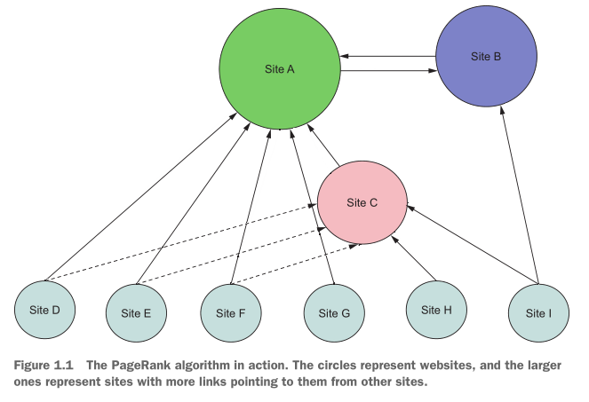
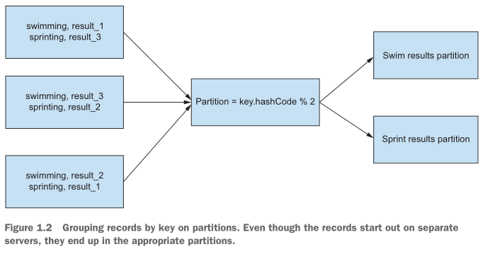

# Kafka Streams in Action
## Part 1 Start
### 1 简介
> 章节包含
> * 理解大数据对编程领域的影响
> * 了解流处理是怎样工作的，以及为什么使用它
> * Kafka介绍
> * Kafka解决问题的方式  

在这本书中，你将学习如何使用卡夫卡流来解决你的流应用程序的需求。从基本的提取、转换和加载(ETL)到复杂的有状态转换再到连接记录，我们将介绍Kafka流的组件，这样您就可以在流应用程序中解决这类挑战。  
在深入卡夫卡流之前，我们将简要探讨大数据处理的历史。当我们确定问题和解决方案时，您将清楚地看到对Kafka以及Kafka流的需求是如何发展的。让我们看看大数据时代是如何开始的，以及是什么导致了Kafka流解决方案。
#### 1.1 大数据对编程领域的影响
随着大数据框架和技术的发展，现代编程领域出现了爆炸式增长。当然，客户端开发经历了自身的转变，移动设备应用程序的数量也出现了爆炸式增长。但无论移动设备市场有多大，客户端技术如何发展，有一个不变的事实:我们每天都需要处理越来越多的数据。随着数据量的增长，分析和利用这些数据的好处的需求也在以相同的速度增长。  
但是，具有批量处理大量数据(批处理)的能力并不总是足够的。越来越多的组织发现，当数据变得可用时，他们需要处理数据(流处理)。Kafka Streams是一种先进的流处理方法，它是一个库，允许您执行记录的每个事件处理。每一个事件处理意味着您可以在每条记录有用时立即处理它——不需要将数据分组成小批(微批处理)。  
注意，当数据到达时处理数据的需要变得越来越明显时，开发了一种新策略:微批处理。顾名思义，微批处理就是批处理，只是数据量较小。通过减少批次的大小，微批处理有时可以更快地产生结果;但是微批处理仍然是批处理，尽管间隔时间更快。它不会为每个事件提供真正的处理。
##### 1.1.1 大数据的生成
注意，当数据到达时处理数据的需要变得越来越明显时，开发了一种新策略:微批处理。顾名思义，微批处理就是批处理，只是数据量较小。通过减少批次的大小，微批处理有时可以更快地产生结果;但是微批处理仍然是批处理，尽管间隔时间更快。它不会为每个事件提供真正的处理。  
出于我们的目的，我想说大数据时代正式开始于1998年谢尔盖·布林和拉里·佩奇成立了谷歌。布林和佩奇开发了一种新的网页搜索排名方法:PageRank算法。在一个非常高的层次上，页-排名算法通过计算指向网站的链接的数量和质量来对网站进行排名。假设一个web页面越重要或相关，就会有越多的站点引用它。  

>> * 站点A是最重要的，因为它有最多的引用指向它。  
>> * 站点B比较重要。虽然它没有那么多的引用，但是一个重要的站点会指向它。  
>> * 站点C不如A或B重要。指向站点C的引用比指向站点B的引用多，但是这些引用的质量较低。  
>> * 底部(D到I)的站点没有指向它们的引用。这使得它们的价值最小    

该图是对PageRank算法的过度简化，但它提供了该算法如何工作的基本思想。  
当时，PageRank是一种革命性的方法。以前，web上的搜索更可能使用布尔逻辑返回结果。如果一个网站包含了你所寻找的全部或大部分的关键词，那么这个网站就会出现在搜索结果中，而与内容的质量无关。但是，在所有互联网内容上运行PageRank算法需要一种新的方法——处理数据的传统方法耗时过长。谷歌要生存和发展，需要快速索引所有这些内容(“快速”是一个相对的术语)并向公众展示高质量的结果。  
谷歌开发了另一种革命性的方法来处理所有这些数据MapReduce的范例。MapReduce不仅使谷歌能够完成它作为一个公司所需要的工作，它还在不经意间催生了一个全新的计算行业。  
##### 1.1.2 MapReduce中的重要概念
当谷歌开发MapReduce时，map和reduce函数并不是新概念。谷歌方法的独特之处在于，它可以在许多机器上大规模地应用这些简单的概念。
MapReduce的核心是函数式编程。map函数接受一些输入，并将这些输入映射到其他内容，而不更改y原始值。下面是Java 8中的一个简单示例，其中LocalDate对象映射为字符串消息，而原始的LocalDate对象未被修改:
```
        Function<LocalDate,String> addDate=(date)->"The Day of the week is"+ date.getDayOfWeek();
```
虽然简单，但这个简短的示例足以演示map func的功能。另一方面，reduce函数接受许多参数，并将它们减少到一个奇异值，或者至少更小的值。将数字集合中的所有值相加就是一个很好的例子。  
要对一组数字执行reduce，首先要提供一个初始初始值。在这种情况下，我们将使用0(用于加法的恒等值)。下一步是将种子值添加到列表中的第一个数字。然后将第一次添加的结果添加到列表中的第二个数字中。函数重复这个过程，直到到达最后一个值，生成一个数字。  
如您所见，reduce函数将结果折叠在一起，形成更小的结果。与map函数一样，原始的数字列表保持不变。    
下面的例子展示了一个使用Java 8 lambda实现的简单reduce函数:  
```
List<Integer> numbers= Arrays.asList(1,2,3);
int sum=numbers.reduce(0,(i,j)->i+j);
```  
这本书的主题不是MapReduce，所以我们将在这里停止背景讨论。但是MapReduce范式引入了一些关键概念(后来在Hadoop中实现，基于谷歌的原始开源版本MapReduce白皮书)在Kafka流中发挥作用:
* 如何跨集群分布数据以实现处理的可伸缩性
* 使用键/值对和分区将分布式数据分组在一起
* 与其避免失败，不如使用复本来面对失败  
下面几节将从总体上研究这些概念。注意，因为你会在书中看到它们一次又一次地出现。
>>>  `在集群中划分数据以实现处理的可伸缩性`  

对于一台机器来说，处理5 TB (5000 GB)的数据可能会非常困难。但是，如果您能够分割数据并涉及更多的机器，因此每个机器都在处理一个可管理的数量，那么您的问题就会最小化。  

|number of machines|Amount of data processed |
|--|--|  
|10|500GB|  
|100|50GB|  
|1000|50GB|  
|5000|1GB|  
从表中可以看到，开始时可能需要处理大量的数据，但是通过将负载分散到更多的服务器上，可以消除这种困难,表最后一行的1gb数据是笔记本电脑可以轻松处理的。  
这是理解MapReduce的第一个关键概念:通过将负载分散到一组机器上，您可以将大量的数据转换成可管理的数量
>>>  `使用键/值对和分区对分布式数据进行分组`  

键/值对是一个具有强大含义的简单数据结构。您看到了在计算机集群传播大量数据的价值。分布式数据解决了处理问题，但是现在有了将分布式数据收集到一起的问题。  
要对分布式数据进行重新分组，可以使用键/值对中的键来对数据进行分组。术语分区意味着分组，但我不是指用相同的键进行分组，而是用具有相同散列代码的键进行分组。要按键将数据分割成若干部分，可使用以下公式:  
```
    public   static void test(String key,int numberOfPartitions){
        int patition =key.hashCode()%numberOfPartitions;
    }
```   
图1.2展示了如何应用哈希函数从存储在不同服务器上的奥运事件中获取结果，并将它们分组到不同事件的分区中。所有数据都存储为键/值对。在下面的图像中，键是事件的名称，值是单个运动员的结果。  
  
分区是一个重要的概念，您将在后面的章节中看到详细的示例。  
>>> `使用主从复制来处理失败`  
谷歌的MapReduce的另一个关键组件是谷歌文件系统(GFS)。正如Hadoop是MapReduce的开源实现，Hadoop文件系统(HDFS)是GFS的开源实现。  
在非常高的级别上，GFS和HDFS都将数据分割成块，并在集群中分布这些块。但是GFS/HDFS的核心部分是处理服务器和磁盘故障的方法。框架没有试图阻止失败，而是通过在集群中复制数据块来接受失败(默认情况下，复制因子是3)。   
通过在不同的服务器上复制数据块，您不再需要担心磁盘故障，甚至完全的服务器故障会导致生产停止。数据的复制对于分布式应用程序的容错至关重要，容错对于分布式应用程序的成功至关重要。稍后您将看到在Kafka流中分区和重新分配是如何工作的。  
##### 1.1.3 批处理是不够的

#### 1.2 流处理介绍
##### 1.2.1 流处理使用时机
#### 1.3 例子
##### 1.3.1 流处理权衡
##### 1.3.2 将需求分解成图标
#### 1.4 换一种方式理解例子
##### 1.4.1 源节点
##### 1.4.2 信用卡节点
##### 1.4.3 模式节点
##### 1.4.4 奖励节点
##### 1.4.5 存储节点
#### 1.5 Kafka流作为处理节点的图
#### 1.6 将Kafka流应用于购买事务流
##### 1.6.1 源定义
##### 1.6.2 第一个处理器:屏蔽信用卡号
##### 1.6.3 第二个处理器:购买模式
##### 1.6.4 第三个处理器:客户奖励
##### 1.6.5 第四个处理器：编写购买记录
#### 1.7 总结
### 2 快速使用
> 章节包含
> * 架构举例
> * 生产者发送数据
> * 消费者读数据
> * 安装和运行Kafka
#### 2.1 数据问题
#### 2.2 使用Kafka处理数据
##### 2.2.1 ZMart`s 数据平台
##### 2.2.2 Kafka销售事务数据中心
#### 2.3 Kafka 架构
##### 2.3.1 Kafka消息代理
##### 2.3.2 Kafka是一个日志
##### 2.3.3 日志在Kafka中是如何工作的
##### 2.3.4 卡夫卡和分区
##### 2.3.5 分区按key对数据分组
##### 2.3.6 编写自定义分区程序
##### 2.3.7 配置自定义分区程序
##### 2.3.8 确定正确的分区数量
##### 2.3.9 分布式日志
##### 2.3.10 ZooKeeper: leaders, followers, and replication
##### 2.3.11 ZooKeeper
##### 2.3.12  控制器选举
##### 2.3.13  主从复制
##### 2.3.14  控制器职责
##### 2.3.15  日志管理
##### 2.3.16  删除日志
##### 2.3.17  日志压缩
#### 2.4 生产者发送数据
##### 2.4.1 生产者配置文件
##### 2.4.2 分区和时间戳的指定
##### 2.4.3 指定一个分区
##### 2.4.4 卡夫卡中的时间戳
#### 2.5 消费者读数据
##### 2.5.1 管理偏移
##### 2.5.2 自动提交偏移
##### 2.5.3 手动提交偏移
##### 2.5.4 产生一个消费者
##### 2.5.5 消费者与分区
##### 2.5.6 负载均衡
##### 2.5.7 更细粒度的消费分配
##### 2.5.7 消费者实例
#### 2.6 安装和运行Kafka
##### 2.6.1 Kafka本地配置
##### 2.5.2 运行
##### 2.5.3 发送消息
#### 2.7 总结


## Part 2 Kafka Stream开发
### 3 开发
### 4 流和状态
### 5 KTable Api
### 6 API 进程
## Part 3. Kafka Stream管理
### 7 性能检测
### 8 应用测试
## Part 4 Kafka Stream思想
### 9 Kafka Stream的应用

