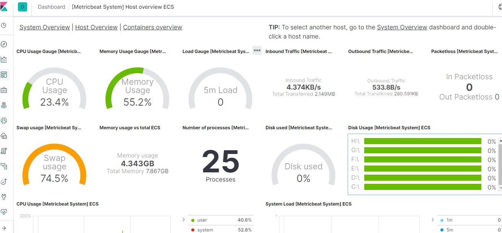

TODO: https://elkguide.elasticsearch.cn/logstash/get-start/install-plugins.html
# 1. 前言  
Elastic Stack 在最近两年迅速崛起，成为机器数据分析，或者说实时日志处理领域，开源界的第一选择。和传统的日志处理方案相比，Elastic Stack 具有如下几个优点：  
* 处理方式灵活。Elasticsearch 是实时全文索引，不需要像 storm 那样预先编程才能使用；
* 配置简易上手。Elasticsearch 全部采用 JSON 接口，Logstash 是 Ruby DSL 设计，都是目前业界最通用的配置语法设计；  
* 检索性能高效。虽然每次查询都是实时计算，但是优秀的设计和实现基本可以达到全天数据查询的秒级响应；  
* 集群线性扩展。不管是 Elasticsearch 集群还是 Logstash 集群都是可以线性扩展的；  
* 前端操作炫丽。Kibana 界面上，只需要点击鼠标，就可以完成搜索、聚合功能，生成炫丽的仪表板。  
## 1.1. 快速使用
[原文](https://www.elastic.co/guide/en/elastic-stack-get-started/7.1/get-started-elastic-stack.html#install-elasticsearch)  
首先安装基本核心的产品
* [Elasticsearch](https://www.elastic.co/guide/en/elastic-stack-get-started/7.1/get-started-elastic-stack.html#install-elasticsearch)
* [Kibana](https://www.elastic.co/guide/en/elastic-stack-get-started/7.1/get-started-elastic-stack.html#install-kibana)
* [Beats](https://www.elastic.co/guide/en/elastic-stack-get-started/7.1/get-started-elastic-stack.html#install-beats)
* [Logstash (optional)](https://www.elastic.co/guide/en/elastic-stack-get-started/7.1/get-started-elastic-stack.html#install-logstash)  
## 1.2. 入门 
要开始使用您自己的Filebeat设置，请安装并配置这些相关产品：  
* 用于存储和索引数据的Elasticsearch。  
* 用户界面的Kibana。
* Logstash（可选）用于解析和增强数据。

然后，您将学习如何实现使用Metricbeat收集服务器度量标准并将数据发送到Elasticsearch的系统监视解决方案，您可以使用Kibana在其中搜索和可视化数据。在使基本设置工作后，添加Logstash以进行其他解析。  
### 1.2.1. 安装Elasticsearch 
Elasticsearch是一种实时的分布式存储，搜索和分析引擎。它可以用于许多目的，但它擅长的一个上下文是索引半结构化数据流，例如日志或解码的网络数据包。  
deb
```
curl -L -O https://artifacts.elastic.co/downloads/elasticsearch/elasticsearch-7.1.0-amd64.deb
sudo dpkg -i elasticsearch-7.1.0-amd64.deb
sudo /etc/init.d/elasticsearch start
```
rpm:
```
curl -L -O https://artifacts.elastic.co/downloads/elasticsearch/elasticsearch-7.1.0-x86_64.rpm
sudo rpm -i elasticsearch-7.1.0-x86_64.rpm
sudo service elasticsearch start
```
mac:
```
curl -L -O https://artifacts.elastic.co/downloads/elasticsearch/elasticsearch-7.1.0-darwin-x86_64.tar.gz
tar -xzvf elasticsearch-7.1.0-darwin-x86_64.tar.gz
cd elasticsearch-7.1.0
./bin/elasticsearch
```
linux
```
curl -L -O https://artifacts.elastic.co/downloads/elasticsearch/elasticsearch-7.1.0-linux-x86_64.tar.gz
tar -xzvf elasticsearch-7.1.0-linux-x86_64.tar.gz
cd elasticsearch-7.1.0
./bin/elasticsearch
```
win
1. [下载](https://www.elastic.co/downloads/elasticsearch)Zip  
2. 解压
3. 进入源码目录
4. 执行`bin/elasticsearch.bat`  

**验证**  
```
curl http://127.0.0.1:9200
  % Total    % Received % Xferd  Average Speed   Time    Time     Time  Current
                                 Dload  Upload   Total   Spent    Left  Speed
100   507  100   507    0     0   495k      0 --:--:-- --:--:-- --:--:--  495k{
  "name" : "DESKTOP-MP32LRE",
  "cluster_name" : "elasticsearch",
  "cluster_uuid" : "QpvP2TbdSVivym2K8poKPg",
  "version" : {
    "number" : "7.1.0",
    "build_flavor" : "default",
    "build_type" : "zip",
    "build_hash" : "606a173",
    "build_date" : "2019-05-16T00:43:15.323135Z",
    "build_snapshot" : false,
    "lucene_version" : "8.0.0",
    "minimum_wire_compatibility_version" : "6.8.0",
    "minimum_index_compatibility_version" : "6.0.0-beta1"
  },
  "tagline" : "You Know, for Search"
}
```
### 1.2.2. 安装Kibana
Kibana是一个开源分析和可视化平台，旨在与Elasticsearch协同工作。您使用Kibana搜索，查看和与存储在Elasticsearch索引中的数据进行交互。您可以轻松执行高级数据分析，并在各种图表，表格和地图中可视化您的数据。  
我们建议您在与Elasticsearch相同的服务器上安装Kibana，但这不是必需的。如果您在不同的服务器上安装产品，则需要kibana.yml在启动Kibana之前在Kibana配置文件中更改Elasticsearch服务器的URL（IP：PORT）。  
要下载并安装Kibana，请打开终端窗口并使用适用于您系统的命令：  
deb, rpm, or linux:  
```
curl -L -O https://artifacts.elastic.co/downloads/kibana/kibana-7.1.0-linux-x86_64.tar.gz
tar xzvf kibana-7.1.0-linux-x86_64.tar.gz
cd kibana-7.1.0-linux-x86_64/
./bin/kibana
```
mac: 
```
curl -L -O https://artifacts.elastic.co/downloads/kibana/kibana-7.1.0-darwin-x86_64.tar.gz
tar xzvf kibana-7.1.0-darwin-x86_64.tar.gz
cd kibana-7.1.0-darwin-x86_64/
./bin/kibana
```
win:
1. [下载](https://www.elastic.co/downloads/kibana)zip
2. 解压
3. 进入目录
4. 运行`bin/kibana.bat`  

**验证**  
默认的web端口为5601
http://127.0.0.1:5601/  
### 1.2.3. 安装Beats
Beats是开源数据托运者，您可以在服务器上将其作为代理安装，以将操作数据发送到Elasticsearch。节拍可以直接将数据发送到Elasticsearch或通过Logstash，您可以在其中进一步处理和增强数据。  
每个Beat都是可单独安装的产品。在本教程中，您将学习如何在启用系统模块的情况下安装和运行Metricbeat以收集系统指标。  
要了解有关安装和配置其他Beats的更多信息，请参阅“入门”文档：  
| Beats                                                                                                    | 描述            |
| :------------------------------------------------------------------------------------------------------- | :-------------- |
| [Auditbeat](https://www.elastic.co/guide/en/beats/auditbeat/7.1/auditbeat-getting-started.html)          | 审计            |
| [Filebeat](https://www.elastic.co/guide/en/beats/filebeat/7.1/filebeat-getting-started.html)             | 日志文件        |
| [Functionbeat](https://www.elastic.co/guide/en/beats/functionbeat/7.1/functionbeat-getting-started.html) | 云数据          |
| [Heartbeat](https://www.elastic.co/guide/en/beats/heartbeat/7.1/heartbeat-getting-started.html)          | 可用性监控      |
| [Journalbeat](https://www.elastic.co/guide/en/beats/journalbeat/7.1/journalbeat-getting-started.html)    | 系统            |
| [Metricbeat](https://www.elastic.co/guide/en/beats/metricbeat/7.1/metricbeat-getting-started.html)       | 度量            |
| [Packetbeat](https://www.elastic.co/guide/en/beats/packetbeat/7.1/packetbeat-getting-started.html)       | 网络流量        |
| [Winlogbeat](https://www.elastic.co/guide/en/beats/winlogbeat/7.1/winlogbeat-getting-started.html)       | Windows事件日志 |

**Metricbeat安装**  
deb:
```
curl -L -O https://artifacts.elastic.co/downloads/beats/metricbeat/metricbeat-7.1.0-amd64.deb
sudo dpkg -i metricbeat-7.1.0-amd64.deb
```
rpm:
```
curl -L -O https://artifacts.elastic.co/downloads/beats/metricbeat/metricbeat-7.1.0-x86_64.rpm
sudo rpm -vi metricbeat-7.1.0-x86_64.rpm
```  
mac:
```
curl -L -O https://artifacts.elastic.co/downloads/beats/metricbeat/metricbeat-7.1.0-darwin-x86_64.tar.gz
tar xzvf metricbeat-7.1.0-darwin-x86_64.tar.gz
```
linux:
```
curl -L -O https://artifacts.elastic.co/downloads/beats/metricbeat/metricbeat-7.1.0-linux-x86_64.tar.gz
tar xzvf metricbeat-7.1.0-linux-x86_64.tar.gz
```
win: 
1. [下载](https://www.elastic.co/downloads/beats/metricbeat)zip  
2. 解压
3. 重命名目录为Metricbeat
4. 以管理员权限进入PowerShell 
5. 执行 `install-service-metricbeat.ps1` 
>>  如果出现无法使用则采用
```
PS C:\Windows\system32> d:
PS D:\> cd D:\Java\elk\Metricbeat
PS D:\Java\elk\Metricbeat> .\install-service-metricbeat.ps1
.\install-service-metricbeat.ps1 : 无法加载文件 D:\Java\elk\Metricbeat\install-service-metricbeat.ps1，因为在此系统上禁
止运行脚本。有关详细信息，请参阅 http://go.microsoft.com/fwlink/?LinkID=135170 中的 about_Execution_Policies。
所在位置 行:1 字符: 1
+ .\install-service-metricbeat.ps1
+ ~~~~~~~~~~~~~~~~~~~~~~~~~~~~~~~~
    + CategoryInfo          : SecurityError: (:) []，PSSecurityException
    + FullyQualifiedErrorId : UnauthorizedAccess
PS D:\Java\elk\Metricbeat> PowerShell.exe -ExecutionPolicy UnRestricted -File .\install-service-metricbeat.ps1

Status   Name               DisplayName
------   ----               -----------
Stopped  metricbeat         metricbeat
PS D:\Java\elk\Metricbeat>
```
**将系统指标发送到Elasticsearch**  
Metricbeat提供预构建的模块，您可以使用它们快速实施和部署系统监控解决方案，并在大约5分钟内完成示例仪表板和数据可视化。  
在本节中，您将学习如何运行system模块以从服务器上运行的操作系统和服务收集指标。系统模块收集系统级指标，例如CPU使用率，内存，文件系统，磁盘IO和网络IO统计信息，以及系统上运行的每个进程的类似顶级的统计信息。  
开始之前：验证Elasticsearch和Kibana是否正在运行，并且Elasticsearch已准备好从Metricbeat接收数据。  
要设置system模块并开始收集系统指标：  
1. 从Metricbeat安装目录中，启用该system模块
deb and rpm:  
```
sudo metricbeat modules enable system
```
mac and linux:
```
./metricbeat modules enable system
```
win:
```
$ ./metricbeat.exe modules enable system
Module system is already enabled
```
2. 设置初始环境：
deb and rpm:  
```
sudo metricbeat setup -e
```
mac and linux:
```
./metricbeat setup -e
```
win:  
```
$ ./metricbeat.exe setup -e
```
setup命令加载Kibana仪表板。如果已设置仪表板，请省略此命令。 -e标志是可选的，并将输出发送到标准错误而不是syslog。  
3. 开始 Metricbeat:
deb and rpm:
```
sudo service metricbeat start
```
mac and linux:
```
./metricbeat -e
```
win:
```
$ ./metricbeat -e
```

**验证**  
  
既然您已经知道如何为Elastic Stack设置最简单的架构 - 一个或多个Beats将事件数据直接发送到在同一服务器上运行的Elasticsearch实例 - 让我们添加Logstash。  
### 1.2.4. 安装Logstash  
Logstash是一个功能强大的工具，可与各种部署集成。它提供了大量插件，可帮助您解析，丰富，转换和缓冲来自各种来源的数据。如果您的数据需要Beats中没有的其他处理，则需要将Logstash添加到部署中。  
要下载并安装Logstash，请打开终端窗口并使用适用于您的系统的命令：  
deb:
```
curl -L -O https://artifacts.elastic.co/downloads/logstash/logstash-7.1.0.deb
sudo dpkg -i logstash-7.1.0.deb
```
rpm:
```
curl -L -O https://artifacts.elastic.co/downloads/logstash/logstash-7.1.0.rpm
sudo rpm -i logstash-7.1.0.rpm
```
mac and linux:
```
curl -L -O https://artifacts.elastic.co/downloads/logstash/logstash-7.1.0.tar.gz
tar -xzvf logstash-7.1.0.tar.gz
```
Win:  
1. [下载](https://www.elastic.co/downloads/logstash)zip
2. 将zip文件的内容解压缩到计算机上的目录，例如C：\ Program Files。使用短路径（少于30个字符）以避免在Windows上遇到文件路径长度限制。

**配置Beats输入监听**  
Logstash提供输入插件，用于从各种输入中读取。在本教程中，您将创建一个Logstash管道配置，用于侦听Beats输入并将收到的事件发送到Elasticsearch输出。  
要配置Logstash：  
```
input {
  beats {
    port => 5044
  }
}

# The filter part of this file is commented out to indicate that it
# is optional.
# filter {
#
# }

output {
  elasticsearch {
    hosts => "localhost:9200"
    manage_template => false
    index => "%{[@metadata][beat]}-%{[@metadata][version]}-%{+YYYY.MM.dd}"
  }
}
```
使用此管道配置启动Logstash时，Beats事件将通过Logstash进行路由，您可以在其中完全访问Logstash功能，以收集，丰富和转换数据。  
**启动Logstash**  
使用适用于您的系统的命令。如果您将Logstash安装为deb或rpm软件包，请确保配置文件位于config目录中。  
deb:  
```
sudo /etc/init.d/logstash start
```
rpm:
```
sudo service logstash start
```
mac and linux:
```
./bin/logstash -f demo-metrics-pipeline.conf
```
win:  
```
bin/logstash.bat  -f ./config/demo-metrics-pipeline.conf
```
Logstash开始从Beats输入中侦听事件。接下来，您需要配置Metricbeat以将事件发送到Logstash。  
**配置Metricbeat数据源**  
默认情况下，Metricbeat会将事件发送到Elasticsearch。要将事件发送到Logstash，请修改Metricbeat配置文件metricbeat.yml。您可以在Metricbeat安装目录下找到此文件，或者在/ etc / metricbeat中找到rpm和deb。  
通过注释掉它来禁用output.elasticsearch部分，然后通过取消注释来启用output.logstash部分：  
```
#-------------------------- Elasticsearch output ------------------------------
#output.elasticsearch:
  # Array of hosts to connect to.
  #hosts: ["localhost:9200"]
.
.
.
#----------------------------- Logstash output --------------------------------
output.logstash:
  # The Logstash hosts
  hosts: ["localhost:5044"]
```
重启Metricbeat数据源
Logstash从Beats输入读取并将事件索引到Elasticsearch。您还没有定义过滤器部分，因此Logstash只是将事件转发给Elasticsearch而无需额外处理。接下来，您将学习如何定义过滤器阶段。  
**logstash数据过滤**  
Metricbeat收集的系统指标包括一个名为cmdline的字段，其中包含用于启动系统进程的完整命令行参数。例如：  
```
“cmdline”：“/ Applications / Flamefox.app/Contents/MacOS/plugin-container.app/Contents/MacOS/plugin-container-childID 3
-isForBrowser -boolPrefs 36：1 | 299：0 | -stringPrefs 285：38; {b77ae304-9f53-a248-8bd4-a243dbf2cab1} | -schedulerPrefs
0001,2 -greomni /Applications/Firefox.app/Contents/Resources/omni.ja -appomni
/Applications/Firefox.app/Contents/Resources/browser/omni.ja -appdir
/Applications/Firefox.app/Contents/Resources/browser -profile
/ Users / dedemorton / Library / Application Support / Firefox / Profiles / mftvzeod.default-1468353066634
99468 gecko-crash-server-pipe.99468 org.mozilla.machname.1911848630 tab“
```
您可能只想发送命令的路径，而不是将整个命令行参数发送到Elasticsearch。一种方法是使用Grok过滤器。学习Grok超出了本教程的范围，但如果您想了解更多信息，请参阅[Grok过滤器](http://www.elastic.co/guide/en/logstash/7.1/plugins-filters-grok.html)插件文档。  
要提取路径，请在先前创建的Logstash配置文件的输入和输出部分之间添加以下Grok过滤器：  
```
filter {
  if [system][process] {
    if [system][process][cmdline] {
      grok {
        match => { 
          "[system][process][cmdline]" => "^%{PATH:[system][process][cmdline_path]}"
        }
        remove_field => "[system][process][cmdline]" 
      }
    }
  }
}
```
* 使用模式匹配路径，然后将路径存储在名为cmdline_path的字段中。  
* 删除原始字段cmdline，因此它未在Elasticsearch中编入索引  

完整代码日志如下
```
input {
  beats {
    port => 5044
  }
}

filter {
  if [system][process] {
    if [system][process][cmdline] {
      grok {
        match => {
          "[system][process][cmdline]" => "^%{PATH:[system][process][cmdline_path]}"
        }
        remove_field => "[system][process][cmdline]"
      }
    }
  }
}
output {
  elasticsearch {
    hosts => "localhost:9200"
    manage_template => false
    index => "%{[@metadata][beat]}-%{[@metadata][version]}-%{+YYYY.MM.dd}"
  }
}
```
# 2. 数据采集Filebeat
## 2.1. 安装
deb:
```
curl -L -O https://artifacts.elastic.co/downloads/beats/filebeat/filebeat-7.1.0-amd64.deb
sudo dpkg -i filebeat-7.1.0-amd64.deb
```
rpm:
```
curl -L -O https://artifacts.elastic.co/downloads/beats/filebeat/filebeat-7.1.0-x86_64.rpm
sudo rpm -vi filebeat-7.1.0-x86_64.rpm
```
mac:
```
curl -L -O https://artifacts.elastic.co/downloads/beats/filebeat/filebeat-7.1.0-darwin-x86_64.tar.gz
tar xzvf filebeat-7.1.0-darwin-x86_64.tar.gz
```
linux:
```
curl -L -O https://artifacts.elastic.co/downloads/beats/filebeat/filebeat-7.1.0-linux-x86_64.tar.gz
tar xzvf filebeat-7.1.0-linux-x86_64.tar.gz
```
[docker](https://www.elastic.co/guide/en/beats/filebeat/current/running-on-docker.html)   
[kubernetes](https://www.elastic.co/guide/en/beats/filebeat/current/running-on-kubernetes.html)  
win:  
1. [下载](https://www.elastic.co/downloads/beats/filebeat)Zip  
2. 解压
3. 重命名为Filebeat 
4. PowerShell(管理员权限下)之执行`.\install-service-filebeat.ps1`  
>> 注意如果报错,则执行`PowerShell.exe -ExecutionPolicy UnRestricted -File .\install-service-filebeat.ps1`
```
PS D:\Java\elk\Metricbeat> cd D:\Java\elk\Filebeat
PS D:\Java\elk\Filebeat> .\install-service-filebeat.ps1
.\install-service-filebeat.ps1 : 无法加载文件 D:\Java\elk\Filebeat\install-service-filebeat.ps1，因为在此系统上禁止运行
脚本。有关详细信息，请参阅 http://go.microsoft.com/fwlink/?LinkID=135170 中的 about_Execution_Policies。
所在位置 行:1 字符: 1
+ .\install-service-filebeat.ps1
+ ~~~~~~~~~~~~~~~~~~~~~~~~~~~~~~
    + CategoryInfo          : SecurityError: (:) []，PSSecurityException
    + FullyQualifiedErrorId : UnauthorizedAccess
PS D:\Java\elk\Filebeat> PowerShell.exe -ExecutionPolicy UnRestricted -File .\install-service-filebeat.ps1

Status   Name               DisplayName
------   ----               -----------
Stopped  filebeat           filebeat
```
## 2.2. 配置
>>  Filebeat模块为常见的日志格式提供了最快的入门体验。如果要使用Filebeat模块，请跳过本节，包括剩余的入门步骤，并直接转到快速入门：常用日志格式的模块。

配置文件采用默认的filebeat.yml,还有一个名为的完整示例配置文件filebeat.reference.yml ，显示了所有未弃用的选项。  
[更多配置](https://www.elastic.co/guide/en/beats/libbeat/7.1/config-file-format.html)  
以下是filebeat该filebeat.yml文件部分的示例。Filebeat使用大多数配置选项的预定义默认值。
```
filebeat.inputs:
- type: log
  enabled: true
  paths:
    - /var/log/*.log
    #- c:\programdata\elasticsearch\logs\*
```
**使用**  
1. 定义日志文件的路径（或路径）。  
```
filebeat.inputs:
- type: log
  enabled: true
  paths:
    - /var/log/*.log
```
此示例中的输入收集路径中的所有文件/var/log/*.log，这意味着Filebeat将收集目录/var/log/结尾的所有文件.log。此处还支持Go Glob支持的所有模式。  
要从预定义级别的子目录中获取所有文件，可以使用以下模式： /var/log/*/*.log。这.log将从子文件夹中获取所有文件/var/log。它不从/var/log文件夹本身获取日志文件。目前，无法以递归方式获取目录的所有子目录中的所有文件。  
2. 配置输出  
Filebeat支持各种 输出，但通常您可以将事件直接发送到Elasticsearch，也可以发送到Logstash以进行其他处理。  
要将输出直接发送到Elasticsearch（不使用Logstash），请设置Elasticsearch安装的位置：  
* 如果您 在Elastic Cloud上运行我们 托管的Elasticsearch Service，请指定您的Cloud ID。例如： 
```
cloud.id：“staging：dXMtZWFzdC0xLmF3cy5mb3VuZC5pbyRjZWM2ZjI2MWE3NGJmMjRjZTMzYmI4ODExYjg0Mjk0ZiRjNmMyY2E2ZDA0MjI0OWFmMGNjN2Q3YTllOTYyNTc0Mw ==”
```
* 如果您在自己的硬件上运行Elasticsearch，请设置Filebeat可以找到Elasticsearch安装的主机和端口。例如：  
```
output.elasticsearch:
  hosts: ["myEShost:9200"]
```
要将输出发送到Logstash，请确保在步骤3：配置Filebeat中配置Logstash输出 以使用Logstash。对于所有其他输出，请参阅配置输出。  
3. 如果您计划使用随Filebeat提供的示例Kibana仪表板，请配置Kibana端点。如果Kibana与Elasticsearch在同一主机上运行，​​则可以跳过此步骤。  
```
setup.kibana:
  host: "mykibanahost:5601"
```
例如，运行Kibana的计算机的主机名和端口mykibanahost:5601。如果在端口号后面指定路径，请包括方案和端口：http://mykibanahost:5601/path。  
4. elasticsearch 和Kibana认证
如果您在自己的硬件上运行Elasticsearch，请指定Elasticsearch和Kibana凭据：  
```
output.elasticsearch:
  hosts: ["myEShost:9200"]
  username: "filebeat_internal"
  password: "YOUR_PASSWORD" 
setup.kibana:
  host: "mykibanahost:5601"
  username: "my_kibana_user"  
  password: "YOUR_PASSWORD"
```
>>  从Filebeat 6.5开始，您可以在Kibana的中心位置定义和管理Filebeat配置。有关更多信息，请参阅 Beats中央管理。  
## 2.3. 配置Filebeat使用Logstash  
要将事件发送到Logstash，还需要创建一个Logstash配置管道，该管道侦听传入的Beats连接并将收到的事件编入索引到Elasticsearch。有关更多信息，请参阅Elastic Stack入门教程中有关配置Logstash的部分 。另请参阅Beats输入和 Elasticsearch输出插件的文档 。  
```
#----------------------------- Logstash output --------------------------------
output.logstash:
  hosts: ["127.0.0.1:5044"]
```
## 配置filebeat使用Kafka
```
filebeat.prospectors:
- 
    paths : 
        - /home/../login/*.log 
    input_type: log
    fields:
        logtype: login
    encoding : GBK
    scan_frequency: 60s
output.kafka:
    hosts: ["kafkaServer:9092"]
    topic: "service-login"
    enable: true
```
## 2.4. Elasticsearch加载所以模版  
加载索引模板需要连接到Elasticsearch。如果输出不是Elasticsearch，则必须 手动加载模板。  
在Elasticsearch中，索引模板用于定义确定如何分析字段的设置和映射。  
Filebeat的推荐索引模板文件由Filebeat包安装。如果接受filebeat.yml配置文件中的默认配置 ，Filebeat会在成功连接到Elasticsearch后自动加载模板。如果模板已存在，则除非您配置Filebeat，否则不会覆盖该模板。  
### 2.4.1. 配置模版加载
默认情况下，fields.yml如果启用了Elasticsearch输出，Filebeat会自动加载推荐的模板文件 。如果要使用默认索引模板，则不需要其他配置。否则，您可以将filebeat.yml配置文件中的默认值更改为：  
* 加载不同的模版
```
setup.template.name: "your_template_name"
setup.template.fields: "path/to/fields.yml"
```
*  覆盖现有模板
```
setup.template.overwrite: true
```  
*  禁用模板
```
setup.template.enabled: false
```
* 更改索引名称  
默认情况下，Filebeat将事件写入命名的索引 filebeat-7.1.0-yyyy.MM.dd，其中yyyy.MM.dd是事件索引的日期。要使用其他名称，请index在Elasticsearch输出中设置该 选项。您指定的值应包括索引的根名称以及版本和日期信息。您还需要配置setup.template.name和 setup.template.pattern选项以匹配新名称。例如：  
```
output.elasticsearch.index: "customname-%{[agent.version]}-%{+yyyy.MM.dd}"
setup.template.name: "customname"
setup.template.pattern: "customname-*"
```  
如果您使用的是预先构建的Kibana仪表板，请同时设置setup.dashboards.index选项。例如：  
```
setup.dashboards.index: "customname-*"
```
### 2.4.2. 手动加载模板
要手动加载模板，请运行该setup命令。需要连接到Elasticsearch。如果启用了另一个输出，则需要临时禁用该输出并使用该-E选项启用Elasticsearch 。此处的示例假定已启用Logstash输出。-E如果已启用Elasticsearch输出，则可以省略标志。  
如果运行Filebeat的主机没有与Elasticsearch的直接连接，请参阅手动加载模板（备用方法）。  
要加载模板，请使用适用于您系统的命令。  
deb and rpm:  
```
filebeat setup --template -E output.logstash.enabled=false -E 'output.elasticsearch.hosts=["localhost:9200"]'
```
mac:
```
./filebeat setup --template -E output.logstash.enabled=false -E 'output.elasticsearch.hosts=["localhost:9200"]'
```
linux: 
```
./filebeat setup --template -E output.logstash.enabled=false -E 'output.elasticsearch.hosts=["localhost:9200"]'
```
docker:
```
docker run docker.elastic.co/beats/filebeat:7.1.0 setup --template -E output.logstash.enabled=false -E 'output.elasticsearch.hosts=["localhost:9200"]'
```
win:  
PowerShell(管理员权限运行)   
```
PS > .\filebeat.exe setup --template -E output.logstash.enabled=false -E 'output.elasticsearch.hosts=["localhost:9200"]'
```  
**强制Kibana查看最新的文档**  
如果您已经使用Filebeat将数据索引到Elasticsearch中，则索引可能包含旧文档。加载索引模板后，您可以删除旧文档filebeat-*以强制Kibana查看最新文档。  
deb and rpm:
```
curl -XDELETE 'http://localhost:9200/filebeat-*'
```
mac:
```
curl -XDELETE 'http://localhost:9200/filebeat-*'
```
linux:
```
curl -XDELETE 'http://localhost:9200/filebeat-*'
```
win:
```
PS > Invoke-RestMethod -Method Delete "http://localhost:9200/filebeat-*"
```
此命令删除与模式filebeat- *匹配的所有索引。在运行此命令之前，请确保要删除与该模式匹配的所有索引。  
### 2.4.3. 手动加载模板(备用方法)
如果运行Filebeat的主机没有与Elasticsearch的直接连接，则可以将索引模板导出到文件，将其移动到具有连接的计算机，然后手动安装模板。  
deb and rpm:
```
filebeat export template > filebeat.template.json
```
mac:
```
./filebeat export template > filebeat.template.json
```
linux:
```
./filebeat export template > filebeat.template.json
```
win:
```
PS > .\filebeat.exe export template --es.version 7.1.0 | Out-File -Encoding UTF8 filebeat.template.json
```
安装模板
deb and rpm:
```
curl -XPUT -H 'Content-Type: application/json' http://localhost:9200/_template/filebeat-7.1.0 -d@filebeat.template.json
```
mac:
```
curl -XPUT -H 'Content-Type: application/json' http://localhost:9200/_template/filebeat-7.1.0 -d@filebeat.template.json
```
linux:
```
curl -XPUT -H 'Content-Type: application/json' http://localhost:9200/_template/filebeat-7.1.0 -d@filebeat.template.json
```
win:
```
PS > Invoke-RestMethod -Method Put -ContentType "application/json" -InFile filebeat.template.json -Uri http://localhost:9200/_template/filebeat-7.1.0
```
## 2.5. 设置Kibana仪表盘
要更深入地了解您的基础架构，请使用Kibana中的 [基础架构](https://www.elastic.co/guide/en/infrastructure/guide/7.1/infrastructure-ui-overview.html)和 [日志](https://www.elastic.co/guide/en/infrastructure/guide/7.1/logs-ui-overview.html) UI。有关设置详情，请参阅[基础架构监控指南](https://www.elastic.co/guide/en/infrastructure/guide/7.1/index.html)。
Filebeat附带了示例Kibana仪表板，可视化和搜索，以便在Kibana中可视化Filebeat数据。在使用仪表板之前，您需要创建索引模式filebeat-*，并将仪表板加载到Kibana中。为此，您可以运行setup 命令（如此处所述）或 在 配置文件中配置仪表板加载filebeat.yml。  
要为Filebeat设置Kibana仪表板，请使用适用于您系统的命令。此处显示的命令从Filebeat包加载仪表板。  
deb and rpm:
```
filebeat setup --dashboards
```
mac:
```
./filebeat setup --dashboards
```
linux:
```
./filebeat setup --dashboards
```
docker:
```
docker run --net="host" docker.elastic.co/beats/filebeat:7.1.0 setup --dashboards
```
win:
PowerShell(管理员权限)
```
PS > .\filebeat.exe setup --dashboards
```
### 2.5.1. 为Logstash输出编辑设置仪表板
在仪表板加载期间，Filebeat连接到Elasticsearch以检查版本信息。要在启用Logstash输出时加载仪表板，您需要临时禁用Logstash输出并启用Elasticsearch。要连接到安全的Elasticsearch集群，还需要传递Elasticsearch凭据。  
deb and rpm:
```
filebeat setup -e \
  -E output.logstash.enabled=false \
  -E output.elasticsearch.hosts=['localhost:9200'] \
  -E output.elasticsearch.username=filebeat_internal \
  -E output.elasticsearch.password=YOUR_PASSWORD \
  -E setup.kibana.host=localhost:5601
```
mac:
```
./filebeat setup -e \
  -E output.logstash.enabled=false \
  -E output.elasticsearch.hosts=['localhost:9200'] \
  -E output.elasticsearch.username=filebeat_internal \
  -E output.elasticsearch.password=YOUR_PASSWORD \
  -E setup.kibana.host=localhost:5601
```
linux:
```
./filebeat setup -e \
  -E output.logstash.enabled=false \
  -E output.elasticsearch.hosts=['localhost:9200'] \
  -E output.elasticsearch.username=filebeat_internal \
  -E output.elasticsearch.password=YOUR_PASSWORD \
  -E setup.kibana.host=localhost:5601
```
docker:
```
docker run --net="host" docker.elastic.co/beats/filebeat:7.1.0 setup -e \
  -E output.logstash.enabled=false \
  -E output.elasticsearch.hosts=['localhost:9200'] \
  -E output.elasticsearch.username=filebeat_internal \
  -E output.elasticsearch.password=YOUR_PASSWORD \
  -E setup.kibana.host=localhost:5601
```
win:  
PowerShell(管理员权限)  
```
PS > .\filebeat.exe setup -e `
  -E output.logstash.enabled=false `
  -E output.elasticsearch.hosts=['localhost:9200'] `
  -E output.elasticsearch.username=filebeat_internal `
  -E output.elasticsearch.password=YOUR_PASSWORD `
  -E setup.kibana.host=localhost:5601
```
## 2.6. 启动Filebeat
通过为您的平台发出适当的命令来启动Filebeat。如果要访问受保护的Elasticsearch集群，请确保已按步骤2：配置Filebeat中所述配置凭据。  
如果使用init.d脚本在deb或rpm上启动Filebeat，则无法指定命令行标志（请参阅命令参考）。要指定标志，请在前台启动Filebeat。  
deb and rpm:
```
sudo service filebeat start
```
[docker:](https://www.elastic.co/guide/en/beats/filebeat/current/running-on-docker.html)  

mac and linux:
```
sudo chown root filebeat.yml 
sudo ./filebeat -e
```
win:  
```
PS C:\Program Files\Filebeat> Start-Service filebeat
```
默认情况下，Windows日志文件存储在C：\ ProgramData \ filebeat \ Logs中。 
Filebeat现在已准备好将日志文件发送到您定义的输出
## 2.7. 查看示例Kibana仪表板编辑
为了便于您在Kibana中探索Filebeat数据，我们创建了示例Filebeat仪表板。您在运行setup命令时先加载了仪表板。  
在“ 发现”页面上，确保filebeat-*选择预定义的索引模式以查看Filebeat数据。  

如果您没有在Kibana中看到数据，请尝试将日期范围更改为更大的范围。默认情况下，Kibana显示最后15分钟。  
转到“仪表板”页面，然后选择要打开的仪表板。  
  
这些仪表板设计为在使用Filebeat模块时可以开箱即用。但是，您也可以将它们用作示例并自定义它们以满足您的需求，即使您不使用Filebeat模块也是如此。  
要使用数据填充示例仪表板，您需要 定义摄取节点管道或使用Logstash将数据解析为仪表板预期的字段。  
以下是Filebeat系统仪表板的示例：  
  
## 2.8. 用于常见日志格式模块  
Filebeat提供了一组预构建的模块，您可以使用这些模块快速实施和部署日志监控解决方案，并在大约5分钟内完成示例仪表板和数据可视化（如果可用）。这些模块支持常见的日志格式，如Nginx，Apache2和MySQL，可以通过发出简单的命令来运行。  
本主题介绍如何使用最少的额外配置运行基本模块。有关详细文档和可用模块的完整列表，请参阅[模块](https://www.elastic.co/guide/en/beats/filebeat/current/filebeat-modules.html)。  
找不到日志文件类型的模块？按照Filebeat入门下的编号步骤 手动设置和配置Filebeat。  
# 3. 数据采集Logstash  
Logstash 项目诞生于 2009 年 8 月 2 日。其作者是世界著名的运维工程师乔丹西塞(JordanSissel)，乔丹西塞当时是著名虚拟主机托管商 DreamHost 的员工，还发布过非常棒的软件打包工具 fpm，并主办着一年一度的 sysadmin advent calendar(advent calendar 文化源自基督教氛围浓厚的 Perl 社区，在每年圣诞来临的 12 月举办，从 12 月 1 日起至 12 月 24 日止，每天发布一篇小短文介绍主题相关技术)。   
>>  Logstash 动手很早，对比一下，scribed 诞生于 2008 年，flume 诞生于 2010 年，Graylog2 诞生于 2010 年，Fluentd 诞生于 2011 年。  

scribed 在 2011 年进入半死不活的状态，大大激发了其他各种开源日志收集处理框架的蓬勃发展，Logstash 也从 2011 年开始进入 commit 密集期并延续至今。  
作为一个系出名门的产品，Logstash 的身影多次出现在 Sysadmin Weekly 上，它和它的小伙伴们 Elasticsearch、Kibana 直接成为了和商业产品 Splunk 做比较的开源项目(乔丹西塞曾经在博客上承认设计想法来自 AWS 平台上最大的第三方日志服务商 Loggly，而 Loggly 两位创始人都曾是 Splunk 员工)。  
2013 年，Logstash 被 Elasticsearch 公司收购，ELK Stack 正式成为官方用语(随着 beats 的加入改名为 Elastic Stack)。Elasticsearch 本身 也是近两年最受关注的大数据项目之一，三次融资已经超过一亿美元。在 Elasticsearch 开发人员的共同努力下，Logstash 的发布机制，插件架构也愈发科学和合理。  
## 3.1. 简单使用  
什么是 Logstash？为什么要用 Logstash？怎么用 Logstash？  
### 3.1.1. 安装  
[下载](https://www.elastic.co/cn/downloads/logstash),当然也可以使用软件仓库完成安装(其实就是通过yum或者apt-get的两种方式).  
```
1. Download and unzip Logstash
2. Prepare a logstash.conf config file
3. Run bin/logstash -f logstash.conf  
```
**仓库安装**  
Debian 平台  
```
wget -O - http://packages.elasticsearch.org/GPG-KEY-elasticsearch | apt-key add -
cat >> /etc/apt/sources.list <<EOF
deb http://packages.elasticsearch.org/logstash/5.0/debian stable main
EOF
apt-get update
apt-get install logstash
```
Redhat平台  
```
rpm --import http://packages.elasticsearch.org/GPG-KEY-elasticsearch
cat > /etc/yum.repos.d/logstash.repo <<EOF
[logstash-5.0]
name=logstash repository for 5.0.x packages
baseurl=http://packages.elasticsearch.org/logstash/5.0/centos
gpgcheck=1
gpgkey=http://packages.elasticsearch.org/GPG-KEY-elasticsearch
enabled=1
EOF
yum clean all
yum install logstash
```
### 3.1.2. HelloWorld
**运行**  
在终端中，像下面这样运行命令来启动 Logstash 进程：  
```
# bin/logstash -e 'input{stdin{}}output{stdout{codec=>rubydebug}}'
```
然后你会发现终端在等待你的输入。没问题，敲入 Hello World，回车，然后看看会返回什么结果！  
**结果**  
```
{
       "message" => "Hello World",
      "@version" => "1",
    "@timestamp" => "2014-08-07T10:30:59.937Z",
          "host" => "raochenlindeMacBook-Air.local",
}
```
没错！你搞定了！这就是全部你要做的。  
**解释**  
每位系统管理员都肯定写过很多类似这样的命令：`cat randdata | awk '{print $2}' | sort | uniq -c | tee sortdata`。这个管道符 | 可以算是 Linux 世界最伟大的发明之一(另一个是“一切皆文件”)。  
Logstash 就像管道符一样！  
你输入(就像命令行的 cat )数据，然后处理过滤(就像 awk 或者 uniq 之类)数据，最后输出(就像 tee )到其他地方。  
当然实际上，Logstash 是用不同的线程来实现这些的。如果你运行 top 命令然后按下 H 键，你就可以看到下面这样的输出： 
```
  PID USER      PR  NI  VIRT  RES  SHR S %CPU %MEM    TIME+  COMMAND                          
21401 root      16   0 1249m 303m  10m S 18.6  0.2 866:25.46 |worker                           
21467 root      15   0 1249m 303m  10m S  3.7  0.2 129:25.59 >elasticsearch.                   
21468 root      15   0 1249m 303m  10m S  3.7  0.2 128:53.39 >elasticsearch.                   
21400 root      15   0 1249m 303m  10m S  2.7  0.2 108:35.80 <file                             
21403 root      15   0 1249m 303m  10m S  1.3  0.2  49:31.89 >output                           
21470 root      15   0 1249m 303m  10m S  1.0  0.2  56:24.24 >elasticsearch.
```
>> logstash 很温馨的给每个线程都取了名字，输入的叫xx，过滤的叫|xx  

数据在线程之间以 事件 的形式流传。不要叫行，因为 logstash 可以处理多行事件。  
Logstash 会给事件添加一些额外信息。最重要的就是 @timestamp，用来标记事件的发生时间。因为这个字段涉及到 Logstash 的内部流转，所以必须是一个 joda 对象，如果你尝试自己给一个字符串字段重命名为 @timestamp 的话，Logstash 会直接报错。所以，请使用 filters/date 插件 来管理这个特殊字段。  
此外，大多数时候，还可以见到另外几个：  
1. host 标记事件发生在哪里。
2. type 标记事件的唯一类型。
3. tags 标记事件的某方面属性。这是一个数组，一个事件可以有多个标签。  

你可以随意给事件添加字段或者从事件里删除字段。事实上事件就是一个 Ruby 对象，或者更简单的理解为就是一个哈希也行。  
>> 每个 logstash 过滤插件，都会有四个方法叫 add_tag, remove_tag, add_field 和 remove_field。它们在插件过滤匹配成功时生效。  
### 3.1.3. 配置语法  
Logstash 社区通常习惯用 shipper，broker 和 indexer 来描述数据流中不同进程各自的角色。如下图：  
  
不过我见过很多运用场景里都没有用 logstash 作为 shipper，或者说没有用 elasticsearch 作为数据存储也就是说也没有 indexer。所以，我们其实不需要这些概念。只需要学好怎么使用和配置 logstash 进程，然后把它运用到你的日志管理架构中最合适它的位置就够了。  
**语法**  
Logstash 设计了自己的 DSL —— 有点像 Puppet 的 DSL，或许因为都是用 Ruby 语言写的吧 —— 包括有区域，注释，数据类型(布尔值，字符串，数值，数组，哈希)，条件判断，字段引用等。  
**区段**  
Logstash 用 {} 来定义区域。区域内可以包括插件区域定义，你可以在一个区域内定义多个插件。插件区域内则可以定义键值对设置。示例如下：  
```
input{
    stdin{}
    syslog{}
}
```
**数据类型**  
bool string number array  hash  
>> 如果你用的版本低于 1.2.0，哈希的语法跟数组是一样的，像下面这样写：match => [ "field1", "pattern1", "field2", "pattern2" ]  

**字段引用(field reference)**  
字段是 Logstash::Event 对象的属性。我们之前提过事件就像一个哈希一样，所以你可以想象字段就像一个键值对。  
>> 我们叫它字段，因为 Elasticsearch 里是这么叫的。  

如果你想在 Logstash 配置中使用字段的值，只需要把字段的名字写在中括号 [] 里就行了，这就叫字段引用。  
对于 嵌套字段(也就是多维哈希表，或者叫哈希的哈希)，每层的字段名都写在 [] 里就可以了。比如，你可以从 geoip 里这样获取 longitude 值(是的，这是个笨办法，实际上有单独的字段专门存这个数据的)：  
```
[geoip][location][0]  
```
>> logstash 的数组也支持倒序下标，即 [geoip][location][-1] 可以获取数组最后一个元素的值。
Logstash 还支持变量内插，在字符串里使用字段引用的方法是这样：  
```
"the longitude is %{[geoip][location][0]}"  
```
**条件判断(condition)**  
Logstash从 1.3.0 版开始支持条件判断和表达式。  
表达式支持下面这些操作符：  
```
==(等于), !=(不等于), <(小于), >(大于), <=(小于等于), >=(大于等于)
=~(匹配正则), !~（不匹配正则）
in(包含), not in(不包含)
and(与), or(或), nand(非与), xor(非或)
()(复合表达式), !()(对复合表达式结果取反) 
```  
通常来说，你都会在表达式里用到字段引用。为了尽量展示全面各种表达式，下面虚拟一个示例：  
```
if "_grokparsefailure" not in [tags] {
} else if [status] !~ /^2\d\d/ or ( [url] == "/noc.gif" nand [geoip][city] != "beijing" ) {
} else {
}
```
**命令行参数**  
Logstash 提供了一个 shell 脚本叫 logstash 方便快速运行。它支持以下参数：  
* `-e`  
意即执行。我们在 "Hello World" 的时候已经用过这个参数了。事实上你可以不写任何具体配置，直接运行 bin/logstash -e '' 达到相同效果。这个参数的默认值是下面这样：  
```
input {
    stdin { }
}
output {
    stdout { }
}
```
* --config 或-f  
意即文件。真实运用中，我们会写很长的配置，甚至可能超过 shell 所能支持的 1024 个字符长度。所以我们必把配置固化到文件里，然后通过 bin/logstash -f agent.conf 这样的形式来运行。    
此外，logstash 还提供一个方便我们规划和书写配置的小功能。你可以直接用 bin/logstash -f /etc/logstash.d/ 来运行。logstash 会自动读取 /etc/logstash.d/ 目录下所有 *.conf 的文本文件，然后在自己内存里拼接成一个完整的大配置文件，再去执行。 

**注意：**  
logstash 列出目录下所有文件时，是字母排序的。而 logstash 配置段的 filter 和 output 都是顺序执行，所以顺序非常重要。采用多文件管理的用户，推荐采用数字编号方式命名配置文件，同时在配置中，严谨采用 if 判断限定不同日志的动作。  
* --configtest 或 -t  
意即测试。用来测试 Logstash 读取到的配置文件语法是否能正常解析。Logstash 配置语法是用 grammar.treetop 定义的。尤其是使用了上一条提到的读取目录方式的读者，尤其要提前测试。
* --log 或 -l  
意即日志。Logstash 默认输出日志到标准错误。生产环境下你可以通过 bin/logstash -l logs/logstash.log 命令来统一存储日志。  
* --pipeline-workers 或 -w  
运行 filter 和 output 的 pipeline 线程数量。默认是 CPU 核数。  
* --pipeline-batch-size 或 -b  
每个 Logstash pipeline 线程，在执行具体的 filter 和 output 函数之前，最多能累积的日志条数。默认是 125 条。越大性能越好，同样也会消耗越多的 JVM 内存。  
*  --pipeline-batch-delay 或 -u  
每个 Logstash pipeline 线程，在打包批量日志的时候，最多等待几毫秒。默认是 5 ms。
* --pluginpath 或 -P  
可以写自己的插件，然后用 bin/logstash --pluginpath /path/to/own/plugins 加载它们。  
* --verbose  
输出一定的调试日志。    
* --debug  
输出更多的调试日志。  

**设置文件**  
从 Logstash 5.0 开始，新增了 $LS_HOME/config/logstash.yml 文件，可以将所有的命令行参数都通过 YAML 文件方式设置。同时为了反映命令行配置参数的层级关系，参数也都改成用.而不是-了。  
```
pipeline:
    workers: 24
    batch:
        size: 125
        delay: 5
```
### 3.1.4. 插件安装
**plugin的安装**  
从 logstash 1.5.0 版本开始，logstash 将所有的插件都独立拆分成 gem 包。这样，每个插件都可以独立更新，不用等待 logstash 自身做整体更新的时候才能使用了。  
为了达到这个目标，logstash 配置了专门的 plugins 管理命令。  
**plugin 用法说明**  
  
```
Usage:
    bin/logstash-plugin [OPTIONS] SUBCOMMAND [ARG] ...

Parameters:
    SUBCOMMAND                    subcommand
    [ARG] ...                     subcommand arguments

Subcommands:
    install                       Install a plugin
    uninstall                     Uninstall a plugin
    update                        Install a plugin
    list                          List all installed plugins

Options:
    -h, --help                    print help
```
示例   
首先，你可以通过 bin/logstash-plugin list 查看本机现在有多少插件可用。(其实就在 vendor/bundle/jruby/1.9/gems/ 目录下)  
然后，假如你看到 https://github.com/logstash-plugins/ 下新发布了一个 logstash-output-webhdfs 模块(当然目前还没有)。打算试试，就只需要运行：  
```
bin/logstash-plugin install logstash-output-webhdfs
```  
就可以了。同样，假如是升级，只需要运行：  
```
bin/logstash-plugin update logstash-input-tcp
```
**本地插件安装**  
bin/logstash-plugin 不单可以通过 rubygems 平台安装插件，还可以读取本地路径的 gem 文件。这对自定义插件或者无外接网络的环境都非常有效：  
```
bin/logstash-plugin install /path/to/logstash-filter-crash.gem
```  
执行成功以后。你会发现，logstash-5.0.0 目录下的 Gemfile 文件最后会多出一段内容：  
```
gem "logstash-filter-crash", "1.1.0", :path => "vendor/local_gems/d354312c/logstash-filter-mweibocrash-1.1.0"
```  
同时 Gemfile.jruby-1.9.lock 文件开头也会多出一段内容：  
```
PATH
  remote: vendor/local_gems/d354312c/logstash-filter-crash-1.1.0
  specs:
    logstash-filter-crash (1.1.0)
      logstash-core (>= 1.4.0, < 2.0.0)
```
### 3.1.5. 长期运行
完成上一节的初次运行后，你肯定会发现一点：一旦你按下 Ctrl+C，停下标准输入输出，logstash 进程也就随之停止了。作为一个肯定要长期运行的程序，应该怎么处理呢？  
1. 标准service方式  
采用 RPM、DEB 发行包安装的读者，推荐采用这种方式。发行包内，都自带有 sysV 或者 systemd 风格的启动程序/配置，你只需要直接使用即可。
以 RPM 为例，/etc/init.d/logstash 脚本中，会加载 /etc/init.d/functions 库文件，利用其中的 daemon 函数，将 logstash 进程作为后台程序运行。
所以，你只需把自己写好的配置文件，统一放在 /etc/logstash/conf.d 目录下(注意目录下所有配置文件都应该是 .conf 结尾，且不能有其他文本文件存在。因为 logstash agent 启动的时候是读取全文件夹的)，然后运行 service logstash start 命令即可。  
2. nohup方式  
这是最简单的方式，也是 linux 新手们很容易搞混淆的一个经典问题： 
```
command
command > /dev/null
command > /dev/null 2>&1
command &
command > /dev/null &
command > /dev/null 2>&1 &
command &> /dev/null
nohup command &> /dev/null
```  
具体不一一解释了。直接说答案，想要维持一个长期后台运行的 logstash，你需要同时在命令前面加 nohup，后面加 &。    
3. screen方式  
screen 算是 linux 运维一个中高级技巧。通过 screen 命令创建的环境下运行的终端命令，其父进程不是 sshd 登录会话，而是 screen 。这样就可以即避免用户退出进程消失的问题，又随时能重新接管回终端继续操作。  
创建独立的 screen 命令如下：  
```
screen -dmS elkscreen_1
```  
接管连入创建的 elkscreen_1 命令如下：  
```
screen -r elkscreen_1  
```  
然后你可以看到一个一模一样的终端，运行 logstash 之后，不要按 Ctrl+C，而是按 Ctrl+A+D 键，断开环境。想重新接管，依然 screen -r elkscreen_1 即可。  
如果创建了多个 screen，查看列表命令如下：  
```
screen -list  
```
4. daemontools(推荐)  
不管是 nohup 还是 screen，都不是可以很方便管理的方式，在运维管理一个 ELK 集群的时候，必须寻找一种尽可能简洁的办法。所以，对于需要长期后台运行的大量程序(注意大量，如果就一个进程，还是学习一下怎么写 init 脚本吧)，推荐大家使用一款 daemontools 工具。  
daemontools 是一个软件名称，不过配置略复杂。所以这里我其实是用其名称来指代整个同类产品，包括但不限于 python 实现的 supervisord，perl 实现的 ubic，ruby 实现的 god 等。  
以 supervisord 为例，因为这个出来的比较早，可以直接通过 EPEL 仓库安装。  
```
yum -y install supervisord --enablerepo=epel  
```
在 /etc/supervisord.conf 配置文件里添加内容，定义你要启动的程序：  
```
[program:elkpro_1]
environment=LS_HEAP_SIZE=5000m
directory=/opt/logstash
command=/opt/logstash/bin/logstash -f /etc/logstash/pro1.conf -w 10 -l /var/log/logstash/pro1.log
[program:elkpro_2]
environment=LS_HEAP_SIZE=5000m
directory=/opt/logstash
command=/opt/logstash/bin/logstash -f /etc/logstash/pro2.conf -w 10 -l /var/log/logstash/pro2.log
```
然后启动 service supervisord start 即可。  
logstash 会以 supervisord 子进程的身份运行，你还可以使用 supervisorctl 命令，单独控制一系列 logstash 子进程中某一个进程的启停操作：  
```
supervisorctl stop elkpro_2  
```
## 3.2. 插件配置
### 3.2.1. input配置  
在 "Hello World" 示例中，我们已经见到并介绍了 logstash 的运行流程和配置的基础语法。从这章开始，我们就要逐一介绍 logstash 流程中比较常用的一些插件，并在介绍中针对其主要适用的场景，推荐的配置，作一些说明。  
#### 3.2.1.1. File
**读取文件**  
分析网站访问日志应该是一个运维工程师最常见的工作了。所以我们先学习一下怎么用 logstash 来处理日志文件。
Logstash 使用一个名叫 FileWatch 的 Ruby Gem 库来监听文件变化。这个库支持 glob 展开文件路径，而且会记录一个叫 .sincedb 的数据库文件来跟踪被监听的日志文件的当前读取位置。所以，不要担心 logstash 会漏过你的数据。
sincedb 文件中记录了每个被监听的文件的 inode, major number, minor number 和 pos。  
**配置示例**    
```
input{
  file{
    path=>["/var/log/*log","/var/log/message"]
    type=>"system"
    start_postition=> "beginning"
  }
}
```
**解释**  
有一些比较有用的配置项，可以用来指定 FileWatch 库的行为：  
| 配置项                 | 描述                                                                                                                                                                                                               |
| :--------------------- | :----------------------------------------------------------------------------------------------------------------------------------------------------------------------------------------------------------------- |
| discover_interval      | logstash 每隔多久去检查一次被监听的 path 下是否有新文件。默认值是 15 秒。                                                                                                                                          |
| exclude                | 不想被监听的文件可以排除出去，这里跟 path 一样支持 glob 展开。                                                                                                                                                     |
| close_older            | 一个已经监听中的文件，如果超过这个值的时间内没有更新内容，就关闭监听它的文件句柄。默认是 3600 秒，即一小时。                                                                                                       |
| ignore_older           | 在每次检查文件列表的时候，如果一个文件的最后修改时间超过这个值，就忽略这个文件。默认是 86400 秒，即一天。                                                                                                          |
| sincedb_path           | 如果你不想用默认的 $HOME/.sincedb(Windows 平台上在 C:\Windows\System32\config\systemprofile\.sincedb)，可以通过这个配置定义 sincedb 文件到其他位置。                                                               |
| sincedb_write_interval | logstash 每隔多久写一次 sincedb 文件，默认是 15 秒。                                                                                                                                                               |
| stat_interval          | logstash 每隔多久检查一次被监听文件状态（是否有更新），默认是 1 秒。                                                                                                                                               |
| start_position         | logstash 从什么位置开始读取文件数据，默认是结束位置，也就是说 logstash 进程会以类似 tail -F 的形式运行。如果你是要导入原有数据，把这个设定改成 "beginning"，logstash 进程就从头开始读取，类似 less +F 的形式运行。 |
**注意**    
1.  通常你要导入原有数据进 Elasticsearch 的话，你还需要 filter/date 插件来修改默认的"@timestamp" 字段值。 
2.  FileWatch 只支持文件的绝对路径，而且会不自动递归目录。所以有需要的话，请用数组方式都写明具体哪些文件。
3.  LogStash::Inputs::File 只是在进程运行的注册阶段初始化一个 FileWatch 对象。所以它不能支持类似 fluentd 那样的 path => "/path/to/%{+yyyy/MM/dd/hh}.log" 写法。达到相同目的，你只能写成 path => "/path/to/*/*/*/*.log"。FileWatch 模块提供了一个稍微简单一点的写法：/path/to/**/*.log，用 ** 来缩写表示递归全部子目录。  
4. 在单个 input/file 中监听的文件数量太多的话，每次启动扫描构建监听队列会消耗较多的时间。给使用者的感觉好像读取不到一样，这是正常现象。  
5. start_position 仅在该文件从未被监听过的时候起作用。如果 sincedb 文件中已经有这个文件的 inode 记录了，那么 logstash 依然会从记录过的 pos 开始读取数据。所以重复测试的时候每回需要删除 sincedb 文件(官方博客上提供了另一个巧妙的思路：将 sincedb_path 定义为 /dev/null，则每次重启自动从头开始读)。  
6. 因为 windows 平台上没有 inode 的概念，Logstash 某些版本在 windows 平台上监听文件不是很靠谱。windows 平台上，推荐考虑使用 nxlog 作为收集端，参阅本书稍后章节。  
#### 3.2.1.2. stdin
**标准输入**   
我们已经见过好几个示例使用 stdin 了。这也应该是 logstash 里最简单和基础的插件了。  
**配置示例**  
```
input {
    stdin {
        add_field => {"key" => "value"}
        codec => "plain"
        tags => ["add"]
        type => "std"
    }
}
```
**运行结果**  
用上面的新 stdin 设置重新运行一次最开始的 hello world 示例。我建议大家把整段配置都写入一个文本文件，然后运行命令：bin/logstash -f stdin.conf。输入 "balabala" 并回车后，你会在终端看到如下输出：  
``` 
{
          "tags" => [
        [0] "add"
    ],
          "type" => "std",
       "message" => "balabala",
    "@timestamp" => 2019-05-28T01:45:16.543Z,
           "key" => "value",
      "@version" => "1",
          "host" => "DESKTOP-MP32LRE"
}
```

**解释**  
type 和 tags 是 logstash 事件中两个特殊的字段。通常来说我们会在输入区段中通过 type 来标记事件类型 —— 我们肯定是提前能知道这个事件属于什么类型的。而 tags 则是在数据处理过程中，由具体的插件来添加或者删除的。   
最常见的用法是像下面这样：  
```
input {
    stdin {
        type => "web"
    }
}
filter {
    if [type] == "web" {
        grok {
            match => ["message", %{COMBINEDAPACHELOG}]
        }
    }
}
output {
    if "_grokparsefailure" in [tags] {
        nagios_nsca {
            nagios_status => "1"
        }
    } else {
        elasticsearch {
        }
    }
}
```
#### 3.2.1.3. syslog
**读取Syslog数据**   
syslog 可能是运维领域最流行的数据传输协议了。当你想从设备上收集系统日志的时候，syslog 应该会是你的第一选择。尤其是网络设备，比如思科 —— syslog 几乎是唯一可行的办法。  
我们这里不解释如何配置你的 syslog.conf, rsyslog.conf 或者 syslog-ng.conf 来发送数据，而只讲如何把 logstash 配置成一个 syslog 服务器来接收数据。  

**配置示例**   
```
input {
  syslog {
    port => "514"
  }
}
```
**运行结果**   
作为最简单的测试，我们先暂停一下本机的 syslogd (或 rsyslogd )进程，然后启动 logstash 进程（这样就不会有端口冲突问题）。现在，本机的 syslog 就会默认发送到 logstash 里了。我们可以用自带的 logger 命令行工具发送一条 "Hello World"信息到 syslog 里（即 logstash 里）。看到的 logstash 输出像下面这样：  
```
{
           "message" => "Hello World",
          "@version" => "1",
        "@timestamp" => "2014-08-08T09:01:15.911Z",
              "host" => "127.0.0.1",
          "priority" => 31,
         "timestamp" => "Aug  8 17:01:15",
         "logsource" => "raochenlindeMacBook-Air.local",
           "program" => "com.apple.metadata.mdflagwriter",
               "pid" => "381",
          "severity" => 7,
          "facility" => 3,
    "facility_label" => "system",
    "severity_label" => "Debug"
}
```
**解释**   
Logstash 是用 UDPSocket, TCPServer 和 LogStash::Filters::Grok 来实现 LogStash::Inputs::Syslog 的。所以你其实可以直接用 logstash 配置实现一样的效果：  
```
input {
  tcp {
    port => "8514"
  }
}
filter {
  grok {
    match => ["message", "%{SYSLOGLINE}" ]
  }
  syslog_pri { }
}
```
**最佳实践**   
建议在使用 LogStash::Inputs::Syslog 的时候走 TCP 协议来传输数据。  
因为具体实现中，UDP 监听器只用了一个线程，而 TCP 监听器会在接收每个连接的时候都启动新的线程来处理后续步骤。  
如果你已经在使用 UDP 监听器收集日志，用下行命令检查你的 UDP 接收队列大小：  
```
# netstat -plnu | awk 'NR==1 || $4~/:514$/{print $2}'
Recv-Q
228096
```
228096 是 UDP 接收队列的默认最大大小，这时候 linux 内核开始丢弃数据包了！  
强烈建议使用LogStash::Inputs::TCP和 LogStash::Filters::Grok 配合实现同样的 syslog 功能！  
虽然 LogStash::Inputs::Syslog 在使用 TCPServer 的时候可以采用多线程处理数据的接收，但是在同一个客户端数据的处理中，其 grok 和 date 是一直在该线程中完成的，这会导致总体上的处理性能几何级的下降 —— 经过测试，TCPServer 每秒可以接收 50000 条数据，而在同一线程中启用 grok 后每秒只能处理 5000 条，再加上 date 只能达到 500 条！
才将这两步拆分到 filters 阶段后，logstash 支持对该阶段插件单独设置多线程运行，大大提高了总体处理性能。在相同环境下， logstash -f tcp.conf -w 20 的测试中，总体处理性能可以达到每秒 30000 条数据！
>> 如果你实在没法切换到 TCP 协议，你可以自己写程序，或者使用其他基于异步 IO 框架(比如 libev )的项目。下面是一个简单的异步 IO 实现 UDP 监听数据输入 Elasticsearch 的[示例](https://gist.github.com/chenryn/7c922ac424324ee0d695)  
#### 3.2.1.4. tcp
**读取网络数据(TCP)**
未来你可能会用 Redis 服务器或者其他的消息队列系统来作为 logstash broker 的角色。不过 Logstash 其实也有自己的 TCP/UDP 插件，在临时任务的时候，也算能用，尤其是测试环境。  
>>  小贴士：虽然 LogStash::Inputs::TCP 用 Ruby 的 Socket 和 OpenSSL 库实现了高级的 SSL 功能，但 Logstash 本身只能在 SizedQueue 中缓存 20 个事件。这就是我们建议在生产环境中换用其他消息队列的原因。   
**配置示例**
```
input {
    tcp {
        port => 8888
        mode => "server"
        ssl_enable => false
    }
}
```
**常见场景**
目前来看，LogStash::Inputs::TCP 最常见的用法就是配合 nc 命令导入旧数据。在启动 logstash 进程后，在另一个终端运行如下命令即可导入数据：  
```
# nc 127.0.0.1 8888 < olddata
```
这种做法比用 LogStash::Inputs::File 好，因为当 nc 命令结束，我们就知道数据导入完毕了。而用 input/file 方式，logstash 进程还会一直等待新数据输入被监听的文件，不能直接看出是否任务完成了。  
#### 3.2.1.5. Kafka 
```
input{
    kafka {
        codec => "plain"
        group_id => "logstash1"
        auto_offset_reset => "smallest"
        reset_beginning => true
        topic_id => "hello"
        #white_list => ["hello"]
        #black_list => nil
        zk_connect => "192.168.0.5:2181" # zookeeper的地址
   }

}
```
### 3.2.2. codec配置
Codec 是 logstash 从 1.3.0 版开始新引入的概念(Codec 来自 Coder/decoder 两个单词的首字母缩写)。  
在此之前，logstash 只支持纯文本形式输入，然后以过滤器处理它。但现在，我们可以在输入 期处理不同类型的数据，这全是因为有了 codec 设置。
所以，这里需要纠正之前的一个概念。Logstash 不只是一个input | filter | output 的数据流，而是一个 input | decode | filter | encode | output 的数据流！codec 就是用来 decode、encode 事件的。  
codec 的引入，使得 logstash 可以更好更方便的与其他有自定义数据格式的运维产品共存，比如 graphite、fluent、netflow、collectd，以及使用 msgpack、json、edn 等通用数据格式的其他产品等。  
事实上，我们在第一个 "hello world" 用例中就已经用过 codec 了 —— rubydebug 就是一种 codec！虽然它一般只会用在 stdout 插件中，作为配置测试或者调试的工具。  
#### 3.2.2.1. json
在早期的版本中，有一种降低 logstash 过滤器的 CPU 负载消耗的做法盛行于社区(在当时的 cookbook 上有专门的一节介绍)：直接输入预定义好的 JSON 数据，这样就可以省略掉 filter/grok 配置！    
这个建议依然有效，不过在当前版本中需要稍微做一点配置变动 —— 因为现在有专门的 codec 设置。  
**配置示例**  
社区常见的示例都是用的 Apache 的 customlog。不过我觉得 Nginx 是一个比 Apache 更常用的新型 web 服务器，所以我这里会用 nginx.conf 做示例：  
```
logformat json '{"@timestamp":"$time_iso8601",'
               '"@version":"1",'
               '"host":"$server_addr",'
               '"client":"$remote_addr",'
               '"size":$body_bytes_sent,'
               '"responsetime":$request_time,'
               '"domain":"$host",'
               '"url":"$uri",'
               '"status":"$status"}';
access_log /var/log/nginx/access.log_json json;
```
重启 nginx 应用，然后修改你的 input/file 区段配置成下面这样：  
```
input {
    file {
        path => "/var/log/nginx/access.log_json"
        codec => "json"
    }
}
```  
**运行结果**  
```
{
      "@timestamp" => "2014-03-21T18:52:25.000+08:00",
        "@version" => "1",
            "host" => "raochenlindeMacBook-Air.local",
          "client" => "123.125.74.53",
            "size" => 8096,
    "responsetime" => 0.04,
          "domain" => "www.domain.com",
             "url" => "/path/to/file.suffix",
          "status" => "200"
}
```
>>  对于一个 web 服务器的访问日志，看起来已经可以很好的工作了。不过如果 Nginx 是作为一个代理服务器运行的话，访问日志里有些变量，比如说 $upstream_response_time，可能不会一直是数字，它也可能是一个 "-" 字符串！这会直接导致 logstash 对输入数据验证报异常。  
有两个办法解决这个问题：  
1. sed在输入之前先替换 - 成 0。  
运行 logstash 进程时不再读取文件而是标准输入，这样命令就成了下面这个样子：  
```
tail -F /var/log/nginx/proxy_access.log_json \
    | sed 's/upstreamtime":-/upstreamtime":0/' \
    | /usr/local/logstash/bin/logstash -f /usr/local/logstash/etc/proxylog.conf
```
2. 日志格式中统一记录为字符串格式(即都带上双引号 ")，然后再在 logstash 中用 filter/mutate 插件来变更应该是数值类型的字符字段的值类型。
#### 3.2.2.2. multiline
**合并多行数据**  
有些时候，应用程序调试日志会包含非常丰富的内容，为一个事件打印出很多行内容。这种日志通常都很难通过命令行解析的方式做分析。  
而 logstash 正为此准备好了 codec/multiline 插件！   
>>  multiline 插件也可以用于其他类似的堆栈式信息，比如 linux 的内核日志。 
**配置示例**  
```
input {
    stdin {
        codec => multiline {
            pattern => "^\["
            negate => true
            what => "previous"
        }
    }
}
```
**运行结果**  
运行 logstash 进程，然后在等待输入的终端中输入如下几行数据：  
```
[Aug/08/08 14:54:03] hello world
[Aug/08/09 14:54:04] hello logstash
    hello best practice
    hello raochenlin
[Aug/08/10 14:54:05] the end
```
你会发现 logstash 输出下面这样的返回：  
```
{
    "@timestamp" => "2014-08-09T13:32:03.368Z",
       "message" => "[Aug/08/08 14:54:03] hello world\n",
      "@version" => "1",
          "host" => "raochenlindeMacBook-Air.local"
}
{
    "@timestamp" => "2014-08-09T13:32:24.359Z",
       "message" => "[Aug/08/09 14:54:04] hello logstash\n\n    hello best practice\n\n    hello raochenlin\n",
      "@version" => "1",
          "tags" => [
        [0] "multiline"
    ],
          "host" => "raochenlindeMacBook-Air.local"
}
```
你看，后面这个事件，在 "message" 字段里存储了三行数据！  
>>  你可能注意到输出的事件中都没有最后的"the end"字符串。这是因为你最后输入的回车符 \n 并不匹配设定的 ^\[ 正则表达式，logstash 还得等下一行数据直到匹配成功后才会输出这个事件。  
**解释**  
其实这个插件的原理很简单，就是把当前行的数据添加到前面一行后面，，直到新进的当前行匹配 ^\[ 正则为止。  
这个正则还可以用 grok 表达式，稍后你就会学习这方面的内容。  
**Log4j的另一种方案**  
说到应用程序日志，log4j 肯定是第一个被大家想到的。使用 codec/multiline 也确实是一个办法。  
不过，如果你本身就是开发人员，或者可以推动程序修改变更的话，logstash 还提供了另一种处理 log4j 的方式：input/log4j。与 codec/multiline 不同，这个插件是直接调用了   
```
JAVACLASS (?:[a-zA-Z$_][a-zA-Z$_0-9]*\.)*[a-zA-Z$_][a-zA-Z$_0-9]*
#Space is an allowed character to match special cases like 'Native Method' or 'Unknown Source'
JAVAFILE (?:[A-Za-z0-9_. -]+)
#Allow special <init>, <clinit> methods
JAVAMETHOD (?:(<(?:cl)?init>)|[a-zA-Z$_][a-zA-Z$_0-9]*)
#Line number is optional in special cases 'Native method' or 'Unknown source'
JAVASTACKTRACEPART %{SPACE}at %{JAVACLASS:class}\.%{JAVAMETHOD:method}\(%{JAVAFILE:file}(?::%{NUMBER:line})?\)
# Java Logs
JAVATHREAD (?:[A-Z]{2}-Processor[\d]+)
JAVALOGMESSAGE (.*)
# MMM dd, yyyy HH:mm:ss eg: Jan 9, 2014 7:13:13 AM
CATALINA_DATESTAMP %{MONTH} %{MONTHDAY}, 20%{YEAR} %{HOUR}:?%{MINUTE}(?::?%{SECOND}) (?:AM|PM)
# yyyy-MM-dd HH:mm:ss,SSS ZZZ eg: 2014-01-09 17:32:25,527 -0800
TOMCAT_DATESTAMP 20%{YEAR}-%{MONTHNUM}-%{MONTHDAY} %{HOUR}:?%{MINUTE}(?::?%{SECOND}) %{ISO8601_TIMEZONE}
CATALINALOG %{CATALINA_DATESTAMP:timestamp} %{JAVACLASS:class} %{JAVALOGMESSAGE:logmessage}
# 2014-01-09 20:03:28,269 -0800 | ERROR | com.example.service.ExampleService - something compeletely unexpected happened...
TOMCATLOG %{TOMCAT_DATESTAMP:timestamp} \| %{LOGLEVEL:level} \| %{JAVACLASS:class} - %{JAVALOGMESSAGE:logmessage}
```
#### 3.2.2.3. collectd  
collectd 是一个守护(daemon)进程，用来收集系统性能和提供各种存储方式来存储不同值的机制。它会在系统运行和存储信息时周期性的统计系统的相关统计信息。利用这些信息有助于查找当前系统性能瓶颈（如作为性能分析 performance analysis）和预测系统未来的 load（如能力部署capacity planning）等  
下面简单介绍一下: collectd的部署以及与logstash对接的相关配置实例  
**collectd的安装**  
软件仓库安装  
目前collectd官方维护3个版本: 5.4, 5.5, 5.6。根据需要选择合适的版本。  
Debian/Ubuntu仓库安装(示例中使用5.5版本):  
```
echo "deb http://pkg.ci.collectd.org/deb $(lsb_release -sc) collectd-5.5" | sudo tee /etc/apt/sources.list.d/collectd.list
curl -s https://pkg.ci.collectd.org/pubkey.asc | sudo apt-key add -
sudo apt-get update && sudo apt-get install -y collectd
```
RHEL/CentOS仓库安装(示例中使用5.5版本):  
```
cat > /etc/yum.repos.d/collectd.repo <<EOF
[collectd-5.5]
name=collectd-5.5
baseurl=http://pkg.ci.collectd.org/rpm/collectd-5.5/epel-\$releasever-\$basearch/
gpgcheck=1
gpgkey=http://pkg.ci.collectd.org/pubkey.asc
EOF

yum install -y collectd
# 其他collectd插件需要安装对应的collectd-xxxx软件包
```  
源码安装collectd  
```
# collectd目前维护3个版本, 5.4, 5.5, 5.6。根据自己需要选择版本
wget http://collectd.org/files/collectd-5.4.1.tar.gz
tar zxvf collectd-5.4.1.tar.gz
cd collectd-5.4.1
./configure --prefix=/usr --sysconfdir=/etc --localstatedir=/var --libdir=/usr/lib --mandir=/usr/share/man --enable-all-plugins
make && make install
```
解决依赖(RH系列):  
```
rpm -ivh "http://dl.fedoraproject.org/pub/epel/6/i386/epel-release-6-8.noarch.rpm"
yum -y install libcurl libcurl-devel rrdtool rrdtool-devel perl-rrdtool rrdtool-perl libgcrypt-devel gcc make gcc-c++ liboping liboping-devel perl-CPAN net-snmp net-snmp-devel
```
安装启动脚本  
```
cp contrib/redhat/init.d-collectd /etc/init.d/collectd
chmod +x /etc/init.d/collectd
```
**启动**  
```
service collectd start
```
collectd的配置
以下配置可以实现对服务器基本的CPU、内存、网卡流量、磁盘 IO 以及磁盘空间占用情况的监控:  
```
Hostname "host.example.com"
LoadPlugin interface
LoadPlugin cpu
LoadPlugin memory
LoadPlugin network
LoadPlugin df
LoadPlugin disk
<Plugin interface>
    Interface "eth0"
    IgnoreSelected false
</Plugin>
<Plugin network>
    # logstash 的 IP 地址和 collectd 的数据接收端口号>
    # 如果logstash和collectd在同一台主机上也可以用环回地址127.0.0.1
    <Server "10.0.0.1" "25826">
    </Server>
</Plugin>
```
logstash的配置    
以下配置实现通过 logstash 监听 25826 端口，接收从 collectd 发送过来的各项检测数据。  
logstash默认自带有collectd的codec插件，详见官方文档: https://www.elastic.co/guide/en/logstash/current/plugins-codecs-collectd.html  
示例  
```
input {
    udp {
        port => 25826
        buffer_size => 1452
        workers => 3          # Default is 2
        queue_size => 30000   # Default is 2000
        codec => collectd { }
        type => "collectd"
    }
}
```
运行结果  
下面是简单的一个输出结果：  
```
{
  "_index": "logstash-2014.12.11",
  "_type": "collectd",
  "_id": "dS6vVz4aRtK5xS86kwjZnw",
  "_score": null,
  "_source": {
    "host": "host.example.com",
    "@timestamp": "2014-12-11T06:28:52.118Z",
    "plugin": "interface",
    "plugin_instance": "eth0",
    "collectd_type": "if_packets",
    "rx": 19147144,
    "tx": 3608629,
    "@version": "1",
    "type": "collectd",
    "tags": [
      "_grokparsefailure"
    ]
  },
  "sort": [
    1418279332118
  ]
}
```

#### 3.2.2.4. netflow
```
input {
    udp {
      port => 9995
      codec => netflow {
        definitions => "/home/administrator/logstash-1.4.2/lib/logstash/codecs/netflow/netflow.yaml"
        versions => [5]
      }
    }
  }

  output {
    stdout { codec => rubydebug }
    if ( [host] =~ "10\.1\.1[12]\.1" ) {
      elasticsearch {
        index => "logstash_netflow5-%{+YYYY.MM.dd}"
        host => "localhost"
      }
    } else {
      elasticsearch {
        index => "logstash-%{+YYYY.MM.dd}"
        host => "localhost"
      }
    }
  }
```  
```
curl -XPUT localhost:9200/_template/logstash_netflow5 -d '{
    "template" : "logstash_netflow5-*",
    "settings": {
      "index.refresh_interval": "5s"
    },
    "mappings" : {
      "_default_" : {
        "_all" : {"enabled" : false},
        "properties" : {
          "@version": { "index": "analyzed", "type": "integer" },
          "@timestamp": { "index": "analyzed", "type": "date" },
          "netflow": {
            "dynamic": true,
            "type": "object",
            "properties": {
              "version": { "index": "analyzed", "type": "integer" },
              "flow_seq_num": { "index": "not_analyzed", "type": "long" },
              "engine_type": { "index": "not_analyzed", "type": "integer" },
              "engine_id": { "index": "not_analyzed", "type": "integer" },
              "sampling_algorithm": { "index": "not_analyzed", "type": "integer" },
              "sampling_interval": { "index": "not_analyzed", "type": "integer" },
              "flow_records": { "index": "not_analyzed", "type": "integer" },
              "ipv4_src_addr": { "index": "analyzed", "type": "ip" },
              "ipv4_dst_addr": { "index": "analyzed", "type": "ip" },
              "ipv4_next_hop": { "index": "analyzed", "type": "ip" },
              "input_snmp": { "index": "not_analyzed", "type": "long" },
              "output_snmp": { "index": "not_analyzed", "type": "long" },
              "in_pkts": { "index": "analyzed", "type": "long" },
              "in_bytes": { "index": "analyzed", "type": "long" },
              "first_switched": { "index": "not_analyzed", "type": "date" },
              "last_switched": { "index": "not_analyzed", "type": "date" },
              "l4_src_port": { "index": "analyzed", "type": "long" },
              "l4_dst_port": { "index": "analyzed", "type": "long" },
              "tcp_flags": { "index": "analyzed", "type": "integer" },
              "protocol": { "index": "analyzed", "type": "integer" },
              "src_tos": { "index": "analyzed", "type": "integer" },
              "src_as": { "index": "analyzed", "type": "integer" },
              "dst_as": { "index": "analyzed", "type": "integer" },
              "src_mask": { "index": "analyzed", "type": "integer" },
              "dst_mask": { "index": "analyzed", "type": "integer" }
            }
          }
        }
      }
    }
  }'
```
### 3.2.3. filter配置  
丰富的过滤器插件的存在是 logstash 威力如此强大的重要因素。名为过滤器，其实提供的不单单是过滤的功能。在本章我们就会重点介绍几个插件，它们扩展了进入过滤器的原始数据，进行复杂的逻辑处理，甚至可以无中生有的添加新的 logstash 事件到后续的流程中去！  
#### 3.2.3.1. date
**时间处理(Date)**
之前章节已经提过，filters/date 插件可以用来转换你的日志记录中的时间字符串，变成 LogStash::Timestamp 对象，然后转存到 @timestamp 字段里。  
>>  因为在稍后的 outputs/elasticsearch 中常用的 %{+YYYY.MM.dd} 这种写法必须读取 @timestamp 数据，所以一定不要直接删掉这个字段保留自己的字段，而是应该用 filters/date 转换后删除自己的字段！  

这在导入旧数据的时候固然非常有用，而在实时数据处理的时候同样有效，因为一般情况下数据流程中我们都会有缓冲区，导致最终的实际处理时间跟事件产生时间略有偏差。  
>>  个人强烈建议打开 Nginx 的 access_log 配置项的 buffer 参数，对极限响应性能有极大提升！

**配置示例**  
filters/date 插件支持五种时间格式：       
**IOS8601**  
类似 "2011-04-19T03:44:01.103Z" 这样的格式。具体Z后面可以有 "08:00"也可以没有，".103"这个也可以没有。常用场景里来说，Nginx 的 log_format 配置里就可以使用 $time_iso8601 变量来记录请求时间成这种格式。  
**UNIX**     
UNIX 时间戳格式，记录的是从 1970 年起始至今的总秒数。Squid 的默认日志格式中就使用了这种格式。  
**UNIX_MS**    
这个时间戳则是从 1970 年起始至今的总毫秒数。据我所知，JavaScript 里经常使用这个时间格式。  
**TAI64N**    
TAI64N 格式比较少见，是这个样子的：@4000000052f88ea32489532c。我目前只知道常见应用中， qmail 会用这个格式。  
**Joda-Time**  
Logstash 内部使用了 Java 的 Joda 时间库来作时间处理。所以我们可以使用 Joda 库所支持的时间格式来作具体定义。Joda 时间格式定义见下表：  
| Symbol | Meaning                     | Presentation | Examples                           |
| :----- | :-------------------------- | :----------- | :--------------------------------- |
| G      | era                         | text         | AD                                 |
| C      | century of era (>=0)        | number       | 20                                 |
| Y      | year of era (>=0)           | year         | 1996                               |
| x      | weekyear                    | year         | 1996                               |
| w      | week of weekyear            | number       | 27                                 |
| e      | day of week                 | number       | 2                                  |
| E      | day of week                 | text         | Tuesday; Tue                       |
| y      | year                        | year         | 1996                               |
| D      | day of year                 | number       | 189                                |
| M      | month of year               | month        | July; Jul; 07                      |
| d      | day of month                | number       | 10                                 |
| a      | halfday of day              | text         | PM                                 |
| K      | hour of halfday (0~11)      | number       | 0                                  |
| h      | clockhour of halfday (1~12) | number       | 12                                 |
| H      | hour of day (0~23)          | number       | 0                                  |
| k      | clockhour of day (1~24)     | number       | 24                                 |
| m      | minute of hour              | number       | 30                                 |
| s      | second of minute            | number       | 55                                 |
| S      | fraction of second          | number       | 978                                |
| z      | time zone                   | text         | Pacific Standard Time; PST         |
| Z      | time zone offset/id         | zone         | -0800; -08:00; America/Los_Angeles |
| '      | escape for                  | text         | delimiter                          |
| ''     | single quote                | literal      | '                                  |
下面我们写一个 Joda 时间格式的配置作为示例：  
```
filter {
    grok {
        match => ["message", "%{HTTPDATE:logdate}"]
    }
    date {
        match => ["logdate", "dd/MMM/yyyy:HH:mm:ss Z"]
    }
}
```
注意：时区偏移量只需要用一个字母 Z 即可。
**时区问题**  
很多中国用户经常提一个问题：为什么 @timestamp 比我们晚了 8 个小时？怎么修改成北京时间？  
其实，Elasticsearch 内部，对时间类型字段，是统一采用 UTC 时间，存成 long 长整形数据的！对日志统一采用 UTC 时间存储，是国际安全/运维界的一个通识——欧美公司的服务器普遍广泛分布在多个时区里——不像中国，地域横跨五个时区却只用北京时间。  
对于页面查看，ELK 的解决方案是在 Kibana 上，读取浏览器的当前时区，然后在页面上转换时间内容的显示。  
所以，建议大家接受这种设定。否则，即便你用 .getLocalTime 修改，也还要面临在 Kibana 上反过去修改，以及 Elasticsearch 原有的 ["now-1h" TO "now"] 这种方便的搜索语句无法正常使用的尴尬。   
#### 3.2.3.2. grok
**grok正则捕获**  
Grok 是 Logstash 最重要的插件。你可以在 grok 里预定义好命名正则表达式，在稍后(grok参数或者其他正则表达式里)引用它。  
**正则表达式语法**  
运维工程师多多少少都会一点正则。你可以在 grok 里写标准的正则，像下面这样：  
```
\s+(?<request_time>\d+(?:\.\d+)?)\s+
```
现在给我们的配置文件添加第一个过滤器区段配置。配置要添加在输入和输出区段之间(logstash 执行区段的时候并不依赖于次序，不过为了自己看得方便，还是按次序书写吧)：  
```
input {stdin{}}
filter {
    grok {
        match => {
            "message" => "\s+(?<request_time>\d+(?:\.\d+)?)\s+"
        }
    }
}
output {stdout{codec => rubydebug}}
```
运行 logstash 进程然后输入 "begin 123.456 end"，你会看到类似下面这样的输出：  
```
{
         "message" => "begin 123.456 end",
        "@version" => "1",
      "@timestamp" => "2014-08-09T11:55:38.186Z",
            "host" => "raochenlindeMacBook-Air.local",
    "request_time" => "123.456"
}
```
漂亮！不过数据类型好像不太满意……request_time 应该是数值而不是字符串。  
我们已经提过稍后会学习用 LogStash::Filters::Mutate 来转换字段值类型，不过在 grok 里，其实有自己的魔法来实现这个功能！  
**Grok表达式语法**  
Grok 支持把预定义的 grok 表达式 写入到文件中，官方提供的预定义 grok [表达式](https://github.com/logstash-plugins/logstash-patterns-core/tree/master/patterns)  
>>  在新版本的logstash里面，pattern目录已经为空，最后一个commit提示core patterns将会由logstash-patterns-core gem来提供，该目录可供用户存放自定义patterns  

下面是从官方文件中摘抄的最简单但是足够说明用法的示例：  
```
USERNAME [a-zA-Z0-9._-]+
USER %{USERNAME}
```
第一行，用普通的正则表达式来定义一个 grok 表达式；第二行，通过打印赋值格式(sprintf format)，用前面定义好的 grok 表达式来定义另一个 grok 表达式。  
grok 表达式的打印赋值格式的完整语法是下面这样的：  
`%{PATTERN_NAME:capture_name:data_type}`   
data_type 目前只支持两个值：int 和 float    
所以我们可以改进我们的配置成下面这样：  
```
filter {
    grok {
        match => {
            "message" => "%{WORD} %{NUMBER:request_time:float} %{WORD}"
        }
    }
}  
```
重新运行进程然后可以得到如下结果：
```
{
         "message" => "begin 123.456 end",
        "@version" => "1",
      "@timestamp" => "2014-08-09T12:23:36.634Z",
            "host" => "raochenlindeMacBook-Air.local",
    "request_time" => 123.456
}
```
**最佳实践**  
实际运用中，我们需要处理各种各样的日志文件，如果你都是在配置文件里各自写一行自己的表达式，就完全不可管理了。所以，我们建议是把所有的 grok 表达式统一写入到一个地方。然后用 filter/grok 的 patterns_dir 选项来指明。  
如果你把 "message" 里所有的信息都 grok 到不同的字段了，数据实质上就相当于是重复存储了两份。所以你可以用 remove_field 参数来删除掉 message 字段，或者用 overwrite 参数来重写默认的 message 字段，只保留最重要的部分。  
```
filter {
    grok {
        patterns_dir => ["/path/to/your/own/patterns"]
        match => {
            "message" => "%{SYSLOGBASE} %{DATA:message}"
        }
        overwrite => ["message"]
    }
}
```
[官网实践](https://www.elastic.co/cn/blog/do-you-grok-grok)  
**多行匹配**  
在和 codec/multiline 搭配使用的时候，需要注意一个问题，grok 正则和普通正则一样，默认是不支持匹配回车换行的。就像你需要 =~ //m 一样也需要单独指定，具体写法是在表达式开始位置加 (?m) 标记。如下所示：  
```
match => {
    "message" => "(?m)\s+(?<request_time>\d+(?:\.\d+)?)\s+"
}
```
**多项选择**  
有时候我们会碰上一个日志有多种可能格式的情况。这时候要写成单一正则就比较困难，或者全用 | 隔开又比较丑陋。这时候，logstash 的语法提供给我们一个有趣的解决方式。  
文档中，都说明 logstash/filters/grok 插件的 match 参数应该接受的是一个 Hash 值。但是因为早期的 logstash 语法中 Hash 值也是用 [] 这种方式书写的，所以其实现在传递 Array 值给 match 参数也完全没问题。所以，我们这里其实可以传递多个正则来匹配同一个字段：  
```
match => [
    "message", "(?<request_time>\d+(?:\.\d+)?)",
    "message", "%{SYSLOGBASE} %{DATA:message}",
    "message", "(?m)%{WORD}"
]
```
logstash 会按照这个定义次序依次尝试匹配，到匹配成功为止。虽说效果跟用 | 分割写个大大的正则是一样的，但是可阅读性好了很多。
最后也是最关键的，我强烈建议每个人都要使用 Grok Debugger 来调试自己的 grok 表达式。
#### 3.2.3.3. dissect
grok 作为 Logstash 最广为人知的插件，在性能和资源损耗方面同样也广为诟病。为了应对这个情况，同时也考虑到大多数时候，日志格式并没有那么复杂，Logstash 开发团队在 5.0 版新添加了另一个解析字段的插件：dissect。  
当日志格式有比较简明的分隔标志位，而且重复性较大的时候，我们可以使用 dissect 插件更快的完成解析工作。下面是解析 syslog 的示例：  
**示例**  
```
filter {
    dissect {
        mapping => {
            "message" => "%{ts} %{+ts} %{+ts} %{src} %{} %{prog}[%{pid}]: %{msg}"
        }
        convert_datatype => {
            pid => "int"
        }
    }
}
```
**语法解释**  
我们看到上面使用了和 Grok 很类似的 %{} 语法来表示字段，这显然是基于习惯延续的考虑。不过示例中 %{+ts} 的加号就不一般了。dissect 除了字段外面的字符串定位功能以外，还通过几个特殊符号来处理字段提取的规则：  
* %{+key} 这个 + 表示，前面已经捕获到一个 key 字段了，而这次捕获的内容，自动添补到之前 key 字段内容的后面。
* %{+key/2} 这个 /2 表示，在有多次捕获内容都填到 key 字段里的时候，拼接字符串的顺序谁前谁后。/2 表示排第 2 位。
* %{?string} 这个 ? 表示，这块只是一个占位，并不会实际生成捕获字段存到 Event 里面。  
* %{?string} %{&string} 当同样捕获名称都是 string，但是一个 ? 一个 & 的时候，表示这是一个键值对。  
比如对 http://rizhiyi.com/index.do?id=123 写这么一段配置：  
```
http://%{domain}/%{?url}?%{?arg1}=%{&arg1}
```
则最终生成的 Event 内容是这样的：  
```
{
  domain => "rizhiyi.com",
  id => "123"
}
```
#### 3.2.3.4. geoip
**GeoIp地址查询归类**  
GeoIP 是最常见的免费 IP 地址归类查询库，同时也有收费版可以采购。GeoIP 库可以根据 IP 地址提供对应的地域信息，包括国别，省市，经纬度等，对于可视化地图和区域统计非常有用。  
**配置示例**  
```
filter {
    geoip {
        source => "message"
    }
}
```
**运行结果**  
```
{
       "message" => "183.60.92.253",
      "@version" => "1",
    "@timestamp" => "2014-08-07T10:32:55.610Z",
          "host" => "raochenlindeMacBook-Air.local",
         "geoip" => {
                      "ip" => "183.60.92.253",
           "country_code2" => "CN",
           "country_code3" => "CHN",
            "country_name" => "China",
          "continent_code" => "AS",
             "region_name" => "30",
               "city_name" => "Guangzhou",
                "latitude" => 23.11670000000001,
               "longitude" => 113.25,
                "timezone" => "Asia/Chongqing",
        "real_region_name" => "Guangdong",
                "location" => [
            [0] 113.25,
            [1] 23.11670000000001
        ]
    }
}
```
**配置说明**  
GeoIP 库数据较多，如果你不需要这么多内容，可以通过 fields 选项指定自己所需要的。下例为全部可选内容：  
```
filter {
    geoip {
        fields => ["city_name", "continent_code", "country_code2", "country_code3", "country_name", "dma_code", "ip", "latitude", "longitude", "postal_code", "region_name", "timezone"]
    }
}
```
需要注意的是：geoip.location 是 logstash 通过 latitude 和 longitude 额外生成的数据。所以，如果你是想要经纬度又不想重复数据的话，应该像下面这样做：  
```
filter { geoip { fields => ["city_name", "country_code2", "country_name", "latitude", "longitude", "region_name"] remove_field => ["[geoip][latitude]", "[geoip][longitude]"] } } 
```
>>  geoip 插件的 "source" 字段可以是任一处理后的字段，比如 "client_ip"，但是字段内容却需要小心！geoip 库内只存有公共网络上的 IP 信息，查询不到结果的，会直接返回 null，而 logstash 的 geoip 插件对 null 结果的处理是：不生成对应的 geoip.字段。  
所以读者在测试时，如果使用了诸如 127.0.0.1, 172.16.0.1, 192.168.0.1, 10.0.0.1 等内网地址，会发现没有对应输出！  

#### 3.2.3.5. json
**Json编解码**  
在上一章，已经讲过在 codec 中使用 JSON 编码。但是，有些日志可能是一种复合的数据结构，其中只是一部分记录是 JSON 格式的。这时候，我们依然需要在 filter 阶段，单独启用 JSON 解码插件。   
**配置示例**  
```
filter {
    json {
        source => "message"
        target => "jsoncontent"
    }
}
```
**运行结果**  
```
{
    "@version": "1",
    "@timestamp": "2014-11-18T08:11:33.000Z",
    "host": "web121.mweibo.tc.sinanode.com",
    "message": "{\"uid\":3081609001,\"type\":\"signal\"}",
    "jsoncontent": {
        "uid": 3081609001,
        "type": "signal"
    }
}
```
>>  如果不打算使用多层结构的话，删掉 target 配置即可。新的结果如下：
```
{
    "@version": "1",
    "@timestamp": "2014-11-18T08:11:33.000Z",
    "host": "web121.mweibo.tc.sinanode.com",
    "message": "{\"uid\":3081609001,\"type\":\"signal\"}",
    "uid": 3081609001,
    "type": "signal"
}
```
#### 3.2.3.6. kv
在很多情况下，日志内容本身都是一个类似于 key-value 的格式，但是格式具体的样式却是多种多样的。logstash 提供 filters/kv 插件，帮助处理不同样式的 key-value 日志，变成实际的 LogStash::Event 数据。  
配置示例  
```
filter {
    ruby {
        init => "@kname = ['method','uri','verb']"
        code => "
            new_event = LogStash::Event.new(Hash[@kname.zip(event.get('request').split('|'))])
            new_event.remove('@timestamp')
            event.append(new_event)
        "
    }
    if [uri] {
        ruby {
            init => "@kname = ['url_path','url_args']"
            code => "
                new_event = LogStash::Event.new(Hash[@kname.zip(event.get('uri').split('?'))])
                new_event.remove('@timestamp')
                event.append(new_event)
            "
        }
        kv {
            prefix => "url_"
            source => "url_args"
            field_split => "&"
            remove_field => [ "url_args", "uri", "request" ]
        }
    }
}
```
场景  
Nginx 访问日志中的 $request，通过这段配置，可以详细切分成 method, url_path, verb, url_a, url_b ...  
进一步的，如果 url_args 中有过多字段，可能导致 Elasticsearch 集群因为频繁 update mapping 或者消耗太多内存在 cluster state 上而宕机。所以，更优的选择，是只保留明确有用的 url_args 内容，其他部分舍去。  
```
kv {
        prefix => "url_"
        source => "url_args"
        field_split => "&"
        include_keys => [ "uid", "cip" ]
        remove_field => [ "url_args", "uri", "request" ]
    }
```
上例即表示，除了 url_uid 和 url_cip 两个字段以外，其他的 url_* 都不保留。  
#### 3.2.3.7. metrics
**数值统计**  
ilters/metrics 插件是使用 Ruby 的 Metriks 模块来实现在内存里实时的计数和采样分析。该模块支持两个类型的数值分析：meter 和 timer。下面分别举例说明：  
**Meter示例(速率阈值检测)**  
web 访问日志的异常状态码频率是运维人员会非常关心的一个数据。通常我们的做法，是通过 logstash 或者其他日志分析脚本，把计数发送到 rrdtool 或者 graphite 里面。然后再通过 check-graphite 脚本之类的东西来检查异常并报警。
事实上这个事情可以直接在 logstash 内部就完成。比如如果最近一分钟 504 请求的个数超过 100 个就报警：  
```
filter {
    metrics {
        meter => "error_%{status}"
        add_tag => "metric"
        ignore_older_than => 10
    }
    if "metric" in [tags] {
        ruby {
            code => "event.cancel if (event.get('[error_504][rate_1m]') * 60 > 100)"
        }
    }
}
output {
    if "metric" in [tags] {
        exec {
            command => "echo \"Out of threshold: %{[error_504][rate_1m]}\""
        }
    }
}
```
这里需要注意 *60 的含义。  
metriks 模块生成的 rate_1m/5m/15m 意思是：最近 1，5，15 分钟的每秒速率！  
**Timer示例(boxand whisker异常检测)**  
官版的 filters/metrics 插件只适用于 metric 事件的检查。由插件生成的新事件内部不存有来自 input 区段的实际数据信息。所以，要完成我们的百分比分布箱体检测，需要首先对代码稍微做几行变动，即在 metric 的 timer 事件里加一个属性，存储最近一个实际事件的[数值](https://github.com/chenryn/logstash/commit/bc7bf34caf551d8a149605cf28e7c5d33fae7458)：    
有了这个 last 值，然后我们就可以用如下配置来探测异常数据了：  
```
filter {
    metrics {
        timer => {"rt" => "%{request_time}"}
        percentiles => [25, 75]
        add_tag => "percentile"
    }
    if "percentile" in [tags] {
        ruby {
            code => "l=event.get('[rt][p75]')-event.get('[rt][p25]');event.set('[rt][low]', event.get('[rt][p25]')-l);event.set('[rt][high]',event.get('[rt][p75]')+l)"
        }
    }
}
output {
    if "percentile" in [tags] and ([rt][last] > [rt][high] or [rt][last] < [rt][low]) {
        exec {
            command => "echo \"Anomaly: %{[rt][last]}\""
        }
    }
}
```
#### 3.2.3.8. mutate
**数据修改**  
filters/mutate 插件是 Logstash 另一个重要插件。它提供了丰富的基础类型数据处理能力。包括类型转换，字符串处理和字段处理等。    
**类型转换**  
类型转换是 filters/mutate 插件最初诞生时的唯一功能。其应用场景在之前 Codec/JSON 小节已经提到。  
可以设置的转换类型包括："integer"，"float" 和 "string"。示例如下：  
```
filter {
    mutate {
        convert => ["request_time", "float"]
    }
}
```
注意：mutate 除了转换简单的字符值，还支持对数组类型的字段进行转换，即将 ["1","2"] 转换成 [1,2]。但不支持对哈希类型的字段做类似处理。有这方面需求的可以采用稍后讲述的 filters/ruby 插件完成。  
**字符串处理**  
* gsub  
仅对字符串有效`gsub => ["urlparams", "[\\?#]", "_"]`  
* split  
```
filter {
    mutate {
        split => ["message", "|"]
    }
}
```
随意输入一串以|分割的字符，比如 "123|321|adfd|dfjld*=123"，可以看到如下输出：  
```
{
    "message" => [
        [0] "123",
        [1] "321",
        [2] "adfd",
        [3] "dfjld*=123"
    ],
    "@version" => "1",
    "@timestamp" => "2014-08-20T15:58:23.120Z",
    "host" => "raochenlindeMacBook-Air.local"
}
```
* join  
仅对数组类型字段有效  
我们在之前已经用 split 割切的基础再 join 回去。配置改成：  
```
filter {
    mutate {
        split => ["message", "|"]
    }
    mutate {
        join => ["message", ","]
    }
}
```
filter 区段之内，是顺序执行的。所以我们最后看到的输出结果是：  
```
{
    "message" => "123,321,adfd,dfjld*=123",
    "@version" => "1",
    "@timestamp" => "2014-08-20T16:01:33.972Z",
    "host" => "raochenlindeMacBook-Air.local"
}
```
* merge
合并两个数组或者哈希字段。依然在之前 split 的基础上继续：  
```
filter {
    mutate {
        split => ["message", "|"]
    }
    mutate {
        merge => ["message", "message"]
    }
}
```
输出如下  
```
{
       "message" => [
        [0] "123",
        [1] "321",
        [2] "adfd",
        [3] "dfjld*=123",
        [4] "123",
        [5] "321",
        [6] "adfd",
        [7] "dfjld*=123"
    ],
      "@version" => "1",
    "@timestamp" => "2014-08-20T16:05:53.711Z",
          "host" => "raochenlindeMacBook-Air.local"
}
```
如果 src 字段是字符串，会自动先转换成一个单元素的数组再合并。把上一示例中的来源字段改成 "host"：  
```
filter {
    mutate {
        split => ["message", "|"]
    }
    mutate {
        merge => ["message", "host"]
    }
}
```
结果变成：  
```
{
       "message" => [
        [0] "123",
        [1] "321",
        [2] "adfd",
        [3] "dfjld*=123",
        [4] "raochenlindeMacBook-Air.local"
    ],
      "@version" => "1",
    "@timestamp" => "2014-08-20T16:07:53.533Z",
          "host" => [
        [0] "raochenlindeMacBook-Air.local"
    ]
}
```
* strip  
* lowercase  
* uppercase  
**字段处理**   
* rename:重命名某个字段，如果目的字段已经存在，会被覆盖掉：
```
filter {
    mutate {
        rename => ["syslog_host", "host"]
    }
}
```
* update:更新某个字段的内容。如果字段不存在，不会新建。  
* replace:作用和 update 类似，但是当字段不存在的时候，它会起到 add_field 参数一样的效果，自动添加新的字段。  
**执行次序**  
需要注意的是，filter/mutate 内部是有执行次序的。其次序如下：  
```
rename(event) if @rename
    update(event) if @update
    replace(event) if @replace
    convert(event) if @convert
    gsub(event) if @gsub
    uppercase(event) if @uppercase
    lowercase(event) if @lowercase
    strip(event) if @strip
    remove(event) if @remove
    split(event) if @split
    join(event) if @join
    merge(event) if @merge
    filter_matched(event)
```
而 filter_matched 这个 filters/base.rb 里继承的方法也是有次序的。  
```
@add_field.each do |field, value|
end
@remove_field.each do |field|
end
@add_tag.each do |tag|
end
@remove_tag.each do |tag|
end
```

#### 3.2.3.9. ruby
如果你稍微懂那么一点点 Ruby 语法的话，filters/ruby 插件将会是一个非常有用的工具。  
比如你需要稍微修改一下 LogStash::Event 对象，但是又不打算为此写一个完整的插件，用 filters/ruby 插件绝对感觉良好。  
**配置示例**    
```
filter {
    ruby {
        init => "@kname = ['client','servername','url','status','time','size','upstream','upstreamstatus','upstreamtime','referer','xff','useragent']"
        code => "
            new_event = LogStash::Event.new(Hash[@kname.zip(event.get('message').split('|'))])
            new_event.remove('@timestamp')
            event.append(new_event)"
    }
}
```
官网示例是一个比较有趣但是没啥大用的做法 —— 随机取消 90% 的事件。  
场景   
通常我们都是用 filters/grok 插件来捕获字段的，但是正则耗费大量的 CPU 资源，很容易成为 Logstash 进程的瓶颈。  
而实际上，很多流经 Logstash 的数据都是有自己预定义的特殊分隔符的，我们可以很简单的直接切割成多个字段。  
filters/mutate 插件里的 "split" 选项只能切成数组，后续很不方便使用和识别。而在 filters/ruby 里，我们可以通过 "init" 参数预定义好由每个新字段的名字组成的数组，然后在 "code" 参数指定的 Ruby 语句里通过两个数组的 zip 操作生成一个哈希并添加进数组里。短短一行 Ruby 代码，可以减少 50% 以上的 CPU 使用率。  
注1：从 Logstash-2.3 开始，LogStash::Event.append 不再直接接受 Hash 对象，而必须是 LogStash::Event 对象。所以示例变成要先初始化一个新 event，再把无用的 @timestamp 移除，再 append 进去。否则会把 @timestamp 变成有两个时间的数组了！   
注2：从 Logstash-5.0 开始，LogStash::Event 改为 Java 实现，直接使用 event["parent"]["child"] 形式获取的不是原事件的引用而是复制品。需要改用 event.get('[parent][child]') 和 event.set('[parent][child]', 'value') 的方法。  
flters/ruby 插件用途远不止这一点，下一节你还会继续见到它的身影。  
```
filter{
    date {
        match => ["datetime" , "UNIX"]
    }
    ruby {
        code => "event.cancel if 5 * 24 * 3600 < (event['@timestamp']-::Time.now).abs"
    }
}
```
在实际运用中，我们几乎肯定会碰到出乎意料的输入数据。这都有可能导致 Elasticsearch 集群出现问题。
当数据格式发生变化，比如 UNIX 时间格式变成 UNIX_MS 时间格式，会导致 logstash 疯狂创建新索引，集群崩溃。
或者误输入过老的数据时，因为一般我们会 close 几天之前的索引以节省内存，必要时再打开。而直接尝试把数据写入被关闭的索引会导致内存问题。
这时候我们就需要提前校验数据的合法性。上面配置，就是用于过滤掉时间范围与当前时间差距太大的非法数据的。   
#### 3.2.3.10. split
上一章我们通过 multiline 插件将多行数据合并进一个事件里，那么反过来，也可以把一行数据，拆分成多个事件。这就是 split 插件。  
配置示例  
```
filter {
    split {
        field => "message"
        terminator => "#"
    }
}
```
**运行结果**    
这个测试中，我们在 intputs/stdin 的终端中输入一行数据："test1#test2"，结果看到输出两个事件：  
```
{
    "@version": "1",
    "@timestamp": "2014-11-18T08:11:33.000Z",
    "host": "web121.mweibo.tc.sinanode.com",
    "message": "test1"
}
{
    "@version": "1",
    "@timestamp": "2014-11-18T08:11:33.000Z",
    "host": "web121.mweibo.tc.sinanode.com",
    "message": "test2"
}
```  
重要提示  
split 插件中使用的是 yield 功能，其结果是 split 出来的新事件，会直接结束其在 filter 阶段的历程，也就是说写在 split 后面的其他 filter 插件都不起作用，进入到 output 阶段。所以，一定要保证 split 配置写在全部 filter 配置的最后。  
#### 3.2.3.11. elapsed
```
filter {
  grok {
    match => ["message", "%{TIMESTAMP_ISO8601} START id: (?<task_id>.*)"]
    add_tag => [ "taskStarted" ]
  }
  grok {
    match => ["message", "%{TIMESTAMP_ISO8601} END id: (?<task_id>.*)"]
    add_tag => [ "taskTerminated"]
  }
  elapsed {
    start_tag => "taskStarted"
    end_tag => "taskTerminated"
    unique_id_field => "task_id"
  }
}
```
### 3.2.4. output配置  
#### 3.2.4.1. Elasticsearch  
Logstash 可以使用不同的协议实现完成将数据写入 Elasticsearch 的工作。在不同时期，也有不同的插件实现方式。本节以最新版为准，即主要介绍 HTTP 方式。同时也附带一些原有的 node 和 transport 方式的介绍。   
```
output {
    elasticsearch {
        hosts => ["192.168.0.2:9200"]
        index => "logstash-%{type}-%{+YYYY.MM.dd}"
        document_type => "%{type}"
        flush_size => 20000
        idle_flush_time => 10
        sniffing => true
        template_overwrite => true
    }
}
```
解释  
**批量发送**  
在过去的版本中，主要由本插件的 flush_size 和 idle_flush_time 两个参数共同控制 Logstash 向 Elasticsearch 发送批量数据的行为。以上面示例来说：Logstash 会努力攒到 20000 条数据一次性发送出去，但是如果 10 秒钟内也没攒够 20000 条，Logstash 还是会以当前攒到的数据量发一次。  
默认情况下，flush_size 是 500 条，idle_flush_time 是 1 秒。这也是很多人改大了 flush_size 也没能提高写入 ES 性能的原因——Logstash 还是 1 秒钟发送一次。  
从 5.0 开始，这个行为有了另一个前提：flush_size 的大小不能超过 Logstash 运行时的命令行参数设置的 batch_size，否则将以 batch_size 为批量发送的大小。  
**索引名**  
写入的 ES 索引的名称，这里可以使用变量。为了更贴合日志场景，Logstash 提供了 %{+YYYY.MM.dd} 这种写法。在语法解析的时候，看到以 + 号开头的，就会自动认为后面是时间格式，尝试用时间格式来解析后续字符串。所以，之前处理过程中不要给自定义字段取个加号开头的名字……  
此外，注意索引名中不能有大写字母，否则 ES 在日志中会报 InvalidIndexNameException，但是 Logstash 不会报错，这个错误比较隐晦，也容易掉进这个坑中。  
**轮询**    
Logstash 1.4.2 在 transport 和 http 协议的情况下是固定连接指定 host 发送数据。从 1.5.0 开始，host 可以设置数组，它会从节点列表中选取不同的节点发送数据，达到 Round-Robin 负载均衡的效果。  
>>  为什么 Logstash 在有多个 conf 文件的情况下，进入 ES 的数据会重复，几个 conf 数据就会重复几次。其实问题原因在之前启动参数章节有提过，output 段顺序执行，没有对日志 type 进行判断的各插件配置都会全部执行一次。在 output 段对 type 进行判断的语法如下所示：
```
output {
  if [type] == "nginxaccess" {
    elasticsearch { }
  }
}
```
**模板**  
Elasticsearch 支持给索引预定义设置和 mapping(前提是你用的 elasticsearch 版本支持这个 API，不过估计应该都支持)。Logstash 自带有一个优化好的模板，内容如下:  
```
{
    "template" : "logstash-*",
    "version" : 50001,
    "settings" : {
        "index.refresh_interval" : "5s"
    },
    "mappings" : {
        "_default_" : {
            "_all" : {"enabled" : true, "norms" : false},
            "dynamic_templates" : [ {
                "message_field" : {
                    "path_match" : "message",
                    "match_mapping_type" : "string",
                    "mapping" : {
                        "type" : "text",
                        "norms" : false
                    }
                }
            }, {
                "string_fields" : {
                    "match" : "*",
                    "match_mapping_type" : "string",
                    "mapping" : {
                        "type" : "text", "norms" : false,
                        "fields" : {
                            "keyword" : { "type": "keyword"  }
                        }
                    }
                }
            }  ],
            "properties" : {
                "@timestamp": { "type": "date", "include_in_all": false  },
                "@version": { "type": "keyword", "include_in_all": false  },
                "geoip"  : {
                    "dynamic": true,
                    "properties" : {
                        "ip": { "type": "ip"  },
                        "location" : { "type" : "geo_point"  },
                        "latitude" : { "type" : "half_float"  },
                        "longitude" : { "type" : "half_float"  }
                    }
                }
            }
        }
    }
}
```  
这其中的关键设置包括：  
* template for index-pattern
* refresh_interval for indexing
* multi-field with keyword
* geo_point
* half_float
#### 3.2.4.2. 标准输出
和之前 inputs/stdin 插件一样，outputs/stdout 插件也是最基础和简单的输出插件。同样在这里简单介绍一下，作为输出插件的一个共性了解。  
配置示例  
```
output {
    stdout {
        codec => rubydebug
        workers => 2
    }
}
```
解释  
输出插件统一具有一个参数是 workers。Logstash 为输出做了多线程的准备。  
其次是 codec 设置。codec 的作用在之前已经讲过。可能除了 codecs/multiline ，其他 codec 插件本身并没有太多的设置项。所以一般省略掉后面的配置区段。换句话说。上面配置示例的完全写法应该是：  
```
output {
    stdout {
        codec => rubydebug {
        }
        workers => 2
    }
}
```
单就 outputs/stdout 插件来说，其最重要和常见的用途就是调试。所以在不太有效的时候，加上命令行参数 -vv 运行，查看更多详细调试信息。  
#### 3.2.4.3. Kafka
```
output{
    kafka{
        topic_id => "hello"
        bootstrap_servers => "192.168.0.4:9092" # kafka的地址
        batch_size => 5
    }
    stdout{
        codec => rubydebug
    }
}
```
## 3.3. 扩展方案
### 3.3.1. 通过redis传输
Redis 服务器是 logstash 官方推荐的 broker 选择。Broker 角色也就意味着会同时存在输入和输出俩个插件。  
**读取 Redis 数据**   
LogStash::Inputs::Redis 支持三种 data_type（实际上是redis_type），不同的数据类型会导致实际采用不同的 Redis 命令操作：  
* list=>BLPOP
* channel=>SUBSCRIBE
* pattern_channel=>PSUBSCRIBE

Redis 服务器通常都是用作 NoSQL 数据库，不过 logstash 只是用来做消息队列。所以不要担心 logstash 里的 Redis 会撑爆你的内存和磁盘。  
```
input {
    redis {
        data_type => "pattern_channel"
        key => "logstash-*"
        host => "192.168.0.2"
        port => 6379
        threads => 5
    }
}
```
**使用方式**    
基本方法  
首先确认你设置的 host 服务器上已经运行了 redis-server 服务，然后打开终端运行 logstash 进程等待输入数据，然后打开另一个终端，输入 redis-cli 命令(先安装好 redis 软件包)，在交互式提示符后面输入PUBLISH logstash-demochan "hello world"：  
```
# redis-cli
127.0.0.1:6379> PUBLISH logstash-demochan "hello world"
```
你会在第一个终端里看到 logstash 进程输出类似下面这样的内容：  
```
{
       "message" => "hello world",
      "@version" => "1",
    "@timestamp" => "2014-08-08T16:26:29.399Z"
}
```
注意：这个事件里没有 host 字段！  
输入 JSON 数据  
如果你想通过 redis 的频道给 logstash 事件添加更多字段，直接向频道发布 JSON 字符串就可以了。 LogStash::Inputs::Redis 会直接把 JSON 转换成事件。
```  
127.0.0.1:6379> PUBLISH logstash-chan '{"message":"hello world","@version":"1","@timestamp":"2014-08-08T16:34:21.865Z","host":"raochenlindeMacBook-Air.local","key1":"value1"}'  
```
你会看到第一个终端里的 logstash 进程随即也返回新的内容，如下所示：  
```
{
       "message" => "hello world",
      "@version" => "1",
    "@timestamp" => "2014-08-09T00:34:21.865+08:00",
          "host" => "raochenlindeMacBook-Air.local",
          "key1" => "value1"
}
```
看，新的字段出现了！现在，你可以要求开发工程师直接向你的 redis 频道发送信息好了，一切自动搞定。  
>>  这里我们建议的是使用 pattern_channel 作为输入插件的 data_type 设置值。因为实际使用中，你的 redis 频道可能有很多不同的 keys，一般命名成 logstash-chan-%{type} 这样的形式。这时候 pattern_channel 类型就可以帮助你一次订阅全部 logstash 相关频道！    

扩展方式  
如上段"小贴士"提到的，之前两个使用场景采用了同样的配置，即数据类型为频道发布订阅方式。这种方式在需要扩展 logstash 成多节点集群的时候，会出现一个问题：通过频道发布的一条信息，会被所有订阅了该频道的 logstash 进程同时接收到，然后输出重复内容！  
>>  你可以尝试再做一次上面的实验，这次在两个终端同时启动 logstash -f redis-input.conf 进程，结果会是两个终端都输出消息。  
这种时候，就需要用 list 类型。在这种类型下，数据输入到 redis 服务器上暂存，logstash 则连上 redis 服务器取走 (BLPOP 命令，所以只要 logstash 不堵塞，redis 服务器上也不会有数据堆积占用空间)数据。  

配置示例   
```
input {
    redis {
        batch_count => 1
        data_type => "list"
        key => "logstash-list"
        host => "192.168.0.2"
        port => 6379
        threads => 5
    }
}
```
使用方式
这次我们同时在两个终端运行 logstash -f redis-input-list.conf 进程。然后在第三个终端里启动 redis-cli 命令交互：  
```
$ redis-cli 
127.0.0.1:6379> RPUSH logstash-list "hello world"
(integer) 1
```
这时候你可以看到，只有一个终端输出了结果。  
连续 RPUSH 几次，可以看到两个终端近乎各自输出一半条目。  
>>  RPUSH 支持 batch 方式，修改 logstash 配置中的 batch_count 值，作为示例这里只改到 2，实际运用中可以更大(事实上 LogStash::Outputs::Redis 对应这点的 batch_event 配置默认值就是 50)。

重启 logstash 进程后，redis-cli 命令中改成如下发送：  
```
127.0.0.1:6379> RPUSH logstash-list "hello world" "hello world" "hello world" "hello world" "hello world" "hello world"
(integer) 3
```
可以看到，两个终端也各自输出一部分结果。而你只用了一次 RPUSH 命令。  
**输出到 Redis**  
配置示例  
```
input { stdin {} }
output {
    redis {
        data_type => "channel"
        key => "logstash-chan-%{+yyyy.MM.dd}"
    }
}
```
基础方式  
运行 logstash 进程，然后另一个终端启动 redis-cli 命令。输入订阅指定频道的 Redis 命令 ("SUBSCRIBE logstash-chan-2014.08.08") 后，首先会看到一个订阅成功的返回信息。如下所示：  
```
# redis-cli
127.0.0.1:6379> SUBSCRIBE logstash-chan-2014.08.08
Reading messages... (press Ctrl-C to quit)
1) "subscribe"
2) "logstash-chan-2014.08.08"
3) (integer) 1
```
好，在运行 logstash 的终端里输入 "hello world" 字符串。切换回 redis-cli 的终端，你发现已经自动输出了一条信息： 
``` 
1) "message"
2) "logstash-chan-2014.08.08"
3) "{\"message\":\"hello world\",\"@version\":\"1\",\"@timestamp\":\"2014-08-08T16:34:21.865Z\",\"host\":\"raochenlindeMacBook-Air.local\"}"  
```
**broker 方式**   
上面那条信息看起来是不是非常眼熟？这一串字符其实就是我们在前面"读取 Redis 中的数据"小节中使用的那段数据。
看，这样就把 outputs/redis 和 inputs/redis 串联起来了吧！
事实上，这就是我们使用 redis 服务器作为 logstassh 架构中 broker 角色的原理。
让我们把这两节中不同配置的 logstash 进程分别在两个终端运行起来，这次不再要运行 redis-cli 命令了。在配有 outputs/redis 这端输入 "hello world"，配有 "inputs/redis" 的终端上，就自动输出数据了！  
### 3.3.2. 通过kafka传输
Kafka 是一个高吞吐量的分布式发布订阅日志服务，具有高可用、高性能、分布式、高扩展、持久性等特性。目前已经在各大公司中广泛使用。和之前采用 Redis 做轻量级消息队列不同，Kafka 利用磁盘作队列，所以也就无所谓消息缓冲时的磁盘问题。此外，如果公司内部已有 Kafka 服务在运行，logstash 也可以快速接入，免去重复建设的麻烦。  
**kafka 基本概念**  
以下仅对相关基本概念说明，更多概念见官方文档：  
*  Topic 主题，声明一个主题，producer指定该主题发布消息，订阅该主题的consumer对该主题进行消费
*  Partition 每个主题可以分为多个分区，每个分区对应磁盘上一个目录，分区可以分布在不同broker上，producer在发布消息时，可以通过指定partition key映射到对应分区，然后向该分区发布消息，在无partition key情况下，随机选取分区，一段时间内触发一次(比如10分钟)，这样就保证了同一个producer向同一partition发布的消息是顺序的。 消费者消费时，可以指定partition进行消费，也可以使用high-level-consumer api,自动进行负载均衡，并将partition分给consumer，一个partition只能被一个consumer进行消费。  
*  Consumer 消费者，可以多实例部署，可以批量拉取，有两类API可供选择：一个simpleConsumer，暴露所有的操作给用户，可以提交offset、fetch offset、指定partition fetch message；另外一个high-level-consumer(ZookeeperConsumerConnector)，帮助用户做基于partition自动分配的负载均衡，定期提交offset，建立消费队列等。simpleConsumer相当于手动挡，high-level-consumer相当于自动挡。  
```
simpleConsumer：无需像high-level-consumer那样向zk注册brokerid、owner，甚至不需要提交offset到zk，可以将offset提交到任意地方比如(mysql,本地文件等)。  
high-level-consumer：一个进程中可以启多个消费线程，一个消费线程即是一个consumer，假设A进程里有2个线程(consumerid分别为1，2)，B进程有2个线程(consumerid分别为1，2)，topic1的partition有5个，那么partition分配是这样的：  

partition1 ---> A进程consumerid1
partition2 ---> A进程consumerid1
partition3 ---> A进程consumerid2
partition4 ---> B进程consumer1
partition5 ---> B进程consumer2
```
* Group High-level-consumer可以声明group，每个group可以有多个consumer，每group各自管理各自的消费offset，各个不同group之间互不关联影响。

由于目前版本消费的offset、owner、group都是consumer自己通过zk管理，所以group对于broker和producer并不关心，一些监控工具需要通过group来监控，simpleComsumer无需声明group。
>>  以上概念是 logstash 的 kafka 插件的必要参数，请理解阅读，对后续使用 kafka 插件有重要作用。logstash-kafka-input 插件使用的是 High-level-consumer API。  

插件安装(1.5之后集成了Kafka支持)  

**使用配置**  
input示例  
```
input {
    kafka {
        zk_connect => "localhost:2181"
        group_id => "logstash"
        topic_id => "test"
        codec => plain
        reset_beginning => false # boolean (optional)， default: false
        consumer_threads => 5  # number (optional)， default: 1
        decorate_events => true # boolean (optional)， default: false
    }
}
```
Input 解释  
作为 Consumer 端,插件使用的是 High-level-consumer API，请结合上述 kafka 基本概念进行设置：  
*  group_id  
消费者分组，可以通过组 ID 去指定，不同的组之间消费是相互不受影响的，相互隔离。
*  topic_id   
指定消费话题，也是必填项目，指定消费某个 topic ，这个其实就是订阅某个主题，然后去消费。
*  reset_beginning   
logstash 启动后从什么位置开始读取数据，默认是结束位置，也就是说 logstash 进程会以从上次读取结束时的偏移量开始继续读取，如果之前没有消费过，那么就开始从头读取.如果你是要导入原有数据，把这个设定改成 "true"， logstash 进程就从头开始读取.有点类似 cat ，但是读到最后一行不会终止，而是变成 tail -F ，继续监听相应数据。
*  decorate_events   
在输出消息的时候会输出自身的信息包括:消费消息的大小， topic 来源以及 consumer 的 group 信息。
*  rebalance_max_retries   
当有新的 consumer(logstash) 加入到同一 group 时，将会 reblance ，此后将会有 partitions 的消费端迁移到新的 consumer 上，如果一个 consumer 获得了某个 partition 的消费权限，那么它将会向 zookeeper 注册， Partition Owner registry 节点信息，但是有可能此时旧的 consumer 尚没有释放此节点，此值用于控制，注册节点的重试次数。
*  consumer_timeout_ms   
指定时间内没有消息到达就抛出异常，一般不需要改。  
>>  想要使用多个 logstash 端协同消费同一个 topic 的话，那么需要把两个或是多个 logstash 消费端配置成相同的 group_id 和 topic_id， 但是前提是要把相应的 topic 分多个 partitions (区)，多个消费者消费是无法保证消息的消费顺序性的。总结:保证消息的顺序，那就用一个 partition。 kafka 的每个 partition 只能同时被同一个 group 中的一个 consumer 消费.    

output配置  
以下配置可以实现对 kafka 写入端 (producer) 的基本使用。  
```
output {
    kafka {
        bootstrap_servers => "localhost:9092"
        topic_id => "test"
        compression_codec => "snappy" # string (optional)， one of ["none"， "gzip"， "snappy"]， default: "none"
    }
}
```
Output 解释  
作为 Producer 端使用，以下仅为重要概念解释，请结合上述 kafka 基本概念进行设置：  
*  compression_codec  
消息的压缩模式，默认是 none，可以有 gzip 和 snappy (暂时还未测试开启压缩与不开启的性能，数据传输大小等对比)。  
*  compressed_topics   
可以针对特定的 topic 进行压缩，设置这个参数为 topic ，表示此 topic 进行压缩。  
*  request_required_acks   
消息的确认模式:  
可以设置为 0: 生产者不等待 broker 的回应，只管发送.会有最低能的延迟和最差的保证性(在服务器失败后会导致信息丢失) 可以设置为 1: 生产者会收到 leader 的回应在 leader 写入之后.(在当前 leader 服务器为复制前失败可能会导致信息丢失) 可以设置为 -1: 生产者会收到 leader 的回应在全部拷贝完成之后。
*  partitioner_class     
分区的策略，默认是 hash 取模
*  send_buffer_bytes   
socket 的缓存大小设置，其实就是缓冲区的大小  

>>  logstash-kafka 插件输入和输出默认 codec 为 json 格式。在输入和输出的时候注意下编码格式。消息传递过程中 logstash 默认会为消息编码内加入相应的时间戳和 hostname 等信息。如果不想要以上信息(一般做消息转发的情况下)，可以使用以下配置，例如:  
```
output {
    kafka {
        codec => plain {
            format => "%{message}"
        }
    }
}
```
作为 Consumer 从kafka中读数据，如果为非 json 格式的话需要进行相关解码，例如：  
```
input {
    kafka {
        zk_connect => "xxx：xxx"
        group_id => "test"
        topic_id => "test-topic"
        codec => "line"
        ...........
    }
}
```

**性能**  
其实 logstash 的 kafka 插件性能并不是很突出，可以通过使用以下命令查看队列积压消费情况：  
```
$/bin/kafka-run-class.sh kafka.tools.ConsumerOffsetChecker --group test
```
队列积压严重，性能跟不上的情况下，结合实际服务器资源，可以适当增加 topic 的 partition 多实例化 Consumer 进行消费处理消息。  
input-kafka 的 JSON 序列化性能  
此外，跟 logstash-input-syslog 改在 filter 阶段 grok 的优化手段类似，也可以将 logstash-input-kafka 的默认 JSON 序列化操作从 codec 阶段后移到 filter 阶段。如下：  
```
input {
    kafka {
        codec => plain
    }
}
filter {
    json {
        source => "message"
    }
}
```
然后通过 bin/logstash -w $num_cpus 运行，利用多核计算优势，可以获得大约一倍左右的性能提升。
# 4. Beats
## 4.1. filebeat
filebeat 是基于原先 logstash-forwarder 的源码改造出来的。换句话说：filebeat 就是新版的 logstash-forwarder，也会是 Elastic Stack 在 shipper 端的第一选择。  
   
安装部署  
**deb**  
```
curl -L -O https://download.elastic.co/beats/filebeat/filebeat_5.0.0_amd64.deb
sudo dpkg -i filebeat_5.0.0_amd64.deb
```
**rpm**  
```
curl -L -O https://download.elastic.co/beats/filebeat/filebeat-5.0.0-x86_64.rpm
sudo rpm -vi filebeat-5.0.0-x86_64.rpm
```
**mac**  
```
curl -L -O https://download.elastic.co/beats/filebeat/filebeat-5.0.0-darwin.tgz
tar xzvf filebeat-5.0.0-darwin.tgz
```
**win**  
```
下载 https://download.elastic.co/beats/filebeat/filebeat-5.0.0-windows.zip
解压到 C:\Program Files
重命名 filebeat-5.0.0-windows 目录为 Filebeat
右键点击 PowerSHell 图标，选择『以管理员身份运行』
运行下列命令，将 Filebeat 安装成 windows 服务：
PS > cd 'C:\Program Files\Filebeat'
PS C:\Program Files\Filebeat> .\install-service-filebeat.ps1
```
>>  可能需要额外授予执行权限。命令为：PowerShell.exe -ExecutionPolicy RemoteSigned -File .\install-service-filebeat.ps1

**配置**  
所有的 beats 组件在 output 方面的配置都是一致的，之前章节已经介绍过。这里只介绍 filebeat 在 input 段的配置，如下：  
```
filebeat:
    spool_size: 1024                                    # 最大可以攒够 1024 条数据一起发送出去
    idle_timeout: "5s"                                  # 否则每 5 秒钟也得发送一次
    registry_file: ".filebeat"                          # 文件读取位置记录文件，会放在当前工作目录下。所以如果你换一个工作目录执行 filebeat 会导致重复传输！
    config_dir: "path/to/configs/contains/many/yaml"    # 如果配置过长，可以通过目录加载方式拆分配置
    prospectors:                                        # 有相同配置参数的可以归类为一个 prospector
        -
            fields:
                ownfield: "mac"                         # 类似 logstash 的 add_fields
            paths:
                - /var/log/system.log                   # 指明读取文件的位置
                - /var/log/wifi.log
            include_lines: ["^ERR", "^WARN"]            # 只发送包含这些字样的日志
            exclude_lines: ["^OK"]                      # 不发送包含这些字样的日志
        -
            document_type: "apache"                     # 定义写入 ES 时的 _type 值
            ignore_older: "24h"                         # 超过 24 小时没更新内容的文件不再监听。在 windows 上另外有一个配置叫 force_close_files，只要文件名一变化立刻关闭文件句柄，保证文件可以被删除，缺陷是可能会有日志还没读完
            scan_frequency: "10s"                       # 每 10 秒钟扫描一次目录，更新通配符匹配上的文件列表
            tail_files: false                           # 是否从文件末尾开始读取
            harvester_buffer_size: 16384                # 实际读取文件时，每次读取 16384 字节
            backoff: "1s"                               # 每 1 秒检测一次文件是否有新的一行内容需要读取
            paths:
                - "/var/log/apache/*"                   # 可以使用通配符
            exclude_files: ["/var/log/apache/error.log"]
        -
            input_type: "stdin"                         # 除了 "log"，还有 "stdin"
            multiline:                                  # 多行合并
                pattern: '^[[:space:]]'
                negate: false
                match: after
output:
    ...
```
字段  
Filebeat 发送的日志，会包含以下字段：  
*  beat.hostname beat 运行的主机名  
*   beat.name shipper 配置段设置的 name，如果没设置，等于 beat.hostname  
*  @timestamp 读取到该行内容的时间  
*  type 通过 document_type 设定的内容  
*  input_type 来自 "log" 还是 "stdin"  
*  source 具体的文件名全路径  
*  offset 该行日志的起始偏移量  
*  message 日志内容  
*  fields 添加的其他固定字段都存在这个对象里面  
## 4.2. packetbeat网络流量分析
TODO:
## 4.3. metricbeat
TODO:
## 4.4. winlogbeat
TODO:
# 5. Elasticsearch 
TODO:  
# 6. Kibana数据展示
Logstash 早期曾经自带了一个特别简单的 logstash-web 用来查看 ES 中的数据。其功能太过简单，于是 Rashid Khan 用 PHP 写了一个更好用的 web，取名叫 Kibana。这个 PHP 版本的 Kibana 发布时间是 2011 年 12 月 11 日。  
Kibana 迅速流行起来，不久的 2012 年 8 月 19 日，Rashid Khan 用 Ruby 重写了 Kibana，也被叫做 Kibana2。因为 Logstash 也是用 Ruby 写的，这样 Kibana 就可以替代原先那个简陋的 logstash-web 页面了。  
目前我们看到的 angularjs 版本 kibana 其实原名叫 elasticsearch-dashboard，但跟 Kibana2 作者是同一个人，换句话说，kibana 比 logstash 还早就进了 elasticsearch 名下。这个项目改名 Kibana 是在 2014 年 2 月，也被叫做 Kibana3。全新的设计一下子风靡 DevOps 界。随后其他社区纷纷借鉴，Graphite 目前最流行的 Grafana 界面就是由此而来，至今代码中还留存有十余处 kbn 字样。  
2014 年 4 月，Kibana3 停止开发，ES 公司集中人力开始 Kibana4 的重构，在 2015 年初发布了使用 JRuby 做后端的 beta 版后，于 3 月正式推出使用 node.js 做后端的正式版。由于设计思路上的差别，一些 K3 适宜的场景并不在 K4 考虑范围内，所以，至今 K3 和 K4 并存使用。本书也会分别讲解两者。  

## 6.1. 安装,配置和运行
[下载](http://www.elasticsearch.org/overview/kibana/installation/)  
解压后直接运行即可(bin)  
默认端口为5601  
**将Kibana关联elasticsearch **   
在开始用 Kibana 之前，你需要告诉它你打算探索哪个 Elasticsearch 索引。第一次访问 Kibana 的时候，你会被要求定义一个 index pattern 用来匹配一个或者多个索引名。好了。这就是你需要做的全部工作。以后你还可以随时从 Settings 标签页添加更多的 index pattern。  
要从 Kibana 访问的 Elasticsearch 索引的配置方法：  
1.  从浏览器访问 Kibana 界面。也就是说访问比如 localhost:5601
2. 指定一个可以匹配一个或者多个 Elasticsearch 索引的 index pattern 。默认情况下，Kibana 认为你要访问的是通过 Logstash 导入 Elasticsearch 的数据。这时候你可以用默认的 logstash-* 作为你的 index pattern。通配符(*) 匹配索引名中零到多个字符。如果你的 Elasticsearch 索引有其他命名约定，输入合适的 pattern。pattern 也开始是最简单的单个索引的名字。  
3. 选择一个包含了时间戳的索引字段，可以用来做基于时间的处理。Kibana 会读取索引的映射，然后列出所有包含了时间戳的字段(译者注：实际是字段类型为 date 的字段，而不是“看起来像时间戳”的字段)。如果你的索引没有基于时间的数据，关闭 Index contains time-based events 参数。  
4.  如果一个新索引是定期生成，而且索引名中带有时间戳，选择 Use event times to create index names 选项，然后再选择 Index pattern interval。这可以提高搜索性能，Kibana 会至搜索你指定的时间范围内的索引。在你用 Logstash 输出数据给 Elasticsearch 的情况下尤其有效。  
5.  点击 Create 添加 index pattern。第一个被添加的 pattern 会自动被设置为默认值。如果你有多个 index pattern 的时候，你可以在 Settings > Indices 里设置具体哪个是默认值。
**开始探索你的数据！**  
* 在 Discover 页搜索和浏览你的数据。
*  在 Visualize 页转换数据成图表。
*  在 Dashboard 页创建定制自己的仪表板
## 6.2. 生产部署
Kibana5 是是一个完整的 web 应用。使用时，你需要做的只是打开浏览器，然后输入你运行 Kibana 的机器地址然后加上端口号。比如说：localhost:5601 或者 http://YOURDOMAIN.com:5601。  
但是当你准备在生产环境使用 Kibana5 的时候，比起在本机运行，就需要多考虑一些问题：  
*  在哪运行 kibana  
*  是否需要加密 Kibana 出入的流量  
*  是否需要控制访问数据的权限  

TODO:
https://elkguide.elasticsearch.cn/kibana/v5/production.html
## 6.3. discover功能
Discover 标签页用于交互式探索你的数据。你可以访问到匹配得上你选择的索引模式的每个索引的每条记录。你可以提交搜索请求，过滤搜索结果，然后查看文档数据。你还可以看到匹配搜索请求的文档总数，获取字段值的统计情况。如果索引模式配置了时间字段，文档的时序分布情况会在页面顶部以柱状图的形式展示出来。  
**设置时间过滤器**  
时间过滤器(Time Filter)限制搜索结果在一个特定的时间周期内。如果你的索引包含的是时序诗句，而且你为所选的索引模式配置了时间字段，那么就就可以设置时间过滤器。   
**搜索数据**    
在 Discover 页提交一个搜索，你就可以搜索匹配当前索引模式的索引数据了。你可以直接输入简单的请求字符串，也就是用 Lucene query syntax，也可以用完整的基于 JSON 的 Elasticsearch Query DSL。  
当你提交搜索的时候，直方图，文档表格，字段列表，都会自动反映成搜索的结果。hits(匹配的文档)总数会在直方图的右上角显示。文档表格显示前 500 个匹配文档。默认的，文档倒序排列，最新的文档最先显示。你可以通过点击时间列的头部来反转排序。事实上，所有建了索引的字段，都可以用来排序，稍后会详细说明。  
TODO:  https://elkguide.elasticsearch.cn/kibana/v5/discover.html

## 各Visualize功能
Visualize 标签页用来设计可视化。你可以保存可视化，以后再用，或者加载合并到 dashboard 里。一个可视化可以基于以下几种数据源类型：  
*  一个新的交互式搜索  
*  一个已保存的搜索  
*  一个已保存的可视化  

可视化是基于 Elasticsearch 1.0 引入的聚合(aggregation) 特性  
**创建一个新可视化**   
要开始一个 Create New Visualization 向导，点击页面左侧边栏的 Visualize 标签。如果你已经在浏览一个可视化了，你可以在顶部菜单栏里点击 New 选项 ! 向导会引导你继续以下几步：  
1.  选择可视化类型

|类型|用途|
|:--:|:--:|
|Area chart|用区块图来可视化多个不同序列的总体贡献|
|Data table|用数据表来显示聚合的原始数据,其他可视化可以通过点击底部的方式显示数据表|
|Line chart|用折线图来比较不同序列。|
|Markdown widget|用 Markdown 显示自定义格式的信息或和你仪表盘有关的用法说明。|
|Metric|用指标可视化在你仪表盘上显示单个数字。|
|Pie chart|用饼图来显示每个来源对总体的贡献。|
2. 选择数据源
你可以选择新建或者读取一个已保存的搜索，作为你可视化的数据源。搜索是和一个或者一系列索引相关联的。如果你选择了在一个配置了多个索引的系统上开始你的新搜索，从可视化编辑器的下拉菜单里选择一个索引模式。  
当你从一个已保存的搜索开始创建并保存好了可视化，这个搜索就绑定在这个可视化上。如果你修改了搜索，对应的可视化也会自动更新。  
3.  可视化编辑器  
可视化编辑器用来配置编辑可视化。它有下面几个主要元素：  

*  工具栏(Toolbar)    
工具栏上有一个用户交互式数据搜索的搜索框，用来保存和加载可视化。因为可视化是基于保存好的搜索，搜索栏会变成灰色。要编辑搜索，双击搜索框，用编辑后的版本替换已保存搜索。   
搜索框右侧的工具栏有一系列按钮，用于创建新可视化，保存当前可视化，加载一个已有可视化，分享或内嵌可视化，和刷新当前可视化的数据。  
*  聚合构建器(Aggregation Builder)  
用页面左侧的聚合构建器配置你的可视化要用的 [metric](http://www.elasticsearch.org/guide/en/elasticsearch/reference/current/search-aggregations.html#_metrics_aggregations) 和 [bucket](http://www.elasticsearch.org/guide/en/elasticsearch/reference/current/search-aggregations.html#_bucket_aggregations) 聚合。桶(Buckets) 的效果类似于 SQL GROUP BY 语句。想更详细的了解聚合，阅读 Elasticsearch aggregations reference。    
在条带图或者折线图可视化里，用 metrics 做 Y 轴，然后 buckets 做 X 轴，条带颜色，以及行/列的区分。在饼图里，metrics 用来做分片的大小，buckets 做分片的数量。  
为你的可视化 Y 轴选一个 metric 聚合，包括 count, average, sum, min, max, or cardinality (unique count). 为你的可视化 X 轴，条带颜色，以及行/列的区分选一个 bucket 聚合，常见的有 date histogram, range, terms, filters, 和 significant terms。  
你可以设置 buckets 执行的顺序。在 Elasticsearch 里，第一个聚合决定了后续聚合的数据集。下面例子演示一个网页访问量前五名的文件后缀名统计的时间条带图。  
要看所有相同后缀名的，设置顺序如下：  
1.  Color: 后缀名的 Terms 聚合  
2.  X-Axis: @timestamp 的时间条带图   
Elasticsearch 收集记录，算出前 5 名后缀名，然后为每个后缀名创建一个时间条带图。  
要看每个小时的前 5 名后缀名情况，设置顺序如下：  
1.  X-Axis: @timestamp 的时间条带图( 1 小时间隔)  
2.  Color: 后缀名的 Terms 聚合  
这次，Elasticsearch 会从所有记录里创建一个时间条带图，然后在每个桶内，分组(本例中就是一个小时的间隔)计算出前 5 名的后缀名。  
要在预览画布(preview canvas)上渲染可视化，点击聚合构建器底部的 Apply 按钮。  
*  预览画布(Preview Canvas)  
预览 canvas 上显示你定义在聚合构建器里的可视化的预览效果。要刷新可视化预览，点击工具栏里的 Refresh。  
### area  区块图  
这个图的 Y 轴是数值维度。该维度有以下聚合可用：  
*  Count count 聚合返回选中索引模式中元素的原始计数。  
*  Average 这个聚合返回一个数值字段的 average 。从下拉菜单选择一个字段。  
*  Sum sum 聚合返回一个数值字段的总和。从下拉菜单选择一个字段。  
*  Min min 聚合返回一个数值字段的最小值。从下拉菜单选择一个字段。  
*  Max max 聚合返回一个数值字段的最大值。从下拉菜单选择一个字段。  
*  Unique Count cardinality 聚合返回一个字段的去重数据值。从下拉菜单选择一个字段。  
*  Standard Deviation extended stats 聚合返回一个数值字段数据的标准差。从下拉菜单选择一个字段。  
*  Percentile percentile 聚合返回一个数值字段中值的百分比分布。从下拉菜单选择一个字段，然后在 Percentiles 框内指定范围。点击 X 移除一个百分比框，点击 +Add 添加一个百分比框。  
*  Percentile Rank percentile ranks 聚合返回一个数值字段中你指定值的百分位排名。从下拉菜单选择一个字段，然后在 Values 框内指定一到多个百分位排名值。点击 X 移除一个百分比框，点击 +Add 添加一个数值框。    

你可以点击 + Add Aggregation 按键添加一个聚合。  
buckets 聚合指明从你的数据集中将要检索什么信息。  
图形的 X 轴是buckets 维度。你可以为 X 轴定义 buckets，同样还可以为图片上的分片区域，或者分割的图片定义 buckets。  
该图形的 X 轴支持以下聚合。点击每个聚合的链接查看该聚合的 Elasticsearch 官方文档。  
*  Date Histogram date histogram 基于数值字段创建，由时间组织起来。你可以指定时间片的间隔，单位包括秒，分，小时，天，星期，月，年。  
*  Histogram 标准 histogram 基于数值字段创建。为这个字段指定一个整数间隔。勾选 Show empty buckets 让直方图中包含空的间隔。  
*  Range 通过 range 聚合。你可以为一个数值字段指定一系列区间。点击 Add Range 添加一对区间端点。点击红色 (x) 符号移除一个区间。  
*  Date Range date range 聚合计算你指定的时间区间内的值。你可以使用 date math 表达式指定区间。点击 Add Range 添加新的区间端点。点击红色 (/) 符号移除区间。  
*  IPv4 Range IPv4 range 聚合用来指定 IPv4 地址的区间。点击 Add Range 添加新的区间端点。点击红色 (/) 符号移除区间。  
*  Terms terms 聚合允许你指定展示一个字段的首尾几个元素，排序方式可以是计数或者其他自定义的metric。  
*  Filters 你可以为数据指定一组 filters。你可以用 query string，也可以用 JSON 格式来指定过滤器，就像在 Discover 页的搜索栏里一样。点击 Add Filter 添加下一个过滤器。  
*  Significant Terms 展示实验性的 significant terms 聚合的结果。    

一旦你定义好了一个 X 轴聚合。你可以继续定义子聚合来完善可视化效果。点击 + Add Sub Aggregation 添加子聚合，然后选择 Split Area 或者 Split Chart，然后从类型菜单中选择一个子聚合。  
当一个图形中定义了多个聚合，你可以使用聚合类型右侧的上下箭头来改变聚合的优先级。比如，一个事件计数的日期图，可以按照时序显示，你也可以提升事件聚合的优先级，首先显示最活跃的几天。时序图用来显示事件随着时间变化的趋势，而按照活跃时间排序则可以揭示你数据中的部分异常值。  
Kibana 4.5 以后新增了两个呼唤已久的功能：在 Custom Label 里填写自定义字符串，就可以修改显示的标签文字。而在具体标签值旁边的颜色上点击，可以打开颜色选择器，自定义自己的可视化效果的颜色。  
你可以点击 Advanced 链接显示更多有关聚合的自定义参数：  
*  Exclude Pattern 指定一个从结果集中排除掉的模式。  
*  Exclude Pattern Flags 排除模式的 Java flags 标准集。  
*  Include Pattern 指定一个从结果集中要包含的模式。  
*  Include Pattern Flags 包含模式的 Java flags 标准集。  
*  JSON Input 一个用来添加 JSON 格式属性的文本框，内容会合并进聚合的定义中，格式如下例：  
```
{ "script" : "doc['grade'].value * 1.2" }
```
TODO:  https://elkguide.elasticsearch.cn/kibana/v5/visualize/area.html