maven
>>  ：生产环境下开发不再是一个项目一个工程，而是每一个模块创建一个工程，而多个模块整合在一起就需要使用到像Maven 这样的构建工具。   
# 1. Why
## 1.1. 背景
Maven 是干什么用的？这是很多同学在刚开始接触Maven 时最大的问题。之所以会提出这个问题，是因为即使不使用Maven 我们仍然可以进行B/S 结构项目的开发。从表述层、业务逻辑层到持久化层再到数据库都有成熟的解决方案——不使用Maven 我们一样可以开发项目啊？  
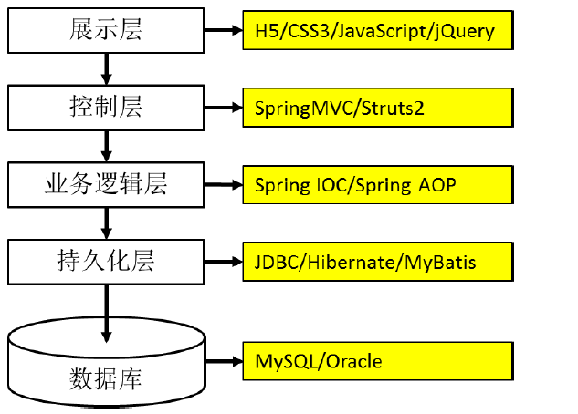  
这里给大家纠正一个误区，Maven 并不是直接用来辅助编码的，它战斗的岗位并不是以上各层。所以我们有必要通过企业开发中的实际需求来看一看哪些方面是我们现有技术的不足。  
## 1.2. Maven的作用
### 1.2.1. 添加第三方Jar包  
在今天的JavaEE 开发领域，有大量的第三方框架和工具可以供我们使用。要使用这些jar 包最简单的方法就是复制粘贴到WEB-INF/lib 目录下。但是这会导致每次创建一个新的工程就需要将jar 包重复复制到lib 目录下，从而造成工作区中存在大量重复的文件，让我们的工程显得很臃肿。  
而使用Maven 后每个jar 包本身只在本地仓库中保存一份，需要jar 包的工程只需要以坐标的方式简单的引用一下就可以了。不仅极大的节约了存储空间，让项目更轻巧，更避免了重复文件太多而造成的混乱。  
### 1.2.2. jar 包之间的依赖关系  
jar 包往不是孤立存在的，很多jar包都需要在其他jar包的支持下才能够正常工作,我们称之为jar包之间的依赖关系.最典型的是:commons-fileupload-1.3.jar 依赖于commons-io-2.0.1.jar,如果没有IO包FileUpload包就不能正常工作.  
通过Maven导入的包,就不需要程序员关注依赖关系了.例如Spring所需的jar包的部分依赖如下:  
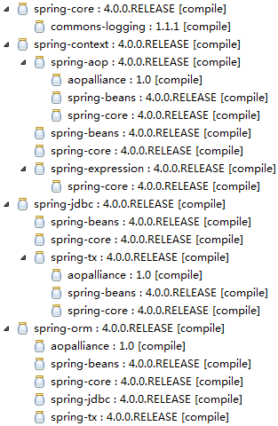  
### 1.2.3. 获取三方jar包  
使用 Maven 我们可以享受到一个完全统一规范的 jar 包管理体系。你只需要在你的项目中以坐标的方式依赖一个 jar 包，Maven 就会自动从中央仓库进行下载，并同时下载这个 jar 包所依赖的其他 jar 包 ——规范、完整、准确！一次性解决所有问题！  
### 1.2.4. 将项目拆分成多个工程模块   
随着 JavaEE 项目的规模越来越庞大，开发团队的规模也与日俱增。一个项目上千人的团队持续开发很多年对于 JavaEE 项目来说再正常不过。那么我们想象一下：几百上千的人开发的项目是同一个 Web 工程。那么架构师、项目经理该如何划分项目的模块、如何分工呢？这么大的项目已经不可能通过 package 结构来划分模块，必须将项目拆分成多个工程协同开发。多个模块工程中有的是 Java 工程，有的是 Web 工程。 那么工程拆分后又如何进行互相调用和访问呢？这就需要用到 Maven 的依赖管理机制。大家请看我们的 Survey 调查项目拆分的情况：  
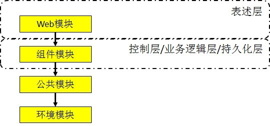  
# 2. What 
## 2.1. 简介  
Maven 是 Apache 软件基金会组织维护的一款自动化构建工具，专注服务于 Java 平台的项目构建和依赖管理。Maven 这个单词的本意是：专家，内行。读音是['meɪv(ə)n]或['mevn]。  
## 2.2. 构建
构建并不是创建，创建一个工程并不等于构建一个项目。要了解构建的含义我们应该由浅入深的从以下三个层面来看  
1. 纯 Java 代码  
大家都知道，我们 Java 是一门编译型语言，.java 扩展名的源文件需要编译成.class 扩展名的字节码文件才能够执行。所以编写任何 Java 代码想要执行的话就必须经过编译得到对应的.class 文件。   
2. Web 工程   
当我们需要通过浏览器访问 Java 程序时就必须将包含 Java 程序的 Web 工程编译的结果“拿”到服务器上的指定目录下，并启动服务器才行。这个“拿”的过程我们叫部署。   
我们可以将未编译的 Web 工程比喻为一只生的鸡，编译好的 Web 工程是一只煮熟的鸡，编译部署的过程就是将鸡炖熟。  
Web 工程和其编译结果的目录结构对比见下图：  
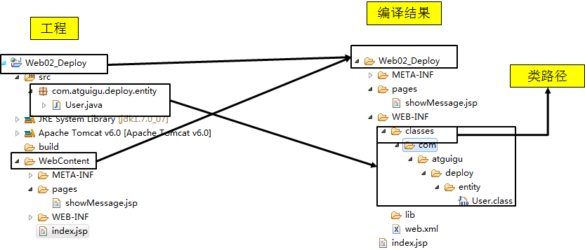  

3. 实际项目  
在实际项目中整合第三方框架，Web 工程中除了 Java 程序和 JSP 页面、图片等静态资源之外，还包括第三方框架的 jar 包以及各种各样的配置文件。所有这些资源都必须按照正确的目录结构部署到服务器上，项目才可以运行。 所以综上所述：构建就是以我们编写的 Java 代码、框架配置文件、国际化等其他资源文件、JSP 页
面和图片等静态资源作为“原材料”，去“生产”出一个可以运行的项目的过程。 
## 2.3. 构建过程   
1. 清理:删除以前的编译结果，为重新编译做好准备。  
2. 编译:将 Java 源程序编译为字节码文件。  
3. 测试:针对项目中的关键点进行测试，确保项目在迭代开发过程中关键点的正确性。  
4. 报告:在每一次测试后以标准的格式记录和展示测试结果。  
5. 打包:将一个包含诸多文件的工程封装为一个压缩文件用于安装或部署。Java 工程对应 jar 包，Web 工程对应 war 包。  
6. 安装:在 Maven 环境下特指将打包的结果——jar 包或 war 包安装到本地仓库中。  
7. 部署:将打包的结果部署到远程仓库或将 war 包部署到服务器上运行。  
## 2.4. 自动化构建  
它可以自动的从构建过程的起点一直执行到终点,其过程如下:  
  
## 2.5. 核心概念
Maven 能够实现自动化构建是和它的内部原理分不开的，这里我们从 Maven 的九个核心概念入手，看看 Maven 是如何实现自动化构建的.   
* pom
* 约定的目录
* 坐标
* 依赖管理
* 仓库管理
* 生命周期
* 插件和目标
* 继承
* 聚合  
# 3. How
Maven 的核心程序中仅仅定义了抽象的生命周期，而具体的操作则是由 Maven 的插件来完成的。可是Maven 的插件并不包含在 Maven 的核心程序中，在首次使用时需要联网下载。  
# 4. 核心解释
## 4.1. POM  
Project Object Model：项目对象模型。将 Java 工程的相关信息封装为对象作为便于操作和管理的模型。Maven 工程的核心配置。可以说学习 Maven 就是学习 pom.xml 文件中的配置。  
## 4.2. 约定的目录  
约定的目录结构对于 Maven 实现自动化构建而言是必不可少的一环，就拿自动编译来说，Maven 必须能找到 Java 源文件，下一步才能编译，而编译之后也必须有一个准确的位置保持编译得到的字节码文件。 我们在开发中如果需要让第三方工具或框架知道我们自己创建的资源在哪，那么基本上就是两种方式：   
1. 通过配置的形式明确告诉它
2. 基于第三方工具或框架的约定  

Maven 对工程目录结构的要求就属于后面的一种。  
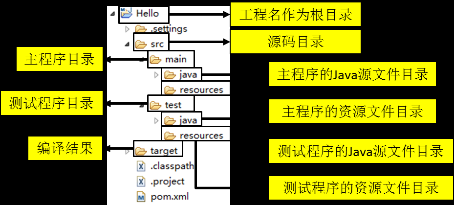  
现在 JavaEE 开发领域普遍认同一个观点：约定>配置>编码。意思就是能用配置解决的问题就不编码，能基于约定的就不进行配置。而 Maven 正是因为指定了特定文件保存的目录才能够对我们的 Java 工程进行自动化构建。  
## 4.3. 坐标
**几何中的坐标**  
[1]在一个平面中使用 x、y 两个向量可以唯一的确定平面中的一个点。 
[2]在空间中使用 x、y、z 三个向量可以唯一的确定空间中的一个点。

**Maven 的坐标**  
使用如下三个向量在 Maven 的仓库中唯一的确定一个 Maven 工程。 
[1]groupid：公司或组织的域名倒序+当前项目名称 
[2]artifactId：当前项目的模块名称 
[3]version：当前模块的版本

```
<groupId>com.atguigu.maven</groupId>  
<artifactId>Hello</artifactId>  
<version>0.0.1-SNAPSHOT</version> 
```
### 4.3.1. 如何通过坐标到仓库中查找 jar 包  
将 gav 三个向量连起来  
```
com.atguigu.maven+Hello+0.0.1-SNAPSHOT  
```
以连起来的字符串作为目录结构到仓库中查找  
```
com/atguigu/maven/Hello/0.0.1-SNAPSHOT/Hello-0.0.1-SNAPSHOT.jar  
```
>>  我们自己的 Maven 工程必须执行安装操作才会进入仓库。安装的命令是：mvn install  
## 4.4. 依赖管理
Maven 中最关键的部分，我们使用 Maven 最主要的就是使用它的依赖管理功能。要理解和掌握 Maven 的依赖管理，我们只需要解决一下几个问题：  
### 4.4.1. 依赖目的
当A jar包用到了B jar包中的某些类时，A就对B产生了依赖，这是概念上的描述。那么如何在项目中以依赖的方式引入一个我们需要的jar包呢？ 答案非常简单，就是使用dependency标签指定被依赖jar包的坐标就可以了。  
```
<dependency> 
    <groupId>com.atguigu.maven</groupId> 
    <artifactId>Hello</artifactId> 
    <version>0.0.1-SNAPSHOT</version> 
    <scope>compile</scope> 
</dependency> 
```
### 4.4.2. 依赖的范围  
大家注意到上面的依赖信息中除了目标jar包的坐标还有一个scope设置，这是依赖的范围。依赖的范围有几个可选值，我们用得到的是：compile、test、provided三个。  
**从项目结构角度理解compile和test的区别**  
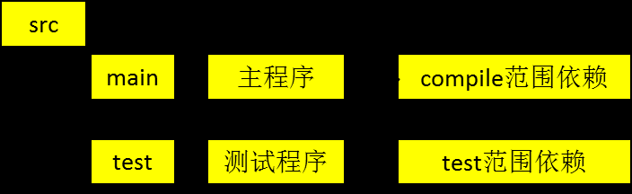  
**从开发和运行这两个不同阶段理解compile和provided的区别**  
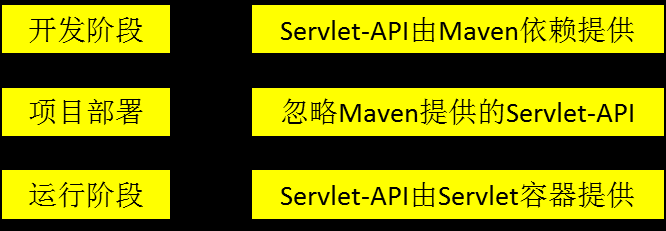  
**有效性总结**  
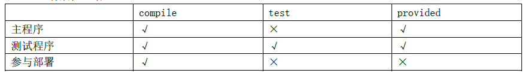  
### 4.4.3. 依赖的传递性  
A依赖B，B依赖C，A能否使用C呢？那要看B依赖C的范围是不是compile，如果是则可用，否则不可用。  
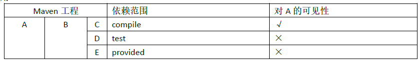  
### 4.4.4. 依赖的排除  
如果我们在当前工程中引入了一个依赖是A，而A又依赖了B，那么Maven会自动将A依赖的B引入当前工程，但是个别情况下B有可能是一个不稳定版，或对当前工程有不良影响。这时我们可以在引入A的时候将B排除。  
```
<dependency> 
     <groupId>com.atguigu.maven</groupId> 
     <artifactId>HelloFriend</artifactId> 
     <version>0.0.1-SNAPSHOT</version> 
     <type>jar</type> 
     <scope>compile</scope> 
     <exclusions> 
          <exclusion> 
              <groupId>commons-logging</groupId> 
              <artifactId>commons-logging</artifactId> 
          </exclusion> 
     </exclusions> 
</dependency> 
```
### 4.4.5. 版本统一管理
```
<properties> 
     <atguigu.spring.version>4.1.1.RELEASE</atguigu.spring.version>
     <project.build.sourceEncoding>UTF-8</project.build.sourceEncoding>
 </properties> 

<dependencies> 
     <dependency> 
          <groupId>org.springframework</groupId> 
          <artifactId>spring-core</artifactId> 
          <version>${atguigu.spring.version}</version> 
     </dependency>  
……  
</dependencies>  

```
### 4.4.6. 依赖原则
* 路径最短者优先  
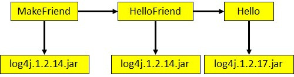  
* 路径相同时先声明者优先
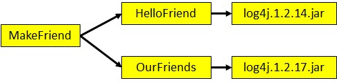  
>>  这里“声明”的先后顺序指的是 dependency 标签配置的先后顺序.   

## 4.5. 仓库   
### 4.5.1. 分类
1. 本地仓库：为当前本机电脑上的所有 Maven 工程服务。
2.  远程仓库   
私服：架设在当前局域网环境下，为当前局域网范围内的所有 Maven 工程服务。  
中央仓库：架设在 Internet 上，为全世界所有 Maven 工程服务。
中央仓库的镜像：架设在各个大洲，为中央仓库分担流量。减轻中央仓库的压力，同时更快的响应用户请求.    
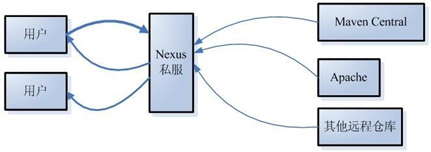   
### 4.5.2. 仓库中的文件  
[1]Maven 的插件   
[2]我们自己开发的项目的模块   
[3]第三方框架或工具的 jar 包   
>>  不管是什么样的 jar 包，在仓库中都是按照坐标生成目录结构，所以可以通过统一的方式查询或依赖  
## 4.6. 插件和目标   
Maven 的核心仅仅定义了抽象的生命周期，具体的任务都是交由插件完成的。   
每个插件都能实现多个功能，每个功能就是一个插件目标。   
Maven 的生命周期与插件目标相互绑定，以完成某个具体的构建任务。    
>> 例如：compile 就是插件 maven-compiler-plugin 的一个目标；pre-clean 是插件 maven-clean-plugin 的一个目标。  
## 4.7. 继承
### 4.7.1. 为什么需要继承机制？
由于非 compile 范围的依赖信息是不能在“依赖链”中传递的，所以有需要的工程只能单独配置。例如：  
```
Hello  模块
<dependency> 
 <groupId>junit</groupId> 
 <artifactId>junit</artifactId> 
 <version>4.0</version> 
 <scope>test</scope> 
</dependency> 
HelloFriend  模块
<dependency> 
 <groupId>junit</groupId> 
 <artifactId>junit</artifactId> 
 <version>4.0</version> 
 <scope>test</scope> 
</dependency> 
MakeFriend模块
<dependency> 
 <groupId>junit</groupId> 
 <artifactId>junit</artifactId> 
 <version>4.0</version> 
 <scope>test</scope> 
</dependency> 
```
此时如果项目需要将各个模块的junit版本统一为 4.9，那么到各个工程中手动修改无疑是非常不可取的。使用继承机制就可以将这样的依赖信息统一提取到父工程模块中进行统一管理。  
### 4.7.2. demo
**创建父工程**  
创建父工程和创建一般的 Java 工程操作一致，唯一需要注意的是：打包方式处要设置为 pom。  
**在子工程中引用父工程**  
```
<parent> 
 <groupId>com.atguigu.maven</groupId> 
 <artifactId>Parent</artifactId> 
 <version>0.0.1-SNAPSHOT</version> 
  
 <!-- 指定从当前子工程的pom.xml文件出发，查找父工程的pom.xml的路径 --> 
 <relativePath>../Parent/pom.xml</relativePath> 
</parent> 
```
>>  此时如果子工程的 groupId 和 version 如果和父工程重复则可以删除。

**在父工程中管理依赖**  
将 Parent 项目中的 dependencies 标签，用 dependencyManagement 标签括起来   
```
<dependencyManagement> 
 <dependencies> 
  <dependency> 
   <groupId>junit</groupId> 
   <artifactId>junit</artifactId> 
   <version>4.9</version> 
   <scope>test</scope> 
  </dependency> 
 </dependencies> 
</dependencyManagement> 
```
在子项目中重新指定需要的依赖，删除范围和版本号 
```
<dependencies> 
 <dependency> 
  <groupId>junit</groupId> 
  <artifactId>junit</artifactId> 
 </dependency> 
</dependencies> 
```
## 4.8. 聚合  
### 4.8.1. 场景  
将多个工程拆分为模块后，需要手动逐个安装到仓库后依赖才能够生效。修改源码后也需要逐个手动进行 clean 操作。而使用了聚合之后就可以批量进行 Maven 工程的安装、清理工作。  
### 4.8.2. 使用  
在总的聚合工程中使用 modules/module 标签组合，指定模块工程的相对路径即可   
```
<modules> 
 <module>../Hello</module> 
 <module>../HelloFriend</module> 
 <module>../MakeFriends</module> 
</modules> 
```
# 5. 生命周期  
## 5.1. 什么是 Maven 的生命周期？  
Maven 生命周期定义了各个构建环节的执行顺序，有了这个清单，Maven 就可以自动化的执行构建命令了。  
Maven 有三套相互独立的生命周期，分别是：  
1. Clean Lifecycle 在进行真正的构建之前进行一些清理工作。
2. Default Lifecycle 构建的核心部分，编译，测试，打包，安装，部署等等。
3. Site Lifecycle 生成项目报告，站点，发布站点。  
 
它们是相互独立的，你可以仅仅调用 clean 来清理工作目录，仅仅调用 site 来生成站点。当然你也可以直接运行 mvn clean install site 运行所有这三套生命周期。    
每套生命周期都由一组阶段(Phase)组成，我们平时在命令行输入的命令总会对应于一个特定的阶段。比如，运行 mvn clean，这个 clean 是 Clean 生命周期的一个阶段。有 Clean 生命周期，也有 clean 阶段。  
## 5.2. Clean 生命周期
1. pre-clean 执行一些需要在 clean 之前完成的工作  
2. clean 移除所有上一次构建生成的文件  
3. post-clean 执行一些需要在 clean 之后立刻完成的工作
## 5.3. Site 生命周期 
1. pre-site 执行一些需要在生成站点文档之前完成的工作  
2. site 生成项目的站点文档
3. post-site 执行一些需要在生成站点文档之后完成的工作，并且为部署做准备 
4. site-deploy 将生成的站点文档部署到特定的服务器上 这里经常用到的是 site 阶段和 site-deploy 阶段，用以生成和发布 Maven 站点，这可是 Maven 相当强大的功能，Manager 比较喜欢，文档及统计数据自动生成，很好看。

## 5.4. Default 生命周期
Default 生命周期是 Maven 生命周期中最重要的一个，绝大部分工作都发生在这个生命周期中。这里，只解释一些比较重要和常用的阶段：  

validate   
generate-sources    
process-sources     
generate-resources    
process-resources 复制并处理资源文件，至目标目录，准备打包。  
compile 编译项目的源代码。   
process-classes 
generate-test-sources  
process-test-sources 
generate-test-resources     
process-test-resources 复制并处理资源文件，至目标测试目录。   
test-compile 编译测试源代码。    
process-test-classes     
test 使用合适的单元测试框架运行测试。这些测试代码不会被打包或部署。
prepare-package 
package 接受编译好的代码，打包成可发布的格式，如 JAR。   
pre-integration-test  
integration-test  
post-integration-test  
verify 
install 将包安装至本地仓库，以让其它项目依赖。  
deploy 将最终的包复制到远程的仓库，以让其它开发人员与项目共享或部署到服务器上运行。 
## 5.5. 生命周期与自动化构建  
运行任何一个阶段的时候，它前面的所有阶段都会被运行，例如我们运行 mvn install 的时候，代码会被编译，测试，打包。这就是 Maven 为什么能够自动执行构建过程的各个环节的原因。此外，Maven 的插件机制是完全依赖 Maven 的生命周期的，因此理解生命周期至关重要。  
# 6. 基本使用
## 6.1. 安装  
### 6.1.1. 解压部署Maven核心程序
①检查JAVA_HOME环境变量
    C:\Windows\System32>echo %JAVA_HOME%
    D:\DevInstall\jdk1.7.0_07
②解压Maven的核心程序
    将apache-maven-3.2.2-bin.zip解压到一个非中文无空格的目录下。例如：D:\DevInstall\apache-maven-3.2.2
③配置环境变量
    M2_HOME D:\DevInstall\apache-maven-3.2.2
    path	D:\DevInstall\apache-maven-3.2.2\bin
④查看Maven版本信息验证安装是否正确
    C:\Windows\System32>mvn -v
    Apache Maven 3.2.2 (45f7c06d68e745d05611f7fd14efb6594181933e; 2014-06-17T21:51:42+08:00)
    Maven home: D:\DevInstall\apache-maven-3.2.2\bin\..
    Java version: 1.7.0_07, vendor: Oracle Corporation
    Java home: D:\DevInstall\jdk1.7.0_07\jre
    Default locale: zh_CN, platform encoding: GBK
    OS name: "windows 7", version: "6.1", arch: "amd64", family: "windows"
### 6.1.2. 修改本地仓库
①默认本地仓库位置：~\.m2\repository
    ~表示当前用户的家目录，例如：C:\Users\[你当前登录系统的用户名]
②指定本地仓库位置的配置信息文件：apache-maven-3.2.2\conf\settings.xml
③在根标签settings下添加如下内容：<localRepository>[本地仓库路径，也就是RepMaven.zip的解压目录]</localRepository>
## 6.2. demo1  
```
①目录结构
		Hello
		|---src
		|---|---main
		|---|---|---java
		|---|---|---resources
		|---|---test
		|---|---|---java
		|---|---|---resources
		|---pom.xml

	②POM文件内容
<?xml version="1.0" ?>
<project xmlns="http://maven.apache.org/POM/4.0.0" xmlns:xsi="http://www.w3.org/2001/XMLSchema-instance" xsi:schemaLocation="http://maven.apache.org/POM/4.0.0 http://maven.apache.org/xsd/maven-4.0.0.xsd">
	<modelVersion>4.0.0</modelVersion>

	<groupId>com.atguigu.maven</groupId>
	<artifactId>Hello</artifactId>
	<version>0.0.1-SNAPSHOT</version>

	<name>Hello</name>
	  
	<dependencies>
		<dependency>
			<groupId>junit</groupId>
			<artifactId>junit</artifactId>
			<version>4.0</version>
			<scope>test</scope>
		</dependency>
	</dependencies>
</project>
	③编写主程序代码
		在src/main/java/com/atguigu/maven目录下新建文件Hello.java，内容如下
		package com.atguigu.maven;
		public class Hello {
			public String sayHello(String name){
				return "Hello "+name+"!";
			}
		}
	④编写测试代码
		在/src/test/java/com/atguigu/maven目录下新建测试文件HelloTest.java
		package com.atguigu.maven;	
		import org.junit.Test;
		import static junit.framework.Assert.*;
		public class HelloTest {
			@Test
			public void testHello(){
				Hello hello = new Hello();
				String results = hello.sayHello("litingwei");
				assertEquals("Hello litingwei!",results);	
			}
		}
	⑤运行几个基本的Maven命令
		mvn compile	编译
		mvn clean	清理
		mvn test	测试
		mvn package	打包
		※注意：运行Maven命令时一定要进入pom.xml文件所在的目录！
```
## 6.3. demo2 
```
①工程名：HelloFriend
②目录结构与第一个Maven工程相同
③POM文件
<?xml version="1.0" ?>
<project xmlns="http://maven.apache.org/POM/4.0.0" xmlns:xsi="http://www.w3.org/2001/XMLSchema-instance" xsi:schemaLocation="http://maven.apache.org/POM/4.0.0 http://maven.apache.org/xsd/maven-4.0.0.xsd">
<modelVersion>4.0.0</modelVersion>
<groupId>com.atguigu.maven</groupId>
<artifactId>HelloFriend</artifactId>
<version>0.0.1-SNAPSHOT</version>
<name>HelloFriend</name>

<dependencies>
    <dependency>
        <groupId>junit</groupId>
        <artifactId>junit</artifactId>
        <version>4.0</version>
        <scope>test</scope>
    </dependency>		
    
    <dependency>
        <groupId>com.atguigu.maven</groupId>
        <artifactId>Hello</artifactId>
        <version>0.0.1-SNAPSHOT</version>
        <scope>compile</scope>
    </dependency>
    
</dependencies>
</project>
④主程序：在src/main/java/com/atguigu/maven目录下新建文件HelloFriend.java
    package com.atguigu.maven;	
    import com.atguigu.maven.Hello;
    public class HelloFriend {
        public String sayHelloToFriend(String name){
            Hello hello = new Hello();
            String str = hello.sayHello(name)+" I am "+this.getMyName();
            System.out.println(str);
            return str;
        }
        public String getMyName(){
            return "John";
        }
    }
⑤测试程序：在/src/test/java/com/atguigu/maven目录下新建测试文件HelloFriendTest.java
    package com.atguigu.maven;	
    import static junit.framework.Assert.assertEquals;
    import org.junit.Test;
    import com.atguigu.maven.Hello;
    
    public class HelloFriendTest {
        @Test
        public void testHelloFriend(){
            HelloFriend helloFriend = new HelloFriend();
            String results = helloFriend.sayHelloToFriend("litingwei");
            assertEquals("Hello litingwei! I am John",results);	
        }
    }
⑥运行Maven命令
    mvn install	安装
```
## 6.4. demo3
```
①设置通过Maven创建的工程的JDK版本——一劳永逸
    [1]打开settings.xml文件
    [2]找到profiles标签
    [3]加入如下配置
        <profile>
            <id>jdk-1.7</id>
            <activation>
                <activeByDefault>true</activeByDefault>
                <jdk>1.7</jdk>
            </activation>
            <properties>
                <maven.compiler.source>1.7</maven.compiler.source>
                <maven.compiler.target>1.7</maven.compiler.target>
                <maven.compiler.compilerVersion>1.7</maven.compiler.compilerVersion>
            </properties>
        </profile>
②工程坐标
    groupId：com.atguigu.maven
    ArtifactId：MakeFriends
    Package：com.atguigu.maven
③在src/main/java中新建类com.atguigu.maven.MakeFriends
    public String makeFriends(String name){
        HelloFriend friend = new HelloFriend();
        friend.sayHelloToFriend("litingwei");
        String str = "Hey,"+friend.getMyName()+" make a friend please.";
        System.out.println(str);
        return str;
    }
④在src/test/java中新建类com.atguigu.maven.MakeFriendsTest
    package com.atguigu.maven;
    import static junit.framework.Assert.assertEquals;
    import org.junit.Test;
    public class MakeFriendsTest {
        @Test
        public void testMakeFriends(){		
            MakeFriends makeFriend = new MakeFriends();
            String str = makeFriend.makeFriends("litingwei");
            assertEquals("Hey,John make a friend please.",str);
        }
    }
⑤添加依赖信息
    <dependency>
        <groupId>junit</groupId>
        <artifactId>junit</artifactId>
        <version>4.9</version>
        <scope>test</scope>
    </dependency>
    <dependency>
        <groupId>com.atguigu.maven</groupId>
        <artifactId>HelloFriend</artifactId>
        <version>0.0.1-SNAPSHOT</version>
        <type>jar</type>
        <scope>compile</scope>
    </dependency>
⑥在Eclipse环境下执行Maven命令：右击pom.xml选择run as 中的命令执行即可
```
## 6.5. 测试依赖的范围对传递性的影响
①在Hello中添加对spring-core的依赖  
```
<dependency>
    <groupId>org.springframework</groupId>
    <artifactId>spring-core</artifactId>
    <version>4.0.0.RELEASE</version>
    <scope>compile</scope>
</dependency>
```
②在HelloFriend中查看spring-core是否被加入了运行时环境  
③将Hello中对spring-core的依赖范围修改为test，再到HelloFriend中检查  
④将Hello中对spring-core的依赖范围修改为provided，再到HelloFriend中检查  
⑤结论：非compile范围的依赖不能传递，必须在有需要的工程中单独加入  
## 6.6. 测试依赖原则  
```
①路径最短者优先
    [1]在Hello中依赖log4j-1.2.17
        <dependency>
            <groupId>log4j</groupId>
            <artifactId>log4j</artifactId>
            <version>1.2.17</version>
        </dependency>

    [2]在HelloFriend中依赖log4j-1.2.14
        <dependency>
            <groupId>log4j</groupId>
            <artifactId>log4j</artifactId>
            <version>1.2.14</version>
        </dependency>
    [3]查看MakeFriends中自动引入的log4j是哪个版本
    
②路径相同时先声明者优先
    [1]创建OurFriends工程，依赖log4j-1.2.17
    [2]让MakeFriends依赖OurFriends
    [3]测试MakeFriends中，HelloFriend和OurFriends依赖的先后顺序和引入的log4j版本之间的关系
```
## 6.7. 创建Web工程  
①ServletAPI依赖
```
<dependency>
    <groupId>javax.servlet</groupId>
    <artifactId>servlet-api</artifactId>
    <version>2.5</version>
    <scope>provided</scope>
</dependency>
```
②JSPAPI依赖
```
<dependency>
    <groupId>javax.servlet.jsp</groupId>
    <artifactId>jsp-api</artifactId>
    <version>2.1.3-b06</version>
    <scope>provided</scope>
</dependency>
```
## 6.8. Web工程自动部署
```
<build>
    <finalName>AtguiguWeb</finalName>
    <plugins>
        <plugin>
            <groupId>org.codehaus.cargo</groupId>
            <artifactId>cargo-maven2-plugin</artifactId>
            <version>1.2.3</version>
            <configuration>
                <container>
                    <containerId>tomcat6x</containerId>
                    <home>D:\DevInstall\apache-tomcat-6.0.39</home>
                </container>
                <configuration>
                    <type>existing</type>
                    <home>D:\DevInstall\apache-tomcat-6.0.39</home>
                    <!-- 如果Tomcat端口为默认值8080则不必设置该属性 -->
                    <properties>
                        <cargo.servlet.port>8989</cargo.servlet.port>
                    </properties>
                </configuration>
            </configuration>
            <executions>  
                <execution>  
                    <id>cargo-run</id>  
                    <phase>install</phase>  
                    <goals>  
                        <goal>run</goal>  
                    </goals>  
                </execution>  
            </executions>
        </plugin>
    </plugins>
</build>
```
## 6.9. 继承
①创建Parent工程，打包方式为pom  
②收集所有非compile范围的依赖信息，使用dependencyManagement标签统一管理  
    <dependencyManagement>
        <dependencies>
            <dependency>
                <groupId>junit</groupId>
                <artifactId>junit</artifactId>
                <version>4.9</version>
                <scope>test</scope>
            </dependency>
        </dependencies>
    </dependencyManagement>
③在各个子工程中引用父工程  
```
    <parent>
        <groupId>com.atguigu.maven</groupId>
        <artifactId>Parent</artifactId>
        <version>0.0.1-SNAPSHOT</version>
        
        <!-- 以当前文件为基准查找父工程中pom.xml文件的相对路径 -->
        <relativePath>../Parent/pom.xml</relativePath>
    </parent>
```
④删除子工程中的重复信息  
    groupId  
    artifactid  
⑤在子工程中找到被父工程管理的依赖信息，删除版本号部分  
⑥在父工程中统一修改已管理的依赖信息的版本号，看是否能够控制所有子工程
## 6.10. 聚合
在总的聚合工程中加入如下信息
```
	<modules>
		<module>../Hello</module>
		<module>../HelloFriend</module>
		<module>../MakeFriends</module>
	</modules>
```