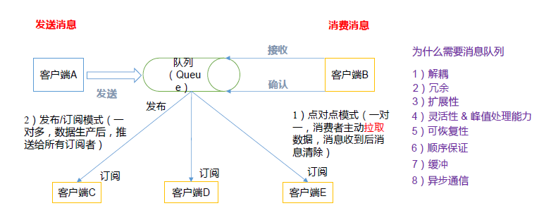
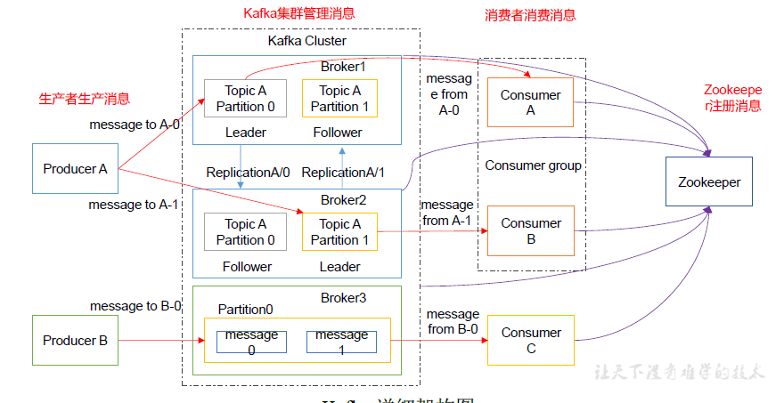
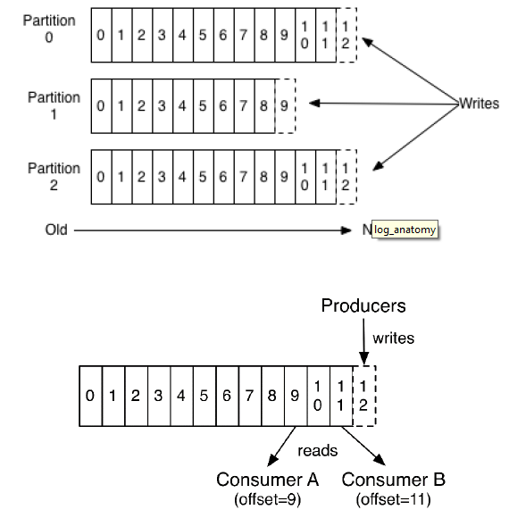
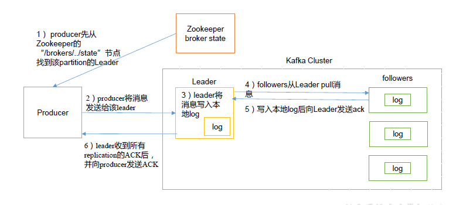

#  消息中间件
  
消息中间件常见的模式一般有两种,即点对点和发布订阅.  
1.  点对点模型通常是一个基于拉取或者轮询的消息传送模型，这种模型从队列中请求信息，而不是将消息推送到客户端。这个模型的特点是发送到队列的消息被一个且只有一个接收者接收处理，即使有多个消息监听者也是如此。    
2.  发布/订阅模式（一对多，数据生产后，推送给所有订阅者）
## 消息中间件常见用途
基本点是异步处理.通过异步处理来提高系统性能和消峰,降低系统耦合性.  
1. 通过异步处理提高系统性能（削峰、减少响应所需时间）  
这里主要说的是对数据库的影响.因为数据库处理性能和速度是有限的,特别是写库操作.    
2. 降低系统耦合性
我们最常见的事件驱动架构类似生产者消费者模式，在大型网站中通常用利用消息队列实现事件驱动结构。  
另外为了避免消息队列服务器宕机造成消息丢失，会将成功发送到消息队列的消息存储在消息生产者服务器上，等消息真正被消费者服务器处理后才删除消息。在消息队列服务器宕机后，生产者服务器会选择分布式消息队列服务器集群中的其他服务器发布消息。  
## 消息中间件的弊端
1. 系统可用性降低(消息丢失,MQ挂掉)
2. 系统复杂性提高(重复消费,消息丢失,有序消费) 
3. 一致性问题(因为异步化,所以会出现该问题)  
## JMS与AMQP
### JMS的两种消息模型
1. 点对点
使用队列（Queue）作为消息通信载体；满足生产者与消费者模式，一条消息只能被一个消费者使用，未被消费的消息在队列中保留直到被消费或超时。比如：我们生产者发送100条消息的话，两个消费者来消费一般情况下两个消费者会按照消息发送的顺序各自消费一半（也就是你一个我一个的消费。）
2. 发布/订阅模型
发布订阅模型（Pub/Sub） 使用主题（Topic）作为消息通信载体，类似于广播模式；发布者发布一条消息，该消息通过主题传递给所有的订阅者，在一条消息广播之后才订阅的用户则是收不到该条消息的。  
### JMS五种不同的消息格式
JMS定义了五种不同的消息正文格式，以及调用的消息类型，允许你发送并接收以一些不同形式的数据，提供现有消息格式的一些级别的兼容性。  
* StreamMessage Java原始数据流
* MapMessage 一套名称-值对
* TextMessage 一个字符串对象
* ObjectMessage 一个序列化的Java对象
* BytesMessage 一个字节的数据流  

### AMQP
AMQP，即Advanced Message Queuing Protocol，一个提供统一消息服务的应用层标准 高级消息队列协议（二进制应用层协议），是应用层协议的一个开放标准,为面向消息的中间件设计，兼容 JMS。基于此协议的客户端与消息中间件可传递消息，并不受客户端/中间件同产品，不同的开发语言等条件的限制。  
### 对比
||JMS|AMQP|
|:--|:--|:--|
|定义|Java Api|协议|
|跨语言|否|是|
|跨平台|否|是|
|消息类型|点对点/订阅发布|五种模型:direct,fanout,topic,header,system|
|支持消息类型|5种消息格式|二进制|

* AMQP 为消息定义了线路层（wire-level protocol）的协议，而JMS所定义的是API规范。在 Java 体系中，多个client均可以通过JMS进行交互，不需要应用修改代码，但是其对跨平台的支持较差。而AMQP天然具有跨平台、跨语言特性。
* JMS 支持TextMessage、MapMessage 等复杂的消息类型；而 AMQP 仅支持 byte[] 消息类型（复杂的类型可序列化后发送）。
* 由于Exchange 提供的路由算法，AMQP可以提供多样化的路由方式来传递消息到消息队列，而 JMS 仅支持 队列 和 主题/订阅 方式两种。

## 常见的消息中间件对比
||简介|
|:--|:--|
|吞吐量|万级ActiveMQ(性能最差)和RabbitMQ,十万-百万(RocketMQ,Kafka)|
|可用性|都可以实现高可用ActiveMQ和RabbitMQ,由于Exchange 提供的路由算法，AMQP可以提供多样化的路由方式来传递消息到消息队列，而 JMS 仅支持 队列 和 主题/订阅 方式两种。|
|时延|RabbitMQ基于erlang开发,并发能力强,延时微妙级别,其他ms级|
|功能|除了 Kafka，其他三个功能都较为完备。 Kafka 功能较为简单，主要支持简单的MQ功能，在大数据领域的实时计算以及日志采集被大规模使用，是事实上的标准|
|消息丢失|ActiveMQ 和 RabbitMQ 丢失的可能性非常低， RocketMQ 和 Kafka 理论上不会丢失。|  

* ActiveMQ 的社区算是比较成熟，但是较目前来说，ActiveMQ 的性能比较差，而且版本迭代很慢，不推荐使用
* RabbitMQ 在吞吐量方面虽然稍逊于 Kafka 和 RocketMQ ，但是由于它基于 erlang 开发，所以并发能力很强，性能极其好，延时很低，达到微秒级。但是也因为 RabbitMQ 基于 erlang 开发，所以国内很少有公司有实力做erlang源码级别的研究和定制。如果业务场景对并发量要求不是太高（十万级、百万级），那这四种消息队列中，RabbitMQ 一定是你的首选。如果是大数据领域的实时计算、日志采集等场景，用 Kafka 是业内标准的，绝对没问题，社区活跃度很高，绝对不会黄，何况几乎是全世界这个领域的事实性规范。
* RocketMQ 阿里出品，Java 系开源项目，源代码我们可以直接阅读，然后可以定制自己公司的MQ，并且 RocketMQ 有阿里巴巴的实际业务场景的实战考验。RocketMQ 社区活跃度相对较为一般，不过也还可以，文档相对来说简单一些，然后接口这块不是按照标准 JMS 规范走的有些系统要迁移需要修改大量代码。还有就是阿里出台的技术，你得做好这个技术万一被抛弃，社区黄掉的风险，那如果你们公司有技术实力我觉得用RocketMQ 挺好的
* kafka 的特点其实很明显，就是仅仅提供较少的核心功能，但是提供超高的吞吐量，ms 级的延迟，极高的可用性以及可靠性，而且分布式可以任意扩展。同时 kafka 最好是支撑较少的 topic 数量即可，保证其超高吞吐量。kafka 唯一的一点劣势是有可能消息重复消费，那么对数据准确性会造成极其轻微的影响，在大数据领域中以及日志采集中，这点轻微影响可以忽略这个特性天然适合大数据实时计算以及日志收集。  
>> 《Java工程师面试突击第1季-中华石杉老师》

## Kafka简介  
在流式计算中，Kafka 一般用来缓存数据， Storm 通过消费 Kafka 的数据进行计算。是一个分布式消息中间件.根据Topic进行归类,发送消息者称为Producer,消息接受者称为Consumer,此外Kafka集群有多个实例组成,每个实例称为broker.  
>> kafka集群与消费者都依赖与zookeeper集群保存一些meta信息.  

基本架构图  
  
* Producer：消息生产者
* Consumer
* Topic
* consumer group(cg):这里是单播和多播的一种手段,消费者生命是需要声明消费者组.
* broker:集群中的kaffka服务端  
* partition:实现负载和扩展,一个非常大的topic可以分布到多个broker,一个topic可以分为多个partition,每个partition都是有序的.此外partition中的每条消息都有offset,依赖该offset可以保证消费者当前消费的消息队列.  
* offset:kafka的存储文件都是按照offset.kaffka来命名
  
## 部署注意项
>> logs文件夹是存储数据的地方

修改服务端的配置文件(主要是brokerid,以及删除topic功能的使用)  
```
#broker 的 全局唯一编号，不能重复
broker.id=0
#删除 topic 功能使能
delete.topic.enable=true
#处理网络请求 的 线程数量
num.network.threads=3
#用来 处理磁盘 IO 的线程数量
num.io.threads=8
#发送套接字的缓冲区大小
socket.send.buffer.bytes=102400
#接收套接字的缓冲区大小
socket.receive.buffer.bytes=102400
#请求套接字的缓冲区大小
socket.request.max.bytes=10485760 0
#kafka 运行日志存放的路径
log.dirs=/opt/module/kafka/logs
#topic 在当前 broker 上的分区个数
num.partitions=1
#用来恢复和清理 data 下数据的线程数量
num.recovery.threads.per.data.dir=1
#segment 文件保留的最长时间，超时将被删除
log.retention.hours=168
#配置连接 Zookeeper 集群 地址
zookeeper.connect=hadoop102:2181 ,hadoop103:2181,hadoop104:2181
```
## 常见命令
### topic管理
1. 查看
```
 .\kafka-topics.bat --zookeeper localhost:2181 --list
```
2. 创建
创建一个topic为first,副本为1,分区为3的topic
``` 
.\kafka-topics.bat --zookeeper localhost:2181 --create  --replication-factor 1 --partitions 3 --topic first
```
3. 删除
```
.\kafka-topics.bat --zookeeper localhost:2181 --delete --topic first
```
## Kafka生产者数据生成过程
### 写入方式  
producer 采用推（push）模式将消息发布到broker，每条消息都被追加（append）到分区（patition）中，属于顺序写磁盘（顺序写磁盘效率比随机写内存要高，保障kafka 吞吐率）  
### 分区  
消息发送时都被发送到一个topic，其本质就是一个目录，而topic 是由一些Partition
Logs(分区日志)组成，其组织结构如下图所示：  
  
1. 分区的原因
>> 1提高并发(均衡负载),2通过调整可以动态扩展,增加集群数量
2. 分区原则
>> 1 指定分区,则直接用,2 未指定分区,指定key,对key进行hash后选取,3都未给出,轮询
### 副本
同一个partition可能会有多个replication(默认的server配置文件中有,如果不指定),没有replication的情况下,一旦broker党籍,其他patition的数据都不可被消费,同时producer也不能再将数据存在于其上的patition.引入副本后,就可以通过切换leader的方式达到高可用的目的.  
### 写入流程
生产者写入过程图: 
  
