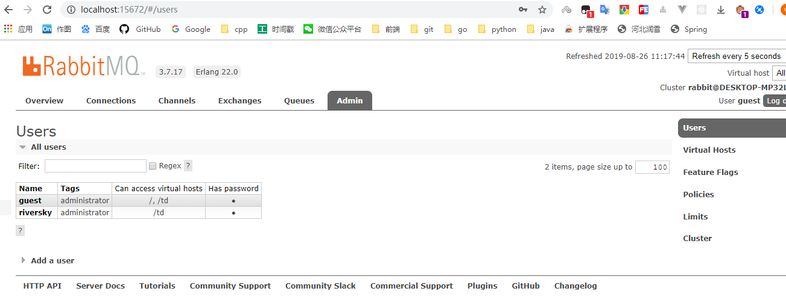

<!-- TOC -->

- [1. rabbitmq](#1-rabbitmq)
    - [1.1. 安装](#11-安装)
        - [1.1.1. 初始化](#111-初始化)
    - [核心概念](#核心概念)
        - [生产者与消费者](#生产者与消费者)
        - [exchange](#exchange)
        - [Queue(消息队列)](#queue消息队列)
        - [Broker（消息中间件的服务节点）](#broker消息中间件的服务节点)
        - [Exchange Types(交换器类型)](#exchange-types交换器类型)
    - [消息类型](#消息类型)
    - [基本队列](#基本队列)
        - [简单模式](#简单模式)
        - [work queues](#work-queues)
            - [robin](#robin)
            - [消费者每次只提交一个请求](#消费者每次只提交一个请求)
            - [防止重复消费](#防止重复消费)
    - [发布订阅](#发布订阅)
        - ["fanout"  直接转发](#fanout--直接转发)
        - [direct (基于键的转发)](#direct-基于键的转发)
        - [topic(模糊匹配转发)](#topic模糊匹配转发)
    - [生产者生产保证](#生产者生产保证)
        - [事务](#事务)
        - [conform](#conform)
    - [消费者重复消费问题,以及顺序消费](#消费者重复消费问题以及顺序消费)

<!-- /TOC -->

# 1. rabbitmq
[官方项目](https://www.rabbitmq.com/getstarted.html)
## 1.1. 安装
下载与安装不赘述,需要注意点,与Erlang的版本对应,本用例采用的是3.7.17.  
|rabbit版本|erlang min|erlang max|
|:--|:--|:--|
|3.7.15-17|20.3.x|22.0.x|
|3.7.7-14|20.3.x|21.3.x|

安装完成后初始化后台插件  
/sbin 目录下
```
扩展插件
rabbitmq-plugins.bat enable rabbitmq_management 
启动服务
rabbitmq-server.bat 
```
启动  
### 1.1.1. 初始化
主要是用户 以及用户空间初始化(类似于为新用户设置数据库)
默认端口http://localhost:15672


## 核心概念
RabbitMQ 整体上是一个生产者与消费者模型，主要负责接收、存储和转发消息。可以把消息传递的过程想象成：当你将一个包裹送到邮局，邮局会暂存并最终将邮件通过邮递员送到收件人的手上，RabbitMQ就好比由邮局、邮箱和邮递员组成的一个系统。从计算机术语层面来说，RabbitMQ 模型更像是一种交换机模型。  

  
### 生产者与消费者
1. 生产者
2. 消费者

消息一般由 2 部分组成：消息头（或者说是标签 Label）和 消息体。消息体也可以称为 payLoad ,消息体是不透明的，而消息头则由一系列的可选属性组成，这些属性包括 routing-key（路由键）、priority（相对于其他消息的优先权）、delivery-mode（指出该消息可能需要持久性存储）等。生产者把消息交由 RabbitMQ 后，RabbitMQ 会根据消息头把消息发送给感兴趣的 Consumer(消费者)。  
### exchange
在 RabbitMQ 中，消息并不是直接被投递到 Queue(消息队列) 中的，中间还必须经过 Exchange(交换器) 这一层，Exchange(交换器) 会把我们的消息分配到对应的 Queue(消息队列) 中。  
Exchange(交换器) 用来接收生产者发送的消息并将这些消息路由给服务器中的队列中，如果路由不到，或许会返回给 Producer(生产者) ，或许会被直接丢弃掉 。这里可以将RabbitMQ中的交换器看作一个简单的实体。  
RabbitMQ 的 Exchange(交换器) 有4种类型，不同的类型对应着不同的路由策略：direct(默认)，fanout, topic, 和 headers，不同类型的Exchange转发消息的策略有所区别。这个会在介绍 Exchange Types(交换器类型) 的时候介绍到。   
生产者将消息发给交换器的时候，一般会指定一个 RoutingKey(路由键)，用来指定这个消息的路由规则，而这个 RoutingKey 需要与交换器类型和绑定键(BindingKey)联合使用才能最终生效。  

**RabbitMq绑定**  
RabbitMQ 中通过 Binding(绑定) 将 Exchange(交换器) 与 Queue(消息队列) 关联起来，在绑定的时候一般会指定一个 BindingKey(绑定建) ,这样 RabbitMQ 就知道如何正确将消息路由到队列了,如下图所示。一个绑定就是基于路由键将交换器和消息队列连接起来的路由规则，所以可以将交换器理解成一个由绑定构成的路由表。Exchange 和 Queue 的绑定可以是多对多的关系。  
  
生产者将消息发送给交换器时，需要一个RoutingKey,当 BindingKey 和 RoutingKey 相匹配时，消息会被路由到对应的队列中。在绑定多个队列到同一个交换器的时候，这些绑定允许使用相同的 BindingKey。BindingKey 并不是在所有的情况下都生效，它依赖于交换器类型，比如fanout类型的交换器就会无视，而是将消息路由到所有绑定到该交换器的队列中。  
### Queue(消息队列)
Queue(消息队列) 用来保存消息直到发送给消费者。它是消息的容器，也是消息的终点。一个消息可投入一个或多个队列。消息一直在队列里面，等待消费者连接到这个队列将其取走。  
RabbitMQ 中消息只能存储在 队列 中，这一点和 Kafka 这种消息中间件相反。Kafka 将消息存储在 topic（主题） 这个逻辑层面，而相对应的队列逻辑只是topic实际存储文件中的位移标识。 RabbitMQ 的生产者生产消息并最终投递到队列中，消费者可以从队列中获取消息并消费。  
多个消费者可以订阅同一个队列，这时队列中的消息会被平均分摊（Round-Robin，即轮询）给多个消费者进行处理，而不是每个消费者都收到所有的消息并处理，这样避免的消息被重复消费。  
RabbitMQ 不支持队列层面的广播消费,如果有广播消费的需求，需要在其上进行二次开发,这样会很麻烦，不建议这样做。  
### Broker（消息中间件的服务节点）  
对于 RabbitMQ 来说，一个 RabbitMQ Broker 可以简单地看作一个 RabbitMQ 服务节点，或者RabbitMQ服务实例。大多数情况下也可以将一个 RabbitMQ Broker 看作一台 RabbitMQ 服务器。  
下图展示了生产者将消息存入 RabbitMQ Broker,以及消费者从Broker中消费数据的整个流程。  

### Exchange Types(交换器类型)  
RabbitMQ 常用的 Exchange Type 有 fanout、direct、topic、headers 这四种（AMQP规范里还提到两种 Exchange Type，分别为 system 与 自定义，这里不予以描述）。  
**fanout**  
fanout类型的Exchange路由规则非常简单,他会把所有发送到该Exchange的消息路由到所有与它绑定的的Queue中,不需要做任何判断操作,所以fanout类型是所有交换机类型里面速度最快的,fanout类型常用来广播消息.  
**direct**  
direct 类型的Exchange路由规则也很简单，它会把消息路由到那些 Bindingkey 与 RoutingKey 完全匹配的 Queue 中。  
    
以上图为例，如果发送消息的时候设置路由键为“warning”,那么消息会路由到 Queue1 和 Queue2。如果在发送消息的时候设置路由键为"Info”或者"debug”，消息只会路由到Queue2。如果以其他的路由键发送消息，则消息不会路由到这两个队列中。  
>>  direct 类型常用在处理有优先级的任务，根据任务的优先级把消息发送到对应的队列，这样可以指派更多的资源去处理高优先级的队列。  
**topic**  
前面讲到direct类型的交换器路由规则是完全匹配 BindingKey 和 RoutingKey ，但是这种严格的匹配方式在很多情况下不能满足实际业务的需求。topic类型的交换器在匹配规则上进行了扩展，它与 direct 类型的交换器相似，也是将消息路由到 BindingKey 和 RoutingKey 相匹配的队列中，但这里的匹配规则有些不同，它约定：  
* RoutingKey为一个点号"."分割的字符串(被点号分割的每一段独立的字符串称为一个单词)
* BindingKey和RoutingKey一样也是点号分割的字符串
* BindingKey中可以存在两个特殊字符串"*"和"#"用作模糊匹配." *"用作匹配一个单词,"#"用做匹配多个单词(可以为0个).   
  
  
```
"com.rabbitmq.client" ->  Queue1 Queue2  
"com.hidden.client" ->  Queue2 
"com.hidden.demo"  -> Queue2
"java.rabbitmq.demo"  -> Queue1
"java.util.concurrent"  -> null(会被丢弃或者返回给生产者(需要设置mandatory)),因为它没有匹配任何路由键.  
```

**headers**  
不推荐使用  
headers 类型的交换器不依赖于路由键的匹配规则来路由消息，而是根据发送的消息内容中的 headers 属性进行匹配。在绑定队列和交换器时制定一组键值对，当发送消息到交换器时，RabbitMQ会获取到该消息的 headers（也是一个键值对的形式)'对比其中的键值对是否完全匹配队列和交换器绑定时指定的键值对，如果完全匹配则消息会路由到该队列，否则不会路由到该队列。headers 类型的交换器性能会很差，而且也不实用，基本上不会看到它的存在。  
## 消息类型
提供了五种消息模型：①direct exchange；②fanout exchange；③topic change；④headers exchange；⑤system exchange。本质来讲，后四种和JMS的pub/sub模型没有太大差别，仅是在路由机制上做了更详细的划分 
基本连接工具类
基本maven依赖
```
<dependencies>
    <dependency>
      <groupId>com.rabbitmq</groupId>
      <artifactId>amqp-client</artifactId>
      <version>5.7.1</version>
    </dependency>
    <dependency>
      <groupId>org.slf4j</groupId>
      <artifactId>slf4j-api</artifactId>
      <version>1.7.7</version>
    </dependency>
    <dependency>
      <groupId>ch.qos.logback</groupId>
      <artifactId>logback-core</artifactId>
      <version>1.1.7</version>
    </dependency>
    <dependency>
      <groupId>ch.qos.logback</groupId>
      <artifactId>logback-access</artifactId>
      <version>1.1.7</version>
    </dependency>
    <dependency>
      <groupId>ch.qos.logback</groupId>
      <artifactId>logback-classic</artifactId>
      <version>1.1.7</version>
    </dependency>
    <dependency>
      <groupId>junit</groupId>
      <artifactId>junit</artifactId>
      <version>4.11</version>
      <scope>test</scope>
    </dependency>
  </dependencies>
```

```
package cn.riversky.mq.utils;
import com.rabbitmq.client.Connection;
import com.rabbitmq.client.ConnectionFactory;
import java.io.IOException;
import java.util.concurrent.TimeoutException;
/**
 * 连接工厂
 */
public class RabbitConnectUtils {
    public static Connection getConn() throws IOException, TimeoutException {
        ConnectionFactory connectionFactory = new ConnectionFactory();
        connectionFactory.setHost("localhost");
        connectionFactory.setPort(5672);;
        connectionFactory.setVirtualHost("/td");
        connectionFactory.setUsername("riversky");
        connectionFactory.setPassword("riversky");
        Connection connection=connectionFactory.newConnection();
        return connection;
    }
}
```
## 基本队列
### 简单模式
在下图中，“P”是我们的生产者，“C”是我们的消费者。中间的框是一个队列 - RabbitMQ代表消费者保留的消息缓冲区。  
  

发送者
```
public class Send {
    public final static  String QUEUENAMESIMPLe="simple_queue";
    private final static  String msg="helloworld";
    private final static Logger LOGGER= LoggerFactory.getLogger(Send.class);
    public static void main(String[] args) throws IOException, TimeoutException {
        Connection conn = RabbitConnectUtils.getConn();
        Channel channel = conn.createChannel();
        channel.queueDeclare(QUEUENAMESIMPLe,false,false,false,null);
        LOGGER.info("{}"+MyTimeUtils.getNow());
        channel.basicPublish("",QUEUENAMESIMPLe,null,msg.getBytes());
        channel.close();
        conn.close();
    }
}
```
接受者
```
public class Recv {
    private final static Logger LOGGER= LoggerFactory.getLogger(Recv.class);
    public static void main(String[] args) throws IOException, TimeoutException {
        Connection conn = RabbitConnectUtils.getConn();
        Channel channel = conn.createChannel();
        channel.queueDeclare(Send.QUEUENAMESIMPLe,false,false,false,null);
        DeliverCallback deliverCallback=(consumerTag,delivery)->{
           LOGGER.info("{}"+MyTimeUtils.getNow());
            String s = new String(delivery.getBody(), "UTF-8");
            System.out.println("receive"+s);
        };
        channel.basicConsume(Send.QUEUENAMESIMPLe,true,deliverCallback,consumerTag->{});
    }
}
```
### work queues
其实就是多消费者(策略基本有两种)
生产者
```
public class Sender {
    public static final String QUEUEWORK = "WORKQUEUE2";

    private static final Logger LOGGER= LoggerFactory.getLogger(Sender.class);
    public static void main(String[] args) throws IOException, TimeoutException {
        Connection conn = RabbitConnectUtils.getConn();
        Channel channel = conn.createChannel();
        channel.queueDeclare(QUEUEWORK, false, false, false, null);
        for (int i = 0; i < 100; i++) {
            String msg = "" + i;
            channel.basicPublish("", QUEUEWORK, null, msg.getBytes());
            LOGGER.info("send:"+i);
        }
        channel.close();
        conn.close();
    }
}
```
####  robin
```
public class Recv2 {
    public static final Logger LOGGER= LoggerFactory.getLogger(Recv2.class);

    public static void main(String[] args) throws IOException, TimeoutException {
        Connection conn = RabbitConnectUtils.getConn();
        Channel channel = conn.createChannel();
        channel.queueDeclare(Sender.QUEUEWORK,false,false,false,null);
        DeliverCallback deliverCallback=(consumerTag, delivery)->{
            String s = new String(delivery.getBody(), "UTF-8");
            LOGGER.info(s);
        };
        channel.basicConsume(Sender.QUEUEWORK,ture,deliverCallback, consumerTag->{});
    }
}
```
#### 消费者每次只提交一个请求
**channel.basicQos(1);**
```
public class Recv2 {
    public static final Logger LOGGER= LoggerFactory.getLogger(Recv2.class);

    public static void main(String[] args) throws IOException, TimeoutException {
        Connection conn = RabbitConnectUtils.getConn();
        Channel channel = conn.createChannel();
        channel.queueDeclare(Sender.QUEUEWORK,false,false,false,null);
        channel.basicQos(1);
        DeliverCallback deliverCallback=(consumerTag, delivery)->{
            String s = new String(delivery.getBody(), "UTF-8");
            LOGGER.info(s);
        };
        channel.basicConsume(Sender.QUEUEWORK,true,deliverCallback, consumerTag->{});
    }
}
```
#### 防止重复消费
**channel.basicConsume(Sender.QUEUEWORK,false,deliverCallback, consumerTag->{});**
>> 这里第二个参数为false,表示不自动提交
```
public class Recv2 {
    public static final Logger LOGGER= LoggerFactory.getLogger(Recv2.class);

    public static void main(String[] args) throws IOException, TimeoutException {
        Connection conn = RabbitConnectUtils.getConn();
        Channel channel = conn.createChannel();
        channel.queueDeclare(Sender.QUEUEWORK,false,false,false,null);
        channel.basicQos(1);
        DeliverCallback deliverCallback=(consumerTag, delivery)->{
            String s = new String(delivery.getBody(), "UTF-8");
            LOGGER.info(s);
            channel.basicAck(delivery.getEnvelope().getDeliveryTag(),false);
        };
        channel.basicConsume(Sender.QUEUEWORK,false,deliverCallback, consumerTag->{});
    }
}
```
## 发布订阅
发布订阅模式主要有3种
需要注意发布订阅的模式发送端只给Exchange发送数据,消费端需要绑定Queue与Exchange
###  "fanout"  直接转发
使用上非常简单,其实就是多消费者问题,如果需要即时消费,然后删除,那么使用临时的queue就可以了.如果需要持久化,如果未消费,那么下次登录后再消费,就需要重新声明queue.  
  
>> 临时队列,即不存储offset
```
  String queueName = channel.queueDeclare().getQueue();
  channel.queueBind(queueName, Sender.EXCHANGE_NAME, "");
```

发送端代码
```
public class Sender {
    public static final Logger LOGGER = LoggerFactory.getLogger(Sender.class);
    public static final String EXCHANGE_NAME = "logsmy";

    public static void main(String[] argv) throws IOException, TimeoutException {
        Connection connection = RabbitConnectUtils.getConn();
        Channel channel = connection.createChannel();
        channel.exchangeDeclare(EXCHANGE_NAME, "fanout");


        for (int i = 0; i < 100; i++) {
            String message = "hello"+i;
            LOGGER.info(message);
            channel.basicPublish(EXCHANGE_NAME, "", null, message.getBytes("UTF-8"));
        }
    }
}
```
接收端代码
```
public class Recv2 {
    public static final Logger LOGGER = LoggerFactory.getLogger(Recv2.class);

    public static void main(String[] args) throws IOException, TimeoutException {
        Connection connection = null;
        Channel channel = null;
        try {
            connection = RabbitConnectUtils.getConn();

            channel = connection.createChannel();

            channel.exchangeDeclare(Sender.EXCHANGE_NAME, "fanout");
            String queueName = channel.queueDeclare().getQueue();
            channel.queueBind(queueName, Sender.EXCHANGE_NAME, "");

            System.out.println(" [*] Waiting for messages. To exit press CTRL+C");

            DeliverCallback deliverCallback = (consumerTag, delivery) -> {
                String message = new String(delivery.getBody(), "UTF-8");
                LOGGER.info(message);
            };
            channel.basicConsume(queueName, true, deliverCallback, consumerTag -> {
            });
            Thread.sleep(2000000L);
        } catch (IOException e) {
            e.printStackTrace();
        } catch (InterruptedException e) {
            e.printStackTrace();
        } finally {
            try {
                channel.close();
                connection.close();
            } catch (IOException e) {
                e.printStackTrace();
            } catch (TimeoutException e) {
                e.printStackTrace();
            }
        }
    }
}
```
### direct (基于键的转发)
其实就是基于路由的转发  
基于路由的转发时需要注意关键字"direct",以及生产者广播数据时候的key的声明.
消费者消费时,绑定过程需要声明路由的Key,如果是多个key的话,那么就需要多个bind(这时其实可以转topic的使用方式).
  
生产者
```
public class Sender {
    public static final Logger LOGGER= LoggerFactory.getLogger(Sender.class);
    public static final String EXCHANGEDIRECT="EXCHANGEDIRECT";
    public static final String ROUTEKEY1 ="server";
    public static final String ROUTEKEY2 ="client";
    public static void main(String[] args) throws IOException, TimeoutException {
        Connection conn = RabbitConnectUtils.getConn();
        Channel channel = conn.createChannel();
        channel.exchangeDeclare(EXCHANGEDIRECT, BuiltinExchangeType.DIRECT);
        for (int i = 0; i < 10; i++) {
            String msg="1myhello"+i;
            String msg2="2myhello"+i;
            LOGGER.info(msg);
            channel.basicPublish(EXCHANGEDIRECT,ROUTEKEY1,null,msg.getBytes());
            LOGGER.info(msg2);
            channel.basicPublish(EXCHANGEDIRECT,ROUTEKEY2,null,msg2.getBytes());
        }
    }
}
```
消费者1
```
public class Recv1 {
    public static final Logger LOGGER= LoggerFactory.getLogger(Recv1.class);
    public static void main(String[] args) throws IOException, TimeoutException {
        Connection conn = RabbitConnectUtils.getConn();
        Channel channel = conn.createChannel();
        channel.exchangeDeclare(Sender.EXCHANGEDIRECT, BuiltinExchangeType.DIRECT);
        String queue = channel.queueDeclare().getQueue();
        channel.queueBind(queue,Sender.EXCHANGEDIRECT,Sender.ROUTEKEY2);

        DeliverCallback deliverCallback= (a,b)->{
            String body = new String(b.getBody());
            LOGGER.info(body);
        };
        channel.basicConsume(queue,true,deliverCallback,a->{});
    }
}
```
消费者2
```
public class Recv2 {
    public static final Logger LOGGER= LoggerFactory.getLogger(Recv2.class);
    public static void main(String[] args) throws IOException, TimeoutException {
        Connection conn = RabbitConnectUtils.getConn();
        Channel channel = conn.createChannel();
        channel.exchangeDeclare(Sender.EXCHANGEDIRECT, BuiltinExchangeType.DIRECT);
        String queue = channel.queueDeclare().getQueue();
        channel.queueBind(queue,Sender.EXCHANGEDIRECT,Sender.ROUTEKEY1);

        DeliverCallback deliverCallback= (a,b)->{
            String body = new String(b.getBody());
            LOGGER.info(body);
        };
        channel.basicConsume(queue,true,deliverCallback,a->{});
    }
}
```
###  topic(模糊匹配转发)
基于topic的方案,其实是direct的扩展.需要注意的是模糊匹配规则和正则表达式的不同,*只能代表一个单词,#可以代表任意个(包含0个).  
  
发送端  
```
public class Sender {
    public static final Logger LOGGER = LoggerFactory.getLogger(Sender.class);
    public static final String EXCHANGETOPIC = "topic";

    public static void main(String[] args) throws IOException, TimeoutException {
        Connection conn = RabbitConnectUtils.getConn();
        Channel channel = conn.createChannel();
        channel.exchangeDeclare(EXCHANGETOPIC, BuiltinExchangeType.TOPIC);
        for (int i = 0; i < 10; i++) {
            String msg="helf"+i;
            LOGGER.info(msg);
            channel.basicPublish(EXCHANGETOPIC,"a.server",null,msg.getBytes());
            String msg2="helffsdf"+i;
            LOGGER.info(msg2);
            channel.basicPublish(EXCHANGETOPIC,"b.server",null,msg2.getBytes());
        }
    }
}
```
接收端  
```
public class Recv1 {
    public static final Logger LOGGER = LoggerFactory.getLogger(Recv1.class);

    public static void main(String[] args) throws IOException, TimeoutException {
        Connection conn = RabbitConnectUtils.getConn();
        Channel channel = conn.createChannel();
        channel.exchangeDeclare(Sender.EXCHANGETOPIC, BuiltinExchangeType.TOPIC);
        String queue = channel.queueDeclare().getQueue();
        channel.queueBind(queue, Sender.EXCHANGETOPIC, "a.#", null);
        DeliverCallback deliverCallback = (a, b) -> {
            String string = new String(b.getBody());
            LOGGER.info(string);
        };
        channel.basicConsume(queue,true,deliverCallback,a->{});;
    }
}
```
接收端
```
public class Recv2 {
    public static final Logger LOGGER = LoggerFactory.getLogger(Recv2.class);

    public static void main(String[] args) throws IOException, TimeoutException {
        Connection conn = RabbitConnectUtils.getConn();
        Channel channel = conn.createChannel();
        channel.exchangeDeclare(Sender.EXCHANGETOPIC, BuiltinExchangeType.TOPIC);
        String queue = channel.queueDeclare().getQueue();
        channel.queueBind(queue, Sender.EXCHANGETOPIC, "b.#", null);
        DeliverCallback deliverCallback = (a, b) -> {
            String string = new String(b.getBody());
            LOGGER.info(string);
        };
        channel.basicConsume(queue,true,deliverCallback,a->{});;
    }
}
```
## 生产者生产保证
对于生产者,有两种方案可以保证数据的完整发送
###  事务
```

```
### conform
1. 同步方式
```
public class Sender {
    public static final Logger LOGGER= LoggerFactory.getLogger(Sender.class);
    public static final String QUEUECONFORM="queueconform";
    public static void main(String[] args) throws IOException, TimeoutException, InterruptedException {
        Connection connection = RabbitConnectUtils.getConn();
        Channel channel = connection.createChannel();
        channel.queueDeclare(QUEUECONFORM,false,false,false,null);
        channel.confirmSelect();

        for (int i = 0; i < 10; i++) {
            String msg="masdf"+i;
            channel.basicPublish("",QUEUECONFORM, MessageProperties.PERSISTENT_BASIC,msg.getBytes());
            if (channel.waitForConfirms()){
                LOGGER.info("send success:"+msg);
            }else{
                LOGGER.info("send error:"+msg);
            }
        }
    }
}
```
2. 异步方式

其实类似于给一个回调(Java语言中常以Lisner模式进行设计)
```
public class Sender1 {
    public static final Logger LOGGER= LoggerFactory.getLogger(Sender1.class);
    public static final String QUEUECONFORM="queueconform";
    public static final SortedSet<Long> conformSet= Collections.synchronizedSortedSet(new TreeSet<Long>());
    public static void main(String[] args) throws IOException, TimeoutException, InterruptedException {
        Connection connection = RabbitConnectUtils.getConn();
        Channel channel = connection.createChannel();
        channel.queueDeclare(QUEUECONFORM,false,false,false,null);
        channel.confirmSelect();
        channel.addConfirmListener(new ConfirmListener() {
            @Override
            public void handleAck(long l, boolean b) throws IOException {
                LOGGER.info("handle ack:"+l);
                if(b){
                    conformSet.headSet(l+1L).clear();
                }else {
                    conformSet.remove(l);
                }
            }

            @Override
            public void handleNack(long deliveryTag, boolean multiple) throws IOException {
                LOGGER.info("handleNack :"+deliveryTag+","+multiple);
                if (multiple) {
                    conformSet.headSet(deliveryTag + 1L).clear();
                } else {
                    conformSet.remove(deliveryTag);
                }
            }
        });
        for (int i = 0; i < 10; i++) {
            String msg="masdf"+i;
            LOGGER.info(msg);
            channel.basicPublish("",QUEUECONFORM, MessageProperties.PERSISTENT_BASIC,msg.getBytes());
            conformSet.add( channel.getNextPublishSeqNo());
        }
    }
}
```

## 消费者重复消费问题,以及顺序消费
其实就是定义消费者的时候,自动ack字段设置成false.然后调用的时候,处理完一条提交一次数据的Tag  
```
/**
 * 重复消费/与顺序消费
 * 结果幂等操作需要线程隔离
 */
public class Receive {
    public static final Logger LOGGER= LoggerFactory.getLogger(Receive.class);
    public static final boolean AUTOACK=false;
    public static void main(String[] args) throws IOException, TimeoutException {
        Connection conn = RabbitConnectUtils.getConn();
        Channel channel = conn.createChannel();
        channel.queueDeclare(Sender.QUEUECONFORM,false,false,false,null);

        DeliverCallback callback=(a,b)->{
            String s = new String(b.getBody());
            LOGGER.info("receive:"+s);
            if(!AUTOACK){
                channel.basicAck(b.getEnvelope().getDeliveryTag(),AUTOACK);
            }
        };
        channel.basicConsume(Sender.QUEUECONFORM,AUTOACK,callback,a->{});

    }
}

```
