# 1. netty介紹
Netty是一个NIO client-server(客户端服务器)框架，使用Netty可以快速开发网络应用，例如服务器和客户端协议。
## 1.1. 为什么要使用netty
Netty提供了高层次的抽象来简化TCP和UDP服务器的编程，但是你仍然可以使用底层地
API。  
Netty框架的组成
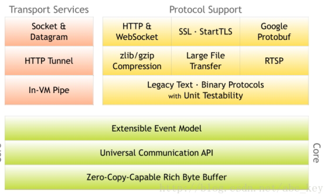  
Netty除了提供传输和协议，在其他各领域都有发展。Netty为开发者提供了一套完整的工具，看下面表格    

| Development Area | Netty Features                                                                                                                     |
| ---------------- | ---------------------------------------------------------------------------------------------------------------------------------- |
| 设计             | * 各种传输类型,阻塞和非阻塞套接字的统一的API  * 使用灵活 * 简单但功能强大的线程模型 * 无连接的DatagramSocket支持 * 链逻辑,易于重用 |
| 易于使用         | * 提供了大量的文档和例子 * 依赖1.6+                                                                                                |
| 性能             | * 比Java原生的API更好的吞吐量和更低的延迟 * 因为线程池和重用所有消耗较少的资源 * 尽量减少不必要的内存拷贝                          |
| 健壮性           | * 链接快或慢或超载不带导致更多的OutOfMemoryError  * 在高速的网络程序中不会有不公平的r/w                                            |
| 安全性           | * 完整的SSL/TLS和StartTLS支持,比原生的快                                                                                           |
## 1.2. 异步设计  
异步处理提倡更有效的使用资源，它允许你创建一个任务，当有事件发生时将获得通知并等待事件完成。这样就不会阻塞，不管事件完成与否都会及时返回，资源利用率更高，程序可以利用剩余的资源做一些其他的事情。    
一起工作或实现异步API的两个最常用的方法:回调和Futures
### 1.2.1. 回调
这种方式可以理解成c++中function< >或者JavaScript的方法传入    
简单Demo,这里举例Jdk8的FunctionalInterface
```
public class HelloWorld{
 
     public static void main(String []args){
        
        f(()->System.out.println("OK"));//传lambda表达式 一个匿名函数对应一个方法
        g(Math::random);
        f(A::f);//双冒号 即直接传方法参数 方法必须为静态方法
     }
     public static void f(VoidTest v){
         v.f();
     }
     public static void g(ReturnTest r){
         System.out.println(r.f());
     }
}
 
class A{
    public static void f(){
        System.out.println("a.f");
        
    }
}
/**
 * 可以声明FunctionalInterface注解或者不声明都起作用
 * 
 * /
@FunctionalInterface
interface ReturnTest{
    double f();
}
interface VoidTest{
    public void f();
}
```
### 1.2.2. Futures  
第二种技术是使用Futures。Futures是一个抽象的概念，它表示一个值，该值可能在某一点变得可用。一个Future要么获得计算完的结果，要么获得计算失败后的异常。Java在java.util.concurrent包中附带了Future接口，它使用Executor异步执行。例如下面的代码，每传递一个Runnable对象到ExecutorService.submit()方法就会得到一个回调的Future，你能使用它检测是否执行
完成。  
```
public class FutureExample {

public static void main(String[] args) throws Exception {
        ExecutorService executor = Executors.newCachedThreadPool();
        Runnable task1 = new Runnable() {
            @Override
            public void run() {
            //do something
            System.out.println("i am task1.....");
            }
        };
        Callable<Integer> task2 = new Callable<Integer>() {
            @Override
            public Integer call() throws Exception {
                //do something
                return new Integer(100);
            }
        };
        Future<?> f1 = executor.submit(task1);
        Future<Integer> f2 = executor.submit(task2);
        System.out.println("task1 is completed? " + f1.isDone());
        System.out.println("task2 is completed? " + f2.isDone());
        //waiting task1 completed
        while(f1.isDone()){
            System.out.println("task1 completed.");
            break;
        }
        //waiting task2 completed
        while(f2.isDone()){
            System.out.println("return value by task2: " + f2.get());
            break;
        }
    }

}
```
## 1.3. Java中的BIO与NIO
## 1.4. NIO的问题在Nety中是如何解决的
## 1.5. 总结
# 2. 第一款应用
TODO:
# 3. Netty组件和设计
## 3.1. Channel/EventLoop/ChannelFuture
TODO:
## 3.2. ChannelHandler和ChannelPipeline

# 4. ChannelHandler 和ChannelPipeline
本章主要解析的是Netty中的数据以及处理组件.  
这里ChannelPipeline作为ChannelHandler的容器(链式),实现了责任链模式.另外需要注意的是传输过程中的上下文传输类(ChannelHandlerContext,可以携带一些附属信息提供上下文)  
## 4.1. ChannelHandler家族
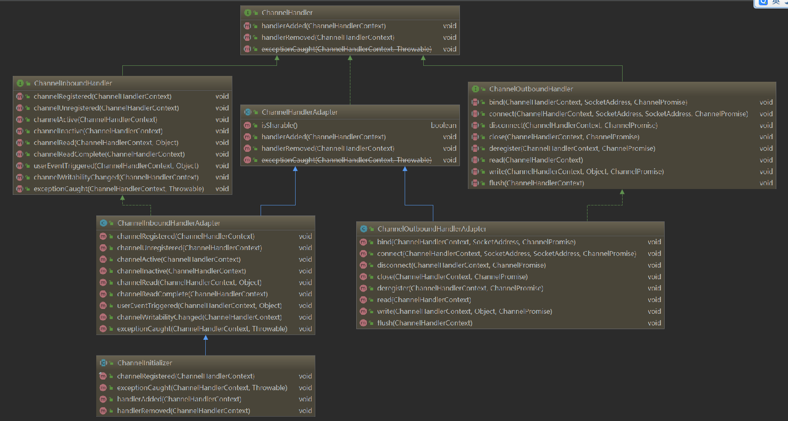  
### 4.1.1. Channel的生命周期  
Channel是对socket的一种抽象,因此它的生命周期基本上可以分为
ChannelRegistered->ChannelActive->ChannelInactive->ChannelUnregistered.  
这4种事件发生时都会被转发给ChannelPipeline中ChannelHandler(主要是ChannelInBoundHandler接口有对应的方法可以拦截到)

| 状态                | 描述                                                                       |
| ------------------- | -------------------------------------------------------------------------- |
| ChannelUnregistered | Channel 已经被创建，但还未注册到EventLoop                                  |
| ChannelRegistered   | Channel 已经被注册到了EventLoop                                            |
| ChannelActive       | Channel 处于活动状态（已经连接到它的远程节点）。它现在可以接收和发送数据了 |
| ChannelInactive     | Channel 没有连接到远程节点                                                 |

### 4.1.2. ChannelHandeler的生命周期  

| 方法            | 描述                                              |
| --------------- | ------------------------------------------------- |
| handlerAdded    | 当把ChannelHandler添加到ChannelPipeline中时被调用 |
| handlerRemoved  | 当从ChannelPipeline中移除ChannelHandler时被调用   |
| exceptionCaught | 当处理过程中在ChannelPipeline中有错误产生时被调用 |

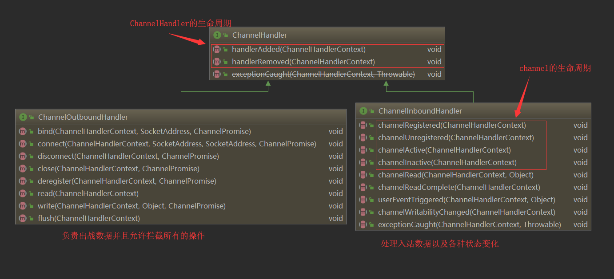  
### 4.1.3. ChannelInBoundhandler 接口
这些方法将会在数据被接收时或者与其对应的Channel专题发生改变时被调用  
当某个ChannelInboundHandler的实现重写channelRead()方法时,它将负责显式地释放和池化的ByteBuf实例相关的内存.Netty为此提供了一个实用方法ReferenceCountUtil.release().

如果不想每次自己释放引用计数,那么可以通过继承SimpleChannelInboundHandler来实现(覆盖ChannelRead0来实现)).    
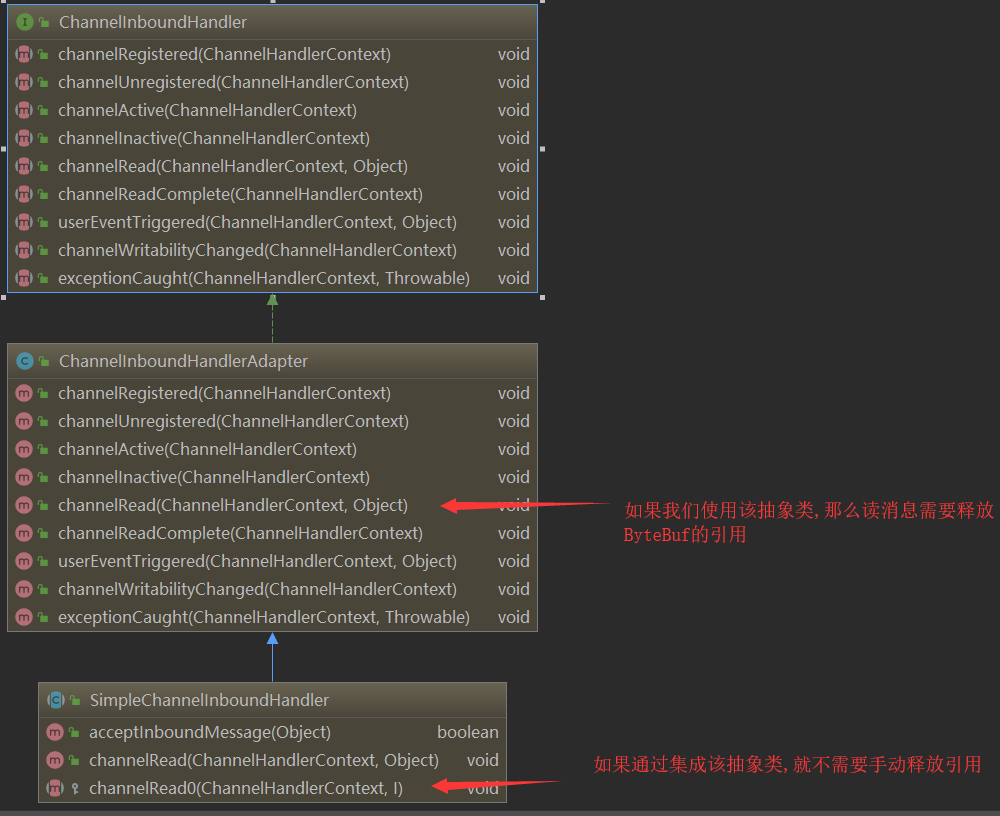  
### 4.1.4. ChannelOutboundHandler 接口  
出站操作和数据将由ChannelOutboundHandler 处理。它的方法将被Channel、Channel-
Pipeline 以及ChannelHandlerContext 调用。  
ChannelOutboundHandler 的一个强大的功能是可以按需推迟操作或者事件，这使得可
以通过一些复杂的方法来处理请求。例如，如果到远程节点的写入被暂停了，那么你可以推迟冲
刷操作并在稍后继续。  
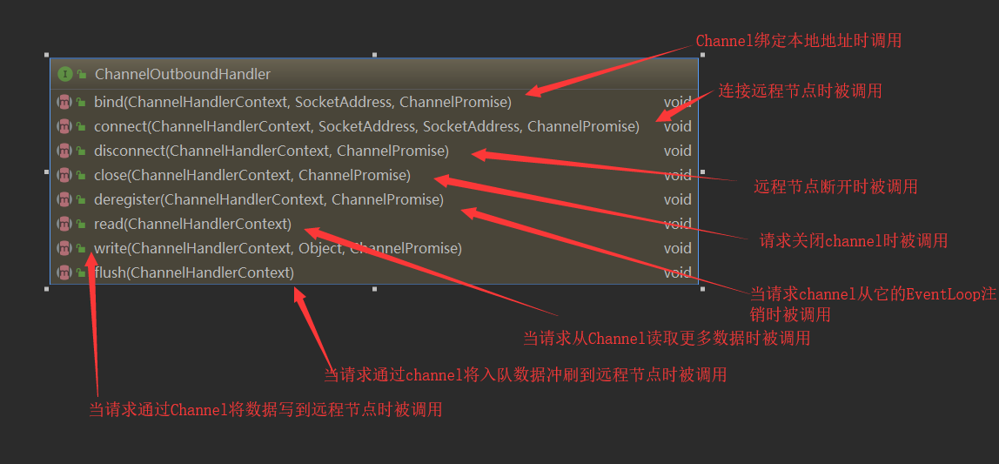  

ChannelPromise与ChannelFuture :ChannelOutboundHandler中的大部分方法都需要一个
ChannelPromise参数，以便在操作完成时得到通知。ChannelPromise是ChannelFuture的一个
子类，其定义了一些可写的方法，如setSuccess()和setFailure()，从而使ChannelFuture不
可变  
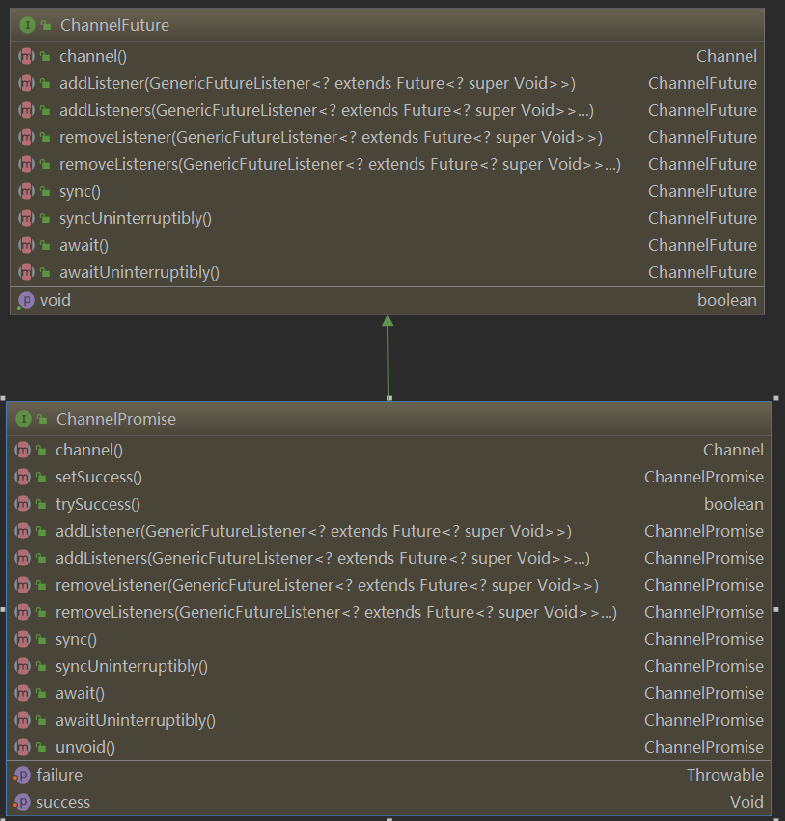  
### 4.1.5. 资源管理  
如果一个消息被消费或者丢弃了，并且没有传递给ChannelPipeline 中的下一个
ChannelOutboundHandler，那么用户就有责任调用ReferenceCountUtil.release()。
如果消息到达了实际的传输层，那么当它被写入时或者Channel 关闭时，都将被自动释放。  

特别对于ChannelOutboundHandlerAdapter,不仅要释放资源，还要通知ChannelPromise。否则可能会出现Channel-FutureListener 收不到某个消息已经被处理了的通知的情况。
## 4.2. ChannelPipeline接口
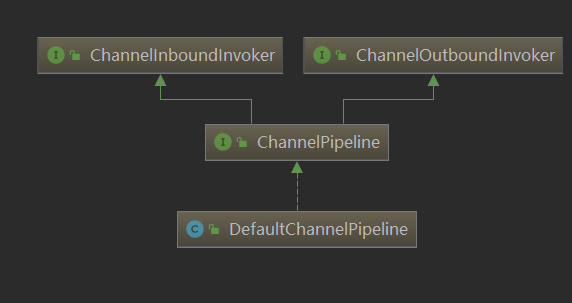
如果你认为ChannelPipeline是一个拦截流经Channel的入站和出站事件的Channel-
Handler 实例链，那么就很容易看出这些ChannelHandler 之间的交互是如何组成一个应用
程序数据和事件处理逻辑的核心的。  
每一个新创建的Channel 都将会被分配一个新的ChannelPipeline。这项关联是永久性
的；Channel 既不能附加另外一个ChannelPipeline，也不能分离其当前的。在Netty 组件
的生命周期中，这是一项固定的操作，不需要开发人员的任何干预。  
>>  ChannelHandlerContext:ChannelHandlerContext使得ChannelHandler能够和它的ChannelPipeline以及其他的ChannelHandler 交互。ChannelHandler 可以通知其所属的ChannelPipeline 中的下一个ChannelHandler，甚至可以动态修改它所属的ChannelPipeline  

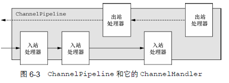  
展示了一个典型的同时具有入站和出站ChannelHandler 的ChannelPipeline 的布
局，并且印证了我们之前的关于ChannelPipeline 主要由一系列的ChannelHandler 所组成的
说法。ChannelPipeline 还提供了通过ChannelPipeline 本身传播事件的方法。如果一个入站
事件被触发，它将被从ChannelPipeline 的头部开始一直被传播到Channel Pipeline 的尾端。  
在ChannelPipeline 传播事件时，它会测试ChannelPipeline 中的下一个Channel-
Handler 的类型是否和事件的运动方向相匹配。如果不匹配，ChannelPipeline 将跳过该
ChannelHandler 并前进到下一个，直到它找到和该事件所期望的方向相匹配的为止。（当然，ChannelHandler 也可以同时实现ChannelInboundHandler 接口和ChannelOutbound-
Handler 接口。）  
### 4.2.1. 修改ChannelPipeline  
ChannelHandler 可以通过添加、删除或者替换其他的ChannelHandler 来实时地修改
ChannelPipeline 的布局。（它也可以将它自己从ChannelPipeline 中移除。）这是Channel-
Handler 最重要的能力之一
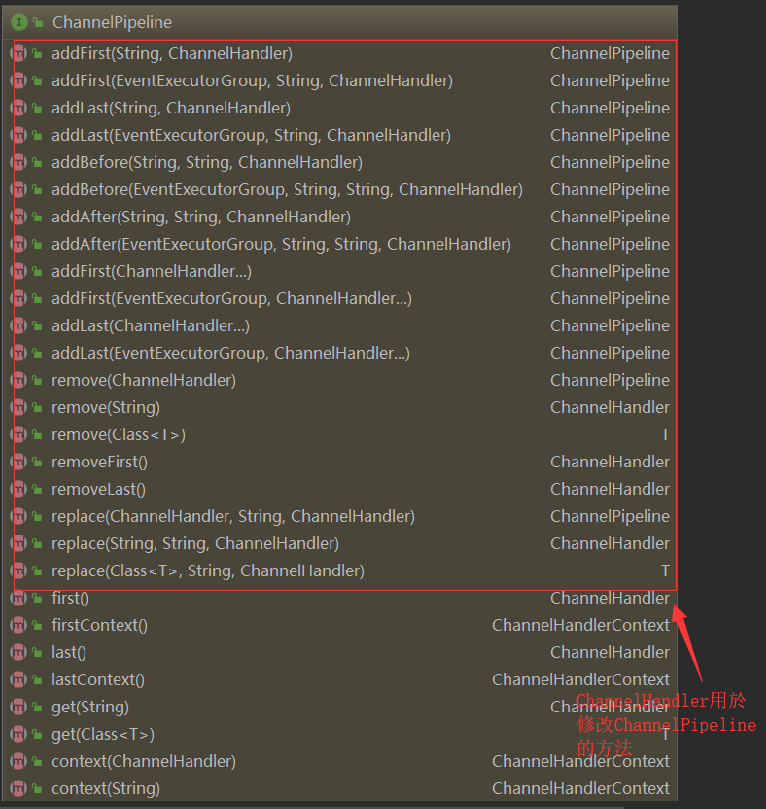  
另外一個能力就是可以访问ChannelHandler的接口  
| 方法    | 描述                                            |
| ------- | ----------------------------------------------- |
| get     | 通过类型或者名称返回ChannelHandler              |
| context | 返回和ChannelHandler绑定的ChannelHandlerContext |
| names   | 返回ChannelPipeline中所有ChannelHandler的名称   |

>>  ChannelHandler 的执行和阻塞
通常ChannelPipeline 中的每一个ChannelHandler 都是通过它的EventLoop（I/O 线程）来处理传递给它的事件的。所以至关重要的是不要阻塞这个线程，因为这会对整体的I/O 处理产生负面的影响。但有时可能需要与那些使用阻塞API 的遗留代码进行交互。对于这种情况，ChannelPipeline 有一些接受一个EventExecutorGroup 的add()方法。如果一个事件被传递给一个自定义的EventExecutor-Group，它将被包含在这个EventExecutorGroup 中的某个EventExecutor 所处理，从而被从该Channel 本身的EventLoop 中移除。对于这种用例，Netty 提供了一个叫DefaultEventExecutor-Group 的默认实现。  
### 4.2.2. 触发事件  
ChannelPipeline 的API 公开了用于调用入站和出站操作的附加方法.通过这些用于通知ChannelInboundHandler或ChannelOutboundHandler 在ChannelPipeline 中所发生的事件,主要通过两个父接口。    
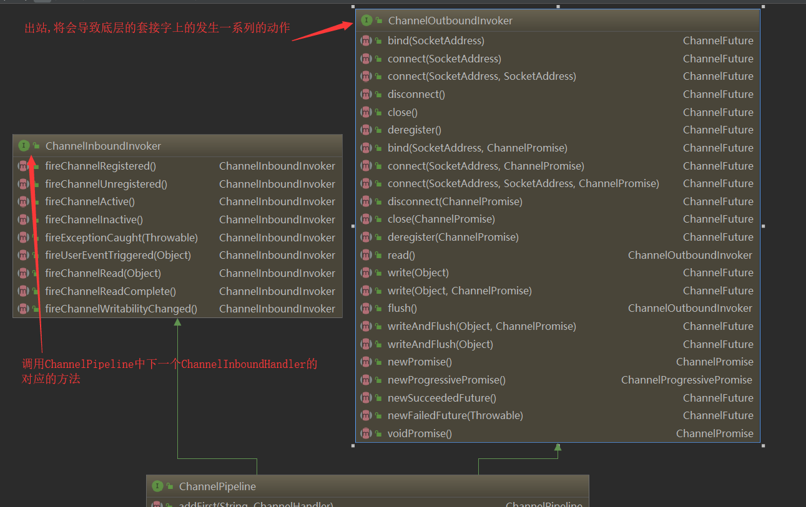
## 4.3. ChannelHandlerContext接口  
ChannelHandlerContext 代表了ChannelHandler 和ChannelPipeline 之间的关联，每当有ChannelHandler 添加到ChannelPipeline 中时，都会创建ChannelHandler-Context。ChannelHandlerContext 的主要功能是管理它所关联的ChannelHandler 和在同一个ChannelPipeline 中的其他ChannelHandler 之间的交互。  
ChannelHandlerContext 有很多的方法，其中一些方法也存在于Channel 和Channel-Pipeline 本身上，但是有一点重要的不同。如果调用Channel 或者ChannelPipeline 上的这些方法，它们将沿着整个ChannelPipeline 进行传播。而调用位于ChannelHandlerContext上的相同方法，则将从当前所关联的ChannelHandler 开始，并且只会传播给位于该ChannelPipeline 中的下一个能够处理该事件的ChannelHandler。  

| 方法              | 描述                                                                                                                                                                               |
| ----------------- | ---------------------------------------------------------------------------------------------------------------------------------------------------------------------------------- |
| alloc             | 返回和这个实例相关联的Channel所配置的ByteBufAllocator                                                                                                                              |
| bind              | 绑定到给定的SocketAddress,并返回ChannelFuture                                                                                                                                      |
| channel           | 返回绑定到这个实例的Channel                                                                                                                                                        |
| close             | 关闭Channel,并返回ChannelFuture                                                                                                                                                    |
| connect           | 连接给定的socketAddress,并返回ChannelFutrue                                                                                                                                        |
| executor          | 返回调度时间的EventExecutor                                                                                                                                                        |
| fireChannelActive | 触发对下一个ChannelInboundHandler上的channelActive()                                                                                                                               |
| fire系列          | 触发对下一个ChannelInboundHandler上的方法                                                                                                                                          |
| handler           | 返回当前ChannelHandler                                                                                                                                                             |
| pipeline          | 返回这个实例所关联的ChannelPipeline                                                                                                                                                |
| read              | 将数据从Channel读取到第一个入站缓冲区;如果读取成功则触发一个channelRead事件,并在最后一个消息被读取完成后通知channelInboundHandlerde channelReadComplete(ChannelHandlerContext)方法 |
| write             | 通过这个实例写入消息并经过ChannelPipeline                                                                                                                                          |
| writeAndFlush     | 通过这个实例写入并冲刷消息并经过ChannelPipeline                                                                                                                                    |

>>  当使用ChannelHandlerContext 的API 的时候，请牢记以下两点：
1. ChannelHandlerContext 和ChannelHandler 之间的关联（绑定）是永远不会改变的，所以缓存对它的引用是安全的；  
2. 如同我们在本节开头所解释的一样，相对于其他类的同名方法，ChannelHandler Context 的方法将产生更短的事件流，应该尽可能地利用这个特性来获得最大的性能。   

### 4.3.1. 使用ChannelHandlerContext  
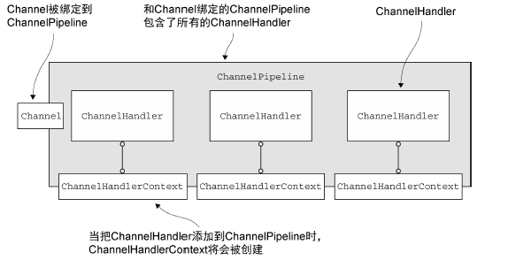  
需要注意的是如果使用ChannelHandlerContext的write方法,只会向下发,而channel,或者channelpipeline则会通过整个传播链  
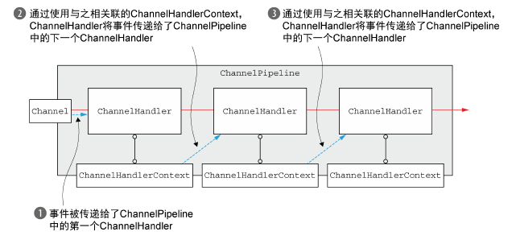  
## 4.4. 异常处理  
异常处理是任何真实应用程序的重要组成部分，它也可以通过多种方式来实现。因此，Netty提供了几种方式用于处理入站或者出站处理过程中所抛出的异常。这一节将帮助你了解如何设计最适合你需要的方式。  
### 4.4.1. 异常入站异常
如果在处理入站事件的过程中有异常被抛出，那么它将从它在ChannelInboundHandler里被触发的那一点开始流经ChannelPipeline。要想处理这种类型的入站异常，你需要在你的ChannelInboundHandler 实现中重写exectionCaught的方法。   
异常时关闭连接  
```
public class InboundExceptionHandler extends ChannelInboundHandlerAdapter {
    @Override
    public void exceptionCaught(ChannelHandlerContext ctx, Throwable cause) {
        cause.printStackTrace();
        ctx.close();
    }
}
```
因为异常将会继续按照入站方向流动（就像所有的入站事件一样），所以实现了前面所示逻辑的ChannelInboundHandler 通常位于ChannelPipeline 的最后。这确保了所有的入站异常都总是会被处理，无论它们可能会发生在ChannelPipeline 中的什么位置。  
你应该如何响应异常，可能很大程度上取决于你的应用程序。你可能想要关闭Channel（和连接），也可能会尝试进行恢复。如果你不实现任何处理入站异常的逻辑（或者没有消费该异常），那么Netty将会记录该异常没有被处理的事实   
>>总结一下：  
ChannelHandler.exceptionCaught()的默认实现是简单地将当前异常转发给ChannelPipeline 中的下一个ChannelHandler；    
如果异常到达了ChannelPipeline 的尾端，它将会被记录为未被处理；    
要想定义自定义的处理逻辑，你需要重写exceptionCaught()方法。然后你需要决定是否需要将该异常传播出去  

异常的默认行为:  
```
/**
     * Calls {@link ChannelHandlerContext#fireExceptionCaught(Throwable)} to forward
     * to the next {@link ChannelHandler} in the {@link ChannelPipeline}.
     *
     * Sub-classes may override this method to change behavior.
     */
    @Skip
    @Override
    @SuppressWarnings("deprecation")
    public void exceptionCaught(ChannelHandlerContext ctx, Throwable cause)
            throws Exception {
        ctx.fireExceptionCaught(cause);
    }
```
### 4.4.2. 异常出站异常  
用于处理出站操作中的正常完成以及异常的选项，都基于以下的通知机制。  
1.  每个出站操作都将返回一个ChannelFuture。注册到ChannelFuture 的Channel-FutureListener 将在操作完成时被通知该操作是成功了还是出错了。
2.  几乎所有的ChannelOutboundHandler 上的方法都会传入一个ChannelPromise的实例。作为ChannelFuture 的子类，ChannelPromise 也可以被分配用于异步通知的监听器。但是，ChannelPromise 还具有提供立即通知的可写方法：   
```
ChannelPromise setSuccess();
ChannelPromise setFailure(Throwable cause);
```
添加ChannelFutureListener 只需要调用ChannelFuture 实例上的addListener(ChannelFutureListener)方法，并且有两种不同的方式可以做到这一点。其中最常用的方式是，调用出站操作（如write()方法）所返回的ChannelFuture 上的addListener()方法。  
```
ChannelFuture future = channel.write(someMessage);
future.addListener(new ChannelFutureListener() {
    @Override
    public void operationComplete(ChannelFuture f) {
        if (!f.isSuccess()) {
            f.cause().printStackTrace();
            f.channel().close();
        }
    }
});
```
第二种方式是将ChannelFutureListener 添加到即将作为参数传递给ChannelOutboundHandler
的方法的ChannelPromise。  
```
public class OutboundExceptionHandler extends ChannelOutboundHandlerAdapter {
    @Override
    public void write(ChannelHandlerContext ctx, Object msg, ChannelPromise promise) {
        promise.addListener(new ChannelFutureListener() {
            @Override
            public void operationComplete(ChannelFuture f) {
                if (!f.isSuccess()) {
                    f.cause().printStackTrace();
                    f.channel().close();
                }
            }
        });
    }
}
```
>>  ChannelPromise 的可写方法通过调用ChannelPromise 上的setSuccess()和setFailure()方法，可以使一个操作的状态在ChannelHandler 的方法返回给其调用者时便即刻被感知到。  


