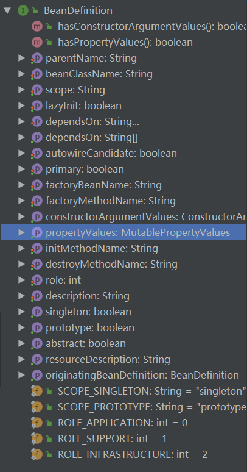
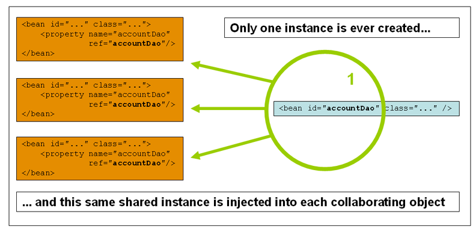
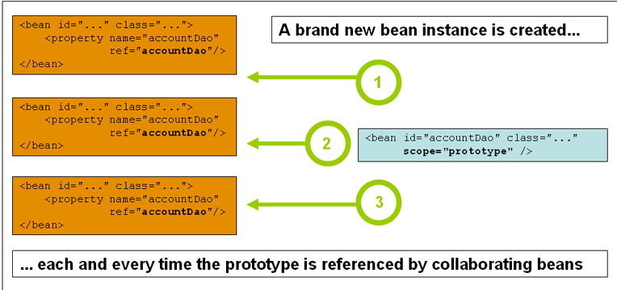
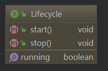
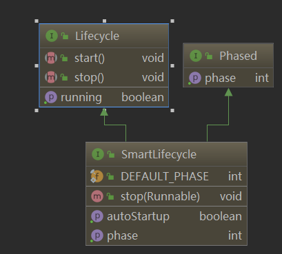
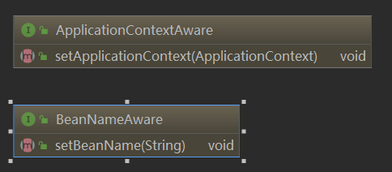

# 1. 概览
Spring可以轻松创建Java企业应用程序。它提供了在企业环境中使用Java语言所需的一切，支持Groovy和Kotlin作为JVM上的替代语言，并可根据应用程序的需要灵活地创建多种体系结构。从Spring Framework 5.0开始，Spring需要JDK 8+（Java SE 8+），并且已经为JDK 9提供了开箱即用的支持。  

The Spring Framework is divided into modules. Applications can choose which modules they need. At the heart are the modules of the core container, including a configuration model and a dependency injection mechanism. Beyond that, the Spring Framework provides foundational support for different application architectures, including messaging, transactional data and persistence, and web. It also includes the Servlet-based Spring MVC web framework and, in parallel, the Spring WebFlux reactive web framework.  
## 1.1. 历史和框架
Spring于2003年成立，是对早期J2EE规范复杂性的回应 。虽然有些人认为Java EE和Spring处于竞争中，但Spring实际上是对Java EE的补充。Spring编程模型不包含Java EE平台规范; 相反，它集成了EE保护伞中精心挑选的个别规格：  
*  Servlet API (JSR 340)   
*  WebSocket API (JSR 356)   
*  Concurrency Utilities (JSR 236)   
*  JSON Binding API (JSR 367)   
*  Bean Validation (JSR 303)   
*  JPA (JSR 338)   
*  JMS (JSR 914)   
*  as well as JTA/JCA setups for transaction coordination, if necessary.   

Spring Framework还支持依赖注入（JSR 330）和Common Annotations（JSR 250）规范，应用程序开发人员可以选择使用这些规范，而不是Spring Framework提供的Spring特定机制。  
从Spring Framework 5.0开始，Spring至少需要Java EE 7级别（例如Servlet 3.1 +，JPA 2.1+） - 同时在Java EE 8级别提供与新API的开箱即用集成（例如，Servlet 4.0，JSON绑定API）在运行时遇到。这使Spring与Tomcat 8和9，WebSphere 9和JBoss EAP 7完全兼容。  
随着时间的推移，Java EE在应用程序开发中的作用也在不断发展。在Java EE和Spring的早期，创建了应用程序以部署到应用程序服务器。今天，在Spring Boot的帮助下，应用程序以devops和云友好的方式创建，Servlet容器嵌入并且变得微不足道。从Spring Framework 5开始，WebFlux应用程序甚至不直接使用Servlet API，并且可以在不是Servlet容器的服务器（例如Netty）上运行。  
Spring继续创新并不断发展。除了Spring Framework之外，还有其他项目，例如Spring Boot，Spring Security，Spring Data，Spring Cloud，Spring Batch等。  
## 1.2. 设计理念
当您了解框架时，重要的是不仅要知道它的作用，还要了解它遵循的原则。以下是Spring Framework的指导原则：  
*  提供各个层面的选择。Spring允许您尽可能晚地推迟设计决策。例如，您可以通过配置切换持久性提供程序，而无需更改代码。许多其他基础架构问题以及与第三方API的集成也是如此。  
*  适应不同的观点。Spring拥抱灵活性，并不认为应该如何做。它以不同的视角支持广泛的应用需求。
*  保持强大的向后兼容性。Spring的演变经过精心设计，可以在版本之间进行一些重大改变。Spring支持精心挑选的JDK版本和第三方库，以便于维护依赖于Spring的应用程序和库。
*  关心API设计。Spring团队花了很多心思和时间来制作直观的API，这些API在很多版本和多年中都有用。
*  为代码质量设定高标准。Spring Framework强调有意义，最新且准确的Javadoc。它是极少数项目之一，可以声称干净的代码结构，包之间没有循环依赖。
## 1.3. 入门  
如果您刚刚开始使用Spring，您可能希望通过创建基于Spring Boot的应用程序来开始使用Spring Framework 。Spring Boot提供了一种快速（和固执己见）的方式来创建一个生产就绪的基于Spring的应用程序。它基于Spring Framework，支持约定优于配置，旨在帮助您尽快启动和运行。  

# 2. Core
其中最重要的是Spring Framework的控制反转（IoC）容器。Spring框架的IoC容器的全面处理紧随其后，全面覆盖了Spring的面向切面编程（AOP）技术。Spring Framework有自己的AOP框架，它在概念上易于理解，并且成功地解决了Java企业编程中AOP要求的80％最佳点。  
## 2.1. IOC容器
### 2.1.1. Spring IOC容器和Bean简介  
本章介绍了Spring Framework实现的控制反转（IoC）[ 1 ]原理。IoC也称为依赖注入（DI）。这是一个过程，通过这个过程，对象定义它们的依赖关系，即它们使用的其他对象，只能通过构造函数参数，工厂方法的参数，或者在构造或从工厂方法返回后在对象实例上设置的属性。 。然后容器 在创建bean时注入这些依赖项。这个过程基本上是相反的，因此称为控制反转（IoC），bean本身通过使用类的直接构造或诸如服务定位器模式之类的机制来控制其依赖关系的实例化或位置。  
在org.springframework.beans和org.springframework.context包是Spring框架的IoC容器的基础。该 BeanFactory 接口提供了一种能够管理任何类型对象的高级配置机制。 ApplicationContext 是一个BeanFactory的子类。它增加了与Spring的AOP功能的更容易的集成; 消息资源处理（用于国际化），事件发布; 和特定于应用程序层的上下文，例如WebApplicationContext 在Web应用程序中使用的上下文。  
简而言之，它BeanFactory提供了配置框架和基本功能，并ApplicationContext添加了更多特定于企业的功能。它ApplicationContext是完整的超集，BeanFactory在本章中仅用于Spring的IoC容器的描述。有关使用BeanFactory而不是ApplicationContext,引用 BeanFactory的更多信息。  
在Spring中，构成应用程序主干并由Spring IoC 容器管理的对象称为bean。bean是一个由Spring IoC容器实例化，组装和管理的对象。否则，bean只是应用程序中许多对象之一。Bean及其之间的依赖 关系反映在容器使用的配置元数据中。  
### 2.1.2. 容器概述   
该接口org.springframework.context.ApplicationContext代表Spring IoC容器，负责实例化，配置和组装上述bean。容器通过读取配置元数据获取有关要实例化，配置和组装的对象的指令。配置元数据以XML，Java注释或Java代码表示。它允许您表达组成应用程序的对象以及这些对象之间丰富的相互依赖性。  
Spring的开箱即用的几个ApplicationContext接口实现。在独立应用程序中，通常会创建一个ClassPathXmlApplicationContext 或的实例 FileSystemXmlApplicationContext。虽然XML一直是定义配置元数据的传统格式，但您可以通过提供少量XML配置来声明性地支持这些额外的元数据格式，从而指示容器使用Java注释或代码作为元数据格式。    
#### 2.1.2.1. 配置
这个配置元数据表示您作为应用程序开发人员如何告诉Spring容器在应用程序中实例化，配置和组装对象。  
常用的两种方式分别为配置文件(xml),java类(带Configuration中的Bean注解)
```
ApplicationContext context = new ClassPathXmlApplicationContext("services.xml", "daos.xml");
```
sevice.xml
```
<?xml version="1.0" encoding="UTF-8"?>
<beans xmlns="http://www.springframework.org/schema/beans"
    xmlns:xsi="http://www.w3.org/2001/XMLSchema-instance"
    xsi:schemaLocation="http://www.springframework.org/schema/beans
        https://www.springframework.org/schema/beans/spring-beans.xsd">

    <!-- services -->

    <bean id="petStore" class="org.springframework.samples.jpetstore.services.PetStoreServiceImpl">
        <property name="accountDao" ref="accountDao"/>
        <property name="itemDao" ref="itemDao"/>
        <!-- additional collaborators and configuration for this bean go here -->
    </bean>

    <!-- more bean definitions for services go here -->

</beans>
```
dao.xml
```
<?xml version="1.0" encoding="UTF-8"?>
<beans xmlns="http://www.springframework.org/schema/beans"
    xmlns:xsi="http://www.w3.org/2001/XMLSchema-instance"
    xsi:schemaLocation="http://www.springframework.org/schema/beans
        https://www.springframework.org/schema/beans/spring-beans.xsd">

    <bean id="accountDao"
        class="org.springframework.samples.jpetstore.dao.jpa.JpaAccountDao">
        <!-- additional collaborators and configuration for this bean go here -->
    </bean>

    <bean id="itemDao" class="org.springframework.samples.jpetstore.dao.jpa.JpaItemDao">
        <!-- additional collaborators and configuration for this bean go here -->
    </bean>

    <!-- more bean definitions for data access objects go here -->

</beans>
```
#### 2.1.2.2. 使用容器
```
// create and configure beans
ApplicationContext context = new ClassPathXmlApplicationContext("services.xml", "daos.xml");

// retrieve configured instance
PetStoreService service = context.getBean("petStore", PetStoreService.class);

// use configured instance
List<String> userList = service.getUsernameList();
```
### 2.1.3. Bean
Ioc容器管理器通过配置文件以及依赖关系生成beans.  
对于容器中的bean,spirng对其表述进行了BeanDifinition类的定义.主要包含的信息:类名,行为描述(scope,lifecycle callbacks等),相关的bean依赖,配置项信息(例如连接池大小等配置).   
 
| Property                 | Explained in…​           |
| ------------------------ | ------------------------ |
| Class                    | Instantiating Beans      |
| Name                     | Naming Beans             |
| Scope                    | Bean Scopes              |
| Constructor arguments    | Dependency Injection     |
| Properties               | Dependency Injection     |
| Autowiring mode          | Autowiring Collaborators |
| Lazy initialization mode | Lazy-initialized Beans   |
| Initialization method    | Initialization Callbacks |
| Destruction method       | Destruction Callbacks    |

    
除了包含有关如何创建特定bean的信息的bean定义之外，ApplicationContext实现还允许注册在容器外部（由用户）创建的现有对象。这是通过通过方法访问ApplicationContext的BeanFactory来完成的getBeanFactory()，该方法返回BeanFactory DefaultListableBeanFactory实现。DefaultListableBeanFactory 通过registerSingleton(..)和 registerBeanDefinition(..)方法支持此注册。但是，典型的应用程序只能与通过常规bean定义元数据定义的bean一起使用。  
>>  Bean元数据和手动提供的单例实例需要尽早注册，以便容器在自动装配和其他自省步骤中正确地推理它们。虽然在某种程度上支持覆盖现有元数据和现有单例实例，但官方不支持在运行时（与对工厂的实时访问同时）对新bean的注册，并且可能导致并发访问异常，bean容器中的状态不一致或都。

#### 2.1.3.1. bean 命名  
每个bean都有一个或多个标识,在容器中唯一,如果需要多个的话,可以考虑别名(aliases);  
命名约定,一般是类型名转驼峰-小写字母开头.如accountManager， accountService，userDao，loginController  
>>  通过在类路径中进行组件扫描，Spring会按照前面描述的规则为未命名的组件生成Bean名称：从本质上讲，采用简单的类名称并将其初始字符转换为小写。但是，在（不寻常的）特殊情况下，如果有多个字符并且第一个和第二个字符均为大写字母，则会保留原始大小写。这些规则与java.beans.Introspector.decapitalize（由Spring在此处使用）定义的规则相同。  
**别名定义**    
在bean定义本身中，可以通过使用由id属性指定的最多一个名称和该属性中任意数量的其他名称的组合来为bean提供多个名称name。这些名称可以是同一个bean的等效别名，并且在某些情况下很有用，例如通过使用特定于该组件本身的bean名称，让应用程序中的每个组件都引用一个公共依赖项。  
```
<alias name="fromName" alias="toName"/>
```
例如，子系统A的配置元数据可以使用的名称引用数据源subsystemA-dataSource。子系统B的配置元数据可以使用的名称引用数据源subsystemB-dataSource。组成使用这两个子系统的主应用程序时，主应用程序使用名称引用数据源myApp-dataSource。要使所有三个名称都引用相同的对象，可以将以下别名定义添加到配置元数据中：  
```
<alias name="myApp-dataSource" alias="subsystemA-dataSource"/>
<alias name="myApp-dataSource" alias="subsystemB-dataSource"/>
```
#### 2.1.3.2. bean实例化  
BeanDefinition 其实是对生成一个或者多个对象的方法的描述.容器使用元数据时,会通过BeanDefinition的描述来生成或者提供一个真实的对象.   
如果使用xml配置,那么会有一个class属性描述全限定类名,并且通过BeanDefinition的描述选择生成实例的方式,一般有两种,1 new  2工厂方法.  
**内部类名**    
如果你要为静态内部类提供一个bean描述,你讲不得不使用该内部类的二进制名称,例如如果你的类为com.example包下的SomeThing类,SomeThing类中有一个静态内部OtherThing,这时候OtherThing的类描述为com.example.SomeThing$OtherThing, 
>>请注意，名称中使用$字符将嵌套的类名与外部类名分开。 
方法一:构造实例化(一般会提供无参构造)    
```
<bean id="exampleBean" class="examples.ExampleBean"/>

<bean name="anotherExample" class="examples.ExampleBeanTwo"/>
```
方法二:静态工厂  
```
<bean id="clientService"
    class="examples.ClientService"
    factory-method="createInstance"/>
```
方法三:实例工厂 
```
<!-- the factory bean, which contains a method called createInstance() -->
<bean id="serviceLocator" class="examples.DefaultServiceLocator">
    <!-- inject any dependencies required by this locator bean -->
</bean>

<!-- the bean to be created via the factory bean -->
<bean id="clientService"
    factory-bean="serviceLocator"
    factory-method="createClientServiceInstance"/>
```


实例工厂的使用场景  
```
public class DefaultServiceLocator {

    private static ClientService clientService = new ClientServiceImpl();

    private static AccountService accountService = new AccountServiceImpl();

    public ClientService createClientServiceInstance() {
        return clientService;
    }

    public AccountService createAccountServiceInstance() {
        return accountService;
    }
}
```
配置
```
<bean id="serviceLocator" class="examples.DefaultServiceLocator">
    <!-- inject any dependencies required by this locator bean -->
</bean>

<bean id="clientService"
    factory-bean="serviceLocator"
    factory-method="createClientServiceInstance"/>

<bean id="accountService"
    factory-bean="serviceLocator"
    factory-method="createAccountServiceInstance"/>
```

### 2.1.4. 依赖  
典型的企业应用程序不由单个对象（或Spring术语中的bean）组成。即使是最简单的应用程序，也有一些对象可以协同工作，以呈现最终用户视为一致的应用程序。下一部分将说明如何从定义多个独立的bean定义到实现对象协作以实现目标的完全实现的应用程序。  
#### 2.1.4.1. 依赖注入  
依赖注入（DI）是一个过程，通过该过程，对象仅通过构造函数参数，工厂方法的参数或在构造或创建对象实例后在对象实例上设置的属性来定义其依赖关系（即，与它们一起工作的其他对象）。从工厂方法返回。然后，容器在创建bean时注入那些依赖项。此过程从根本上讲是通过使用类的直接构造或服务定位器模式来控制bean自身依赖关系的实例化或位置的bean本身的逆过程（因此称为Control Inversion）。  
使用DI原理，代码更加简洁，当为对象提供依赖项时，去耦会更有效。该对象不查找其依赖项，并且不知道依赖项的位置或类。结果，您的类变得更易于测试，尤其是当依赖项依赖于接口或抽象基类时，它们允许在单元测试中使用存根或模拟实现。   
**构造注入**  
基于构造函数的DI是通过容器调用具有多个参数的构造函数来完成的，每个参数表示一个依赖项。调用static带有特定参数的工厂方法来构造Bean几乎是等效的，并且本次讨论将构造函数和static工厂方法的参数视为类似。以下示例显示了只能通过构造函数注入进行依赖项注入的类：  
>>  构造函数参数解析:构造函数参数解析匹配通过使用参数的类型进行。如果Bean定义的构造函数参数中不存在潜在的歧义，则在实例化Bean时，在Bean定义中定义构造函数参数的顺序就是将这些参数提供给适当的构造函数的顺序。考虑以下类别：  
```
<beans>
    <bean id="beanOne" class="x.y.ThingOne">
        <constructor-arg ref="beanTwo"/>
        <constructor-arg ref="beanThree"/>
    </bean>

    <bean id="beanTwo" class="x.y.ThingTwo"/>

    <bean id="beanThree" class="x.y.ThingThree"/>
</beans>
```

构造函数参数类型匹配  
```
<bean id="exampleBean" class="examples.ExampleBean">
    <constructor-arg type="int" value="7500000"/>
    <constructor-arg type="java.lang.String" value="42"/>
</bean>
```
构造函数参数索引  
```
<bean id="exampleBean" class="examples.ExampleBean">
    <constructor-arg index="0" value="7500000"/>
    <constructor-arg index="1" value="42"/>
</bean>
```
构造函数基于名称  
```
<bean id="exampleBean" class="examples.ExampleBean">
    <constructor-arg name="years" value="7500000"/>
    <constructor-arg name="ultimateAnswer" value="42"/>
</bean>  

package examples;

public class ExampleBean {

    // Fields omitted

    @ConstructorProperties({"years", "ultimateAnswer"})
    public ExampleBean(int years, String ultimateAnswer) {
        this.years = years;
        this.ultimateAnswer = ultimateAnswer;
    }
}
```
**Setter注入**    
基于设置器的DI是通过在调用无参数构造函数或无参数static工厂方法以实例化您的bean 之后，在您的bean上调用setter方法来完成的。  
Spring官方推荐构造注入,因为可以提前生成,防止null的情况,但是对于Setter注入更为灵活,因为setter方法可以使该类可以重新配置,和重新注入.  
**依赖性解析过程**  
依赖解析的过程如下:  
* ApplicationContext通过配置类或者XML或者注解进行生成或初始化所有的beans.  
* 当bean在真实生成过程中,其属性,构造参数还有静态工厂方法(如果没有默认构造)提供这些依赖信息
* 每个属性或构造函数参数都是要设置的值的实际定义，或者是对容器中另一个bean的引用。
* 每个值的属性或构造函数参数都将从其指定的格式转换为该属性或构造函数参数的实际类型。默认情况下，Spring可以将以字符串格式提供的值转换为所有内置类型，例如int，long，String，boolean等。  

Spring 容器会校验配置中所有bean的生成,但是bean中的属性直到真正生成后还没有设置,创建容器时，将创建具有单例作用域并设置为预先实例化（默认）的Bean。 否则，仅在请求时才创建Bean .创建和分配bean的依赖关系及其依赖关系（依此类推）时，创建bean可能会导致创建一个bean图。 注意,在匹配不到时可能会创建的晚一些,也就是说在第一次创建时受影响.  

 **循环依赖**  
如果你主要是通过构造注入,那么你可能会产线一个不能解决的循环依赖问题.(会产生BeanCurrentylyInCreationException)    
差不多的解决方案就是两个都是构造注入的循环依赖场景是无法解决的,可以通过Setter注入解决的.  
根据bean的生成图的过程中,有一个map保存正在生成的bean,完成后就会放入单例池中.后期再调用setter注入的那部分程序.  


 https://docs.spring.io/spring/docs/5.2.0.RELEASE/spring-framework-reference/core.html#beans-dependency-resolution
#### 2.1.4.2. 依赖以及配置细节  
需要注意的是基本上都是基于字符串的配置,所以官网推荐使用IDEA,或者Spring Tool 这样的ide防止低级错误.  
常用的配置中主要需要关注集合的配置.
```
List Set  ->List 
map ,propes -> map
```
**p命名空间-setter注入的简化**  
可以做简化 
```
<beans xmlns="http://www.springframework.org/schema/beans"
    xmlns:xsi="http://www.w3.org/2001/XMLSchema-instance"
    xmlns:p="http://www.springframework.org/schema/p"
    xsi:schemaLocation="http://www.springframework.org/schema/beans
        https://www.springframework.org/schema/beans/spring-beans.xsd">

    <bean name="john-classic" class="com.example.Person">
        <property name="name" value="John Doe"/>
        <property name="spouse" ref="jane"/>
    </bean>

    <bean name="john-modern"
        class="com.example.Person"
        p:name="John Doe"
        p:spouse-ref="jane"/>

    <bean name="jane" class="com.example.Person">
        <property name="name" value="Jane Doe"/>
    </bean>
</beans>
```
**c命名空间**  
```
<beans xmlns="http://www.springframework.org/schema/beans"
    xmlns:xsi="http://www.w3.org/2001/XMLSchema-instance"
    xmlns:c="http://www.springframework.org/schema/c"
    xsi:schemaLocation="http://www.springframework.org/schema/beans
        https://www.springframework.org/schema/beans/spring-beans.xsd">

    <bean id="beanTwo" class="x.y.ThingTwo"/>
    <bean id="beanThree" class="x.y.ThingThree"/>

    <!-- traditional declaration with optional argument names -->
    <bean id="beanOne" class="x.y.ThingOne">
        <constructor-arg name="thingTwo" ref="beanTwo"/>
        <constructor-arg name="thingThree" ref="beanThree"/>
        <constructor-arg name="email" value="something@somewhere.com"/>
    </bean>

    <!-- c-namespace declaration with argument names -->
    <bean id="beanOne" class="x.y.ThingOne" c:thingTwo-ref="beanTwo"
        c:thingThree-ref="beanThree" c:email="something@somewhere.com"/>

</beans>
```
#### 2.1.4.3. 使用依赖
对于某些依赖性弱的需求,比如某个bean必须在另一个bean之前初始化,但是该bean又不需要其注入,那么这时候spring提供了depends-on来指定生成顺序.例如数据库的驱动.  
```
<bean id="beanOne" class="ExampleBean" depends-on="manager"/>
<bean id="manager" class="ManagerBean" />
```
```
<bean id="beanOne" class="ExampleBean" depends-on="manager,accountDao">
    <property name="manager" ref="manager" />
</bean>

<bean id="manager" class="ManagerBean" />
<bean id="accountDao" class="x.y.jdbc.JdbcAccountDao" />
```
>>根据一般构造与析构(c++用语)的对称性,使用depends-on也可以用于指定销毁的顺序.    
#### 2.1.4.4. 懒加载的Beans  
对于ApplicationContext中的容器对象,一般都是使用饿汉式的方式加载内部的单例对象,如果有特殊需求可以添加bean标签中的lazy-init属性为true来使其懒加载.当然,也可以取消何种默认的方式.  
```
<bean id="lazy" class="com.something.ExpensiveToCreateBean" lazy-init="true"/>
<bean name="not.lazy" class="com.something.AnotherBean"/>
```
```
<bean id="lazy" class="com.something.ExpensiveToCreateBean" lazy-init="true"/>
<bean name="not.lazy" class="com.something.AnotherBean"/>
```
#### 自动装配器
Spring 容器可以自动协调bean之间的关系.也就是通过ApplicationContext接口的方式来进行自动管理.  
自动装配有以下优点:  
1. 自动装配可以大大减少属性或者构造参数的指定.  
2. 自动装配可以随着你对象的修改,自动更新.  

实现方式:xml的配置通过依赖注入实现,注解是通过autowire实现.  
**从自动装配中排除Bean**  
在每个bean的基础上，您可以从自动装配中排除一个bean。使用Spring的XML格式，将元素的autowire-candidate属性设置<bean/>为false。容器使特定的bean定义对自动装配基础结构不可用（包括诸如的注释样式配置@Autowired）。  
#### 方法注入 
有时候需要这样的场景:一个单例或者非单例的bean,需要与另外一个非单例的bean协作.  
方案1:  
放弃使用控制反转,通过实现ApplicationContextAware的接口,   
```
public class CommandManager implements ApplicationContextAware {

    private ApplicationContext applicationContext;

    public Object process(Map commandState) {
        // grab a new instance of the appropriate Command
        Command command = createCommand();
        // set the state on the (hopefully brand new) Command instance
        command.setState(commandState);
        return command.execute();
    }

    protected Command createCommand() {
        // notice the Spring API dependency!
        return this.applicationContext.getBean("command", Command.class);
    }

    public void setApplicationContext(
            ApplicationContext applicationContext) throws BeansException {
        this.applicationContext = applicationContext;
    }
}
```
**lookup 方法注入**    
spring方法注入  
```
package fiona.apple;

// no more Spring imports!

public abstract class CommandManager {

    public Object process(Object commandState) {
        // grab a new instance of the appropriate Command interface
        Command command = createCommand();
        // set the state on the (hopefully brand new) Command instance
        command.setState(commandState);
        return command.execute();
    }

    // okay... but where is the implementation of this method?
    protected abstract Command createCommand();
}

底层通过cglib的动态代理实现  
<!-- a stateful bean deployed as a prototype (non-singleton) -->
<bean id="myCommand" class="fiona.apple.AsyncCommand" scope="prototype">
    <!-- inject dependencies here as required -->
</bean>

<!-- commandProcessor uses statefulCommandHelper -->
<bean id="commandManager" class="fiona.apple.CommandManager">
    <lookup-method name="createCommand" bean="myCommand"/>
</bean>
```
基于注解的方式  
```
public abstract class CommandManager {

    public Object process(Object commandState) {
        Command command = createCommand();
        command.setState(commandState);
        return command.execute();
    }

    @Lookup("myCommand")
    protected abstract Command createCommand();
}
```
**其他任意方法的替换**  
其实有了动态代理没有什么是不可能的了.  
```
/**
 * meant to be used to override the existing computeValue(String)
 * implementation in MyValueCalculator
 */
public class ReplacementComputeValue implements MethodReplacer {

    public Object reimplement(Object o, Method m, Object[] args) throws Throwable {
        // get the input value, work with it, and return a computed result
        String input = (String) args[0];
        ...
        return ...;
    }
}
```

```
<bean id="myValueCalculator" class="x.y.z.MyValueCalculator">
    <!-- arbitrary method replacement -->
    <replaced-method name="computeValue" replacer="replacementComputeValue">
        <arg-type>String</arg-type>
    </replaced-method>
</bean>

<bean id="replacementComputeValue" class="a.b.c.ReplacementComputeValue"/>
```
### Bean Scopes  
SpringBean的Scopes有六种作用域,其中第四种只有使用web时才会使用    

| cope        | Description                                                                                                                                                                                                                                                |
| ----------- | ---------------------------------------------------------------------------------------------------------------------------------------------------------------------------------------------------------------------------------------------------------- |
| singleton   | (Default) Scopes a single bean definition to a single object instance for each Spring IoC container.                                                                                                                                                       |
| prototype   | Scopes a single bean definition to any number of object instances.                                                                                                                                                                                         |
| request     | Scopes a single bean definition to the lifecycle of a single HTTP request. That is, each HTTP request has its own instance of a bean created off the back of a single bean definition. Only valid in the context of a web-aware Spring ApplicationContext. |
| session     | Scopes a single bean definition to the lifecycle of an HTTP Session. Only valid in the context of a web-aware Spring ApplicationContext.                                                                                                                   |
| application | Scopes a single bean definition to the lifecycle of a ServletContext. Only valid in the context of a web-aware Spring ApplicationContext.                                                                                                                  |
| websocket   | Scopes a single bean definition to the lifecycle of a WebSocket. Only valid in the context of a web-aware Spring ApplicationContext.                                                                                                                       |
####  Singleton Scope
  

```
<bean id="accountService" class="com.something.DefaultAccountService"/>

<!-- the following is equivalent, though redundant (singleton scope is the default) -->
<bean id="accountService" class="com.something.DefaultAccountService" scope="singleton"/>
```
####  Prototyp Scope  
bean部署的非单例原型范围导致在每次发出对特定bean的请求时创建一个新的bean实例。也就是说，bean被注入到另一个bean中，或者您通过容器上的getBean()方法调用请求它。通常，您应该为所有有状态bean使用原型范围，为无状态bean使用单例范围。  
  
通常不将数据访问对象配置为原型，因为典型的DAO不包含任何会话状态。我们更容易重用单例图的核心。  
```
<bean id="accountService" class="com.something.DefaultAccountService" scope="prototype"/>
```
与其他作用域不同，Spring不管理原型bean的完整生命周期。容器实例化、配置或以其他方式组装原型对象并将其交给客户机，而不需要该原型实例的进一步记录。因此，尽管初始化生命周期回调方法在所有对象上都被调用，而与范围无关，但是在原型的情况下，配置的销毁生命周期回调不会被调用。客户机代码必须清理原型作用域的对象，并释放原型bean持有的昂贵资源。 为了让Spring容器释放原型作用域bean所持有的资源，可以尝试使用一个自定义bean后处理器，它持有一个需要清理的bean引用。   
####  具有prototype的单例scope   
当您使用对原型Bean有依赖性的单例作用域Bean时，请注意，依赖性在实例化时已解决。因此，如果您将依赖范围的原型范围的bean注入到单例范围的bean中，则将实例化新的原型bean，然后将依赖项注入到该singleton Bean中。原型实例是曾经提供给单例范围的bean的唯一实例。  
但是，假设您希望单例作用域的bean在运行时重复获取原型作用域的bean的新实例。您不能将原型作用域的bean依赖项注入到您的单例bean中，因为当Spring容器实例化单例bean并解析并注入其依赖项时，该注入仅发生一次。如果在运行时不止一次需要原型bean的新实例，请参见方法注入。  
####  Request, Session, Application, and WebSocket Scopes  
在request，session，application，和websocket范围只有当你使用一个基于web的Spring可ApplicationContext实现（例如 XmlWebApplicationContext）。如果您将这些作用域与常规的Spring IoC容器（例如）一起使用ClassPathXmlApplicationContext，IllegalStateException则会抛出抱怨未知bean作用域的。  
**初始化web配置**   
为了在请求、会话、应用程序和websocket级别(web范围的bean)上支持bean的作用域，需要在定义bean之前进行一些小的初始配置。(标准范围:单例和原型不需要这个初始设置。)  
如何完成这个初始设置取决于特定的Servlet环境。  
如果您实际上在Spring Web MVC中访问由Spring DispatcherServlet处理的请求中的 Scope Bean，则不需要特殊的设置。 DispatcherServlet已经公开了所有相关状态。  
如果你使用的是2.5 servlet 的web容器. 并且在Spring的DispatcherServlet之外进行处理(如JSF,Struct)  ,那么你就需要注册监听器到web中(org.springframework.web.context.request.RequestContextListener ServletRequestListener)  如果你已经使用servlet 3.0那么你只需要实现那个WebApplicationInitializer接口即可.  
```
<web-app>
    ...
    <listener>
        <listener-class>
            org.springframework.web.context.request.RequestContextListener
        </listener-class>
    </listener>
    ...
</web-app>
```
还有一种方式是使用过滤器的方式  
```
<web-app>
    ...
    <filter>
        <filter-name>requestContextFilter</filter-name>
        <filter-class>org.springframework.web.filter.RequestContextFilter</filter-class>
    </filter>
    <filter-mapping>
        <filter-name>requestContextFilter</filter-name>
        <url-pattern>/*</url-pattern>
    </filter-mapping>
    ...
</web-app>
```
DispatcherServlet，RequestContextListener和RequestContextFilter都做完全相同的事情，即将HTTP请求对象绑定到为该请求提供服务的Thread。这使得在request 和session scope的bean可以在调用链的更下游使用。  
**Request scope**  
```
<bean id="loginAction" class="com.something.LoginAction" scope="request"/>
```
通过为每个HTTP请求使用LoginAction bean定义，Spring容器创建了LoginAction bean的新实例。也就是说，loginAction bean的作用域在HTTP请求级别。您可以随意更改创建的实例的内部状态，因为从相同的loginAction bean定义创建的其他实例在状态中看不到这些更改。它们是针对单个请求的。当请求完成处理时，作用域为请求的bean被丢弃。  
当使用注释驱动的组件或Java配置时，@ RequestScope注释可用于将组件分配给请求范围。以下示例显示了如何执行此操作：  
```
@RequestScope
@Component
public class LoginAction {
    // ...
}
```
**Session Scope**  
```
<bean id="userPreferences" class="com.something.UserPreferences" scope="session"/>
```
Spring容器通过为单个HTTP会话的生命周期使用UserPreferences bean定义来创建UserPreferences bean的新实例。换句话说，userPreferences bean有效地限定在HTTP会话级别。与请求范围内bean一样,你可以改变内部状态的实例创建尽可能多的你想要的,知道其他HTTP会话实例也使用相同的实例创建userPreferences bean定义看不到这些变化状态,因为他们是特定于一个单独的HTTP会话。当HTTP会话最终被丢弃时，作用域为该特定HTTP会话的bean也被丢弃。  
**Application Scope**  
```
<bean id="appPreferences" class="com.something.AppPreferences" scope="application"/>
```
Spring容器AppPreferences通过appPreferences对整个Web应用程序使用Bean定义一次来创建Bean 的新实例。也就是说， appPreferencesbean的作用域在该ServletContext级别，并存储为常规 ServletContext属性。这有点类似于Spring单例bean，但有两个重要的区别：它是每个ServletContext而不是每个Spring'ApplicationContext' 的单例（在任何给定的Web应用程序中可能都有多个），并且实际上是公开的，因此可见作为一个ServletContext attribute.  
注解方式  
```
@ApplicationScope
@Component
public class AppPreferences {
    // ...
}
```
**Scoped Bean 作为依赖**  
Spring IoC容器不仅管理对象（bean）的实例化，而且还管理协作者（或依赖项）的关联。如果要将（例如）HTTP请求范围的Bean注入（例如）另一个作用域更长的Bean，则可以选择注入AOP代理来代替作用域的Bean.   
>>   您还可以在范围为单例的bean之间使用<aop：scoped-proxy />，然后引用通过可序列化的中间代理进行处理，因此能够在反序列化时重新获得目标单例bean。  
 当针对范围原型的bean声明<aop：scoped-proxy />时，共享代理上的每个方法调用都会导致创建新的目标实例，然后将该调用转发到该目标实例  

 实现方式   
```
<?xml version="1.0" encoding="UTF-8"?>
<beans xmlns="http://www.springframework.org/schema/beans"
    xmlns:xsi="http://www.w3.org/2001/XMLSchema-instance"
    xmlns:aop="http://www.springframework.org/schema/aop"
    xsi:schemaLocation="http://www.springframework.org/schema/beans
        https://www.springframework.org/schema/beans/spring-beans.xsd
        http://www.springframework.org/schema/aop
        https://www.springframework.org/schema/aop/spring-aop.xsd">

    <!-- an HTTP Session-scoped bean exposed as a proxy -->
    <bean id="userPreferences" class="com.something.UserPreferences" scope="session">
        <!-- instructs the container to proxy the surrounding bean -->
        <aop:scoped-proxy/> 
    </bean>

    <!-- a singleton-scoped bean injected with a proxy to the above bean -->
    <bean id="userService" class="com.something.SimpleUserService">
        <!-- a reference to the proxied userPreferences bean -->
        <property name="userPreferences" ref="userPreferences"/>
    </bean>
</beans>
```
>> 需要注意,如果不添加scoped-proxy的话,userService是单例的,它的实例只会生成一次,并且也只会注入一次userPreferces,那么使用时永远只是使用相同的userPreferences.
####  自定义Scope 
bean作用域机制是可扩展的。您可以定义自己的作用域，甚至可以重新定义现有的作用域，尽管后者被认为是不好的实践，并且您不能覆盖内置的单例和原型作用域。  
TODO:
### Bean的特性  
Spring 提供了许多接口,用于描述Bean的属性,比如生命周期回调,ApplicationContext的绑定,以及其他的绑定接口
####  生命周期回调  
主要通过三种方式进行实现
1. 实现接口的方式  
InitializingBean and DisposableBean的接口
  
2. 注解的方式
主要使用@PreDestory,@PostConstruct的方法.  

3. xml中提供init,destory的方法指定

**启动和关闭回调**  
```
public interface Lifecycle {

    void start();

    void stop();

    boolean isRunning();
}
```
  
任何一个Spring管理的对象都有可能实现了Lifecycl接口,因此当ApplicationContext接收到开启和停止信号时,会调用与其级联的Lifecycle方法.当然是通过其子接口LifecycleProcessor实现  
```
public interface LifecycleProcessor extends Lifecycle {

    void onRefresh();

    void onClose();
}
```
>> 请注意，常规的org.springframework.context.Lifecycle接口是用于显式启动和停止通知的普通接口，并不意味着在上下文刷新时自动启动.因此为了对特定bean的自动启动（包括启动阶段）进行细粒度的控制，请考虑改为实现org.springframework.context.SmartLifecycle。另外，请注意，不能保证会在销毁之前发出停止通知。在常规关闭时，在传播常规销毁回调之前，所有Lifecycle bean首先都会收到停止通知。但是，在上下文生命周期内进行热刷新或刷新尝试失败时，仅调用destroy方法。  

  
```
public interface SmartLifecycle extends Lifecycle, Phased {

    boolean isAutoStartup();

    void stop(Runnable callback);
}
```
该接口SmartLifecycle是对生命周期粒度进行更细控制,从级别Integer.MIN_VALUE->Integer.MAX_VALUE,默认的Phased为0.越低越先执行.  
例如以下描述表示每隔过程不能超过10000微妙,默认的为30s.
```
<bean id="lifecycleProcessor" class="org.springframework.context.support.DefaultLifecycleProcessor">
    <!-- timeout value in milliseconds -->
    <property name="timeoutPerShutdownPhase" value="10000"/>
</bean>
```
**在非Web应用中优雅的关闭IOC容器**  
>>  本节仅适用于非Web应用程序。 Spring的基于Web的ApplicationContext实现已经具有适当的代码，可以在相关的Web应用程序关闭时正常关闭Spring IoC容器。  
如果您在非Web应用程序环境中（例如，在富客户端桌面环境中）使用Spring的IoC容器，请向JVM注册一个关闭钩子。这样做可以确保正常关机，并在您的Singleton bean上调用相关的destroy方法，以便释放所有资源。您仍然必须正确配置和实现这些destroy回调。  
```
import org.springframework.context.ConfigurableApplicationContext;
import org.springframework.context.support.ClassPathXmlApplicationContext;

public final class Boot {

    public static void main(final String[] args) throws Exception {
        ConfigurableApplicationContext ctx = new ClassPathXmlApplicationContext("beans.xml");

        // add a shutdown hook for the above context...
        ctx.registerShutdownHook();

        // app runs here...

        // main method exits, hook is called prior to the app shutting down...
    }
}
```
#### ApplicationContextAware和BeanNameAware  
  

**BeanNameAware调用时机**  

在填充正常的bean属性之后，但在初始化回调（例如InitializingBean，afterPropertiesSet或自定义init-method）之前，调用该回调。
# 3. Testing

# 4. Data Access

# 5. WebServlet

# 6. WebReactive

# 7. Integration

# 8. Langurage

# 9. 注意点
1. beanfacotry 懒加载  applicationContext一次加载单例的所有
2. ioc三种注入方式:构造,set以及其变种,注解
3. 对象的声明(bean): 构造,静态工厂,实例工厂
4. Component父类注解以及repository,service,Controller,不写value的值即为短类名的驼峰表示法
5. 注入注解:autowared按照类型,如果歧义则按照属性名称找id,Qualifier在属性上需要与autowared配合指定id(在方法上可以单独使用,常见使用配置类的传参),resource注解需要指定id.
6. 新注解:import注解导入配置类,propertySource(4.3之前需要先声明bean-propertySourcePlaceHolderConfiger),bean,configuration,componentScan
7. spring junit整合,(本质junit的Test注解只是封装了main函数),包,@RunWith(SpringJUnit4ClassRunner.class)+@ContextConfiguration(classes = )/@ContextConfiguration(locations = )即可
8. 动态代理1,jdk方案  
>>   jdk属于官方的代理方案,基于接口实现,具体使用时需要Proxy.newInstance()
9.   动态代理2,cglib方案  
>>   需要一个被代理类不能为final的,基于子类的一种实现,需要Enhance.create(class,callback),其中需要写callback的接口实现,一般实现callback的子接口(MethodInterceptor), 其中的参数多了一个proxyMethod,使用方法相同.  
