来源:传智播客
# 1. spring 简介
## 1.1. 介绍
Spring是分层的Java SE/EE应用 full-stack轻量级开源框架，以IoC（Inverse Of Control：反转控制）和AOP（Aspect Oriented Programming：面向切面编程）为内核，提供了展现层Spring MVC和持久层Spring JDBC以及业务层事务管理等众多的企业级应用技术，还能整合开源世界众多著名的第三方框架和类库，逐渐成为使用最多的Java EE企业应用开源框架。 
### 1.1.1. 优势
**方便解耦，简化开发**     
	通过Spring提供的IoC容器，可以将对象间的依赖关系交由Spring进行控制，避免硬编码所造成的过度程序耦合。用户也不必再为单例模式类、属性文件解析等这些很底层的需求编写代码，可以更专注于上层的应用。  
**AOP编程的支持**    
	通过Spring的AOP功能，方便进行面向切面的编程，许多不容易用传统OOP实现的功能可以通过AOP轻松应付。  
**声明式事务的支持**   
	可以将我们从单调烦闷的事务管理代码中解脱出来，通过声明式方式灵活的进行事务的管理，提高开发效率和质量。  
**方便程序的测试**  
	可以用非容器依赖的编程方式进行几乎所有的测试工作，测试不再是昂贵的操作，而是随手可做的事情。  
**方便集成各种优秀框架**  
	Spring可以降低各种框架的使用难度，提供了对各种优秀框架（Struts、Hibernate、Hessian、Quartz等）的直接支持。  
**降低JavaEE API的使用难度**  
	Spring对JavaEE API（如JDBC、JavaMail、远程调用等）进行了薄薄的封装层，使这些API的使用难度大为降低。  
**Java源码是经典学习范例**  
	Spring的源代码设计精妙、结构清晰、匠心独用，处处体现着大师对Java设计模式灵活运用以及对Java技术的高深造诣。它的源代码无意是Java技术的最佳实践的范例。  
### 1.1.2. 体系
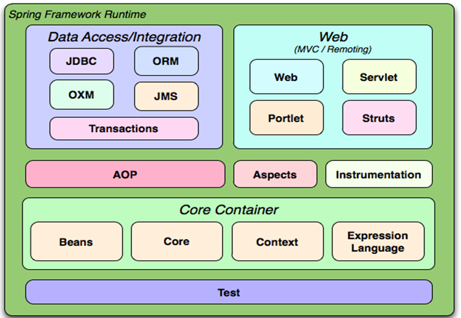  

## 1.2. 解耦  
### 1.2.1. 什么是程序的耦合  
我们在开发中，会写很多的类，而有些类之间不可避免的产生依赖关系，这种依赖关系称之为耦合。  
有些依赖关系是必须的，有些依赖关系可以通过优化代码来解除的。请看下面的示例代码：  
```
/**
 * 客户的业务层实现类
 */
public class CustomerServiceImpl implements ICustomerService {
	
	private ICustomerDao customerDao = new CustomerDaoImpl();	
}

```
上面的代码表示：业务层调用持久层，并且此时业务层在依赖持久层的接口和实现类。如果此时没有持久层实现类，编译将不能通过。这种依赖关系就是我们可以通过优化代码解决的。  
再比如：  
	下面的代码中，我们的类依赖了MySQL的具体驱动类，如果这时候更换了数据库品牌，我们需要改源码来修改数据库驱动。这显然不是我们想要的。  
```
public class JdbcDemo1 {
	
	/**
	 * JDBC操作数据库的基本入门中存在什么问题？
	 * 	  导致驱动注册两次是个问题，但不是严重的。
	 * 	  严重的问题：是当前类和mysql的驱动类有很强的依赖关系。
	 * 			     当我们没有驱动类的时候，连编译都不让。
	 * 那这种依赖关系，就叫做程序的耦合
	 * 
	 * 我们在开发中，理想的状态应该是：
	 * 	  我们应该尽力达到的：编译时不依赖，运行时才依赖。
	 * 	 
	 * @param args
	 * @throws Exception
	 */
	public static void main(String[] args) throws Exception {
		//1.注册驱动
		//DriverManager.registerDriver(new com.mysql.jdbc.Driver());
		Class.forName("com.mysql.jdbc.Driver");
		//2.获取连接
		//3.获取预处理sql语句对象
		//4.获取结果集
		//5.遍历结果集
	}
}
```
### 1.2.2. 解决耦合的思路
当是我们讲解jdbc时，是通过反射来注册驱动的，代码如下：  
```
Class.forName("com.mysql.jdbc.Driver");
```
这时的好处是，我们的类中不再依赖具体的驱动类，此时就算删除mysql的驱动jar包，依然可以编译。但是因为没有驱动类，所以不能运行。  
	不过，此处也有个问题，就是我们反射类对象的全限定类名字符串是在java类中写死的，一旦要改还是要修改源码。  
	解决这个问题也很简单，使用配置文件配置。  
**工厂方式解耦**  
在实际开发中我们可以把所有的dao和service和action对象使用配置文件配置起来，当启动服务器应用加载的时候，通过读取配置文件，把这些对象创建出来并存起来。在接下来的使用的时候，直接拿过来用就好了。  
**控制反转**  
上面解耦的思路有2个问题：  
```
	1、存哪去？
		分析：由于我们是很多对象，肯定要找个集合来存。这时候有Map和List供选择。
			  到底选Map还是List就看我们有没有查找需求。有查找需求，选Map。
		所以我们的答案就是
			在应用加载时，创建一个Map，用于存放action，Service和dao对象。
			我们把这个map称之为容器。
	2、还是没解释什么是工厂？
		工厂就是负责给我们从容器中获取指定对象的类。这时候我们获取对象的方式发生了改变。
		原来：
		   我们在获取对象时，都是采用new的方式。是主动的。
``` 
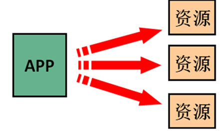  
现在：我们获取对象时，同时跟工厂要，有工厂为我们查找或者创建对象。是被动的。  
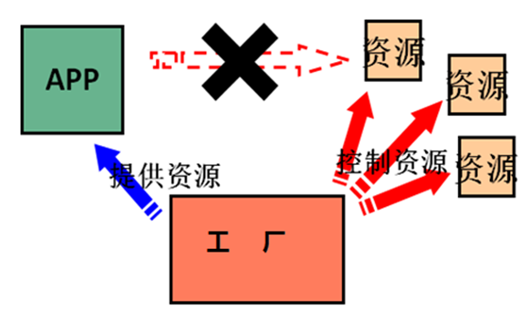  
这种被动接收的方式获取对象的思想就是控制反转，它是spring框架的核心之一。   
它的作用只有一个：削减计算机程序的耦合。  
## 1.3. 使用Spring IOC解耦  
本章我们使用的案例是，客户的业务层和持久层的依赖关系解决。在开始spring的配置之前，我们要先准备一下环境。由于我们是使用spring解决依赖关系，并不是真正的要做增删改查操作，所以此时我们没必要写实体类。并且我们在此处使用的是java工程，不是java web工程。  
  
### 1.3.1. 基本使用
目的都是一样,将类的初始化与组合依赖交给spring管理,其实就是放入单例池中.    
#### 1.3.1.1. xml方式
**dao代码**  
```
package cn.riversky.day1.dao;

public interface CustomerDao {
     void save();
}
```
```
package cn.riversky.day1.dao.impl;

import cn.riversky.day1.dao.CustomerDao;

/**
 * @authon rs
 * @date 2019/10/12
 **/
public class CustumerDaoImpl implements CustomerDao {
    @Override
    public void save() {
        System.out.println("dao");
    }
}

```
**service代码**  
```
public interface ICustomerService {
    /**
     * 保存客户
     */
    void saveCustomer();

}
```
```
package cn.riversky.day1.service.impl;

import cn.riversky.day1.dao.CustomerDao;
import cn.riversky.day1.service.ICustomerService;

/**
 * @authon rs
 * @date 2019/10/12
 **/
public class CusstomerServiceImpl implements ICustomerService {
    private CustomerDao customerDao;

    public void setCustomerDao(CustomerDao customerDao) {
        this.customerDao = customerDao;
    }

    @Override
    public void saveCustomer() {
        customerDao.save();
        System.out.println("service");
    }
}
```
配置信息
```
<?xml version="1.0" encoding="UTF-8"?>
<beans xmlns="http://www.springframework.org/schema/beans"
       xmlns:xsi="http://www.w3.org/2001/XMLSchema-instance"
       xsi:schemaLocation="http://www.springframework.org/schema/beans http://www.springframework.org/schema/beans/spring-beans.xsd">
<bean class="cn.riversky.day1.dao.impl.CustumerDaoImpl" id="custumerDao"></bean>
    <bean class="cn.riversky.day1.service.impl.CusstomerServiceImpl" id="customerService">
        <property name="customerDao" ref="custumerDao"/>
    </bean>
</beans>
```
启动测试
```
package cn.riversky.day1;

import cn.riversky.day1.service.ICustomerService;
import org.springframework.context.support.ClassPathXmlApplicationContext;

/**
 * @authon rs
 * @date 2019/10/12
 **/
public class SpringDay1 {
    public static void main(String[] args) {
        ClassPathXmlApplicationContext applicationContext = new ClassPathXmlApplicationContext("classpath:springbean.xml");
        ICustomerService customerService = (ICustomerService) applicationContext.getBean("customerService");
        customerService.saveCustomer();

    }
}
```
测试结果  
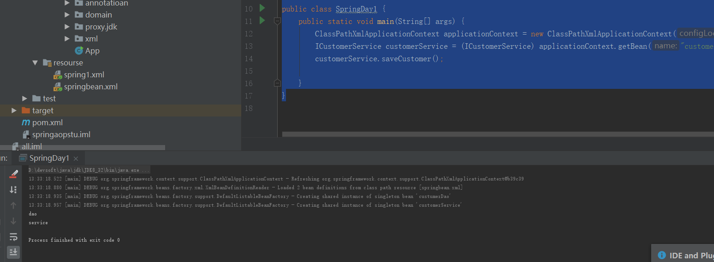  

#### 1.3.1.2. 注解方式
在xml基础上改变
代码
```
package cn.riversky.day1annotation.dao.impl;

import cn.riversky.day1annotation.dao.CustomerDao;
import org.springframework.stereotype.Repository;

/**
 * @authon rs
 * @date 2019/10/12
 **/
@Repository
public class CustumerDaoImpl implements CustomerDao {
    @Override
    public void save() {
        System.out.println("dao");
    }
}

```
```
package cn.riversky.day1annotation.service.impl;

import cn.riversky.day1annotation.dao.CustomerDao;
import cn.riversky.day1annotation.service.ICustomerService;
import org.springframework.beans.factory.annotation.Autowired;
import org.springframework.stereotype.Service;

/**
 * @authon rs
 * @date 2019/10/12
 **/
@Service("customerService")
public class CusstomerServiceImpl implements ICustomerService {
    @Autowired
    private CustomerDao customerDao;
    @Override
    public void saveCustomer() {
        customerDao.save();
        System.out.println("service");
    }
}
```
配置类
```
package cn.riversky.day1annotation.config;

import org.springframework.context.annotation.ComponentScan;
import org.springframework.context.annotation.Configuration;

/**
 * @authon rs
 * @date 2019/10/12
 **/
@Configuration
@ComponentScan(value = {"cn.riversky.day1annotation"})
public class BeanConfig {
}
```
启动类
```
package cn.riversky.day1annotation;

import cn.riversky.day1annotation.config.BeanConfig;
import cn.riversky.day1annotation.service.ICustomerService;
import org.springframework.context.annotation.AnnotationConfigApplicationContext;

/**
 * @authon rs
 * @date 2019/10/12
 **/
public class App {
    public static void main(String[] args) {
        AnnotationConfigApplicationContext annotationConfigApplicationContext = new AnnotationConfigApplicationContext(BeanConfig.class);
        ICustomerService customerService = (ICustomerService) annotationConfigApplicationContext.getBean("customerService");
        customerService.saveCustomer();
    }
}

```
### 1.3.2. IOC细节
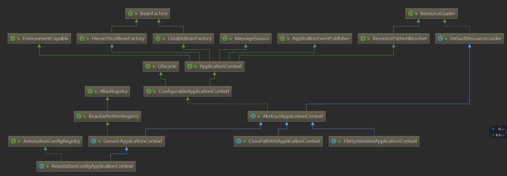  
#### 1.3.2.1. 常用的两个上下文BeanFactory和ApplicationContext
BeanFactory接口详情  
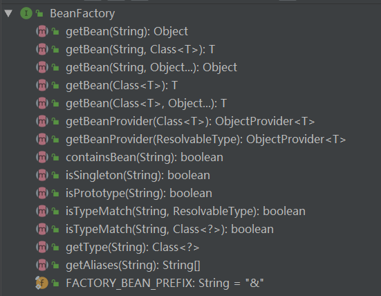  
```
BeanFactory才是Spring容器中的顶层接口。
ApplicationContext是它的子接口。
BeanFactory和ApplicationContext的区别：
	创建对象的时间点不一样。
		ApplicationContext：只要一读取配置文件，默认情况下就会创建对象。
		BeanFactory：什么使用什么时候创建对象。
```
#### 1.3.2.2. bean细节
##### 1.3.2.2.1. 标签以及作用
bean标签
```
作用：
	用于配置对象让spring来创建的。
	默认情况下它调用的是类中的无参构造函数。如果没有无参构造函数则不能创建成功。
属性：
	id：给对象在容器中提供一个唯一标识。用于获取对象。
	class：指定类的全限定类名。用于反射创建对象。默认情况下调用无参构造函数。
	scope：指定对象的作用范围。
			* singleton	:默认值，单例的.
			* prototype	:多例的.
			* request	:WEB项目中,Spring创建一个Bean的对象,将对象存入到request域中.
			* session	:WEB项目中,Spring创建一个Bean的对象,将对象存入到session域中.
			* globalSession	:WEB项目中,应用在Portlet环境.如果没有Portlet环境那么globalSession相当于session.

	init-method：指定类中的初始化方法名称。
	destroy-method：指定类中销毁方法名称。
```
##### 1.3.2.2.2. 作用范围以及生命周期
```
单例对象：scope="singleton"
		一个应用只有一个对象的实例。它的作用范围就是整个引用。
		生命周期：
			对象出生：当应用加载，创建容器时，对象就被创建了。
			对象活着：只要容器在，对象一直活着。
			对象死亡：当应用卸载，销毁容器时，对象就被销毁了。
	多例对象：scope="prototype"
		每次访问对象时，都会重新创建对象实例。
		生命周期：
			对象出生：当使用对象时，创建新的对象实例。
			对象活着：只要对象在使用中，就一直活着。
			对象死亡：当对象长时间不用时，被java的垃圾回收器回收了。
```
#### 1.3.2.3. 实例化Bean的三种方式  
方法一:无参构造
```
第一种方式：使用默认无参构造函数
	<!--在默认情况下：
		它会根据默认无参构造函数来创建类对象。如果bean中没有默认无参构造函数，将会创建失败。 
	-->
<bean id="customerService" class="com.itheima.service.impl.CustomerServiceImpl"/>
```
方法二:静态工厂  
```
/**
 * 模拟一个静态工厂，创建业务层实现类
 */
public class StaticFactory {	
	public static ICustomerService createCustomerService(){
		return new CustomerServiceImpl();
	}
}
<!-- 此种方式是:
	 使用StaticFactory类中的静态方法createCustomerService创建对象，并存入spring容器
	 id属性：指定bean的id，用于从容器中获取
	 class属性：指定静态工厂的全限定类名
	 factory-method属性：指定生产对象的静态方法
 -->
<bean id="customerService" 
	  class="com.itheima.factory.StaticFactory" 
	  factory-method="createCustomerService"></bean>
```
方法三:实例工厂(该实例需要在Spring中注册)   
```
/**
 * 模拟一个实例工厂，创建业务层实现类
 * 此工厂创建对象，必须现有工厂实例对象，再调用方法
 */
public class InstanceFactory {	
	public ICustomerService createCustomerService(){
		return new CustomerServiceImpl();
	}
}
<!-- 此种方式是：
		 先把工厂的创建交给spring来管理。
		然后在使用工厂的bean来调用里面的方法
		factory-bean属性：用于指定实例工厂bean的id。
		factory-method属性：用于指定实例工厂中创建对象的方法。
	-->
	<bean id="instancFactory" class="com.itheima.factory.InstanceFactory"></bean>
	<bean id="customerService" 
		  factory-bean="instancFactory" 
		  factory-method="createCustomerService"></bean>

``` 

#### 1.3.2.4. 依赖注入  
它是spring框架核心ioc的具体实现方式。简单的说，就是坐等框架把对象传入，而不用我们自己去获取。  
##### 1.3.2.4.1. 注入方式
**构造注入**  
**setter注入**  
**名称空间注入(本质还是setter)**  
**当使用集合注入时**  
```
<!-- 注入集合数据 
	 List结构的：
		array,list,set
	Map结构的
		map,entry,props,prop
-->

```
#### 常用注解  
**Component**  
```
作用：
	把资源让spring来管理。相当于在xml中配置一个bean。
属性：
	value：指定bean的id。如果不指定value属性，默认bean的id是当前类的类名。首字母小写。
```
**@Controller  @Service  @Repository**  
```
他们三个注解都是针对一个的衍生注解，他们的作用及属性都是一模一样的。
他们只不过是提供了更加明确的语义化。
	@Controller：一般用于表现层的注解。
	@Service：一般用于业务层的注解。
	@Repository：一般用于持久层的注解。
细节：如果注解中有且只有一个属性要赋值时，且名称是value，value在赋值是可以不写。
```
数据注入类的注解  
**@Autowired**  
```
作用：
	自动按照类型注入。当使用注解注入属性时，set方法可以省略。它只能注入其他bean类型。当有多个类型匹配时，使用要注入的对象变量名称作为bean的id，在spring容器查找，找到了也可以注入成功。找不到就报错。  

```
**@Qualifier**  
```
作用：
	在自动按照类型注入的基础之上，再按照Bean的id注入。它在给字段注入时不能独立使用，必须和@Autowire一起使用；但是给方法参数注入时，可以独立使用。
属性：
	value：指定bean的id。

```
**@Resource**  
```
作用：
	直接按照Bean的id注入。它也只能注入其他bean类型。
属性：
	name：指定bean的id。
```
**@Value**   
```
作用：
	注入基本数据类型和String类型数据的
属性：
	value：用于指定值
```
**@Scope**  
```
作用：
	指定bean的作用范围。
属性：
	value：指定范围的值。
		   取值：singleton  prototype request session globalsession
```
和生命周期相关的  
```
@PostConstruct
作用：
	用于指定初始化方法。
@PreDestroy
作用：
	用于指定销毁方法。

```
#### 新注解(主要是针对零配置)  
@Configuration
```
作用：
	用于指定当前类是一个spring配置类，当创建容器时会从该类上加载注解。获取容器时需要使用AnnotationApplicationContext(有@Configuration注解的类.class)。
属性：
	value:用于指定配置类的字节码
```
@ComponentScan
```
作用：
	用于指定spring在初始化容器时要扫描的包。作用和在spring的xml配置文件中的：
<context:component-scan base-package="com.itheima"/>是一样的。
属性：
	basePackages：用于指定要扫描的包。和该注解中的value属性作用一样。
```
@PropertySource  
```
作用：
	用于加载.properties文件中的配置。例如我们配置数据源时，可以把连接数据库的信息写到properties配置文件中，就可以使用此注解指定properties配置文件的位置。
属性：
	value[]：用于指定properties文件位置。如果是在类路径下，需要写上classpath:
```
#### 配置文件利用PropertySource解析方法
方法一:  
```
第一步骤,写property配置文件
第二步骤,注解PropertySource,添加该文件
第三步骤,使用(EL表达式)
```
方法二利用Import的方式加载类
```
作用：
	用于导入其他配置类，在引入其他配置类时，可以不用再写@Configuration注解。当然，写上也没问题。
属性：
	value[]：用于指定其他配置类的字节码。
示例代码：
@Configuration
@ComponentScan(basePackages = "cn.itcast.spring")
@Import({ Configuration_B.class})
public class Configuration_A {
}

@Configuration
@PropertySource("classpath:info.properties")
public class Configuration_B {

}
```
# 2. Aop
## 2.1. 什么是AOP
AOP：全称是Aspect Oriented Programming即：面向切面编程。  
简单的说它就是把我们程序重复的代码抽取出来，在需要执行的时候，使用动态代理的技术，在不修改源码的基础上，对我们的已有方法进行增强。    
## 2.2. AOP作用以及优势
作用：在程序运行期间，不修改源码对已有方法进行增强。  
优势：减少重复代码		 提高开发效率 		维护方便
## 2.3. 实现方式(动态代理)  
### 2.3.1. 动态代理的特点
字节码随用随创建，随用随加载。  
它与静态代理的区别也在于此。因为静态代理是字节码一上来就创建好，并完成加载。  
装饰者模式就是静态代理的一种体现。  
### 2.3.2. 动态代理的两种方式
基于接口的动态代理  
	提供者：JDK官方的Proxy类。  
	要求：被代理类最少实现一个接口。  
基于子类的动态代理  
	提供者：第三方的CGLib，如果报asmxxxx异常，需要导入asm.jar。 
	要求：被代理类不能用final修饰的类（最终类）。  
### 2.3.3. jdk动态代理方案
**基本接口**  
```
public interface IActor {
    /**
     * 基本演出
     * @param money
     */
    public void basicAct(float money);
    /**
     * 危险演出
     * @param money
     */
    public void dangerAct(float money);
}
```
**基本实现**  
```
/**
 * @authon rs
 * @date 2019/10/09
 **/
public class Actor implements IActor {
    @Override
    public void basicAct(float money) {
        System.out.println("拿到钱，开始基本的表演："+money);
    }

    @Override
    public void dangerAct(float money) {
        System.out.println("拿到钱，开始危险的表演："+money);
    }
}
```
**动态代理使用**  
```
/**
 * @authon rs
 * @date 2019/10/09
 **/
public class Client {
    public static void main(String[] args) {
        final Actor actor = new Actor();
        IActor o = (IActor) Proxy.newProxyInstance(actor.getClass().getClassLoader(), actor.getClass().getInterfaces(), new InvocationHandler() {
            @Override
            public Object invoke(Object proxy, Method method, Object[] args) throws Throwable {
                String name = method.getName();
                Float money = (Float) args[0];
                Object retVal = null;
                if ("basicAct".equals(name)) {
                    if (money > 2000) {
                        //看上去剧组是给了8000，实际到演员手里只有4000
                        //这就是我们没有修改原来basicAct方法源码，对方法进行了增强
                        retVal = method.invoke(actor, money / 2);
                    }
                }
                if ("dangerAct".equals(name)) {
                    //危险演出,没有5000不演
                    if (money > 5000) {
                        //看上去剧组是给了50000，实际到演员手里只有25000
                        //这就是我们没有修改原来dangerAct方法源码，对方法进行了增强
                        retVal = method.invoke(actor, money / 2);
                    }
                }

                return retVal;
            }
        });
        o.basicAct(8000f);
        o.dangerAct(50000f);
    }
}
```
### 2.3.4. CGlib实现
只依赖非final的类(不需要接口)
```
/**
 * @authon rs
 * @date 2019/10/09
 **/
public class ClientCglib {
    public static void main(String[] args) {
        final Actor actor = new Actor();
        IActor o = (IActor) Enhancer.create(actor.getClass(), new MethodInterceptor() {
            @Override
            public Object intercept(Object proxy, Method method, Object[] args, MethodProxy methodProxy) throws Throwable {
                String name = method.getName();
                Float money = (Float) args[0];
                Object rtValue = null;
                if("basicAct".equals(name)){
                    //基本演出
                    if(money > 2000){
                        rtValue = method.invoke(actor, money/2);
                    }
                }
                if("dangerAct".equals(name)){
                    //危险演出
                    if(money > 5000){
                        rtValue = method.invoke(actor, money/2);
                    }
                }
                return rtValue;
            }
        });
        o.basicAct(10000f);
        o.dangerAct(100000f);
    }
}
```


## 2.4. spring中的AOP
### 2.4.1. 代理方式的选择
在spring中，框架会根据目标类是否实现了接口来决定采用哪种动态代理的方式。  
### 2.4.2. AOP术语  
Joinpoint(连接点):  所谓连接点是指那些被拦截到的点。在spring中,这些点指的是方法,因为spring只支持方法类型的连接点。  
Pointcut(切入点):所谓切入点是指我们要对哪些Joinpoint进行拦截的定义。  
Advice(通知/增强): 所谓通知是指拦截到Joinpoint之后所要做的事情就是通知。  
		通知的类型：前置通知,后置通知,异常通知,最终通知,环绕通知。  
Introduction(引介):	引介是一种特殊的通知在不修改类代码的前提下, Introduction可以在运行期为类动态地添加一些方法或Field。  
Target(目标对象): 代理的目标对象。  
Weaving(织入):是指把增强应用到目标对象来创建新的代理对象的过程。 spring采用动态代理织入，而AspectJ采用编译期织入和类装载期织入。  
Proxy（代理）:一个类被AOP织入增强后，就产生一个结果代理类。  
Aspect(切面):是切入点和通知（引介）的结合。
### 2.4.3. 切入点表达式  
```
表达式语法：execution([修饰符] 返回值类型 包名.类名.方法名(参数))  
写法说明：
	全匹配方式：
		public void com.itheima.service.impl.CustomerServiceImpl.saveCustomer()
	访问修饰符可以省略	
		void com.itheima.service.impl.CustomerServiceImpl.saveCustomer()
	返回值可以使用*号，表示任意返回值
		* com.itheima.service.impl.CustomerServiceImpl.saveCustomer()
	包名可以使用*号，表示任意包，但是有几级包，需要写几个*
		* *.*.*.*.CustomerServiceImpl.saveCustomer()
	使用..来表示当前包，及其子包
		* com..CustomerServiceImpl.saveCustomer()
	类名可以使用*号，表示任意类
		* com..*.saveCustomer()
	方法名可以使用*号，表示任意方法
		* com..*.*()
	参数列表可以使用*，表示参数可以是任意数据类型，但是必须有参数
		* com..*.*(*)
	参数列表可以使用..表示有无参数均可，有参数可以是任意类型
		* com..*.*(..)
	全通配方式：
		* *..*.*(..)
```  
## 2.5. spring aop- xml使用方式  
### 2.5.1. 标签说明  
**aop:config**  
作用：用于声明开始aop的配置  
**aop:aspect**  
作用：用于配置切面。  
属性：id：给切面提供一个唯一标识。ref：引用配置好的通知类bean的id。  
**aop:pointcut**  
```
作用：
	用于配置切入点表达式
属性：
	expression：用于定义切入点表达式。
	id：用于给切入点表达式提供一个唯一标识。

```
通知
```
作用：
	aop:before- 用于配置前置通知 
    aop:after-returning 后置
    aop:after 最终
    aop:after-throwing 异常
    aop:around  环绕
属性：
	method：指定通知中方法的名称。
	pointct：定义切入点表达式
	pointcut-ref：指定切入点表达式的引用
```
### 2.5.2. 代码实现
接口  
```
public interface ICustomerService {

    /**
     * 保存客户
     */
    void saveCustomer();

    /**
     * 修改客户
     * @param i
     */
    void updateCustomer(int i);

}
```
实现
```

/**
 * @authon rs
 * @date 2019/10/09
 **/
public class CustomerService implements ICustomerService {
    @Override
    public void saveCustomer() {
        System.out.println("调用持久层，执行保存客户");
    }

    @Override
    public void updateCustomer(int i) {
        System.out.println("调用持久层，执行修改客户");
    }
}
```
通知
```
/**
 * @authon rs
 * @date 2019/10/09
 **/
public class LoggerAdvice {
    public static final Logger log=LoggerFactory.getLogger(LoggerAdvice.class);
    public void before(){
        log.info("before Print Logger");
    }
    public void after(){
        log.info("after printer logger");
    }
    public void exceptionPrint(){
        log.info("exception happen");
    }
    public void finalAdive(){
        log.info("final printer");
    }
    public  void aroundAdvice(ProceedingJoinPoint joinPoint){
        try {
            log.info("环绕 前");
            joinPoint.proceed();
            log.info("环绕 后");
        } catch (Throwable throwable) {
            log.info("环绕 异常");
            throwable.printStackTrace();
        }finally {
            log.info("环绕 最终");

        }
    }
}
```
配置  
```
<?xml version="1.0" encoding="UTF-8"?>
<beans xmlns="http://www.springframework.org/schema/beans"
       xmlns:xsi="http://www.w3.org/2001/XMLSchema-instance" xmlns:aop="http://www.springframework.org/schema/aop"
       xsi:schemaLocation="http://www.springframework.org/schema/beans http://www.springframework.org/schema/beans/spring-beans.xsd http://www.springframework.org/schema/aop https://www.springframework.org/schema/aop/spring-aop.xsd">

    <bean id="customerService" class="cn.riversky.stu.xml.service.impl.CustomerService"></bean>
    <bean id="loggerAdvice" class="cn.riversky.stu.xml.advice.LoggerAdvice"></bean>
    <aop:config>
        <aop:pointcut id="loggerPointCut" expression="execution(* cn.riversky.stu.xml.service.impl.*.*(..))"></aop:pointcut>
        <aop:aspect id="loggerAdvie" ref="loggerAdvice">
            <aop:before method="before" pointcut-ref="loggerPointCut"></aop:before>
            <aop:after-throwing method="exceptionPrint" pointcut-ref="loggerPointCut"></aop:after-throwing>
            <aop:after-returning method="after" pointcut-ref="loggerPointCut"></aop:after-returning>
            <aop:after method="finalAdive" pointcut-ref="loggerPointCut"></aop:after>
            <aop:around method="aroundAdvice" pointcut-ref="loggerPointCut"></aop:around>
        </aop:aspect>
    </aop:config>
</beans>
```
使用
```
/**
 * @authon rs
 * @date 2019/10/09
 **/
public class SpringXmlClient {
    public static void main(String[] args) {
        ApplicationContext applicationContext = new ClassPathXmlApplicationContext("classpath:spring1.xml");
        ICustomerService bean = (ICustomerService) applicationContext.getBean("customerService");
        bean.saveCustomer();
    }
}
```
测试结果
  

## 2.6. spring aop- 注解方式
通知  
```
/**
 * @authon rs
 * @date 2019/10/09
 **/
@Component
@Aspect//表明当前类是一个切面类
public class LoggerAdvice {
    public static final Logger log=LoggerFactory.getLogger(LoggerAdvice.class);
    @Pointcut(value = "execution(* cn.riversky.stu.annotatioan..service..*(..))")
    private void  getApoint(){}
    @Before("getApoint()")
    public void before(){
        log.info("before Print Logger");
    }
    @After("getApoint()")
    public void after(){
        log.info("after printer logger");
    }
    @AfterThrowing("getApoint()")
    public void exceptionPrint(){
        log.info("exception happen");
    }
    @AfterReturning("getApoint()")
    public void finalAdive(){
        log.info("final printer");
    }
    @Around("getApoint()")
    public  void aroundAdvice(ProceedingJoinPoint joinPoint){
        try {
            log.info("环绕 前");
            joinPoint.proceed();
            log.info("环绕 后");
        } catch (Throwable throwable) {
            log.info("环绕 异常");
            throwable.printStackTrace();
        }finally {
            log.info("环绕 最终");

        }
    }
}
```
切入点
```
@Service
public class CustomerService {
    public void saveCustomer() {
        System.out.println("调用持久层，执行保存客户");
    }

    public void updateCustomer(int i) {
        System.out.println("调用持久层，执行修改客户");
    }
}
```
配置类
```
/**
 * @authon rs
 * @date 2019/10/09
 **/
@Configuration
@ComponentScan(basePackages = "cn.riversky.stu.annotatioan")
@EnableAspectJAutoProxy
public class SpringAppConfig {
}
```
使用Client
```
public class AppClient {
    public static void main(String[] args) {
        ApplicationContext applicationContext = new AnnotationConfigApplicationContext(SpringAppConfig.class);
        CustomerService bean = (CustomerService) applicationContext.getBean("customerService");
        bean.saveCustomer();
    }
}
```
验证
  

# Spring MVC  
Spring web mvc和Struts2都属于表现层的框架,它是Spring框架的一部分,我们可以从Spring的整体结构中看得出来：  
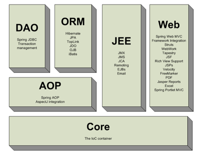      
## Web Mvc
mvc设计模式在b/s系统下应用:  
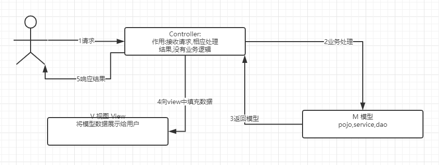  
## Spring web mvc 架构
  
```
1、	用户发送请求至前端控制器DispatcherServlet
2、	DispatcherServlet收到请求调用HandlerMapping处理器映射器。
3、	处理器映射器根据请求url找到具体的处理器，生成处理器对象及处理器拦截器(如果有则生成)一并返回给DispatcherServlet。
4、	DispatcherServlet通过HandlerAdapter处理器适配器调用处理器
5、	执行处理器(Controller，也叫后端控制器)。
6、	Controller执行完成返回ModelAndView
7、	HandlerAdapter将controller执行结果ModelAndView返回给DispatcherServlet
8、	DispatcherServlet将ModelAndView传给ViewReslover视图解析器
9、	ViewReslover解析后返回具体View
10、	DispatcherServlet对View进行渲染视图（即将模型数据填充至视图中）。
11、	DispatcherServlet响应用户
```
### 组件说明
**DispatcherServlet 前端控制器**  
用户请求到达前端控制器，它就相当于mvc模式中的c，dispatcherServlet是整个流程控制的中心，由它调用其它组件处理用户的请求，dispatcherServlet的存在降低了组件之间的耦合性  
**HandlerMapping 处理器映射器**  
HandlerMapping负责根据用户请求找到Handler即处理器，springmvc提供了不同的映射器实现不同的映射方式，例如：配置文件方式，实现接口方式，注解方式等。  
**Handler 处理器**  
Handler 是继DispatcherServlet前端控制器的后端控制器，在DispatcherServlet的控制下Handler对具体的用户请求进行处理。  
>>由于Handler涉及到具体的用户业务请求，所以一般情况需要程序员根据业务需求开发Handler。  

**HandlerAdapter 处理器适配器**  
通过HandlerAdapter对处理器进行执行，这是适配器模式的应用，通过扩展适配器可以对更多类型的处理器进行执行。  
**View Resolver视图解析器**  
View Resolver负责将处理结果生成View视图，View Resolver首先根据逻辑视图名解析成物理视图名即具体的页面地址，再生成View视图对象，最后对View进行渲染将处理结果通过页面展示给用户。 springmvc框架提供了很多的View视图类型，包括：jstlView、freemarkerView、pdfView等。  
>>  一般情况下需要通过页面标签或页面模版技术将模型数据通过页面展示给用户，需要由程序员根据业务需求开发具体的页面。  

### 类关系
**DispatcherServlet**    
```
public class DispatcherServlet extends FrameworkServlet {
    public static final String MULTIPART_RESOLVER_BEAN_NAME = "multipartResolver";
    public static final String LOCALE_RESOLVER_BEAN_NAME = "localeResolver";
    public static final String THEME_RESOLVER_BEAN_NAME = "themeResolver";
    public static final String HANDLER_MAPPING_BEAN_NAME = "handlerMapping";
    public static final String HANDLER_ADAPTER_BEAN_NAME = "handlerAdapter";
    public static final String HANDLER_EXCEPTION_RESOLVER_BEAN_NAME = "handlerExceptionResolver";
    public static final String REQUEST_TO_VIEW_NAME_TRANSLATOR_BEAN_NAME = "viewNameTranslator";
    public static final String VIEW_RESOLVER_BEAN_NAME = "viewResolver";
    public static final String FLASH_MAP_MANAGER_BEAN_NAME = "flashMapManager";
    public static final String WEB_APPLICATION_CONTEXT_ATTRIBUTE = DispatcherServlet.class.getName() + ".CONTEXT";
    public static final String LOCALE_RESOLVER_ATTRIBUTE = DispatcherServlet.class.getName() + ".LOCALE_RESOLVER";
    public static final String THEME_RESOLVER_ATTRIBUTE = DispatcherServlet.class.getName() + ".THEME_RESOLVER";
    public static final String THEME_SOURCE_ATTRIBUTE = DispatcherServlet.class.getName() + ".THEME_SOURCE";
    public static final String INPUT_FLASH_MAP_ATTRIBUTE = DispatcherServlet.class.getName() + ".INPUT_FLASH_MAP";
    public static final String OUTPUT_FLASH_MAP_ATTRIBUTE = DispatcherServlet.class.getName() + ".OUTPUT_FLASH_MAP";
    public static final String FLASH_MAP_MANAGER_ATTRIBUTE = DispatcherServlet.class.getName() + ".FLASH_MAP_MANAGER";
    public static final String EXCEPTION_ATTRIBUTE = DispatcherServlet.class.getName() + ".EXCEPTION";
    public static final String PAGE_NOT_FOUND_LOG_CATEGORY = "org.springframework.web.servlet.PageNotFound";
    private static final String DEFAULT_STRATEGIES_PATH = "DispatcherServlet.properties";
    private static final String DEFAULT_STRATEGIES_PREFIX = "org.springframework.web.servlet";
    protected static final Log pageNotFoundLogger = LogFactory.getLog("org.springframework.web.servlet.PageNotFound");
    @Nullable
    private MultipartResolver multipartResolver;
    @Nullable
    private LocaleResolver localeResolver;
    @Nullable
    private ThemeResolver themeResolver;
    @Nullable
    private List<HandlerMapping> handlerMappings;
    @Nullable
    private List<HandlerAdapter> handlerAdapters;
    @Nullable
    private List<HandlerExceptionResolver> handlerExceptionResolvers;
    @Nullable
    private RequestToViewNameTranslator viewNameTranslator;
    @Nullable
    private FlashMapManager flashMapManager;
    @Nullable
    private List<ViewResolver> viewResolvers;
}
```
Dispatcher 中默认的配置信息
```
org.springframework.web.servlet.LocaleResolver=org.springframework.web.servlet.i18n.AcceptHeaderLocaleResolver

org.springframework.web.servlet.ThemeResolver=org.springframework.web.servlet.theme.FixedThemeResolver

org.springframework.web.servlet.HandlerMapping=org.springframework.web.servlet.handler.BeanNameUrlHandlerMapping,\
	org.springframework.web.servlet.mvc.method.annotation.RequestMappingHandlerMapping

org.springframework.web.servlet.HandlerAdapter=org.springframework.web.servlet.mvc.HttpRequestHandlerAdapter,\
	org.springframework.web.servlet.mvc.SimpleControllerHandlerAdapter,\
	org.springframework.web.servlet.mvc.method.annotation.RequestMappingHandlerAdapter

org.springframework.web.servlet.HandlerExceptionResolver=org.springframework.web.servlet.mvc.method.annotation.ExceptionHandlerExceptionResolver,\
	org.springframework.web.servlet.mvc.annotation.ResponseStatusExceptionResolver,\
	org.springframework.web.servlet.mvc.support.DefaultHandlerExceptionResolver

org.springframework.web.servlet.RequestToViewNameTranslator=org.springframework.web.servlet.view.DefaultRequestToViewNameTranslator

org.springframework.web.servlet.ViewResolver=org.springframework.web.servlet.view.InternalResourceViewResolver

org.springframework.web.servlet.FlashMapManager=org.springframework.web.servlet.support.SessionFlashMapManager
```
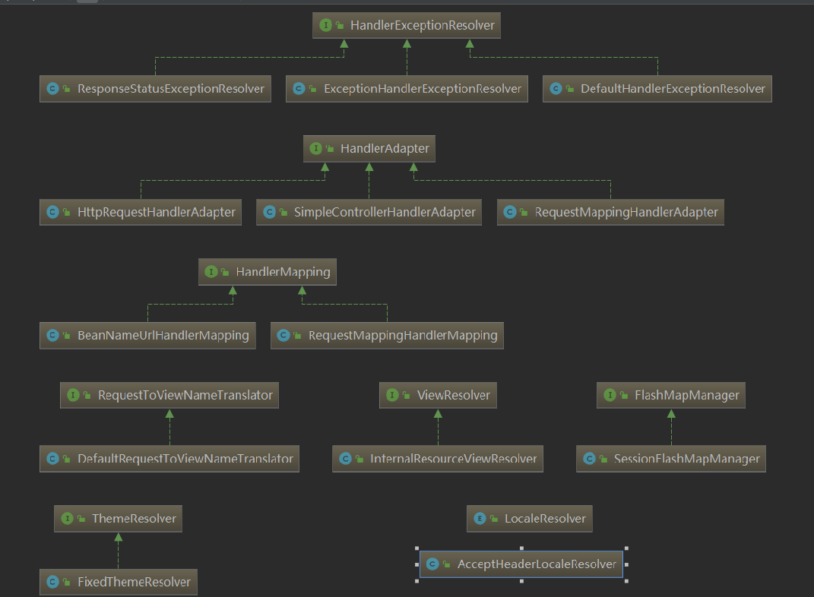   
DispathcerServlet作为springmvc的中央调度器存在，DispatcherServlet创建时会默认从DispatcherServlet.properties文件加载springmvc所用的各各组件，如果在springmvc.xml中配置了组件则以springmvc.xml中配置的为准，DispatcherServlet的存在降低了springmvc各各组件之间的耦合度。  
**handlerMapping**  
HandlerMapping 负责根据request请求找到对应的Handler处理器及Interceptor拦截器，将它们封装在HandlerExecutionChain 对象中给前端控制器返回。  
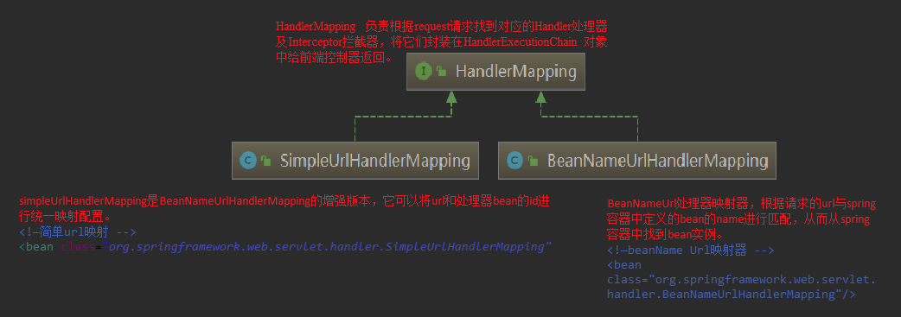  
**HandlerAdapter**  
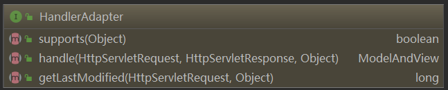  
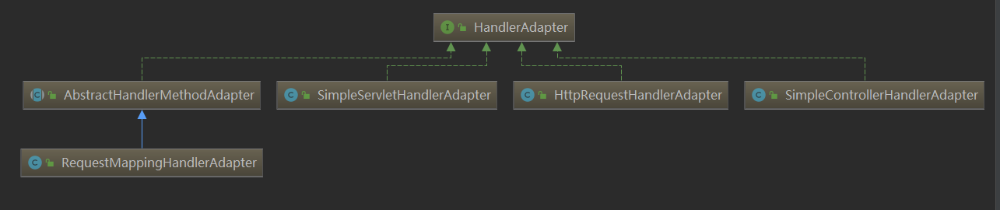  
HandlerAdapter会根据适配器接口对后端控制器进行包装（适配），包装后即可对处理器进行执行，通过扩展处理器适配器可以执行多种类型的处理器，这里使用了适配器设计模式。  
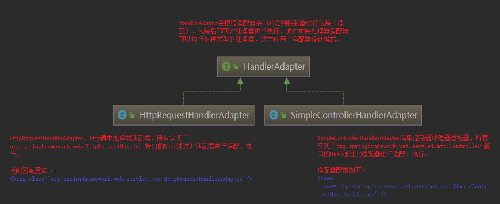  
  


### 组件扫描器  
使用组件扫描器省去在spring容器配置每个controller类的繁琐。使用<context:component-scan自动扫描标记@controller的控制器类，配置如下：  
```
<!-- 扫描controller注解,多个包中间使用半角逗号分隔 -->
	<context:component-scan base-package="cn.itcast.springmvc.controller.first"/>
```
### 注解支持  
1. 对于handlerMapping 的注解支持类为RequestMappingHandlerMapping  
注解式处理器映射器，对类中标记@ResquestMapping的方法进行映射，根据ResquestMapping定义的url匹配ResquestMapping标记的方法，匹配成功返回HandlerMethod对象给前端控制器，HandlerMethod对象中封装url对应的方法Method。   
```
<!--注解映射器 -->
	<bean class="org.springframework.web.servlet.mvc.method.annotation.RequestMappingHandlerMapping"/>
```
2.  对于handlerAdapter 的注解支持类为RequestMappingHandlerAdapter     
注解式处理器适配器，对标记@ResquestMapping的方法进行适配。
从spring3.1版本开始，废除了AnnotationMethodHandlerAdapter的使用，推荐使用RequestMappingHandlerAdapter完成注解式处理器适配。
```
<!--注解适配器 -->
	<bean class="org.springframework.web.servlet.mvc.method.annotation.RequestMappingHandlerAdapter"/>
```
>>  springmvc使用<mvc:annotation-driven>自动加载RequestMappingHandlerMapping和RequestMappingHandlerAdapter，可用在springmvc.xml配置文件中使用<mvc:annotation-driven>替代注解处理器和适配器的配置。  
### 源码处理流程  
1. 用户发送请求到DispatcherServlet
2. Dispatcher调用handlerMapping 中根据url查询handler
```
protected void doDispatch(HttpServletRequest request, HttpServletResponse response) throws Exception {
        HttpServletRequest processedRequest = request;
        HandlerExecutionChain mappedHandler = null;
        boolean multipartRequestParsed = false;
        WebAsyncManager asyncManager = WebAsyncUtils.getAsyncManager(request);

        try {
            try {
                ModelAndView mv = null;
                Object dispatchException = null;

                try {
                    processedRequest = this.checkMultipart(request);
                    multipartRequestParsed = processedRequest != request;
                    //第二步骤
                    mappedHandler = this.getHandler(processedRequest);//其中list(handlerMapping)中封装了list(具体)
                    if (mappedHandler == null) {
                        this.noHandlerFound(processedRequest, response);
                        return;
                    }
                    //第三步骤
                    HandlerAdapter ha = this.getHandlerAdapter(mappedHandler.getHandler());
                    String method = request.getMethod();
                    boolean isGet = "GET".equals(method);
                    if (isGet || "HEAD".equals(method)) {
                        long lastModified = ha.getLastModified(request, mappedHandler.getHandler());
                        if ((new ServletWebRequest(request, response)).checkNotModified(lastModified) && isGet) {
                            return;
                        }
                    }

                    if (!mappedHandler.applyPreHandle(processedRequest, response)) {
                        return;
                    }
                    //真实调用
                    mv = ha.handle(processedRequest, response, mappedHandler.getHandler());
                    if (asyncManager.isConcurrentHandlingStarted()) {
                        return;
                    }

                    this.applyDefaultViewName(processedRequest, mv);
                    mappedHandler.applyPostHandle(processedRequest, response, mv);
                } catch (Exception var20) {
                    dispatchException = var20;
                } catch (Throwable var21) {
                    dispatchException = new NestedServletException("Handler dispatch failed", var21);
                }

                this.processDispatchResult(processedRequest, response, mappedHandler, mv, (Exception)dispatchException);
            } catch (Exception var22) {
                this.triggerAfterCompletion(processedRequest, response, mappedHandler, var22);
            } catch (Throwable var23) {
                this.triggerAfterCompletion(processedRequest, response, mappedHandler, new NestedServletException("Handler processing failed", var23));
            }

        } finally {
            if (asyncManager.isConcurrentHandlingStarted()) {
                if (mappedHandler != null) {
                    mappedHandler.applyAfterConcurrentHandlingStarted(processedRequest, response);
                }
            } else if (multipartRequestParsed) {
                this.cleanupMultipart(processedRequest);
            }

        }
    }
```

3. 	DispatherServlet调用HandlerAdapter(处理器适配器)对HandlerMapping找到Handler进行包装、执行。HandlerAdapter执行Handler完成后，返回了一个ModleAndView(springmvc封装对象)
4. 	DispatherServlet拿着ModelAndView调用ViewResolver（视图解析器）进行视图解析，解析完成后返回一个View（很多不同视图类型的View）  
5. 	DispatcherServlet进行视图渲染，将Model中数据放到request域，在页面展示