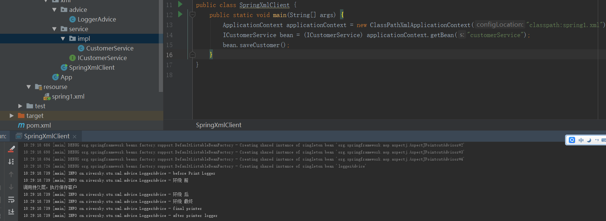
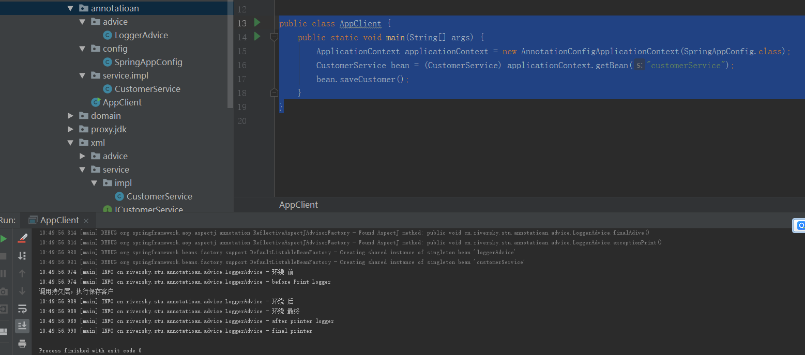

来源:传智播客.   
# 1. Aop
## 1.1. 什么是AOP
AOP：全称是Aspect Oriented Programming即：面向切面编程。  
简单的说它就是把我们程序重复的代码抽取出来，在需要执行的时候，使用动态代理的技术，在不修改源码的基础上，对我们的已有方法进行增强。  
## AOP作用以及优势
作用：在程序运行期间，不修改源码对已有方法进行增强。  
优势：减少重复代码		 提高开发效率 		维护方便
## 实现方式(动态代理)  
### 动态代理的特点
字节码随用随创建，随用随加载。  
它与静态代理的区别也在于此。因为静态代理是字节码一上来就创建好，并完成加载。  
装饰者模式就是静态代理的一种体现。  
### 动态代理的两种方式
基于接口的动态代理  
	提供者：JDK官方的Proxy类。  
	要求：被代理类最少实现一个接口。  
基于子类的动态代理  
	提供者：第三方的CGLib，如果报asmxxxx异常，需要导入asm.jar。 
	要求：被代理类不能用final修饰的类（最终类）。  
### jdk动态代理方案
**基本接口**  
```
public interface IActor {
    /**
     * 基本演出
     * @param money
     */
    public void basicAct(float money);
    /**
     * 危险演出
     * @param money
     */
    public void dangerAct(float money);
}
```
**基本实现**  
```
/**
 * @authon rs
 * @date 2019/10/09
 **/
public class Actor implements IActor {
    @Override
    public void basicAct(float money) {
        System.out.println("拿到钱，开始基本的表演："+money);
    }

    @Override
    public void dangerAct(float money) {
        System.out.println("拿到钱，开始危险的表演："+money);
    }
}
```
**动态代理使用**  
```
/**
 * @authon rs
 * @date 2019/10/09
 **/
public class Client {
    public static void main(String[] args) {
        final Actor actor = new Actor();
        IActor o = (IActor) Proxy.newProxyInstance(actor.getClass().getClassLoader(), actor.getClass().getInterfaces(), new InvocationHandler() {
            @Override
            public Object invoke(Object proxy, Method method, Object[] args) throws Throwable {
                String name = method.getName();
                Float money = (Float) args[0];
                Object retVal = null;
                if ("basicAct".equals(name)) {
                    if (money > 2000) {
                        //看上去剧组是给了8000，实际到演员手里只有4000
                        //这就是我们没有修改原来basicAct方法源码，对方法进行了增强
                        retVal = method.invoke(actor, money / 2);
                    }
                }
                if ("dangerAct".equals(name)) {
                    //危险演出,没有5000不演
                    if (money > 5000) {
                        //看上去剧组是给了50000，实际到演员手里只有25000
                        //这就是我们没有修改原来dangerAct方法源码，对方法进行了增强
                        retVal = method.invoke(actor, money / 2);
                    }
                }

                return retVal;
            }
        });
        o.basicAct(8000f);
        o.dangerAct(50000f);
    }
}
```
### CGlib实现
只依赖非final的类(不需要接口)
```
/**
 * @authon rs
 * @date 2019/10/09
 **/
public class ClientCglib {
    public static void main(String[] args) {
        final Actor actor = new Actor();
        IActor o = (IActor) Enhancer.create(actor.getClass(), new MethodInterceptor() {
            @Override
            public Object intercept(Object proxy, Method method, Object[] args, MethodProxy methodProxy) throws Throwable {
                String name = method.getName();
                Float money = (Float) args[0];
                Object rtValue = null;
                if("basicAct".equals(name)){
                    //基本演出
                    if(money > 2000){
                        rtValue = method.invoke(actor, money/2);
                    }
                }
                if("dangerAct".equals(name)){
                    //危险演出
                    if(money > 5000){
                        rtValue = method.invoke(actor, money/2);
                    }
                }
                return rtValue;
            }
        });
        o.basicAct(10000f);
        o.dangerAct(100000f);
    }
}
```
## spring中的AOP
### 代理方式的选择
在spring中，框架会根据目标类是否实现了接口来决定采用哪种动态代理的方式。  
### AOP术语  
Joinpoint(连接点):  所谓连接点是指那些被拦截到的点。在spring中,这些点指的是方法,因为spring只支持方法类型的连接点。  
Pointcut(切入点):所谓切入点是指我们要对哪些Joinpoint进行拦截的定义。  
Advice(通知/增强): 所谓通知是指拦截到Joinpoint之后所要做的事情就是通知。  
		通知的类型：前置通知,后置通知,异常通知,最终通知,环绕通知。  
Introduction(引介):	引介是一种特殊的通知在不修改类代码的前提下, Introduction可以在运行期为类动态地添加一些方法或Field。  
Target(目标对象): 代理的目标对象。  
Weaving(织入):是指把增强应用到目标对象来创建新的代理对象的过程。 spring采用动态代理织入，而AspectJ采用编译期织入和类装载期织入。  
Proxy（代理）:一个类被AOP织入增强后，就产生一个结果代理类。  
Aspect(切面):是切入点和通知（引介）的结合。
### 切入点表达式  
```
表达式语法：execution([修饰符] 返回值类型 包名.类名.方法名(参数))  
写法说明：
	全匹配方式：
		public void com.itheima.service.impl.CustomerServiceImpl.saveCustomer()
	访问修饰符可以省略	
		void com.itheima.service.impl.CustomerServiceImpl.saveCustomer()
	返回值可以使用*号，表示任意返回值
		* com.itheima.service.impl.CustomerServiceImpl.saveCustomer()
	包名可以使用*号，表示任意包，但是有几级包，需要写几个*
		* *.*.*.*.CustomerServiceImpl.saveCustomer()
	使用..来表示当前包，及其子包
		* com..CustomerServiceImpl.saveCustomer()
	类名可以使用*号，表示任意类
		* com..*.saveCustomer()
	方法名可以使用*号，表示任意方法
		* com..*.*()
	参数列表可以使用*，表示参数可以是任意数据类型，但是必须有参数
		* com..*.*(*)
	参数列表可以使用..表示有无参数均可，有参数可以是任意类型
		* com..*.*(..)
	全通配方式：
		* *..*.*(..)
```  
## spring aop- xml使用方式  
### 标签说明  
**aop:config**  
作用：用于声明开始aop的配置  
**aop:aspect**  
作用：用于配置切面。  
属性：id：给切面提供一个唯一标识。ref：引用配置好的通知类bean的id。  
**aop:pointcut**  
```
作用：
	用于配置切入点表达式
属性：
	expression：用于定义切入点表达式。
	id：用于给切入点表达式提供一个唯一标识。

```
通知
```
作用：
	aop:before- 用于配置前置通知 
    aop:after-returning 后置
    aop:after 最终
    aop:after-throwing 异常
    aop:around  环绕
属性：
	method：指定通知中方法的名称。
	pointct：定义切入点表达式
	pointcut-ref：指定切入点表达式的引用
```
### 代码实现
接口  
```
public interface ICustomerService {

    /**
     * 保存客户
     */
    void saveCustomer();

    /**
     * 修改客户
     * @param i
     */
    void updateCustomer(int i);

}
```
实现
```

/**
 * @authon rs
 * @date 2019/10/09
 **/
public class CustomerService implements ICustomerService {
    @Override
    public void saveCustomer() {
        System.out.println("调用持久层，执行保存客户");
    }

    @Override
    public void updateCustomer(int i) {
        System.out.println("调用持久层，执行修改客户");
    }
}
```
通知
```
/**
 * @authon rs
 * @date 2019/10/09
 **/
public class LoggerAdvice {
    public static final Logger log=LoggerFactory.getLogger(LoggerAdvice.class);
    public void before(){
        log.info("before Print Logger");
    }
    public void after(){
        log.info("after printer logger");
    }
    public void exceptionPrint(){
        log.info("exception happen");
    }
    public void finalAdive(){
        log.info("final printer");
    }
    public  void aroundAdvice(ProceedingJoinPoint joinPoint){
        try {
            log.info("环绕 前");
            joinPoint.proceed();
            log.info("环绕 后");
        } catch (Throwable throwable) {
            log.info("环绕 异常");
            throwable.printStackTrace();
        }finally {
            log.info("环绕 最终");

        }
    }
}
```
配置  
```
<?xml version="1.0" encoding="UTF-8"?>
<beans xmlns="http://www.springframework.org/schema/beans"
       xmlns:xsi="http://www.w3.org/2001/XMLSchema-instance" xmlns:aop="http://www.springframework.org/schema/aop"
       xsi:schemaLocation="http://www.springframework.org/schema/beans http://www.springframework.org/schema/beans/spring-beans.xsd http://www.springframework.org/schema/aop https://www.springframework.org/schema/aop/spring-aop.xsd">

    <bean id="customerService" class="cn.riversky.stu.xml.service.impl.CustomerService"></bean>
    <bean id="loggerAdvice" class="cn.riversky.stu.xml.advice.LoggerAdvice"></bean>
    <aop:config>
        <aop:pointcut id="loggerPointCut" expression="execution(* cn.riversky.stu.xml.service.impl.*.*(..))"></aop:pointcut>
        <aop:aspect id="loggerAdvie" ref="loggerAdvice">
            <aop:before method="before" pointcut-ref="loggerPointCut"></aop:before>
            <aop:after-throwing method="exceptionPrint" pointcut-ref="loggerPointCut"></aop:after-throwing>
            <aop:after-returning method="after" pointcut-ref="loggerPointCut"></aop:after-returning>
            <aop:after method="finalAdive" pointcut-ref="loggerPointCut"></aop:after>
            <aop:around method="aroundAdvice" pointcut-ref="loggerPointCut"></aop:around>
        </aop:aspect>
    </aop:config>
</beans>
```
使用
```
/**
 * @authon rs
 * @date 2019/10/09
 **/
public class SpringXmlClient {
    public static void main(String[] args) {
        ApplicationContext applicationContext = new ClassPathXmlApplicationContext("classpath:spring1.xml");
        ICustomerService bean = (ICustomerService) applicationContext.getBean("customerService");
        bean.saveCustomer();
    }
}
```
测试结果
  

## spring aop- 注解方式
通知  
```
/**
 * @authon rs
 * @date 2019/10/09
 **/
@Component
@Aspect//表明当前类是一个切面类
public class LoggerAdvice {
    public static final Logger log=LoggerFactory.getLogger(LoggerAdvice.class);
    @Pointcut(value = "execution(* cn.riversky.stu.annotatioan..service..*(..))")
    private void  getApoint(){}
    @Before("getApoint()")
    public void before(){
        log.info("before Print Logger");
    }
    @After("getApoint()")
    public void after(){
        log.info("after printer logger");
    }
    @AfterThrowing("getApoint()")
    public void exceptionPrint(){
        log.info("exception happen");
    }
    @AfterReturning("getApoint()")
    public void finalAdive(){
        log.info("final printer");
    }
    @Around("getApoint()")
    public  void aroundAdvice(ProceedingJoinPoint joinPoint){
        try {
            log.info("环绕 前");
            joinPoint.proceed();
            log.info("环绕 后");
        } catch (Throwable throwable) {
            log.info("环绕 异常");
            throwable.printStackTrace();
        }finally {
            log.info("环绕 最终");

        }
    }
}
```
切入点
```
@Service
public class CustomerService {
    public void saveCustomer() {
        System.out.println("调用持久层，执行保存客户");
    }

    public void updateCustomer(int i) {
        System.out.println("调用持久层，执行修改客户");
    }
}
```
配置类
```
/**
 * @authon rs
 * @date 2019/10/09
 **/
@Configuration
@ComponentScan(basePackages = "cn.riversky.stu.annotatioan")
@EnableAspectJAutoProxy
public class SpringAppConfig {
}
```
使用Client
```
public class AppClient {
    public static void main(String[] args) {
        ApplicationContext applicationContext = new AnnotationConfigApplicationContext(SpringAppConfig.class);
        CustomerService bean = (CustomerService) applicationContext.getBean("customerService");
        bean.saveCustomer();
    }
}
```
验证
  

