# 服务注册与发现  
## 概述  
在 Spring Cloud Netflix 阶段我们采用 Eureka 做作为我们的服务注册与发现服务器，现利用 Spring Cloud Alibaba 提供的 Nacos 组件替代该方案。  
## 什么是Nacos
Nacos 致力于帮助您发现、配置和管理微服务。Nacos 提供了一组简单易用的特性集，帮助您快速实现动态服务发现、服务配置、服务元数据及流量管理。    
Nacos 帮助您更敏捷和容易地构建、交付和管理微服务平台。 Nacos 是构建以“服务”为中心的现代应用架构 (例如微服务范式、云原生范式) 的服务基础设施。  

##  基础架构及概念
  

### 服务(Service)  
服务是指一个或一组软件功能（例如特定信息的检索或一组操作的执行），其目的是不同的客户端可以为不同的目的重用（例如通过跨进程的网络调用）。Nacos 支持主流的服务生态，如 Kubernetes Service、gRPC|Dubbo RPC Service 或者 Spring Cloud RESTful Service  
### 服务注册中心(service registry)
服务注册中心，它是服务，其实例及元数据的数据库。服务实例在启动时注册到服务注册表，并在关闭时注销。服务和路由器的客户端查询服务注册表以查找服务的可用实例。服务注册中心可能会调用服务实例的健康检查 API 来验证它是否能够处理请求。  
### 服务元数据  (Service Metadata) 
服务元数据是指包括服务端点(endpoints)、服务标签、服务版本号、服务实例权重、路由规则、安全策略等描述服务的数据  
### 服务提供方(Service Provider)    
是指提供可复用和可调用服务的应用方  
### 服务消费方(Service Consumer)  
是指会发起对某个服务调用的应用方  
### 配置(Configuration)  
在系统开发过程中通常会将一些需要变更的参数、变量等从代码中分离出来独立管理，以独立的配置文件的形式存在。目的是让静态的系统工件或者交付物（如 WAR，JAR 包等）更好地和实际的物理运行环境进行适配。配置管理一般包含在系统部署的过程中，由系统管理员或者运维人员完成这个步骤。配置变更是调整系统运行时的行为的有效手段之一。  
### 配置管理(Configuration Management)   
在数据中心中，系统中所有配置的编辑、存储、分发、变更管理、历史版本管理、变更审计等所有与配置相关的活动统称为配置管理。  
### 名字服务(Naming Service)  
提供分布式系统中所有对象(Object)、实体(Entity)的“名字”到关联的元数据之间的映射管理服务，例如 ServiceName -> Endpoints Info, Distributed Lock Name -> Lock Owner/Status Info, DNS Domain Name -> IP List, 服务发现和 DNS 就是名字服务的2大场景。  
### 配置服务(Configuration Service)  
在服务或者应用运行过程中，提供动态配置或者元数据以及配置管理的服务提供者。  
## 运行  
推荐-docker-compost安装  
```
git clone https://github.com/alibaba/nacos.git  
cd example 
docker-compose -f standalone-mysql.yaml up -d  
```
浏览器8848端口即可验证    
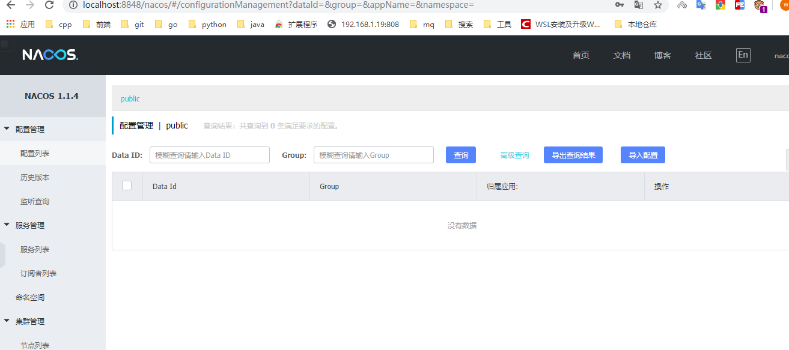
# 依赖管理
## 概述 
>>  当前 Spring Cloud Alibaba 的 0.2.1.RELEASE 版本基于 Spring Cloud Finchley（F）开发，故在选择 Spring Boot 版本时不要使用 2.1.0 及以上版本（因为 2.1.x 版本必须使用 Spring Cloud Greenwich，俗称 G 版），请使用官方 Demo 中使用的 2.0.6.RELEASE，以免发生意想不到的问题（比如服务无法注册到服务器）  

Spring Cloud Alibaba 项目都是基于 Spring Cloud，而 Spring Cloud 项目又是基于 Spring Boot 进行开发，并且都是使用 Maven 做项目管理工具。在实际开发中，我们一般都会创建一个依赖管理项目作为 Maven 的 Parent 项目使用，这样做可以极大的方便我们对 Jar 包版本的统一管理。  
依赖项目的pom.xml 
```
<?xml version="1.0" encoding="UTF-8"?>
<project xmlns="http://maven.apache.org/POM/4.0.0" xmlns:xsi="http://www.w3.org/2001/XMLSchema-instance"
         xsi:schemaLocation="http://maven.apache.org/POM/4.0.0 http://maven.apache.org/xsd/maven-4.0.0.xsd">
    <modelVersion>4.0.0</modelVersion>

    <parent>
        <groupId>org.springframework.boot</groupId>
        <artifactId>spring-boot-starter-parent</artifactId>
        <version>2.0.6.RELEASE</version>
    </parent>

    <groupId>com.funtl</groupId>
    <artifactId>hello-spring-cloud-alibaba-dependencies</artifactId>
    <version>1.0.0-SNAPSHOT</version>
    <packaging>pom</packaging>

    <name>hello-spring-cloud-alibaba-dependencies</name>
    <url>http://www.funtl.com</url>
    <inceptionYear>2018-Now</inceptionYear>

    <properties>
        <!-- Environment Settings -->
        <java.version>1.8</java.version>
        <project.build.sourceEncoding>UTF-8</project.build.sourceEncoding>
        <project.reporting.outputEncoding>UTF-8</project.reporting.outputEncoding>

        <!-- Spring Settings -->
        <spring-cloud.version>Finchley.SR2</spring-cloud.version>
        <spring-cloud-alibaba.version>0.2.1.RELEASE</spring-cloud-alibaba.version>
    </properties>

    <dependencyManagement>
        <dependencies>
            <dependency>
                <groupId>org.springframework.cloud</groupId>
                <artifactId>spring-cloud-dependencies</artifactId>
                <version>${spring-cloud.version}</version>
                <type>pom</type>
                <scope>import</scope>
            </dependency>
            <dependency>
                <groupId>org.springframework.cloud</groupId>
                <artifactId>spring-cloud-alibaba-dependencies</artifactId>
                <version>${spring-cloud-alibaba.version}</version>
                <type>pom</type>
                <scope>import</scope>
            </dependency>
        </dependencies>
    </dependencyManagement>

    <build>
        <plugins>
            <!-- Compiler 插件, 设定 JDK 版本 -->
            <plugin>
                <groupId>org.apache.maven.plugins</groupId>
                <artifactId>maven-compiler-plugin</artifactId>
                <configuration>
                    <showWarnings>true</showWarnings>
                </configuration>
            </plugin>

            <!-- 打包 jar 文件时，配置 manifest 文件，加入 lib 包的 jar 依赖 -->
            <plugin>
                <groupId>org.apache.maven.plugins</groupId>
                <artifactId>maven-jar-plugin</artifactId>
                <configuration>
                    <archive>
                        <addMavenDescriptor>false</addMavenDescriptor>
                    </archive>
                </configuration>
                <executions>
                    <execution>
                        <configuration>
                            <archive>
                                <manifest>
                                    <!-- Add directory entries -->
                                    <addDefaultImplementationEntries>true</addDefaultImplementationEntries>
                                    <addDefaultSpecificationEntries>true</addDefaultSpecificationEntries>
                                    <addClasspath>true</addClasspath>
                                </manifest>
                            </archive>
                        </configuration>
                    </execution>
                </executions>
            </plugin>

            <!-- resource -->
            <plugin>
                <groupId>org.apache.maven.plugins</groupId>
                <artifactId>maven-resources-plugin</artifactId>
            </plugin>

            <!-- install -->
            <plugin>
                <groupId>org.apache.maven.plugins</groupId>
                <artifactId>maven-install-plugin</artifactId>
            </plugin>

            <!-- clean -->
            <plugin>
                <groupId>org.apache.maven.plugins</groupId>
                <artifactId>maven-clean-plugin</artifactId>
            </plugin>

            <!-- ant -->
            <plugin>
                <groupId>org.apache.maven.plugins</groupId>
                <artifactId>maven-antrun-plugin</artifactId>
            </plugin>

            <!-- dependency -->
            <plugin>
                <groupId>org.apache.maven.plugins</groupId>
                <artifactId>maven-dependency-plugin</artifactId>
            </plugin>
        </plugins>

        <pluginManagement>
            <plugins>
                <!-- Java Document Generate -->
                <plugin>
                    <groupId>org.apache.maven.plugins</groupId>
                    <artifactId>maven-javadoc-plugin</artifactId>
                    <executions>
                        <execution>
                            <phase>prepare-package</phase>
                            <goals>
                                <goal>jar</goal>
                            </goals>
                        </execution>
                    </executions>
                </plugin>

                <!-- YUI Compressor (CSS/JS压缩) -->
                <plugin>
                    <groupId>net.alchim31.maven</groupId>
                    <artifactId>yuicompressor-maven-plugin</artifactId>
                    <version>1.5.1</version>
                    <executions>
                        <execution>
                            <phase>prepare-package</phase>
                            <goals>
                                <goal>compress</goal>
                            </goals>
                        </execution>
                    </executions>
                    <configuration>
                        <encoding>UTF-8</encoding>
                        <jswarn>false</jswarn>
                        <nosuffix>true</nosuffix>
                        <linebreakpos>30000</linebreakpos>
                        <force>true</force>
                        <includes>
                            <include>**/*.js</include>
                            <include>**/*.css</include>
                        </includes>
                        <excludes>
                            <exclude>**/*.min.js</exclude>
                            <exclude>**/*.min.css</exclude>
                        </excludes>
                    </configuration>
                </plugin>
            </plugins>
        </pluginManagement>

        <!-- 资源文件配置 -->
        <resources>
            <resource>
                <directory>src/main/java</directory>
                <excludes>
                    <exclude>**/*.java</exclude>
                </excludes>
            </resource>
            <resource>
                <directory>src/main/resources</directory>
            </resource>
        </resources>
    </build>

    <repositories>
        <repository>
            <id>aliyun-repos</id>
            <name>Aliyun Repository</name>
            <url>http://maven.aliyun.com/nexus/content/groups/public</url>
            <releases>
                <enabled>true</enabled>
            </releases>
            <snapshots>
                <enabled>false</enabled>
            </snapshots>
        </repository>

        <repository>
            <id>sonatype-repos</id>
            <name>Sonatype Repository</name>
            <url>https://oss.sonatype.org/content/groups/public</url>
            <releases>
                <enabled>true</enabled>
            </releases>
            <snapshots>
                <enabled>false</enabled>
            </snapshots>
        </repository>
        <repository>
            <id>sonatype-repos-s</id>
            <name>Sonatype Repository</name>
            <url>https://oss.sonatype.org/content/repositories/snapshots</url>
            <releases>
                <enabled>false</enabled>
            </releases>
            <snapshots>
                <enabled>true</enabled>
            </snapshots>
        </repository>

        <repository>
            <id>spring-snapshots</id>
            <name>Spring Snapshots</name>
            <url>https://repo.spring.io/snapshot</url>
            <snapshots>
                <enabled>true</enabled>
            </snapshots>
        </repository>
        <repository>
            <id>spring-milestones</id>
            <name>Spring Milestones</name>
            <url>https://repo.spring.io/milestone</url>
            <snapshots>
                <enabled>false</enabled>
            </snapshots>
        </repository>
    </repositories>

    <pluginRepositories>
        <pluginRepository>
            <id>aliyun-repos</id>
            <name>Aliyun Repository</name>
            <url>http://maven.aliyun.com/nexus/content/groups/public</url>
            <releases>
                <enabled>true</enabled>
            </releases>
            <snapshots>
                <enabled>false</enabled>
            </snapshots>
        </pluginRepository>
    </pluginRepositories>
</project>
```
* parent:继承了SpingBoot的Parent,表示是一个SpringBoot工程
* package: pom
* spring-cloud-alibaba-dependencies: properties 配置中预定义了版本号为 0.2.1.RELEASE ，表示我们的 Spring Cloud Alibaba 对应的是 Spring Cloud Finchley 版本
* build:配置了项目所需要的各种插件
* repositories: 配置项目下载依赖时的第三方库  
## 依赖版本说明  
项目的最新版本是 0.2.1.RELEASE 和 0.1.1.RELEASE，版本 0.2.1.RELEASE 对应的是 Spring Cloud Finchley 版本，版本 0.1.1.RELEASE 对应的是 Spring Cloud Edgware 版本。  

>>  小提示:截止到博客发表时间 2019 年 01 月 05 日，项目还处在孵化阶段，故所有版本号都以 0 开头；后续肯定会有很多强大的功能帮助我们更好的实现分布式应用的开发；  

## 与springCloudNetfix的区别  
  

# 服务提供者 
## 创建项目
以依赖项目为父项目  
添加web,监控,和服务发现依赖
```
<?xml version="1.0" encoding="UTF-8"?>
<project xmlns="http://maven.apache.org/POM/4.0.0"
         xmlns:xsi="http://www.w3.org/2001/XMLSchema-instance"
         xsi:schemaLocation="http://maven.apache.org/POM/4.0.0 http://maven.apache.org/xsd/maven-4.0.0.xsd">
    <!--<parent>-->
        <!--<groupId>com.funtl</groupId>-->
        <!--<artifactId>hello-spring-cloud-alibaba-dependencies</artifactId>-->
        <!--<version>1.0.0-SNAPSHOT</version>-->
        <!--<relativePath>../hello-spring-cloud-alibaba-dependencies/pom.xml</relativePath>-->
    <!--</parent>-->

    <parent>
        <groupId>cn.riversky</groupId>
        <artifactId>spring-cloud-alibaba-my-dependences</artifactId>
        <version>1.0.0-SNAPSHOT</version>
        <relativePath>../spring-cloud-alibaba-my-dependences/pom.xml</relativePath>
    </parent>
    <modelVersion>4.0.0</modelVersion>

    <artifactId>spring-cloud-alibaba-nacos-hello-service</artifactId>
    <packaging>jar</packaging>
    <dependencies>
        <dependency>
            <groupId>org.springframework.boot</groupId>
            <artifactId>spring-boot-starter-web</artifactId>
        </dependency>
        <dependency>
            <groupId>org.springframework.boot</groupId>
            <artifactId>spring-boot-starter-actuator</artifactId>
        </dependency>
        <!-- Spring Cloud Begin -->
        <dependency>
            <groupId>org.springframework.cloud</groupId>
            <artifactId>spring-cloud-starter-alibaba-nacos-discovery</artifactId>
        </dependency>
        <!-- Spring Cloud End -->
    </dependencies>
</project>
```
配置文件
```
spring:
  application:
    name: nacos-provider
  cloud:
    nacos:
      discovery:
        server-addr: localhost:8848
server:
  port: 10000
management:
  endpoints:
    web:
      exposure:
        include: "*"
```
启动类
```
package cn.riversky.spring.cloud.nacos.service;

import org.springframework.boot.SpringApplication;
import org.springframework.boot.autoconfigure.SpringBootApplication;
import org.springframework.cloud.client.discovery.EnableDiscoveryClient;
import org.springframework.web.bind.annotation.GetMapping;
import org.springframework.web.bind.annotation.PathVariable;
import org.springframework.web.bind.annotation.RestController;

/**
 * @author riversky
 * @date 2019/11/27
 **/
@SpringBootApplication
@EnableDiscoveryClient
public class HelloApplicationProvider {
    public static void main(String[] args) {
        SpringApplication.run(HelloApplicationProvider.class,args);
    }
    @RestController
    public class EchoController{
        @GetMapping("echo/{message}")
        public String echo(@PathVariable String message){
            return "hello nacos discovery"+message;
        }
    }
}
```
启动后即可进行检查  
* 可用性检查  
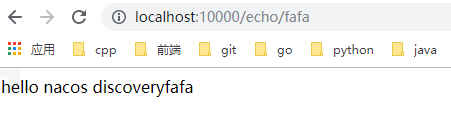  
* 端点检查
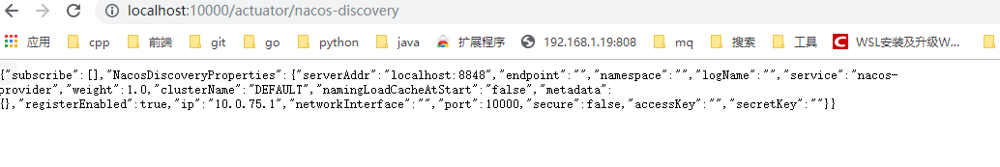  
* 服务检查
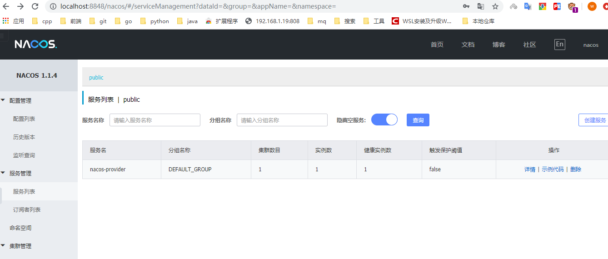  
## 配置增强  

| 配置项          | Key                                            | 默认值                     | 说明                                                                                             |
|-----------------|------------------------------------------------|----------------------------|--------------------------------------------------------------------------------------------------|
| 服务端地址      | spring.cloud.nacos.discovery.server-addr       | 无                         | Nacos Server 启动监听的ip地址和端口                                                              |
| 服务名          | spring.cloud.nacos.discovery.service           | ${spring.application.name} | 给当前的服务命名                                                                                 |
| 权重            | spring.cloud.nacos.discovery.weight            | 1                          | 取值范围 1 到 100，数值越大，权重越大                                                            |
| 网卡名          | spring.cloud.nacos.discovery.network-interface | 无                         | 当IP未配置时，注册的IP为此网卡所对应的IP地址，如果此项也未配置，则默认取第一块网卡的地址         |
| 注册的IP地址    | spring.cloud.nacos.discovery.ip                | 无                         | 优先级最高                                                                                       |
| 注册的端口      | spring.cloud.nacos.discovery.port              | -1                         | 默认情况下不用配置，会自动探测                                                                   |
| 命名空间        | spring.cloud.nacos.discovery.namespace         | 无                         | 常用场景之一是不同环境的注册的区分隔离，例如开发测试环境和生产环境的资源（如配置、服务）隔离等。 |
| AccessKey       | spring.cloud.nacos.discovery.access-key        | 无                         | 当要上阿里云时，阿里云上面的一个云账号名                                                         |
| SecretKey       | spring.cloud.nacos.discovery.secret-key        | 无                         | 当要上阿里云时，阿里云上面的一个云账号密码                                                       |
| Metadata        | spring.cloud.nacos.discovery.metadata          | 无                         | 使用 Map 格式配置，用户可以根据自己的需要自定义一些和服务相关的元数据信息                        |
| 日志文件名      | spring.cloud.nacos.discovery.log-name          | 无                         |                                                                                                  |
| 接入点          | spring.cloud.nacos.discovery.enpoint           | UTF-8                      | 地域的某个服务的入口域名，通过此域名可以动态地拿到服务端地址                                     |
| 是否集成 Ribbon | ribbon.nacos.enabled                           | true                       | 一般都设置成 true 即可                                                                           |

# 服务消费者-RestTemplate方案
## 概述
服务消费者的创建与服务提供者大同小异，这里采用最原始的一种方式，即显示的使用 LoadBalanceClient 和 RestTemplate 结合的方式来访问。  
其实就是Ribbon方案  
## Pom 
```
<?xml version="1.0" encoding="UTF-8"?>
<project xmlns="http://maven.apache.org/POM/4.0.0" xmlns:xsi="http://www.w3.org/2001/XMLSchema-instance"
         xsi:schemaLocation="http://maven.apache.org/POM/4.0.0 http://maven.apache.org/xsd/maven-4.0.0.xsd">
    <modelVersion>4.0.0</modelVersion>

    <parent>
        <groupId>cn.riversky</groupId>
        <artifactId>spring-cloud-alibaba-my-dependences</artifactId>
        <version>1.0.0-SNAPSHOT</version>
        <relativePath>../spring-cloud-alibaba-my-dependences/pom.xml</relativePath>
    </parent>

    <artifactId>spring-cloud-alibab-nacos-rest-cosumer</artifactId>
    <packaging>jar</packaging>

    <name>spring-cloud-alibab-nacos-rest-cosumer</name>

    <dependencies>
        <!-- Spring Boot Begin -->
        <dependency>
            <groupId>org.springframework.boot</groupId>
            <artifactId>spring-boot-starter-web</artifactId>
        </dependency>
        <dependency>
            <groupId>org.springframework.boot</groupId>
            <artifactId>spring-boot-starter-actuator</artifactId>
        </dependency>
        <dependency>
            <groupId>org.springframework.boot</groupId>
            <artifactId>spring-boot-starter-test</artifactId>
            <scope>test</scope>
        </dependency>
        <!-- Spring Boot End -->

        <!-- Spring Cloud Begin -->
        <dependency>
            <groupId>org.springframework.cloud</groupId>
            <artifactId>spring-cloud-starter-alibaba-nacos-discovery</artifactId>
        </dependency>
        <!-- Spring Cloud End -->
    </dependencies>

    <build>
        <plugins>
            <plugin>
                <groupId>org.springframework.boot</groupId>
                <artifactId>spring-boot-maven-plugin</artifactId>
                <configuration>
                    <mainClass>com.funtl.hello.spring.cloud.alibaba.nacos.consumer.NacosConsumerApplication</mainClass>
                </configuration>
            </plugin>
        </plugins>
    </build>
</project>
```
配置
```
spring:
  application:
    name: nacos-consumer
  cloud:
    nacos:
      discovery:
        server-addr: localhost:8848
server:
  port: 10002
management:
  endpoints:
    web:
      exposure:
        include: "*"
```
配置客户restTemplate
```
package cn.riversky.spring.cloud.alibaba.nacos.config;

import org.springframework.context.annotation.Bean;
import org.springframework.context.annotation.Configuration;
import org.springframework.web.client.RestTemplate;

/**
 * @author riversky
 * @date 2019/11/27
 **/
@Configuration
public class NacosConsumerConfiguration {
    @Bean
    public RestTemplate restTemplate(){
        return new RestTemplate();
    }
}
```
```
package cn.riversky.spring.cloud.alibaba.nacos.controller;

import org.springframework.beans.factory.annotation.Autowired;
import org.springframework.beans.factory.annotation.Value;
import org.springframework.cloud.client.ServiceInstance;
import org.springframework.cloud.client.loadbalancer.LoadBalancerClient;
import org.springframework.web.bind.annotation.GetMapping;
import org.springframework.web.bind.annotation.RestController;
import org.springframework.web.client.RestTemplate;

/**
 * @author riversky
 * @date 2019/11/27
 **/
@RestController
public class NacosConsumerRestController {
    @Autowired
    private LoadBalancerClient loadBalancerClient;
    @Autowired
    private RestTemplate restTemplate;
    @Value("${spring.application.name}")
    private String appName;
    @GetMapping(value = "echo/app/name")
    public String echo(){
        ServiceInstance choose = loadBalancerClient.choose("nacos-provider");
        String url = String.format("http://%s:%s/echo/%s", choose.getHost(), choose.getPort(), appName);
        return restTemplate.getForObject(url,String.class);
    }
}
```
```
package cn.riversky.spring.cloud.alibaba.nacos;

import org.springframework.boot.SpringApplication;
import org.springframework.boot.autoconfigure.SpringBootApplication;
import org.springframework.cloud.client.discovery.EnableDiscoveryClient;

/**
 * @author riversky
 * @date 2019/11/27
 **/
@SpringBootApplication
@EnableDiscoveryClient
public class RestComsumerApplication {
    public static void main(String[] args) {
        SpringApplication.run(RestComsumerApplication.class,args);
    }
}
```
服务详情  
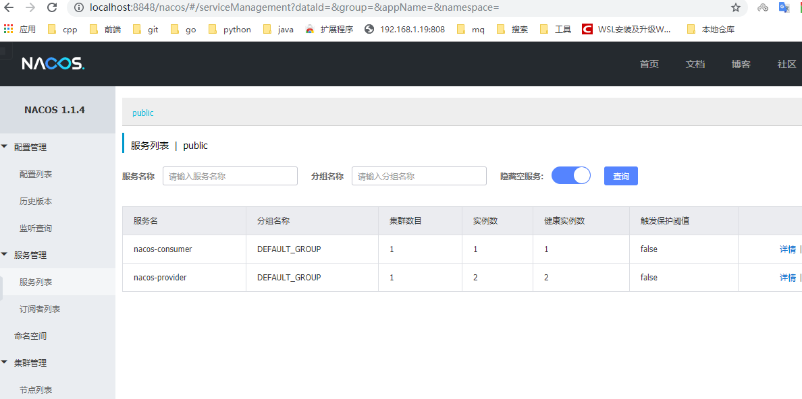  
负载均衡策略测试  
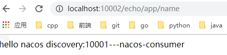  
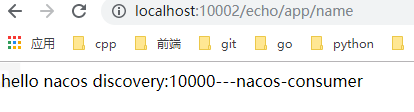  

# feign服务消费者  
创建项目  spring-cloud-alibaba-nacos-feign-consumer
pom文件  
主要是添加服务发现以及openFeign
```
<?xml version="1.0" encoding="UTF-8"?>
<project xmlns="http://maven.apache.org/POM/4.0.0" xmlns:xsi="http://www.w3.org/2001/XMLSchema-instance"
         xsi:schemaLocation="http://maven.apache.org/POM/4.0.0 http://maven.apache.org/xsd/maven-4.0.0.xsd">
    <modelVersion>4.0.0</modelVersion>

    <parent>
        <groupId>cn.riversky</groupId>
        <artifactId>spring-cloud-alibaba-my-dependences</artifactId>
        <version>1.0.0-SNAPSHOT</version>
        <relativePath>../spring-cloud-alibaba-my-dependences/pom.xml</relativePath>
    </parent>

    <artifactId>spring-cloud-alibaba-nacos-feign-consumer</artifactId>
    <packaging>jar</packaging>

    <name>hello-spring-cloud-alibaba-nacos-consumer-feign</name>
    <url>http://www.funtl.com</url>
    <inceptionYear>2018-Now</inceptionYear>

    <dependencies>
        <!-- Spring Boot Begin -->
        <dependency>
            <groupId>org.springframework.boot</groupId>
            <artifactId>spring-boot-starter-web</artifactId>
        </dependency>
        <dependency>
            <groupId>org.springframework.boot</groupId>
            <artifactId>spring-boot-starter-actuator</artifactId>
        </dependency>
        <dependency>
            <groupId>org.springframework.boot</groupId>
            <artifactId>spring-boot-starter-test</artifactId>
            <scope>test</scope>
        </dependency>
        <!-- Spring Boot End -->

        <!-- Spring Cloud Begin -->
        <dependency>
            <groupId>org.springframework.cloud</groupId>
            <artifactId>spring-cloud-starter-alibaba-nacos-discovery</artifactId>
        </dependency>
        <dependency>
            <groupId>org.springframework.cloud</groupId>
            <artifactId>spring-cloud-starter-openfeign</artifactId>
        </dependency>
        <!-- Spring Cloud End -->
    </dependencies>

    <build>
        <plugins>
            <plugin>
                <groupId>org.springframework.boot</groupId>
                <artifactId>spring-boot-maven-plugin</artifactId>
                <configuration>
                    <mainClass>com.funtl.hello.spring.cloud.alibaba.nacos.consumer.feign.NacosConsumerFeignApplication</mainClass>
                </configuration>
            </plugin>
        </plugins>
    </build>
</project>
```
Feign接口  
```
package cn.riversky.spring.cloud.alibaba.nacos.service;

import org.springframework.cloud.openfeign.FeignClient;
import org.springframework.web.bind.annotation.GetMapping;
import org.springframework.web.bind.annotation.PathVariable;

@FeignClient(value = "nacos-provider")
public interface EchoService {
    @GetMapping(value = "/echo/{message}")
    String echo(@PathVariable("message") String message);
}
```
控制器
```
package cn.riversky.spring.cloud.alibaba.nacos.controller;

import cn.riversky.spring.cloud.alibaba.nacos.service.EchoService;
import org.springframework.beans.factory.annotation.Autowired;
import org.springframework.web.bind.annotation.GetMapping;
import org.springframework.web.bind.annotation.RestController;

/**
 * @author riversky
 * @date 2019/11/27
 **/
@RestController
public class NacosConsumerFeignController {
    @Autowired
    private EchoService echoService;

    @GetMapping(value = "echo/hi")
    public String echo(){
        return echoService.echo("Hi Feign");
    }
}
```
入口类  
```
package cn.riversky.spring.cloud.alibaba.nacos;

import org.springframework.boot.SpringApplication;
import org.springframework.boot.autoconfigure.SpringBootApplication;
import org.springframework.cloud.client.discovery.EnableDiscoveryClient;
import org.springframework.cloud.openfeign.EnableFeignClients;

/**
 * @author riversky
 * @date 2019/11/27
 **/
@SpringBootApplication
@EnableDiscoveryClient
@EnableFeignClients
public class FeignConsumerApplication {
    public static void main(String[] args) {
        SpringApplication.run(FeignConsumerApplication.class,args);
    }
}
```
配置文件  
```
spring:
  application:
    name: nacos-consumer-feign
  cloud:
    nacos:
      discovery:
        server-addr: 127.0.0.1:8848

server:
  port: 10003

management:
  endpoints:
    web:
      exposure:
        include: "*"
```
服务发现测试  
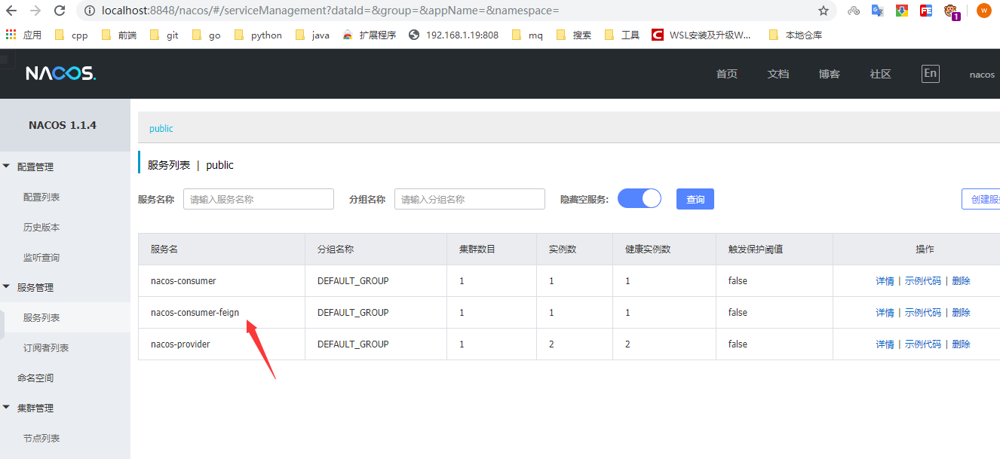  
服务测试 
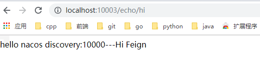   
# 熔断器  
## 概述  
在微服务架构中，根据业务来拆分成一个个的服务，服务与服务之间可以通过 RPC 相互调用，在 Spring Cloud 中可以用 RestTemplate + LoadBalanceClient 和 Feign 来调用。为了保证其高可用，单个服务通常会集群部署。由于网络原因或者自身的原因，服务并不能保证 100% 可用，如果单个服务出现问题，调用这个服务就会出现线程阻塞，此时若有大量的请求涌入，Servlet 容器的线程资源会被消耗完毕，导致服务瘫痪。服务与服务之间的依赖性，故障会传播，会对整个微服务系统造成灾难性的严重后果，这就是服务故障的 “雪崩” 效应。  
为了解决这个问题，业界提出了熔断器模型。  
阿里巴巴开源了 Sentinel 组件，实现了熔断器模式，Spring Cloud 对这一组件进行了整合。在微服务架构中，一个请求需要调用多个服务是非常常见的，如下图：  
  
较底层的服务如果出现故障，会导致连锁故障。当对特定的服务的调用的不可用达到一个阀值熔断器将会被打开。  
  
熔断器打开后，为了避免连锁故障，通过 fallback 方法可以直接返回一个固定值。  
## Sentinel
随着微服务的流行，服务和服务之间的稳定性变得越来越重要。 Sentinel 以流量为切入点，从流量控制、熔断降级、系统负载保护等多个维度保护服务的稳定性。  
### Sentinel的特点 
* 丰富的应用场景:Sentinel 承接了阿里巴巴近 10 年的 双十一大促流量 的核心场景，例如秒杀（即突发流量控制在系统容量可以承受的范围）、消息削峰填谷、实时熔断下游不可用应用等。  
* 完备的实时监控： Sentinel 同时提供实时的监控功能。您可以在控制台中看到接入应用的单台机器秒级数据，甚至 500 台以下规模的集群的汇总运行情况。  
* 广泛的开源生态： Sentinel 提供开箱即用的与其它开源框架/库的整合模块，例如与 Spring Cloud、Dubbo、gRPC 的整合。您只需要引入相应的依赖并进行简单的配置即可快速地接入 Sentinel。  
* 完善的 SPI 扩展点： Sentinel 提供简单易用、完善的 SPI 扩展点。您可以通过实现扩展点，快速的定制逻辑。例如定制规则管理、适配数据源等。  

  
### 安装  
```
git clone  https://github.com/Liwins/sentinel-docker-compose.git
cd sentinel-docker-compose
docker-compose up -d 
```

## Feign中使用Sentinel
主要是做消费者的防雪崩,或调用失败等场景  
在Feign中使用时需要添加pom.xml的依赖为
```
<dependency>
    <groupId>org.springframework.cloud</groupId>
    <artifactId>spring-cloud-starter-alibaba-sentinel</artifactId>
</dependency>
```
配置文件支持 
```
spring:
  application:
    name: nacos-consumer-feign
  cloud:
    nacos:
      discovery:
        server-addr: 127.0.0.1:8848
    sentinel:
      transport:
        dashboard: 127.0.0.1:8858
        port: 8719
feign:
  sentinel:
    enabled: true
server:
  port: 10003

management:
  endpoints:
    web:
      exposure:
        include: "*"
```
创建熔断器默认实现  
```
package cn.riversky.spring.cloud.alibaba.nacos.service.feign;

import cn.riversky.spring.cloud.alibaba.nacos.service.EchoService;
import org.springframework.stereotype.Component;

/**
 * @author riversky
 * @date 2019/11/28
 **/
@Component
public class EchoServiceFallback implements EchoService
{
    @Override
    public String echo(String message) {
        return "echo fallback";
    }
}
```
fallback设置
```
package cn.riversky.spring.cloud.alibaba.nacos.service;

import cn.riversky.spring.cloud.alibaba.nacos.service.feign.EchoServiceFallback;
import org.springframework.cloud.openfeign.FeignClient;
import org.springframework.web.bind.annotation.GetMapping;
import org.springframework.web.bind.annotation.PathVariable;

@FeignClient(value = "nacos-provider",fallback = EchoServiceFallback.class)
public interface EchoService {
    @GetMapping(value = "/echo/{message}")
    String echo(@PathVariable("message") String message);
}
```
测试
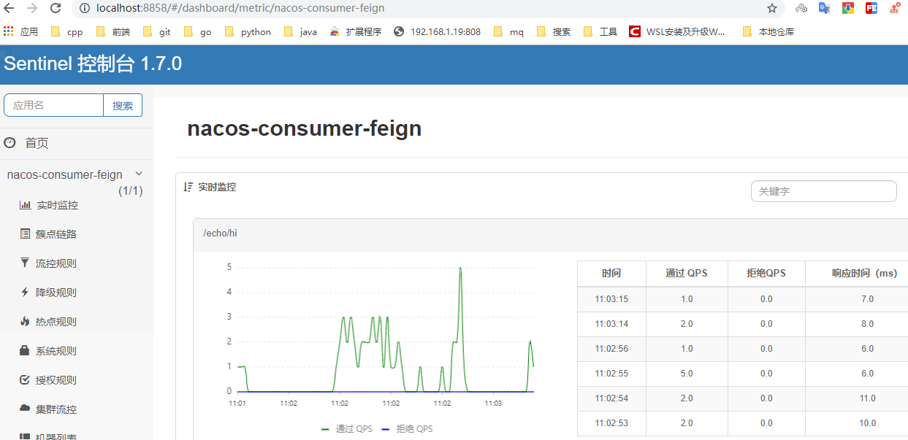  
# 路由网关统一访问接口  
## 什么是Spring Cloud GateWay
Spring Cloud Gateway 是 Spring 官方基于 Spring 5.0，Spring Boot 2.0 和 Project Reactor 等技术开发的网关，Spring Cloud Gateway 旨在为微服务架构提供一种简单而有效的统一的 API 路由管理方式。Spring Cloud Gateway 作为 Spring Cloud 生态系中的网关，目标是替代 Netflix ZUUL，其不仅提供统一的路由方式，并且基于 Filter 链的方式提供了网关基本的功能，例如：安全，监控/埋点，和限流等。  
  
## 特点 
*  基于 Spring Framework 5，Project Reactor 和 Spring Boot 2.0
*  动态路由
*  Predicates 和 Filters 作用于特定路由
*  集成 Hystrix 断路器
*  集成 Spring Cloud DiscoveryClient
*  易于编写的 Predicates 和 Filters
*  限流
*  路径重写

## 工程流程 
  
客户端向 Spring Cloud Gateway 发出请求。然后在 Gateway Handler Mapping 中找到与请求相匹配的路由，将其发送到 Gateway Web Handler。Handler 再通过指定的过滤器链来将请求发送到我们实际的服务执行业务逻辑，然后返回。  
过滤器之间用虚线分开是因为过滤器可能会在发送代理请求之前（pre）或之后（post）执行业务逻辑。  
## 项目构建
spring-cloud-alibaba-nacos-gateway项目  
```
<?xml version="1.0" encoding="UTF-8"?>
<project xmlns="http://maven.apache.org/POM/4.0.0" xmlns:xsi="http://www.w3.org/2001/XMLSchema-instance"
         xsi:schemaLocation="http://maven.apache.org/POM/4.0.0 http://maven.apache.org/xsd/maven-4.0.0.xsd">
    <modelVersion>4.0.0</modelVersion>

    <parent>
        <groupId>cn.riversky</groupId>
        <artifactId>spring-cloud-alibaba-my-dependences</artifactId>
        <version>1.0.0-SNAPSHOT</version>
        <relativePath>../spring-cloud-alibaba-my-dependences/pom.xml</relativePath>
    </parent>

    <artifactId>spring-cloud-alibaba-nacos-gateway</artifactId>
    <packaging>jar</packaging>

    <name>spring-cloud-alibaba-nacos-gateway</name>

    <dependencies>
        <!-- Spring Boot Begin -->
        <dependency>
            <groupId>org.springframework.boot</groupId>
            <artifactId>spring-boot-starter-actuator</artifactId>
        </dependency>
        <dependency>
            <groupId>org.springframework.boot</groupId>
            <artifactId>spring-boot-starter-test</artifactId>
            <scope>test</scope>
        </dependency>
        <!-- Spring Boot End -->

        <!-- Spring Cloud Begin -->
        <dependency>
            <groupId>org.springframework.cloud</groupId>
            <artifactId>spring-cloud-starter-alibaba-nacos-discovery</artifactId>
        </dependency>
        <dependency>
            <groupId>org.springframework.cloud</groupId>
            <artifactId>spring-cloud-starter-alibaba-sentinel</artifactId>
        </dependency>
        <dependency>
            <groupId>org.springframework.cloud</groupId>
            <artifactId>spring-cloud-starter-openfeign</artifactId>
        </dependency>
        <dependency>
            <groupId>org.springframework.cloud</groupId>
            <artifactId>spring-cloud-starter-gateway</artifactId>
        </dependency>
        <!-- Spring Cloud End -->

        <!-- Commons Begin -->
        <dependency>
            <groupId>javax.servlet</groupId>
            <artifactId>javax.servlet-api</artifactId>
        </dependency>
        <!-- Commons Begin -->
    </dependencies>

    <build>
        <plugins>
            <plugin>
                <groupId>org.springframework.boot</groupId>
                <artifactId>spring-boot-maven-plugin</artifactId>
                <configuration>
                    <mainClass>com.funtl.hello.spring.cloud.gateway.GatewayApplication</mainClass>
                </configuration>
            </plugin>
        </plugins>
    </build>
</project>
```
>>  Spring Cloud Gateway 不使用 Web 作为服务器，而是 使用 WebFlux 作为服务器，Gateway 项目已经依赖了 starter-webflux，所以这里 千万不要依赖 starter-web  
由于过滤器等功能依然需要 Servlet 支持，故这里还需要依赖 javax.servlet:javax.servlet-api  

配置文件  
```
spring:
  application:
    name: spring-gateway

  cloud:
    nacos:
      discovery:
        server-addr: localhost:8848
    sentinel:
      transport:
        dashboard: localhost:8858
        port: 8721
      #    路由网关配置
    gateway:
#      设置与服务发现组件结合,这样可以采用服务名的路由策略
      discovery:
        locator:
          enabled: true
      routes:
        - id: NACOS-CONSUMER-FEIGN
          uri: lb://nacos-consumer-feign
          predicates:
            - Method=GET,POST
        - id: NACOS-CONSUMER
          uri: lb://nacos-consumer
          predicates:
            - Method=GET,POST
server:
  port: 10006
feign.sentinel.enable: true
management:
  endpoints:
    web:
      exposure:
        include: "*"
logging:
  level:
    org.springframework.cloud.gateway: debug
```
启动类  
```
package cn.riversky.spring.cloud.alibaba.nacos;

import org.springframework.boot.SpringApplication;
import org.springframework.boot.autoconfigure.SpringBootApplication;
import org.springframework.cloud.client.discovery.EnableDiscoveryClient;
import org.springframework.cloud.openfeign.EnableFeignClients;

/**
 * @author riversky
 * @date 2019/11/29
 **/
@SpringBootApplication
@EnableDiscoveryClient
@EnableFeignClients
public class GateWayApplication {
    public static void main(String[] args) {
        SpringApplication.run(GateWayApplication.class,args);
    }
}
```
## 全局过滤功能  
### 概述  
全局过滤器作用于所有的路由，不需要单独配置，我们可以用它来实现很多统一化处理的业务需求，比如权限认证，IP 访问限制等等。  
### 声明周期  
Spring Cloud Gateway 基于 Project Reactor 和 WebFlux，采用响应式编程风格，打开它的 Filter 的接口 GlobalFilter 你会发现它只有一个方法 filter。  
### 创建全局过滤器  
实现 GlobalFilter, Ordered 接口并在类上增加 @Component 注解就可以使用过滤功能了，非常简单方便  
以bean的方式放入spring容器中即可
```
package cn.riversky.spring.cloud.alibaba.nacos.config;

import com.alibaba.fastjson.JSON;
import com.google.common.collect.Maps;
import org.springframework.cloud.gateway.filter.GatewayFilterChain;
import org.springframework.cloud.gateway.filter.GlobalFilter;
import org.springframework.core.Ordered;
import org.springframework.core.io.buffer.DataBuffer;
import org.springframework.http.HttpStatus;
import org.springframework.http.server.reactive.ServerHttpResponse;
import org.springframework.stereotype.Component;
import org.springframework.util.StringUtils;
import org.springframework.web.server.ServerWebExchange;
import reactor.core.publisher.Mono;

import javax.servlet.http.HttpSession;
import java.util.HashMap;

/**
 * @author riversky
 * @date 2019/11/29
 **/
@Component
public class AuthFilter implements GlobalFilter, Ordered {
    @Override
    public Mono<Void> filter(ServerWebExchange exchange, GatewayFilterChain chain) {
        String token = exchange.getRequest().getQueryParams().getFirst("token");
        if(StringUtils.isEmpty(token)){
            ServerHttpResponse response = exchange.getResponse();
            HashMap<String, Object> responSeData = Maps.newHashMap();
            responSeData.put("code",401);
            responSeData.put("message","非法请求");
            responSeData.put("cause","Token is empty");
            try{
                DataBuffer wrap = response.bufferFactory().wrap(JSON.toJSONString(responSeData).getBytes());
                response.setStatusCode(HttpStatus.UNAUTHORIZED);
                response.getHeaders().add("Content-Type","application/json;charset=UTF-8");
                return response.writeWith(Mono.just(wrap));
            }catch (Exception e){
                e.printStackTrace();
            }
        }
        return chain.filter(exchange);
    }

    /**
     * 设置过滤器的执行顺序
     * @return
     */
    @Override
    public int getOrder() {
        return Ordered.LOWEST_PRECEDENCE;
    }
}
```
### 测试结果  
```
req:http://localhost:10006/nacos-consumer-feign/echo/hi?token=bafas  
result: hello nacos discovery:10001---Hi Feign
req:http://localhost:10006/nacos-consumer-feign/echo/hi
result: {"code":401,"cause":"Token is empty","message":"非法请求"}
req: http://localhost:10006/nacos-consumer/echo/app/name
result: {"code":401,"cause":"Token is empty","message":"非法请求"}
req:http://localhost:10006/nacos-consumer/echo/app/name?token=sfa
result: hello nacos discovery:10001---nacos-consumer
```
##  使用场景
应该是所有的数据出入口
核心知识点是配置文件中的路由规则  
核心原理(利用feign达到负载均衡的效果)
并且根据路由配置进行分发数据调用  
```
routes:
        - id: NACOS-CONSUMER-FEIGN
          uri: lb://nacos-consumer-feign
          predicates:
            - Method=GET,POST
        - id: NACOS-CONSUMER
          uri: lb://nacos-consumer
          predicates:
            - Method=GET,POST
```
核心是:路由中的uri+过滤规则   

# 服务配置  
## 分布式配置中心  
在分布式系统中，由于服务数量巨多，为了方便服务配置文件统一管理，实时更新，所以需要分布式配置中心组件。  
## Nacos Config  
Nacos 提供用于存储配置和其他元数据的 key/value 存储，为分布式系统中的外部化配置提供服务器端和客户端支持。使用 Spring Cloud Alibaba Nacos Config，您可以在 Nacos Server 集中管理你 Spring Cloud 应用的外部属性配置。  
Spring Cloud Alibaba Nacos Config 是 Spring Cloud Config Server 和 Client 的替代方案，客户端和服务器上的概念与 Spring Environment 和 PropertySource 有着一致的抽象，在特殊的 bootstrap 阶段，配置被加载到 Spring 环境中。当应用程序通过部署管道从开发到测试再到生产时，您可以管理这些环境之间的配置，并确保应用程序具有迁移时需要运行的所有内容。  
## 创建配置文件  
### 服务端-Nacos配置  
一般配置两项即可,但是如果采用非properties文件的配置,则需要添加上配置的后缀
配置过程
在nacos中配置,将以前的application.yaml复制到配置中心
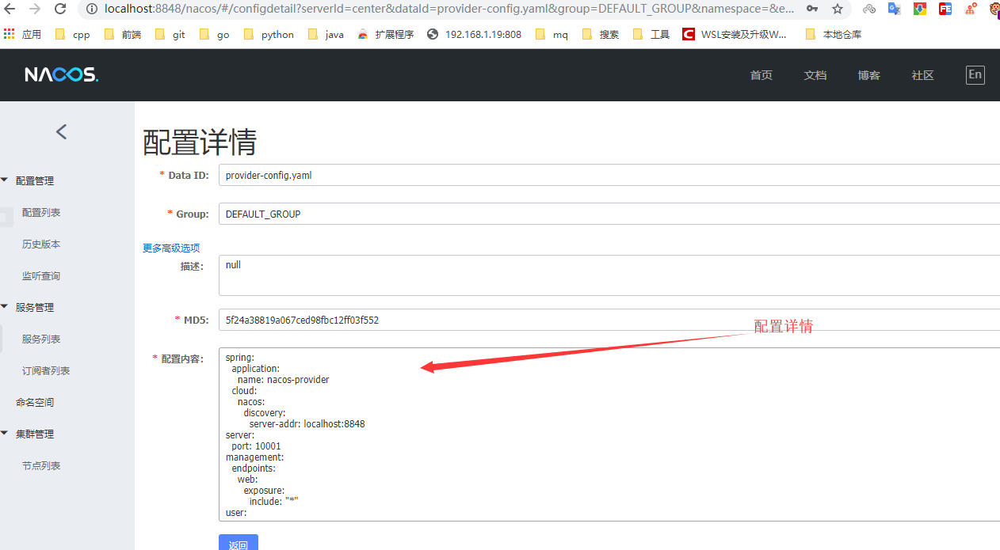  
>> DataID 即为配置文件的名称,group为项目或者配置组,配置内容为以前配置文件中的内容
### 客户端使用  
使用非常简单
1. spring-cloud依赖
```
<dependency>
            <groupId>org.springframework.cloud</groupId>
            <artifactId>spring-cloud-starter-alibaba-nacos-config</artifactId>
</dependency>
```
2. 去除旧application.*配置,添加bootstrap.properties
```
spring.application.name=provider-config
spring.cloud.nacos.config.file-extension=yaml

spring.cloud.nacos.config.server-addr=127.0.0.1:8848
#spring.cloud.nacos.config.server-addr=127.0.0.1:8848
```
3. 重启程序

容器配置重新刷新功能  
```
package cn.riversky.spring.cloud.nacos.service.controller;

import org.springframework.beans.factory.annotation.Autowired;
import org.springframework.beans.factory.annotation.Value;
import org.springframework.cloud.context.config.annotation.RefreshScope;
import org.springframework.context.ConfigurableApplicationContext;
import org.springframework.web.bind.annotation.GetMapping;
import org.springframework.web.bind.annotation.PathVariable;
import org.springframework.web.bind.annotation.RestController;

/**
 * @author riversky
 * @date 2019/11/29
 **/
@RestController
@RefreshScope
public class EchoeController {
    /**
     * 注入配置文件上下文
     */
    @Value("${server.port}")
    private String port;
    @Value("${user.name}")
    private String userName;

    @GetMapping("echo/{message}")
    public String echo(@PathVariable String message){
        return "hello :"+port+"  "+userName+"---"+message;
    }
}
```
## 多环境配置  
### spring boot profile  
我们在做项目开发的时候，生产环境和测试环境的一些配置可能会不一样，有时候一些功能也可能会不一样，所以我们可能会在上线的时候手工修改这些配置信息。但是 Spring 中为我们提供了 Profile 这个功能。我们只需要在启动的时候添加一个虚拟机参数，激活自己环境所要用的 Profile 就可以了。  
操作起来很简单，只需要为不同的环境编写专门的配置文件，如：application-dev.yml、application-prod.yml， 启动项目时只需要增加一个命令参数 --spring.profiles.active=环境配置 即可，启动命令如下：
```
java -jar *.jar --spring.profiles.active=prod
```
### nacos多环境配置  
spring-cloud-starter-alibaba-nacos-config 在加载配置的时候，不仅仅加载了以 dataid 为 ${spring.application.name}.${file-extension:properties} 为前缀的基础配置，还加载了 dataid 为 ${spring.application.name}-${profile}.${file-extension:properties} 的基础配置。在日常开发中如果遇到多套环境下的不同配置，可以通过 Spring 提供的 ${spring.profiles.active} 这个配置项来配置。  
基本跟springboot profile的方式差不多

|   | springboot                | springboot config                                                                                                                                                         | nacos                     | nacos config                                                                                                                                                                                                                                             |
|---|---------------------------|---------------------------------------------------------------------------------------------------------------------------------------------------------------------------|---------------------------|----------------------------------------------------------------------------------------------------------------------------------------------------------------------------------------------------------------------------------------------------------|
|   | bootstrap-dev.properties  | spring.application.name=provider-config spring.cloud.nacos.config.file-extension=yaml spring.profiles.active=dev spring.cloud.nacos.config.server-addr=127.0.0.1:8848     | provider-config-dev.yaml  | spring:    application:      name: nacos-provider    cloud:      nacos:        discovery:          server-addr: localhost:8848  server:    port: 20001  management:    endpoints:      web:        exposure:          include: "*"  user:    name: susan |
|   | bootstrap-prod.properties | spring.application.name=provider-config  spring.cloud.nacos.config.file-extension=yaml  spring.profiles.active=prod  spring.cloud.nacos.config.server-addr=127.0.0.1:8848 | provider-config-prod.yaml | spring:    application:      name: nacos-provider    cloud:      nacos:        discovery:          server-addr: localhost:8848  server:    port: 20003  management:    endpoints:      web:        exposure:          include: "*"  user:    name: susan |

启动
```
java -jar *.jar --spring.profiles.active=prod
```

