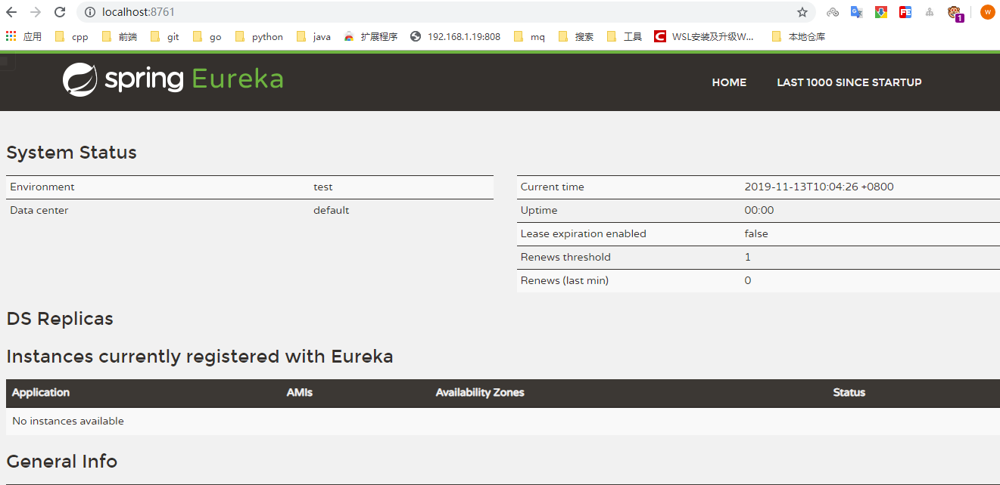
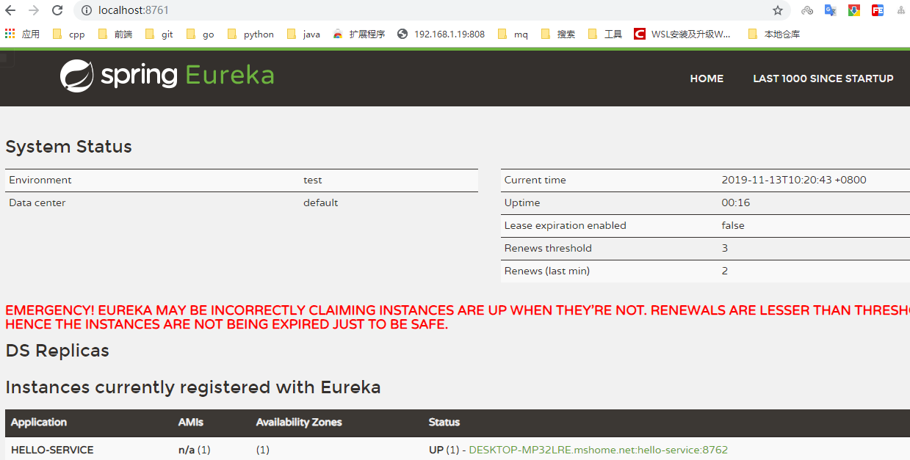
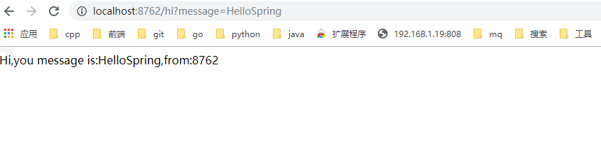

# Spring CloudNetflix
目前市场上主流的 第一套微服务架构解决方案：Spring Boot + Spring Cloud Netflix    
Spring Cloud 为开发人员提供了快速构建分布式系统中一些常见模式的工具（例如配置管理，服务发现，断路器，智能路由，微代理，控制总线）。分布式系统的协调导致了样板模式, 使用 Spring Cloud 开发人员可以快速地支持实现这些模式的服务和应用程序。他们将在任何分布式环境中运行良好，包括开发人员自己的笔记本电脑，裸机数据中心，以及 Cloud Foundry 等托管平台。  
## 简介
Spring Cloud 是一个相对比较新的微服务框架，2016 才推出 1.0 的 Release 版本. 但是其更新特别快，几乎每 1-2 个月就有一次更新，虽然 Spring Cloud 时间最短, 但是相比 Dubbo 等 RPC 框架, Spring Cloud 提供的全套的分布式系统解决方案。  
Spring Cloud 为开发者提供了在分布式系统（配置管理，服务发现，熔断，路由，微代理，控制总线，一次性 Token，全居琐，Leader 选举，分布式 Session，集群状态）中快速构建的工具，使用 Spring Cloud 的开发者可以快速的启动服务或构建应用、同时能够快速和云平台资源进行对接。
## 创建统一的依赖管理
创建统一的项目管理依赖,配置nexus私服地址
```
<?xml version="1.0" encoding="UTF-8"?>
<project xmlns="http://maven.apache.org/POM/4.0.0" xmlns:xsi="http://www.w3.org/2001/XMLSchema-instance"
         xsi:schemaLocation="http://maven.apache.org/POM/4.0.0 http://maven.apache.org/xsd/maven-4.0.0.xsd">
    <modelVersion>4.0.0</modelVersion>

    <parent>
        <groupId>org.springframework.boot</groupId>
        <artifactId>spring-boot-starter-parent</artifactId>
        <version>2.0.2.RELEASE</version>
    </parent>

    <groupId>com.funtl</groupId>
    <artifactId>hello-spring-cloud-dependencies</artifactId>
    <version>1.0.0-SNAPSHOT</version>
    <packaging>pom</packaging>

    <name>hello-spring-cloud-dependencies</name>
    <url>http://www.funtl.com</url>
    <inceptionYear>2018-Now</inceptionYear>

    <properties>
        <!-- Environment Settings -->
        <java.version>1.8</java.version>
        <project.build.sourceEncoding>UTF-8</project.build.sourceEncoding>
        <project.reporting.outputEncoding>UTF-8</project.reporting.outputEncoding>

        <!-- Spring Settings -->
        <spring-cloud.version>Finchley.RC1</spring-cloud.version>
    </properties>

    <dependencyManagement>
        <dependencies>
            <dependency>
                <groupId>org.springframework.cloud</groupId>
                <artifactId>spring-cloud-dependencies</artifactId>
                <version>${spring-cloud.version}</version>
                <type>pom</type>
                <scope>import</scope>
            </dependency>
        </dependencies>
    </dependencyManagement>

    <build>
        <plugins>
            <!-- Compiler 插件, 设定 JDK 版本 -->
            <plugin>
                <groupId>org.apache.maven.plugins</groupId>
                <artifactId>maven-compiler-plugin</artifactId>
                <configuration>
                    <showWarnings>true</showWarnings>
                </configuration>
            </plugin>

            <!-- 打包 jar 文件时，配置 manifest 文件，加入 lib 包的 jar 依赖 -->
            <plugin>
                <groupId>org.apache.maven.plugins</groupId>
                <artifactId>maven-jar-plugin</artifactId>
                <configuration>
                    <archive>
                        <addMavenDescriptor>false</addMavenDescriptor>
                    </archive>
                </configuration>
                <executions>
                    <execution>
                        <configuration>
                            <archive>
                                <manifest>
                                    <!-- Add directory entries -->
                                    <addDefaultImplementationEntries>true</addDefaultImplementationEntries>
                                    <addDefaultSpecificationEntries>true</addDefaultSpecificationEntries>
                                    <addClasspath>true</addClasspath>
                                </manifest>
                            </archive>
                        </configuration>
                    </execution>
                </executions>
            </plugin>

            <!-- resource -->
            <plugin>
                <groupId>org.apache.maven.plugins</groupId>
                <artifactId>maven-resources-plugin</artifactId>
            </plugin>

            <!-- install -->
            <plugin>
                <groupId>org.apache.maven.plugins</groupId>
                <artifactId>maven-install-plugin</artifactId>
            </plugin>

            <!-- clean -->
            <plugin>
                <groupId>org.apache.maven.plugins</groupId>
                <artifactId>maven-clean-plugin</artifactId>
            </plugin>

            <!-- ant -->
            <plugin>
                <groupId>org.apache.maven.plugins</groupId>
                <artifactId>maven-antrun-plugin</artifactId>
            </plugin>

            <!-- dependency -->
            <plugin>
                <groupId>org.apache.maven.plugins</groupId>
                <artifactId>maven-dependency-plugin</artifactId>
            </plugin>
        </plugins>

        <pluginManagement>
            <plugins>
                <!-- Java Document Generate -->
                <plugin>
                    <groupId>org.apache.maven.plugins</groupId>
                    <artifactId>maven-javadoc-plugin</artifactId>
                    <executions>
                        <execution>
                            <phase>prepare-package</phase>
                            <goals>
                                <goal>jar</goal>
                            </goals>
                        </execution>
                    </executions>
                </plugin>

                <!-- YUI Compressor (CSS/JS压缩) -->
                <plugin>
                    <groupId>net.alchim31.maven</groupId>
                    <artifactId>yuicompressor-maven-plugin</artifactId>
                    <version>1.5.1</version>
                    <executions>
                        <execution>
                            <phase>prepare-package</phase>
                            <goals>
                                <goal>compress</goal>
                            </goals>
                        </execution>
                    </executions>
                    <configuration>
                        <encoding>UTF-8</encoding>
                        <jswarn>false</jswarn>
                        <nosuffix>true</nosuffix>
                        <linebreakpos>30000</linebreakpos>
                        <force>true</force>
                        <includes>
                            <include>**/*.js</include>
                            <include>**/*.css</include>
                        </includes>
                        <excludes>
                            <exclude>**/*.min.js</exclude>
                            <exclude>**/*.min.css</exclude>
                        </excludes>
                    </configuration>
                </plugin>
            </plugins>
        </pluginManagement>

        <!-- 资源文件配置 -->
        <resources>
            <resource>
                <directory>src/main/java</directory>
                <excludes>
                    <exclude>**/*.java</exclude>
                </excludes>
            </resource>
            <resource>
                <directory>src/main/resources</directory>
            </resource>
        </resources>
    </build>
    <distributionManagement>
        <repository>
            <id>nexus-releases</id>
            <name>Nexus Release Repository</name>
            <url>http://192.168.1.224:8081/repository/maven-releases/</url>
        </repository>
        <snapshotRepository>
            <id>nexus-snapshots</id>
            <name>Nexus Snapshot Repository</name>
            <url>http://192.168.1.224:8081/repository/maven-snapshots/</url>
        </snapshotRepository>
    </distributionManagement>
    <repositories>
        <repository>
            <id>nexus</id>
            <name>Nexus Repository</name>
            <url>http://192.168.1.224:8081/repository/maven-public/</url>
            <snapshots>
                <enabled>true</enabled>
            </snapshots>
            <releases>
                <enabled>true</enabled>
            </releases>
        </repository>
        <repository>
            <id>aliyun-repos</id>
            <name>Aliyun Repository</name>
            <url>http://maven.aliyun.com/nexus/content/groups/public</url>
            <releases>
                <enabled>true</enabled>
            </releases>
            <snapshots>
                <enabled>false</enabled>
            </snapshots>
        </repository>

        <repository>
            <id>sonatype-repos</id>
            <name>Sonatype Repository</name>
            <url>https://oss.sonatype.org/content/groups/public</url>
            <releases>
                <enabled>true</enabled>
            </releases>
            <snapshots>
                <enabled>false</enabled>
            </snapshots>
        </repository>
        <repository>
            <id>sonatype-repos-s</id>
            <name>Sonatype Repository</name>
            <url>https://oss.sonatype.org/content/repositories/snapshots</url>
            <releases>
                <enabled>false</enabled>
            </releases>
            <snapshots>
                <enabled>true</enabled>
            </snapshots>
        </repository>

        <repository>
            <id>spring-snapshots</id>
            <name>Spring Snapshots</name>
            <url>https://repo.spring.io/snapshot</url>
            <snapshots>
                <enabled>true</enabled>
            </snapshots>
        </repository>
        <repository>
            <id>spring-milestones</id>
            <name>Spring Milestones</name>
            <url>https://repo.spring.io/milestone</url>
            <snapshots>
                <enabled>false</enabled>
            </snapshots>
        </repository>
    </repositories>

    <pluginRepositories>
        <pluginRepository>
            <id>nexus</id>
            <name>Nexus Plugin Repository</name>
            <url>http://192.168.1.224:8081/repository/maven-public/</url>
            <snapshots>
                <enabled>true</enabled>
            </snapshots>
            <releases>
                <enabled>true</enabled>
            </releases>
        </pluginRepository>
        <pluginRepository>
            <id>aliyun-repos</id>
            <name>Aliyun Repository</name>
            <url>http://maven.aliyun.com/nexus/content/groups/public</url>
            <releases>
                <enabled>true</enabled>
            </releases>
            <snapshots>
                <enabled>false</enabled>
            </snapshots>
        </pluginRepository>
    </pluginRepositories>
</project>
```
* parent:继承了Spring Boot 的Parent,表示是一个Spring Boot工程  
* package: pom,表示项目仅仅是一个依赖项目没有具体的实现代码
* spring-cloud-dependencies: 在properties配置中预定义了版本号为Finchley.RC1,表示使用的是Spring Cloud的F版
* build配置了各种插件
* repositories:配置项目下载时依赖时的第三方
* distributionManagement:配置了私服上传地址

>> 在实际开发中，我们所有的项目都会依赖这个 dependencies 项目，整个项目周期中的所有第三方依赖的版本也都由该项目进行管理。  
## 服务注册与发现-Eureka
**概述**  
在这里,我们需要用的组件是Spring Cloud Netflix的Eureka,Eureka是一个服务注册和发现模块  
**创建服务注册中心**  
这里是一个新项目  
项目依赖
```
<?xml version="1.0" encoding="UTF-8"?>
<project xmlns="http://maven.apache.org/POM/4.0.0" xmlns:xsi="http://www.w3.org/2001/XMLSchema-instance"
         xsi:schemaLocation="http://maven.apache.org/POM/4.0.0 http://maven.apache.org/xsd/maven-4.0.0.xsd">
    <modelVersion>4.0.0</modelVersion>

    <parent>
        <groupId>com.funtl</groupId>
        <artifactId>hello-spring-cloud-dependencies</artifactId>
        <version>1.0.0-SNAPSHOT</version>
        <relativePath>../hello-spring-cloud-dependencies/pom.xml</relativePath>
    </parent>

    <artifactId>hello-spring-cloud-eureka</artifactId>
    <packaging>jar</packaging>

    <name>hello-spring-cloud-eureka</name>
    <url>http://www.funtl.com</url>
    <inceptionYear>2018-Now</inceptionYear>

    <dependencies>
        <!-- Spring Boot Begin -->
        <dependency>
            <groupId>org.springframework.boot</groupId>
            <artifactId>spring-boot-starter-test</artifactId>
            <scope>test</scope>
        </dependency>
        <!-- Spring Boot End -->

        <!-- Spring Cloud Begin -->
        <dependency>
            <groupId>org.springframework.cloud</groupId>
            <artifactId>spring-cloud-starter-netflix-eureka-server</artifactId>
        </dependency>
        <!-- Spring Cloud End -->
    </dependencies>

    <build>
        <plugins>
            <plugin>
                <groupId>org.springframework.boot</groupId>
                <artifactId>spring-boot-maven-plugin</artifactId>
                <configuration>
                    <mainClass>xyz.riversky.hello.eureka.ErekaApplication</mainClass>
                </configuration>
            </plugin>
        </plugins>
    </build>
</project>
```
配置
```
spring:
  application:
    name: eureka
server:
  port: 8761
eureka:
  instance:
    hostname: localhost
  client:
    register-with-eureka: false
    fetch-registry: false
    service-url:
      defaultZone: http://${eureka.instance.hostname}:${server.port}/eureka
```
启动类
```
package xyz.riversky.hello.eureka;

import org.springframework.boot.SpringApplication;
import org.springframework.boot.autoconfigure.SpringBootApplication;
import org.springframework.cloud.netflix.eureka.server.EnableEurekaServer;

/**
 * @authon rs
 * @date 2019/11/13
 **/
@EnableEurekaServer
@SpringBootApplication
public class ErekaApplication {
    public static void main(String[] args) {
        SpringApplication.run(ErekaApplication.class,args);
    }
}
```
测试

  

## 创建服务提供者
当 Client 向 Server 注册时，它会提供一些元数据，例如主机和端口，URL，主页等。Eureka Server 从每个 Client 实例接收心跳消息。 如果心跳超时，则通常将该实例从注册 Server 中删除。  
感觉服务提供者的就是想注册中心注册，注册中心并不知道提供的具体服务是什么，这一点没有dubbo中的api好。
**项目依赖**  
```
<?xml version="1.0" encoding="UTF-8"?>
<project xmlns="http://maven.apache.org/POM/4.0.0" xmlns:xsi="http://www.w3.org/2001/XMLSchema-instance"
         xsi:schemaLocation="http://maven.apache.org/POM/4.0.0 http://maven.apache.org/xsd/maven-4.0.0.xsd">
    <modelVersion>4.0.0</modelVersion>

    <parent>
        <groupId>xyz.riversky</groupId>
        <artifactId>hello-spring-cloud-dependencies</artifactId>
        <version>1.0.0-SNAPSHOT</version>
        <relativePath>../hello-spring-cloud-dependencies/pom.xml</relativePath>
    </parent>

    <artifactId>hello-service</artifactId>
    <packaging>jar</packaging>

    <name>hello-service</name>
    <url>http://www.funtl.com</url>
    <inceptionYear>2018-Now</inceptionYear>

    <dependencies>
        <!-- Spring Boot Begin -->
        <dependency>
            <groupId>org.springframework.boot</groupId>
            <artifactId>spring-boot-starter-test</artifactId>
            <scope>test</scope>
        </dependency>
        <!-- Spring Boot End -->

        <!-- Spring Cloud Begin -->
        <dependency>
            <groupId>org.springframework.cloud</groupId>
            <artifactId>spring-cloud-starter-netflix-eureka-server</artifactId>
        </dependency>
        <!-- Spring Cloud End -->
    </dependencies>

    <build>
        <plugins>
            <plugin>
                <groupId>org.springframework.boot</groupId>
                <artifactId>spring-boot-maven-plugin</artifactId>
                <configuration>
                    <mainClass>xyz.riversky.hello.service.HelloServiceApplication</mainClass>
                </configuration>
            </plugin>
        </plugins>
    </build>
</project>
```
配置文件
```
spring:
  application:
    name: hello-service
server:
  port: 8762
eureka:
  client:
    service-url:
      defaultZone: http://localhost:8761/eureka/
```
服务提供Controller(Rest风格)
```
package xyz.riversky.hello.service.controller;

import org.springframework.beans.factory.annotation.Value;
import org.springframework.web.bind.annotation.RequestMapping;
import org.springframework.web.bind.annotation.RequestMethod;
import org.springframework.web.bind.annotation.RestController;

/**
 * @authon rs
 * @date 2019/11/13
 **/
@RestController
public class AdminController {
    @Value("${server.port}")
    private String port;
    @RequestMapping(value = "/hi",method = RequestMethod.GET)
    public String sayHi(String message){
        return String.format("Hi,you message is:%s,from:%s",message,port);
    }
}
```
启动类
```
package xyz.riversky.hello.service;

import org.springframework.boot.SpringApplication;
import org.springframework.boot.autoconfigure.SpringBootApplication;
import org.springframework.cloud.netflix.eureka.EnableEurekaClient;

/**
 * @authon rs
 * @date 2019/11/13
 **/
@EnableEurekaClient
@SpringBootApplication
public class HelloServiceApplication {
    public static void main(String[] args) {
        SpringApplication.run(HelloServiceApplication.class,args);
    }
}
```
测试服务注册  
  
测试服务可用性
  
## 创建服务消费者(Ribbon)
在微服务架构中，业务都会被拆分成一个独立的服务，服务与服务的通讯是基于 http restful 的。Spring cloud 有两种服务调用方式，一种是 ribbon + restTemplate，另一种是 feign。在这一篇文章首先讲解下基于 ribbon + rest。  
**前提** 
* 服务中心Eureka
* 服务提供者-两个实例


## 创建服务消费者(Feign)  
## 使用熔断器防止服务雪崩
## 使用熔断器仪表盘监控
## 使用网关统一方式访问接口(聚合模式)
## 使用网关过滤器服务
# SpringCloud服务配置中心
## 分布式配置中心
### 实现-服务端
### 实现-客户端
# Spring Cloud服务追踪
## 服务链路追踪
## SpringBootAdmin项目
### 服务端
### 客户端