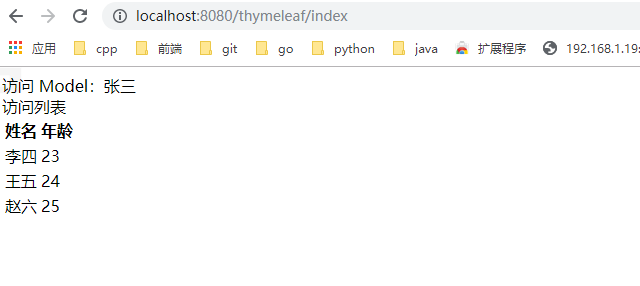
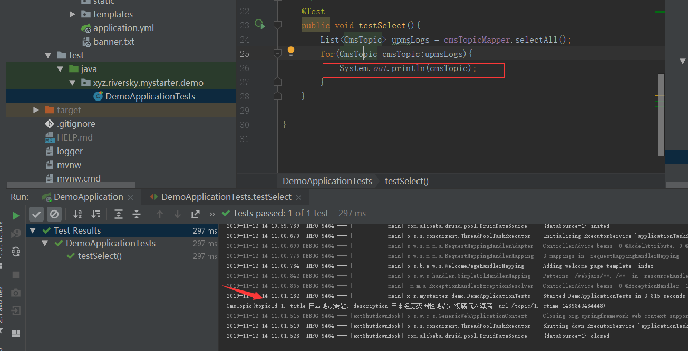
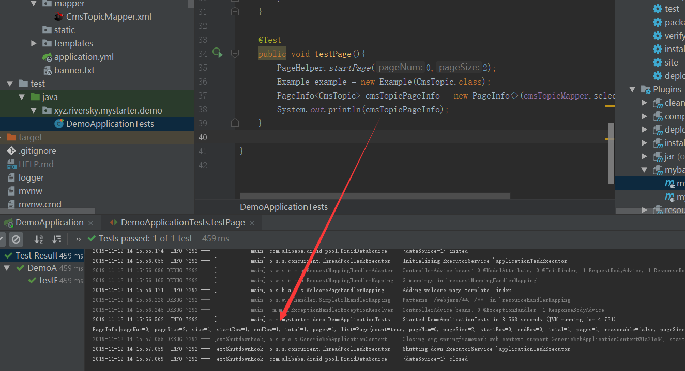

# Spring Boot
Spring Boot 可以称之为 新一代 JavaEE 开发标准；随着动态语言的流行 (Ruby、Groovy、Scala、Node.js)，Java 的开发显得格外的笨重：繁多的配置、低下的开发效率、复杂的部署流程以及第三方技术集成难度大。  
在上述环境下，Spring Boot 应运而生。它使用 “习惯优于配置” （项目中存在大量的配置，此外还内置了一个习惯性的配置，让你无需手动进行配置）的理念让你的项目快速的运行起来。使用 Spring Boot 很容易创建一个独立运行（运行 Jar，内嵌 Servlet 容器）准生产级别的基于 Spring 框架的项目，使用 Spring Boot 你可以不用或者只需很少的 Spring 配置。  
## Spring框架
**Spring 1.x时代**  
在 Spring1.x 时代，都是通过 xml 文件配置 bean，随着项目的不断扩大，需要将 xml 配置分放到不同的配置文件中，需要频繁的在 java 类和 xml 配置文件中切换。  
**Spring 2.x时代**  
随着 JDK 1.5 带来的注解支持，Spring2.x 可以使用注解对 Bean 进行申明和注入，大大的减少了 xml 配置文件，同时也大大简化了项目的开发。  
那么问题来了,到底使用xml还是注解呢?
最佳实践:  
* 应用的基本配置用 xml，比如：数据源、资源文件等  
* 业务开发用注解，比如：Service 中注入 bean 等

**Spring 3.x时代**    
从 Spring3.x 开始提供了 Java 配置方式，使用 Java 配置方式可以更好的理解你配置的 Bean，现在我们就处于这个时代，并且 Spring4.x 和 Spring boot 都推荐使用 java 配置的方式。  
**Spring 5.x时代**  
Spring5.x 是 Java 界首个支持响应式的 Web 框架，是 Spring 的一个重要版本，距离 Spring4.x 差不多四年。在此期间，大多数增强都是在 SpringBoot 项目中完成的，其最大的亮点就是提供了完整的端到端响应式编程的支持（新增 Spring WebFlux 模块）。  
Spring WebFlux 同时支持使用旧的 Spring MVC 注解声明 Reactive Controller。和传统的 MVC Controller 不同，Reactive Controller 操作的是 非阻塞 的 ServerHttpRequest 和 ServerHttpResponse，而不再是 Spring MVC 里的 HttpServletRequest 和 HttpServletResponse。  至此也代表着 Java 正式迎来了响应式异步编程的时代。  
## SprignBoot 简介  
随着动态语言的流行 (Ruby、Groovy、Scala、Node.js)，Java 的开发显得格外的笨重：繁多的配置、低下的开发效率、复杂的部署流程以及第三方技术集成难度大。  
在上述环境下，Spring Boot 应运而生。它使用“习惯优于配置”（项目中存在大量的配置，此外还内置了一个习惯性的配置，让你无需手动进行配置）的理念让你的项目快速的运行起来。使用 Spring Boot 很容易创建一个独立运行（运行 Jar，内嵌 Servlet 容器）准生产级别的基于 Spring 框架的项目，使用 Spring Boot 你可以不用或者只需很少的 Spring 配置。  
## SpringBoot优缺点
优点
*  快速构建项目
*  对主流开发框架的无配置集成  
*  项目可独立运行，无需外部依赖 Servlet 容器  
*  提供运行时的应用监控  
*  极大地提高了开发、部署效率  
*  与云计算的天然集成  

缺点
*  版本迭代速度很快，一些模块改动很大
*  由于不用自己做配置，报错时很难定位
*  网上现成的解决方案比较少
## quickstart

## 单元测试
```
@RunWith(SpringRunner.class)
@SpringBootTest(classes = HelloSpringBootApplication.class, webEnvironment = SpringBootTest.WebEnvironment.RANDOM_PORT)

```
## 常用配置  
```
logging:
  file:
    name: logger
    path: ./log
  level.org.springframework.web: debug
```
# Thymeleaf整合
## 简介
Thymeleaf 是一个跟 Velocity、FreeMarker 类似的模板引擎，它可以完全替代 JSP.相较与其他的模板引擎，它有如下三个极吸引人的特点
* Thymeleaf 在有网络和无网络的环境下皆可运行，即它可以让美工在浏览器查看页面的静态效果，也可以让程序员在服务器查看带数据的动态页面效果。这是由于它支持 html 原型，然后在 html 标签里增加额外的属性来达到模板 + 数据的展示方式。浏览器解释 html 时会忽略未定义的标签属性，所以 thymeleaf 的模板可以静态地运行；当有数据返回到页面时，Thymeleaf 标签会动态地替换掉静态内容，使页面动态显示。
* Thymeleaf 开箱即用的特性。它提供标准和 Spring 标准两种方言，可以直接套用模板实现 JSTL、 OGNL 表达式效果，避免每天套模板、改 JSTL、改标签的困扰。同时开发人员也可以扩展和创建自定义的方言。
* Thymeleaf 提供 Spring 标准方言和一个与 SpringMVC 完美集成的可选模块，可以快速的实现表单绑定、属性编辑器、国际化等功能。
## 为什么使用Thymeleaf
如果希望以 Jar 形式发布模块则尽量不要使用 JSP 相关知识，这是因为 JSP 在内嵌的 Servlet 容器上运行有一些问题 (内嵌 Tomcat、 Jetty 不支持 Jar 形式运行 JSP，Undertow 不支持 JSP)。  
Spring Boot 中推荐使用 Thymeleaf 作为模板引擎，因为 Thymeleaf 提供了完美的 Spring MVC 支持  
Spring Boot 提供了大量模板引擎，包括：  
*  FreeMarker
*  Groovy
*  Mustache
*  **Thymeleaf**
*  Velocity
*  **Beetl**
## 第一个模版页
依赖
主要增加 spring-boot-starter-thymeleaf 和 nekohtml 这两个依赖  
spring-boot-starter-thymeleaf：Thymeleaf 自动配置  
nekohtml：允许使用非严格的 HTML 语法
```
<?xml version="1.0" encoding="UTF-8"?>
<project xmlns="http://maven.apache.org/POM/4.0.0" xmlns:xsi="http://www.w3.org/2001/XMLSchema-instance"
         xsi:schemaLocation="http://maven.apache.org/POM/4.0.0 http://maven.apache.org/xsd/maven-4.0.0.xsd">
    <modelVersion>4.0.0</modelVersion>

    <groupId>com.funtl</groupId>
    <artifactId>hello-spring-boot</artifactId>
    <version>0.0.1-SNAPSHOT</version>
    <packaging>jar</packaging>

    <name>hello-spring-boot</name>
    <description></description>

    <parent>
        <groupId>org.springframework.boot</groupId>
        <artifactId>spring-boot-starter-parent</artifactId>
        <version>2.0.2.RELEASE</version>
        <relativePath/> <!-- lookup parent from repository -->
    </parent>

    <properties>
        <project.build.sourceEncoding>UTF-8</project.build.sourceEncoding>
        <project.reporting.outputEncoding>UTF-8</project.reporting.outputEncoding>
        <java.version>1.8</java.version>
    </properties>

    <dependencies>
        <dependency>
            <groupId>org.springframework.boot</groupId>
            <artifactId>spring-boot-starter-web</artifactId>
        </dependency>
        <dependency>
            <groupId>org.springframework.boot</groupId>
            <artifactId>spring-boot-starter-tomcat</artifactId>
        </dependency>
        <dependency>
            <groupId>org.springframework.boot</groupId>
            <artifactId>spring-boot-starter-thymeleaf</artifactId>
        </dependency>
        <dependency>
            <groupId>org.springframework.boot</groupId>
            <artifactId>spring-boot-starter-actuator</artifactId>
        </dependency>
        <dependency>
            <groupId>org.springframework.boot</groupId>
            <artifactId>spring-boot-starter-test</artifactId>
            <scope>test</scope>
        </dependency>

        <dependency>
            <groupId>net.sourceforge.nekohtml</groupId>
            <artifactId>nekohtml</artifactId>
            <version>1.9.22</version>
        </dependency>
    </dependencies>

    <build>
        <plugins>
            <plugin>
                <groupId>org.springframework.boot</groupId>
                <artifactId>spring-boot-maven-plugin</artifactId>
                <configuration>
                    <mainClass>com.funtl.hello.spring.boot.HelloSpringBootApplication</mainClass>
                </configuration>
            </plugin>
        </plugins>
    </build>
</project>
```
**配置**  
```
spring:
  thymeleaf:
    cache: false # 开发时关闭缓存,不然没法看到实时页面
    mode: HTML # 用非严格的 HTML
    encoding: UTF-8
    servlet:
      content-type: text/html
```
domain
```
@Data
public class PersonBean implements Serializable {

    private String name;
    private Integer age;
}
```
controller  
```
@Controller
@RequestMapping(value = "thymeleaf")
public class IndexController {

    @RequestMapping(value = "index", method = RequestMethod.GET)
    public String index(Model model) {
        PersonBean person = new PersonBean();
        person.setName("张三");
        person.setAge(22);

        List<PersonBean> people = new ArrayList<>();
        PersonBean p1 = new PersonBean();
        p1.setName("李四");
        p1.setAge(23);
        people.add(p1);

        PersonBean p2 = new PersonBean();
        p2.setName("王五");
        p2.setAge(24);
        people.add(p2);

        PersonBean p3 = new PersonBean();
        p3.setName("赵六");
        p3.setAge(25);
        people.add(p3);

        model.addAttribute("person", person);
        model.addAttribute("people", people);

        return "index";
    }
}
```
模版页
```
<!DOCTYPE html SYSTEM "http://www.thymeleaf.org/dtd/xhtml1-strict-thymeleaf-spring4-4.dtd">
<html xmlns="http://www.w3.org/1999/xhtml" xmlns:th="http://www.thymeleaf.org">
<head>
    <meta charset="UTF-8">
    <title>Hello Thymeleaf</title>
</head>
<body>
    <div>
        <span>访问 Model：</span><span th:text="${person.name}"></span>
    </div>
    <div>
        <span>访问列表</span>
        <table>
            <thead>
                <tr>
                    <th>姓名</th>
                    <th>年龄</th>
                </tr>
            </thead>
            <tbody>
                <tr th:each="human : ${people}">
                    <td th:text="${human.name}"></td>
                    <td th:text="${human.age}"></td>
                </tr>
            </tbody>
        </table>
    </div>
</body>
</html>
```
测试  
  
## 常用语法
**引入Thymeleaf**  
修改 html 标签用于引入 thymeleaf 引擎，这样才可以在其他标签里使用 th:* 语法，这是下面语法的前提。
```
<!DOCTYPE html SYSTEM "http://www.thymeleaf.org/dtd/xhtml1-strict-thymeleaf-spring4-4.dtd">
<html xmlns="http://www.w3.org/1999/xhtml" xmlns:th="http://www.thymeleaf.org">
```
**获取变量值**  
```
<p th:text="'Hello！, ' + ${name} + '!'" >name</p>
```
TODO: https://www.funtl.com/zh/spring-boot-thymeleaf/Thymeleaf-%E5%B8%B8%E7%94%A8%E8%AF%AD%E6%B3%95.html#%E5%BC%95%E5%85%A5-url
## 参考手册
## 表达式语法
## 内置对象
## 模版布局
# Mybatis整合  
## 整合Druid
### 概述
Druid 是阿里巴巴开源平台上的一个项目，整个项目由数据库连接池、插件框架和 SQL 解析器组成。该项目主要是为了扩展 JDBC 的一些限制，可以让程序员实现一些特殊的需求，比如向密钥服务请求凭证、统计 SQL 信息、SQL 性能收集、SQL 注入检查、SQL 翻译等，程序员可以通过定制来实现自己需要的功能。

Druid 是目前最好的数据库连接池，在功能、性能、扩展性方面，都超过其他数据库连接池，包括 DBCP、C3P0、BoneCP、Proxool、JBoss DataSource。Druid 已经在阿里巴巴部署了超过 600 个应用，经过多年生产环境大规模部署的严苛考验。Druid 是阿里巴巴开发的号称为监控而生的数据库连接池！  
### 依赖
在 pom.xml 文件中引入 druid-spring-boot-starter 依赖和引入数据库连接依赖
```
<dependency>
    <groupId>com.alibaba</groupId>
    <artifactId>druid-spring-boot-starter</artifactId>
    <version>1.1.10</version>
</dependency>
<dependency>
    <groupId>mysql</groupId>
    <artifactId>mysql-connector-java</artifactId>
    <scope>runtime</scope>
</dependency>
```
配置项  
```
spring:
  datasource:
    druid:
      url: jdbc:mysql://192.168.1.224:3306/zheng?useUnicode=true&characterEncoding=utf-8&useSSL=false
      username: root
      password: riversky
      initial-size: 1
      min-idle: 1
      max-active: 20
      test-on-borrow: true
      # MySQL 8.x: com.mysql.cj.jdbc.Driver
      driver-class-name: com.mysql.jdbc.Driver
```
## 整合Tk.mybaits
**概述**  
tk.mybatis 是在 MyBatis 框架的基础上提供了很多工具，让开发更加高效  
**引入依赖**  
在 pom.xml 文件中引入 mapper-spring-boot-starter 依赖，该依赖会自动引入 MyBaits 相关依赖  
```
<dependency>
    <groupId>org.mybatis.spring.boot</groupId>
    <artifactId>mybatis-spring-boot-starter</artifactId>
    <version>1.3.2</version>
</dependency>
<dependency>
    <groupId>tk.mybatis</groupId>
    <artifactId>mapper-spring-boot-starter</artifactId>
    <version>2.0.2</version>
</dependency>
```
同一个的Mapper接口父接口
```
/**
 * 自己的 Mapper
 * 特别注意，该接口不能被扫描到，否则会出错
 * <p>Title: MyMapper</p>
 * <p>Description: </p>
 *
 * @author Lusifer
 * @version 1.0.0
 * @date 2018/5/29 0:57
 */
public interface MyMapper<T> extends Mapper<T>, MySqlMapper<T> {
}
```
## 整合PageHelper
PageHelper 是 Mybatis 的分页插件，支持多数据库、多数据源。可以简化数据库的分页查询操作，整合过程也极其简单，只需引入依赖即可。  
依赖
```
<dependency>
    <groupId>com.github.pagehelper</groupId>
    <artifactId>pagehelper-spring-boot-starter</artifactId>
    <version>1.2.5</version>
</dependency>
```
## mybatis代码生成
我们无需手动编写 实体类、DAO、XML 配置文件，只需要使用 MyBatis 提供的一个 Maven 插件就可以自动生成所需的各种文件便能够满足基本的业务需求，如果业务比较复杂只需要修改相关文件即可。  
配置插件  
```
<build>
    <plugins>
            <plugin>
                <groupId>org.mybatis.generator</groupId>
                <artifactId>mybatis-generator-maven-plugin</artifactId>
                <version>1.3.5</version>
                <configuration>
                    <configurationFile>${basedir}/src/main/resources/generator/MybatisGenerator.xml</configurationFile>
                    <overwrite>true</overwrite>
                    <verbose>true</verbose>
                </configuration>
                <dependencies>
                    <dependency>
                        <groupId>mysql</groupId>
                        <artifactId>mysql-connector-java</artifactId>
                        <version>${mysql.version}</version>
                    </dependency>
                    <dependency>
                        <groupId>tk.mybatis</groupId>
                        <artifactId>mapper</artifactId>
                        <version>3.4.4</version>
                    </dependency>
                </dependencies>
            </plugin>
    </plugins>
</build>
```
>>  configurationFile：自动生成所需的配置文件路径

自动生成配置 
```
<?xml version="1.0" encoding="UTF-8"?>
<!DOCTYPE generatorConfiguration
        PUBLIC "-//mybatis.org//DTD MyBatis Generator Configuration 1.0//EN"
        "http://mybatis.org/dtd/mybatis-generator-config_1_0.dtd">
<generatorConfiguration>
    <!--<classPathEntry location="/Program Files/IBM/SQLLIB/java/db2java.zip" />-->

    <context id="Mybatis3Context" targetRuntime="MyBatis3">
        <property name="javaFileEncoding" value="UTF-8"/>
        <property name="beginningDelimiter" value="`"/>
        <property name="endingDelimiter" value="`"/>
        <!-- 配置 tk.mybatis 插件 -->
        <plugin type="tk.mybatis.mapper.generator.MapperPlugin">
            <property name="mappers" value="tk.mybatismapper.MyMapper"/>
        </plugin>
        <jdbcConnection driverClass="com.mysql.jdbc.Driver"
        connectionURL="jdbc:mysql://192.168.1.224:3306/zheng?useLegacyDatetimeCode=false&amp;serverTimezone=UTC&amp;nullCatalogMeansCurrent=true"
        userId="root"
        password="riversky">
        </jdbcConnection>
        <!-- 配置实体类存放路径 -->
        <javaModelGenerator targetPackage="xyz.riversky.mystarter.demo.entity" targetProject="src/main/java"/>

        <!-- 配置 XML 存放路径 -->
        <sqlMapGenerator targetPackage="mapper" targetProject="src/main/resources"/>

        <!-- 配置 DAO 存放路径 -->
        <javaClientGenerator
                targetPackage="xyz.riversky.mystarter.demo.mapper"
                targetProject="src/main/java"
                type="XMLMAPPER"/>

        <!-- 配置需要指定生成的数据库和表，% 代表所有表 -->
        <table catalog="zheng" tableName="cms_topic">
            <!-- mysql 配置 -->
            <generatedKey column="id" sqlStatement="Mysql" identity="true"/>
        </table>

    </context>
</generatorConfiguration>
```
>> 需要注意点1. xml中多的方法.  2.MapperScan采用tk的  3. 注意自己的Entity中的Table是否正确
## 测试
主类
```
package xyz.riversky.mystarter.demo;

import org.springframework.boot.SpringApplication;
import org.springframework.boot.autoconfigure.SpringBootApplication;
import tk.mybatis.spring.annotation.MapperScan;

@SpringBootApplication
@MapperScan(basePackages = {"xyz.riversky.mystarter.demo.mapper"})
public class DemoApplication {
    public static void main(String[] args) {
        SpringApplication.run(DemoApplication.class, args);
    }

}

```
测试类  
```
package xyz.riversky.mystarter.demo;

import org.junit.jupiter.api.Test;
import org.junit.runner.RunWith;
import org.springframework.beans.factory.annotation.Autowired;
import org.springframework.boot.test.context.SpringBootTest;
import org.springframework.test.context.junit4.SpringRunner;
import xyz.riversky.mystarter.demo.entity.CmsTopic;
import xyz.riversky.mystarter.demo.mapper.CmsTopicMapper;

import java.util.List;
@RunWith(SpringRunner.class)
@SpringBootTest(classes = DemoApplication .class )
class DemoApplicationTests {

    @Autowired
    private CmsTopicMapper cmsTopicMapper;

    /**
     * 测试查询集合
     */
    @Test
    public void testSelect(){
        List<CmsTopic> upmsLogs = cmsTopicMapper.selectAll();
        for(CmsTopic cmsTopic:upmsLogs){
            System.out.println(cmsTopic);
        }
    }
    @Test
    public void testPage(){
        PageHelper.startPage(0,2);
        Example example = new Example(CmsTopic.class);
        PageInfo<CmsTopic> cmsTopicPageInfo = new PageInfo<>(cmsTopicMapper.selectByExample(example));
        System.out.println(cmsTopicPageInfo);
    }

}

```
  

分页测试 
  