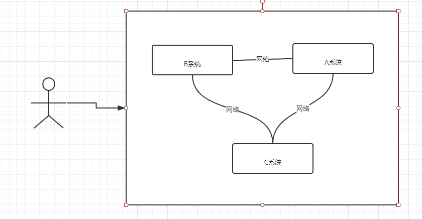

# 分布式协调服务
分布式协调技术主要用来解决分布式环境当中多个进程之间通过网络的同步控制，让他们有序的去访问某种临界资源，防止造成"脏数据"的后果。  
  
在这图中有三台机器，每台机器各跑一个应用程序。然后我们将这三台机器通过网络将其连接起来，构成一个系统来为用户提供服务，对用户来说这个系统的架构是透明的，他感觉不到我这个系统是一个什么样的架构。那么我们就可以把这种系统称作一个分布式系统。  
在这个分布式系统中如何对进程进行调度，我假设在第一台机器上挂载了一个资源，然后这三个物理分布的进程都要竞争这个资源，但我们又不希望他们同时进行访问，这时候我们就需要一个协调器，来让他们有序的来访问这个资源。这个协调器就是我们经常提到的那个锁，比如说"进程-1"在使用该资源的时候，会先去获得锁，"进程1"获得锁以后会对该资源保持独占，这样其他进程就无法访问该资源，"进程1"用完该资源以后就将锁释放掉，让其他进程来获得锁，那么通过这个锁机制，我们就能保证了分布式系统中多个进程能够有序的访问该临界资源。那么我们把这个分布式环境下的这个锁叫作分布式锁。这个分布式锁也就是我们分布式协调技术实现的核心内容。  
# 什么是分布式锁  
为了防止分布式系统中的多个进程之间相互干扰，我们需要一种分布式协调技术来对这些进程进行调度。而这个分布式协调技术的核心就是来实现这个分布式锁。
## 为什么要使用分布式锁
  
* 成员变量 A 存在 JVM1、JVM2、JVM3 三个 JVM 内存中  
* 成员变量 A 同时都会在 JVM 分配一块内存，三个请求发过来同时对这个变量操作，显然结果是不对的  
* 不是同时发过来，三个请求分别操作三个不同 JVM 内存区域的数据，变量 A 之间不存在共享，也不具有可见性，处理的结果也是不对的 注：该成员变量 A 是一个有状态的对象   

如果我们业务中确实存在这个场景的话，我们就需要一种方法解决这个问题，这就是分布式锁要解决的问题
## 分布式锁应该具备哪些条件
* 方法的串行化
* 高可用的锁
*  具备可重入特性（可理解为重新进入，由多于一个任务并发使用，而不必担心数据错误）
*  具备锁失效机制，防止死锁
*  具备非阻塞锁特性，即没有获取到锁将直接返回获取锁失败  
## 实现方式(常见的)  
1. Memcached：利用 Memcached 的 add 命令。此命令是原子性操作，只有在 key 不存在的情况下，才能 add 成功，也就意味着线程得到了锁。
2. Redis：和 Memcached 的方式类似，利用 Redis 的 setnx 命令。此命令同样是原子性操作，只有在 key 不存在的情况下，才能 set 成功。
3. Zookeeper：利用 Zookeeper 的顺序临时节点，来实现分布式锁和等待队列。Zookeeper 设计的初衷，就是为了实现分布式锁服务的。  
4. Chubby：Google 公司实现的粗粒度分布式锁服务，底层利用了 Paxos 一致性算法。  
## 通过 Redis 分布式锁的实现理解基本概念  
分布式锁实现的三个核心要素：
1. 加锁 ->通过setnx命令可以实现
2. 解锁 ->del 命令可以实现
3. 超时->  expire 可以实现    

但是也存在三个问题
1. 原子性(set的时候,同时加上expire过期时间))
2. 误解锁(根据key判断是不是自己的锁)
3. 超时,自动解锁,但是仍在访问数据(续命机制) 

# Zookeeper
ZooKeeper 是一种分布式协调服务，用于管理大型主机。在分布式环境中协调和管理服务是一个复杂的过程。ZooKeeper 通过其简单的架构和 API 解决了这个问题。ZooKeeper 允许开发人员专注于核心应用程序逻辑，而不必担心应用程序的分布式特性。  
## 数据模型  
Zookeeper 的数据模型是什么样子呢？它很像数据结构当中的树，也很像文件系统的目录。  

  
树是由节点所组成，Zookeeper 的数据存储也同样是基于节点，这种节点叫做 Znode  
但是，不同于树的节点，Znode 的引用方式是路径引用，类似于文件路径：  
## Znode结构

  
* data:Znode 存储的数据信息。
* ACL：记录 Znode 的访问权限，即哪些人或哪些 IP 可以访问本节点。
* stat：包含 Znode 的各种元数据，比如事务 ID、版本号、时间戳、大小等等。
* child：当前节点的子节点引用

>> 这里需要注意一点，Zookeeper 是为读多写少的场景所设计。Znode 并不是用来存储大规模业务数据，而是用于存储少量的状态和配置信息，每个节点的数据最大不能超过 1MB。  

## 基本操作  
| 命令        | 描述                   |
| :---------- | :--------------------- |
| create      | 创建节点               |
| delete      | 删除节点               |
| exists      | 判断节点是否存在       |
| getData     | 获得一个节点的数据     |
| setData     | 设置一个节点的数据     |
| getChildren | 获取节点下的所有子节点 |

这其中，exists，getData，getChildren 属于读操作。Zookeeper 客户端在请求读操作的时候，可以选择是否设置 Watch  
## Zookeeper 的事件通知  
我们可以把 Watch 理解成是注册在特定 Znode 上的触发器。当这个 Znode 发生改变，也就是调用了 create，delete，setData 方法的时候，将会触发 Znode 上注册的对应事件，请求 Watch 的客户端会接收到异步通知。  
具体交互过程如下：  
* 客户端调用 getData 方法，watch 参数是 true。服务端接到请求，返回节点数据，并且在对应的哈希表里插入被 Watch 的 Znode 路径，以及 Watcher 列表。   
  

* 当被 Watch 的 Znode 已删除，服务端会查找哈希表，找到该 Znode 对应的所有 Watcher，异步通知客户端，并且删除哈希表中对应的 Key-Value。

  
## Zookeeper一致性  
Zookeeper 身为分布式系统协调服务，如果自身挂了如何处理呢？为了防止单机挂掉的情况，Zookeeper 维护了一个集群。如下图：  
  
Zookeeper Service 集群是一主多从结构。  
在更新数据时，首先更新到主节点（这里的节点是指服务器，不是 Znode），再同步到从节点。  
在读取数据时，直接读取任意从节点。  
为了保证主从节点的数据一致性，Zookeeper 采用了 ZAB 协议，这种协议非常类似于一致性算法 Paxos 和 Raft。  
### ZAB协议
ZooKeeper Atomic Broadcast (ZAB, ZooKeeper原子消息广播协议)是ZooKeeper实现分布式数据一致性的核心算法，ZAB借鉴Paxos算法，但又不像Paxos算法那样，是一种通用的分布式一致性算法，它是一种特别为ZooKeeper专门设计的支持崩溃恢复的原子广播协议。  
**协议核心**  
ZAB协议的核心是定义了对于那些会改变ZooKeeper服务器数据状态的事务请求处理方式，即：  
所有事务请求必须由一个全局唯一的服务器来协调处理，这样的服务器被称为Leader服务器，而余下的其他服务器称为Follower服务器。Leader服务器负责将一个客户端事务请求转换成一个事务Proposal(提议)，并将该Proposal分发给集群中所有的Follower服务器。之后Leader服务器需要等待所有的Follower服务器的反馈，一旦超过半数的Follower服务器进行了正确的反馈后，那么Leader就会再次向所有的Follower服务器分发Commit消息，要求其将前一个Proposal进提交。
#### 协议阶段划分
ZAB协议整体可划分为两个基本的模式：消息广播和崩溃恢复  
按协议原理可细分为四个阶段：选举（Leader Election）、发现（Discovery）、同步（Synchronization）和广播(Broadcast)  
按协议实现分为三个时期：选举（Fast Leader Election）、恢复(Recovery Phase)和广播(Broadcast Phase)  
TODO: https://www.jianshu.com/p/3fec1f8bfc5f
##### 消息广播  
TODO:https://www.jianshu.com/p/3fec1f8bfc5f
##### 崩溃恢复  
TODO: https://www.jianshu.com/p/3fec1f8bfc5f
## 应用场景
### 分布式锁
这是雅虎研究员设计 Zookeeper 的初衷。利用 Zookeeper 的临时顺序节点，可以轻松实现分布式锁。  
### 服务注册与发现  
利用 Znode 和 Watcher，可以实现分布式服务的注册和发现。最著名的应用就是阿里的分布式 RPC 框架 Dubbo。  
### 共享配置和状态信息  
Redis 的分布式解决方案 Codis，就利用了 Zookeeper 来存放数据路由表和 codis-proxy 节点的元信息。同时 codis-config 发起的命令都会通过 ZooKeeper 同步到各个存活的 codis-proxy。  
此外，Kafka、HBase、Hadoop，也都依靠Zookeeper同步节点信息，实现高可用。  
## Zookeeper分布式锁实现方案
### 什么是临时顺序节点 
Zookeeper 的数据存储结构就像一棵树，这棵树由节点组成，这种节点叫做 Znode。  
Znode 共有四种类型  
* 持久节点(Persistent):默认的节点类型。创建节点的客户端与 Zookeeper 断开连接后，该节点依旧存在。  
* 持久顺序节点(Persistent_Sequential):所谓顺序节点，就是在创建节点时，Zookeeper 根据创建的时间顺序给该节点名称进行编号：  
* 临时节点(Ephemeral):和持久节点相反，当创建节点的客户端与 Zookeeper 断开连接后，临时节点会被删除
* 临时顺序节点(Ephemeral_sequential):临时顺序节点结合和临时节点和顺序节点的特点：在创建节点时，Zookeeper 根据创建的时间顺序给该节点名称进行编号；当创建节点的客户端与 Zookeeper 断开连接后，临时节点会被删除。  
### Zookeeper分布式锁原理  
主要针对分布式锁的三个问题来提供解决方案
1. 获取锁
当客户想获取锁时,需要在ParentLock(也就是mutext)中加锁(创建自己的临时顺序节点),然后判断自己是不是临时顺序的第一个,如果是就获得锁拥有该资源的执行权限,如果不是就watch前一个节点(当前一个删除的时候再判断自己是不是第一个,如果不是就watch pre,如果是,就执行)
2. 释放锁
分两种情况,1,自己主动释放(删除该临时节点)2,自己崩了,那么因为是临时节点,那么也会消失(该节点)

## Zookeeper和Redis分布式锁的比较
|分布式锁|优点|缺点|
|:--|:--|:--|
|Zookeeper| 1.有封装好的框架,容易实现,2有等待锁的队列,大大提升抢锁效率|添加,删除节点性能低|
|Redis|set和del执行性能较高(其实就是自旋的过程)|实现上比较复杂,需要考虑超时,原子性,误删等2没有等待队列,只能自旋|

