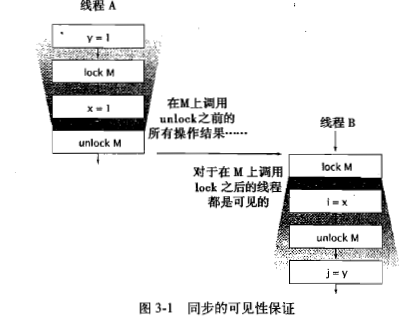
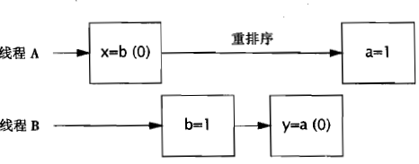

# 1. 简介
主要是对应的多核CPU的应用
## 1.1. 并发简史 
进程间通信:套接字,信号处理器,共享内存,信号量以及文件.  
线程中,允许同时存在多个程序控制流,线程会共享进程范围内的资源,例如内存句柄,和文件句柄.但是每个线程都有各自的程序计数器,栈以及局部变量等,线程还提供了一种直观的分解模式来充分利用国处理器系统中的硬件并行性,而在同一个程序中的多个线程也可以被同时调用到多个CPU上运行.  
## 1.2. 线程的优势  
有效的降低程序的开发和维护等成本,同时提升复杂应用程序的性能.线程能将大部分异步工作流转换成串行工作流.    
GUI:提高程序的灵敏度  
后端:提升资源利用率以及系统吞吐率.  
JVM:垃圾收集器通常由一个或者多个专门线程进行处理.  
### 1.2.1. 性能提升,充分利用多核
### 1.2.2. 建模简化
如果程序中只包含一种类型的任务,那么比包含多种不同类型的任务要更易于编写,错误更好,也更容易测试. 如果为模型中每种类型的任务都分配一个专门的线程,那么可以形成一种串行执行的假象,并将程序的执行逻辑与调度机制的细节,交替执行的操作,异步I/O以及资源等待等问题分离开来.通过使用线程,可以将复杂并且异步的工作流进一步分解为一组简单并且同步的工作流,每个工作流在一个单独的线程中运行,并在特定的同步位置进行交互.  
我们可以使用一些现有的额框架来实现上述目标,如server和RMI,框架负责解决一些问题,例如请求管理,线程创建,负载平衡,并在正确的时刻将请求分发给正确的应用程序组件,编写Servlet的开发人员不需要了解有多少请求在同一时刻要被处理,也不需要了解套接字的输入流或输出流是否被阻塞.当调用Servlet的service方法来响应Web请求时,可以以同步方式来处理这个请求,就好像它是一个单线程程序,这种方式可以简化组件的开发,并缩短掌握这种框架的学习时间.  

### 1.2.3. 异步事件的简化处理
早期的操作系统通常将进程中可创建的线程数量限制在一个较低的阈值内,大约在数百个,甚至更少.因此操作系统提供了一些高效的方法来实现多路I/O,例如Unix的select和poll等系统调用,要调用这种方法,Java类库需要获得一组非阻塞I/O的包.然而在现在操作系统上,线程数量的限制就不是那么明显了.  
### 1.2.4. GUI灵敏度提升
旧的GUI常常使用单线程调用pool方法进行事件的处理(主事件循环)来简介地执行应用程序所有的代码,一旦阻塞线程,那么用户界面就会被冻结.  
现代的GUI框架,都采用一个时间分发线程(Event Dispatch Thread) 来替代主事件循环.  
## 1.3. 线程带来的风险  
### 1.3.1. 安全性问题
在没有充足同步的情况下,多个线程中操作执行顺序是不可预测的. 
```
public class UnsafeSequence{
    private int value;
    public int getNext(){
        return value++;
    }
}
```
上面的类引发的并发安全问题,称为竞态条件(Race Condition). 可以使用同步方法,或者同步代码块进行解决.  
```
@ThreadSafe
public class Sequence{
    @GuardeBy("this") private int Value;
    public synchronized int getnext(){
        return Value++;
    }
}
```
### 1.3.2. 活跃性问题
主要是需要根据其状态,避免这些问题,比如死锁,饥饿以及活锁.  
### 1.3.3. 性能问题  
活跃性意味着某件正确的事情最终会发生,但却不够好,因为我们希望正确的事情尽快发生,因此性能问题包括多个方面,例如服务时间过长,响应不灵敏等,吞吐率过低,资源消耗高,或者可伸缩性较低等.  
## 1.4. 线程的存在
每隔Java应用程序都会使用线程,例如JVM启动时,它将为JVM的内部任务创建后台线程,并创建一个主线程运行main方法.AWT和Swing的用户界面框架将创建线程来管理用户界面框架来管理用户界面时间. Timer将创建线程来执行延迟任务.一些组件框架,例如Servlet和RMI,都会创建线程池并调用这些线程中的方法.  
>>  框架通过在框架线程中调用应用程序代码将并发性引入到程序中,在代码中将不可避免地访问应用程序状态,因此所有访问这些状态的代码路径都必须是线程安全的.  

举例 
* Timer  
Timer类的作用是使任务在稍后的时刻运行,或者一次,或者周期运行.引入Timer可能会使串行程序变得复杂,因为TimerTask将在Timer管理的线程中执行,而不是由应用程序来管理.如果某个TimerTask访问了应用程序中其他线程访问的数据,那么不仅TimerTask需要以线程安全的方式来访问,其他类也必须采用线程安全的方式来访问该数据. (通常要实现这个目标最简单的方式是确保TimerTask访问的对象本身是线程安全的).  
* Servlet
Servlet和JavaServer Page(JSP).Servlet框架用于部署网页应用程序以及分发来自HTTP客户端的请求.到达服务器的请求可能会通过一个过滤器链被分发到正确的Servlet或JSP.每个SErvlet都表示一个程序逻辑组件,在高吞吐率的网站中,多个客户端可能同时请求一个Servlet服务.在Servlet规范中,Servlet同样需要满足被多个线程同时调用,换句话说,Servlet需要时线程安全的.    
即使你可以确保每次只有线程调用某个Servlet,但在构建网页应用程序时,必须注意线程安全性.Servlet通常会访问与其他Servlet共享的信息,例如应用程序中的对象(这些对象保存在ServletContext)中或者会话中的对象(这些对象保存在每个客户端HttpSession中).当一个Servlet访问在多个Servlet或者请求中共享的对象时,必须正确地协同对这些对象的访问,因此为多个请求可能在不同的线程中同时访问这些对象.  
* RMI   
RMI使代码能够调用在其他JVM中运行的对象.当通过RMI调用某个远程方法时,传递给方法的参数必须打包(也称为列集Marshaled),通过网络传输给远程JVM,然后由远程JVM拆包(或称为散集)并传递给远程方法.   
当RMI代码调用远程对象时,这个调用将在哪个线程中执行?并不知道,但肯定不会在我们自己创建的线程中,而是一个由RMI管理的线程中调用对象.RMI会创建多少个线程?同一个远程对象上的同一个远程方法会不会在多个RMI线程中被同时调用?  
远程对象必须注意两个线程安全问题:正确地协同在多个对象中共享的状态,以及对远程对象本身状态的访问(由于同一个对象可能会在多个线程中被同时访问.与Servlet相同)RMI对象应该做好被多个线程同时调用的真牛逼,并且确保自身是线程安全的.  
* GUI  
GUI 应用程序的一个固有属性就是异步性.一般是通过创建了单独的线程来处理用户触发的事件(Swing和AWT).  
# 2. 线程安全性  
在构建文件的并发程序时,必须正确地使用线程和锁.但这些终归只是一些机制.要编写线程安全的代码,其核心在于要对状态访问操作进行管理,特别是对共享(Shared)和可变的(Mutable)状态的访问.  
一个对象是否是线程安全的,取决于是否被多个线程访问.这指的是在程序中访问对象的方式,而不是对象要实现的功能.要使得对象是线程安全的,需要采用同步机制来协同对象可变状态的访问.如果无法实现协同,那么可能会导致数据破坏以及其他不应该出现的结果.  
>> 如果当多个线程访问同一个可变的状态变量时没有使用合适的同步,那么程序就会出现错误,有三种方式可以修复这个问题.1. 线程间不共享  2. 状态为只读的  3. 访问时同步   

## 2.1. 什么是线程安全  
线程安全: 当多个线程访问某个类时,这个类始终都能表现出正确的行为,那么这个类就是线程安全的.  
例如: 一个无状态的Servlet
```
@ThreadSafe 
public class StatelessFactorizer implements Servlet{
    public void service(ServletRequest req,SrevletResponse resp){
        BigInteger i=extractFromRequest(req);
        BigInteger[] factors=factor(i);
        encodeInteoResponse(resp,factors);
    }
}
```
StatelessFactorizer是无状态的,它既不包含任何域,也不包含任何对其他类中域的引用.计算过程中的临时状态仅存在于线程栈上的局部变量中,并且只能由正在执行的线程访问.  
>> 无状态对象一定是线程安全的.  
## 2.2. 原子性  
在并发编程中,由于不恰当的执行时序而出现不正确的结果是一种非常重要的情况,称为竞态条件.  
### 2.2.1. 竞态条件  
最常见的竞态条件就是:"先检查后执行"操作,即通过一个可能失效的观测结果来决定下一步的动作.  
**延迟初始化中的竞态条件**    
使用"先检查后执行"的一种常见情况就是延迟初始化.延迟初始化的目的是将对象的初始化操作推迟到实际被使用时才进行,同时确保只被初始化一次(有点类似于懒加载).    
>> 竞态条件最容易与数据竞争(Data Race)相混淆. 数据竞争是指,如果在访问共享的非final类型的域时没有采用同步来进行协同,那么就会出现数据竞争.当一个线程写入一个变量而另一线程接下来读取这个变量,或者读取一个之前由另一个线程写入的变量时,并且这两个线程没有使用同步,那么就可能出现数据竞争.在Java内存模型中,如果在代码中存在数据竞争,那么这段代码就没有确定的语义,并非所有竞态条件都是数据竞争,同样并非所有的数据竞争都是竞态条件.但二者都可能使并发程序失败.  cout++那个程序中即存在竞态条件,有存在数据竞争.  简单来说,有时序需求(竞态条件),读前状态依赖(数据竞争)    
### 2.2.2. 复合操作  
为了确保线程安全性,"先检查后执行"(例如懒加载初始化)和"读取-修改-写入"等操作必须是原子的. 我们将检查后执行,以及读取修改写入等操作统称为复合操作:包含一组必须以原子方式执行的操作以确保线程安全性.我们将介绍加锁机制,这事Java中用于确保原子性的内置机制.还有一种方式是使用原子类型操作.  
```
@ThreadSafe
public class CountingFactorizer implements Servlet{
    private final AtomicLong count=new AtomicLong(0);
    public long getCount(){
        return count.get();
    }
    public void service(ServletRequest req,ServletResponse resp){
        BigInteger i=extractFromRequest(req);
        BigInteger[] factors=facotr(i);
        count.incrementAndGet();
        encodeIntoResponse(resp,factors);
    }
}
```
## 2.3. 加锁机制  
要保持状态一致性,就需要在单个原子操作中更新所有相关的状态变量.  
### 2.3.1. 内置锁  
每个Java对象都可以用做一个实现同步的锁,这些锁被称为内置锁或者监视器锁.   
java的内置锁相当于一种互斥体(或互斥锁),这意味着最多只有一个线程能持有这种锁.  
### 2.3.2. 重入  
重入其实表示的是内置锁是可重入的,因此如果某个线程试图获得一个已经由它自己持有的锁,那么这个请求就会成功.重入进一步提升了加锁行为的封装性,例如子类改写了父类的synchronized方法,然后调用父类中的方法,如果没有可冲入锁,那么这段代码将会产生死锁.  
```
public class Widget{
    public synchronized void doSomething(){

    }
}
public class LoggingWidget extends Widget{
    public synchroized void doSomething(){
        super.doSomething();
    }
}
```
## 2.4. 用锁来保护状态
在java中某个线程在获得对象的锁后,只能阻止其他线程获得同一个锁(并且为内置锁,jdk5前).cpp中则需用用户自定义mutex这样的互斥体与lock类型进行使用.  

## 2.5. 活跃性与性能  
主要是分析同步代码块的同步范围的限制,尽量避免方法级别的synchronized.
>> 当执行时间较长的计算或者可能无法快速完成的操作时,(例如,网络I/O或控制台I/O),一定不要持有锁.  
# 3. 对象的共享
内置锁的方式使用不仅用于实现原子性或者"临界区",同时还有另外一个方面就是内存可见性.
## 3.1. 可见性
需要注意:不要在没有同步的情况下共享变量,因为会发生重排序现象.  
```
public class NoVisibility{
    private static boolean ready;
    private static int number;
    private static class  ReaderThread extends Thread{
        public void run(){
            while(!ready){
                Thread.yield();
            }
            System.out.println(number);
        }
    }
    public static void main(String[] args){
        new ReaderThread().start();
        number=42;
        ready=true;
    }
}
```
### 3.1.1. 失效数据
主要是由于重排序现象引起的共享变量的数据为历史数据产生的数据失效.  
### 3.1.2. 非原子的64位操作
主要是非volatile类型的64位数值变量(double,long),JVM允许将64为的读/写操作分解为两个32位的操作.
### 3.1.3. 加锁和可见性  
内置锁可以确保某个线程以一种可预测的方式查看另一个线程的执行结果. 
    
>> 加锁的含义不仅仅局限互斥行为,还包括内存可见性,为了确保所有线程都能看到共享变量的最新值,所有执行读操作或者写操作的线程都必须在同一个锁上同步.  
### 3.1.4. Volatile变量 
Java 语言提供了一种稍弱的同步机制,即volatile变量,用来确保将变量的更新操作通知到其他线程,当变量声明为volatile类型后,编译器和运行时都会注意到这个变量是共享的,因此不会将该变量上的操作与其他内存操作一起重排序.volatile变量不会被缓存在寄存器或者对其他处理器不可见的地方,因此在读取volatile类型的变量时总会返回最新的写入的值.    
volatile变量是一种比sychronized关键字更轻量级的同步机制.但是一般不建议过度依赖volatile变量提供的可见性,因为这种方式比锁的代码更脆弱也更难理解.  (例如JVM server模式和client模式中,server模式优化程度更高,如果忘记声明volatile类型,那么有可能JVM会将判断条件提升到循环体外部,但在client模式不会这么做).    
```
volatile boolean asleep;
...
while(!asleep){
    countSomeSheep();
}
```
>>仅当volatile变量能简化代码的实现以及同步策略的验证时,才使用.如果在验证正确性是需要对可见性进行复杂的判断,那么就不要使用volatile变量.

volatile变量的正确使用方式:确保他们自身状态的可见性,确保他们所引用对象的状态的可见性,以及标识一些重要的程序声明周期事件的发生(例如初始化,或关闭)  
>> volatile的语义不足以确保递增操作cout++的原子性.  
>> 加锁机制既可以确保可见性又可以确保原子性,而volatile变量只能确保可见性.  

使用条件:  
1.  对变量的写入操作不依赖变量的当前值,或者只有单个线程更新变量的值.
2.  该变量不会与其他状态变量一起纳入不变性条件中.
3.  在访问变量时不需要加锁.  
## 3.2. 发布与逸出
主要是表示使对象能够在当前作用域之外的代码中使用.当某个不应该发布的对象被发布时,这种情况就被称为逸出.  
发布一个对象  
```
public static Set<Secret> knownSecrets;
public void initialize(){
    knownSecrets=new HashSet<Secret>();
}
```
需要特别关注的是构造中this的逸出,具体来说,只有当构造函数返回时,this引用才应该从线程中逸出,构造函数可以将this引用保存到某个地方,只要其他线程不会在构造函数完成之前使用它,就可以使用工厂方法的模式来避免this逸出.  

## 3.3. 线程封闭
当访问共享的可变数据时,通常需要使用同步,一种避免使用同步的方式就是不共享数据.如果仅在单线程内访问数据,就不需要同步数据,这种技术成为线程封闭.   
最常见的就是JDBC技术,将一个Connection值分配给一个线程使用.   
### 3.3.1. Ad-hoc线程  
Ad-hoc线程封闭是指,维护线程封闭性的职责完全由程序实现来承担.  
### 3.3.2. 栈封闭
栈封闭是线程封闭的一种特例,在栈封闭中,只能通过局部变量才能访问对象.(其实就是通过局部变量对共享数据进行接管)
```
public void tst(){
    SortedSet<Animal> animals;
    animals=new TreeSet<Animal>();//内部创建,内部销毁.
    ....

}
```
### 3.3.3. ThreadLocal类(推荐)  
ThreadLocal能使线程中的某个值与保存值的对象关联起来.ThreadLocal 使得每个使用该变量的线程都存有一份独立的副本.  
使用ThreadLocal来维持线程封闭性  
```
private static ThreadLocal<Connection> connectionHolder=new ThreadLocal<Connection>{
    public Connection initialVale(){
        return DriverManager.GetConnection(DB_URL);
    }
}
public static Connection getConnection(){
    return connectionHolder.get();
}
```
当某个频繁执行的操作需要一个临时对象,例如一个缓冲区,而同时有希望避免在每次执行时重新分配该临时对象,就可以使用ThreadLocal的方案.  
应用程序框架中常常使用ThreadLocal,例如EJB调用期间,J2EE容器需要将一个事务上下文与某个执行中的线程关联起来,通过将事务上下文保存在静态的ThreadLocal对象中,可以很容易地实现这个功能.当框架代码需要判断当前运行的是哪一个事务时,只需要从这个ThreadLocal对象中读取事务上下文.这种机制很方便,因为它避免了在调用每隔方法时都需要传递执行上下文信息.  
## 3.4. 不变性
>> 不可变对象一定是线程安全的.  
当满足一下条件时,对象才是不可变的:
1. 对象创建以后其状态就不能修改.
2. 对象的所有域都是final类型
3. 独享是正确创建的(在对象创建期间,this引用没有逸出)  
## 3.5. Final域
Final可以视为C++中const机制的一种受限版本.  
>> 只有第一层是不可修改的(例如器被引用的对象如果时可变的,那么该引用对象也是可以修改的)  
## 3.6. 使用Volatile类型来发布不可变对象.  
主要是通过volatile的可见性来实现
## 3.7. 安全发布  
### 3.7.1. 安全发布的常用模式
1. 在静态初始化函数中初始化一个对象的引用.
2. 将对象的引用保存到volatile类型或者AtomicReferance对象中.
3. 将对象的引用保存到某个正确构造对象的final类型域中.
4. 将对象的引用保存到一个由锁保护的域中.  

容器与语言支持
* 通过将一个键或者值放入Hashtable,synchronizedMap,ConcurrentMap
* Vecotr,CopyOnWriteArrayList,CopyOnWriteArraySet,synchronizedList,synachronizedSet
* BlockingQueue或者ConcurrentLikedQueue

Future和Exchanger同样也可以实现安全发布.  
>> 在并发程序中使用和共享对象可以使用一些常用的策略
>> 1. 线程封闭:局部变量化或者ThreadLocal
>> 2. 只读内存 :只读
>> 3. 线程安全共享:private 同步,public 调用private实现同步
>> 4. 保护对象:通过锁
# 4. 对象的组合
通过对类的组合进行线程安全组件的设计  
## 4.1. 设计线程安全的类
基本要素:
1. 找出对象状态的所有变量.  
2. 找出约束状态变量的不变性条件. 
3. 建立对象状态的并发访问管理策略.  
基本步骤  
*  收集同步需求
*  依赖状态的操作
*  状态的所有权  
## 4.2. 实例封闭  
避免逸出
```
@ThreadSafe
public class PersonSet{//通过封闭机制来确保线程安全
    private final Set<Person> mySet=new HashSet<Person>();
    public synchronized void addPersion(Person p){
        mySet.add(p);
    }
    public synchronized boolean containsPerson(Person p){
        return mySet.contains(p);
    }
}
```
>> 封闭机制更易于构造线程安全的类,因为当封闭类的状态改变时,无需检查整个程序.  
通过内置锁就可以实现该方案.  
## 4.3. 线程安全性的委托
其实就是线程安全依赖,也就是一个线程安全的类将他的线程安全性委托给另外一个(如AtomicLong)来保证,之所以该类是线程安全的,因为AtomicLong是线程安全的.  
一个方案就是向外发布的都是final对象.
```
public Map<String,Point> getLocations(){
    return Connections.unmodifiableMap(new HashMap<String,Point>(locations));
}
```
### 4.3.1. 独立的状态变量
```
public class VisualComponent{
    private final List<keyListener> keyListeners=new CopyOnWriteArrayList<KeyListener>();
    private final List<MouseListener> mouseListeners=new CopyOnWriteArrayList<MouseListener>();
    pbulic void addKeyListener(KeyListener listener){
        keyListeners.add(listener);
    }
    public void addMouseListener(MouseListener listener){
        mouseListeners.add(listener);
    }
    public void removeKeyListener(KeyListener listener){
         keyListeners.remove(listener);
    }
    public void removeMouseListener(MouseListener listener){
        mouseListeners.remove(listener);
    }
}
```
### 4.3.2. 依赖的状态变量  
如果某个类含有复合操作,那么仅靠委托并不足以实现线程安全性.在这种情况下,这个类必须提供自己的加锁机制以保证这些复合操作都是原子操作,除非整个复合操作都可以委托给状态变量.  
>> 如果一个类是由多个独立且线程安全的状态变量组成,并且所有的操作中都不包含无效状态转换,那么可以将线程安全性委托给底层的状态变量.   
## 4.4. 在现有的线程安全类中添加功能 
场景: 假设需要一个线程安全的链表,它需要提供一个原子的"若没有则添加"的操作.同步的List已经实现了大部分功能.
使用:(例如同步方法的方式)-前提是同步的List不是final的类.  
### 4.4.1. 客户端加锁:通过内嵌has+同步代码块方式
```
@ThreadSafe
public class ListHelper<E>{
    public List<E> list=Collections.synchronizedList(new ArrayList<E>());
    ...
    public bool putIfAbsent(E x){
        synchronized(list){//注意添加锁的对象
            bool absent=!list.contains(x);
            if(absent)
                list.add(x);
            return absent;
        }
    }
}
```
### 4.4.2. 推荐:组合+实现
核心思想就是:实现List方法,类似于重新设计一个ConcurrentList这样的类.  

## 4.5. 将同步策略文档化  
>> 一般在文档中说明客户代码需要了解线程安全性保证,以及代码维护文员需要了解的同步策略.  

官方错误:  
* java.text.SimpleDateFormat在1.4之前并没有提及它不是线程安全的.  
# 5. 基础构建模块
委托是创建线程安全类的一个最有效的策略:只需让现有的线程安全类管理所有的状态即可.  

## 同步容器类
实现方式(官方):将它们的状态封装起来,并对每个公有方法都进行同步,使得每次只有一个线程能访问容器的状态.  
### 问题
使用时,需要注意有时需要同步加锁--其实就是客户端加锁的方案.  
```
synchronized(vector){//同步代码块
    for(int i=0;i<vector.size();i++)
        doSomething(vector.get(i));
}
```
###  迭代器与Concurrent-ModificationException
TODO: 

## 并发容器
## 阻塞队列和生产者消费者模式
## 阻塞方法和中断方法  
## 同步工具类  
## 高效且可伸缩的结果缓存  
```
```
```
```
```
```
```
```
# 6. 任务执行
# 7. 取消与关闭
# 8. 线程池的使用
# 9. 图形用户界面应用程序
# 10. 避免活跃性危险
# 11. 性能和伸缩性
# 12. 并发程序的测试
# 13. 显式锁
# 14. 构建自定义的同步工具
# 15. 原子变量与非阻塞同步机制
# 16. Java内存模型
## 16.1. 内存模型
内存模型需要解决的问题是:对于`aVariable=3;`,在什么条件下,读取aVariable的线程将看到这个值为3.   
影响因素主要有:  
*  在编译器中生成指令的顺序与源代码中的顺序不同
*  编译器将变量保存在寄存器而不是内存
*  处理器采用乱序或并行等方式执行指令
*  缓存可能会改变将写入变量提交到主内存的次序,保存在处理器本地缓存中的值,对于其他处理器是不可见的.  
### 16.1.1. 平台的内存模型
在共享内存的多处理器体系架构中,每个处理器都有自己的缓存,并且定期地与主内存进行协调.在不同的处理器架构中提供了不同级别的缓存一致性,其中一部分只提供最小保证,即允许不同的处理器在任意时刻从同一个存储位置上看到不同的值.  
**内存栅栏**:在架构定义的内存模型中将告诉应用程序可以从内存系统中获得怎样的保证,此外还定义了一些特殊的指令,这些指令称为内存栅栏,当需要共享数据时,这些指令就能实现额外的存储保证.  
在现代支持共享内存的多处理器(和编译器)中,当跨线程共享数据时,会出现一些奇怪的情况,除非通过使用内存栅栏来防止这种情况,幸运的是,Java程序不需要指定内存栅栏的位置,而只需要通过正确地使用同步来找出何时将访问共享状态.(c++可以在原子类型操作中对栅栏进行设置来保证数据共享和执行代码的顺序)  
### 16.1.2. 重排序
JMM会使得不同线程看到的操作执行顺序是不同的,从而导致在缺乏同步的情况下,要推断执行顺序变得复杂,各种使操作延迟或者看似乱序执行的不同原因,都可以归为重排序.   
举例:  
```
public class PossibleReordering{
    static int x=0,y=0;
    static int a=0,b=0;
    public static void main(String[] args)Throws InterruptedException{
        Thread one=new Thread(()=>{
            a=1;
            x=b;
        });
        Thread other=new Thread(()=>{
            b=1;
            y=a;
        });
        one.start();other.start();
        one.join();other.join();
        System.out.println("x"+":"+"y");

    }
}
```
  
>> 可见性volatile变量的性能与读取非volatile变量的性能大致相当.(在大多数主流的处理器架构中)  
### 16.1.3. Java内存模型
JMM为程序中的所有操作定义了一个偏序关系(Happens-Before),想要保证执行操作B的线程看到操作A的结果(无论A,B是否在同一个线程中执行),那么A和B之间必须满足Happens-Before关系.,如果两个操作之间缺乏Happens-Before关系,那么JVM可以对它们任意的重排序.  
偏序规则:
* 程序顺序规则:如果程序中操作A在操作B之前,那么线程中A操作将在B操作之前执行.  
* 监视器锁规则:在监视器锁上的解锁操作必须在同一个监视器锁上的加锁操作之前执行.  
* volatile变量规则:对volatile变量的写入操作必须在对该变量的读操作之前执行.  
* 线程启动规则: 在线程上对ThreadStart的调用必须在该线程中执行任何操作之前执行. 
* 线程结束规则:线程中的任何操作必须在其他线程检测到该线程已经结束之前执行,或者从Thread.join()中成功返回,或者在调用Thread.isAlive时返回false.  
* 中断规则:当一个线程在另一个线程上调用interrupt时,必须在被中断线程检测到interrupt调用之前执行(通过抛出InterruptedException,或者调用isInterrupted和interrupted).  
* 终结器规则:对象的构造函数必须在启动该对象的终结器之前执行完成.
* 传递性:如果操作A在操作B之前执行,并且操作B在操作C之前执行,那么操作A必须在操作C之前执行.  
### 16.1.4. 借助同步  
举例
```
FutureTask的内部类
private final class Sync extends AbstructQueuedSynchronizer{
    private static final int RUNNINT=1,RAN=2,CANCELLED=4;
    private V result;
    private Exception exception;
    void innserSet(V v){
        while(true){
            int s=getState();
            if(ranOrCancelled(s))
                return ;
            if(compareAndSetState(s,RAN))
                break;
        }
        result =v;
        releaseShared(0);
        done();
    }
    V innerGet() throws InterruptedException,ExecutionException{
        acquireSharedInterruptibly(0);
        if(getState()== CANCELLED)
            throw new CancellationException();
        if(exception!=null)
            throw new ExecutionException(exception);
        return result;
    }
}
```
这项技术之所以成为"借助",是因为它使用了一种现有的Happens-Before顺序来确保对象X的可见性,而不是专门为了发布X而创建一种Happens-Before顺序.  
另如:基于BlockingQueue实现的安全发布就是一种借助,如果一个线程将对象置入队列并且另外一个线程随后获取这个对象,那么这就是一种安全发布,因为在BlockingQueue的实现中包含有足够的内部同步来确保入列操作在出列操作之前执行.  
在类库中使用的例子:  
* 将一个元素放入一个线程安全容器的操作将在另一个线程从该容器中获得这个元素的操作之前执行.  
* 在CountDownLatch上倒数操作将在线程从闭锁上的await方法中返回之前的执行.
* 释放Semaphore许可的操作将从该Semaphore上获得一个许可之前的执行.  
* Future表示的任务的所有操作将从Future.get中返回之前执行.  
* 向Executor提交一个Runnable或Callable的操作将在任务开始执行之前执行.  
* 一个线程到达CyclicBarrier或Exchanger的操作将在其他到达该栅栏或交换点的线程被释放之前执行.如果CyclicBarrier使用一个栅栏操作,那么到达该栅栏的操作将栅栏操作之前执行,而栅栏操作又会在线程从栅栏中释放之前执行.  
## 16.2. 发布
安全发布的各种技术都来自于JMM提供的保证,而造成不正确发布的真正原因,就是"发布一个对象"与另一个线程的"访问该对象"之间缺少一种Happens-Before排序.  
## 16.3. 安全初始化模式
一般主要是保证对象创建的可见性(在多个线程),例如懒汉式和饿汉式,如果使用懒汉式,则需要注意了,DCL是有问题的.  
一般饿汉式如下: 
```
@ThreadSafe
public class EagerInitialization{
    private static Resource resource=new Resource();
    public static Resource getResource(){
        return resource;
    }
}
```
懒汉式资源初始化
```
@ThreadSafe
public class SafeLazyInitialization{
    private static Resource resource;
    public synchronized static Resource getInstance(){
        if(resource ==null)  
            resource =new Resource();
        return resource;
    }
}
```
**推荐使用的静态内部类方法(需要语言本身支持)**   
```
@ThreadSafe
public class ResourceFactory{
    private static class ResourceHolder{
        public static Resource resource=new Resource();
    }
    public static Resource getResource(){
        return ResourceHolder.resource;
    }
}
```
DCL的问题可以使用volatile(Java 5.0之后)才可以启用DCL的方式,但是已经被广泛的废弃了.    
## 16.4. 初始化过程中的安全性
>> 初始化安全性将确保,对于被正确构造的对象,所有线程都能看到由构造函数为对象给各个final域设置的正确值,而不管采用何种方式来发布对象,而且,对于可以通过被正确构造对象中某个final域到达的任意变量(例如某个final数组中的元素,或者由一个final域引用的HashMap的内容)将同样对于其他线程是可见的.  

不可变对象的初始化安全性  
```
@ThreadSafe 
public class SafeStates{
    private final Map<String,String> states;
    public SafeStates(){
        states=new HashMap<String,String>();
        states=put("alashk","AK");
        ...
    }
    public String getAbbreviation(String s){
        return states.get(s);
    }
}
```
>> 初始化安全性只能保证通过final域可达的值从构造过程完成时的可见性,对于通过非final域可达的值,或者在构造完成后可能改变的值,必须采用同步来确保可见性.  

