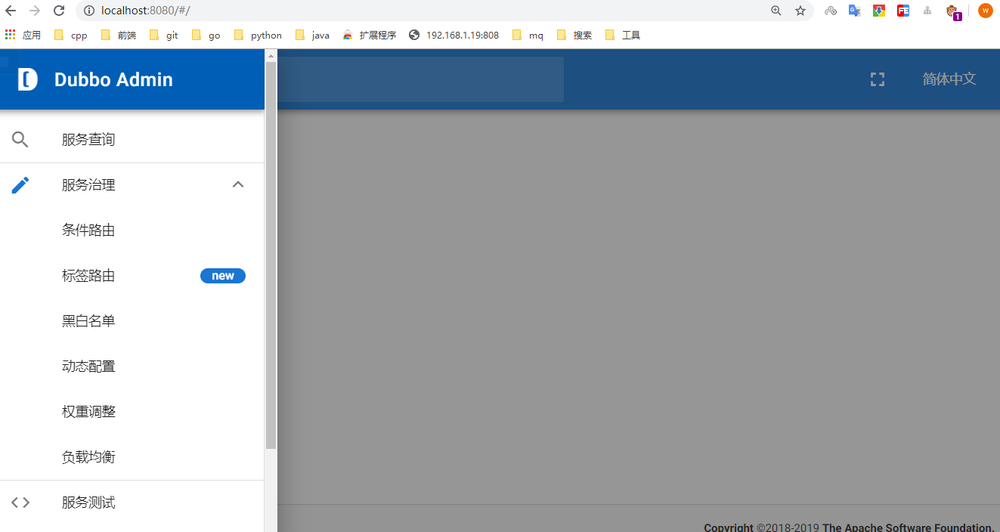
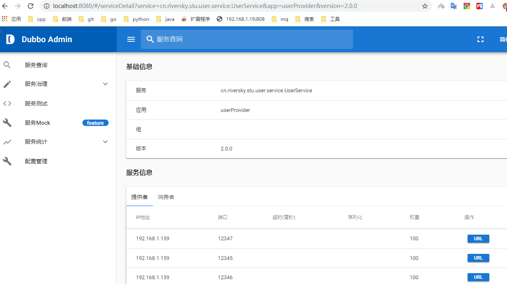
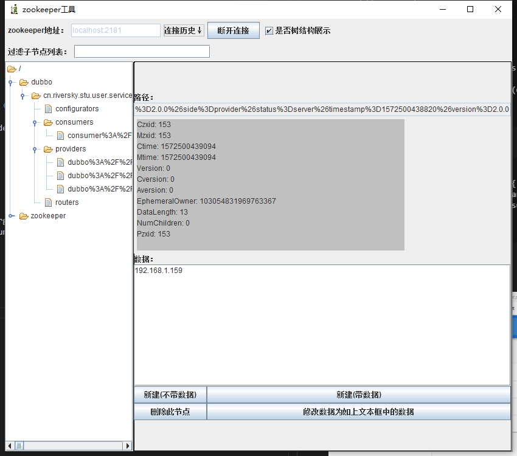
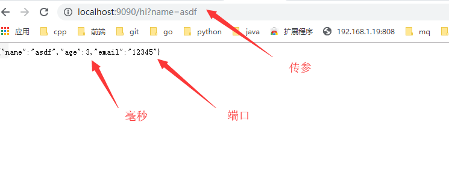

# 高性能 Java RPC 框架 Dubbo
Apache Dubbo (incubating) |ˈdʌbəʊ| 是一款高性能、轻量级的开源 Java RPC 分布式服务框架，它提供了三大核心能力：面向接口的远程方法调用，智能容错和负载均衡，以及服务自动注册和发现。她最大的特点是按照分层的方式来架构，使用这种方式可以使各个层之间解耦合（或者最大限度地松耦合）。从服务模型的角度来看，Dubbo 采用的是一种非常简单的模型，要么是提供方提供服务，要么是消费方消费服务，所以基于这一点可以抽象出服务提供方（Provider）和服务消费方（Consumer）两个角色。  
[项目地址](https://github.com/apache/dubbo)  
[官网](http://dubbo.apache.org/zh-cn)  
## Dubbo的服务治理  
  

| 特性         | 描述                                                                      |
| :----------- | :------------------------------------------------------------------------ |
| 透明远程调用 | 就像调用本地方法一样调用远程方法,只需简单配置,没有任何API侵入             |
| 负载均衡机制 | CLient端LB,可以在内网替代F5等硬件负载均衡器                               |
| 容错重试机制 | 服务Mock数据,重试次数,超时机制                                            |
| 自动注册发现 | 注册中心基于接口名查询服务提供者的IP地址,并且能够平滑添加或删除服务提供者 |
| 性能日志监控 | Monitor统计服务的调用次数和调用时间的监控中心                             |
| 服务治理中心 | 路由规则,动态配置,服务降级,访问控制,权重调整,负载均衡,等手动配置          |
| 自动治理中心 | 无,比如熔断限流机制,自动权重调整等                                        |

## 核心功能  
* Remoting：远程通讯，提供对多种 NIO 框架抽象封装，包括“同步转异步”和“请求-响应”模式的信息交换方式。
* Cluster：服务框架，提供基于接口方法的透明远程过程调用，包括多协议支持，以及软负载均衡，失败容错，地址路由，动态配置等集群支持。
* Registry：服务注册中心，服务自动发现: 基于注册中心目录服务，使服务消费方能动态的查找服务提供方，使地址透明，使服务提供方可以平滑增加或减少机器。  
## 组件角色  
  
| 角色      | 说明                                   |
| :-------- | :------------------------------------- |
| Provider  | 暴露服务的服务提供方                   |
| Consumer  | 调用远程服务的服务消费方               |
| Registry  | 服务注册与发现的注册中心               |
| Monitor   | 统计服务的调用次数和调用时间的监控中心 |
| Container | 运行服务的容器                         |

调用关系:
* 服务容器 Container 负责启动，加载，运行服务提供者。
* 服务提供者 Provider 在启动时，向注册中心注册自己提供的服务。
* 服务消费者 Consumer 在启动时，向注册中心订阅自己所需的服务。
* 注册中心 Registry 返回服务提供者地址列表给消费者，如果有变更，注册中心将基于长连接推送变更数据给消费者。
* 服务消费者 Consumer，从提供者地址列表中，基于软负载均衡算法，选一台提供者进行调用，如果调用失败，再选另一台调用。
* 服务消费者 Consumer 和提供者 Provider，在内存中累计调用次数和调用时间，定时每分钟发送一次统计数据到监控中心 Monitor。

# 运维控制台 
[github](./img/https://github.com/apache/incubator-dubbo-ops)  
管理控制台为内部裁剪版本，开源部分主要包含：路由规则，动态配置，服务降级，访问控制，权重调整，负载均衡，等管理功能。  
## 搭建
clone下来后
```
# 打包
mvn clean package

# 运行
mvn --projects dubbo-admin-backend spring-boot:run

# 浏览
http://localhost:8080
```
  
## 简单实例
### 概述
  
一般都是需要三个module(1 api 2 provier 3 consumer)  
实例采用springboot 的敏捷开发方式  
基础pom
```
<dependency>
            <groupId>org.springframework.boot</groupId>
            <artifactId>spring-boot-starter</artifactId>
</dependency>
```
### api模块
pom
```
<dependencies>
        <dependency>
            <groupId>org.projectlombok</groupId>
            <artifactId>lombok</artifactId>
            <version>1.18.10</version>
        </dependency>
</dependencies>
```
基础domain
```
@Data
public class User implements Serializable {
    private static final long serialVersionUID = 64516862993788868L;
    private String name;
    private Long age;
    private String email;
}
```
接口定义
```
public interface UserService {
    User sayHi(User name);
}
```
### 服务提供方
pom 
```
 <dependency>
            <groupId>org.springframework.boot</groupId>
            <artifactId>spring-boot-starter-actuator</artifactId>
        </dependency>
        <dependency>
            <groupId>com.alibaba.boot</groupId>
            <artifactId>dubbo-spring-boot-starter</artifactId>
            <version>0.2.0</version>
        </dependency>
        <dependency>
            <groupId>com.alibaba.boot</groupId>
            <artifactId>dubbo-spring-boot-actuator</artifactId>
            <version>0.2.0</version>
        </dependency>
        <dependency>
            <groupId>cn.riversky.stu</groupId>
            <artifactId>dubbo-user-api</artifactId>
            <version>0.0.1-SNAPSHOT</version>
        </dependency>
        <dependency>
            <groupId>junit</groupId>
            <artifactId>junit</artifactId>
            <version>4.12</version>
            <scope>test</scope>
        </dependency>
```
实现类
```
@Service(version = "${user.service.version}")
public class UserServiceImpl implements UserService
{
    @Value("${dubbo.protocol.port}")
    private String port;
    @Override
    public User sayHi(User name) {
        name.setEmail(port);
        return name;
    }
}
```
配置文件
```
spring:
  application:
    name: userProvider
user.service.version: 2.0.0
dubbo:
  scan:
    basePackages: cn.riversky.stu.user.service
  application:
    name: userProvider
    id: userProvider
#    qos-port: 22222
#    qos-enable: true
  protocol:
    id: dubbo
    name: dubbo
    port: 12345
    status: server
  registry:
    id: zookeeper
    address: zookeeper://192.168.1.159:2181
  metadata-report:
    address: zookeeper://127.0.0.1:2181
# Enables Dubbo All Endpoints
management:
  endpoint:
    dubbo:
      enabled: true
    dubbo-shutdown:
      enabled: true
    dubbo-configs:
      enabled: true
    dubbo-services:
      enabled: true
    dubbo-references:
      enabled: true
    dubbo-properties:
      enabled: true
  # Dubbo Health
  health:
    dubbo:
      status:
        ## StatusChecker Name defaults (default : "memory", "load" )
        defaults: memory
        ## StatusChecker Name extras (default : empty )
        extras: load,threadpool
```
启动类
```
@SpringBootApplication
public class UserServiceApplication {
    public static void main(String[] args) {
        SpringApplication.run(UserServiceApplication.class,args);
//        启动provider容器
        Main.main(args);
    }
}
```
### 消费方(web项目)  
pom依赖
```
<dependency>
    <groupId>org.springframework.boot</groupId>
    <artifactId>spring-boot-starter-web</artifactId>
</dependency>
<dependency>
    <groupId>org.springframework.boot</groupId>
    <artifactId>spring-boot-starter-actuator</artifactId>
</dependency>
<dependency>
    <groupId>com.alibaba.boot</groupId>
    <artifactId>dubbo-spring-boot-starter</artifactId>
    <version>0.2.0</version>
</dependency>
<dependency>
    <groupId>com.alibaba.boot</groupId>
    <artifactId>dubbo-spring-boot-actuator</artifactId>
    <version>0.2.0</version>
</dependency>
<dependency>
    <groupId>cn.riversky.stu</groupId>
    <artifactId>dubbo-user-api</artifactId>
    <version>0.0.1-SNAPSHOT</version>
</dependency>
<dependency>
    <groupId>junit</groupId>
    <artifactId>junit</artifactId>
    <version>4.11</version>
    <scope>test</scope>
</dependency>
```
controller
```
@RestController
public class UserController {
    @Reference(version = "${user.service.version}")
    private UserService userService;

    @RequestMapping("hi")
    public User sayHi(String name){
        User user = new User();
        user.setName(name);
        long l = System.currentTimeMillis();
        User s = userService.sayHi(user);
        long l1 = System.currentTimeMillis();
         s.setAge(l1-l);
         return s;
    }
}
```
配置文件
```
spring:
  application:
    name: user-consumer
server:
      port: 9090
user.service.version: 2.0.0
dubbo:
  provider:
    loadbalance: roundrobin
  scan:
    basePackages:  cn.riversky.stu.user.controller
  application:
    name: user-consumer
    id: user-consumer
  registry:
    id: zookeeper
    address: zookeeper://192.168.1.159:2181
# Enables Dubbo All Endpoints
management:
  endpoint:
    dubbo:
      enabled: true
    dubbo-shutdown:
      enabled: true
    dubbo-configs:
      enabled: true
    dubbo-services:
      enabled: true
    dubbo-references:
      enabled: true
    dubbo-properties:
      enabled: true
  # Dubbo Health
  health:
    dubbo:
      status:
        ## StatusChecker Name defaults (default : "memory", "load" )
        defaults: memory
        ## StatusChecker Name extras (default : empty )
        extras: load,threadpool

```
启动类
```
@SpringBootApplication
public class UserConsumerApplication {
    public static void main(String[] args) {
        SpringApplication.run(UserConsumerApplication.class,args);
    }
}
```
### 测试
运维服务端
  

zookeeper监控数据
  

调用测试  
  

平均时延:2毫秒 ,最大7毫秒