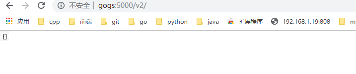
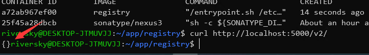

TODO: https://www.funtl.com/zh/guide/%E5%BE%AE%E6%9C%8D%E5%8A%A1%E8%A7%A3%E5%86%B3%E5%A4%8D%E6%9D%82%E9%97%AE%E9%A2%98.html#%E5%BE%AE%E6%9C%8D%E5%8A%A1%E7%AE%80%E4%BB%8B
[微服务从设计到部署](https://legacy.gitbook.com/book/docshome/microservices/details)
# 微服务简介
近年来，微服务在应用开发和部署方面取得了显著的进步。将应用开发或者重构成微服务以分离服务，通过 API 以明确的方式来相互“对话” 。例如，每个微服务都是自包含（self-contained），各自维护自己的数据存储（这非常有意义），可以独立更新其他服务。  
## 构建单体应用模型
我们假设，您开始开发一个打车应用，打算与 Uber 和 Hailo 竞争。经过初步交流和需求收集，您开始手动或者使用类似 Rails、Spring Boot、Play 或者 Maven 等平台来生成一个新项目。  
该新应用是一个模块化的六边形架构，如下图（一个简单的打车应用）所示：  
  
该应用的核心是由模块实现的业务逻辑，它定义了服务、领域对象和事件。围绕核心的是与外部世界接口对接的适配器。适配器示例包括数据库访问组件、生产和消费消息的消息组件和暴露了 API 或实现了一个 UI 的 web 组件。  
尽管有一个逻辑模块化架构，但应用程序被作为一个单体进行打包和部署。实际格式取决于应用程序的语言和框架。例如，许多 Java 应用程序被打包成 WAR 文件部署在如 Tomcat 或者 Jetty 之类的应用服务器上。其他 Java 应用程序被打包成自包含 (self-contained) 的可执行 JAR。类似地， Rails 和 Node.js 应用程序被打包为有目录层次的结构  
以这种风格编写的应用是很常见的。他们很容易开发，因为我们的 IDE 和其他工具就是专注于构建单体应用。这些应用程序也很容易测试， 您可以通过简单地启动并使用如 Selenium 测试包来测试 UI 以轻松地实现端到端 (end-to-end) 测试。单体应用同样易于部署。您只需拷贝打包好的应用程序到服务器上。您还可以通过运行多个副本和结合负载均衡器来扩展应用。在项目的早期阶段，它可以良好运作。  
## 走向单体地狱  
不幸的是，这种简单的方法有很大的局限性。成功的应用有一个趋势，随着时间推移而变得越来越臃肿。您的开发团队在每个冲刺阶段都要实现更多的用户需求，这意味着需要添加了许多行代码。几年之后，小而简单的应用将会逐渐成长成一个庞大的单体。为了给出一个极端示例，我最近和一位开发者做了交谈，他正在编写一个工具，该工具用于从他们的数百万行代码 (lines of code， LOC) 应用中分析出数千个 JAR 之间的依赖。我相信这是大量开发者在多年齐心协力下创造出了这样的野兽。  
一旦您的应用程序成为了一个庞大、复杂的单体，您的开发组织可能会陷入了一个痛苦的境地，敏捷开发和交付的任何一次尝试都将原地徘徊。一个主要问题是应用程序实在非常复杂。对于任何一个开发人员来说显得过于庞大，这是可以理解的。最终，正确修复 bug 和实现新功能变得非常困难而耗时。此外， 这种趋势就像是往下的螺旋。如果基本代码都令人难以理解，那么改变也不会变得正确，您最终得到的将是一个巨大且不可思议的大泥球。  
应用程序的规模也将减缓发展。应用程序越大，启动时间越长。我调查过开发者们的单体应用的大小和性能，一些报告的启动时间为 12 分钟。我也听说过应用程序启动需要 40 分钟以上的怪事。如果开发人员经常要重启应用服务器，那么很大一部分时间都是在等待中度过，他们的生产力将受到限制。  
另一个大问题是，复杂的单体应用本身就是持续部署的障碍。如今， SaaS 应用发展到了可以每天多次将变更推送到生产环境中。这对于复杂的单体来说非常困难，因为您需要重新部署整个应用程序才能更新其中任何一部分。 联想到我之前提到的漫长启动时间，这也不会是什么好事。此外，因变更所产生的影响通常不是很明确，您很可能需要做大量的手工测试。因此，持续部署是不可能做到的。  
当不同模块存在资源需求冲突时，单体应用可能难以扩展。例如，一个模块可能会执行 CPU 密集型图像处理逻辑，理想情况下是部署在 Amazon EC2 Compute Optimized 实例中。另一个模块可能是一个内存数据库，最适合部署到 EC2 Memory-optimized 实例。然而， 由于这些模块被部署在一起，您必须在硬件选择上做出妥协。  
单体应用的另一个问题是可靠性。因为所有模块都运行在同一进程中。任何模块的一个 bug，比如内存泄漏，可能会拖垮整个进程。此外，由于应用程序的所有实例都是相同的，该错误将影响到整个应用的可用性。  
最后但同样重要，单体应用使得采用新框架和语言变得非常困难。例如，我们假设您有 200 万行代码使用了 XYZ 框架编写。如果使用较新的 ABC 框架来重写整个应用，这将非常昂贵（在时间和成本方面），即使框架非常好。因此，这对于采用新技术是一个非常大的障碍。在项目开始时， 您无论选择何种新技术都会感到困扰。  
总结一下：您有一个成功的关键业务应用程序，它已经发展成为一个只有少数开发人员（如果有的话）能够理解的巨大单体。它使用了过时、非生产性技术编写，这使得招聘优秀开发人员变得非常困难。应用程序变得难以扩展，不可靠。因此敏捷开发和应用交付是不可能的。  
##  微服务解决复杂问题  
许多如 Amazon、 eBay 和 Netflix 这样的组织，已经采用现在所谓的微服务架构模式解决了这个问题，而不是构建一个臃肿的单体应用。它的思路是将应用程序分解成一套较小的互连服务。一个服务通常实现了一组不同的特性或功能，例如订单管理、客户管理等。每一个微服务都是一个迷你应用，它自己的六边形架构包括了业务逻辑以及多个适配器。  
一些微服务会暴露一个供其他微服务或应用客户端消费的 API。其他微服务可能实现了一个 web UI。在运行时，每个实例通常是一个云虚拟机 (virtual machine， VM) 或者一个 Docker 容器。  
例如，前面描述的系统可能分解成如下图（一个单体应用分解成微服务) 所示：  
  
应用程序的每个功能区域现在都由自己的微服务实现。此外，Web 应用程序被划分为一组更简单的 Web 应用程序。例如，以我们的出租车为例，一个是乘客的应用，一个是司机的应用。这使得它更容易地为特定的用户、司机、设备或者专门的用例部署不同的场景。每个后端服务暴露一个 REST API，大部分服务消费的 API 由其他服务提供。例如， Driver Management 使用了 Notification 服务器来通知一个可用司机一个可选路程。UI 服务调用了其他服务来渲染页面。服务也可以使用异步、基于消息的通信。  
一些 REST API 也暴露给移动端应用以供司机和乘客使用。然而，应用不能直接访问后端服务。相反，他们之间的通信是由一个称为 API 网关 (API Gateway) 的中介负责。 API 网关负责负载均衡、缓存、访问控制、 API 计量和监控， 可以通过使用 NGINX 来实现。  
开发和交付中的伸缩立方：  
  
微服务架构模式相当于此伸缩立方的 Y 轴坐标，此立方是一个来自《架构即未来》 的三维伸缩模型。另外两个坐标轴是由运行多个相同应用程序副本的负载均衡器组成的X 轴坐标和 Z 轴坐标（或数据分区) ，其中请求的属性（例如，一行记录的主键或者客户标识) 用于将请求路由到特定的服务器。  
在运行时，X 坐标轴上运行着服务的多个实例，每个服务配合负载均衡器以满足吞吐量和可用性。某些应用程序也有可能使用 Z 坐标轴来进行分区服务。下图展示了如何用 Docker 将 Trip Management 服务部署到 Amazon EC2 上运行。  
使用 Docker 部署 Trip Management 服务：  
  
在运行时，Trip Management 服务由多个服务实例组成，每个服务实例是一个 Docker容器。为了实现高可用，容器是在多个云虚拟机上运行的。服务实例的之前是一个类似 NGINX 的负载均衡器，用于跨实例分发请求。负载均衡器也可以处理其他问题，如缓存、访问控制、API 度量和监控。  
微服务架构模式明显影响到了应用程序与数据库之间的关系。与其他共享单个数据库模式 (schema) 服务有所不同， 其每一个服务都有自己的数据库模式。一方面，这种做法与企业级数据库数据模型的想法相背，此外，它经常导致部分数据冗余。然而，如果您想从微服务中受益，每一个服务都应该有自己的数据库模式。因为它能实现松耦合。下图展示了数据库架构示例应用程序。  
每个服务都拥有各自的数据库。而且，服务可以使用一种最适合其需求、号称多语言持久架构 （polyglot persistence architecture ) 的数据库。例如，DriverManagement，要找到与潜在乘客接近的司机，就必须使用支持高效地理查询的数据库。   
打车应用的数据库架构：  
  
从表面上看，微服务架构模式类似于 SOA。微服务是由一组服务组成。然而，换另一种方式去思考微服务架构模式，它是没有商业化的 SOA，没有集成 Web 服务规范 (WS-* ) 和企业服务总线 (Enterprise Service Bus， ESB) 。基于微服务的应用支持更简单、轻量级的协议，例如，REST，而不是 WS-*。他们也尽量避免使用 ESB，而是实现微服务本身具有类似 ESB 的功能。微服务架构也拒绝了 SOA 的其他部分，例如，数据访问规范模式概念。  
## 微服务优点
微服务架构模式有许多非常好的地方。  
1. 它解决了复杂问题。它把可能会变得庞大的单体应用程序分解成一套服务。虽然功能数量不变，但是应用程序已经被分解成可管理的块或者服务。每个服务都有一个明确定义边界的方式，如远程过程调用（RPC）驱动或消息驱动 API。微服务架构模式强制一定程度的模块化，实际上，使用单体代码来实现是极其困难的。因此，使用微服务架构模式，个体服务能被更快地开发，并更容易理解与维护。  
2. 这种架构使得每个服务都可以由一个团队独立专注开发。开发者可以自由选择任何符合服务 API 契约的技术。当然，更多的组织是希望通过技术选型限制来避免完全混乱的状态。然而，这种自由意味着开发人员不再有可能在这种自由的新项目开始时使用过时的技术。当编写一个新服务时，他们可以选择当前的技术。此外，由于服务较小，使用当前技术重写旧服务将变得更加可行。
3. 微服务架构模式可以实现每个微服务独立部署。开发人员根本不需要去协调部署本地变更到服务。这些变更一经测试即可立即部署。比如，UI 团队可以执行 A|B 测试，并快速迭代 UI 变更。微服务架构模式使得持续部署成为可能。  
4. 微服务架构模式使得每个服务能够独立扩展。您可以仅部署满足每个服务的容量和可用性约束的实例数目。此外，您可以使用与服务资源要求最匹配的硬件。例如，您可以在 EC2 Compute Optimized 实例上部署一个 CPU 密集型图像处理服务，并且在 EC2 Memory-optimized 实例上部署一个内存数据库服务。  
## 微服务缺点
就像 Fred Brooks 大约在 30 年前写的《人月神话》中说的，没有银弹。与其他技术一样，微服务架构模式也存在着缺点。其中一个缺点就是名称本身。微服务这个术语的重点过多偏向于服务的规模。事实上，有些开发者主张构建极细粒度的 10 至 100 LOC（代码行） 服务，虽然这对于小型服务可能比较好，但重要的是要记住，小型服务只是一种手段，而不是主要目标。微服务的目标在于充分分解应用程序以方便应用敏捷开发和部署。  
微服务另一个主要缺点是由于微服务是一个分布式系统，其使得整体变得复杂。开发者需要选择和实现基于消息或者 RPC 的进程间通信机制。此外，由于目标请求可能很慢或者不可用，他们必须要编写代码来处理局部故障。虽然这些并不是很复杂、高深，但模块间通过语言级方法/过程调用相互调用，这比单体应用要复杂得多。  
微服务的另一个挑战是分区数据库架构。更新多个业务实体的业务事务是相当普遍的。这些事务在单体应用中的实现显得微不足道，因为单体只存在一个单独的数据库。在基于微服务的应用程序中，您需要更新不同服务所用的数据库。通常不会选择分布式事务，不仅仅是因为 CAP 定理。他们根本不支持如今高度可扩展的 NoSQL 数据库和消息代理。您最后不得不使用基于最终一致性的方法，这对于开发人员来说更具挑战性。
测试微服务应用程序也很复杂。例如，使用现代框架如 Spring Boot，只需要编写一个测试类来启动一个单体 web 应用程序并测试其 REST API。相比之下，一个类似的测试类对于微服务来说需要启动该服务及其所依赖的所有服务，或者至少为这些服务配置存根。再次声明，虽然这不是一件高深的事情，但不要低估了这样做的复杂性。  
微服务架构模式的另一个主要挑战是实现了跨越多服务变更。例如，我们假设您正在实现一个变更服务 A、服务 B 和 服务 C 的需求，其中 A 依赖于 B，且 B 依赖于 C。在单体应用程序中，您可以简单地修改相应的模块、整合变更并一次性部署他们。相反，在微服务中您需要仔细规划和协调出现的变更至每个服务。例如，您需要更新服务 C，然后更新服务 B，最后更新服务 A。幸运的是，大多数变更只会影响一个服务，需要协调的多服务变更相对较少。  
部署基于微服务的应用程序也是相当复杂的。一个单体应用可以很容易地部署到基于传统负载均衡器的一组相同服务器上。每个应用程序实例都配置有基础设施服务的位置（主机和端口），比如数据库和消息代理。相比之下，微服务应用程序通常由大量的服务组成。例如，据 Adrian Cockcroft 了解到，Hailo 拥有 160 个不同的服务，Netflix 拥有的服务超过 600 个。  
每个服务都有多个运行时实例。还有更多的移动部件需要配置、部署、扩展和监控。此外，您还需要实现服务发现机制，使得服务能够发现需要与之通信的任何其他服务的位置（主机和端口）。比较传统麻烦的基于票据（ticket-based）和手动的操作方式无法扩展到如此复杂程度。因此，要成功部署微服务应用程序，需要求开发人员能高度控制部署方式和高度自动化。  
一种自动化方式是使用现成的平台即服务（PaaS），如 Cloud Foundry。PaaS 为开发人员提供了一种简单的方式来部署和管理他们的微服务。它让开发人员避开了诸如采购和配置 IT 资源等烦恼。同时，配置 PaaS 的系统人员和网络专业人员可以确保达到最佳实践以落实公司策略。  
自动化微服务部署的另一个方式是开发自己的 PaaS。一个普遍的起点是使用集群方案，如 Kubernetes，与 Docker 等容器技术相结合。  
**小结**  
构建复杂的微服务应用程序本质上是困难的。单体架构模式只适用于简单、轻量级的应用程序，如果您使用它来构建复杂应用，您最终会陷入痛苦的境地。微服务架构模式是复杂、持续发展应用的一个更好的选择。尽管它存在着缺点和实现挑战。  
# Linux
Linux 是一种自由和开放源码的类 UNIX 操作系统，使用 Linux 内核。目前存在着许多不同的 Linux 发行版，可安装在各种各样的电脑硬件设备，从手机、平板电脑、路由器和影音游戏控制台，到桌上型电脑，大型电脑和超级电脑。 Linux 是一个领先的操作系统，世界上运算最快的 10 台超级电脑运行的都是 Linux 操作系统。  
## Linux简介
Linux 是一种自由和开放源码的类 UNIX 操作系统，使用 Linux 内核。目前存在着许多不同的 Linux 发行版，可安装在各种各样的电脑硬件设备，从手机、平板电脑、路由器和影音游戏控制台，到桌上型电脑，大型电脑和超级电脑。 Linux 是一个领先的操作系统，世界上运算最快的 10 台超级电脑运行的都是 Linux 操作系统。  
Linux 操作系统也是自由软件和开放源代码发展中最著名的例子。只要遵循 GNU 通用公共许可证,任何人和机构都可以自由地使用 Linux 的所有底层源代码，也可以自由地修改和再发布。严格来讲，Linux 这个词本身只表示 Linux 内核，但在实际上人们已经习惯了用 Linux 来形容整个基于 Linux 内核，并且使用 GNU 工程各种工具和数据库的操作系统 (也被称为 GNU/ Linux)。通常情况下，Linux 被打包成供桌上型电脑和服务器使用的 Linux 发行版本。一些流行的主流 Linux 发行版本，包括 Debian (及其衍生版本 Ubuntu)，Fedora 和 OpenSUSE 等。Kernel + Softwares + Tools 就是 Linux Distribution  
目前市面上较知名的发行版有：Ubuntu、RedHat、CentOS、Debian、Fedora、SuSE、OpenSUSE、TurboLinux、BluePoint、RedFlag、Xterm、SlackWare等。  
## Linux与Windows比较  
目前国内 Linux 更多的是应用于服务器上，而桌面操作系统更多使用的是 Windows。主要区别如下  

| 比较     | Windows                                                                                                                                                                                                                                             | Linux                                                                                                                                                                                                                                                                                                                                       |
|----------|-----------------------------------------------------------------------------------------------------------------------------------------------------------------------------------------------------------------------------------------------------|---------------------------------------------------------------------------------------------------------------------------------------------------------------------------------------------------------------------------------------------------------------------------------------------------------------------------------------------|
| 界面     | 界面统一，外壳程序固定所有 Windows 程序菜单几乎一致，快捷键也几乎相同                                                                                                                                                                               | 图形界面风格依发布版不同而不同，可能互不兼容。GNU/Linux 的终端机是从 UNIX 传承下来，基本命令和操作方法也几乎一致。                                                                                                                                                                                                                          |
| 驱动程序 | 驱动程序丰富，版本更新频繁。默认安装程序里面一般包含有该版本发布时流行的硬件驱动程序，之后所出的新硬件驱动依赖于硬件厂商提供。对于一些老硬件，如果没有了原配的驱动有时很难支持。另外，有时硬件厂商未提供所需版本的 Windows 下的驱动，也会比较头痛。 | 由志愿者开发，由Linux核心开发小组发布，很多硬件厂商基于版权考虑并未提供驱动程序，尽管多数无需手动安装，但是涉及安装则相对复杂，使得新用户面对驱动程序问题（是否存在和安装方法）会一筹莫展。但是在开源开发模式下，许多老硬件尽管在 Windows 下很难支持的也容易找到驱动。HP、Intel、AMD 等硬件厂商逐步不同程度支持开源驱动，问题正在得到缓解。 |
| 使用     | 使用比较简单，容易入门。图形化界面对没有计算机背景知识的用户使用十分有利。                                                                                                                                                                          | 图形界面使用简单，容易入门。文字界面，需要学习才能掌握。                                                                                                                                                                                                                                                                                    |
| 学习     | 系统构造复杂、变化频繁，且知识、技能淘汰快，深入学习困难。                                                                                                                                                                                          | 系统构造简单、稳定，且知识、技能传承性好，深入学习相对容易。                                                                                                                                                                                                                                                                                |
| 软件     | 每一种特定功能可能都需要商业软件的支持，需要购买相应的授权。                                                                                                                                                                                        | 大部分软件都可以自由获取，同样功能的软件选择较少。                                                                                                                                                                                                                                                                                          |  

## Linux远程控制管理
**概述**  
传统的网络服务程序，FTP、POP、telnet 本质上都是不安全的，因为它们在网络上通过明文传送口令和数据，这些数据非常容易被截获。SSH 叫做 Secure Shell。通过 SSH，可以把传输数据进行加密，预防攻击，传输的数据进行了压缩，可以加快传输速度。  
**OpenSSH**  
SSH 是芬兰一家公司开发。但是受到版权和加密算法限制，现在很多人都使用 OpenSSH。OpenSSH 是 SSH 的替代软件，免费。  
OpenSSH 由客户端和服务端组成。  
* 基于口令的安全验证：知道服务器的帐号密码即可远程登录，口令和数据在传输过程中都会被加密。
* 基于密钥的安全验证：此时需要在创建一对密钥，把公有密钥放到远程服务器上自己的宿主目录中，而私有密钥则由自己保存。  
**检查软件是否安装**  
```
apt-cache policy openssh-client openssh-server
```
**安装服务端**  
```
apt-get install openssh-server
```
**安装客户端** 
```
apt-get install openssh-client
``` 
OpenSSH 服务器的主要配置文件为 /etc/ssh/sshd\_config，几乎所有的配置信息都在此文件中。  
**XShell**  
XShell 是一个强大的安全终端模拟软件，它支持 SSH1, SSH2, 以及 Microsoft Windows 平台的 TELNET 协议。XShell 通过互联网到远程主机的安全连接以及它创新性的设计和特色帮助用户在复杂的网络环境中享受他们的工作。  
XShell 可以在 Windows 界面下用来访问远端不同系统下的服务器，从而比较好的达到远程控制终端的目的。  
## Linux的目录结构 
  

| 目录 | 说明                                                                  |
|------|-----------------------------------------------------------------------|
| bin  | 存放二进制可执行文件(ls,cat,mkdir等)                                  |
| boot | 存放用于系统引导时使用的各种文件                                      |
| dev  | 用于存放设备文件                                                      |
| etc  | 存放系统配置文件                                                      |
| home | 存放所有用户文件的根目录                                              |
| lib  | 存放跟文件系统中的程序运行所需要的共享库及内核模块                    |
| mnt  | 系统管理员安装临时文件系统的安装点                                    |
| opt  | 额外安装的可选应用程序包所放置的位置                                  |
| proc | 虚拟文件系统，存放当前内存的映射                                      |
| root | 超级用户目录                                                          |
| sbin | 存放二进制可执行文件，只有root才能访问                                |
| tmp  | 用于存放各种临时文件                                                  |
| usr  | 用于存放系统应用程序，比较重要的目录/usr/local 本地管理员软件安装目录 |
| var  | 用于存放运行时需要改变数据的文件                                      |

## Linux操作文件目录
| 命令  | 说明                               | 语法                                            | 参数  | 参数说明                           |
|-------|------------------------------------|-------------------------------------------------|-------|------------------------------------|
| ls    | 显示文件和目录列表                 | ls [-alrtAFR] [name...]                         |       |                                    |
|       |                                    |                                                 | -l    | 列出文件的详细信息                 |
|       |                                    |                                                 | -a    | 列出当前目录所有文件，包含隐藏文件 |
| mkdir | 创建目录                           | mkdir [-p] dirName                              |       |                                    |
|       |                                    |                                                 | -p    | 父目录不存在情况下先生成父目录     |
| cd    | 切换目录                           | cd [dirName]                                    |       |                                    |
| touch | 生成一个空文件                     |                                                 |       |                                    |
| echo  | 生成一个带内容文件                 | echo abcd > 1.txt，echo 1234 >> 1.txt           |       |                                    |
| cat   | 显示文本文件内容                   | cat [-AbeEnstTuv] [--help] [--version] fileName |       |                                    |
| cp    | 复制文件或目录                     | cp [options] source dest                        |       |                                    |
| rm    | 删除文件                           | rm [options] name...                            |       |                                    |
|       |                                    |                                                 | -f    | 强制删除文件或目录                 |
|       |                                    |                                                 | -r    | 同时删除该目录下的所有文件         |
| mv    | 移动文件或目录                     | mv [options] source dest                        |       |                                    |
| find  | 在文件系统中查找指定的文件         |                                                 |       |                                    |
|       |                                    |                                                 | -name | 文件名                             |
| grep  | 在指定的文本文件中查找指定的字符串 |                                                 |       |                                    |
| tree  | 用于以树状图列出目录的内容         |                                                 |       |                                    |
| pwd   | 显示当前工作目录                   |                                                 |       |                                    |
| ln    | 建立软链接                         |                                                 |       |                                    |
| more  | 分页显示文本文件内容               |                                                 |       |                                    |
| head  | 显示文件开头内容                   |                                                 |       |                                    |
| tail  | 显示文件结尾内容                   |                                                 |       |                                    |
|       |                                    |                                                 | -f    | 跟踪输出                           |
## Linux系统管理命令   
 | 命令     | 说明                                         |
|----------|----------------------------------------------|
| stat     | 显示指定文件的相关信息,比ls命令显示内容更多  |
| who      | 显示在线登录用户                             |
| hostname | 显示主机名称                                 |
| uname    | 显示系统信息                                 |
| top      | 显示当前系统中耗费资源最多的进程             |
| ps       | 显示瞬间的进程状态                           |
| du       | 显示指定的文件（目录）已使用的磁盘空间的总量 |
| df       | 显示文件系统磁盘空间的使用情况               |
| free     | 显示当前内存和交换空间的使用情况             |
| ifconfig | 显示网络接口信息                             |
| ping     | 测试网络的连通性                             |
| netstat  | 显示网络状态信息                             |
| clear    | 清屏                                         |
| kill     | 杀死一个进程                                 |  
## Linux开关机命令
shutdown 命令可以用来进行关机程序，并且在关机以前传送讯息给所有使用者正在执行的程序，shutdown 也可以用来重开机。  
| 命令     | 语法                                            | 参数       | 参数说明                                                         |
|----------|-------------------------------------------------|------------|------------------------------------------------------------------|
| shutdown | shutdown [-t seconds] [-rkhncfF] time [message] |            |                                                                  |
|          |                                                 | -t seconds | 设定在几秒钟之后进行关机程序                                     |
|          |                                                 | -k         | 并不会真的关机，只是将警告讯息传送给所有只用者                   |
|          |                                                 | -r         | 关机后重新开机（重启）                                           |
|          |                                                 | -h         | 关机后停机                                                       |
|          |                                                 | -n         | 不采用正常程序来关机，用强迫的方式杀掉所有执行中的程序后自行关机 |
|          |                                                 | -c         | 取消目前已经进行中的关机动作                                     |
|          |                                                 | -f         | 关机时，不做 fcsk 动作(检查 Linux 档系统)                        |
|          |                                                 | -F         | 关机时，强迫进行 fsck 动作                                       |
|          |                                                 | time       | 设定关机的时间                                                   |
|          |                                                 | message    | 传送给所有使用者的警告讯息                                       |  

**重启**  
* reboot
* shutdown -r now  

**关机**  
* shutdown -h now
## Linux压缩命令
解压 zxvf
压缩 zcvf  
## 软件包管理  
APT(Advanced Packaging Tool) 是 Debian/Ubuntu 类 Linux 系统中的软件包管理程序, 使用它可以找到想要的软件包, 而且安装、卸载、更新都很简便；也可以用来对 Ubuntu 进行升级; APT 的源文件为 /etc/apt/ 目录下的 sources.list 文件。  
**修改数据源**  
由于国内的网络环境问题，我们需要将 Ubuntu 的数据源修改为国内数据源，操作步骤如下：  
**#查看系统版本** 
```
lsb_release -a
```
输出结果为  
```
root@DESKTOP-MP32LRE:~# lsb_release -a
No LSB modules are available.
Distributor ID: Ubuntu
Description:    Ubuntu 18.04.3 LTS
Release:        18.04
Codename:       bionic
```
注意： Codename 为 bionic ,该名称为我们 Ubuntu 系统的名称，修改数据源需要用到该名称
**编辑数据源**  
```
vi /etc/apt/sources.list
``` 
**删除全部内容并修改为**  
```
deb http://mirrors.aliyun.com/ubuntu/ bionic main restricted universe multiverse
deb http://mirrors.aliyun.com/ubuntu/ bionic-security main restricted universe multiverse
deb http://mirrors.aliyun.com/ubuntu/ bionic-updates main restricted universe multiverse
deb http://mirrors.aliyun.com/ubuntu/ bionic-backports main restricted universe multiverse
```
**更新数据源**  
```
apt-get update
```
**常用apt命令**
|描述|命令|
|:--|:--|
|搜索|apt-cache search package|
|获取包信息|apt-cache show pakcage|
|删除包以及配置文件|apt-get remove package --purge|
|了解使用依赖|apt-cache depends package|
|查看被哪些包依赖|apt-cache rdepends package|
|安装相关的编译环境|apt-get build-dep package|
|下载源代码|apt-get source package|
|清理无用的包|apt-get clean && apt-get autoclean|
|检查是否有损坏的依赖|apt-get check|
## 用户和组管理
Linux 操作系统是一个多用户操作系统，它允许多用户同时登录到系统上并使用资源。系统会根据账户来区分每个用户的文件，进程，任务和工作环境，使得每个用户工作都不受干扰。  
**使用Root用户**  
在实际生产操作中，我们基本上都是使用超级管理员账户操作 Linux 系统，也就是 Root 用户，Linux 系统默认是关闭 Root 账户的，我们需要为 Root 用户设置一个初始密码以方便我们使用。  
设置Root账户密码
```
sudo passwd root
```
切换到Root
```
su
```
设置允许远程登录Root
```
nano /etc/ssh/sshd_config  
# Authentication:
LoginGraceTime 120
#PermitRootLogin without-password     //注释此行
PermitRootLogin yes                             //加入此行
StrictModes yes

重启服务
service ssh restart
```
### 用户账户说明  
**普通账户**  
普通用户在系统上的任务是进行普通操作
**超级管理员**  
管理员在系统上的任务是对普通用户和整个系统进行管理。对系统具有绝对的控制权，能够对系统进行一切操作。用 root 表示，root 用户在系统中拥有最高权限，默认下 Ubuntu 用户的 root 用户是不能登录的。  
**安装时创建的系统用户**  
此用户创建时被添加到 admin 组中，在 Ubuntu 中，admin 组中的用户默认是可以使用 sudo 命令来执行只有管理员才能执行的命令的。如果不使用 sudo 就是一个普通用户  
### 组账户说明  
**私有组**  
当创建一个用户时没有指定属于哪个组，Linux 就会建立一个与用户同名的私有组，此私有组只含有该用户。  
**标准组**  
当创建一个用户时可以选定一个标准组，如果一个用户同时属于多个组时，登录后所属的组为主组，其他的为附加组。  
### 系统账户文件说明  
**/etc/passwd**   

每一行代表一个账号，众多账号是系统正常运行所必须的，例如 bin，nobody 每行定义一个用户账户，此文件对所有用户可读。每行账户包含如下信息：
```
root:x:0:0:root:/root:/bin/bash
riversky:x:1000:1000:riversky,r,r,r,r:/home/riversky:/bin/bash
```  
```
用户名:口令:用户标识号:组标识号:注释:宿主目录|命令解释器
```
* 用户名： 就是账号，用来对应 UID，root UID 是 0。
* 密码，早期 UNIX 系统密码存在此字段，由于此文件所有用户都可以读取，密码容易泄露，后来这个字段数据就存放到 /etc/shadow 中，这里只能看到 X。
* 用户标示号（UID）： 系统内唯一，root 用户的 UID 为 0，普通用户从 1000 开始，1-999 是系统的标准账户，500-65536 是可登陆账号。
* 组标示号（GID）： 与 /etc/group 相关用来规定组名和 GID 相对应。
* 注释： 注释账号
* 宿主目录（主文件夹）： 用户登录系统后所进入的目录 root 在 /root/itcast
* 命令解释器（shell）： 指定该用户使用的 shell ，默认的是 /bin/bash

**/etc/shadow**  
为了增加系统的安全性，用户口令通常用 shadow passwords 保护。只有 root 可读。每行包含如下信息：  
```
root:$6$gVC4F1IN$y6HqEiwHaVFIO7UBbYxBsHXyyiJZunD3bVgKfldJfRafpzvrxaOj9bCeHx5o16VgsG2mycXUT8L2OsIWcaWRj.:18205:0:99999:7:::
riversky:$6$zaPwtikM$4dkpk6orYdENYqm1I2I3RbN5cnzImrEwsQhWtGL1fNaicbsHoAGt26yUr.kCJsqY7Itf1aB40Dyzx8c2QVRiW1:18205:0:99999:7:::
```
账户名称:密码:最近修改密码日期:密码最小时间间隔:密码最大时间间隔:密码到期警告时间:密码到期后帐号宽限时间:密码到期后禁用账户时间:保留
* 账号名称： 需要和 /etc/passwd 一致
* 密码： 经过加密，虽然加密，但不表示不会被破解，该文件默认权限如下：
* 最近修改密码日期： 从1970-1-1起，到用户最后一次更改口令的天数
* 密码最小时间间隔： 从1970-1-1起，到用户可以更改口令的天数
* 密码最大时间间隔： 从1970-1-1起，必须更改的口令天数
* 密码到期警告时间： 在口令过期之前几天通知
* 密码到期后账号宽限时间
* 密码到期禁用账户时间： 在用户口令过期后到禁用账户的天数
* 保留

**/etc/group**  
用户组的配置文件  
```
root:x:0:
```
* 用户组名称
* 用户组密码: 给用户组管理员使用，通常不用
* GID:用户组ID
* 此用户支持的账号名称： 一个账号可以加入多个用户组，例如想要 itcast 加入 root 这个用户组，将该账号填入该字段即可 root❌0:root, icast 将用户进行分组是 Linux 对用户进行管理及控制访问权限的一种手段。一个中可以有多个用户，一个用户可以同时属于多个组。该文件对所有用户可读。  

**/etc/gshadow** 
该文件用户定义用户组口令，组管理员等信息只有root用户可读。  
```
root:\*::
```
* 用户组名
* 密码列
* 用户组管理员的账号
* 用户组所属账号
  
### 账户管理常用命令
**增加用户**  
```
useradd 用户名
useradd -u (UID号)
useradd -p (口令)
useradd -g (分组)
useradd -s (SHELL)
useradd -d (用户目录)
```
**修改用户**  
```
usermod -u (新UID)
usermod -d (用户目录)
usermod -g (组名)
usermod -s (SHELL)
usermod -p (新口令)
usermod -l (新登录名)
usermod -L (锁定用户账号密码)
usermod -U (解锁用户账号)
```
如：usermod -u 1024 -g group2 -G root lusifer  
将 lusifer 用户 uid 修改为 1024，默认组改为系统中已经存在的 group2，并且加入到系统管理员组
**删除用户**  
```
userdel 用户名 (删除用户账号)
userdel -r 删除账号时同时删除目录
```
**组账户维护**  
```
groupadd 组账户名 (创建新组)
groupadd -g 指定组GID
groupmod -g 更改组的GID
groupmod -n 更改组账户名
groupdel 组账户名 (删除指定组账户)
```
**口令维护**  
```
passwd 用户账户名 (设置用户口令)
passwd -l 用户账户名 (锁定用户账户)
passwd -u 用户账户名 (解锁用户账户)
passwd -d 用户账户名 (删除账户口令)
gpasswd -a 用户账户名 组账户名 (将指定用户添加到指定组)
gpasswd -d 用户账户名 组账户名 (将用户从指定组中删除)
gpasswd -A 用户账户名 组账户名 (将用户指定为组的管理员)
```
**用户和组状态**  
```
su 用户名(切换用户账户)
id 用户名(显示用户的UID，GID)
whoami (显示当前用户名称)
groups (显示用户所属组)
```
## 文件权限管理  
**查看文件和目录权限**  
```
ls -al
drwxr-xr-x 10 root root 4096 Nov  5 11:28 ../
drwxr-xr-x  6 root root 4096 Nov 11 09:43 apache-maven-3.6.2/
drwxr-xr-x  2 root root 4096 May 21 22:39 bin/
drwxr-xr-x  2 root root 4096 May 21 22:39 etc/
drwxr-xr-x  2 root root 4096 May 21 22:39 games/
drwxr-xr-x  2 root root 4096 May 21 22:39 include/
drwxr-xr-x  7 uucp  143 4096 Oct  5 18:13 jdk1.8.0_231/
drwxr-xr-x  3 root root 4096 May 21 22:39 lib/
drwxr-xr-x  3 root root 4096 Nov  5 11:36 libexec/
lrwxrwxrwx  1 root root    9 May 21 22:39 man -> share/man/
drwxr-xr-x  2 root root 4096 May 21 22:39 sbin/
drwxr-xr-x  4 root root 4096 May 21 22:39 share/
drwxr-xr-x  2 root root 4096 May 21 22:39 src/
```
* d：文档类型为目录
* rw-：说明用户 root 有读写权限，并且具有运行权限
* r-x：表示用户组 root 只有读和运行的权限，没有写权限
* r-x：其他用户只有读和运行的权限，没有写权限

**文档类型**  
*  d 表示目录
*  l 表示软连接
*  – 表示文件
*  c 表示串行端口字符设备文件
*  b 表示可供存储的块设备文件
*  余下的字符 3 个字符为一组。r 只读，w 可写，x 可执行，- 表示无此权限

**连接数**  
指有多少个文件指向同一个索引节点。  
**文档所属用户和所属组**  
就是文档属于哪个用户和用户组。文件所属用户和组是可以更改的  
**文档大小**  
默认是 bytes

### 更改操作权限
**chown**  
是 change owner 的意思，主要作用就是改变文件或者目录所有者，所有者包含用户和用户组  
```
chown [-R] 用户名称 文件或者目录

chown [-R] 用户名称 用户组名称 文件或目录
```
-R：进行递归式的权限更改，将目录下的所有文件、子目录更新为指定用户组权限  
**chmod**  
改变访问权限  
chmod [who] [+ | - | =] [mode] 文件名

**who**
表示操作对象可以是以下字母的一个或者组合  
*  u：用户 user
*  g：用户组 group
*  o：表示其他用户
*  a：表示所有用户是系统默认的  
  
**操作符号**  
*  +：表示添加某个权限
*  -：表示取消某个权限
*  =：赋予给定的权限，取消文档以前的所有权限


## 程序安装Java和maven 
需要注意一般情况程序安装在/usr/local目录下,日志或者数据在/var目录,配置文件在/etc目录下
1. 将压缩包赋值到/usr/local,并解压
2. 配置环境变量
```
root@DESKTOP-MP32LRE:/usr/local# cat /etc/environment
PATH="/usr/local/sbin:/usr/local/bin:/usr/sbin:/usr/bin:/sbin:/bin:/usr/games:/usr/local/games"
export JAVA_HOME=/usr/local/jdk1.8.0_231
export JRE_HOME=/usr/local/jdk1.8.0_231/jre

export CLASSPATH=$CLASSPATH:$JAVA_HOME/lib:$JAVA_HOME/jre/lib

```
profile
```
root@DESKTOP-MP32LRE:/usr/local# cat /etc/profile
# /etc/profile: system-wide .profile file for the Bourne shell (sh(1))
# and Bourne compatible shells (bash(1), ksh(1), ash(1), ...).

if [ "${PS1-}" ]; then
  if [ "${BASH-}" ] && [ "$BASH" != "/bin/sh" ]; then
    # The file bash.bashrc already sets the default PS1.
    # PS1='\h:\w\$ '
    if [ -f /etc/bash.bashrc ]; then
      . /etc/bash.bashrc
    fi
  else
    if [ "`id -u`" -eq 0 ]; then
      PS1='# '
    else
      PS1='$ '
    fi
  fi
fi
export JAVA_HOME=/usr/local/jdk1.8.0_231

export JRE_HOME=/usr/local/jdk1.8.0_231/jre
export MAVEN_HOME=/usr/local/apache-maven-3.6.2
export CLASSPATH=$CLASSPATH:$JAVA_HOME/lib:$JAVA_HOME/jre/lib

export PATH=$JAVA_HOME/bin:$JAVA_HOME/jre/bin:$MAVEN_HOME/bin:$PATH:$HOME/bin
if [ -d /etc/profile.d ]; then
  for i in /etc/profile.d/*.sh; do
    if [ -r $i ]; then
      . $i
    fi
  done
  unset i
fi
```
3. 测试
```
root@DESKTOP-MP32LRE:/usr/local# java -version
java version "1.8.0_231"
Java(TM) SE Runtime Environment (build 1.8.0_231-b11)
Java HotSpot(TM) 64-Bit Server VM (build 25.231-b11, mixed mode)
root@DESKTOP-MP32LRE:/usr/local# mvn -version
Apache Maven 3.6.2 (40f52333136460af0dc0d7232c0dc0bcf0d9e117; 2019-08-27T23:06:16+08:00)
Maven home: /usr/local/apache-maven-3.6.2
Java version: 1.8.0_231, vendor: Oracle Corporation, runtime: /usr/local/jdk1.8.0_231/jre
Default locale: en, platform encoding: UTF-8
OS name: "linux", version: "4.19.79-microsoft-standard", arch: "amd64", family: "unix"
```
## 程序安装Mysql
本文采用docker-compose的方式
```
version: '3.1'
services:
  mysql:
    restart: always
    image: mysql:5.7.22
    container_name: mysql
    ports:
      - 3306:3306
    environment:
      TZ: Asia/Shanghai
      MYSQL_ROOT_PASSWORD: 123456
    command:
      --character-set-server=utf8mb4
      --collation-server=utf8mb4_general_ci
      --explicit_defaults_for_timestamp=true
      --lower_case_table_names=1
      --max_allowed_packet=128M
      --sql-mode="STRICT_TRANS_TABLES,NO_AUTO_CREATE_USER,NO_ENGINE_SUBSTITUTION,NO_ZERO_DATE,NO_ZERO_IN_DATE,ERROR_FOR_DIVISION_BY_ZERO"
    volumes:
      - mysql-data:/var/lib/mysql

volumes:
  mysql-data:
```
## Linux LVM磁盘扩容  
### 基本概念
**物理卷 Physical volume (PV)**  
可以在上面建立卷组的媒介，可以是硬盘分区，也可以是硬盘本身或者回环文件（loopback file）。物理卷包括一个特殊的 header，其余部分被切割为一块块物理区域（physical extents）。
**卷组 Volume group (VG)**  
将一组物理卷收集为一个管理单元
**逻辑卷 Logical volume (LV)**  
虚拟分区，由物理区域（physical extents）组成。
**物理区域 Physical extent (PE)**  
硬盘可供指派给逻辑卷的最小单位（通常为 4MB）。
### 磁盘操作命令
**查看挂载点**   
```
root@DESKTOP-MP32LRE:/usr/local# df -h
Filesystem      Size  Used Avail Use% Mounted on
/dev/sdb        251G  4.1G  235G   2% /
tmpfs           7.3G     0  7.3G   0% /mnt/wsl
tools           121G  100G   21G  83% /init
none            7.3G     0  7.3G   0% /dev
none            7.3G  4.0K  7.3G   1% /run
none            7.3G     0  7.3G   0% /run/lock
none            7.3G     0  7.3G   0% /run/shm
none            7.3G     0  7.3G   0% /run/user
tmpfs           7.3G     0  7.3G   0% /sys/fs/cgroup
C:\             121G  100G   21G  83% /mnt/c
D:\             172G  133G   39G  78% /mnt/d
E:\             162G  4.3G  157G   3% /mnt/e
F:\             161G  2.9G  158G   2% /mnt/f
G:\             161G   62G   99G  39% /mnt/g
H:\             160G   74G   86G  47% /mnt/h
```
**lvdisplay（显示当前的 logical volume）**  
>>  注意这里目前有两个，一个是文件系统所在的 volume，另一个是 swap 分区使用的 volume，当然，我们需要扩容的是第一个
**vgdisplay(显示当前的volume group)**
**pvdisplay(显示当前的physical volume)** 
### 开始LVM扩容
查看fdisk
```
root@DESKTOP-MP32LRE:/usr/local# fdisk -l
Disk /dev/ram0: 64 MiB, 67108864 bytes, 131072 sectors
Units: sectors of 1 * 512 = 512 bytes
Sector size (logical/physical): 512 bytes / 4096 bytes
I/O size (minimum/optimal): 4096 bytes / 4096 bytes


Disk /dev/ram1: 64 MiB, 67108864 bytes, 131072 sectors
Units: sectors of 1 * 512 = 512 bytes
Sector size (logical/physical): 512 bytes / 4096 bytes
I/O size (minimum/optimal): 4096 bytes / 4096 bytes


Disk /dev/ram2: 64 MiB, 67108864 bytes, 131072 sectors
Units: sectors of 1 * 512 = 512 bytes
Sector size (logical/physical): 512 bytes / 4096 bytes
I/O size (minimum/optimal): 4096 bytes / 4096 bytes


Disk /dev/ram3: 64 MiB, 67108864 bytes, 131072 sectors
Units: sectors of 1 * 512 = 512 bytes
Sector size (logical/physical): 512 bytes / 4096 bytes
I/O size (minimum/optimal): 4096 bytes / 4096 bytes
```

# Docker
## centos 安装  
```
sudo yum update
sudo yum remove docker  docker-common docker-selinux docker-engine
sudo yum install -y yum-utils device-mapper-persistent-data lvm2
sudo yum-config-manager --add-repo https://download.docker.com/linux/centos/docker-ce.repo
yum list docker-ce --showduplicates | sort -r
sudo yum install docker-ce 
sudo systemctl start docker
sudo systemctl enable docker
docker version

curl -L https://github.com/docker/compose/releases/download/1.21.2/docker-compose-`uname -s`-`uname -m` -o /usr/local/bin/docker-compose  
chmod +x /usr/local/bin/docker-compose  
docker-compose --version  
```

# DockerCompose  
## 什么是DockerCompose  
## 安装与卸载
## 使用
## 命令说明
前台运行  
```
docker-compose up
```
后台运行
```
docker-compose up -d
```
启动
```
docker-compose start
```
停止
```
docker-compose stop
```
停止并移除容器  
```
docker-compose down
```
## 模版文件

# GitLab  
基于Docker安装  
我们使用 Docker 来安装和运行 GitLab 中文版，由于新版本问题较多，这里我们使用目前相对稳定的 10.5 版本，docker-compose.yml 配置如下：  
```
version: '3'
services:
    web:
      image: 'twang2218/gitlab-ce-zh:10.5'
      restart: always
      hostname: '192.168.1.224'
      environment:
        TZ: 'Asia/Shanghai'
        GITLAB_OMNIBUS_CONFIG: |
          external_url 'http://192.168.1.224:8080'
          gitlab_rails['gitlab_shell_ssh_port'] = 2222
          unicorn['port'] = 8888
          nginx['listen_port'] = 8080
      ports:
        - '8080:8080'
        - '8443:443'
        - '2222:22'
      volumes:
        - /usr/local/docker/gitlab/config:/etc/gitlab
        - /usr/local/docker/gitlab/data:/var/opt/gitlab
        - /usr/local/docker/gitlab/logs:/var/log/gitlab
```
## 安装完后
* 访问地址：http://ip:8080
* 端口 8080 是因为我在配置中设置的外部访问地址为 8080，默认是 80
* 初始化安装完成后效果如下：
# Nexus
## 概述
Nexus 是一个强大的仓库管理器，极大地简化了内部仓库的维护和外部仓库的访问。  
2016 年 4 月 6 日 Nexus 3.0 版本发布，相较 2.x 版本有了很大的改变：  
* 对低层代码进行了大规模重构，提升性能，增加可扩展性以及改善用户体验。
* 升级界面，极大的简化了用户界面的操作和管理。
* 提供新的安装包，让部署更加简单。
* 增加对 Docker, NeGet, npm, Bower 的支持。
* 提供新的管理接口，以及增强对自动任务的管理。 
## 基于Docker安装Nexus
docker-compose.yml
```
version: '3.1'
services:
  nexus:
    restart: always
    image: sonatype/nexus3
    container_name: nexus
    ports:
      - 8081:8081
    volumes:
      - /usr/local/docker/nexus/data:/nexus-data
```
>> 注： 启动时如果出现权限问题可以使用：chmod 777 /usr/local/docker/nexus/data 赋予数据卷目录可读可写的权限  
### 登录控制台验证安装  
地址：http://ip:port/ 用户名：admin 密码：admin123  
  
## Maven仓库介绍  
### 代理仓库（Proxy Repository）
意为第三方仓库，如：  
* maven-central  
* nuget.org-proxy    

版本策略(Version Policy)
* Release:正式版本
* Snapshot:快照版本
* Mixed:混合模式  

布局策略(Layout Policy):
* Strict:严格
* Permissive:宽松
### 宿主仓库(HostedRepository)
存储本地上传的组件和资源的，如：  
* maven-releases  
* maven-snapshots  
* nuget-hosted  

部署策略（Deployment Policy）：  
* Allow Redeploy：允许重新部署
* Disable Redeploy：禁止重新部署
* Read-Only:只读  
### 仓库组(Repository Group)
通常包含了多个代理仓库和宿主仓库，在项目中只要引入仓库组就可以下载到代理仓库和宿主仓库中的包，如：  
* maven-public  
* nuget-group  
## 项目中使用Maven私服  
### 配置认证信息
在 Maven settings.xml 中添加 Nexus 认证信息(servers 节点下)：  
```
<server>
  <id>nexus-releases</id>
  <username>admin</username>
  <password>admin123</password>
</server>

<server>
  <id>nexus-snapshots</id>
  <username>admin</username>
  <password>admin123</password>
</server>
```
### Snapshots 与 Releases 的区别  
*  nexus-releases: 用于发布 Release 版本  
*  nexus-snapshots: 用于发布 Snapshot 版本（快照版）  

Release 版本与 Snapshot 定义如下： 
``` 
Release: 1.0.0/1.0.0-RELEASE
Snapshot: 1.0.0-SNAPSHOT  
```
* 在项目 pom.xml 中设置的版本号添加 SNAPSHOT 标识的都会发布为 SNAPSHOT 版本，没有 SNAPSHOT 标识的都会发布为 RELEASE 版本。  
* SNAPSHOT 版本会自动加一个时间作为标识，如：1.0.0-SNAPSHOT 发布后为变成 1.0.0-SNAPSHOT-20180522.123456-1.jar  

### 配置自动化部署  
在 pom.xml 中添加如下代码：  
```
<distributionManagement>  
  <repository>  
    <id>nexus-releases</id>  
    <name>Nexus Release Repository</name>  
    <url>http://127.0.0.1:8081/repository/maven-releases/</url>  
  </repository>  
  <snapshotRepository>  
    <id>nexus-snapshots</id>  
    <name>Nexus Snapshot Repository</name>  
    <url>http://127.0.0.1:8081/repository/maven-snapshots/</url>  
  </snapshotRepository>  
</distributionManagement> 
```
>> 1. ID 名称必须要与 settings.xml 中 Servers 配置的 ID 名称保持一致。2.项目版本号中有 SNAPSHOT 标识的，会发布到 Nexus Snapshots Repository, 否则发布到 Nexus Release Repository，并根据 ID 去匹配授权账号。
### 部署到仓库
```
mvn deploy
```
### 上传第三方jar包  
Nexus 3.0 不支持页面上传，可使用 maven 命令：  
```
# 如第三方JAR包：aliyun-sdk-oss-2.2.3.jar
mvn deploy:deploy-file 
  -DgroupId=com.aliyun.oss 
  -DartifactId=aliyun-sdk-oss 
  -Dversion=2.2.3 
  -Dpackaging=jar 
  -Dfile=D:\aliyun-sdk-oss-2.2.3.jar 
  -Durl=http://127.0.0.1:8081/repository/maven-3rd/ 
  -DrepositoryId=nexus-releases
```
>>注意事项： 1. 建议在上传第三方 JAR 包时，创建单独的第三方 JAR 包管理仓库，便于管理有维护。（maven-3rd） 2.  -DrepositoryId=nexus-releases 对应的是 settings.xml 中 Servers 配置的 ID 名称。（授权） 
### 配置代理仓库  
```
<repositories>
    <repository>
        <id>nexus</id>
        <name>Nexus Repository</name>
        <url>http://127.0.0.1:8081/repository/maven-public/</url>
        <snapshots>
            <enabled>true</enabled>
        </snapshots>
        <releases>
            <enabled>true</enabled>
        </releases>
    </repository>
</repositories>
<pluginRepositories>
    <pluginRepository>
        <id>nexus</id>
        <name>Nexus Plugin Repository</name>
        <url>http://127.0.0.1:8081/repository/maven-public/</url>
        <snapshots>
            <enabled>true</enabled>
        </snapshots>
        <releases>
            <enabled>true</enabled>
        </releases>
    </pluginRepository>
</pluginRepositories>
```
# Registry
## 概述
官方的 Docker Hub 是一个用于管理公共镜像的地方，我们可以在上面找到我们想要的镜像，也可以把我们自己的镜像推送上去。但是，有时候我们的服务器无法访问互联网，或者你不希望将自己的镜像放到公网当中，那么你就需要 Docker Registry，它可以用来存储和管理自己的镜像。  
## 安装  
docker-compose
```
version: '3.1'
services:
  registry:
    image: registry
    restart: always
    container_name: registry
    ports:
      - 5000:5000
    volumes:
      - /usr/local/docker/registry/data:/var/lib/registry
```
## 测试
启动成功后需要测试服务端是否能够正常提供服务，有两种方式：  
* 浏览器访问
```
http://ip:5000/v2/
```
  
* 终端访问
```
curl http://ip:5000/v2/
```
  
## 配置客户端
### 概述
我们的教学案例使用的是 Ubuntu Server 16.04 LTS 版本，属于 systemd 系统，需要在 /etc/docker/daemon.json 中增加如下内容（如果文件不存在请新建该文件）  
```
{
  "registry-mirrors": [
    "https://registry.docker-cn.com"
  ],
  "insecure-registries": [
    "ip:5000"
  ]
}
```
之后重新启动服务。  
```
$ sudo systemctl daemon-reload
$ sudo systemctl restart docker
```
### 检查客户端配置是否生效
使用docker info 命令手动检查,如果从配置中看到如下内容说明配置成功(192.168.75.133 为教学案例 IP)  
```
Insecure Registries:
 192.168.75.133:5000
 127.0.0.0/8
```
### 测试镜像上传
我们以 Nginx 为例测试镜像上传功能  
```
## 拉取一个镜像
docker pull nginx

## 查看全部镜像
docker images

## 标记本地镜像并指向目标仓库（ip:port/image_name:tag，该格式为标记版本号）
docker tag nginx 192.168.75.133:5000/nginx

## 提交镜像到仓库
docker push 192.168.75.133:5000/nginx
```
### 查看全部镜像
```
curl -XGET http://192.168.75.133:5000/v2/_catalog
```
### 查看指定镜像
以 Nginx 为例，查看已提交的列表  
```
curl -XGET http://192.168.75.133:5000/v2/nginx/tags/list
```
### 测试拉取镜像
先删除镜像
```
docker rmi nginx
docker rmi 192.168.75.133:5000/nginx
```
再拉取镜像
```
docker pull 192.168.75.133:5000/nginx
```
## 部署Docker Registry WebUI
私服安装成功后就可以使用 docker 命令行工具对 registry 做各种操作了。然而不太方便的地方是不能直观的查看 registry 中的资源情况。如果可以使用 UI 工具管理镜像就更好了。这里介绍两个 Docker Registry WebUI 工具  
[docker-registry-fontend](https://github.com/kwk/docker-registry-frontend)  
[web](https://hub.docker.com/r/hyper/docker-registry-web/)  
两个工具的功能和界面都差不多，我们以 docker-registry-fontend 为例讲解  
###  docker-registry-frontend  
我们使用 docker-compose 来安装和运行，docker-compose.yml 配置如下  
```
version: '3.1'
services:
  frontend:
    image: konradkleine/docker-registry-frontend:v2
    ports:
      - 8080:80
    volumes:
      - ./certs/frontend.crt:/etc/apache2/server.crt:ro
      - ./certs/frontend.key:/etc/apache2/server.key:ro
    environment:
      - ENV_DOCKER_REGISTRY_HOST=192.168.1.224
      - ENV_DOCKER_REGISTRY_PORT=5000
```
运行成功后在浏览器访问：http://192.168.1.159:5000  

## 真正实现一次构建,到处运行  
