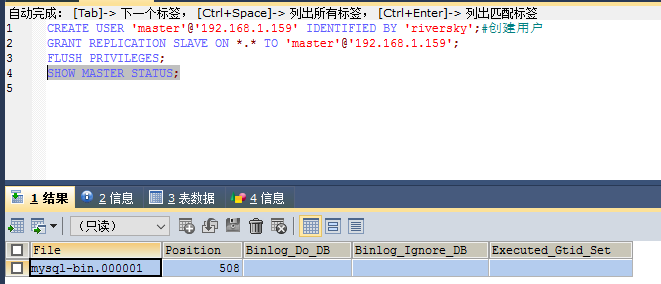

# 1. 环境搭建
## 1.1. mysql主从搭建   
MySQL数据库自身提供的主从复制功能可以方便的实现数据的多处自动备份，实现数据库的拓展。多个数据备份不仅可以加强数据的安全性，通过实现读写分离还能进一步提升数据库的负载性能。  
下图就描述了一个多个数据库间主从复制与读写分离的模型(来源网络)：  
  
在一主多从的数据库体系中，多个从服务器采用异步的方式更新主数据库的变化，业务服务器在执行写或者相关修改数据库的操作是在主服务器上进行的，读操作则是在各从服务器上进行。如果配置了多个从服务器或者多个主服务器又涉及到相应的负载均衡问题，关于负载均衡具体的技术细节还没有研究过，今天就先简单的实现一主一从的主从复制功能。  
Mysql主从复制的实现原理图大致如下(来源网络)：  
  
MySQL之间数据复制的基础是二进制日志文件（binary log file）。一台MySQL数据库一旦启用二进制日志后，其作为master，它的数据库中所有操作都会以“事件”的方式记录在二进制日志中，其他数据库作为slave通过一个I/O线程与主服务器保持通信，并监控master的二进制日志文件的变化，如果发现master二进制日志文件发生变化，则会把变化复制到自己的中继日志中，然后slave的一个SQL线程会把相关的“事件”执行到自己的数据库中，以此实现从数据库和主数据库的一致性，也就实现了主从复制。  
### 1.1.1. 实现MySQL主从复制需要进行的配置：  
主服务器：  
```
开启二进制日志
配置唯一的server-id
获得master二进制日志文件名及位置
创建一个用于slave和master通信的用户账号
```  
从服务器：  
```
配置唯一的server-id
使用master分配的用户账号读取master二进制日志
启用slave服务
```  
### 1.1.2. 具体实现过程如下：  
1. 主库修改
修改数据库配置(配置文件位于数据区的my.ini中)  
```
[mysqld]
log-bin=mysql-bin #开启二进制日志
server-id=1 #设置server-id
```
ip为从库ip
```
CREATE USER 'master'@'192.168.1.159' IDENTIFIED BY 'riversky';#创建用户
GRANT REPLICATION SLAVE ON *.* TO 'master'@'192.168.1.159';
flush privileges;
```
查看master状态
```
show master status
```
  
2. 从库修改  
修改配置
```
[mysqld]
server-id=2 #设置server-id，必须唯一
```  
重启mysql，打开mysql会话，执行同步SQL语句(需要主服务器主机名，登陆凭据，二进制文件的名称和位置)：  
```
CHANGE MASTER TO
         MASTER_HOST='192.168.1.224',
         MASTER_USER='master',
         MASTER_PASSWORD='riversky',
         MASTER_LOG_FILE='mysql-bin.000002',
         MASTER_LOG_POS=154;
```
启动 slave同步
```
start slave;
```
查看slave状态  
```
mysql> show slave status\G;  
```
>>  master开启二进制日志后默认记录所有库所有表的操作，可以通过配置来指定只记录指定的数据库甚至指定的表的操作，具体在mysql配置文件的[mysqld]可添加修改如下选项：

外网访问权限
```
GRANT ALL PRIVILEGES ON *.* TO 'root'@'%' IDENTIFIED BY 'riversky' WITH GRANT OPTION;
FLUSH PRIVILEGES;
```
主从库指定。
```
# 不同步哪些数据库  
binlog-ignore-db = mysql  
binlog-ignore-db = test  
binlog-ignore-db = information_schema  
  
# 只同步哪些数据库，除此之外，其他不同步  
binlog-do-db = game  
```
这时候就可以进行同步了.  

>> window上修改my.ini 后可能无法启动，这种情况可能是my.ini 的编码问题，需要ANSI编码才可正常启动。  
## 主从不一致的解决方案
1. io->No
主库:重启服务端,然后查询logfile 和pos
```
service mysqld restart

show master status;
```
从库  
```
mysql> slave stop;
mysql> change master to Master_Log_File='mysql-bin.000001',Master_Log_Pos=98;
mysql> slave start;
mysql> show slave status;
```
2. sql->No
[引用](https://blog.csdn.net/heng_ji/article/details/51013710)  
# 2. spring 环境搭建   

[摘自](https://blog.csdn.net/dream_broken/article/details/72851329)  


