# 1. 数据库高并发处理方案之-shareding jdbc
# 2. 分库分表
## 2.1. 简介
分库分表是什么?  
小明是一家初创电商平台的开发人员，他负责卖家模块的功能开发，其中涉及了店铺、商品的相关业务，设计如下数据库：   
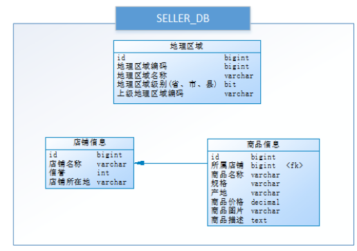    
通过以下SQL能够获取到商品相关的店铺信息、地理区域信息：  
```
SELECT p.*,r.[地理区域名称],s.[店铺名称],s.[信誉]
FROM [商品信息] p
LEFT JOIN [地理区域] r ON p.[产地] = r.[地理区域编码]
LEFT JOIN [店铺信息] s ON p.id = s.[所属店铺]
WHERE p.id = ?
```
查找数据如下:  
  
随着公司业务快速发展，数据库中的数据量猛增，访问性能也变慢了，优化迫在眉睫。分析一下问题出现在哪儿呢？ 关系型数据库本身比较容易成为系统瓶颈，单机存储容量、连接数、处理能力都有限。当单表的数据量达到1000W或100G以后，由于查询维度较多，即使添加从库、优化索引，做很多操作时性能仍下降严重。   
方案一:  
通过提升服务器硬件能力来提高数据处理能力，比如增加存储容量 、CPU等，这种方案成本很高，并且如果瓶颈在MySQL本身那么提高硬件也是有很的。   
方案二:  
把数据分散在不同的数据库中，使得单一数据库的数据量变小来缓解单一数据库的性能问题，从而达到提升数据库性能的目的，如下图：将电商数据库拆分为若干独立的数据库，并且对于大表也拆分为若干小表，通过这种数据库拆分的方法来解决数据库的性能问题。  
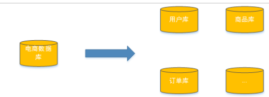  
分库分表就是为了解决由于数据量过大而导致数据库性能降低的问题，将原来独立的数据库拆分成若干数据库组成，将数据大表拆分成若干数据表组成，使得单一数据库、单一数据表的数据量变小，从而达到提升数据库性能的目的。  
## 2.2. 分库分表的方式
根据两个维度进行拆分  
|      | 分库     | 分表     |
| :--- | :------- | :------- |
| 水平 | 水平分库 | 水平分表 |
| 垂直 | 垂直分库 | 垂直分表 |
垂直分原则:冷热数据拆分.  
水平分原则:地域,时间,业务.  
### 2.2.1. 垂直分表
垂直分表定义:将一个表按照字段分成多表,每个表存储其中一部分字段.  
比如将冷热数据(商品表拆分)  
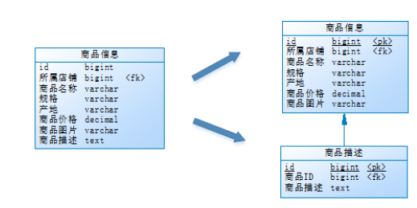  

**优缺点**  
优点:  
1. 为了避免IO争抢并减少锁表的几率，查看详情的用户与商品信息浏览互不影响  
2. 充分发挥热门数据的操作效率，商品信息的操作的高效率不会被商品描述的低效率所拖累。
3. 数据传输流量减少.  
>>  一般来说，某业务实体中的各个数据项的访问频次是不一样的，部分数据项可能是占用存储空间比较大的BLOB或是TEXT。例如上例中的商品描述。所以，当表数据量很大时，可以将表按字段切开，将热门字段、冷门字段分开放置在不同库中，这些库可以放在不同的存储设备上，避免IO争抢。垂直切分带来的性能提升主要集中在热门数据的操作效率上，而且磁盘争用情况减少。  

拆分细则:  
1. 把不常用的字段单独放在一张表;    
2. 把text，blob等大字段拆分出来放在附表中;    
3. 经常组合查询的列放在一张表中;    
### 2.2.2. 垂直分库  
主要解决垂直分表在硬件资源上的缺陷. 
通过垂直分表性能得到了一定程度的提升，但是还没有达到要求，并且磁盘空间也快不够了，因为数据还是始终限制在一台服务器，库内垂直分表只解决了单一表数据量过大的问题，但没有将表分布到不同的服务器上，因此每个表还是竞争同一个物理机的CPU、内存、网络IO、磁盘。    
经过思考，他把原有的SELLER_DB(卖家库)，分为了PRODUCT_DB(商品库)和STORE_DB(店铺库)，并把这两个库分散到不同服务器，如下图：  
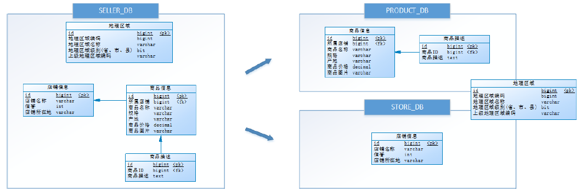  
由于**商品信息**与**商品描述**业务耦合度较高，因此一起被存放在PRODUCT_DB(商品库)；而店铺信息相对独立，因此单独被存放在STORE_DB(店铺库)。   
这一步骤的优化就是垂直分库.   
垂直分库是指按照业务将表进行分类，分布到不同的数据库上面，每个库可以放在不同的服务器上，它的核心理念是专库专用。     
它带来的提升是：  
* 解决业务层面的耦合，业务清晰
* 能对不同业务的数据进行分级管理、维护、监控、扩展等
* 高并发场景下，垂直分库一定程度的提升IO、数据库连接数、降低单机硬件资源的瓶颈  
>>  垂直分库通过将表按业务分类，然后分布在不同数据库，并且可以将这些数据库部署在不同服务器上，从而达到多个服务器共同分摊压力的效果，但是依然没有解决单表数据量过大的问题。  
### 2.2.3. 水平分库  
经过垂直分库后，数据库性能问题得到一定程度的解决，但是随着业务量的增长，PRODUCT_DB(商品库)单库存储数据已经超出预估。粗略估计，目前有8w店铺，每个店铺平均150个不同规格的商品，再算上增长，那商品数量得往1500w+上预估，并且PRODUCT_DB(商品库)属于访问非常频繁的资源，单台服务器已经无法支撑。此时该如何优化？  
再次分库？但是从业务角度分析，目前情况已经无法再次垂直分库。  
尝试水平分库，将店铺ID为单数的和店铺ID为双数的商品信息分别放在两个库中。  
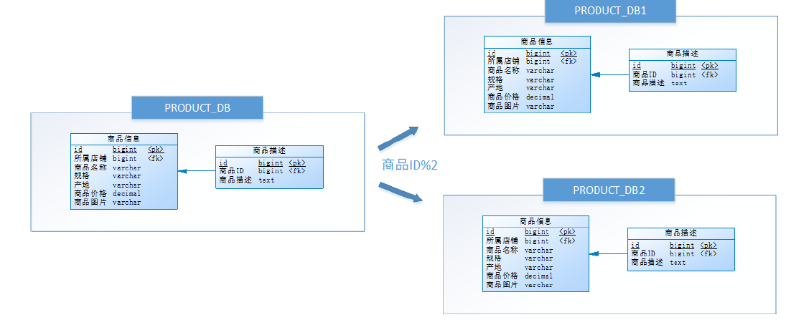  
也就是说，要操作某条数据，先分析这条数据所属的店铺ID。如果店铺ID为双数，将此操作映射至
RRODUCT_DB1(商品库1)；如果店铺ID为单数，将操作映射至RRODUCT_DB2(商品库2)。此操作要访问数据库名称的表达式为*RRODUCT_DB[店铺ID%2 + 1]* 。   
这一步优化，就叫水平分库。    
水平分库是把同一个表的数据按一定规则拆到不同的数据库中，每个库可以放在不同的服务器上。  
它带来的提升是：  
* 解决了单库大数据，高并发的性能瓶颈。  
* 提高了系统的稳定性及可用性。  
>>  当一个应用难以再细粒度的垂直切分，或切分后数据量行数巨大，存在单库读写、存储性能瓶颈，这时候就需要进行水平分库了，经过水平切分的优化，往往能解决单库存储量及性能瓶颈。但由于同一个表被分配在不同的数据库，需要额外进行数据操作的路由工作，因此大大提升了系统复杂度。  
### 2.2.4. 水平分表  
按照水平分库的思路对他把PRODUCT_DB_X(商品库)内的表也可以进行水平拆分，其目的也是为解决单表数据量大的问题，如下图：  
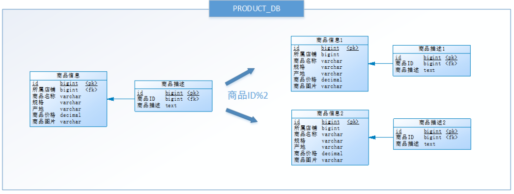  
与水平分库的思路类似，不过这次操作的目标是表，商品信息及商品描述被分成了两套表。如果商品ID为双数，将此操作映射至商品信息1表；如果商品ID为单数，将操作映射至商品信息2表。此操作要访问表名称的表达式为*商品信息[商品ID%2 + 1]*。    
这一步优化，就叫水平分表。  
**水平分表**是在同一个数据库内，把同一个表的数据按一定规则拆到多个表中。  
它带来的提升是：  
*  优化单一表数据量过大而产生的性能问题  
*  避免IO争抢并减少锁表的几率  

>> 库内的水平分表，解决了单一表数据量过大的问题，分出来的小表中只包含一部分数据，从而使得单个表的数据量变小，提高检索性能。  
### 2.2.5. 总结
分库分表总有:垂直分表、垂直分库、水平分库和水平分表的方式.  
垂直分表：可以把一个宽表的字段按访问频次、是否是大字段的原则拆分为多个表，这样既能使业务清晰，还能提升部分性能。拆分后，尽量从业务角度避免联查，否则性能方面将得不偿失。   
垂直分库：可以把多个表按业务耦合松紧归类，分别存放在不同的库，这些库可以分布在不同服务器，从而使访问压力被多服务器负载，大大提升性能，同时能提高整体架构的业务清晰度，不同的业务库可根据自身情况定制优化方案。但是它需要解决跨库带来的所有复杂问题。    
水平分库：可以把一个表的数据(按数据行)分到多个不同的库，每个库只有这个表的部分数据，这些库可以分布在不同服务器，从而使访问压力被多服务器负载，大大提升性能。它不仅需要解决跨库带来的所有复杂问题，还要解决数据路由的问题(数据路由问题后边介绍)。   
水平分表：可以把一个表的数据(按数据行)分到多个同一个数据库的多张表中，每个表只有这个表的部分数据，这样做能小幅提升性能，它仅仅作为水平分库的一个补充优化。   
一般来说，在系统设计阶段就应该根据业务耦合松紧来确定垂直分库，垂直分表方案，在数据量及访问压力不是特别大的情况，首先考虑缓存、读写分离、索引技术等方案。若数据量极大，且持续增长，再考虑水平分库水平分表方案。    
## 2.3. 分库分表带来的问题  
分库分表能有效的缓解了单机和单库带来的性能瓶颈和压力，突破网络IO、硬件资源、连接数的瓶颈，同时也带来了一些问题。   
### 2.3.1. 事务一致性问题  
由于分库分表把数据分布在不同库甚至不同服务器，不可避免会带来分布式事务问题。  
### 2.3.2. 跨节点关联查询  
在没有分库前，我们检索商品时可以通过以下SQL对店铺信息进行关联查询：  
```
SELECT p.*,r.[地理区域名称],s.[店铺名称],s.[信誉]
FROM [商品信息] p
LEFT JOIN [地理区域] r ON p.[产地] = r.[地理区域编码]
LEFT JOIN [店铺信息] s ON p.id = s.[所属店铺]
WHERE...ORDER BY...LIMIT...
```
但垂直分库后[商品信息]和[店铺信息]不在一个数据库，甚至不在一台服务器，无法进行关联查询。  
可将原关联查询分为两次查询，第一次查询的结果集中找出关联数据id，然后根据id发起第二次请求得到关联数据，最后将获得到的数据进行拼装。  
### 2.3.3. 跨节点分页、排序函数  
跨节点多库进行查询时，limit分页、order by排序等问题，就变得比较复杂了。需要先在不同的分片节点中将数据进行排序并返回，然后将不同分片返回的结果集进行汇总和再次排序。    
如，进行水平分库后的商品库，按ID倒序排序分页，取第一页：  
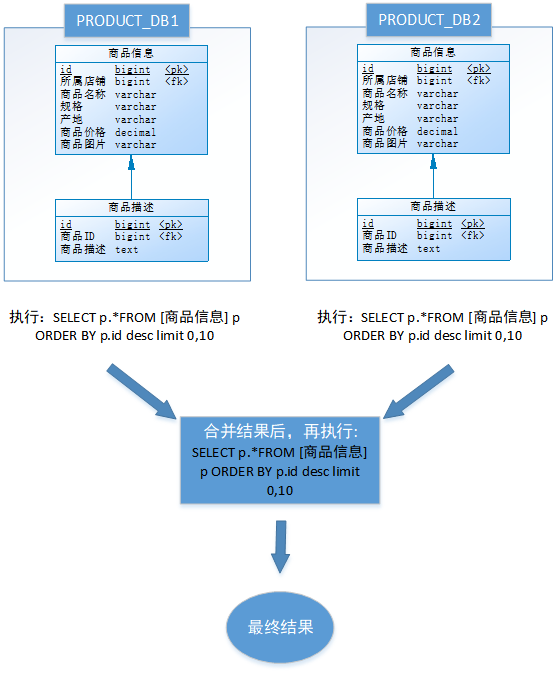  
以上流程是取第一页的数据，性能影响不大，但由于商品信息的分布在各数据库的数据可能是随机的，如果是取第N页，需要将所有节点前N页数据都取出来合并，再进行整体的排序，操作效率可想而知。所以请求页数越大，系统的性能也会越差。  
在使用Max、Min、Sum、Count之类的函数进行计算的时候，与排序分页同理，也需要先在每个分片上执行相应的函数，然后将各个分片的结果集进行汇总和再次计算，最终将结果返回。  
### 2.3.4. 主键避重  
在分库分表环境中，由于表中数据同时存在不同数据库中，主键值平时使用的自增长将无用武之地，某个分区数据库生成的ID无法保证全局唯一。因此需要单独设计全局主键，以避免跨库主键重复问题。  
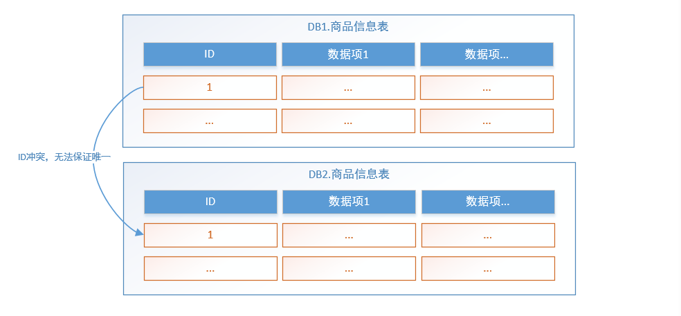  
### 2.3.5. 公共表  
实际的应用场景中，参数表、数据字典表等都是数据量较小，变动少，而且属于高频联合查询的依赖表。例子中地理区域表也属于此类型。  
可以将这类表在每个数据库都保存一份，所有对公共表的更新操作都同时发送到所有分库执行  
由于分库分表之后，数据被分散在不同的数据库、服务器。因此，对数据的操作也就无法通过常规方式完成，并且它还带来了一系列的问题。  
## 2.4. Shareding jdbc解决方案  
### 2.4.1. 简介  
Sharding-JDBC是当当网研发的开源分布式数据库中间件，从 3.0 开始Sharding-JDBC被包含在 Sharding-Sphere中，之后该项目进入进入Apache孵化器，4.0版本之后的版本为Apache版本。  
ShardingSphere是一套开源的分布式数据库中间件解决方案组成的生态圈，它由Sharding-JDBC、Sharding-Proxy和Sharding-Sidecar（计划中）这3款相互独立的产品组成。 他们均提供标准化的数据分片、分布式事务和数据库治理功能，可适用于如Java同构、异构语言、容器、云原生等各种多样化的应用场景。    
[官方地址](https://shardingsphere.apache.org/document/current/cn/overview/)    
咱们目前只需关注Sharding-JDBC，它定位为轻量级Java框架，在Java的JDBC层提供的额外服务。 它使用客户端直连数据库，以jar包形式提供服务，无需额外部署和依赖，可理解为增强版的JDBC驱动，完全兼容JDBC和各种ORM框架。   
Sharding-JDBC的核心功能为数据分片和读写分离，通过Sharding-JDBC，应用可以透明的使用jdbc访问已经分库分表、读写分离的多个数据源，而不用关心数据源的数量以及数据如何分布。  
*  适用于任何基于Java的ORM框架，如： Hibernate, Mybatis, Spring JDBC Template或直接使用JDBC。  
*  基于任何第三方的数据库连接池，如：DBCP, C3P0, BoneCP, Druid, HikariCP等。  
*  支持任意实现JDBC规范的数据库。目前支持MySQL，Oracle，SQLServer和PostgreSQL。  

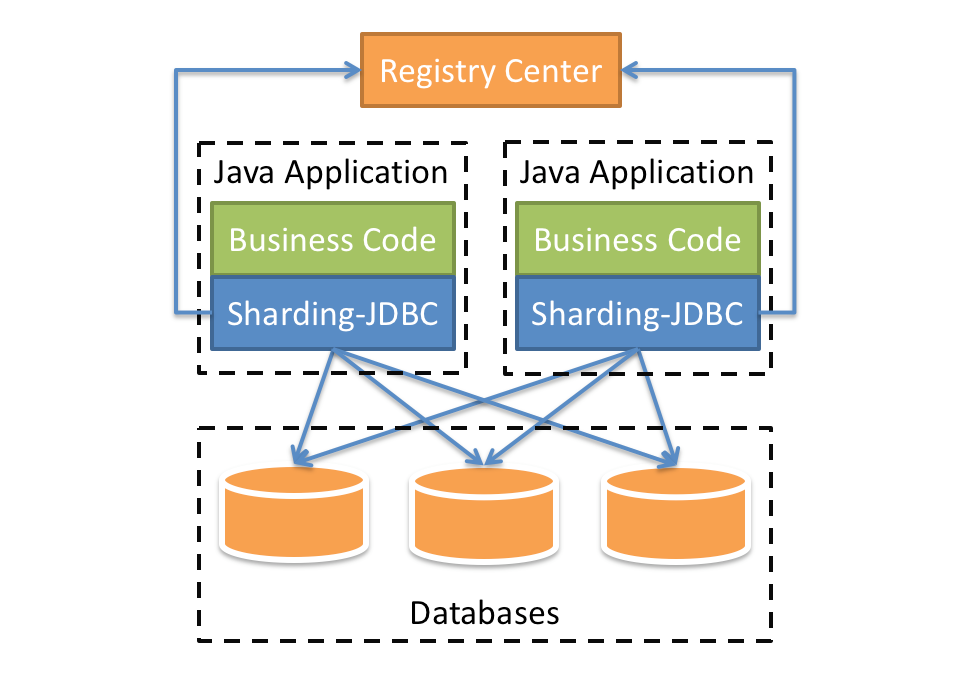  
上图展示了Sharding-Jdbc的工作方式，使用Sharding-Jdbc前需要人工对数据库进行分库分表，在应用程序中加入Sharding-Jdbc的Jar包，应用程序通过Sharding-Jdbc操作分库分表后的数据库和数据表，由于Sharding-Jdbc是对Jdbc驱动的增强，使用Sharding-Jdbc就像使用Jdbc驱动一样，在应用程序中是无需指定具体要操作的分库和分表的。  
### 2.4.2. 性能  
1. 性能损耗测试：服务器资源充足、并发数相同，比较JDBC和Sharding-JDBC性能损耗，Sharding-JDBC相对JDBC损耗不超过7%。  
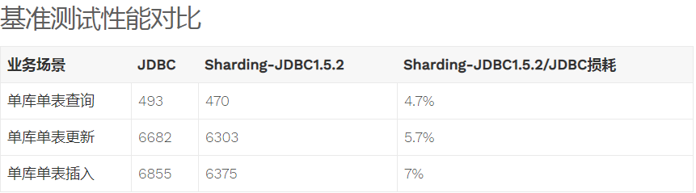    
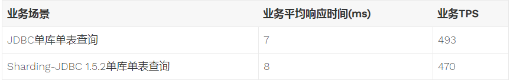  
2. 性能对比测试：服务器资源使用到极限，相同的场景JDBC与Sharding-JDBC的吞吐量相当。  
3. 性能对比测试：服务器资源使用到极限，Sharding-JDBC采用分库分表后，Sharding-JDBC吞吐量较JDBC不分表有接近2倍的提升。  
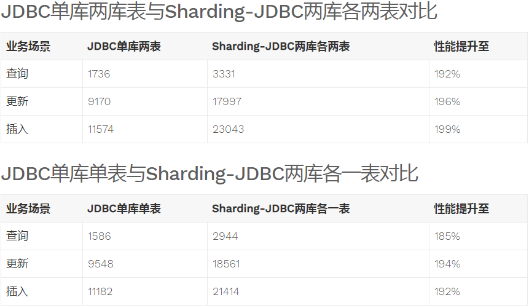  
## 2.5. shareding jdbc 
### 2.5.1. 概述
[官网开发文档](https://shardingsphere.apache.org/document/current/cn/overview/)    

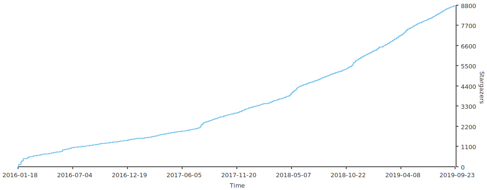    
ShardingSphere是一套开源的分布式数据库中间件解决方案组成的生态圈，它由Sharding-JDBC、Sharding-Proxy和Sharding-Sidecar（计划中）这3款相互独立的产品组成。 他们均提供标准化的数据分片、分布式事务和数据库治理功能，可适用于如Java同构、异构语言、云原生等各种多样化的应用场景  
ShardingSphere定位为关系型数据库中间件，旨在充分合理地在分布式的场景下利用关系型数据库的计算和存储能力，而并非实现一个全新的关系型数据库。 它与NoSQL和NewSQL是并存而非互斥的关系。NoSQL和NewSQL作为新技术探索的前沿，放眼未来，拥抱变化，是非常值得推荐的。反之，也可以用另一种思路看待问题，放眼未来，关注不变的东西，进而抓住事物本质。 关系型数据库当今依然占有巨大市场，是各个公司核心业务的基石，未来也难于撼动，我们目前阶段更加关注在原有基础上的增量，而非颠覆。   
  
#### 2.5.1.1. Shareding jdbc  
定位为轻量级Java框架，在Java的JDBC层提供的额外服务。 它使用客户端直连数据库，以jar包形式提供服务，无需额外部署和依赖，可理解为增强版的JDBC驱动，完全兼容JDBC和各种ORM框架。  
* 适用于任何基于Java的ORM框架，如：JPA, Hibernate, Mybatis, Spring JDBC Template或直接使用JDBC。  
* 基于任何第三方的数据库连接池，如：DBCP, C3P0, BoneCP, Druid, HikariCP等。  
* 支持任意实现JDBC规范的数据库。目前支持MySQL，Oracle，SQLServer和PostgreSQL。  

  
#### 2.5.1.2. Sharding-Proxy
定位为透明化的数据库代理端，提供封装了数据库二进制协议的服务端版本，用于完成对异构语言的支持。 目前先提供MySQL版本，它可以使用任何兼容MySQL协议的访问客户端(如：MySQL Command Client, MySQL Workbench等)操作数据，对DBA更加友好。    
* 向应用程序完全透明，可直接当做MySQL使用。
* 适用于任何兼容MySQL协议的客户端。  
  
#### 2.5.1.3. Sharding-Sidecar(TODO)  
定位为Kubernetes的云原生数据库代理，以Sidecar的形式代理所有对数据库的访问。 通过无中心、零侵入的方案提供与数据库交互的的啮合层，即Database Mesh，又可称数据网格。  
Database Mesh的关注重点在于如何将分布式的数据访问应用与数据库有机串联起来，它更加关注的是交互，是将杂乱无章的应用与数据库之间的交互有效的梳理。使用Database Mesh，访问数据库的应用和数据库终将形成一个巨大的网格体系，应用和数据库只需在网格体系中对号入座即可，它们都是被啮合层所治理的对象。  
  
#### 2.5.1.4. 总结
|            | Sharding-JDBC | Sharding-Proxy | Sharding-Sidecar |
| :--------- | :------------ | :------------- | :--------------- |
| 数据库     | 任意          | MySQL          | MySQL            |
| 连接消耗数 | 高            | 低             | 高               |
| 异构语言   | Java          | 任意           | 任意             |
| 性能       | 损耗低        | 损耗略高       | 损耗低           |
| 无中心化   | 是            | 否             | 是               |
| 静态入口   | 无            | 有             | 无               |

**混合架构**  
Sharding-JDBC采用无中心化架构，适用于Java开发的高性能的轻量级OLTP应用；Sharding-Proxy提供静态入口以及异构语言的支持，适用于OLAP应用以及对分片数据库进行管理和运维的场景。  
ShardingSphere是多接入端共同组成的生态圈。 通过混合使用Sharding-JDBC和Sharding-Proxy，并采用同一注册中心统一配置分片策略，能够灵活的搭建适用于各种场景的应用系统，架构师可以更加自由的调整适合于当前业务的最佳系统架构。  
    
**功能**    
1. 数据分片
>> [分库&分表]   [读写分离]  [分片策略定制化]    [无中心化分布式主键]
2. 分布式事务  
>>  [标准化事务接口] [XA强一致性事务]  [柔性事务]
3. 数据库治理
>>  [配置动态化]  [编排&治理]  [数据脱敏]  [可视化链路追踪]  [弹性伸缩]  
### 2.5.2. 快速入门
#### 2.5.2.1. Sharding-jdbc
1. 引入依赖  
```
<dependency>
    <groupId>org.apache.shardingsphere</groupId>
    <artifactId>sharding-jdbc-core</artifactId>
    <version>${latest.release.version}</version>
</dependency>
```
2. 配置规则  
Sharding-JDBC可以通过Java，YAML，Spring命名空间和Spring Boot Starter四种方式配置，开发者可根据场景选择适合的配置方式。详情请参见[配置手册](#configshareding)。  
3. 创建数据源  
通过ShardingDataSourceFactory工厂和规则配置对象获取ShardingDataSource，ShardingDataSource实现自JDBC的标准接口DataSource。然后即可通过DataSource选择使用原生JDBC开发，或者使用JPA, MyBatis等ORM工具。  
```
DataSource ds=SharedingDataSourceFactory.createDataSource(dataSourceMap,sharedingRulConfig,props);
```
#### 2.5.2.2. Sharding-Proxy
1. 配置规则  
编辑%SHARDING_PROXY_HOME%\conf\config-xxx.yaml。详情请参见配置手册。  
编辑%SHARDING_PROXY_HOME%\conf\server.yaml。详情请参见配置手册。  
2. 引入依赖  
如果后端连接PostgreSQL数据库，不需要引入额外依赖。  
如果后端连接MySQL数据库，需要下载MySQL Connector/J， 解压缩后，将mysql-connector-java-5.1.47.jar拷贝到${sharding-proxy}\lib目录。  
3. 启动服务
```
# 默认配置
${sharding-proxy}\bin\start.sh
# 配置端口
${sharding-proxy}\bin\start.sh ${port}
```
### 2.5.3. 概念和功能  
#### 2.5.3.1. 数据分片
##### 2.5.3.1.1. 背景
传统的将数据集中存储至单一数据节点的解决方案，在性能、可用性和运维成本这三方面已经难于满足互联网的海量数据场景。  
从性能方面来说，由于关系型数据库大多采用B+树类型的索引，在数据量超过阈值的情况下，索引深度的增加也将使得磁盘访问的IO次数增加，进而导致查询性能的下降；同时，高并发访问请求也使得集中式数据库成为系统的最大瓶颈。  
从可用性的方面来讲，服务化的无状态型，能够达到较小成本的随意扩容，这必然导致系统的最终压力都落在数据库之上。而单一的数据节点，或者简单的主从架构，已经越来越难以承担。数据库的可用性，已成为整个系统的关键。  
从运维成本方面考虑，当一个数据库实例中的数据达到阈值以上，对于DBA的运维压力就会增大。数据备份和恢复的时间成本都将随着数据量的大小而愈发不可控。一般来讲，单一数据库实例的数据的阈值在1TB之内，是比较合理的范围。  
在传统的关系型数据库无法满足互联网场景需要的情况下，将数据存储至原生支持分布式的NoSQL的尝试越来越多。 但NoSQL对SQL的不兼容性以及生态圈的不完善，使得它们在与关系型数据库的博弈中始终无法完成致命一击，而关系型数据库的地位却依然不可撼动。  
数据分片指按照某个维度将存放在单一数据库中的数据分散地存放至多个数据库或表中以达到提升性能瓶颈以及可用性的效果。 数据分片的有效手段是对关系型数据库进行分库和分表。分库和分表均可以有效的避免由数据量超过可承受阈值而产生的查询瓶颈。 除此之外，分库还能够用于有效的分散对数据库单点的访问量；分表虽然无法缓解数据库压力，但却能够提供尽量将分布式事务转化为本地事务的可能，一旦涉及到跨库的更新操作，分布式事务往往会使问题变得复杂。 使用多主多从的分片方式，可以有效的避免数据单点，从而提升数据架构的可用性。  
通过分库和分表进行数据的拆分来使得各个表的数据量保持在阈值以下，以及对流量进行疏导应对高访问量，是应对高并发和海量数据系统的有效手段。 数据分片的拆分方式又分为垂直分片和水平分片。  
**垂直分片**  
按照业务拆分的方式称为垂直分片，又称为纵向拆分，它的核心理念是专库专用。 在拆分之前，一个数据库由多个数据表构成，每个表对应着不同的业务。而拆分之后，则是按照业务将表进行归类，分布到不同的数据库中，从而将压力分散至不同的数据库。 下图展示了根据业务需要，将用户表和订单表垂直分片到不同的数据库的方案。  
   
垂直分片往往需要对架构和设计进行调整。通常来讲，是来不及应对互联网业务需求快速变化的；而且，它也并无法真正的解决单点瓶颈。 垂直拆分可以缓解数据量和访问量带来的问题，但无法根治。如果垂直拆分之后，表中的数据量依然超过单节点所能承载的阈值，则需要水平分片来进一步处理。  
**水平分片**  
水平分片又称为横向拆分。 相对于垂直分片，它不再将数据根据业务逻辑分类，而是通过某个字段（或某几个字段），根据某种规则将数据分散至多个库或表中，每个分片仅包含数据的一部分。 例如：根据主键分片，偶数主键的记录放入0库（或表），奇数主键的记录放入1库（或表），如下图所示。  
  
水平分片从理论上突破了单机数据量处理的瓶颈，并且扩展相对自由，是分库分表的标准解决方案。  
**新问题**  
解决了
1. 性能
2. 可用性
3. 单点备份恢复
问题  
1. 库路由和表路由  
2. 一些功能SQL不可用(如分页,排序,聚合分组)  
3. 合理采用分表，可以在降低单表数据量的情况下，尽量使用本地事务，善于使用同库不同表可有效避免分布式事务带来的麻烦。 在不能避免跨库事务的场景，有些业务仍然需要保持事务的一致性。 而基于XA的分布式事务由于在并发度高的场景中性能无法满足需要，并未被互联网巨头大规模使用，他们大多采用最终一致性的柔性事务代替强一致事务。
**目标**  
尽量透明化分库分表所带来的影响，让使用方尽量像使用一个数据库一样使用水平分片之后的数据库集群，是ShardingSphere数据分片模块的主要设计目标。  
##### 2.5.3.1.2. 核心概念
**SQL核心概念**  
1. 逻辑表    
>>  水平拆分的数据库（表）的相同逻辑和数据结构表的总称。例：订单数据根据主键尾数拆分为10张表，分别是t_order_0到t_order_9，他们的逻辑表名为t_order。  
2. 真实表   
>>  在分片的数据库中真实存在的物理表。即上个示例中的t_order_0到t_order_9。
3. 数据节点
>>  数据分片的最小单元。由数据源名称和数据表组成，例：ds_0.t_order_0。  
4. 绑定表  
>>  指分片规则一致的主表和子表。例如：t_order表和t_order_item表，均按照order_id分片，则此两张表互为绑定表关系。绑定表之间的多表关联查询不会出现笛卡尔积关联，关联查询效率将大大提升。举例说明，如果SQL为：  
```
SELECT i.* FROM t_order o JOIN t_order_item i ON o.order_id=i.order_id WHERE o.order_id in (10, 11);
```
在不配置绑定表关系时，假设分片键order_id将数值10路由至第0片，将数值11路由至第1片，那么路由后的SQL应该为4条，它们呈现为笛卡尔积：  
```
SELECT i.* FROM t_order_0 o JOIN t_order_item_0 i ON o.order_id=i.order_id WHERE o.order_id in (10, 11);

SELECT i.* FROM t_order_0 o JOIN t_order_item_1 i ON o.order_id=i.order_id WHERE o.order_id in (10, 11);

SELECT i.* FROM t_order_1 o JOIN t_order_item_0 i ON o.order_id=i.order_id WHERE o.order_id in (10, 11);

SELECT i.* FROM t_order_1 o JOIN t_order_item_1 i ON o.order_id=i.order_id WHERE o.order_id in (10, 11);
```
在配置绑定表关系后，路由的SQL应该为2条：  
```
SELECT i.* FROM t_order_0 o JOIN t_order_item_0 i ON o.order_id=i.order_id WHERE o.order_id in (10, 11);

SELECT i.* FROM t_order_1 o JOIN t_order_item_1 i ON o.order_id=i.order_id WHERE o.order_id in (10, 11);
```
其中t_order在FROM的最左侧，ShardingSphere将会以它作为整个绑定表的主表。 所有路由计算将会只使用主表的策略，那么t_order_item表的分片计算将会使用t_order的条件。故绑定表之间的分区键要完全相同。  
5. 广播表  
>> 指所有的分片数据源中都存在的表，表结构和表中的数据在每个数据库中均完全一致。适用于数据量不大且需要与海量数据的表进行关联查询的场景，例如：字典表。

**分片核心概念**  
1. 分片键  
>>  用于分片的数据库字段，是将数据库(表)水平拆分的关键字段。例：将订单表中的订单主键的尾数取模分片，则订单主键为分片字段。 SQL中如果无分片字段，将执行全路由，性能较差。 除了对单分片字段的支持，ShardingSphere也支持根据多个字段进行分片。  
2. 分片算法
>>  通过分片算法将数据分片，支持通过=、BETWEEN和IN分片。分片算法需要应用方开发者自行实现，可实现的灵活度非常高。  
目前提供4种分片算法。由于分片算法和业务实现紧密相关，因此并未提供内置分片算法，而是通过分片策略将各种场景提炼出来，提供更高层级的抽象，并提供接口让应用开发者自行实现分片算法。   
 
| 类型         | 算法                         | 策略搭配                 | 描述                                       |
| :----------- | :--------------------------- | :----------------------- | :----------------------------------------- |
| 精确分片算法 | PreciseShardingAlgorithm     | StandardShardingStrategy | 单一键作为分片键的=与IN进行分片的场景      |
| 范围分片算法 | RangeShardingAlgorithm       | StandardShardingStrategy | 单一键作为分片键的BETWEEN AND进行分片      |
| 复合分片算法 | ComplexKeysShardingAlgorithm | ComplexShardingStrategy  | 用于处理使用多键作为分片键进行分片的场景   |
| Hint分片算法 | HintShardingAlgorithm        | HintShardingStrategy     | 用于处理使用Hint行分片的场景。需要配合使用 |
3. 分片策略
>>  包含分片键和分片算法，由于分片算法的独立性，将其独立抽离。真正可用于分片操作的是分片键 + 分片算法，也就是分片策略。目前提供5种分片策略。  

| 策略类型         | 策略类                   | 键类型   | 描述                                                                                                                                                                                                                                       |
| :--------------- | :----------------------- | :------- | :----------------------------------------------------------------------------------------------------------------------------------------------------------------------------------------------------------------------------------------- |
| 标准分片策略     | StandardShardingStrategy | 单分片键 | 提供对SQL语句中的=, IN和BETWEEN AND的分片操作支持,PreciseShardingAlgorithm是必选的，用于处理=和IN的分片。RangeShardingAlgorithm是可选的，用于处理BETWEEN AND分片，如果不配置RangeShardingAlgorithm，SQL中的BETWEEN AND将按照全库路由处理。 |
| 复合分片策略     | ComplexShardingStrategy  | 多分片键 | 提供对SQL语句中的=, IN和BETWEEN AND的分片操作支持。于多分片键之间的关系复杂，因此并未进行过多的封装，而是直接将分片键值组合以及分片操作符透传至分片算法，完全由应用开发者实现，提供最大的灵活度。                                          |
| 行表达式分配策略 | InlineShardingStrategy   | 单分片键 | 使用Groovy的表达式，提供对SQL语句中的=和IN的分片操作支持,如: t_user_$->{u_id % 8} 表示t_user表根据u_id模8，而分成8张表，表名称为t_user_0到t_user_7                                                                                         |
| Hint分片策略     | HintShardingStrategy     |          | 通过Hint而非SQL解析的方式分片的策略。                                                                                                                                                                                                      |
| 不分片策略       | NoneShardingStrategy     |          | 不分片的策略                                                                                                                                                                                                                               |
4. SQL Hint  
>>  对于分片字段非SQL决定，而由其他外置条件决定的场景，可使用SQL Hint灵活的注入分片字段。例：内部系统，按照员工登录主键分库，而数据库中并无此字段。SQL Hint支持通过Java API和SQL注释(待实现)两种方式使用。    

**配置核心概念**  
1. 分片规则  
>> 分片规则配置的总入口。包含数据源配置、表配置、绑定表配置以及读写分离配置等。  
2. 数据源配置
>>  真实数据源列表。
3. 表配置
>>  逻辑表名称、数据节点与分表规则的配置。  
4. 数据节点配置  
>>  用于配置逻辑表与真实表的映射关系。可分为均匀分布和自定义分布两种形式。  

*均匀分布*  
指数据表在每个数据源内呈现均匀分布的态势，例如：  
```
db0
  ├── t_order0 
  └── t_order1 
db1
  ├── t_order0 
  └── t_order1
```
那么数据节点的配置如下：  
```
db0.t_order0, db0.t_order1, db1.t_order0, db1.t_order1
```
*自定义分布*  
指数据表呈现有特定规则的分布，例如：  
```
db0
  ├── t_order0 
  └── t_order1 
db1
  ├── t_order2
  ├── t_order3
  └── t_order4
```  
数据节点配置如下:  
```
db0.t_order0, db0.t_order1, db1.t_order2, db1.t_order3, db1.t_order4
```
5. 分片策略配置  
>>  对于分片策略存有数据源分片策略和表分片策略两种维度。   
数据源分片策略:对应于DatabaseShardingStrategy。用于配置数据被分配的目标数据源。  
表分片策略:对应于TableShardingStrategy。用于配置数据被分配的目标表，该目标表存在与该数据的目标数据源内。故表分片策略是依赖与数据源分片策略的结果的。  

6. 自增主键生成策略
>>  通过在客户端生成自增主键替换以数据库原生自增主键的方式，做到分布式主键无重复。
##### 2.5.3.1.3. 内核剖析
###### 2.5.3.1.3.1. 简介
ShardingSphere的3个产品的数据分片主要流程是完全一致的。 核心由SQL解析=》 执行器优化 =》SQL路由
=》 SQL改写=》 SQL执行 =》 结果归并的流程组成。  
  
**SQL优化**  
分为词法解析和语法解析.先通过词法解析器将SQL拆分为一个个不可再分的单词.在使用语法解析器对SQL进行理解,并最终提炼出解析上下文.解析上下文包括表/选择项,排序项,分组项聚合函数,分页信息,查询条件以及可能需要修改的占位符号的标记.  
**执行器优化**  
合并和优化分片条件,如OR等  
**SQL路由**  
根据解析上下文匹配用户配置的分片策略,并生成路由路径,目前支持分片路由和广播路由.   
**SQL改写**  
将SQL改写为在真实数据库中可以正确执行的语句。SQL改写分为正确性改写和优化改写。  
**SQL执行**  
通过多线程执行器异步执行。  
**结果归并**  
将多个执行结果集归并以便于通过统一的JDBC接口输出。结果归并包括流式归并、内存归并和使用装饰者模式的追加归并这几种方式。  
###### 2.5.3.1.3.2. 解析引擎
相对于其他编程语言，SQL是比较简单的。 不过，它依然是一门完善的编程语言，因此对SQL的语法进行解析，与解析其他编程语言（如：Java语言、C语言、Go语言等）并无本质区别。  
**抽象语法树**  
解析过程分为词法解析和语法解析。 词法解析器用于将SQL拆解为不可再分的原子符号，称为Token。并根据不同数据库方言所提供的字典，将其归类为关键字，表达式，字面量和操作符。 再使用语法解析器将SQL转换为抽象语法树。  
例如，以下SQL：  
```
SELECT id,name FROM t_user WHERE status ='ACTIVE' AND age>18;
```
解析之后的抽象语法树见下图  
  
为了便于理解，抽象语法树中的关键字的Token用绿色表示，变量的Token用红色表示，灰色表示需要进一步拆分。  
最后，通过对抽象语法树的遍历去提炼分片所需的上下文，并标记有可能需要改写的位置。 供分片使用的解析上下文包含查询选择项（Select Items）、表信息（Table）、分片条件（Sharding Condition）、自增主键信息（Auto increment Primary Key）、排序信息（Order By）、分组信息（Group By）以及分页信息（Limit、Rownum、Top）。 SQL的一次解析过程是不可逆的，一个个Token的按SQL原本的顺序依次进行解析，性能很高。 考虑到各种数据库SQL方言的异同，在解析模块提供了各类数据库的SQL方言字典。  
**SQL解析引擎**    
SQL解析作为分库分表类产品的核心，其性能和兼容性是最重要的衡量指标。 ShardingSphere的SQL解析器经历了3代产品的更新迭代。  
第一代SQL解析器为了追求性能与快速实现，在1.4.x之前的版本使用Druid作为SQL解析器。经实际测试，它的性能远超其它解析器。  
第二代SQL解析器从1.5.x版本开始，ShardingSphere采用完全自研的SQL解析引擎。 由于目的不同，ShardingSphere并不需要将SQL转为一颗完全的抽象语法树，也无需通过访问器模式进行二次遍历。它采用对SQL半理解的方式，仅提炼数据分片需要关注的上下文，因此SQL解析的性能和兼容性得到了进一步的提高。  
第三代SQL解析器则从3.0.x版本开始，ShardingSphere尝试使用ANTLR作为SQL解析的引擎，并计划根据DDL -> TCL -> DAL –> DCL -> DML –>DQL这个顺序，依次替换原有的解析引擎，目前仍处于替换迭代中。 使用ANTLR的原因是希望ShardingSphere的解析引擎能够更好的对SQL进行兼容。对于复杂的表达式、递归、子查询等语句，虽然ShardingSphere的分片核心并不关注，但是会影响对于SQL理解的友好度。 经过实例测试，ANTLR解析SQL的性能比自研的SQL解析引擎慢3-10倍左右。为了弥补这一差距，ShardingSphere将使用PreparedStatement的SQL解析的语法树放入缓存。 因此建议采用PreparedStatement这种SQL预编译的方式提升性能。  
第三代SQL解析引擎的整体结构划分如下图所示。  
  
###### 2.5.3.1.3.3. 路由引擎  
根据解析上下文匹配数据库和表的分片策略，并生成路由路径。 对于携带分片键的SQL，根据分片键的不同可以划分为单片路由(分片键的操作符是等号)、多片路由(分片键的操作符是IN)和范围路由(分片键的操作符是BETWEEN)。 不携带分片键的SQL则采用广播路由。  
分片策略通常可以采用由数据库内置或由用户方配置。 数据库内置的方案较为简单，内置的分片策略大致可分为尾数取模、哈希、范围、标签、时间等。 由用户方配置的分片策略则更加灵活，可以根据使用方需求定制复合分片策略。 如果配合数据自动迁移来使用，可以做到无需用户关注分片策略，自动由数据库中间层分片和平衡数据即可，进而做到使分布式数据库具有的弹性伸缩的能力。 在ShardingSphere的线路规划中，弹性伸缩将于4.x开启。  
**分片路由**  
用于根据分片键进行路由的场景，又细分为直接路由、标准路由和笛卡尔积路由这3种类型。  
1. 直接路由
满足直接路由的条件相对苛刻，它需要通过Hint（使用HintAPI直接指定路由至库表）方式分片，并且是只分库不分表的前提下，则可以避免SQL解析和之后的结果归并。 因此它的兼容性最好，可以执行包括子查询、自定义函数等复杂情况的任意SQL。直接路由还可以用于分片键不在SQL中的场景。例如，设置用于数据库分片的键为3，  
```
hintManager.setDatabaseShardingValue(3);
```
假如路由算法为value % 2，当一个逻辑库t_order对应2个真实库t_order_0和t_order_1时，路由后SQL将在t_order_1上执行。下方是使用API的代码样例：  
```
String sql="select * from t_order;
try(
  HintManger hintManger=HintManager.getInstance();
  Connection conn = dataSource.getConnection();
  PreparedStatement pstmt = conn.prepareStatement(sql)
){
  hintManager.setDatabaseShardingValue(3);
  try(ResultSet rs=pstmt.executeQuery()){
    while(rs.next()){

    }
  }
}
```
2. 标准路由  
标准路由是ShardingSphere最为推荐使用的分片方式，它的适用范围是不包含关联查询或仅包含绑定表之间关联查询的SQL。 当分片运算符是等于号时，路由结果将落入单库（表），当分片运算符是BETWEEN或IN时，则路由结果不一定落入唯一的库（表），因此一条逻辑SQL最终可能被拆分为多条用于执行的真实SQL。 举例说明，如果按照order_id的奇数和偶数进行数据分片，一个单表查询的SQL如下：  
```
SELECT * FROM t_order WHERE order_id IN(1,2);
```
那么路由的结果应为:  
```
SELECT * FROM t_order_0 WHERE order_id IN(1,2);
SELECT * FROM t_order_1 WHERE order_id IN(1,2);
```
绑定表的关联查询与单表查询复杂度和性能相当。举例说明，如果一个包含绑定表的关联查询的SQL如下：  
```
SELECT * FROM t_order o JOIN t_order_item i ON o.order_id=i.order_id  WHERE order_id IN (1, 2);
```
那么路由的结果应为：  
```
SELECT * FROM t_order_0 o JOIN t_order_item_0 i ON o.order_id=i.order_id  WHERE order_id IN (1, 2);
SELECT * FROM t_order_1 o JOIN t_order_item_1 i ON o.order_id=i.order_id  WHERE order_id IN (1, 2);
```
可以看到，SQL拆分的数目与单表是一致的。  
3. 笛卡尔积路由  
笛卡尔路由是最复杂的情况，它无法根据绑定表的关系定位分片规则，因此非绑定表之间的关联查询需要拆解为笛卡尔积组合执行。 如果上个示例中的SQL并未配置绑定表关系，那么路由的结果应为：  
```
SELECT * FROM t_order_0 o JOIN t_order_item_0 i ON o.order_id=i.order_id  WHERE order_id IN (1, 2);
SELECT * FROM t_order_0 o JOIN t_order_item_1 i ON o.order_id=i.order_id  WHERE order_id IN (1, 2);
SELECT * FROM t_order_1 o JOIN t_order_item_0 i ON o.order_id=i.order_id  WHERE order_id IN (1, 2);
SELECT * FROM t_order_1 o JOIN t_order_item_1 i ON o.order_id=i.order_id  WHERE order_id IN (1, 2);
```  
笛卡尔路由查询性能较低，需谨慎使用。  

**广播路由**  
对于不携带分片键的SQL，则采取广播路由的方式。根据SQL类型又可以划分为全库表路由、全库路由、全实例路由、单播路由和阻断路由这5种类型。  
1. 全库表路由  
全库表路由用于处理对数据库中与其逻辑表相关的所有真实表的操作，主要包括不带分片键的DQL和DML，以及DDL等。例如  
```
SELECT * FROM t_order WHERE good_prority IN (1, 10);
```
则会遍历所有数据库中的所有表，逐一匹配逻辑表和真实表名，能够匹配得上则执行。路由后成为  
```
SELECT * FROM t_order_0 WHERE good_prority IN (1, 10);
SELECT * FROM t_order_1 WHERE good_prority IN (1, 10);
SELECT * FROM t_order_2 WHERE good_prority IN (1, 10);
SELECT * FROM t_order_3 WHERE good_prority IN (1, 10);
```
2. 全库路由  

全库路由用于处理对数据库的操作，包括用于库设置的SET类型的数据库管理命令，以及TCL这样的事务控制语句。 在这种情况下，会根据逻辑库的名字遍历所有符合名字匹配的真实库，并在真实库中执行该命令，例如：  
```
SET autocommit=0;
```
在t_order中执行，t_order有2个真实库。则实际会在t_order_0和t_order_1上都执行这个命令。  
3. 全实例路由    
全实例路由用于DCL操作，授权语句针对的是数据库的实例。无论一个实例中包含多少个Schema，每个数据库的实例只执行一次。例如：  
```
CREATE USER customer@127.0.0.1 identified BY '123';
```  
这个命令将在所有的真实数据库实例中执行，以确保customer用户可以访问每一个实例。   
4. 单播路由    
单播路由用于获取某一真实表信息的场景，它仅需要从任意库中的任意真实表中获取数据即可。例如：  
```
DESCRIBE t_order;
```  
t_order的两个真实表t_order_0，t_order_1的描述结构相同，所以这个命令在任意真实表上选择执行一次。  
5. 阻断路由  
阻断路由用于屏蔽SQL对数据库的操作，例如：  
```
USE order_db;
```
这个命令不会在真实数据库中执行，因为ShardingSphere采用的是逻辑Schema的方式，无需将切换数据库Schema的命令发送至数据库中。    

路由引擎的整体结构划分如下图。  
  
###### 2.5.3.1.3.4. 改写引擎  
工程师面向逻辑库与逻辑表书写的SQL，并不能够直接在真实的数据库中执行，SQL改写用于将逻辑SQL改写为在真实数据库中可以正确执行的SQL。 它包括正确性改写和优化改写两部分。  
    
**正确性改写**  
在包含分表的场景中,需要将分表配置中的逻辑表名称改写为路由之后所获取的真实表名称.仅分库则不需要表名称的改写.除此之外,还包括补列和分页信息修正等内容.  
**标识符改写**  
需要改写的标识符包括表名称、索引名称以及Schema名称。  
表名称改写是指将找到逻辑表在原始SQL中的位置，并将其改写为真实表的过程。表名称改写是一个典型的需要对SQL进行解析的场景。 从一个最简单的例子开始，若逻辑SQL为：  
```
SELECT order_id FROM t_order WHERE order_id=1;
``` 
假设该SQL配置分片键order_id，并且order_id=1的情况，将路由至分片表1。那么改写之后的SQL应该为：  
```
SELECT order_id FROM t_order_1 WHERE order_id=1;
```  
在这种最简单的SQL场景中，是否将SQL解析为抽象语法树似乎无关紧要，只要通过字符串查找和替换就可以达到SQL改写的效果。 但是下面的场景，就无法仅仅通过字符串的查找替换来正确的改写SQL了：  
```
SELECT order_id FROM t_order WHERE order_id=1 AND remarks=' t_order xxx';  
```
正确改写的SQL应该是:  
```
SELECT order_id FROM t_order_1 WHERE order_id=1 AND remarks=' t_order xxx';
```
而非
```
SELECT order_id FROM t_order_1 WHERE order_id=1 AND remarks=' t_order_1 xxx';
```
由于表名之外可能含有表名称的类似字符，因此不能通过简单的字符串替换的方式去改写SQL。  
下面再来看一个更加复杂的SQL改写场景：  
```
SELECT t_order.order_id FROM t_order WHERE t_order.order_id=1 AND remarks=' t_order xxx';
```
上面的SQL将表名作为字段的标识符，因此在SQL改写时需要一并修改：  
```
SELECT t_order_1.order_id FROM t_order_1 WHERE t_order_1.order_id=1 AND remarks=' t_order xxx';
```
而如果SQL中定义了表的别名，则无需连同别名一起修改，即使别名与表名相同亦是如此。例如：  
```
SELECT t_order.order_id FROM t_order AS t_order WHERE t_order.order_id=1 AND remarks=' t_order xxx';
```
SQL改写则仅需要改写表名称就可以了：  
```
SELECT t_order.order_id FROM t_order_1 AS t_order WHERE t_order.order_id=1 AND remarks=' t_order xxx';
```
索引名称是另一个有可能改写的标识符。 在某些数据库中（如MySQL），索引是以表为维度创建的，在不同的表中的索引是可以重名的； 而在另外的一些数据库中（如PostgreSQL），索引是以数据库为维度创建的，即使是作用在不同表上的索引，它们也要求其名称的唯一性。   
在ShardingSphere中，管理Schema的方式与管理表如出一辙，它采用逻辑Schema去管理一组数据源。 因此，ShardingSphere需要将用户在SQL中书写的逻辑Schema替换为真实的数据库Schema。  
ShardingSphere目前还不支持在DQL和DML语句中使用Schema。 它目前仅支持在数据库管理语句中使用Schema，例如：  
```
SHOW COLUMNS FROM t_order FROM order_ds;
```
Schema的改写指的是将逻辑Schema采用单播路由的方式，改写为随机查找到的一个正确的真实Schema。  
**补列**  
需要在查询语句中补列通常由两种情况导致。 第一种情况是ShardingSphere需要在结果归并时获取相应数据，但该数据并未能通过查询的SQL返回。 这种情况主要是针对GROUP BY和ORDER BY。结果归并时，需要根据GROUP BY和ORDER BY的字段项进行分组和排序，但如果原始SQL的选择项中若并未包含分组项或排序项，则需要对原始SQL进行改写。 先看一下原始SQL中带有结果归并所需信息的场景：  
```
SELECT order_id, user_id FROM t_order ORDER BY user_id;
```
由于使用user_id进行排序，在结果归并中需要能够获取到user_id的数据，而上面的SQL是能够获取到user_id数据的，因此无需补列。  
如果选择项中不包含结果归并时所需的列，则需要进行补列，如以下SQL：  
```
SELECT order_id FROM t_order ORDER BY user_id;
```
由于原始SQL中并不包含需要在结果归并中需要获取的user_id，因此需要对SQL进行补列改写。补列之后的SQL是：  
```
SELECT order_id, user_id AS ORDER_BY_DERIVED_0 FROM t_order ORDER BY user_id;
```
值得一提的是，补列只会补充缺失的列，不会全部补充，而且，在SELECT语句中包含*的SQL，也会根据表的元数据信息选择性补列。下面是一个较为复杂的SQL补列场景：  
```
SELECT o.* FROM t_order o, t_order_item i WHERE o.order_id=i.order_id ORDER BY user_id, order_item_id;
```
我们假设只有t_order_item表中包含order_item_id列，那么根据表的元数据信息可知，在结果归并时，排序项中的user_id是存在于t_order表中的，无需补列；order_item_id并不在t_order中，因此需要补列。 补列之后的SQL是：  
```
SELECT o.*, order_item_id AS ORDER_BY_DERIVED_0 FROM t_order o, t_order_item i WHERE o.order_id=i.order_id ORDER BY user_id, order_item_id;
```
补列的另一种情况是使用AVG聚合函数。在分布式的场景中，使用avg1 + avg2 + avg3 / 3计算平均值并不正确，需要改写为 (sum1 + sum2 + sum3) / (count1 + count2 + count3)。 这就需要将包含AVG的SQL改写为SUM和COUNT，并在结果归并时重新计算平均值。例如以下SQL：  
```
SELECT AVG(price) FROM t_order WHERE user_id=1;
```
需要改写为：  
```
SELECT COUNT(price) AS AVG_DERIVED_COUNT_0, SUM(price) AS AVG_DERIVED_ SUM _0 FROM t_order WHERE user_id=1;
```
然后才能够通过结果归并正确的计算平均值。   
最后一种补列是在执行INSERT的SQL语句时，如果使用数据库自增主键，是无需写入主键字段的。 但数据库的自增主键是无法满足分布式场景下的主键唯一的，因此ShardingSphere提供了分布式自增主键的生成策略，并且可以通过补列，让使用方无需改动现有代码，即可将分布式自增主键透明的替换数据库现有的自增主键。 分布式自增主键的生成策略将在下文中详述，这里只阐述与SQL改写相关的内容。 举例说明，假设表t_order的主键是order_id，原始的SQL为：  
```
INSERT INTO t_order (`field1`, `field2`) VALUES (10, 1);
```
可以看到，上述SQL中并未包含自增主键，是需要数据库自行填充的。ShardingSphere配置自增主键后，SQL将改写为：  
```
INSERT INTO t_order (`field1`, `field2`, order_id) VALUES (10, 1, xxxxx);
```
改写后的SQL将在INSERT FIELD和INSERT VALUE的最后部分增加主键列名称以及自动生成的自增主键值。上述SQL中的xxxxx表示自动生成的自增主键值。  
如果INSERT的SQL中并未包含表的列名称，ShardingSphere也可以根据判断参数个数以及表元信息中的列数量对比，并自动生成自增主键。例如，原始的SQL为：  
```
INSERT INTO t_order VALUES (10, 1);
```
改写的SQL将只在主键所在的列顺序处增加自增主键即可：  
```
INSERT INTO t_order VALUES (xxxxx, 10, 1);
```
自增主键补列时，如果使用占位符的方式书写SQL，则只需要改写参数列表即可，无需改写SQL本身。  
**分页修正**  
从多个数据库获取分页数据与单数据库的场景是不同的。 假设每10条数据为一页，取第2页数据。在分片环境下获取LIMIT 10, 10，归并之后再根据排序条件取出前10条数据是不正确的。 举例说明，若SQL为：  
```
SELECT score FROM t_score ORDER BY score DESC LIMIT 1, 2;
```
    
通过图中所示，想要取得两个表中共同的按照分数排序的第2条和第3条数据，应该是95和90。 由于执行的SQL只能从每个表中获取第2条和第3条数据，即从t_score_0表中获取的是90和80；从t_score_0表中获取的是85和75。 因此进行结果归并时，只能从获取的90，80，85和75之中进行归并，那么结果归并无论怎么实现，都不可能获得正确的结果  
正确的做法是将分页条件改写为LIMIT 0, 3，取出所有前两页数据，再结合排序条件计算出正确的数据。 下图展示了进行SQL改写之后的分页执行结果。  
  
越获取偏移量位置靠后数据，使用LIMIT分页方式的效率就越低。 有很多方法可以避免使用LIMIT进行分页。比如构建行记录数量与行偏移量的二级索引，或使用上次分页数据结尾ID作为下次查询条件的分页方式等。  
分页信息修正时，如果使用占位符的方式书写SQL，则只需要改写参数列表即可，无需改写SQL本身。  
**批量拆分**  
在使用批量插入的SQL时，如果插入的数据是跨分片的，那么需要对SQL进行改写来防止将多余的数据写入到数据库中。 插入操作与查询操作的不同之处在于，查询语句中即使用了不存在于当前分片的分片键，也不会对数据产生影响；而插入操作则必须将多余的分片键删除。 举例说明，如下SQL：   
```
INSERT INTO t_order (order_id, xxx) VALUES (1, 'xxx'), (2, 'xxx'), (3, 'xxx');
```
假设数据库仍然是按照order_id的奇偶值分为两片的，仅将这条SQL中的表名进行修改，然后发送至数据库完成SQL的执行 ，则两个分片都会写入相同的记录。 虽然只有符合分片查询条件的数据才能够被查询语句取出，但存在冗余数据的实现方案并不合理。因此需要将SQL改写为：  
```
INSERT INTO t_order_0 (order_id, xxx) VALUES (2, 'xxx');
INSERT INTO t_order_1 (order_id, xxx) VALUES (1, 'xxx'), (3, 'xxx');
```
使用IN的查询与批量插入的情况相似，不过IN操作并不会导致数据查询结果错误。通过对IN查询的改写，可以进一步的提升查询性能。如以下SQL：   
```
SELECT * FROM t_order WHERE order_id IN (1, 2, 3);
```
改写为  
```
SELECT * FROM t_order_0 WHERE order_id IN (2);
SELECT * FROM t_order_1 WHERE order_id IN (1, 3);
```
可以进一步的提升查询性能。ShardingSphere暂时还未实现此改写策略，目前的改写结果是：  
```
SELECT * FROM t_order_0 WHERE order_id IN (1, 2, 3);
SELECT * FROM t_order_1 WHERE order_id IN (1, 2, 3);
```
虽然SQL的执行结果是正确的，但并未达到最优的查询效率。  
**优化改写**  
优化改写的目的是在不影响查询正确性的情况下，对性能进行提升的有效手段。它分为单节点优化和流式归并优化。  
**单节点优化**  
路由至单节点的SQL，则无需优化改写。 当获得一次查询的路由结果后，如果是路由至唯一的数据节点，则无需涉及到结果归并。因此补列和分页信息等改写都没有必要进行。 尤其是分页信息的改写，无需将数据从第1条开始取，大量的降低了对数据库的压力，并且节省了网络带宽的无谓消耗。  
**流式归并优化**  
它仅为包含GROUP BY的SQL增加ORDER BY以及和分组项相同的排序项和排序顺序，用于将内存归并转化为流式归并。 在结果归并的部分中，将对流式归并和内存归并进行详细说明。  
###### 2.5.3.1.3.5. 执行引擎
ShardingSphere采用一套自动化的执行引擎，负责将路由和改写完成之后的真实SQL安全且高效发送到底层数据源执行。 它不是简单地将SQL通过JDBC直接发送至数据源执行；也并非直接将执行请求放入线程池去并发执行。它更关注平衡数据源连接创建以及内存占用所产生的消耗，以及最大限度地合理利用并发等问题。 执行引擎的目标是自动化的平衡资源控制与执行效率。  
**连接模式**  
从资源控制的角度看，业务方访问数据库的连接数量应当有所限制。 它能够有效地防止某一业务操作过多的占用资源，从而将数据库连接的资源耗尽，以致于影响其他业务的正常访问。 特别是在一个数据库实例中存在较多分表的情况下，一条不包含分片键的逻辑SQL将产生落在同库不同表的大量真实SQL，如果每条真实SQL都占用一个独立的连接，那么一次查询无疑将会占用过多的资源。  
从执行效率的角度看，为每个分片查询维持一个独立的数据库连接，可以更加有效的利用多线程来提升执行效率。 为每个数据库连接开启独立的线程，可以将I/O所产生的消耗并行处理。为每个分片维持一个独立的数据库连接，还能够避免过早的将查询结果数据加载至内存。 独立的数据库连接，能够持有查询结果集游标位置的引用，在需要获取相应数据时移动游标即可。  
以结果集游标下移进行结果归并的方式，称之为流式归并，它无需将结果数据全数加载至内存，可以有效的节省内存资源，进而减少垃圾回收的频次。 当无法保证每个分片查询持有一个独立数据库连接时，则需要在复用该数据库连接获取下一张分表的查询结果集之前，将当前的查询结果集全数加载至内存。 因此，即使可以采用流式归并，在此场景下也将退化为内存归并。  
一方面是对数据库连接资源的控制保护，一方面是采用更优的归并模式达到对中间件内存资源的节省，如何处理好两者之间的关系，是ShardingSphere执行引擎需求解决的问题。 具体来说，如果一条SQL在经过ShardingSphere的分片后，需要操作某数据库实例下的200张表。 那么，是选择创建200个连接并行执行，还是选择创建一个连接串行执行呢？效率与资源控制又应该如何抉择呢？  
针对上述场景，ShardingSphere提供了一种解决思路。 它提出了连接模式（Connection Mode）的概念，将其划分为内存限制模式（MEMORY_STRICTLY）和连接限制模式（CONNECTION_STRICTLY）这两种类型。  
**内存限制模式**  
使用此模式的前提是，ShardingSphere对一次操作所耗费的数据库连接数量不做限制。 如果实际执行的SQL需要对某数据库实例中的200张表做操作，则对每张表创建一个新的数据库连接，并通过多线程的方式并发处理，以达成执行效率最大化。 并且在SQL满足条件情况下，优先选择流式归并，以防止出现内存溢出或避免频繁垃圾回收情况。  
**连接限制模式**  
使用此模式的前提是，ShardingSphere严格控制对一次操作所耗费的数据库连接数量。 如果实际执行的SQL需要对某数据库实例中的200张表做操作，那么只会创建唯一的数据库连接，并对其200张表串行处理。 如果一次操作中的分片散落在不同的数据库，仍然采用多线程处理对不同库的操作，但每个库的每次操作仍然只创建一个唯一的数据库连接。 这样即可以防止对一次请求对数据库连接占用过多所带来的问题。该模式始终选择内存归并。  
内存限制模式适用于OLAP操作，可以通过放宽对数据库连接的限制提升系统吞吐量； 连接限制模式适用于OLTP操作，OLTP通常带有分片键，会路由到单一的分片，因此严格控制数据库连接，以保证在线系统数据库资源能够被更多的应用所使用，是明智的选择。  
**自动化执行引擎**  
ShardingSphere最初将使用何种模式的决定权交由用户配置，让开发者依据自己业务的实际场景需求选择使用内存限制模式或连接限制模式。  
这种解决方案将两难的选择的决定权交由用户，使得用户必须要了解这两种模式的利弊，并依据业务场景需求进行选择。 这无疑增加了用户对ShardingSphere的学习和使用的成本，并非最优方案。  
这种一分为二的处理方案，将两种模式的切换交由静态的初始化配置，是缺乏灵活应对能力的。在实际的使用场景中，面对不同SQL以及占位符参数，每次的路由结果是不同的。 这就意味着某些操作可能需要使用内存归并，而某些操作则可能选择流式归并更优，具体采用哪种方式不应该由用户在ShardingSphere启动之前配置好，而是应该根据SQL和占位符参数的场景，来动态的决定连接模式。  
为了降低用户的使用成本以及连接模式动态化这两个问题，ShardingSphere提炼出自动化执行引擎的思路，在其内部消化了连接模式概念。 用户无需了解所谓的内存限制模式和连接限制模式是什么，而是交由执行引擎根据当前场景自动选择最优的执行方案。  
自动化执行引擎将连接模式的选择粒度细化至每一次SQL的操作。 针对每次SQL请求，自动化执行引擎都将根据其路由结果，进行实时的演算和权衡，并自主地采用恰当的连接模式执行，以达到资源控制和效率的最优平衡。 针对自动化的执行引擎，用户只需配置maxConnectionSizePerQuery即可，该参数表示一次查询时每个数据库所允许使用的最大连接数。  
执行引擎分为准备和执行两个阶段。  
**准备阶段**  
顾名思义，此阶段用于准备执行的数据。它分为结果集分组和执行单元创建两个步骤。  
结果集分组是实现内化连接模式概念的关键。执行引擎根据maxConnectionSizePerQuery配置项，结合当前路由结果，选择恰当的连接模式。 具体步骤如下：  
1. 将SQL的路由结果按照数据源的名称进行分组  
2. 通过下图的公式，可以获得每个数据库实例在maxConnectionSizePerQuery的允许范围内，每个连接需要执行的SQL路由结果组，并计算出本次请求的最优连接模式。   

  

在maxConnectionSizePerQuery允许的范围内，当一个连接需要执行的请求数量大于1时，意味着当前的数据库连接无法持有相应的数据结果集，则必须采用内存归并； 反之，当一个连接需要执行的请求数量等于1时，意味着当前的数据库连接可以持有相应的数据结果集，则可以采用流式归并。  
每一次的连接模式的选择，是针对每一个物理数据库的。也就是说，在同一次查询中，如果路由至一个以上的数据库，每个数据库的连接模式不一定一样，它们可能是混合存在的形态。  
通过上一步骤获得的路由分组结果创建执行的单元。 当数据源使用数据库连接池等控制数据库连接数量的技术时，在获取数据库连接时，如果不妥善处理并发，则有一定几率发生死锁。 在多个请求相互等待对方释放数据库连接资源时，将会产生饥饿等待，造成交叉的死锁问题。  
举例说明，假设一次查询需要在某一数据源上获取两个数据库连接，并路由至同一个数据库的两个分表查询。 则有可能出现查询A已获取到该数据源的1个数据库连接，并等待获取另一个数据库连接；而查询B也已经在该数据源上获取到的一个数据库连接，并同样等待另一个数据库连接的获取。 如果数据库连接池的允许最大连接数是2，那么这2个查询请求将永久的等待下去。下图描绘了死锁的情况。  
  
ShardingSphere为了避免死锁的出现，在获取数据库连接时进行了同步处理。 它在创建执行单元时，以原子性的方式一次性获取本次SQL请求所需的全部数据库连接，杜绝了每次查询请求获取到部分资源的可能。 由于对数据库的操作非常频繁，每次获取数据库连接时时都进行锁定，会降低ShardingSphere的并发。因此，ShardingSphere在这里进行了2点优化：  
1. 避免锁定一次性只需要获取1个数据库连接的操作。因为每次仅需要获取1个连接，则不会发生两个请求相互等待的场景，无需锁定。 对于大部分OLTP的操作，都是使用分片键路由至唯一的数据节点，这会使得系统变为完全无锁的状态，进一步提升了并发效率。 除了路由至单分片的情况，读写分离也在此范畴之内。  
2. 仅针对内存限制模式时才进行资源锁定。在使用连接限制模式时，所有的查询结果集将在装载至内存之后释放掉数据库连接资源，因此不会产生死锁等待的问题。  

**执行阶段**  
该阶段用于真正的执行SQL，它分为分组执行和归并结果集生成两个步骤。  
分组执行将准备执行阶段生成的执行单元分组下发至底层并发执行引擎，并针对执行过程中的每个关键步骤发送事件。 如：执行开始事件、执行成功事件以及执行失败事件。执行引擎仅关注事件的发送，它并不关心事件的订阅者。 ShardingSphere的其他模块，如：分布式事务、调用链路追踪等，会订阅感兴趣的事件，并进行相应的处理。  
ShardingSphere通过在执行准备阶段的获取的连接模式，生成内存归并结果集或流式归并结果集，并将其传递至结果归并引擎，以进行下一步的工作。  
执行引擎的整体结构划分如下图所示。  
  
###### 2.5.3.1.3.6. 归并引擎
TODO:  
https://shardingsphere.apache.org/document/current/cn/features/sharding/principle/merge/
##### 2.5.3.1.4. 使用规范
###### 2.5.3.1.4.1. 背景
虽然ShardingSphere希望能够完全兼容所有的SQL以及单机数据库，但分布式为数据库带来了更加复杂的场景。ShardingSphere希望能够优先解决海量数据OLTP的问题，OLAP的相关支持，会一点一点的逐渐完善  
###### 2.5.3.1.4.2. SQL  
由于SQL语法灵活复杂，分布式数据库和单机数据库的查询场景又不完全相同，难免有和单机数据库不兼容的SQL出现。  
**支持项**  
1. 路由至单数据节点   
100%全兼容（目前仅MySQL，其他数据库完善中）。  
2. 路由至多数据节点  
全面支持DML、DDL、DCL、TCL和部分DAL。支持分页、去重、排序、分组、聚合、关联查询（不支持跨库关联）。以下用最为复杂的DML举例：  
```
select主语句  
SELECT select_expr[,select_expr ...]  FROM table_reference [,table_reference ...]
[WHERE predicates]  
[GROUP BY { col_name | position} [ASC | DESC], ...]  
[ORDER BY {col_name | position }[ASC | DESC ],... ]
[LIMIT {[offset,] row_count | row_count OFFSET offset }]

select_expr  
* | 
[DISTINCT]  COLUMN_NAME [AS]  [alias]  |
(MAX | MIN | SUM | AVG )(COLUMN_NAME | alias ) [AS]  [alias] |
COUNT(* | COLUMN_NAME | alias ) [AS]  [alias]  

table_reference  

tbl_name [AS] alias| [index_hit_list]  
| table_reference ([INNER]|{LEFT|RIGHT} [OUTER] ) JOIN table_factor [JOIN ON conditional_expr | USING (column_list)]  
```  

**不支持项(路由至多数据节点)**  
不支持CASE WHEN, HAVING ,UNION(ALL)  有限支持子查询.  
除了分页子查询的支持之外(详情请参考分页)，也支持同等模式的子查询。无论嵌套多少层，ShardingSphere都可以解析至第一个包含数据表的子查询，一旦在下层嵌套中再次找到包含数据表的子查询将直接抛出解析异常。  
例如,以下查询支持:  
```
SELECT count(1) FROM (SELECT * FROM t_order o)
```
以下子查询不支持  
```
SELECT COUNT(*) FROM (SELECT * FROM t_order o where o.id IN(SELECT id FROM t_order WHERE status=?) )
```
简单来说，通过子查询进行非功能需求，在大部分情况下是可以支持的。比如分页、统计总数等；而通过子查询实现业务查询当前并不能支持。  
由于归并的限制，子查询中包含聚合函数目前无法支持。  
不支持包含schema的SQL。因为ShardingSphere的理念是像使用一个数据源一样使用多数据源，因此对SQL的访问都是在同一个逻辑schema之上。  
示例
支持的SQL  
```
SELECT * FROM tbl_name	
SELECT * FROM tbl_name WHERE (col1 = ? or col2 = ?) and col3 = ?  
SELECT * FROM tableName WHRER col1 =? ORDER BY col2 DESC LIMIT ?
SELECT COUNT(*), SUM(col1), MIN(col1), MAX(col1), AVG(col1) FROM tbl_name WHERE col1 = ?  
SELECT COUNT(col1) FROM tbl_name WHERE col2 = ? GROUP BY col1 ORDER BY col3 DESC LIMIT ?, ?  
INSERT INTO tbl_name (col1, col2,…) VALUES (?, ?, ….)  
INSERT INTO tbl_name VALUES (?, ?,….)  
INSERT INTO tbl_name (col1, col2, …) VALUES (?, ?, ….), (?, ?, ….)  
UPDATE tbl_name SET col1 = ? WHERE col2 = ?  
DELETE FROM tbl_name WHERE col1 = ?  
CREATE TABLE tbl_name (col1 int, …)  
ALTER TABLE tbl_name ADD col1 varchar(10)  
DROP TABLE tbl_name	
TRUNCATE TABLE tbl_name  
CREATE INDEX idx_name ON tbl_name	
DROP INDEX idx_name ON tbl_name  
DROP INDEX idx_name	
SELECT DISTINCT * FROM tbl_name WHERE col1 = ?  
SELECT COUNT(DISTINCT col1) FROM tbl_name  
```
不支持SQL 
| SQL                                                                                    | 不支持原因                   |
| :------------------------------------------------------------------------------------- | :--------------------------- |
| INSERT INTO tbl_name (col1, col2, …) VALUES(1+2, ?, …)                                 | VALUES语句不支持运算表达式   |
| INSERT INTO tbl_name (col1, col2, …) SELECT col1, col2, … FROM tbl_name WHERE col3 = ? | INSERT .. SELECT             |
| SELECT COUNT(col1) as count_alias FROM tbl_name GROUP BY col1 HAVING count_alias > ?   | HAVING                       |
| SELECT * FROM tbl_name1 UNION SELECT * FROM tbl_name2                                  | UNION                        |
| SELECT * FROM tbl_name1 UNION ALL SELECT * FROM tbl_name2                              | UNION ALL                    |
| SELECT * FROM ds.tbl_name1                                                             | 包含schema                   |
| SELECT SUM(DISTINCT col1), SUM(col1) FROM tbl_name                                     | 详见DISTINCT支持情况详细说明 |

DISTINCT支持情况详细说明
```
SELECT DISTINCT * FROM tbl_name WHERE col1 = ?
SELECT DISTINCT col1 FROM tbl_name
SELECT DISTINCT col1, col2, col3 FROM tbl_name
SELECT DISTINCT col1 FROM tbl_name ORDER BY col1
SELECT DISTINCT col1 FROM tbl_name ORDER BY col2
SELECT DISTINCT(col1) FROM tbl_name
SELECT AVG(DISTINCT col1) FROM tbl_name
SELECT SUM(DISTINCT col1) FROM tbl_name
SELECT COUNT(DISTINCT col1) FROM tbl_name
SELECT COUNT(DISTINCT col1) FROM tbl_name GROUP BY col1
SELECT COUNT(DISTINCT col1 + col2) FROM tbl_name
SELECT COUNT(DISTINCT col1), SUM(DISTINCT col1) FROM tbl_name
SELECT COUNT(DISTINCT col1), col1 FROM tbl_name GROUP BY col1
SELECT col1, COUNT(DISTINCT col1) FROM tbl_name GROUP BY col1
```
| 不支持的sql                                        | 原因                                   |
| :------------------------------------------------- | :------------------------------------- |
| SELECT SUM(DISTINCT col1), SUM(col1) FROM tbl_name | 同时使用普通聚合函数和DISTINCT聚合函数 |
###### 2.5.3.1.4.3. 分页  
完全支持MySQL、PostgreSQL和Oracle的分页查询，SQLServer由于分页查询较为复杂，仅部分支持。  
**分页性能**  
查询偏移量过大的分页会导致数据库获取数据性能低下，以MySQL为例：  
```
SELECT * FROM t_order ORDER BY id LIMIT 1000000, 10
```
这句SQL会使得MySQL在无法利用索引的情况下跳过1000000条记录后，再获取10条记录，其性能可想而知。 而在分库分表的情况下（假设分为2个库），为了保证数据的正确性，SQL会改写为：  
```
SELECT * FROM t_order ORDER BY id LIMIT 0, 1000010
```  
即将偏移量前的记录全部取出，并仅获取排序后的最后10条记录。这会在数据库本身就执行很慢的情况下，进一步加剧性能瓶颈。 因为原SQL仅需要传输10条记录至客户端，而改写之后的SQL则会传输1,000,010 * 2的记录至客户端。  
**ShardingSphere的优化**  
ShardingSphere进行了2个方面的优化。  
首先，采用流式处理 + 归并排序的方式来避免内存的过量占用。由于SQL改写不可避免的占用了额外的带宽，但并不会导致内存暴涨。 与直觉不同，大多数人认为ShardingSphere会将1,000,010 * 2记录全部加载至内存，进而占用大量内存而导致内存溢出。 但由于每个结果集的记录是有序的，因此ShardingSphere每次比较仅获取各个分片的当前结果集记录，驻留在内存中的记录仅为当前路由到的分片的结果集的当前游标指向而已。 对于本身即有序的待排序对象，归并排序的时间复杂度仅为O(n)，性能损耗很小。  
其次，ShardingSphere对仅落至单分片的查询进行进一步优化。 落至单分片查询的请求并不需要改写SQL也可以保证记录的正确性，因此在此种情况下，ShardingSphere并未进行SQL改写，从而达到节省带宽的目的。  
**分页方案优化**  
由于LIMIT并不能通过索引查询数据，因此如果可以保证ID的连续性，通过ID进行分页是比较好的解决方案：  
```
SELECT * FROM t_order WHERE id > 100000 AND id <= 100010 ORDER BY id
```
或通过记录上次查询结果的最后一条记录的ID进行下一页的查询：  
```
SELECT * FROM t_order WHERE id > 100000 LIMIT 10
```
**分页子查询**  
Oracle和SQLServer的分页都需要通过子查询来处理，ShardingSphere支持分页相关的子查询。  
* Oracle    
支持使用rownum进行分页：  
```
SELECT * FROM (SELECT row_.*, rownum rownum_ FROM (SELECT o.order_id as order_id FROM t_order o JOIN t_order_item i ON o.order_id = i.order_id) row_ WHERE rownum <= ?) WHERE rownum > ?
```
目前不支持rownum + BETWEEN的分页方式。  
* SQLServer  
支持使用TOP + ROW_NUMBER() OVER配合进行分页：  
```
SELECT * FROM (SELECT TOP (?) ROW_NUMBER() OVER (ORDER BY o.order_id DESC) AS rownum, * FROM t_order o) AS temp WHERE temp.rownum > ? ORDER BY temp.order_id
```
支持SQLServer 2012之后的OFFSET FETCH的分页方式：  
```
SELECT * FROM t_order o ORDER BY id OFFSET ? ROW FETCH NEXT ? ROWS ONLY
```
目前不支持使用WITH xxx AS (SELECT …)的方式进行分页。由于Hibernate自动生成的SQLServer分页语句使用了WITH语句，因此目前并不支持基于Hibernate的SQLServer分页。 目前也不支持使用两个TOP + 子查询的方式实现分页。  

* MySQL,PostgreSQL   
MySQL和PostgreSQL都支持LIMIT分页，无需子查询：  
```
SELECT * FROM t_order o ORDER BY id LIMIT ? OFFSET ?
```
##### 2.5.3.1.5. 其他功能
###### 2.5.3.1.5.1. inline表达式
**实现动机**  
配置的简化与一体化是行表达式所希望解决的两个主要问题  
在繁琐的数据分片规则配置中，随着数据节点的增多，大量的重复配置使得配置本身不易被维护。通过行表达式可以有效的简化数据节点配置工作量。  
对于常见的分片算法，使用Java代码实现并不有助于配置的统一管理。通过行表达式书写分片算法，可以有效的将规则配置一同存放，更加易于浏览与存储。  
**语法说明**  
行表达式的使用非常直观，只需要在配置中使用${ expression }或$->{ expression }标识行表达式即可。 目前支持数据节点和分片算法这两个部分的配置。行表达式的内容使用的是Groovy的语法，Groovy能够支持的所有操作，行表达式均能够支持。例如：  
$ { begin..end}表示范围区间  
$ { [unit1, unit2, unit_x]}表示枚举值  
行表达式中如果出现连续多个$ { expression }或$->{ expression }表达式，整个表达式最终的结果将会根据每个子表达式的结果进行笛卡尔组合。
例如，以下行表达式：  
```
${['online','offline']}_table${1..3}
```
最终会解析为  
```
online_table1
online_table2
online_table3
offline_table1
offline_table2
offline_table3
```
**配置数据节点**  
对于均匀分布的数据节点，如果数据结构如下：  
```
db0
  ├── t_order0 
  └── t_order1 
db1
  ├── t_order0 
  └── t_order1
```
可以使用`db${0..1}.t_order${0..1}`  
对于自定义的数据节点，如果数据结构如下：  
```
db0
  ├── t_order0 
  └── t_order1 
db1
  ├── t_order2
  ├── t_order3
  └── t_order4
```
可以使用`db0.t_order$->{0..1},db1.t_order${2..4}`  
对于有前缀的数据节点，也可以通过行表达式灵活配置，如果数据结构如下：  
```
db0
  ├── t_order_00
  ├── t_order_01
  ├── t_order_02
  ├── t_order_03
  ├── t_order_04
  ├── t_order_05
  ├── t_order_06
  ├── t_order_07
  ├── t_order_08
  ├── t_order_09
  ├── t_order_10
  ├── t_order_11
  ├── t_order_12
  ├── t_order_13
  ├── t_order_14
  ├── t_order_15
  ├── t_order_16
  ├── t_order_17
  ├── t_order_18
  ├── t_order_19
  └── t_order_20
db1
  ├── t_order_00
  ├── t_order_01
  ├── t_order_02
  ├── t_order_03
  ├── t_order_04
  ├── t_order_05
  ├── t_order_06
  ├── t_order_07
  ├── t_order_08
  ├── t_order_09
  ├── t_order_10
  ├── t_order_11
  ├── t_order_12
  ├── t_order_13
  ├── t_order_14
  ├── t_order_15
  ├── t_order_16
  ├── t_order_17
  ├── t_order_18
  ├── t_order_19
  └── t_order_20
```
可以使用分开配置的方式，先配置包含前缀的数据节点，再配置不含前缀的数据节点，再利用行表达式笛卡尔积的特性，自动组合即可。 上面的示例，用行表达式可以简化为：`db${0..1}.t_order_0${0..9},db${0..1}.t_order_${10..20}`  
**配置分片算法**  
对于只有一个分片键的使用=和IN进行分片的SQL，可以使用行表达式代替编码方式配置。  
行表达式内部的表达式本质上是一段Groovy代码，可以根据分片键进行计算的方式，返回相应的真实数据源或真实表名称。  
例如：分为10个库，尾数为0的路由到后缀为0的数据源， 尾数为1的路由到后缀为1的数据源，以此类推。用于表示分片算法的行表达式为：`ds${id % 10}`或`ds$->{id % 10}`  
###### 2.5.3.1.5.2. 分布式主键
**实现动机**  
传统数据库软件开发中，主键自动生成技术是基本需求。而各个数据库对于该需求也提供了相应的支持，比如MySQL的自增键，Oracle的自增序列等。 数据分片后，不同数据节点生成全局唯一主键是非常棘手的问题。同一个逻辑表内的不同实际表之间的自增键由于无法互相感知而产生重复主键。 虽然可通过约束自增主键初始值和步长的方式避免碰撞，但需引入额外的运维规则，使解决方案缺乏完整性和可扩展性。  
目前有许多第三方解决方案可以完美解决这个问题，如UUID等依靠特定算法自生成不重复键，或者通过引入主键生成服务等。为了方便用户使用、满足不同用户不同使用场景的需求， ShardingSphere不仅提供了内置的分布式主键生成器，例如UUID、SNOWFLAKE、LEAF(进行中)，还抽离出分布式主键生成器的接口，方便用户自行实现自定义的自增主键生成器。  

**内置的主键生成器**  
1. UUID
>> 采用UUID.randomUUID()的方式产生分布式主键。
2. 雪花算法  
>>ShardingSphere提供灵活的配置分布式主键生成策略方式。 在分片规则配置模块可配置每个表的主键生成策略，默认使用雪花算法（snowflake）生成64bit的长整型数据。 
雪花算法是由Twitter公布的分布式主键生成算法，它能够保证不同进程主键的不重复性，以及相同进程主键的有序性。     
在同一个进程中，它首先是通过时间位保证不重复，如果时间相同则是通过序列位保证。 同时由于时间位是单调递增的，且各个服务器如果大体做了时间同步，那么生成的主键在分布式环境可以认为是总体有序的，这就保证了对索引字段的插入的高效性。例如MySQL的Innodb存储引擎的主键。  
使用雪花算法生成的主键，二进制表示形式包含4部分，从高位到低位分表为：1bit符号位、41bit时间戳位、10bit工作进程位以及12bit序列号位。  
符号位(1bit):预留的符号位，恒为零。  
时间戳位(41bit):41位的时间戳可以容纳的毫秒数是2的41次幂，一年所使用的毫秒数是：365 * 24 * 60 * 60 * 1000。  
通过计算可知`Math.pow(2, 41) / (365 * 24 * 60 * 60 * 1000L);`结果约等于69.73年。ShardingSphere的雪花算法的时间纪元从2016年11月1日零点开始，可以使用到2086年，相信能满足绝大部分系统的要求。  
工作进程位(10bit):该标志在Java进程内是唯一的，如果是分布式应用部署应保证每个工作进程的id是不同的。该值默认为0，可通过属性设置。    
序列号位(12bit):该序列是用来在同一个毫秒内生成不同的ID。如果在这个毫秒内生成的数量超过4096(2的12次幂)，那么生成器会等待到下个毫秒继续生成。  

时钟回拨:服务器时钟回拨会导致产生重复序列，因此默认分布式主键生成器提供了一个最大容忍的时钟回拨毫秒数。 如果时钟回拨的时间超过最大容忍的毫秒数阈值，则程序报错；如果在可容忍的范围内，默认分布式主键生成器会等待时钟同步到最后一次主键生成的时间后再继续工作。 最大容忍的时钟回拨毫秒数的默认值为0，可通过属性设置。  
雪花算法主键的详细结构见下图。  
  

3. LEAF
>> 借鉴Leaf, 主要分为Leaf-segment和Leaf-snowflake两种方案。 ShardingSphere在4.0.0-RC2-release版本中实现了Leaf-segment,在4.0.0-RC3-release版本中实现了Leaf-snowflake。
###### 2.5.3.1.5.3. 强制分片路由
**实现动机**  
通过解析SQL语句提取分片键列与值并进行分片是ShardingSphere对SQL零侵入的实现方式。若SQL语句中没有分片条件，则无法进行分片，需要全路由。  
在一些应用场景中，分片条件并不存在于SQL，而存在于外部业务逻辑。因此需要提供一种通过外部指定分片结果的方式，在ShardingSphere中叫做Hint。
**实现机制**  
ShardingSphere使用ThreadLocal管理分片键值。可以通过编程的方式向HintManager中添加分片条件，该分片条件仅在当前线程内生效。  
除了通过编程的方式使用强制分片路由，ShardingSphere还计划通过SQL中的特殊注释的方式引用Hint，使开发者可以采用更加透明的方式使用该功能。  
指定了强制分片路由的SQL将会无视原有的分片逻辑，直接路由至指定的真实数据节点。
#### 2.5.3.2. 读写分离
TODO:
#### 2.5.3.3. 编排治理
TODO:
#### 2.5.3.4. 分布式事务  
TODO:
### 2.5.4. SPI
TODO:  
### 2.5.5. sharding Jdbc手册
#### 2.5.5.1. 介绍  
Sharding-JDBC是ShardingSphere的第一个产品，也是ShardingSphere的前身。 它定位为轻量级Java框架，在Java的JDBC层提供的额外服务。它使用客户端直连数据库，以jar包形式提供服务，无需额外部署和依赖，可理解为增强版的JDBC驱动，完全兼容JDBC和各种ORM框架。  
  
**黄色部分**  
图中黄色部分表示的是Sharding-JDBC的入口API，采用工厂方法的形式提供。 目前有ShardingDataSourceFactory和MasterSlaveDataSourceFactory两个工厂类。ShardingDataSourceFactory用于创建分库分表或分库分表+读写分离的JDBC驱动，MasterSlaveDataSourceFactory用于创建独立使用读写分离的JDBC驱动。  
**蓝色部分**  
图中蓝色部分表示的是Sharding-JDBC的配置对象，提供灵活多变的配置方式。 ShardingRuleConfiguration是分库分表配置的核心和入口，它可以包含多个TableRuleConfiguration和MasterSlaveRuleConfiguration。每一组相同规则分片的表配置一个TableRuleConfiguration。如果需要分库分表和读写分离共同使用，每一个读写分离的逻辑库配置一个MasterSlaveRuleConfiguration。 每个TableRuleConfiguration对应一个ShardingStrategyConfiguration，它有5中实现类可供选择。仅读写分离使用MasterSlaveRuleConfiguration即可。    
**红色部分**  
图中红色部分表示的是内部对象，由Sharding-JDBC内部使用，应用开发者无需关注。Sharding-JDBC通过ShardingRuleConfiguration和MasterSlaveRuleConfiguration生成真正供ShardingDataSource和MasterSlaveDataSource使用的规则对象。ShardingDataSource和MasterSlaveDataSource实现了DataSource接口，是JDBC的完整实现方案。  

*初始化流程*    
1. 配置Configuration对象
2. 通过工厂将Configuration转化为Rule对象
3. 通过Factory对象将Rule对象与DataSource对象装配  
4. Sharding-JDBC使用DataSource对象进行分库  

*使用约定*  
>>  在org.apache.shardingsphere.api和org.apache.shardingsphere.shardingjdbc.api 包中的类是面向用户的API，每次修改都会在release notes中明确声明。 其他包中的类属于内部实现，可能随时进行调整，请勿直接使用。   
#### 2.5.5.2. 使用手册
[实例程序](https://github.com/apache/incubator-shardingsphere-example)  
##### 2.5.5.2.1. 数据分片
**不使用Spring情况下**   
1. 引入依赖
```
<dependency>
    <groupId>org.apache.shardingsphere</groupId>
    <artifactId>sharding-jdbc-core</artifactId>
    <version>${sharding-sphere.version}</version>
</dependency>
```
2. 规则配置(Sharding-JDBC的分库分表通过规则配置描述，以下例子是根据user_id取模分库, 且根据order_id取模分表的两库两表的配置。)  
```
 @Test
    public void BaseTest() throws SQLException {
        Map<String, DataSource> objectObjectHashMap = new HashMap<>();

        DruidDataSource druidDataSource = new DruidDataSource();
        druidDataSource.setDriverClassName("com.mysql.jdbc.Driver");
        druidDataSource.setUrl("jdbc:mysql://localhost:3306/ds0");
        druidDataSource.setUsername("root");
        druidDataSource.setPassword("riversky");
        objectObjectHashMap.put("ds0",druidDataSource);

        DruidDataSource druidDataSource1 = new DruidDataSource();
        druidDataSource1.setDriverClassName("com.mysql.jdbc.Driver");
        druidDataSource1.setUrl("jdbc:mysql://localhost:3306/ds1");
        druidDataSource1.setUsername("root");
        druidDataSource1.setPassword("riversky");
        objectObjectHashMap.put("ds1",druidDataSource1);

        //配置表规则
        TableRuleConfiguration orderTableRuleConfig = new TableRuleConfiguration("t_order", "ds${0..1}.t_order_${0..1}");
        //配置分库 分表策略
        orderTableRuleConfig.setDatabaseShardingStrategyConfig(new InlineShardingStrategyConfiguration("user_id","ds${user_id%2}"));;
        orderTableRuleConfig.setTableShardingStrategyConfig(new InlineShardingStrategyConfiguration("order_id","t_order_${order_id %2}"));
        //配置分片规则
        ShardingRuleConfiguration shardingRuleConfiguration = new ShardingRuleConfiguration();
        shardingRuleConfiguration.getTableRuleConfigs().add(orderTableRuleConfig);

        DataSource dataSource = ShardingDataSourceFactory.createDataSource(objectObjectHashMap, shardingRuleConfiguration, new Properties());
    }
```
3. 基于Yaml的配置(效果同上)  
```
dataSources:
  ds0: !!com.alibaba.druid.pool.DruidDataSource
    driverClassName: com.mysql.jdbc.Driver
    url: jdbc:mysql://localhost:3306/ds0
    username: root
    password: riversky
  ds1: !!com.alibaba.druid.pool.DruidDataSource
    driverClassName: com.mysql.jdbc.Driver
    url: jdbc:mysql://localhost:3306/ds1
    username: root
    password: riversky
shardingRule:
  tables:
    t_order:
      actualDataNodes: ds${0..1}.t_order${0..1}
      databaseStrategy:
        inline:
          shardingColumn: user_id
          algorithmExpression: ds${user_id %2}
      tableStrategy:
        inline:
          shardingColumn: order_id
          algorithmExpression: t_order${order_id %2}
    t_order_item:
      actualDataNodes: ds${0..1}.t_order_item${0..1}
      databaseStrategy:
        inline:
          shardingColumn: user_id
          algorithmExpression: ds${user_id % 2}
      tableStrategy:
        inline:
          shardingColumn: order_id
          algorithmExpression: t_order_item${order_id % 2}

```
4. 使用
>>  通过ShardingDataSourceFactory或者YamlShardingDataSourceFactory工厂和规则配置对象获取ShardingDataSource，ShardingDataSource实现自JDBC的标准接口DataSource。然后可通过DataSource选择使用原生JDBC开发，或者使用JPA, MyBatis等ORM工具。 以JDBC原生实现为例：
```
@Test
    public void DruidTestYml() {
        try {
            DataSource dataSource = YamlShardingDataSourceFactory.createDataSource(new File("H:\\sutdy\\java\\sharedingstu\\tablevola\\src\\test\\resources\\yamlFile.yml"));
            String sql = "SELECT i.* FROM t_order o JOIN t_order_item i ON o.order_id=i.order_id WHERE o.user_id=? AND o.order_id=?";
            Connection connection = dataSource.getConnection();
            PreparedStatement preparedStatement = connection.prepareStatement(sql);
            preparedStatement.setInt(1, 1);
            preparedStatement.setInt(2, 1001);
            try (
                    ResultSet resultSet = preparedStatement.executeQuery()
            ) {
                while (resultSet.next()){
                    System.out.println(resultSet.getInt(1));
                    System.out.println(resultSet.getInt(2));
                }
            }


        } catch (SQLException e) {
            e.printStackTrace();
        } catch (IOException e) {
            e.printStackTrace();
        }
    }
```
**使用Spring**  
1. 依赖
```
!-- for spring boot -->
<dependency>
    <groupId>org.apache.shardingsphere</groupId>
    <artifactId>sharding-jdbc-spring-boot-starter</artifactId>
    <version>${sharding-sphere.version}</version>
</dependency>

<!-- for spring namespace -->
<dependency>
    <groupId>org.apache.shardingsphere</groupId>
    <artifactId>sharding-jdbc-spring-namespace</artifactId>
    <version>${sharding-sphere.version}</version>
</dependency>
```
2. 基于spring boot 的配置
```
spring.shardingsphere.datasource.names=ds0,ds1

spring.shardingsphere.datasource.ds0.type=org.apache.commons.dbcp2.BasicDataSource
spring.shardingsphere.datasource.ds0.driver-class-name=com.mysql.jdbc.Driver
spring.shardingsphere.datasource.ds0.url=jdbc:mysql://localhost:3306/ds0
spring.shardingsphere.datasource.ds0.username=root
spring.shardingsphere.datasource.ds0.password=

spring.shardingsphere.datasource.ds1.type=org.apache.commons.dbcp2.BasicDataSource
spring.shardingsphere.datasource.ds1.driver-class-name=com.mysql.jdbc.Driver
spring.shardingsphere.datasource.ds1.url=jdbc:mysql://localhost:3306/ds1
spring.shardingsphere.datasource.ds1.username=root
spring.shardingsphere.datasource.ds1.password=

spring.shardingsphere.sharding.default-database-strategy.inline.sharding-column=user_id
spring.shardingsphere.sharding.default-database-strategy.inline.algorithm-expression=ds$->{user_id % 2}  

spring.shardingsphere.sharding.tables.t_order.actual-data-nodes=ds$->{0..1}.t_order$->{0..1}
spring.shardingsphere.sharding.tables.t_order.table-strategy.inline.sharding-column=order_id
spring.shardingsphere.sharding.tables.t_order.table-strategy.inline.algorithm-expression=t_order$->{order_id % 2}  


spring.shardingsphere.sharding.tables.t_order_item.actual-data-nodes=ds$->{0..1}.t_order_item$->{0..1}
spring.shardingsphere.sharding.tables.t_order_item.table-strategy.inline.sharding-column=order_id
spring.shardingsphere.sharding.tables.t_order_item.table-strategy.inline.algorithm-expression=t_order_item$->{order_id % 2}
```
3. spring+JNDI配置
4. spring xml配置
5. 使用
##### 2.5.5.2.2. 读写分离
##### 2.5.5.2.3. 强制路由
##### 2.5.5.2.4. 编排治理
##### 2.5.5.2.5. 分布式事务
##### 2.5.5.2.6. 数据脱敏  
#### 2.5.5.3. 配置手册
#### 2.5.5.4. 不支持项
#### 2.5.5.5. 性能报告
### 2.5.6. sharding Proxy手册
### 2.5.7. Sharding Sidecar手册  

## 2.6. shareding jdbc 使用 

### 2.6.1. 水平分表方案 
数据库创建  
```
CREATE DATABASE `order_db` CHARACTER SET 'utf8' COLLATE 'utf8_general_ci';  

DROP TABLE IF EXISTS `t_order_1`;
CREATE TABLE `t_order_1` (
`order_id` bigint(20) NOT NULL COMMENT '订单id',
`price` decimal(10, 2) NOT NULL COMMENT '订单价格',
`user_id` bigint(20) NOT NULL COMMENT '下单用户id',
`status` varchar(50) CHARACTER SET utf8 COLLATE utf8_general_ci NOT NULL COMMENT '订单状态',
PRIMARY KEY (`order_id`) USING BTREE
) ENGINE = InnoDB CHARACTER SET = utf8 COLLATE = utf8_general_ci ROW_FORMAT = Dynamic;

DROP TABLE IF EXISTS `t_order_2`;
CREATE TABLE `t_order_2` (
`order_id` bigint(20) NOT NULL COMMENT '订单id',
`price` decimal(10, 2) NOT NULL COMMENT '订单价格',
`user_id` bigint(20) NOT NULL COMMENT '下单用户id',
`status` varchar(50) CHARACTER SET utf8 COLLATE utf8_general_ci NOT NULL COMMENT '订单状态',
PRIMARY KEY (`order_id`) USING BTREE
) ENGINE = InnoDB CHARACTER SET = utf8 COLLATE = utf8_general_ci ROW_FORMAT = Dynamic;
```  
项目依赖  
```
<dependency>
<groupId>org.apache.shardingsphere</groupId>
<artifactId>sharding‐jdbc‐spring‐boot‐starter</artifactId>
<version>4.0.0‐RC1</version>
</dependency>
```
#### 2.6.1.1. mybatis-generator使用   
maven 插件  
```
<plugin>
                <groupId>org.mybatis.generator</groupId>
                <artifactId>mybatis-generator-maven-plugin</artifactId>
                <version>1.3.2</version>
                <executions>
                    <execution>
                        <id>Generate MyBatis Artifacts</id>
                        <phase>deploy</phase>
                        <goals>
                            <goal>generate</goal>
                        </goals>
                    </execution>
                </executions>
                <configuration>
                    <!-- generator 工具配置文件的位置 -->
                    <configurationFile>src/main/resources/mybatis/MybatisGenerator.xml</configurationFile>
                    <verbose>true</verbose>
                    <overwrite>true</overwrite>
                </configuration>
                <dependencies>
                    <dependency>
                        <groupId>mysql</groupId>
                        <artifactId>mysql-connector-java</artifactId>
                        <version>5.1.46</version>
                    </dependency>
                    <dependency>
                        <groupId>org.mybatis.generator</groupId>
                        <artifactId>mybatis-generator-core</artifactId>
                        <version>1.3.2</version>
                    </dependency>
                </dependencies>
            </plugin>
```

# 3. 读写分离
