# 1. 互联网架构演变过程
# 2. 简介
* web1.0时代
* web2.0时代
* 互联网时代 互联网+->智慧城市
* 云计算大数据时代  

# 3. 背景
随着互联网的发展，网站应用的规模不断扩大，常规的垂直应用架构已无法应对，分布式服务架构以及流动计算架构势在必行，亟需一个治理系统确保架构有条不紊的演进。   
  
# 4. 第一时期  
**单一应用架构**  
all in one 所有的模块在一起,技术也不分层  
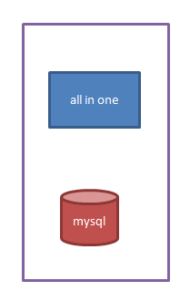  
网站的初期，也认为互联网发展的最早时期。会在单机部署上所有的应用程序和软件。  
所有的代码都是写在JSP里面，所有的代码都写在一起。这种方式称为all in one。  
**特点**  
1. 不具备代码的可维护性
2. 容错性差  

>>  因为我们所有的代码都写在JSP页里。当用户或某些原因发生异常。（1、用户直接看到异常错误信息。2、这个错误会导致服务器宕机）  

容错性是指,软件检测应用程序锁运行的软件或者硬件中发生的错误,并从错误中恢复的能力,通常可以从系统的可靠性,可用性,可测性等几个方面来衡量.  

优点: 只需要一个应用将所有功能都部署在一起,以减少部署节点和成本.  

# 5. 第一时期后期  
针对可维护性以及容错性进行一下方面的解决  
1.  分层开发(提高维护性)[解决容错性]  
2.  mvc架构(web应用程序的设计模式)  
3.  服务器的分离部署  
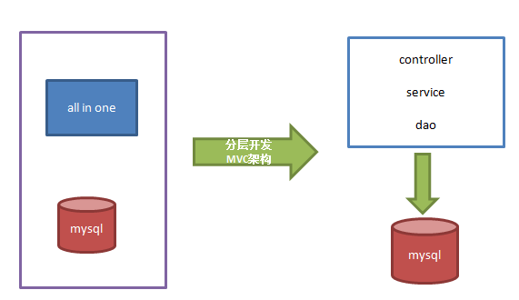  

特点:  
1. mvc分层(解决容错性问题)  
2. 数据库和项目分离  
问题:  
随着用户的访问量持续增加,单体应用无法满足需求.    

## 5.1. 集群方案
**解决方案: 集群**
集群带来的问题
1. 高可用  
“高可用性”（High Availability）通常来描述一个系统经过专门的设计，从而减少停工时间，而保持其服务的高度可用性。(一直都能用)  
2. 高并发  
高并发是互联网分布式系统架构设计中必须考虑的因素之一，它通常是指，通过设计保证系统能够同时并行处理很多请求。  
高并发相关常用的一些指标有响应时间（Response Time），吞吐量（Throughput），每秒查询率QPS（Query Per Second），并发用户数等。    
响应时间:系统对请求作出响应的时间.例如系统处理一个http请求需要200ms,这个200ms就是系统的响应时间  
吞吐量:单位时间内处理的请求数量  
QPS:每秒响应请求数,在互联网领域这个指标和吞吐量没有区分的特别明显.    
并发用户数:同时承载正常使用系统功能的用户数量.例如一个即时通讯系统,同时在线量一定城都上代表了系统的并发用户数.  
3. 高性能  
高性能（High Performance）就是指程序处理速度快，所占内存少，cpu低
## 5.2. 关于提升系统的并发能力  
提高系统并发能力的方式,方法论上主要有两种:垂直扩展(Scale Up)与水平扩展(Scale Out).  
### 5.2.1. 垂直扩展
**垂直扩展：提升单机处理能力。垂直扩展的方式又有两种：**  
1. 增强单机硬件性能,
2. 提升单机架构性能,例如使用Cache来减少IO次数,使用异步来增加单服务吞吐量,使用无锁数据结构来减少响应时间.     

在互联网业务发展非常迅猛的早期，如果预算不是问题，强烈建议使用“增强单机硬件性能”的方式提升系统并发能力，因为这个阶段，公司的战略往往是发展业务抢时间，而“增强单机硬件性能”往往是最快的方法。

>> 总结：不管是提升单机硬件性能，还是提升单机架构性能，都有一个致命的不足：单机性能总是有极限的。所以互联网分布式架构设计高并发终极解决方案还是水平扩展。  

### 5.2.2. 水平扩展  
水平扩展：只要增加服务器数量，就能线性扩充系统性能。水平扩展对系统架构设计是有要求的，难点在于：如何在架构各层进行可水平扩展的设计  
## 5.3. 集群操作  
集群:同一个业务,部署在多个服务器上.  
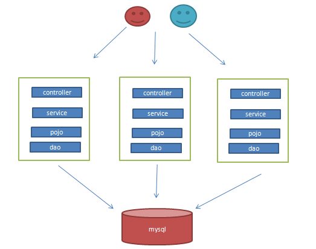  
特点:  
1. 项目采用多台服务器(集群)部署

优点:
支持高并发
支持高可用  

### 5.3.1. 集群痛点  
#### 5.3.1.1. session共享方案  
Redlis Cluster集群方案  
#### 5.3.1.2. 这些集群的服务器，用户的请求该往哪里进行转发？    
答： 用nginx服务器来完成分发请求。实现负载均衡策略机制。

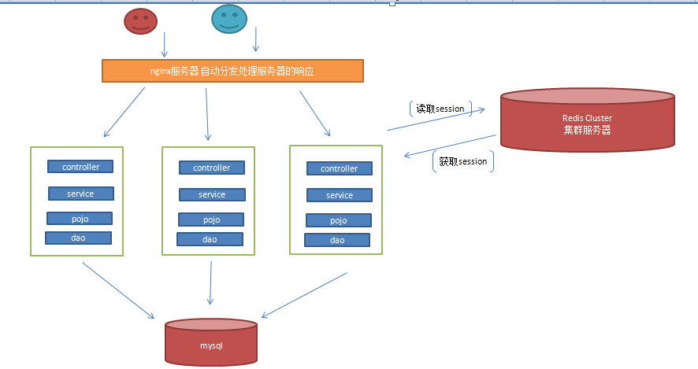
#### 5.3.1.3. 数据库压力变大怎样应对?  
我们能过集群方案nginx+tomcat将应用层的性能进行有效的提升。但是数据库的负载夺力慢慢增加。怎么来搞高数据库层面的访问压力（负载）？  
1. 读写分离  
读写分离：主从数据库之间进行数据同步。master负载增删改操作。 slave负载读操作。  
mysql本身就提供了master-slave的方式完成主从复制功能。  
2. 搜索引擎优化模糊查询    
数据库做读库的情况下，数据库本身对模糊查询的功能支持不是特别优秀，像电商类的网站，搜索是非常核心的功能模块。即使做了读写分离。这个问题也不能有效解决电商网站查询（分词技术）等。针对于该问题，有必要引入搜索引擎技术。  
目前非常主流的搜索引擎技术：  
solr elasticsearch whoosh    
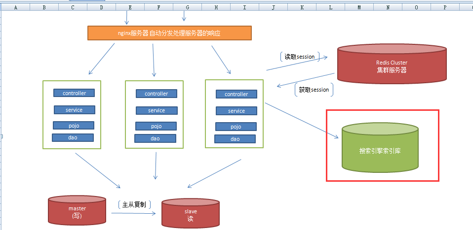  
3. 查询缓存  
随着访问量的持续增加，数据库的访问压力变的越来越大（虽然做了主从复制）。对于这些热点数据（用户访问频繁的信息），如果每都到数据库中进行查询。（很多通用查询的功能）。  
放在内存中又不特别合适。（手机登录验证码操作、为了IP限制频繁访问服务器...) 尝试使用Redis.  
4. 数据库的水平/垂直拆分  
对于应用的垂直扩展,能力终归还是有限的.  
单个表:1000万->1亿数据(单个表的数据能力有限)  
此时可以进行表的拆分:
**表的垂直拆分**   
id ,name,age,bire..tel...remark....  
热数据/冷数据 --》垂直拆分方案。  
**表的水平拆分**  
按照:时间,地区(或者业务逻辑进行拆分)  
分库分表也有一些第三方的数据库中间件: mycat sharding-jdbc drds 阿里  
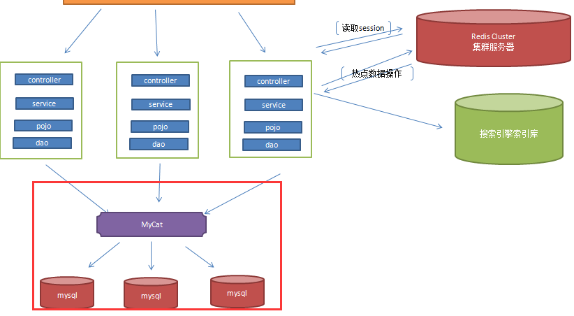  
到达该阶段,可以达到设计的高可用和高并发.  


## 5.4. 集群方案产生的问题
问题1: 服务器价格(维护成本)   
问题2: 可维护性差   
问题3: 可扩展性差   
问题4: 协同开发不方便(大家都去改相同的业务代码.易发生代码错误/冲突)  
问题5: 单体架构(随着业务的不断增加,代码会变得越来越多).导致服务部署时,文件变得越来越大
# 6. 第二时期
**垂直应用架构**    
当访问量逐渐增大，单一应用增加机器带来的加速度越来越小，将应用拆成互不相干的几个应用，以提升效率。此时，用于加速前端页面开发的Web框架(MVC)是关键。  
## 6.1. 水平拆分：
将一个大的单体应用，拆分成多个小应用。 
### 6.1.1. 拆分方案 
为了增加代码的复用(横着拆分)  
exam-parent  //父工程概述（聚合）  
父工程目录下仅有pom.xml，故不需要进行编码。  
1     项目需要的依赖信息、在父工程中定义。子模块继承。  
2     将各个子模块聚合到一起。  
```
exam-commons.jar
exam-pojo.jar //应用模块  java bean类
exam-mapper.jar//应用模块 持久层类和接口
exam-service.jar// 业务逻辑层类和接口
exam-web   //web层
```
例如:   
利用MAVEN做的模块进行拆分和聚合  
### 6.1.2. 解决的问题  
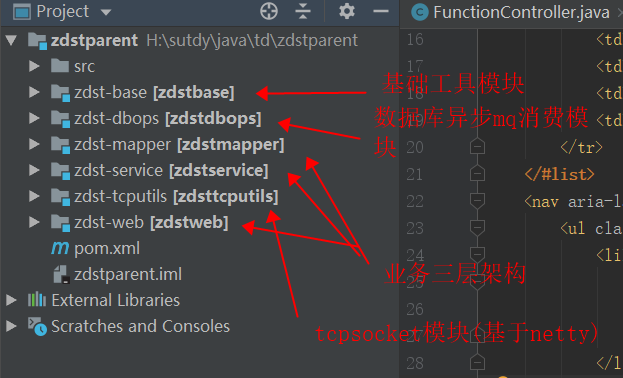  
1. 模块复用
2. 服务器部署粒度更小(内容变少,仅有依赖的进行jar引入)
>>  闲置了大量的服务器。（如果用户对某个层访问量过大时，只需要将该层业务多部署些服务即可。）
（阿里云、百度云、腾讯云、新浪云、京东云）
在没有出现云之前：
一些公司需不需要购买服务器+需要运维人员对服务器进行维护。  
行业：大量Linux运维工程师  
企业：服务器拖管企业
## 6.2. 垂直拆分  
将一个大的应用拆成互不相干的几个小应用。每个应用是独立的Web项目部署。  
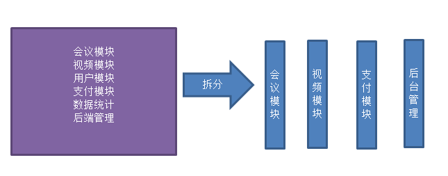  
### 6.2.1. 方案实施
将每个模块单独提取出来进行单独开发(新的问题session共享,分布式事务,分布式锁)  
例如新浪主页下的每个模块都是单独的项目  
### 6.2.2. 解决的问题
1. 维护性(如果想做需求变更,只涉及某个应用模块)  
2. 功能扩展(增加新应用)  
3. 协同开发(按模块分任务)  
4. 部署内容大小/性能扩展(只需要对访问量大的服务器多部署几台)  
 
# 7. 第三时期  
## 7.1. 分布式服务架构   
>> 当垂直应用越来越多，应用之间交互不可避免，将核心业务抽取出来，作为独立的服务，逐渐形成稳定的服务中心，使前端应用能更快速的响应多变的市场需求。此时，用于提高业务复用及整合的分布式服务框架(RPC)是关键。    

分布式：将一个业务拆分成多个子业务，部署在不同的服务器上。  
## 7.2. 第二时期的新问题  
1.  客户对页面的要求变的越来越高。修改会越来越频繁）页面的变化大。每一个应用从头到尾都是完整的，如果客户要对页面进行修改，这个应用服务需要重新部署？(前后端分离)      
答：界面+业务逻辑实现分离（前后端分离开发）。【横着拆 水平拆分】  
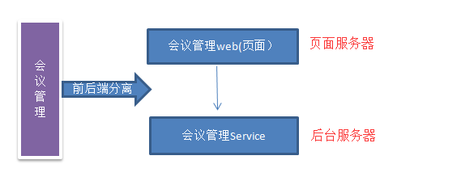  
2.  随着业务的不断增加，应用模块越来越多，各个模块之间一定需要业务进行交互？    
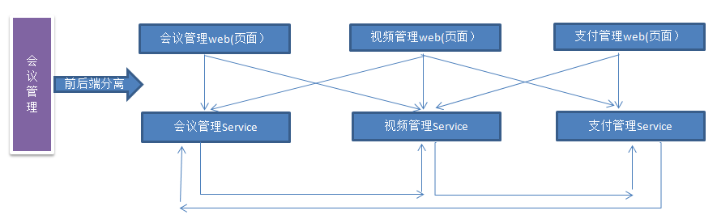   
以前如果在同一台服务器上，（模块的依赖进程来完成调用）  
通过如上图，发现，不同的应用部署在不同的服务器上。服务和服务之间调用【进程间调用】    
答：解决方案：RPC/HTTP/HttpClient  
RPC（Remote Procedure Call）—远程过程调用，它是一种通过网络从远程计算机程序上请求服务，而不需要了解底层网络技术的协议。  
架构的改变一定会带来一些新的技术和新的问题  
分布式事务、分布式锁、分布Session问题。分布式日志管理。 

# 第4时期  
## 第三时期的新问题  
问题1：  
当服务越来越多。服务和服务之间的调用 会变的非常混乱。  
问题2：  
当服务越来越多，容量的评估，小服务资源的浪费等问题逐渐显现  
假如：会议管理功能访问量小，但部署了100台服务器。 支付管理功能访问量大，也部署了20台服务器。  
## 流动计算架构  
当服务越来越多，容量的评估，小服务资源的浪费等问题逐渐显现，此时需增加一个调度中心基于访问压力实时管理集群容量，提高集群利用率。此时，用于提高机器利用率的资源调度和治理中心(SOA)是关键。  
**SOA(面向服务架构)**  
功能:解决多服务混乱问题   
**服务治理中间件:(dubbo/SpringCloud)**    
基于访问压力实时管理集群容量，提高集群利用率。提高机器利用率的资源调度和治理中心。  
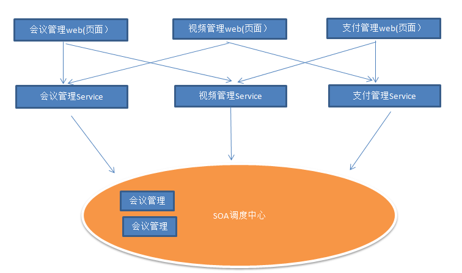  
```
以一个公司为例：有基层员工， 有管理层， 有老板。  
最初大家都听老板指挥，谁干什么谁干什么，根据需要，你可能今天干A事情，明天干B事情，后来人越来越多了，事情也越来越多了，做事情的效率越来越多，管理也很混乱，就开始做部门划分（服务化），专门部门做专门事情的，IT部门只做研发，人事部门只做招聘； 这个时候就无法避免的发生跨部门协作（服务器调用）， 但是你怎么知道有这样一个部门可以做这个事情呢，就要依赖行政部门（注册中心），新成立的部门要在行政哪里做一个备案（服务注册），然后公布一下，让其他部门知道了（服务发布），大家就可以在新的工作秩序里面嗨皮的上班了，这个时候依然是在公司的组织架构中运转；
```

# 第五时期  
微服务架构:  
微服务：单体应用拆分成互不相干的小应用。每一个小的应用称为微服务。    
问题1： 构建单体应用时，(SSM web.xml、需要相应的所有jar、相应的配置文件)  
当拆分构建多个微服务时（需要进行大量的项目【服务】创建）。  
**SpringBoot**  
SprintBoot出现的目的：就是为了简化代码的初始化构建和开发配置。  
## 总结  
架构的改变一定会带来一些新的技术和新的问题  
优点：  
1、服务化的拆分粒度变的更细。（服务的复用性强），提高开发效率。    
2、可根据需求自定义优化方案。（选择最新的技术）    
3、适合于互联网项目。（产品迭代周期短。开发效率快）   
缺点:  
1. 微服务过多,服务管理治理成本高
2. 不利于部署(Docker/k8s)  
3. 技术难点也在增加(分布式事务,分布式锁,分布式Session,分布式日志)  
4. 对团队的技术能力要求高(dubbo/spring cloud)