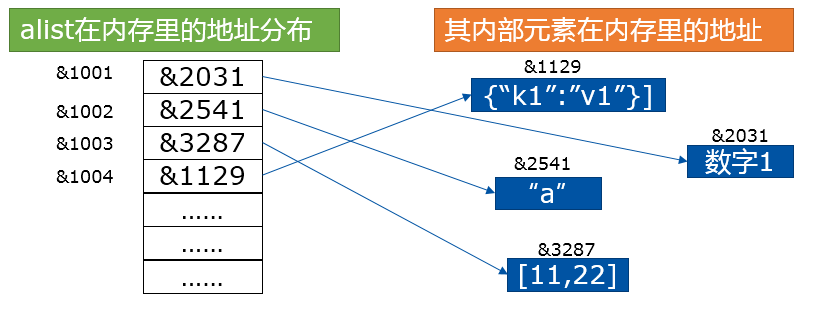
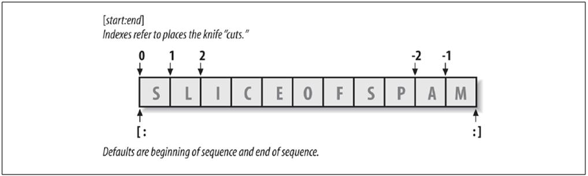
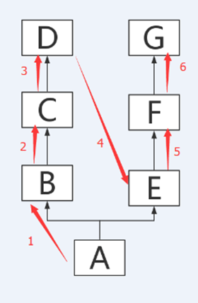
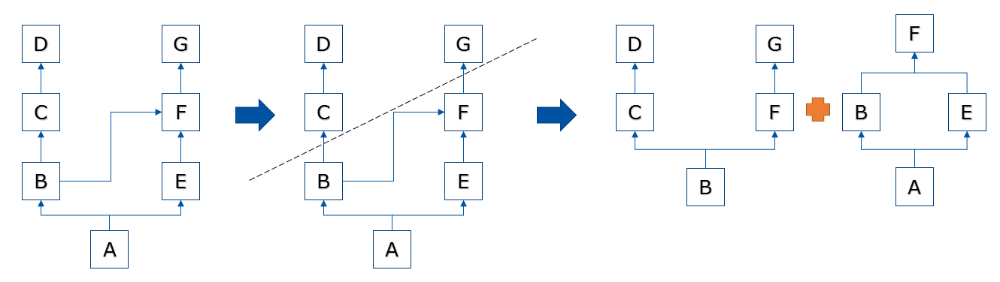
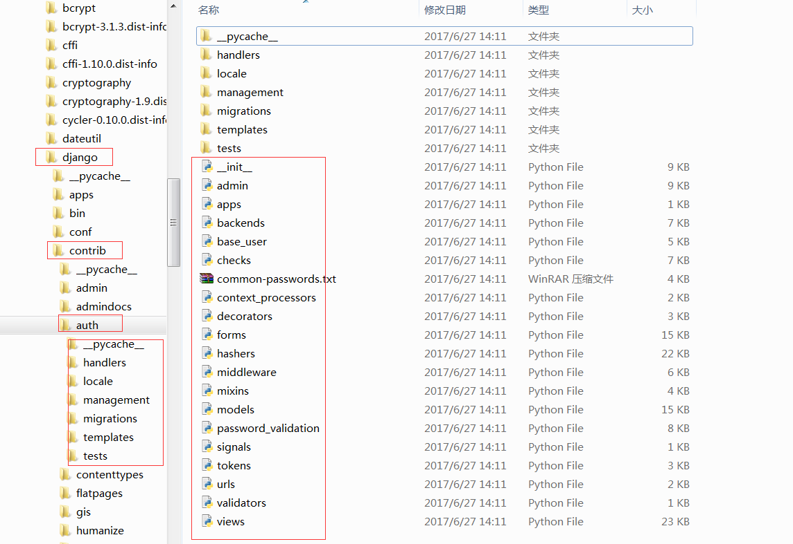
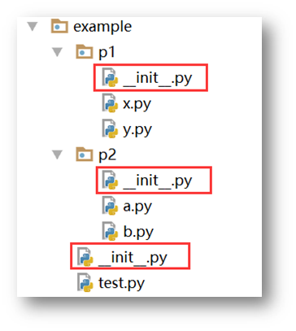

# 1. 简介
# 2. 编译器与解释器
# 3. 基础知识
有很多编程语言，C、C++、JAVA、Python等等，它们在基础细节上各自有各自的不同点，需要区别对待。  
基础语法是一门编程语言最基础的部分，从某种角度讲，也是最重要的部分。不可以只顾专研那些高大上的语法技巧，而忽视最根本的基础语法细节。我建议大家将这部分内容熟记熟背，深入掌握。
## 3.1. 基础语法
## 3.2. 变量与常量
## 3.3. 运算符
## 3.4. 输入输出
# 4. 数据类型
数据类型在数据结构中的定义是一个值的集合以及定义在这个值集上的一组操作。白话讲就是给不同的对象进行分类。  
数据类型包括原始类型、多元组、记录单元、代数数据类型、抽象数据类型、参考类型以及函数类型等等。  
以上都是广义概念的数据类型。在Python的世界，数据类型分两种，内置的和自定义的。  
内置的包括数字、字符串、布尔、列表、元组、字典、Bytes、集合这些常用的以及一些不太常用的数据类型。而自定义的，一般以类的形式，根据需要组合以上内置类型成为独特的数据类型。  
那么，有同学想过为什么编程语言要设置不同的数据类型吗？  
1.  更好的分配管理内存,节省不必要的开支。如果没有数据类型的区别，那么所有的对象都必须按体积最大的对象所必须大小的房子分配空间，也就是内存空间，这样的浪费太严重了。有了数据类型，计算机就可以根据类型预定义的空间需求分配大小，合理开支。内存节省精简了，还能提高读取速度和运行效率。  
2.  方便统一管理，提供同样的API。这样，我们可以为同一数据类型，提供同样的操作，限制其它不允许的行为。也易于查找错误，定位问题。  
3.  区分数据类型，更贴切人类对自然事物的分类管理习惯。我们人类对事物都进行了各种分类，植物是植物、动物是动物，书是书，笔是笔。分类了之后，我们很自然的知道书可以读，笔可以写。数据类型也一样，让我们对抽象的数据有了可分辨的行为和自然的记忆。  

数据类型是Python语言非常重要的部分（哪部分不重要？），尤其是不同数据类型所支持的原生操作，更是重中之重，需要熟练的背在脑海里。很多时候，写大型项目时，不需要你多复杂的技巧，只需要用这些数据操作方法就可以。  
## 4.1. 数字类型
数字类型用于存储数学意义上的数值。  
数字类型是不可变类型。所谓的不可变类型，指的是类型的值一旦有不同了，那么它就是一个全新的对象。数字1和2分别代表两个不同的对象，对变量重新赋值一个数字类型，会新建一个数字对象。  
还是要强调一下Python的变量和数据类型的关系，变量只是对某个对象的引用或者说代号、名字、调用等等，变量本身没有数据类型的概念。类似1，[2, 3, 4]，“haha”这一类对象才具有数据类型的概念。  
例如：
```
a = 1 # 创建数字对象1
a = 2 # 创建数字对象2，并将2赋值给变量a，a不再指向数字对象1
```
这里，发生了变化的是变量a的指向，而不是数字对象1变成了数字对象2。初学者可能会比较迷糊，但不要紧，我们努力去明白它。  
Python 支持三种不同的数字类型，整数、浮点数和复数：  
### 4.1.1. 整数(Int)
通常被称为整型，是正或负整数，不带小数点。Python3的整型可以当作Long类型（更长的整型）使用，所以 Python3没有Python2的Long类型。  
例如：1，100，-8080，0，等等。  
表示数字的时候，有时我们还会用八进制或十六进制来表示：  
十六进制用0x前缀和0-9，a-f表示，例如：0xff00，0xa5b4c3d2。  
八进制用0o前缀和0-7表示，例如0o12  
Python的整数长度为32位，并且通常是连续分配内存空间的。  
```
if __name__=="__main__":
    print(id(-2))
    print(id(-1))
    print(id(0))
    print(id(1))
    print(id(2))
```
从上面的空间地址看，地址之间正好差32。为什么会这样？因为Python在初始化环境的时候就在内存里自动划分了一块空间，专门用于整数对象的存取。当然，这块空间也不是无限大小的，能保存的整数是有限的，所以你会看到id(0)和id(10000)之间的地址差别很大。
```
    print(id(2))
    print(id(10000))
```
**小整数对象池**  
Python初始化的时候会自动建立一个小整数对象池，方便我们调用，避免后期重复生成！这是一个包含262个指向整数对象的指针数组，范围是-5到256。也就是说比如整数10，即使我们在程序里没有创建它，其实在Python后台已经悄悄为我们创建了。  
为什么要这样呢？我们都知道，在程序运行时，包括Python后台自己的运行环境中，会频繁使用这一范围内的整数，如果每需要一个，你就创建一个，那么无疑会增加很多开销。创建一个一直存在，永不销毁，随用随拿的小整数对象池，无疑是个比较实惠的做法。  
除了小整数对象池，Python还有整数缓冲区的概念，也就是刚被删除的整数，不会被真正立刻删除回收，而是在后台缓冲一段时间，等待下一次的可能调用。  
### 4.1.2. 浮点数（float）
浮点数也就是小数，如1.23，3.14，-9.01，等等。但是对于很大或很小的浮点数，一般用科学计数法表示，把10用e替代，1.23x10^9就是1.23e9，或者12.3e8，0.000012可以写成1.2e-5，等等。  
### 4.1.3. 复数( (complex)) 
复数由实数部分和虚数部分构成，可以用a + bj,或者complex(a,b)表示，复数的实部a和虚部b都是浮点型。关于复数，不做科学计算或其它特殊需要，通常很难遇到。  
数字类型转换：  
有时候，我们需要对数字的类型进行转换。Python为我们提供了方便的内置的数据类型转换函数。 
int(x)： 将x转换为一个整数。如果x是个浮点数，则截取小数部分。  
float(x) ：将x转换到一个浮点数。  
complex(x) ：将x转换到一个复数，实数部分为 x，虚数部分为 0。  
complex(x, y)： 将 x 和 y 转换到一个复数，实数部分为 x，虚数部分为 y。  
转换过程中如果出现无法转换的对象，则会抛出异常，比如int("haha")，你说我把字符串“haha”转换为哪个整数才对？  
### 4.1.4. 数学计算
对于数学计算，除了前面提到过的简单的加减乘除等等，更多的科学计算需要导入math这个库，它包含了绝大多数我们可能需要的科学计算函数，如下表。  
```
def numberfunc():
    print("绝对值",abs(-10))
    print("向上取整",math.ceil(4.1))
    print("e的x次幂",math.exp(1))
    print("绝对值",math.fabs(-10))
    print("向下取整",math.floor(3.2))
    print("log",math.log(math.e))
    print("log",math.log(100,10))
    print("log10为底",math.log10(100))
    print("最大",max(2,3,4,5,1))
    print("最小",min(23,3,34,54))
    print("分离整数与小数",math.modf(2.32))
    print("幂",math.pow(2,3))
    print("四舍五入",round(2.32,6))
    print("平方根",math.sqrt(4))
    print("反余弦",math.acos(0.5))
    print("反正弦",math.asin(0.1))
    print("反正切",math.atan(0.4))
    print(" X 及 Y 坐标值的反正切值",math.atan2(2,3))
    print("余弦",math.cos(math.pi))
    print("正弦",math.sin(math.pi/2))
    print("正切",math.tan(math.pi/2))
    print("弧度转角度",math.degrees(math.pi/3))
    print("角度转弧度",math.radians(90))
    print("欧几里得范数sqrt(xx+yy)",math.hypot(1,1))
```
```
```
## 4.2. 布尔类型
对于错、0和1、正与反，都是传统意义上的布尔类型。  
但在Python语言中，布尔类型只有两个值，True与False。请注意，是英文单词的对与错，并且首字母要大写，不能其它花式变型。  
所有计算结果，或者调用返回值是True或者False的过程都可以称为布尔运算，例如比较运算。布尔值通常用来判断条件是否成立。  
```
age = 16
if age >= 18:
    print("你是个成年人")
else:
    print("你还未成年")
```
Python内置的bool()函数可以用来测试一个表达式的布尔值结果。  
下面一些例子的结果，可能让你感到惊讶，但事实就是如此，请坦然接受。  
```
>>> True
True
>>> False
False
>>> 3 > 2
True
>>> 3 > 5
False
>>> 3 in [1,2,3]
True
>>> 3 == 9/3
True
>>> 3 is "3"
False
```
为什么3 is "3"是错误的呢？因为一个是整数一个是字符串，is运算符比较的是对象，当然是错误的。
```
>>> bool(1)
True
>>> bool(0)
False
>>> bool([])
False
>>> bool(())
False
>>> bool({})
False
>>> bool(-1)
True
>>> bool('')
False
>>> bool("False")
True
>>> bool("True")
True
>>> bool(0.0)
False
>>> bool(1.0)
True
>>> bool(-0.0)
False
```
看完上面的例子，你会发现很多想当然的结果居然是错的。0、0.0、-0.0、空字符串、空列表、空元组、空字典，这些都被判定为False。而-1、"False"也被判断为True。  
**布尔类型可以进行and、or和not运算。**
and运算是与运算，只有所有都为True，and运算的结果才是True：  
or运算是或运算，只要其中有一个为True，or运算结果就是True：  
not运算是非运算，它是单目运算符，把True变成False，False变成True：  
真的可以！比较运算，四则运算都没有问题。并且在做四则运算的时候，明显把True看做1，False看做0。往往是我们不知道的细节，有时候给我们带来巨大的困扰和疑惑。更多的运算种类支持，请大家自行测试。  
```
>>> True > False
True
>>> True < False
False
>>> True >=False
True
>>> True -1
0
>>> True + 1
2
>>> True *3
3
>>> False -1
-1
```
**空值：None**  
空值不是布尔类型，严格的来说放在这里是不合适的，只不过和布尔关系比较紧密。  
空值是Python里一个特殊的值，用None表示（首字母大写）。None不能理解为0，因为0是整数类型，而None是一个特殊的值。None也不是布尔类型，而是NoneType。  
```
>>> bool(None)
False
>>> type(None)
<class 'NoneType'>
```
我们平时最容易犯的错误就是获得了一个None值，却对它进行各种方法调用，例如：  
```
list1 = ["a", "b", None]

for char in list1:
    print(char.join("A"))

######################################

Traceback (most recent call last):
  File "F:/Python/pycharm/201705/test.py", line 7, in <module>
    print(char.join("A"))
AttributeError: 'NoneType' object has no attribute 'join'
```
## 4.3. 列表
列表是Python中最基本也是最常用的数据结构之一。列表中的每个元素都被分配一个数字作为索引，用来表示该元素在列表内所排在的位置。第一个元素的索引是0，第二个索引是1，依此类推。  
Python的列表是一个有序可重复的元素集合，可嵌套、迭代、修改、分片、追加、删除，成员判断。  
从数据结构角度看，Python的列表是一个可变长度的顺序存储结构，每一个位置存放的都是对象的指针。  
比如，对于这个列表 alist = [1, “a”, [11,22], {“k1”:”v1”}]，其在内存内的存储方式是这样的：  
  
### 4.3.1. 创建方式
创建一个列表，只要把逗号分隔的不同的数据项使用方括号括起来即可。列表内的元素，可以是其它任意类型的数据，可多层嵌套列表，元素个数无限制。  
```
>>> lis = []        # 创建一个空列表
>>> lis = [1, 2, 3]
>>> lis = [1, 'a', [11,22], {'k1':'v1'}]
>>> lis = [1, 2, [3, 4, 5]]
```
### 4.3.2. 访问列表内的元素
列表从0开始为它的每一个元素顺序创建下标索引，直到总长度减一。要访问它的某个元素，以方括号加下标值的方式即可。注意要确保索引不越界，一旦访问的 索引超过范围，会抛出异常。所以，一定要记得最后一个元素的索引是len(list)-1。  
```
>>> lis = ["a", "b", "c"]
>>> lis[0]
'a'
>>> lis[1]
'b'
>>> lis[2]
'c'
>>> lis[3]
Traceback (most recent call last):
  File "<pyshell#7>", line 1, in <module>
    lis[3]
IndexError: list index out of range
```
### 4.3.3. 修改元素的值
直接对元素进行重新赋值。  
```
>>> lis[0]
'a'
>>> lis[0] = "d"
>>> lis[0]
'd'
```
### 4.3.4. 删除元素
使用del语句或者remove(),pop()方法删除指定的元素。 
```
>>> lis = ["a", "b", "c"]
>>> del lis[0]
>>> lis
['b', 'c']
>>> lis.remove("b")
>>> lis
['c']
>>> lis.pop()
'c'
>>> lis
[]
```
### 4.3.5. 列表的特殊操作
除了以上的常规操作，列表还有很多有用的其它操作。  
| 语句                         | 结果                         | 描述                     |
| :--------------------------- | :--------------------------- | :----------------------- |
| [1, 2, 3] + [4, 5, 6]        | [1, 2, 3, 4, 5, 6]           | 组合两个列表             |
| ['Hi!'] * 4                  | ['Hi!', 'Hi!', 'Hi!', 'Hi!'] | 列表的乘法               |
| 3 in [1, 2, 3]               | True                         | 判断元素是否存在于列表中 |
| for x in [1, 2, 3]: print x, | 1 2 3                        | 迭代列表中的每个元素     |
### 4.3.6. 针对列表的常用函数
Python有很多内置函数，可以操作列表。
| 函数      | 作用                                 |
| :-------- | :----------------------------------- |
| len(list) | 返回列表元素个数，也就是获取列表长度 |
| max(list) | 返回列表元素最大值                   |
| min(list) | 返回列表元素最小值                   |
| list(seq) | 将序列转换为列表                     |
让我们看一些例子：  
```
>>> s = [1, 4, 9, 16, 25]
>>> len(s)
5
>>> max(s)
25
>>> min(s)
1
>>> s = list((1, "a", "b", 2))
>>> s
[1, 'a', 'b', 2]
>>> max(s)          # 不能混合不同类型进行最大最小求值
Traceback (most recent call last):
  File "<pyshell#20>", line 1, in <module>
    max(s)
TypeError: '>' not supported between instances of 'str' and 'int'
```
这些操作都不会修改列表本身，属于安全操作。max、min在Python3中，不能对不同类型的对象进行大小的比较了。  
### 4.3.7. 切片
切片指的是对序列进行截取，选取序列中的某一段。  
切片的语法是： list[start:end]  
  
以冒号分割索引，start代表起点索引，end代表结束点索引。省略start表示以0开始，省略end表示到列表的结尾。注意，区间是左闭右开的！也就是说[1:4]会截取列表的索引为1/2/3的3个元素，不会截取索引为4的元素。分片不会修改原有的列表，可以将结果保存到新的变量，因此切片也是一种安全操作，常被用来复制一个列表，例如newlist = lis[:]。  
如果提供的是负整数下标，则从列表的最后开始往头部查找。例如-1表示最后一个元素，-3表示倒数第三个元素。  
切片过程中还可以设置步长，以第二个冒号分割，例如list[3:9:2]，表示每隔多少距离取一个元素。  
下面是一些例子，让你有更清晰的了解。  
```
>>> a = [1,2,3,4,5,6,7,8,9,10]
>>> a[3:6]
[4, 5, 6]
>>> a[:7]
[1, 2, 3, 4, 5, 6, 7]
>>> a[2:]
[3, 4, 5, 6, 7, 8, 9, 10]
>>> s = a[:]
>>> s
[1, 2, 3, 4, 5, 6, 7, 8, 9, 10]
>>> a
[1, 2, 3, 4, 5, 6, 7, 8, 9, 10]
>>> s.remove(4)
>>> s
[1, 2, 3, 5, 6, 7, 8, 9, 10]
>>> a
[1, 2, 3, 4, 5, 6, 7, 8, 9, 10]
>>> a[-1]
10
>>> a[-3]
8
>>> a[-5:]
[6, 7, 8, 9, 10]
>>> a[::-1]
[10, 9, 8, 7, 6, 5, 4, 3, 2, 1]
>>> a[1:8:2]
[2, 4, 6, 8]
>>> a[1:8:-2]
[]
>>> a[-8::-2]
[3, 1]
>>> a[-8::2]
[3, 5, 7, 9]
```
### 4.3.8. 多维列表（嵌套列表）
列表可以嵌套列表，形成多维列表，形如矩阵。其元素的引用方法是list[i][j][k].....。当然，也可以嵌套别的数据类型。  
```
>>> a = [[1,2,3],[4,5,6],[7,8,9]]
>>> a[0][1]
2
>>> a = [[1,2,3],[4,5,6],[7,8,9],{"k1":"v1"}]
>>> a[3]["k1"]
'v1'
```
### 4.3.9. 列表的遍历
列表有好几种遍历方式：  
```
a = [1,2,3,4,5,6]
---------------------------
for i in a:             # 遍历每一个元素本身
    print(i)
------------------------------
for i in range(len(a)):     # 遍历列表的下标，通过下标取值
    print(i, a[i])
--------------------------------
x = 9
if x in a:      # 进行是否属于列表成员的判断。该运算速度非常快。
    print("True")
else:
    print("False")
```
### 4.3.10. 列表的内置方法
下图中的方法是列表专有的内置方法，请熟记于心。  
| 方法               | 作用                                                               |
| :----------------- | :----------------------------------------------------------------- |
| append(obj)        | 在列表末尾添加新的对象                                             |
| count(obj)         | 统计某个元素在列表中出现的次数                                     |
| extend(seq)        | 在列表末尾一次性追加另一个序列中的多个值（用新列表扩展原来的列表） |
| index(obj)         | 从列表中找出某个值第一个匹配项的索引位置                           |
| insert(index, obj) | 将对象插入列表                                                     |
| pop(obj=list[-1])  | 移除列表中的一个元素（默认最后一个元素），并且返回该元素的值       |
| remove(obj)        | 移除列表中某个值的第一个匹配项                                     |
| reverse()          | 反向列表中元素                                                     |
| sort([func])       | 对原列表进行排序                                                   |
| copy()             | 复制列表                                                           |
| clear()            | 清空列表，等于del lis[:]                                           |
注意：其中的类似 append，insert, remove 等方法会修改列表本身，并且没有返回值（严格的说是返回None）。
```
>>> lis = ["a", "b", "c", "d"]
>>> lis.append("A")
>>> lis
['a', 'b', 'c', 'd', 'A']
>>> lis.count()
Traceback (most recent call last):
  File "<pyshell#3>", line 1, in <module>
    lis.count()
TypeError: count() takes exactly one argument (0 given)
>>> lis.count("a")
1
>>> lis.extend(["a","b"])
>>> lis
['a', 'b', 'c', 'd', 'A', 'a', 'b']
>>> lis.count("a")
2
>>> lis.index("a")
0
>>> lis.index("A")
4
>>> lis.insert(3, "E")
>>> lis
['a', 'b', 'c', 'E', 'd', 'A', 'a', 'b']
>>> s = lis.pop()
>>> s
'b'
>>> lis
['a', 'b', 'c', 'E', 'd', 'A', 'a']
>>> s = lis.pop(4)
>>> s
'd'
>>> lis
['a', 'b', 'c', 'E', 'A', 'a']
>>> lis.remove(3)
Traceback (most recent call last):
  File "<pyshell#19>", line 1, in <module>
    lis.remove(3)
ValueError: list.remove(x): x not in list
>>> lis.remove("E")
>>> lis
['a', 'b', 'c', 'A', 'a']
>>> lis.reverse()
>>> lis
['a', 'A', 'c', 'b', 'a']
>>> newlis = lis.copy()
>>> lis
['a', 'A', 'c', 'b', 'a']
>>> newlis
['a', 'A', 'c', 'b', 'a']
>>> newlis.clear()
>>> newlis
[]
>>> lis.sort()
>>> lis
['A', 'a', 'a', 'b', 'c']
```
### 4.3.11. 将列表当做堆栈
Python的列表特别适合也很方便作为一个堆栈来使用。堆栈是一种特定的数据结构，最先进入的元素最后一个被释放（后进先出）。将列表的表头作为栈底，表尾作为栈顶，就形成了一个堆栈。用列表的append()方法可以把一个元素添加到堆栈顶部（实际上就是在列表的尾部添加一个元素）。用不指定索引的pop()方法可以把一个元素从堆栈顶释放出来（也就是从列表尾部弹出一个元素）。例如：  
**利用append和pop两个即可封装
### 4.3.12. 将列表当作队列
也可以把列表当做队列用。队列是一种先进先出的数据结构。但是用Python的列表做队列的效率并不高。因为，虽然在列表的最后添加或者弹出元素速度很快，但在列头部弹出第一个元素的速度却不快（因为所有其他的元素都得跟着一个一个地往左移动一位）。通常我们使用queue.Queue作为单向队列，使用collections.deque作为双向队列。  
## 4.4. 元组
我们知道，用方括号括起来的是列表，那么用圆括号括起来的是什么，是元组。  
元组也是序列结构，但是是一种不可变序列，你可以简单的理解为内容不可变的列表。除了在内部元素不可修改的区别外，元组和列表的用法差不多。  
**元组与列表相同的操作**
* 使用方括号加下标访问元素
* 切片（形成新元组对象）
* count()/index()
* len()/max()/min()/tuple()
**元组没有的功能**
* 修改、新增元素
* 删除某个元素（但可以删除整个元组）
* 所有会对元组内部元素发生修改动作的方法。例如，元组没有remove，append，pop等方法。 
**元组与列表类似的特殊操作：** 
| 表达式                  | 结果                      | 描述         |
| :---------------------- | :------------------------ | :----------- |
| len((1,2,3))            | 3                         | 计算个数     |
| (1,2,3)+(4,5,6)         | (1,2,3,4,5,6)             | 连接         |
| ('Hi!',)*4              | ("Hi!',"Hi!',"Hi!',"Hi!') | 复制         |
| 3 in(1,2,3)             | True                      | 元素是否存在 |
| for x in(1,2,3):print x | 1,2,3                     | 迭代         |
来看一些实例：  
```
>>> tup1 = ()           # 创建空元组
>>> tup1 = (50,)        # 创建只包含一个元素的元组时，要在元素的后面跟个逗号
>>> tup1 = ('physics', 'chemistry', 1997, 2000)
>>> tup2 = (1, 2, 3, 4, 5 )
>>> tup3 = "a", "b", "c", "d"
>>> tup = (1, 2, 3, 4)
>>> tup[2]
3
>>> tup[3] = "a"
Traceback (most recent call last):
  File "<pyshell#2>", line 1, in <module>
    tup[3] = "a"
TypeError: 'tuple' object does not support item assignment
```
这不能，那不能，要你何用，我直接用列表不行吗？还是有用的，有些数据一旦创建之后就不允许修改了，这些数据就适合用元组来创建，比如主机地址和端口（ip，port），（"192.168.1.1"， 80），两者捆绑在一起，不允许修改。  
元组看来是很安全的。但真的吗？  
**元组只保证它的一级子元素不可变，对于嵌套的元素内部，不保证不可变！**
```
>>> tup = ('a', 'b', ['A', 'B'])
>>> tup[2][0] = 'X'
>>> tup[2][1] = 'Y'
>>> tup 
('a', 'b', ['X', 'Y'])
```
Python为什么总是有这种幺蛾子呢？？？所以，在使用元组的时候，请尽量使用数字、字符串和元组这种不可变的数据类型作为元组的元素，这样就能确保元组不发生变化。
## 4.5. 字符串
字符串是Python中最常用的数据类型之一，使用单引号或双引号来创建字符串，使用三引号创建多行字符串。字符串要么使用两个单引号，要么两个双引号，不能一单一双！Python不支持单字符类型，单字符在Python中也是作为一个字符串使用。  
字符串是不可变的序列数据类型，不能直接修改字符串本身，和数字类型一样！Python3全面支持Unicode编码，所有的字符串都是Unicode字符串，所以传统Python2存在的编码问题不再困扰我们，可以放心大胆的使用中文。  
```
>>> var1 = 'Hello World!'
>>> var2 = "Jack"
>>> var3 = ""                   # 空字符串
>>> var4 = "it's apple"         # 双引号中可以嵌套单引号
>>> var5 = 'This is "PLANE"!'   # 单引号中可以嵌套双引号
>>> var6 = 'what is 'your'name'
SyntaxError: invalid syntax
```
但是单引号嵌套单引号或者双引号嵌套双引号就会出现歧义。  
```
>>> a = "haha"
>>> b = a
>>> a = "xixi"
>>> a is b
False
>>> a[1] = "z"
Traceback (most recent call last):
  File "<pyshell#70>", line 1, in <module>
    a[1] = "z"
TypeError: 'str' object does not support item assignment
```
虽然字符串本身不可变，但可以像列表序列一样，通过方括号加下标的方式，访问或者获取它的子串，当然也包括切片操作。这一切都不会修改字符串本身，当然也符合字符串不可变的原则。  
```
>>> s = "hello world!"
>>> s[4]
'o'
>>> s[2:6]
'llo '
>>> s
'hello world!'
```
### 4.5.1. 字符串的运算
下表实例变量a值为字符串 "Hello"，b变量值为 "Python"：
| 操作   | 描述                                                                                                                                                                                       | 操作         | 结果          |
| :----- | :----------------------------------------------------------------------------------------------------------------------------------------------------------------------------------------- | :----------- | :------------ |
| +      | 字符串连接(运算速度慢，慎用)                                                                                                                                                               | a+b          | 'HelloPython' |
| *      | 重复输出字符串，相当于乘法                                                                                                                                                                 | a * 2        | 'HelloHello'  |
| []     | 通过索引获取字符串中的字符                                                                                                                                                                 | a[ 1]        | 'e'           |
| [ :]   | 截取字符串中的一部分，切片                                                                                                                                                                 | a[ 1:4]      | 'ell'         |
| in     | 成员运算符 - 如果字符串中包含给定的字符返回 True                                                                                                                                           | "H" in a     | True          |
| not in | 成员运算符 - 如果字符串中不包含给定的字符返回 True                                                                                                                                         | "M" not in a | True          |
| r/R    | 原始字符串：所有的字符串都是直接按照字面的意思来使用，没有转义特殊或不能打印的字符。 原始字符串除在字符串的第一个引号前加上字母"r"（可以大小写）以外，与普通字符串有着几乎完全相同的语法。 | print(r'\n') | \n            |
### 4.5.2. Python转义字符
编程语言里，有很多特殊字符，它们起着各种各样的作用。有些特殊字符没有办法用普通字符表示，需要进行转义。python用反斜杠(\ )转义字符。  
### 4.5.3. 多行字符串
前面我们介绍过，在函数和类的紧后面可以用三引号添加doc说明。  
在字符串中，可以使用三引号（三单或三双引号都可以）编写跨行字符串，在其中可以包含换行符、制表符以及其他特殊字符.  
### 4.5.4. 字符串内置方法
```
def testfunc():
    st="feedBad"
    print("把字符串的第一个字符大写",st.capitalize())
    print("返回一个原字符串居中,并使用空格填充至长度width的新字符串",st.center(20))
    print("返回 str 在 string 里面出现的次数，如果 beg 或者 end 指定则返回指定范围内 str 出现的次数",st.count("e"))
    bts=bytes(st,encoding="utf-8")
    print("Python3 中没有 decode 方法，但我们可以使用 bytes 对象的 decode() 方法来解码给定的 bytes 对象",bts.decode(encoding='UTF-8', errors='strict'))
    print("以 encoding 指定的编码格式编码 string，编码的结果是一个bytes对象。如果出错默认报一个ValueError 的异常，除非 errors 指定的是'ignore'或者'replace'",st.encode(encoding="utf-8",errors='strict'))
    print("检查字符串是否以 obj 结束，如果beg 或者 end 指定则检查指定的范围内是否以 obj 结束，如果是，返回 True,否则返回 False.",st.endswith("e"))
    print("把字符串 string 中的 tab 符号转为空格，tab 符号默认的空格数是 8。",st.expandtabs(tabsize=8))
    print("检测 str 是否包含在 string 中，如果 beg 和 end 指定范围，则检查是否包含在指定范围内，如果是返回开始的索引值，否则返回-1",st.find("e"))
    st2="bas{},{}"
    print("格式化字符串",st2.format(1,2))
    print("跟find()方法一样，只不过如果str不在 string中会报一个异常.",st.index("e"))
    print("如果 string 至少有一个字符并且所有字符都是字母或数字则返回 True,否则返回False",st.isalnum(),st.isalpha(),st.isdecimal(),st.isdigit(),st.islower(),st.isnumeric(),st.isspace(),st.istitle(),st.isupper())
    print("以string作为分隔符，将seq中所有的元素(的字符串表示)合并为一个新的字符串",st.join(["1","2","3"]))
    print("返回一个原字符串左对齐,并使用空格填充至长度 width 的新字符串",st.ljust(20))
    print("转换 string 中所有大写字符为小写",st.upper(),st.lower())
    print("截掉 string 左边的空格",st.lstrip(),st.rstrip(),st.strip())
    print("有点像 find()和 split()的结合体,从 str 出现的第一个位置起,把 字 符 串 string 分 成 一 个 3 元 素 的 元 组 (string_pre_str,str,string_post_str),如果 string 中不包含str 则 string_pre_str == string.",st.partition('e'))
    print("把 string 中的 str1 替换成 str2,如果 num 指定，则替换不超过 num 次.",st.replace("e","a"))
```
### 4.5.5. str.format()格式化方法
前面说过%百分符格式化方法。Python官方最近逐步在推广str.format()方法的格式化。  
fromat()方法是字符串的内置方法，其基本语法如下  
```
参数列表：[[fill]align][sign][#][0][width][,][.precision][type]

fill            【可选】空白处填充的字符

align           【可选】对齐方式（需配合width使用）


<，内容左对齐

>，内容右对齐(默认)

＝，内容右对齐，将符号放置在填充字符的左侧，且只对数字类型有效。 即使：符号+填充物+数字

^，内容居中


sign         【可选】有无符号数字
#            【可选】对于二进制、八进制、十六进制，如果加上#，会显示 0b/0o/0x，否则不显示


+，正号加正，负号加负；
 -，正号不变，负号加负；
空格 ，正号空格，负号加负；


，              【可选】为数字添加分隔符，如：1,000,000

width           【可选】格式化位所占宽度

.precision      【可选】小数位保留精度

type            【可选】格式化类型


传入” 字符串类型 “的参数：
s，格式化字符串类型数据
空白，未指定类型，则默认是None，同s


传入“ 整数类型 ”的参数：
b，将10进制整数自动转换成2进制表示然后格式化
c，将10进制整数自动转换为其对应的unicode字符
d，十进制整数
o，将10进制整数自动转换成8进制表示然后格式化；
x，将10进制整数自动转换成16进制表示然后格式化（小写x）
X，将10进制整数自动转换成16进制表示然后格式化（大写X）


传入“ 浮点型或小数类型 ”的参数：
e， 转换为科学计数法（小写e）表示，然后格式化；
E， 转换为科学计数法（大写E）表示，然后格式化;
f ， 转换为浮点型（默认小数点后保留6位）表示，然后格式化；
F， 转换为浮点型（默认小数点后保留6位）表示，然后格式化；
g， 自动在e和f中切换
G， 自动在E和F中切换

%，显示百分比（默认显示小数点后6位）
```
下面是一些具体的例子，可以参考使用：
```
tpl = "i am {}, age {}, {}".format("seven", 18, 'alex')

tpl = "i am {}, age {}, {}".format(*["seven", 18, 'alex'])

tpl = "i am {0}, age {1}, really {0}".format("seven", 18)

tpl = "i am {0}, age {1}, really {0}".format(*["seven", 18])

tpl = "i am {name}, age {age}, really {name}".format(name="seven", age=18)

tpl = "i am {name}, age {age}, really {name}".format(**{"name": "seven", "age": 18})

tpl = "i am {0[0]}, age {0[1]}, really {0[2]}".format([1, 2, 3], [11, 22, 33])

tpl = "i am {:s}, age {:d}, money {:f}".format("seven", 18, 88888.1)

tpl = "i am {:s}, age {:d}".format(*["seven", 18])

tpl = "i am {name:s}, age {age:d}".format(name="seven", age=18)

tpl = "i am {name:s}, age {age:d}".format(**{"name": "seven", "age": 18})

tpl = "numbers: {:b},{:o},{:d},{:x},{:X}, {:%}".format(15, 15, 15, 15, 15, 15.87623, 2)

tpl = "numbers: {:b},{:o},{:d},{:x},{:X}, {:%}".format(15, 15, 15, 15, 15, 15.87623, 2)

tpl = "numbers: {0:b},{0:o},{0:d},{0:x},{0:X}, {0:%}".format(15)

tpl = "numbers: {num:b},{num:o},{num:d},{num:x},{num:X}, {num:%}".format(num=15)
```
### 4.5.6. 字符串颜色控制  
有时候我们需要对有用的信息设置不同颜色来达到强调、突出、美观的效果，在命令行或linux终端中，颜色是用转义序列控制的，转义序列是以ESC开头，在代码中用\033表示(ESC的ASCII码用十进制表示就是27，等于用八进制表示的33，\0表示八进制)。注意：颜色控制只在终端界面中有效。  
格式：\033[显示方式;前景色;背景色m正文\033[0m  
<table>
<thead>
<tr>
<th>前景色</th>
<th>背景色</th>
<th>颜色</th>
</tr>
</thead>
<tbody>
<tr>
<td>30</td>
<td>40</td>
<td>黑色</td>
</tr>
<tr>
<td>31</td>
<td>41</td>
<td>红色</td>
</tr>
<tr>
<td>32</td>
<td>42</td>
<td>绿色</td>
</tr>
<tr>
<td>33</td>
<td>43</td>
<td>黃色</td>
</tr>
<tr>
<td>34</td>
<td>44</td>
<td>蓝色</td>
</tr>
<tr>
<td>35</td>
<td>45</td>
<td>紫红色</td>
</tr>
<tr>
<td>36</td>
<td>46</td>
<td>青蓝色</td>
</tr>
<tr>
<td>37</td>
<td>47</td>
<td>白色</td>
</tr>
</tbody>
</table>
<p>显示方式：</p>
<table>
<thead>
<tr>
<th>显示方式</th>
<th>意义</th>
</tr>
</thead>
<tbody>
<tr>
<td>0</td>
<td>终端默认设置</td>
</tr>
<tr>
<td>1</td>
<td>高亮显示</td>
</tr>
<tr>
<td>4</td>
<td>使用下划线</td>
</tr>
<tr>
<td>5</td>
<td>闪烁</td>
</tr>
<tr>
<td>7</td>
<td>反白显示</td>
</tr>
<tr>
<td>8</td>
<td>不可见</td>
</tr>
</tbody>
</table>
例子：

\033[1;31;40m 1-高亮显示 31-前景色红色 40-背景色黑色

\033[0m 采用终端默认设置，也就是取消颜色设置  
比如下面的代码：  
```
import time

def funcol():
    print('\033[1;31m')
    print('登录信息'.center(46, "*"), "\033[0m")
    print('\033[34m*HOST:\t', "192.168.1.10")
    print('*PORT:\t', "80")
    print('*User:\t', "jack")
    print('*TIME:\t', time.strftime("%Y-%m-%d %H:%M:%S", time.localtime()))
    print('\033[1;31m*' * 50, '\033[0m')
    print("\033[32m欢迎登录！\033[0m")
```

### 4.5.7. 字符编码
计算机只能处理数字01，如果要处理文本，就必须先把文本转换为数字01，这种转换方式就称为字符编码。  
对于我们而言，你只需要简单记住下面几种编码就好：  
* ASCII编码：早期专门为英语语系编码，只有255个字符，每个字符需要8位也就是1个字节。不兼容汉字。
* Unicode编码：又称万国码，国际组织制定的可以容纳世界上所有文字和符号的字符编码方案。用2个字节来表示汉字。 
* UTF-8编码：为了节省字节数，在Unicode的基础上进行优化的编码。用1个字节表示英文字符，3个字符表示汉字。天生兼容ASCII编码，所以最为流行。
* GB2312：我国早期自己制定的中文编码，世界范围内不通用。
* GBK： 全称《汉字内码扩展规范》，向下与GB2312兼容，向上支持ISO10646.1国际标准，是前者向后者过渡过程中的一个承上启下的产物。windows中文版的汉字编码用的就是GBK。也非世界范围通用的编码  
* 其它编码：非以上类型者的统称。属于能不用就不要碰的编码。  

最后再强调一次，Python3在运行时全部使用Unicode编码!  
另外有这么几条规则，你要记住：  
* 操作系统运行时，在内存中，统一使用的都是Unicode编码，当需要将数据保存到硬盘或者网络传输的时候，就转换为UTF-8编码，进行保存和传输。
* 用文本编辑器的时候，从文件系统或者说硬盘上读取的UTF-8编码字符被转换为Unicode字符到内存里，供程序或者操作系统使用。编辑完成后，保存的时候再把Unicode转换为UTF-8保存到文件。
* 浏览网页的时候，服务器会把动态生成的Unicode内容转换为UTF-8传输到客户的浏览器。  

这就是为什么我们一会说Unicode，一会又用utf-8的原因。  
另外，一定要区分代码自己本身的编码和程序要处理的数据的编码！没有特殊要求的情况，请使用utf-8编码。确保文本编辑器使用的是UTF-8 without BOM编码。  
```
```
## 4.6. 字典
Python的字典数据类型是基于hash散列算法实现的，采用键值对(key:value)的形式，根据key的值计算value的地址，具有非常快的查取和插入速度。  
字典包含的元素个数不限，值的类型可以是任何数据类型！但是字典的key必须是不可变的对象，例如整数、字符串、bytes和元组，最常见的还是将字符串作为key。列表、字典、集合等就不可以作为key。同时，同一个字典内的key必须是唯一的，但值则不必。  
**注意：从Python3.6开始，字典是有序的！它将保持元素插入时的先后顺序！请务必清楚！**  
字典可精确描述为不定长、可变、散列的集合类型。字典元素在内存中的存储方式是不连续的，也没有链接关系，所以千万不要用列表的序列性质来套字典的性质。  
字典的每个键值对用冒号(:)分割，每个对之间用逗号(,)分割，整个字典包括在花括号({})中 ，例如：`d = {key1 : value1, key2 : value2 }`  
### 4.6.1. 创建字典
dict()函数是Python内置的创建字典的方法。  
```
dic = {}    # 创建空字典
dic = {'Alice': '2341', 'Beth': '9102', 'Cecil': '3258'}

>>> dict([('sape', 4139), ('guido', 4127), ('jack', 4098)])
{'sape': 4139, 'jack': 4098, 'guido': 4127}

>>> dict(sape=4139, guido=4127, jack=4098)
{'sape': 4139, 'jack': 4098, 'guido': 4127}
```
### 4.6.2. 访问字典
虽然现在的字典在访问时有序了，但字典依然是集合类型，不是序列类型，因此没有索引下标的概念，更没有切片的说法。但与list类似的地方是，字典采用把相应的键放入方括号内获取对应值的方式取值。  
```
dic = {'Name': 'Jack','Age': 7, 'Class': 'First'}

print ("dic['Name']: ", dic['Name'])
print ("dic['Age']: ", dic['Age'])
```
如果访问字典里没有的键，会抛出异常：  
```
>>> dic = {'Name': 'Jack','Age': 7, 'Class': 'First'}
>>> dic["address"]
Traceback (most recent call last):
  File "<pyshell#7>", line 1, in <module>
    dic["address"]
KeyError: 'address'
```
### 4.6.3. 增加和修改  
增加就是往字典插入新的键值对，修改就是给原有的键赋予新的值。由于一个key只能对应一个值，所以，多次对一个key赋值，后面的值会把前面的值冲掉。  
```
>>> dic = {'Name': 'Jack','Age': 7, 'Class': 'First'}
>>> dic["address"] = "Shanghai"
>>> dic["address"] = "Beijing"
>>> dic["Age"] = 18
>>> dic
{'Name': 'Jack', 'Age': 18, 'Class': 'First', 'address': 'Beijing'}
```
要统计字典内键的个数，可以使用Python内置的len()函数：  
```
>>> dic
{'Name': 'Jack', 'Age': 18, 'Class': 'First', 'address': 'Beijing'}
>>> len(dic)
4
```
### 4.6.4. 删除字典元素、清空字典和删除字典
使用del关键字删除字典元素或者字典本身，使用字典的clear()方法清空字典。  
```
>>> dic
{'Name': 'Jack', 'Age': '20', 'Class': 'First', 'sex': 'male'}
>>> del dic['Name']     # 删除指定的键
>>> dic
{'Age': '20', 'Class': 'First', 'sex': 'male'}
>>> a = dic.pop('Class')        # 弹出并返回指定的键。必须提供参数！
>>> a
'First'
>>> dic
{'Name': 'Jack', 'Age': 7}
>>> dic.clear()         # 清空字典
>>> dic
{}
>>> del dic         # 删除字典本身
>>> dic
Traceback (most recent call last):
  File "<pyshell#20>", line 1, in <module>
    dic
NameError: name 'dic' is not defined
```
### 4.6.5. 字典的重要方法
下表中列出了字典的重要内置方法。其中的get、items、keys和values是核心中的核心，必须熟练掌握！  
| 方法                         | 作用                                                           |
| :--------------------------- | :------------------------------------------------------------- |
| clear()                      | 删除字典内所有元素                                             |
| copy()                       | 返回一个字典的浅复制                                           |
| fromkeys()                   | 创建一个新字典,以序列seq中元素作为字典的键                     |
| get(key)                     | 返回指定键的值,如果值不在字典中,则返回default值                |
| items()                      | 以列表返回可比案例的(键,值)元组对                              |
| keys()                       | 以列表返回字典所有的键                                         |
| values()                     | 以列表返回字典中所有的值                                       |
| pop(key)                     | 删除并返回指定的key                                            |
| popitem()                    | 删除并返回字典的最后一个键值对,不接受参数                      |
| setdefault(key,default=None) | 和get类似,但如果键不存在与字典中,将会添加键并将值设置为default |
| update(dict2)                | 把字典dict2的键/值对更新到dict里                               |
我们来看一些例子：  
```
def dicTest():
    dic={"name":"jack","Age":7,"class":"first"}
    print(dic.get("sex"))
    # print(dic["sex"])//KeyError
    print(dic.items())
    print(dic.values())
    print(dic.keys())
    print(dic.pop("name"))
    print(dic)
    print(dic.popitem())
    print(dic)
if __name__=="__main__":
    dicTest()
```
### 4.6.6. 遍历字典
从Python3.6开始遍历字典获得的键值对是有序的！以下的遍历方法必须全部熟练掌握。  
```
def foreachTest():
    dic={'Name': 'Jack', 'Age': 7, 'Class': 'First'}
    for key in  dic:
        print(key,dic[key])
    print("---------------------------")
    for key,value in dic.items():
        print(key,value)
    print("---------------------------")
    for key in dic.keys():
        print(key, dic[key])
    print("---------------------------")
    for value in dic.values():
        print(value)
if __name__=="__main__":
    # dicTest()
    foreachTest()
```
### 4.6.7. 综合展示
```
def zongHeTest():
    dic ={}
    for i in 'adilwste':
        dic[i]=ord(i)
    print(dic)
    for key,value in dic.items():
        print(key,value)
    # print(dic[0])#KeyError: 0
if __name__=="__main__":
    # dicTest()
    # foreachTest()
    zongHeTest()
```
## 4.7. bytes
在Python3以后，字符串和bytes类型彻底分开了。字符串是以字符为单位进行处理的，bytes类型是以字节为单位处理的。  
bytes数据类型在所有的操作和使用甚至内置方法上和字符串数据类型基本一样，也是不可变的序列对象。  
bytes对象只负责以二进制字节序列的形式记录所需记录的对象，至于该对象到底表示什么（比如到底是什么字符）则由相应的编码格式解码所决定。Python3中，bytes通常用于网络数据传输、二进制图片和文件的保存等等。可以通过调用bytes()生成bytes实例，其值形式为 b'xxxxx'，其中 'xxxxx' 为一至多个转义的十六进制字符串（单个 x 的形式为：\x12，其中\x为小写的十六进制转义字符，12为二位十六进制数）组成的序列，每个十六进制数代表一个字节（八位二进制数，取值范围0-255），对于同一个字符串如果采用不同的编码方式生成bytes对象，就会形成不同的值.  
创建方法：  
```
b = b''         # 创建一个空的bytes
b = bytes()      # 创建一个空的bytes
b = b'hello'    #  直接指定这个hello是bytes类型
b = bytes('string',encoding='编码类型')  #利用内置bytes方法，将字符串转换为指定编码的bytes
b = str.encode('编码类型')   # 利用字符串的encode方法编码成bytes，默认为utf-8类型
bytes.decode('编码类型')：将bytes对象解码成字符串，默认使用utf-8进行解码。
```
对于bytes，我们只要知道在Python3中某些场合下强制使用，以及它和字符串类型之间的互相转换，其它的基本照抄字符串。  
简单的省事模式：  
```
string = b'xxxxxx'.decode() 直接以默认的utf-8编码解码bytes成string
b = string.encode() 直接以默认的utf-8编码string为bytes
```
## 4.8. 集合set
set集合是一个无序不重复元素的集，基本功能包括关系测试和消除重复元素。集合使用大括号({})框定元素，并以逗号进行分隔。但是注意：如果要创建一个空集合，必须用 set() 而不是 {} ，因为后者创建的是一个空字典。集合除了在形式上最外层用的也是花括号外，其它的和字典没有一毛钱关系。  
集合数据类型的核心在于自动去重。很多时候，这能给你省不少事。  
```
>>> s = set([1,1,2,3,3,4])
>>> s
{1, 2, 3, 4}        # 自动去重
>>> set("it is a nice day")     # 对于字符串，集合会把它一个一个拆开，然后去重
{'s', 'e', 'y', 't', 'c', 'n', ' ', 'd', 'i', 'a'}
```
通过add(key)方法可以添加元素到set中，可以重复添加，但不会有效果：  
```
>>> s = {1, 2, 3, 4}
>>> s
{1, 2, 3, 4}
>>> s.add(5)
>>> s
{1, 2, 3, 4, 5}
>>> s.add(5)
>>> s
{1, 2, 3, 4, 5}
```
可以通过update()方法，将另一个对象更新到已有的集合中，这一过程同样会进行去重。  
```
>>> s
{1, 2, 3, 4, 5}
>>> s.update("hello")
>>> s
{1, 2, 3, 4, 5, 'e', 'o', 'l', 'h'}
```
通过remove(key)方法删除指定元素，或者使用pop()方法。注意，集合的pop方法无法设置参数，删除指定的元素：  
```
>>> s
{1, 2, 3, 4, 5, 'e', 'o', 'l', 'h'}
>>> s.remove("l")
>>> s
{1, 2, 3, 4, 5, 'e', 'o', 'h'}
>>> s.pop()
1
>>> s
{2, 3, 4, 5, 'e', 'o', 'h'}
>>> s.pop(3)
Traceback (most recent call last):
  File "<pyshell#22>", line 1, in <module>
    s.pop(3)
TypeError: pop() takes no arguments (1 given)
```
说了这么多，有没有同学注意到，我没有从集合取某个元素。为什么呢？因为集合既不支持下标索引也不支持字典那样的通过键获取值。  
那么集合支持哪些操作呢？全在这里：  
```
>>> dir(set)
['__and__', '__class__', '__contains__', '__delattr__', '__dir__', '__doc__', '__eq__', '__format__', '__ge__', '__getattribute__', '__gt__', '__hash__', '__iand__', '__init__', '__init_subclass__', '__ior__', '__isub__', '__iter__', '__ixor__', '__le__', '__len__', '__lt__', '__ne__', '__new__', '__or__', '__rand__', '__reduce__', '__reduce_ex__', '__repr__', '__ror__', '__rsub__', '__rxor__', '__setattr__', '__sizeof__', '__str__', '__sub__', '__subclasshook__', '__xor__', 'add', 'clear', 'copy', 'difference', 'difference_update', 'discard', 'intersection', 'intersection_update', 'isdisjoint', 'issubset', 'issuperset', 'pop', 'remove', 'symmetric_difference', 'symmetric_difference_update', 'union', 'update']
```
除了add、clear、copy、pop、remove、update等集合常规操作，剩下的全是数学意义上的集合操作，交并差等等。   
对集合进行交并差等，既可以使用union一类的英文方法名，也可以更方便的使用减号表示差集，“&”表示交集，“|”表示并集。看看下面的例子：  
```
def seTest():
    basket = {'apple', 'orange', 'apple', 'pear', 'orange', 'banana'}
    print(basket)
    print("orange" in basket)
def alg():
    "以下演示了两个集合的交、并、差操作"
    a = set('abcd')
    b = set('cdef')
    print("a 中唯一的字母",a)
    print("在 a 中的字母，但不在 b 中",a-b)
    print("并集",a|b)
    print("交集",a&b)
    print("在 a 或 b 中的字母，但不同时在 a 和 b 中",a^b)
if __name__=="__main__":
    alg()
```
集合数据类型属于Python内置的数据类型，但不被重视，在很多书籍中甚至都看不到一点介绍。其实，集合是一种非常有用的数据结构，它的去重和集合运算是其它内置类型都不具备的功能，在很多场合有着非常重要的作用，比如网络爬虫。   
我们都知道爬虫需要发散链接，一个页面连着另一个页面，不断爬取所有的超级链接，才能把整个站点爬取下来。然而在成千上万个页面链接中，有很大一部分可能是重复的链接或者循环互链，如果不对链接进行去重处理，那么爬虫要么陷入死循环内，要么就是出现错误。这个时候可以用集合的去重功能，保留一个曾经爬过页面的不重复的元素集合，每爬一个新链接，看看集合里是否曾经爬过，没有就开始爬，并将链接加入集合，爬过就忽略当前链接。在这里，用集合远比用列表或者字典要来得高效、节省得多。   
# 5. 流程控制
```
```
```
```
# 6. 函数
# 7. 内置函数
# 8. 文件读写
## 8.1. 文件介绍
到目前为止，我们做的一切操作，都是在内存里进行的。如果一旦断电或发生意外，那么你的工作成果将瞬间消失。你有没有一种人生缺少了点什么的感觉？是的，我们还缺少将数据在本地文件系统进行持久化的能力，白话讲就是文件的读写能力。很久以前，我刚开始学习编程的时候，很长一段时间都觉得写的代码毫无用处，直到我学会了对本地文件进行读写之后，才感觉自己真的能写点有用的东西了。本节属于能够大幅度提升学习激情的章节，至少我是这么认为的^_^。  
Python内置了一个open()方法，用于对文件进行读写操作。使用open()方法操作文件就像把大象塞进冰箱一样，可以分三步走，一是打开文件，二是操作文件，三是关闭文件。  
open()方法的返回值是一个file对象，可以将它赋值给一个变量（文件句柄）。其基本语法格式为:  
```
f=open(filename,mode)
```
PS：Python中，所有具有read和write方法的对象，都可以归类为file类型。而所有的file类型对象都可以使用open方法打开，close方法结束和被with上下文管理器管理。这是Python的设计哲学之一。   
filename：一个包含了你要访问的文件名称的字符串值，通常是一个文件路径。  
mode：打开文件的模式，有很多种，默认是只读方式r。  
一个简单的例子:  
```
f=open("../data/foo.txt","w")
f.write("Python 是一种好用的语言,...\n good!!!\n")
f.close()
```
打开模式:  
| 模式 | 操作       | 说明                                                                    |
| :--- | :--------- | :---------------------------------------------------------------------- |
| r    | 只读       | 默认模式，如果文件不存在就报错，存在就正常读取                          |
| w    | 只写       | 如果文件不存在，新建文件然后写入；如果存在，先清空文件内容，再写入。    |
| a    | 追加       | 如果文件不存在，新建文件，然后写入；如果存在，在文件的最后追加写入。    |
| x    | 新建       | 如果文件存在则报错，如果不存在就新建文件，然后写入内容，比w模式更安全。 |
| b    | 二进制模式 | 比如rb、wb、ab，以bytes类型操作数据                                     |
| +    | 读写模式   | 比如r+、w+、a+                                                          |

**b模式**  
二进制模式，通常用来读取图片、视频等二进制文件。注意，它在读写的时候是以bytes类型读写的，因此获得的是一个bytes对象而不是字符串。在这个读写过程中，需要自己指定编码格式。在使用带b的模式时一定要注意传入的数据类型，确保为bytes类型。
```
s="this is a test,知道啦"
b=bytes(s,encoding="utf-8")
f=open("../data/text.txt",'wb')
f.write(b)
```
**+模式**
对于w+模式，在读写之前都会清空文件的内容，建议不要使用！  
对于a+模式，永远只能在文件的末尾写入，有局限性，建议不要使用！  
对于r+模式，也就是读写模式，配合seek()和tell()方法，可以实现更多操作。  
**编码问题**
要读取非UTF-8编码的文件，需要给open()函数传入encoding参数，例如，读取GBK编码的文件：  
```
f=open("../data/text.txt",encoding='utf-8')
# f=open("../data/foo.txt",encoding='gbk')
v=f.read()
print(v)
```
遇到有些编码不规范的文件，可能会抛出UnicodeDecodeError异常，这表示在文件中可能夹杂了一些非法编码的字符。遇到这种情况，可以提供errors参数，表示如果遇到编码错误后如何处理。
```
f=open("../data/text.txt",errors='ignore')
# f=open("../data/text.txt",encoding='utf-8')
# f=open("../data/foo.txt",encoding='gbk')
v=f.read()
print(v)
```
## 8.2. 文件对象操作
每当我们用open方法打开一个文件时，将返回一个文件对象。这个对象内置了很多操作方法。下面假设，已经打开了一个f文件对象。
**read(size)**
读取一定大小的数据, 然后作为字符串或字节对象返回。size是一个可选的数字类型的参数，用于指定读取的数据量。当size被忽略了或者为负值，那么该文件的所有内容都将被读取并且返回。  
```
f=open("../data/foo.txt")
str=f.read();
print(str)
f.close()
```
>> 如果文件体积较大，请不要使用read()方法一次性读入内存，而是read(512)这种一点一点的读。  

**readline()**
从文件中读取一行n内容。换行符为'\n'。如果返回一个空字符串，说明已经已经读取到最后一行。这种方法，通常是读一行，处理一行，并且不能回头，只能前进，读过的行不能再读了。  
```
f = open("1.txt", "r")
str = f.readline()
print(str)
f.close()
```
**readlines()**
将文件中所有的行，一行一行全部读入一个列表内，按顺序一个一个作为列表的元素，并返回这个列表。readlines方法会一次性将文件全部读入内存，所以也存在一定的风险。但是它有个好处，每行都保存在列表里，可以随意存取。  
```
f=open("../data/foo.txt")
a=f.readlines()
print(type(a))
f.close()
```
**遍历文件**  
实际上，更多的时候，我们将文件对象作为一个迭代器来使用。  
```
f=open("../data/foo.txt","r")
for line in f:
    print(line,end=" ")
f.close()
```
**write()**
将字符串或bytes类型的数据写入文件内。write()动作可以多次重复进行，其实都是在内存中的操作，并不会立刻写回硬盘，直到执行close()方法后，才会将所有的写入操作反映到硬盘上。在这过程中，如果想将内存中的修改，立刻保存到硬盘上，可以使用f.flush()方法，但这可能造成数据的不一致。  
```
# 打开一个文件
f = open("/tmp/foo.txt", "w")

f.write("Python 是一种非常好的语言。\n我喜欢Python!!\n")

# 关闭打开的文件
f.close()
``` 
**tell()**  
返回文件读写指针当前所处的位置,它是从文件开头开始算起的字节数。一定要注意了，是字节数，不是字符数。  
**seek()**  
如果要改变位置指针的位置, 可以使用f.seek(offset, from_what)方法。seek()经常和tell()方法配合使用。  
from_what的值，如果是0表示从文件开头计算，如果是1表示从文件读写指针的当前位置开始计算，2表示从文件的结尾开始计算，默认为0，例如：  
offset：表示偏移量。  
* seek(x,0) ： 从起始位置即文件首行首字符开始移动 x 个字符  
* seek(x,1) ： 表示从当前位置往后移动x个字符  
* seek(-x,2)：表示从文件的结尾往前移动x个字符  
```
f=open("../data/1.txt","wb+")
i1=f.write(b"1232346584646asf654dsa6f4s6adf4s6d8f")
i2=f.tell()
i3=f.seek(5)
i4=f.read(1)
i5=f.seek(-3,2)
i6=f.read(1)
print(i1)
print(i2)
print(i3)
print(i4)
print(i5)
print(i6)
f.close()
```
**close**  
关闭文件对象。当处理完一个文件后，调用f.close()来关闭文件并释放系统的资源。文件关闭后，如果尝试再次调用该文件对象，则会抛出异常。忘记调用close()的后果是数据可能只写了一部分到磁盘，剩下的丢失了，或者更糟糕的结果。也就是说大象塞进冰箱后，一定不要忘记关上冰箱的门。  
## 8.3. with关键字
with关键字用于Python的上下文管理器机制。为了防止诸如open这一类文件打开方法在操作过程出现异常或错误，或者最后忘了执行close方法，文件非正常关闭等可能导致文件泄露、破坏的问题。Python提供了with这个上下文管理器机制，保证文件会被正常关闭。在它的管理下，不需要再写close语句。注意缩进。  
```
with open("../data/test.txt","w") as f:
    f.write("hello world ")
```
with支持同时打开多个文件：  
```
with open("../data/test.txt") as obj1,open("../data/test2.txt","w") as obj2:
    s=obj1.read()
    obj2.write(s)
```
# 9. 面向对象  
面向对象编程：Object Oriented Programming，简称OOP，是一种程序设计方法。OOP把对象作为程序的基本单元，一个对象包含了数据和操作数据的方法。Python就是一种面向对象的语言，支持面向对象编程，在其内部，一切都被视作对象。  
面向对象编程出现以前，结构化程序设计是程序设计的主流，结构化程序设计又称为面向过程编程。在面向过程编程中，问题被看作一系列需要完成的任务，函数（在此泛指例程、函数、过程）用于完成这些任务，解决问题的焦点集中于函数。其中函数是面向过程的，即它关注如何根据规定的条件完成指定的任务。  
在多函数程序中，许多重要的数据被放置在全局数据区，这样它们可以被所有的函数访问。每个函数都可以具有它们自己的局部数据，将某些功能代码封装到函数中，日后便无需重复编写，仅调用函数即可。从代码的组织形式来看就是根据业务逻辑从上到下垒代码 。  
面向过程编程通常具有如下的表现形式：  
1. 导入各种外部库
2. 设计各种全局变量
3. 写一个函数完成某个功能
4. 写一个函数完成某个功能
5. 写一个函数完成某个功能
6. 写一个函数完成某个功能
7. 写一个函数完成某个功能
8. ......
9. 写一个main函数作为程序入口

这种结构中函数是核心，函数调用是关键，一切围绕函数展开  
而面向对象编程中，将函数和变量进一步封装成类，类才是程序的基本元素，它将数据和操作紧密地连结在一起，并保护数据不会被外界的函数意外地改变。类和和类的实例（也称对象）是面向对象的核心概念，是和面向过程编程、函数式编程的根本区别。  
面向对象编程通常具有如下的表现形式：  
1. 导入各种外部库
2. 设计各种全局变量
3. 决定你要的类
4. 给每个类提供完整的一组操作
5. 明确地使用继承来表现不同类之间的共同点
6. 根据需要，决定是否写一个main函数作为程序入口

```
class Student(object):
    '学生类'
    def __init__(self, name, age):
        '构造函数,初始化姓名和年龄'
        self.name = name
        self.age = age
    def  printMy(self):
        print('%s: %s' % (self.name, self.age))
if __name__ == "__main__":
    help(Student)
    a=Student("zhang",23)
    a.printMy()

```
类不同于函数，具有封装、继承和多态三大特点。一个类定义了具有相似性质的一组对象。而继承性是对具有层次关系的类的属性和操作进行共享的一种方式。所谓面向对象就是基于对象概念，以对象为中心，以类和继承为构造机制，来认识、理解、刻画客观世界和设计、构建相应的软件系统。  
比较面向对象编程和面向过程编程，还可以得到面向对象编程的其他优点： 
* 数据抽象的概念可以在保持外部接口不变的情况下改变内部实现，从而减少甚至避免对外界的干扰；
* 通过继承大幅减少冗余的代码，并可以方便地扩展现有代码，提高编码效率，也减低了出错概率，降低软件维护的难度；
* 结合面向对象分析、面向对象设计，允许将问题域中的对象直接映射到程序中，减少软件开发过程中中间环节的转换过程；
* 通过对对象的辨别、划分可以将软件系统分割为若干相对独立的部分，在一定程度上更便于控制软件复杂度；
* 以对象为中心的设计可以帮助开发人员从静态（属性）和动态（方法）两个方面把握问题，从而更好地实现系统；
* 通过对象的聚合、联合可以在保证封装与抽象的原则下实现对象在内在结构以及外在功能上的扩充，从而实现对象由低到高的升级。

**概念及术语**  
* 类(Class): 用来描述具有相同属性和方法的对象的集合。它定义了该集合中每个对象所共有的属性和方法。其中的对象被称作类的实例。
* 实例：也称对象。通过类定义的初始化方法，赋予具体的值，成为一个"有血有肉的实体"。
* 实例化：创建类的实例的过程或操作。
* 实例变量：定义在实例中的变量，只作用于当前实例。
* 类变量：类变量是所有实例公有的变量。类变量定义在类中，但在方法体之外。
* 数据成员：类变量、实例变量、方法、类方法、静态方法和属性等的统称。
* 方法：类中定义的函数。
* 静态方法：不需要实例化就可以由类执行的方法
* 类方法：类方法是将类本身作为对象进行操作的方法。
* 方法重写：如果从父类继承的方法不能满足子类的需求，可以对父类的方法进行改写，这个过程也称override。
* 封装：将内部实现包裹起来，对外透明，提供api接口进行调用的机制
* 继承：即一个派生类（derived class）继承父类（base class）的变量和方法。
* 多态：根据对象类型的不同以不同的方式进行处理。
## 9.1. 类和实例
类，英文名字Class，有“类别”，“分类”，“聚类”的意思。必须牢记类是抽象的模板，用来描述具有相同属性和方法的对象的集合，比如Animal类。而实例是根据类创建出来的一个个具体的“对象”，每个对象都拥有相同的方法，但各自的数据可能不同。  
Python使用class关键字来定义类，其基本结构如下：  
```
class 类名(父类列表):
    pass
```
类名通常采用驼峰式命名方式，尽量让字面意思体现出类的作用。Python采用多继承机制，一个类可以同时继承多个父类（也叫基类、超类），继承的基类有先后顺序，写在类名后的圆括号里。继承的父类列表可以为空，此时的圆括号可以省略。但在Python3中，即使你采用类似class Student:pass的方法没有显式继承任何父类的定义了一个类，它也默认继承object类。因为，object是Python3中所有类的基类。   
下面是一个学生类： 
```
class Stu:
    classroom="101"
    address="beijing"
    def __init__(self,name,age):
        self.name=name
        self.age=age
    def print_age(self):
        print("%s:%s" %(self.name,self.age))
```

可以通过调用类的实例化方法（有的语言中也叫初始化方法或构造函数）来创建一个类的实例。默认情况下，使用类似obj=Student()的方式就可以生成一个类的实例。但是，通常每个类的实例都会有自己的实例变量，例如这里的name和age，为了在实例化的时候体现实例的不同，Python提供了一个def __init__(self):的实例化机制。任何一个类中，名字为__init__的方法就是类的实例化方法，具有__init__方法的类在实例化的时候，会自动调用该方法，并传递对应的参数。比如： 
```
li=Stu("li",23)
```  
### 9.1.1. 实例变量和类变量  
**实例变量**
实例变量指的是实例本身拥有的变量。每个实例的变量在内存中都不一样。Student类中__init__方法里的name和age就是两个实例变量。通过实例名加圆点的方式调用实例变量。 
我们打印下面四个变量，可以看到每个实例的变量名虽然一样，但他们保存的值却是各自独立的：  
```
print(li.name)
print(li.age)
print(zhang.name)
print(zhang.age)
```
**类变量**  
定义在类中，方法之外的变量，称作类变量。类变量是所有实例公有的变量，每一个实例都可以访问、修改类变量。在Student类中，classroom和address两个变量就是类变量。可以通过类名或者实例名加圆点的方式访问类变量，比如：  
```
Student.classroom
Student.address
li.classroom
zhang.address
```
在使用实例变量和类变量的时候一定要注意，使用类似zhang.name访问变量的时候，实例会先在自己的实例变量列表里查找是否有这个实例变量，如果没有，那么它就会去类变量列表里找，如果还没有，弹出异常。  
Python动态语言的特点，让我们可以随时给实例添加新的实例变量，给类添加新的类变量和方法。因此，在使用li.classroom = '102'的时候，要么是给已有的实例变量classroom重新赋值，要么就是新建一个li专属的实例变量classroom并赋值为‘102’。看下面的例子：  
```
class Student(object):
    '学生类'
    classroom=101
    address="beijing"
    def __init__(self, name, age):
        '构造函数,初始化姓名和年龄'
        self.name = name
        self.age = age
    def  printMy(self):
        print('{}:{}'.format (self.name, self.age))
if __name__ == "__main__":
    # help(Student)
    li=Student("李四",24)
    zhang=Student("张三",23)
    print(li.classroom)
    print(zhang.classroom)
    print(Student.classroom)#通过类名访问类变量
    li.classroom=102#关键的一步，实际上是为li创建了独有的实例变量,只不过名字和类变量一样,都叫做classroom
    print(li.classroom)
    print(zhang.classroom)
    print(Student.classroom)
    del li.classroom# 这时候一切恢复了原样
    print(li.classroom)
    print(zhang.classroom)
    print(Student.classroom)
```
### 9.1.2. 类的方法
Python的类中包含实例方法、静态方法和类方法三种方法。这些方法无论是在代码编排中还是内存中都归属于类，区别在于传入的参数和调用方式不同。在类的内部，使用def关键字来定义一个方法  
**实例方法**  
类的实例方法由实例调用，至少包含一个self参数，且为第一个参数。执行实例方法时，会自动将调用该方法的实例赋值给self。self代表的是类的实例，而非类本身。self不是关键字，而是Python约定成俗的命名，你完全可以取别的名字，但不建议这么做。  
**静态方法**  
静态方法由类调用，无默认参数。将实例方法参数中的self去掉，然后在方法定义上方加上@staticmethod，就成为静态方法。它属于类，和实例无关。建议只使用类名.静态方法的调用方式。（虽然也可以使用实例名.静态方法的方式调用）   
```
class MyHah:
    @staticmethod
    def HaHa():
        print("haha 我是静态的")
if __name__ == "__main__":
    MyHah.HaHa()
```
**类方法**  
类方法由类调用，采用@classmethod装饰，至少传入一个cls（代指类本身，类似self）参数。执行类方法时，自动将调用该方法的类赋值给cls。建议只使用类名.类方法的调用方式。（虽然也可以使用实例名.类方法的方式调用）  
```
class MyHah:
    @staticmethod
    def HaHa():
        print("haha 我是静态的")
    @classmethod
    def HaHei(cls):
        print("类方法")
if __name__ == "__main__":
    MyHah.HaHa()
    MyHah.HaHei()
```
综合例子
```
class Foo: 

    def __init__(self, name):
        self.name = name 

    def ord_func(self):
        """定义实例方法，至少有一个self参数 """
        print('实例方法')

    @classmethod
    def class_func(cls):
        """ 定义类方法，至少有一个cls参数 """
        print('类方法')

    @staticmethod
    def static_func():
        """ 定义静态方法 ，无默认参数"""
        print('静态方法') 

# 调用实例方法
f = Foo("Jack")
f.ord_func()
Foo.ord_func(f) # 请注意这种调用方式，虽然可行，但建议不要这么做！

# 调用类方法
Foo.class_func()
f.class_func()  # 请注意这种调用方式，虽然可行，但建议不要这么做！

# 调用静态方法
Foo.static_func()
f.static_func() # 请注意这种调用方式，虽然可行，但建议不要这么做！
```
**类、类的方法、类变量、类的实例和实例变量在内存中是如何保存的？**  
类、类的所有方法以及类变量在内存中只有一份，所有的实例共享它们。而每一个实例都在内存中独立的保存自己和自己的实例变量。  
创建实例时，实例中除了封装诸如name和age的实例变量之外，还会保存一个类对象指针，该值指向实例所属的类的地址。因此，实例可以寻找到自己的类，并进行相关调用，而类无法寻找到自己的某个实例。   
  
## 9.2. 封装继承和多态
面向对象编程有三大重要特征：封装、继承和多态。  
### 9.2.1. 封装
封装是指将数据与具体操作的实现代码放在某个对象内部，使这些代码的实现细节不被外界发现，外界只能通过接口使用该对象，而不能通过任何形式修改对象内部实现，正是由于封装机制，程序在使用某一对象时不需要关心该对象的数据结构细节及实现操作的方法。使用封装能隐藏对象实现细节，使代码更易维护，同时因为不能直接调用、修改对象内部的私有信息，在一定程度上保证了系统安全性。类通过将函数和变量封装在内部，实现了比函数更高一级的封装。  
```
class Student:
    classroom = '101'
    address = 'beijing' 
    def __init__(self, name, age):
        self.name = name
        self.age = age
    def print_age(self):
        print('%s: %s' % (self.name, self.age))
# 以下是错误的用法
# 类将它内部的变量和方法封装起来，阻止外部的直接访问
print(classroom)
print(adress)
print_age()
```
### 9.2.2. 继承  
继承来源于现实世界，一个最简单的例子就是孩子会具有父母的一些特征，即每个孩子都会继承父亲或者母亲的某些特征，当然这只是最基本的继承关系，现实世界中还存在着更复杂的继承。继承机制实现了代码的复用，多个类公用的代码部分可以只在一个类中提供，而其他类只需要继承这个类即可。  
在OOP程序设计中，当我们定义一个新类的时候，新的类称为子类（Subclass），而被继承的类称为基类、父类或超类（Base class、Super class）。继承最大的好处是子类获得了父类的全部变量和方法的同时，又可以根据需要进行修改、拓展。其语法结构如下：  
```
class Foo(superA, superB,superC....):
class DerivedClassName(modname.BaseClassName):  ## 当父类定义在另外的模块时
```
Python支持多父类的继承机制，所以需要注意圆括号中基类的顺序，若是基类中有相同的方法名，并且在子类使用时未指定，Python会从左至右搜索基类中是否包含该方法。一旦查找到则直接调用，后面不再继续查找。  
```
class people:
    def __init__(self,name,age,weight):
        self.name=name
        self.age=age
        self.weight=weight
    def speak(self):
        print("{} 说:我 {}岁.".format(self.name,self.age))
class student(people):
    def __init__(self,name,age,weight,grade):
        # 调用父类的实例化方法
        people.__init__(self,name,age,weight)
        self.grade=grade
    #重写父类的speak方法
    def speak(self):
        print("{}说:我{}岁了,我在读{}年级.".format(self.name,self.age,self.grade))
if __name__=="__main__":
    s=student("ken",10,30,3)
    s.speak()
```


### 9.2.3. Python3的继承机制
Python3的继承机制不同于Python2。其核心原则是下面两条，请谨记！  
* 子类在调用某个方法或变量的时候，首先在自己内部查找，如果没有找到，则开始根据继承机制在父类里查找。  
* 根据父类定义中的顺序，以深度优先的方式逐一查找父类！
例一:
设想有下面的继承关系:  
  
```
class D:
    pass

class C(D):
    pass

class B(C): 
    def show(self):
        print("i am B")
    pass

class G:
    pass

class F(G):
    pass

class E(F): 
    def show(self):
        print("i am E")
    pass

class A(B, E):
    pass

a = A()
a.show()
```
运行结果是"i am B"。在类A中，没有show()这个方法，于是它只能去它的父类里查找，它首先在B类中找，结果找到了，于是直接执行B类的show()方法。可见，在A的定义中，继承参数的书写有先后顺序，写在前面的被优先继承。  
那如果B没有show方法，而是D有呢？  
```
class D:
    def show(self):
        print("i am D")
    pass

class C(D):
    pass

class B(C):

    pass

class G:
    pass

class F(G):
    pass

class E(F): 
    def show(self):
        print("i am E")
    pass

class A(B, E):
    pass

a = A()
a.show()
```
执行结果是"i am D"，左边具有深度优先权，当一条路走到黑也没找到的时候，才换另一条路。可见，在这种继承结构关系中，搜索顺序是这样的：  
  
例二：

那如果继承结构是这样的呢？类D和类G又同时继承了类H。当只有B和E有show方法的时候，无疑和上面的例子一样，找到B就不找了，直接打印"i am B"。但如果是只有H和E有show方法呢？  
```
class H:
    def show(self):
        print("i am H")
    pass

class D(H):
    pass

class C(D):
    pass

class B(C):
    pass

class G(H):
    pass

class F(G):
    pass

class E(F): 
    def show(self):
        print("i am E")
    pass

class A(B, E):
    pass

a = A()
a.show()
```
我们想当然地以为会打印"i am H"，因为深度优先嘛。但是，打印的却是"i am E"！为什么？因为在这种情况下，Python的搜索路径是这样的：  
  
那可能有同学会问，别的继承情况呢？你这两种继承图太简单了，不能代表所有！实际上其它的继承模式，仔细一解剖，都能划分成上面两种情况，比如下面的例子（箭头代表继承关系），B同时继承了C和F：  
```
class D():
    pass

class G():
    def show(self):
        print("i am G")
    pass

class F(G):
    pass

class C(D):
    pass

class B(C,F):
    pass

class E(F):
    def show(self):
        print("i am E")
    pass

class A(B, E):
    pass
```
我们用图形来分析它，就是下面的样子：  
  
**super()函数：**  
我们都知道，在子类中如果有与父类同名的成员，那就会覆盖掉父类里的成员。那如果你想强制调用父类的成员呢？使用super()函数！这是一个非常重要的函数，最常见的就是通过super调用父类的实例化方法__init__！   
语法：super(子类名, self).方法名()，需要传入的是子类名和self，调用的是父类里的方法，按父类的方法需要传入参数。  
```
class A:
    def __init__(self,name):
        self.name=name
        print("父类 init")
    def show(self):
        print("父类 show")
class B(A):
    def __init__(self,name,age):
        self.age=age
        super(B,self).__init__(name=name)
    def show(self):
        super(B,self).show()
if __name__=="__main__":
    obj=B("jack",18)
    obj.show()
```
### 9.2.4. 多态
先看下面的代码：  
```
class Animal:
    def kind(self):
        print("i am Animal")
class Dog(Animal):
    def kind(self):
        print("i am a dog")
class Cat(Animal):
    def kind(self):
        print("i am a cat")
class Pig(Animal):
    def kind(self):
        print("i am a pig")
def show_kind(animal):
    animal.kind()
if __name__=="__main__":
    d=Dog()
    c=Cat()
    p=Pig()
    show_kind(d)
    show_kind(c)
    show_kind(p)
```
狗、猫、猪都继承了动物类，并各自重写了kind方法。show_kind()函数接收一个animal参数，并调用它的kind方法。可以看出，无论我们给animal传递的是狗、猫还是猪，都能正确的调用相应的方法，打印对应的信息。这就是多态。  
实际上，由于Python的动态语言特性，传递给函数show_kind()的参数animal可以是 任何的类型，只要它有一个kind()的方法即可。动态语言调用实例方法时不检查类型，只要方法存在，参数正确，就可以调用。这就是动态语言的“鸭子类型”，它并不要求严格的继承体系，一个对象只要“看起来像鸭子，走起路来像鸭子”，那它就可以被看做是鸭子。  
```
class Job:
    def kind(self):
        print("i am not animal , i am a job")
def show_kind(animal):
    animal.kind()
if __name__=="__main__":
    d=Dog()
    c=Cat()
    p=Pig()
    j=Job()
    show_kind(j)
```
可能有人会觉得，这些内容很自然啊，没什么不好理解，不觉得多态有什么特殊，Python就是这样啊！  
如果你学过JAVA这一类强类型静态语言，就不会这么觉得了，对于JAVA，必须指定函数参数的数据类型，只能传递对应参数类型或其子类型的参数，不能传递其它类型的参数，show_kind()函数只能接收animal、dog、cat和pig类型，而不能接收job类型。就算接收dog、cat和pig类型，也是通过面向对象的多态机制实现的。  
```
```
```
```
## 9.3. 访问控制
在类的内部，有各种变量和方法。这些数据成员，可以在类的外部通过实例或者类名进行调用.  
```
class People:
    title="人类"
    def __init__(self,name,age):
        self.name=name
        self.age=age

    def printAge(self):
        print("{}:{}".format(self.name,self.age))
if __name__=="__main__":
    obj=People("jack",12)
    obj.age=18
    obj.printAge()
    print(People.title)
``` 
上面的调用方式是我们大多数情况下都需要的，但是往往我们也不希望所有的变量和方法能被外部访问，需要针对性地保护某些成员，限制对这些成员的访问。这样的程序才是健壮、可靠的，也符合业务的逻辑。  
在类似JAVA的语言中，有private关键字，可以将某些变量和方法设为私有，阻止外部访问。但是，Python没有这个机制，Python利用变量和方法名字的变化，实现这一功能。  
在Python中，如果要让内部成员不被外部访问，可以在成员的名字前加上两个下划线__，这个成员就变成了一个私有成员（private）。私有成员只能在类的内部访问，外部无法访问。  
```
class People:
    title="人类"
    def __init__(self,name,age):
        self.__name=name
        self.age=age

    def printAge(self):
        print("{}:{}".format(self.__name,self.age))
if __name__=="__main__":
    obj=People("jack",12)
    obj.age=18
    obj.printAge()
    print(obj._People__name)
    print(People.title)
```
也就是说：Python的私有成员和访问限制机制是“假”的，没有从语法层面彻底限制对私有成员的访问。这一点和常量的尴尬地位很相似。  
## 9.4. @Property装饰器
Python内置的@property装饰器可以把类的方法伪装成属性调用的方式。也就是本来是Foo.func()的调用方法，变成Foo.func的方式。在很多场合下，这是一种非常有用的机制。  

```
class People:
    def __init__(self,name,age):
        self.__name=name
        self.__age=age
    @property
    def age(self):
        return self.__age
    @age.setter
    def age(self,age):
        if isinstance(age,int):
            self.__age=age
        else:
            raise ValueError
    @age.deleter
    def age(self):
        print("删除年龄数据")
if __name__=="__main__":
    obje=People("jac",23)
    print(obje.age)
    obje.age=19
    print("age:",obje.age)
    del obje.age
```
将一个方法伪装成为属性后，就不再使用圆括号的调用方式了。而是类似变量的赋值、获取和删除方法了。当然，每个动作内部的代码细节还是需要你自己根据需求去实现的。  
那么如何将一个普通的方法转换为一个“伪装”的属性呢？  
* 首先，在普通方法的基础上添加@property装饰器，例如上面的age()方法。这相当于一个get方法，用于获取值,决定类似"result = obj.age"执行什么代码。该方法仅有一个self参数。  
* 写一个同名的方法，添加@xxx.setter装饰器（xxx表示和上面方法一样的名字），比如例子中的第二个方法。这相当于编写了一个set方法，提供赋值功能，决定类似"obj.age = ...."的语句执行什么代码。  
* 再写一个同名的方法，并添加@xxx.delete装饰器，比如例子中的第三个方法。用于删除功能，决定"del obj.age "这样的语句具体执行什么代码。  

简而言之，就是分别将三个方法定义为对同一个属性的获取、修改和删除。还可以定义只读属性，也就是只定义getter方法，不定义setter方法就是一个只读属性。  
**property()函数**  
除了使用装饰器的方式将一个方法伪装成属性外，Python内置的builtins模块中的property()函数，为我们提供了第二种设置类属性的手段。  
```
class People:
    def __init__(self,name,age):
        self.__name=name
        self.__age=age
    def getage(self):
        return self.__age
    def setage(self,age):
        if isinstance(age,int):
            self.__age=age
        else:
            raise ValueError
    def delage(self):
        print("删除年龄数据")
    # 核心语句
    age=property(getage,setage,delage,"年龄")
if __name__=="__main__":
    obje=People("jac",23)
    print(obje.age)
    obje.age=19
    print("age:",obje.age)
    del obje.age
```  
通过语句age = property(get_age, set_age, del_age, "年龄")将一个方法伪装成为属性。其效果和装饰器的方法是一样的。  
property()函数的参数：  
* 第一个参数是方法名，调用 实例.属性 时自动执行的方法
* 第二个参数是方法名，调用 实例.属性 ＝ XXX时自动执行的方法
* 第三个参数是方法名，调用 del 实例.属性 时自动执行的方法
* 第四个参数是字符串，调用 实例.属性.__doc__时的描述信息。
## 9.5. 特殊成员和魔法方法
Python中有大量类似__doc__这种以双下划线开头和结尾的特殊成员及“魔法方法”，它们有着非常重要的地位和作用，也是Python语言独具特色的语法之一！  
比如：  
```
__init__ :      构造函数，在生成对象时调用
__del__ :       析构函数，释放对象时使用
__repr__ :      打印，转换
__setitem__ :   按照索引赋值
__getitem__:    按照索引获取值
__len__:        获得长度
__cmp__:        比较运算
__call__:       调用
__add__:        加运算
__sub__:        减运算
__mul__:        乘运算
__div__:        除运算
__mod__:        求余运算
__pow__:        幂
```  
需要注意的是，这些成员里面有些是方法，调用时要加括号，有些是属性，调用时不需要加括号（废话！）。下面将一些常用的介绍一下，：  
**__ doc__**
说明性文档和信息。Python自建，无需自定义。  
```
class Foo:
    """ 描述类信息，可被自动收集 """

    def func(self):
        pass

# 打印类的说明文档 
print(Foo.__doc__)
```  
**__ init__**  
实例化方法，通过类创建实例时，自动触发执行。  
```
class Foo:

    def __init__(self, name):
        self.name = name
        self.age = 18

obj = Foo(jack') # 自动执行类中的 __init__ 方法
```  
**__ module__ 和 __ class__**  
__ module__ 表示当前操作的对象在属于哪个模块。  
__ class__ 表示当前操作的对象属于哪个类。  
这两者也是Python内建，无需自定义。  
```
class Foo:
    pass

obj = Foo()
print(obj.__module__)
print(obj.__class__)

------------
运行结果：
__main__
<class '__main__.Foo'>
```  
**__ del__**
析构方法，当对象在内存中被释放时，自动触发此方法。  
注：此方法一般无须自定义，因为Python自带内存分配和释放机制，除非你需要在释放的时候指定做一些动作。析构函数的调用是由解释器在进行垃圾回收时自动触发执行的。  
```
class Foo:
    def __del__(self):
        print("我被回收了！")
obj = Foo()
del obj
```  
TODO:
```
```  
## 9.6. reflect反射

# 10. 模块与包
在编程语言中，代码块、函数、类、模块，一直到包，逐级封装，层层调用。在Python中，一个.py文件就是一个模块，模块是比类更高一级的封装。在其他语言，被导入的模块也通常称为库。    
模块可以分为自定义模块、内置模块和第三方模块。自定义模块就是你自己编写的模块，如果你自认水平很高，也可以申请成为Python内置的标准模块之一！如果你在网上发布自己的模块并允许他人使用，那么就变成了第三方模块。内置模块是Python“内置电池”哲学的体现，在安装包里就提供了跨平台的一系列常用库，涉及方方面面。第三方模块的数量非常庞大，有许多非常有名并且影响广泛的模块，比如Django。  
使用模块有什么好处？  
* 首先，提高了代码的可维护性。
* 其次，编写代码不必从零开始。当一个模块编写完毕，就可以被其他的模块引用。不要重复造轮子，我们简简单单地使用已经有的模块就好了。  
* 使用模块还可以避免类名、函数名和变量名发生冲突。相同名字的类、函数和变量完全可以分别存在不同的模块中。但是也要注意尽量不要与内置函数名（类名）冲突。  

为了避免模块名冲突，Python又引入了按目录来组织模块的方法，称为包（Package），包是模块的集合，比模块又高一级的封装。没有比包更高级别的封装，但是包可以嵌套包，就像文件目录一样，如下图：  
  
最顶层的Django包封装了contrib子包，contrib包又封装了auth等子包，auth又有自己的子包和一系列模块。通过包的层层嵌套，我们能够划分出一个又一个的命名空间。  

**包名通常为全部小写，避免使用下划线。**  
***  
要在我们的程序中，使用其它的模块（包、类、函数），就必须先导入对应的模块（包、类、函数）。在Python中，模块（包、类、函数）的导入方式有以下四种：  
```
import xx.xx
from xx.xx import xx
from xx.xx import xx as rename
from xx.xx import *
```
对于xx.xx的说明：  
由于一个模块可能会被一个包封装起来，而一个包又可能会被另外一个更大的包封装起来，所以我们在导入的时候，需要提供导入对象的绝对路径，也就是“最顶层的包名.次一级包名.（所有级别的包名）.模块名.类名.函数名”。类似文件系统的路径名，只是用圆点分隔的。  
有时候，模块名就在搜索路径根目录下，那么可以直接import 模块名，比如Python内置的一些标准模块，os、sys、time等等。  
大多数时候，我们不需要直接导入到函数的级别，只需要导入到模块级别或者类的级别，就只需要使用import Django.contrib.auth.models导入models模块，以后使用models.User来引用models模块中的类。  
总之，对于xx.xx，你想导入到哪个级别，取决于你的需要，可以灵活调整，没有固定的规则。  
1. import xx.xx  
这会将对象（这里的对象指的是包、模块、类或者函数，下同）中的所有内容导入。如果该对象是个模块，那么调用对象内的类、函数或变量时，需要以module.xxx的方式。  
比如，被导入的模块Module_a：  
```
# Module_a.py
def func():
    print("this is module A!")
```
在Main.py中导入Module_a:  
```
# Main.py

import module_a

module_a.func()  # 调用方法
```
2. From xx.xx import xx.xx  
从某个对象内导入某个指定的部分到当前命名空间中，不会将整个对象导入。这种方式可以节省写长串导入路径的代码，但要小心名字冲突。   
在Main.py中导入Module_a： 
```
# Main.py
from module_a import func
module_a.func()   # 错误的调用方式
func()  # 这时需要直接调用func
```
3. from xx.xx import xx as rename  
为了避免命名冲突，在导入的时候，可以给导入的对象重命名。  
```
# Main.py
from module_a import func as f
def func(): ## main模块内部已经有了func函数
    print("this is main module!")
func()
f()
```
4. from xx.xx import *  
将对象内的所有内容全部导入。非常容易发生命名冲突，请慎用！
```
# Main.py

from module_a import *

def func():
    print("this is main module!")

func()  # 从module导入的func被main的func覆盖了
```
**模块搜索路径**
***
不管你在程序中执行了多少次import，一个模块只会被导入一次。这样可以防止一遍又一遍地导入模块，节省内存和计算资源。那么，当使用import语句的时候，Python解释器是怎样找到对应的文件的呢？  
Python根据sys.path的设置，按顺序搜索模块。  
```
>>> import sys
>>> sys.path
['', 'C:\\Python36\\Lib\\idlelib', 'C:\\Python36\\python36.zip', 'C:\\Python36\\DLLs', 'C:\\Python36\\lib', 'C:\\Python36', 'C:\\Python36\\lib\\site-packages']
```
当然，这个设置是可以修改的，就像windows系统环境变量中的path一样，可以自定义。 通过sys.path.append('路径')的方法为sys.path路径列表添加你想要的路径。  
```
import sys
import os

new_path = os.path.abspath('../')
sys.path.append(new_path)
```
默认情况下，模块的搜索顺序是这样的：  
1. 当前执行脚本所在目录
2. Python的安装目录
3. Python安装目录里的site-packages目录  

其实就是“自定义”——>“内置”——>“第三方”模块的查找顺序。任何一步查找到了，就会忽略后面的路径，所以模块的放置位置是有区别的。  
**实例讲解**
--  
***
在自定义模块的时候，对模块的命名一定要注意，不要和官方标准模块以及一些比较有名的第三方模块重名，一有不慎，就容易出现模块导入错误的情况发生。  
* 在Pycharm里建个py文件abc.py，写入代码：  
```
def my_abs():
    print("my_abs!")

if __name__ == '__main__':
    my_abs()
```
* 同级目录下再建个main.py，代码如下：
```
from abc import my_abs
my_abs()
```
* 运行main.py，出错了，错误信息如下:
```
Fatal Python error: Py_Initialize: can't initialize sys standard streams
Traceback (most recent call last):
  File "C:\Python36\lib\io.py", line 72, in <module>
AttributeError: module 'abc' has no attribute 'ABCMeta'
```
怎么会抛出一个属性错误异常，提示模块abc没有属性ABCMeta呢？我们的代码很简单，根本没有什么ABCMeta。    
再到命令行界面中，执行一下看看吧。
```
D:\>python abc.py
my_abs!

D:\>python main.py
Traceback (most recent call last):
  File "main.py", line 2, in <module>
    from abc import my_abs
ImportError: cannot import name 'my_abs'

D:\>python
Python 3.6.1 (v3.6.1:69c0db5, Mar 21 2017, 18:41:36) [MSC v.1900 64 bit (AMD64)] on win32
Type "help", "copyright", "credits" or "license" for more information.
>>> from abc import my_abs
Traceback (most recent call last):
  File "<stdin>", line 1, in <module>
ImportError: cannot import name 'my_abs'
```  
问题变成了ImportError，无法导入my_abs。  
到底是什么原因呢？让我们分析一下！  
1. Python有个内置模块abc.py，是不是这个原因呢？在Python的lib文件夹中可以找到如下图的内置标准模块abc.py文件。  
2. 可是我们是在同级目录下导入abc的，按照前面的模块查询顺序，不是先找本地目录吗？  
3. 按照2的分析，自定义的abc.py文件会短路掉Python内置的abc模块，不应该有问题。(虽然这是不好的做法，但从程序角度上没问题。)  
4. 通过查看源码发现真实的原因是print语句需要调用io模块，而io模块又要调用Python内置的abc模块，但此时的abc命名空间被自定义的模块覆盖了，因而发生错误。 
 
总结：千万不要和内置模块或常用第三方模块同名！否则，哪怕你认为自己掌控着一切，也有可能会发生各种意想不到的结果！  

包(Package):
--
***
前面我们已经介绍过，包是一种管理模块的手段，采用“包名.子包名.....模块名”的调用形式，非常类似文件系统中的文件目录。但是包不等于文件目录！  
只有包含__init__.py文件的目录才会被认作是一个包！  
  
上图中的example、p1和p2都是包，因为它们目录内都有__init__.py文件，并且p1和p2是example的子包。  
\_\_init__.py可以是空文件，也可以有Python代码，\_\_init__.py本身就是一个模块，但是要注意，它的模块名是它所在的包名而不是__init__。  
就上图，举个包和模块之间调用的例子：  
```
# example\p1\x.py

def show():
    print("this is module x")
```
```
# example\p2\a.py

import example.p1.x

def show():
    print("this is modula a")

example.p1.x.show()
show()
```
运行a.py的结果：  
```
this is module x
this is modula a
```
设想一下，如果我们使用from example.p1 import *会发生什么？  
Python会进入文件系统，找到这个包里面所有的子模块，一个一个的把它们都导入进来。 但是这个方法有风险，有可能导入的模块和已有的模块冲突，或者并不需要导入所有的模块。为了解决这个问题，需要提供一个精确的模块索引。这个索引要放置在__init__.py中。  
如果包定义文件__init__.py中存在一个叫做__all__的列表变量，那么在使用from package import *的时候就把这个列表中的所有名字作为要导入的模块名。  
例如在example/p1/\_\_init__.py中包含如下代码:  
```
__all__ = ["x"]
``` 
这表示当你使用from example.p1 import *这种用法时，你只会导入包里面的x子模块。
# 11. 常用标准库  
## 11.1. os
模块导入方式： *import os*
os模块是Python标准库中的一个用于访问操作系统相关功能的模块，os模块提供了一种可移植的使用操作系统功能的方法。使用os模块中提供的接口，可以实现跨平台访问。但是，并不是所有的os模块中的接口在全平台都通用，有些接口的实现是一来特定平台的，比如linux相关的文件权限管理和进程管理。  
os模块的主要功能：系统相关、目录及文件操作、执行命令和管理进程  
*Ps:其中的进程管理功能主要是Linux相关的，本节不做讨论。*
在使用os模块的时候，如果出现了问题，会抛出OSError异常，表明无效的路径名或文件名，或者路径名(文件名)无法访问，或者当前操作系统不支持该操作。  

```
import os
os.chdir("d:\\11")

recode:
Traceback (most recent call last):
  File "H:/sutdy/python/liujiang/stl/os/demo1.py", line 2, in <module>
    os.chdir("d:\\11")
FileNotFoundError: [WinError 2] 系统找不到指定的文件。: 'd:\\11'
```
### 11.1.1. 系统相关
os模块提供了一些操作系统相关的变量，可以在跨平台的时候提供支持，便于编写移植性高，可用性好的代码。所以在涉及操作系统相关的操作时，请尽量使用本模块提供的方法，而不要使用当前平台特定的用法或格式，否则一旦移植到其他平台，可能会造成难以解决的困扰。  
下面以表格的形式，列举os模块中常用的方法和变量，及其用途解释。个别比较重要的内容会单独举例说明，以后类同。  
| 方法和变量 | 用途                                                                                               |
| :--------- | :------------------------------------------------------------------------------------------------- |
| os.name    | 查看当前操作系统的名称。windows平台下返回‘nt’，Linux则返回‘posix’。                            |
| os.environ | 获取系统环境变量                                                                                   |
| op.sep     | 当前平台的路径分隔符.在windows下，为‘\’，在POSIX系统中，为‘/’。                                |
| op.altsep  | 可替代的路径分隔符，在Windows中为‘/’。                                                           |
| op.extsep  | 文件名和文件扩展名之间分隔的符号，在Windows下为‘.’。                                             |
| op.pathsep | PATH环境变量中的分隔符，在POSIX系统中为‘:’，在Windows中为‘;’。                                 |
| os.linesep | 行结束符。在不同的系统中行尾的结束符是不同的，例如在Windows下为‘\r\n’。                          |
| os.devnull | 在不同的系统上null设备的路径，在Windows下为‘nul’，在POSIX下为‘/dev/null’。                     |
| os.defpath | 当使用exec函数族的时候，如果没有指定PATH环境变量，则默认会查找os.defpath中的值作为子进程PATH的值。 |

```
import os
print(os.environ)
print(os.sep)
print(os.altsep)
print(os.extsep)
print(os.pathsep)
print(os.linesep)
print(os.devnull)
print(os.defpath)
print(os.name)
```
### 11.1.2. 文件和目录操作
os模块中包含了一系列文件操作相关的函数，其中有一部分是Linux平台专用方法。Linux是用C写的，底层的libc库和系统调用的接口都是C API，Python的os模块中包括了对这些接口的Python实现，通过Python的os模块，可以调用Linux系统的一些底层功能，进行系统编程。关于Linux的相关方法，内容较为复杂，可根据需要自行查阅官方文档，这里只介绍一些常用的，各平台通用的方法。  
| 方法和变量                          | 用途                                                          |
| :---------------------------------- | :------------------------------------------------------------ |
| os.getcwd()                         | 获取当前工作目录，即当前python脚本工作的目录路径              |
| os.chdir("dirname")                 | 改变当前脚本工作目录;相当于shell下cd                          |
| os.curdir                           | 返回当前目录: ('.')                                           |
| os.pardir                           | 获取当前目录的父目录字符串名：('..')                          |
| os.makedirs('dir1/dir2')            | 可生成多层递归目录                                            |
| os.removedirs("dirname")            | 递归删除空目录（要小心）                                      |
| os.mkdir('dirname')                 | 生成单级目录                                                  |
| os.rmdir('dirname')                 | 删除单级空目录，若目录不为空则无法删除并报错                  |
| os.listdir('dirname')               | 列出指定目录下的所有文件和子目录，包括隐藏文件                |
| os.remove('filename')               | 删除一个文件                                                  |
| os.rename("oldname","new")          | 重命名文件/目录                                               |
| os.stat('path/filename')            | 获取文件/目录信息                                             |
| os.path.abspath(path)               | 返回path规范化的绝对路径                                      |
| os.path.split(path)                 | 将path分割成目录和文件名二元组返回                            |
| os.path.dirname(path)               | 返回path的目录。其实就是os.path.split(path)的第一个元素       |
| os.path.basename(path)              | 返回path最后的文件名。如果path以／或\结尾，那么就会返回空值。 |
| os.path.exists(path或者file)        | 如果path存在，返回True；如果path不存在，返回False             |
| os.path.isabs(path)                 | 如果path是绝对路径，返回True                                  |
| os.path.isfile(path)                | 如果path是一个存在的文件，返回True。否则返回False             |
| os.path.isdir(path)                 | 如果path是一个存在的目录，返回True。否则返回False             |
| os.path.join(path1[, path2[, ...]]) | 将多个路径组合后返回，第一个绝对路径之前的参数将被忽略        |
| os.path.getatime(path)              | 返回path所指向的文件或者目录的最后存取时间                    |
| os.path.getmtime(path)              | 返回path所指向的文件或者目录的最后修改时间                    |
| os.path.getsize(filename)           | 返回文件包含的字符数量                                        |
在Python中，使用windows的文件路径时一定要小心，比如你要引用d盘下的1.txt文件，那么路径要以字符串的形式写成'd:\\1.txt'或者r'd:\1.txt。前面的方式是使用windwos的双斜杠作为路径分隔符，后者是使用原生字符串的形式，以r开始的字符串都被认为是原始字符串，表示字符串里所有的特殊符号都以本色出演，不进行转义，此时可以使用普通windows下的路径表示方式。这两种方法使用哪种都可以，但不可混用。  
demo  
获取某个文件夹下的文件
```
import os
def printfilesMy(dir):
    if os.path.isdir(dir):
        dirfile=os.listdir(dir)
        print(dirfile)
        ma=map(lambda x:dir+x,dirfile)
        fils=filter(lambda x: os.path.isfile(x),list(ma))
        print(list(fils))

printfilesMy("e://")
```
获取所有满足正则的文件
```
def findFileFromDirAndSubDir(dir,filterStr="/*",res=[]):
    filterMy=lambda x:os.path.isfile(x) and re.search(filterStr,x)!=None
    try:
        for root,dirs,files in os.walk(dir):
            ma = map(lambda x: dir +"\\"+ x, files)
            tmpdir = dir+"\\"
            for sed in dirs:
                res.extend(findFileFromDirAndSubDir(tmpdir+sed,filterStr,res));
            res.extend(filter(filterMy,ma))
            return list(set(res))
    except OSError as ex:
        print(ex)
```
### 11.1.3. 执行命令
在早期的Python版本中，通常使用os模块的system或者popen等方法执行操作系统的命令。但是，最近Python官方逐渐弃用了这些命令，而是改用内置的subprocess模块执行操作系统相关命令。由于目前还有很多人仍然在使用os的system和popen方法，在此简要介绍一下。  
**os.system(command)**
```
def de1():
    print(os.system("ipconfig /all"))
```
**os.popen(command, [mode, [bufsize]])**
开启一个子进程执行command参数指定的命令，在父进程和子进程之间建立一个管道pipe，用于在父子进程间通信。该方法返回一个文件对象，可以对这个文件对象进行读或写，取决于参数mode，如果mode指定了只读，那么只能对文件对象进行读，如果mode参数指定了只写，那么只能对文件对象进行写操作。  
简而言之，popen也可以运行操作系统命令，并通过read()方法将命令的结果返回，不像system只能看不能存，这个能存！  
```
def del2():
    ret=os.popen("ipconfig /all")
    print(ret.read())
```
## 11.2. sys  
## 11.3. subprocess 
## 11.4. randow 
## 11.5. bisect
## 11.6. hashlib
## 11.7. queue  
## 11.8. fileinput
## 11.9. shutil 
## 11.10. zipfile
## 11.11. tarfile
## 11.12. getpass
## 11.13. json
Json是一种轻量级的数据交换格式。Json源自JavaScript语言，易于人类的阅读和编写，同时也易于机器解析和生成，是目前应用最广泛的数据交换格式。  
数据交换格式是不同平台、语言中进行数据传递的通用格式。比如Python和Java之间要对话，你直接传递给Java一个dict或list吗？Java会问，这是什么鬼？虽然它也有字典和列表数据类型，但两种字典不是一个“物种”，根本无法相互理解。这个时候就需要用Json这种交换格式了，Python和Java都能理解Json。那么别的语言为什么能理解Json呢？因为这些语言都内置或提供了Json处理模块，比如Python的json模块。（额外强调一点，在Python中json是全部小写的，包括模块和方法名。）  
Json是跨语言，跨平台的，但只能对Python的基本数据类型做操作，对Python的类就无能为力。JSON格式和Python中的字典非常像。但是，json的数据要求用双引号将字符串引起来，并且不能有多余的逗号。这是因为在别的语言中，双引号引起来的才是字符串，单引号引起来的是字符；Python程序员习惯性的在列表、元组或字典的最后一个元素的后面加个逗号，这在json中是不允许的，需要特别注意  
在Python中，很多场合是需要使用json的。比如socket通信中，你能直接发送一个列表给对方吗？显然是不行的，因为socket是基于bytes类型进行字节发送的。这时候就可以通过json将列表转换成字符串，再encode()成bytes类型，然后发送过去。  
关于Json本身，我不打算做过多介绍和赘述，网上的介绍一大把，感兴趣的同学可以自行查阅。需要说明的是Json和xml之间的关系。xml是更早期的数据交换格式，但是现在逐渐被json取代，因为json的语法更简单，数据更小。不过由于银行、学校等庞然大物在早期使用的xml格式的数据量太大，根本没有那个时间和金钱去迁移到Json上来，所以xml在很长一段时间内依然是常用的数据交换格式之一。  
### 11.13.1. 类型转换
将数据从Python转换到json格式，在数据类型上会有变化，如下表所示：  
| python                               | json   |
| :----------------------------------- | :----- |
| dict                                 | object |
| list,tuple                           | array  |
| str                                  | string |
| int,float,int -& float-derived Enums | number |
| True                                 | true   |
| False                                | false  |
| None                                 | null   |
反过来，从json格式转化为Python内置类型，见下表：  
| json         | python |
| :----------- | :----- |
| object       | dict   |
| array        | list   |
| string       | str    |
| number(int)  | int    |
| number(real) | float  |
| true         | True   |
| false        | False  |
| null         | None   |
### 11.13.2. 使用方法 
json模块的使用其实很简单，对于绝大多数场合下，我们只需要使用下面四个方法就可以了：  
| 方法              | 功能                                             |
| :---------------- | :----------------------------------------------- |
| json.dump(obj,fp) | 将python数据类型转换并保存到json格式的文件内。   |
| json.dumps(obj)   | 将python数据类型转换为json格式的字符串。         |
| json.load(fp)     | 从json格式的文件中读取数据并转换为python的类型。 |
| json.loads(s)     | 将json格式的字符串转换为python的类型。           |

```
import json
from io import StringIO
def jsonTest():
    print(json.dumps(['foo', {'bar': ('baz', None, 1.0, 2)}]))
    print(json.dumps("\"foo\bar"))
    print(json.dumps('\u1234'))
    print(json.dumps('\\'))
    print(json.dumps({"c": 0, "b": 0, "a": 0}, sort_keys=True))
def StioTest():
    io=StringIO()
    json.dump(['string Api'],io)
    print(io.getvalue())
    print(json.dumps([1, 2, 3, {'4': 5, '6': 7}],separators=(',',':')))
    print(json.dumps({'4': 5, '6': 7}, sort_keys=True, indent=4))
    print(json.loads('["foo", {"bar":["baz", null, 1.0, 2]}]'))
    print(json.loads('"\\"foo\\bar"'))
    io2 = StringIO('["streaming API"]')
    print(json.load(io2))
if __name__=="__main__":
    # jsonTest()
    StioTest()
```
仔细观察四个方法的名称，很好记忆的，要转化成json就‘dump’，要从json转化成Python就‘load’；要根据字符串转化就加‘s’，要从文件进行转化就不加‘s’。  
**需要注意的是json模块不支持bytes类型，要先将bytes转换为str格式。**
```
>>> import json
>>> s = "haha"
>>> j = json.dumps(s)
>>> j
'"haha"'
>>> b = b'xixi'
>>> k = json.dumps(b)
Traceback (most recent call last):
  File "<pyshell#5>", line 1, in <module>
    k = json.dumps(b)
  File "C:\Python36\lib\json\__init__.py", line 231, in dumps
    return _default_encoder.encode(obj)
  File "C:\Python36\lib\json\encoder.py", line 199, in encode
    chunks = self.iterencode(o, _one_shot=True)
  File "C:\Python36\lib\json\encoder.py", line 257, in iterencode
    return _iterencode(o, 0)
  File "C:\Python36\lib\json\encoder.py", line 180, in default
    o.__class__.__name__)
TypeError: Object of type 'bytes' is not JSON serializable
>>> k = json.dumps(b.decode())
>>> k
'"xixi"'
>>> type(k)
<class 'str'>
>>> a = json.loads(k)
>>> a
'xixi'
```
对文件的读写：
```
>>>import json
>>> dic = {"k1":"v1","k2":123}
>>> f = json.dump(dic, open("d:\\3","w"))
>>> f       ## 没有返回值
>>> import os
>>> os.chdir("d:\\")
>>> os.listdir()        # 验证json文件3的存在
['$360Section', '$RECYCLE.BIN', '1.txt', '2.txt', '3', 'MobileFile', 'pymysql_test.py', 'System Volume Information', 'test', '用户目录']
>>> obj = json.load(open("d:\\3")) # 重新load回来
>>> obj
{'k1': 'v1', 'k2': 123}
>>> type(obj)
<class 'dict'>
```
可以在操作系统中，使用文本处理软件打开json文件，你会发现一切都是可读的。但是要当心，由于文本处理软件本身的问题，使用它们直接编辑json文件可能会在格式上出现问题。  
还可以在命令行下，通过‘json.tool’使用json功能：  
```
$ echo '{"json":"obj"}' | python -m json.tool
{
    "json": "obj"
}
$ echo '{1.2:3.4}' | python -m json.tool # 期望在花括号内使用双引号封装属性名称
Expecting property name enclosed in double quotes: line 1 column 2 (char 1)
```
**在线工具**　　

["json在线解析"](http://www.bejson.com/)
## 11.14. pickle
前面json章节中我们介绍过，json作为一种通用的数据交换格式和Python的持久化方式之一，只能对基本的一些内置数据类型（并且不是所有的）进行持久化。　　
而pickle模块则是Python专用的持久化模块，可以持久化包括自定义类在内的各种数据，比较适合Python本身复杂数据的存贮。pickle与json的操作基本一样，但是不同的是,它持久化后的字串是不可认读的，不如json的来得直观，并且只能用于Python环境，不能用作与其它语言进行数据交换，不通用。　　
```
```
```
```
## 11.15. shelve
## 11.16. time
## 11.17. datetime
## 11.18. timeit
## 11.19. logging
# 12. 正则表达式
正则表达式（regular expression）是一种工具，一种广泛用于匹配字符串的工具。它用一个“字符串”来描述一个特征，然后去验证另一个“字符串”是否符合这个特征。比如 表达式“ab+”描述的特征是“一个'a'和任意个'b'”，那么'ab','abb','abbbbbbbbbb'都符合这个特征。  
很多人觉得学习正则表达式太难，那是因为还没有理解正则的功用及其使用场景，没有牢固的背下它的基本语法和元字符。  
考虑下面的几个场景：  
* 你要搜索一个文件，这个文件里包含了单词‘cat’（不区分字母大小写），但你并不想把包含着字符串‘cat’的其他单词（比如catch、cattle等）也找出来。
* 你的WEB服务器接收从表单发送过来的用户邮箱地址信息。你需要检查电子邮件地址是否符合正确的语法格式。  
* 你正在编辑一段源代码并且要把所有的‘size’都替换为‘isize’，但这种替换仅仅限于‘size’单词本身，而不涉及那些包含着字符串‘size’的其他单词。  
* 你需要在文件里搜索某个特定的文本，但你只想把出现在特定位置的，比如每行的开头或是结尾的找出来。  

以上场景都是我们在程序编写过程中经常会遇到的问题，用任何一种支持条件处理和字符串操作的编程语言都可以解决它们，但是解决过程可能比较复杂。例如，用一些循环来依次遍历那些单词或字符，并在循环体内用一系列的if语句来进行测试，但是这样的效率非常低下。或者，使用编程语言内置的字符串方法，比如Python语言中字符串的find方法，虽然也是可行，但功能较弱，很多场景无能为力。  
这种情况下，使用正则是很好的选择，上述问题都可以通过精心构造一些匹配表达式，或者说一些由文本和特殊字符构成的高度简练的字符串来解决。  
在正式学习正则之前，你要牢记下面几个事项：  
* 正则表达式本质上是一门语言，它不从属与Python！Python只是将他人写好的正则引擎集成到了语言内部，大多数编程语言都是这么干的！  
* 正则表达式诞生的时间很长，应用非常广泛，是业界公认的字符串匹配工具。虽然有不同版本的内部引擎，但基本通用，也就是说，你在Python内写的正则表达式，可以移植到Linux的shell，Java语言等任何支持正则的场景中去。  
* 正则表达式默认从左往右匹配。  
* 正则表达式默认是贪婪模式。  
* 正则表达式默认在匹配到了内容后，则终止匹配，不继续匹配。  
* 对同一个问题，编写的正则表达式不是唯一的！  
## 12.1. 正则表达式语法
这一部分是正则表达式的通用语法，和Python实现无关。  
正则表达式本质上只做一件事，那就是编写一个表达式“字符串”，然后用这个字符串去匹配目标文本。核心的核心，都在编写这个“字符串”表达式上面。  
注意：文中讨论的所有字符都是英文半角字符，和中文字符没有一毛钱关系！千万不要写成中文标点符号。  
### 12.1.1. 普通字符
字母、数字、汉字、下划线、以及没有特殊定义的符号，都是"普通字符"。正则表达式中的普通字符，在匹配的时候，**只匹配与自身相同的一个字符**。  
### 12.1.2. 元字符
正则表达式中使用了很多元字符，用来表示一些特殊的含义或功能。  
| 表达式 | 匹配                                                           |
| :----- | :------------------------------------------------------------- |
| .      | 小数点可以匹配除了换行符\n以外的任意一个字符                   |
| \      |                                                                | 逻辑或操作符 |
| []     | 匹配字符集中的一个字符                                         |
| [^]    | 对字符集求反，也就是上面的反操作。尖号必须在方括号里的最前面   |
| -      | 定义[]里的一个字符区间，例如[a-z]                              |
| \\     | 对紧跟其后的一个字符进行转义                                   |
| ()     | 对表达式进行分组，将圆括号内的内容当做一个整体，并获得匹配的值 |
例如  
a.c匹配abc  
(a|b)c匹配ac与bc  
[abc]1匹配a1或者b1或者c1  
使用方括号[]包含一系列字符，能够匹配其中任意一个字符。用[^]包含一系列字符，则能够匹配其中字符之外的任意一个字符。  
[ab5@]匹配a或b或5或@  
[^abc]匹配a,b,c之外的任意一个字符  
[f-k]匹配f~k 之间的任意一个字母  
[^A-F0-3]匹配A~F以及0~3之外的任意一个字符  
### 12.1.3. 转义字符
一些无法书写或者具有特殊功能的字符，采用在前面加斜杠"\"进行转义的方法。例如下表所示：  
| 表达式 | 匹配             |
| :----- | :--------------- |
| \r,\n  | 匹配回车和换行符 |
| \t     | 匹配制表符       |
| \ \    | 匹配斜杠\        |
| \ ^    | 匹配^符号        |
| \ $    | 匹配$符号        |
| \ .    | 匹配小数点.      |
尚未列出的还有问号？、星号*和括号等其他的符号。所有正则表达式中具有特殊含义的字符在匹配自身的时候，都要使用斜杠进行转义。这些转义字符的匹配方法与普通字符类似，也是匹配与之相同的一个字符。  
例如表达式\$d，在匹配字符串"abc$de"时，匹配结果是：成功；匹配到的内容是$d；匹配到的位置开始于3，结束于5。  
### 12.1.4. 预定义匹配字符集
正则表达式中的一些表示方法，可以同时匹配某个预定义字符集中的任意一个字符。比如，表达式\d可以匹配任意一个数字。虽然可以匹配其中任意字符，但是只能是一个，不是多个。如下表所示，注意大小写：  
| 表达式 | 匹配                                                          |
| :----- | :------------------------------------------------------------ |
| \d     | 任意一个数字，0~9 中的任意一个                                |
| \w     | 任意一个字母或数字或下划线，也就是 A~Z,a~z,0~9,_ 中的任意一个 |
| \s     | 空格、制表符、换页符等空白字符的其中任意一个                  |
| \D     | \d的反集，也就是非数字的任意一个字符，等同于[^\d]             |
| \W     | \w的反集，也就是[^\w]                                         |
| \S     | \s的反集，也就是[^\s]                                         |
例如表达式\d\d，在匹配abc123时，匹配的结果是：成功；匹配到的内容是12；匹配到的位置开始于3，结束于5。  
### 12.1.5. 重复匹配
前面的表达式，无论是只能匹配一种字符的表达式，还是可以匹配多种字符其中任意一个的表达式，都只能匹配一次。但是有时候我们需要对某个片段进行重复匹配，例如手机号码13666666666，一般的新手可能会写成\d\d\d\d\d\d\d\d\d\d\d（注意，这不是一个恰当的表达式），不但写着费劲，看着也累，还不一定准确恰当。  
这种情况可以使用表达式再加上修饰匹配次数的特殊符号{}，不用重复书写表达式就可以重复匹配。比如[abcd][abcd]可以写成[abcd]{2}。
| 表达式 | 匹配                                                             |
| :----- | :--------------------------------------------------------------- |
| {n}    | 表达式重复n次，比如\d{2}相当于\d\d,a{3}相当于aaa                 |
| {m,n}  | 表达式至少重复m次，最多重复n次。比如ab{1,3}可以匹配ab或abb或abbb |
| {m,}   | 表达式至少重复m次，比如\w\d{2,}可以匹配a12,_1111,M123等等        |
| ?      | 匹配表达式0次或者1次，相当于{0,1}，比如a[cd]?可以匹配a,ac,ad     |
| +      | 表达式至少出现1次，相当于{1,}，比如a+b可以匹配ab,aab,aaab等等    |
| *      | 表达式出现0次到任意次，相当于{0,}，比如\^*b可以匹配b,^^^b等等    |
其中有些例子一定要注意！比如ab{1,3}中重复的是b而不是ab，(ab){1,3}这样重复的才是ab。表达式\^* b中重复的是\^而不是^，要从左往右读正则表达式，转义符号有更高的优先级，需要和后面的字符整体认读。  
表达式\d+\.?\d*在匹配It costs $12.5时，匹配的结果是：成功；匹配到的内容是12.5；匹配到的位置开始于10，结束于14。  
表达式go{2,8}gle在匹配Ads by goooooogle时，匹配的结果是：成功；匹配到的内容是goooooogle；匹配到的位置开始于7，结束于17。  
### 12.1.6. 位置匹配
有时候，我们对匹配出现的位置有要求，比如开头、结尾、单词之间等等。  
| 表达式 | 匹配                                                                   |
| :----- | :--------------------------------------------------------------------- |
| ^      | 在字符串开始的地方匹配，符号本身不匹配任何字符                         |
| $      | 在字符串结束的地方匹配，符号本身不匹配任何字符                         |
| \b     | 匹配一个单词边界，也就是单词和空格之间的位置，符号本身不匹配任何字符   |
| \B     | 配非单词边界，即左右两边都是\w范围或者左右两边都不是\w范围时的字符缝隙 |
例如表达式^aaa在匹配xxx aaa xxx时，匹配结果是：失败。因为^要求在字符串开始的地方匹配。表达式aaa$ 在匹配xxx aaa xxx时，匹配结果是：失败。因为$要求在字符串结束的地方匹配。
表达式.\b.在匹配@@@abc时，匹配结果是：成功；匹配到的内容是@a；匹配到的位置开始于2，结束于4。  
表达式\bend\b在匹配weekend,endfor,end时，匹配结果是：成功；匹配到的内容是end；匹配到的位置开始于15，结束于18。  
### 12.1.7. 贪婪与非贪婪模式 
在重复匹配时，正则表达式默认总是尽可能多的匹配，这被称为贪婪模式。比如，针对文本dxxxdxxxd，表达式(d)(\w+)(d)中的\w+将匹配第一个d和最后一个d之间的所有字符xxxdxxx。可见，\w+在匹配的时候，总是尽可能多的匹配符合它规则的字符。同理，带有?、*和{m,n}的重复匹配表达式都是尽可能地多匹配。  
但是有时候，这种模式不是我们想要的结果，比如最常见的HTML标签匹配。假设有如下的字符串： 
```
<table>
    <tr>
        <td>苹果</td>
        <td>桃子</td>
        <td>香蕉</td>
    </tr>
</table>
``` 
我们的意图是获取每个< td >< /td>标签中的元素内容，那么如果你将正则表达式写成< td>(.*)< /td>的话，你得到的是< td>苹果< /td>< td>桃子< /td>< td>香蕉< /td>这么个东西，而不是“苹果”、“桃子”、“香蕉”。  
那么怎么办呢？使用非贪婪模式！  
在修饰匹配次数的特殊符号后再加上一个?问号，则可以使匹配次数不定的表达式尽可能少的匹配，使可匹配可不匹配的表达式，尽可能的"不匹配"。如果少匹配就会导致整个表达式匹配失败的时候，与贪婪模式类似，非贪婪模式会最小限度的再多匹配一些，以使整个表达式匹配成功。  
表达式< td>(. *?)< /td>匹配上面的字符串时，将只得到< td>苹果< /td>，再次匹配下一个时，可以得到< td>桃子< /td>，以此类推。  
针对文本"dxxxdxxxd"举例：  
表达式(d)(\w+?)中的\w+?将尽可能少的匹配第一个d之后的字符，结果是只匹配了一个"x"，整体只匹配了dx。  
表达式(d)(\w+?)(d)为了让整个表达式匹配成功，\w+?不得不匹配xxx才可以让后边的d匹配，从而使整个表达式匹配成功。因此，结果是\w+?匹配了xxx，整体匹配了dxxx。  
### 12.1.8. 反向引用
表达式在匹配时，表达式引擎会将小括号()包含的表达式所匹配到的字符串记录下来。在获取匹配结果的时候，小括号包含的表达式所匹配到的字符串可以单独获取。这是一个非常有用也非常重要的特性。在实际应用场合中，当用某种边界来查找，而所要获取的内容又不包含边界时，必须使用小括号来指定所要的范围。比如前面的 < td>(.* ?)< /td>"。  
其实，"小括号包含的表达式所匹配到的字符串"不仅是在匹配结束后才可以使用，在匹配过程中也可以使用。表达式后边的部分，可以引用前面"括号内的子匹配已经匹配到的字符串"。引用方法是\加上一个数字。\1引用第1对括号内匹配到的字符串，\2 引用第2对括号内匹配到的字符串……以此类推，如果一对括号内包含另一对括号，则外层的括号先排序号。换句话说，哪一对的左括号"("在前，那这一对就先排序号。举例如下：
表达式('|")(.*?)(\1)在匹配'Hello', "World"时，匹配结果是：成功；匹配到的内容是'Hello'。再次匹配下一个时，可以匹配到 "World"。这里的(\1)，动态的引用了('|")匹配到的结果。  
表达式(\w)\1{4,}在匹配aa bbbb abcdefg ccccc 111121111 999999999时，匹配结果是：成功；匹配到的内容是ccccc。再次匹配下一个时，将得到999999999。这个表达式要求\w范围的字符至少重复5次，注意与\w{5,}之间的区别。   

表达式<(\w+)\s* (\w+(=('|").* ?\4)?\s* )* >.* ?</\1>在匹配< td id='td1' style="bgcolor:white">< /td>时，匹配结果是成功。如果< td>与< /td>不配对，则会匹配失败；如果改成其他配对，也可以匹配成功。这就是常用的HTML标签匹配方法。  
### 12.1.9. 常用正则表达式
下面是网络上收集的一些常用正则表达式，请参考使用。 PS:各位在复制粘贴的时候务必要小心前后多余的空格！  
校验数字的相关表达式：  
| 功能                           | 表达式                             |
| :----------------------------- | :--------------------------------- |
| 数字                           | ^[0-9]*$                           |
| n位数字                        | ^\d{n}$                            |
| 至少n位的数字                  | ^\d{n,}$                           |
| m-n位的数字                    | ^\d{m,n}$                          |
| 零和非零开头的数字             | ^(0\|[1-9][0-9]*)$                 |
| 非零开头的最多带两位小数的数字 | ^([1-9][0-9]*)+(.[0-9]{1,2})?$     |
| 带1-2位小数的正数或负数        | ^(\-)?\d+(\.\d{1,2})?$             |
| 正数、负数、和小数             | ^(\-                               | \+)?\d+(\.\d+)?$ |
| 有两位小数的正实数             | ^[0-9]+(.[0-9]{2})?$               |
| 有1~3位小数的正实数            | ^[0-9]+(.[0-9]{1,3})?$             |
| 非零的正整数                   | ^[1-9]\d*$                         |
| 非零的负整数                   | ^-[1-9]\d*$                        |
| 非负整数                       | ^\d+$                              |
| 非正整数                       | ^-[1-9]\d*\|0$                     |
| 非负浮点数                     | ^\d+(\.\d+)?$                      |
| 非正浮点数                     | ^((-\d+(\.\d+)?)\|(0+(\.0+)?))$    |
| 正浮点数                       | ^[1-9]\d*\.\d*\|0\.\d*[1-9]\d*$    |
| 负浮点数                       | ^-([1-9]\d*\.\d*\|0\.\d*[1-9]\d*)$ |
| 浮点数                         | ^(-?\d+)(\.\d+)?$                  |
校验字符的相关表达式： 
| 功能                                       | 表达式                       |
| :----------------------------------------- | :--------------------------- |
| 汉字                                       | ^[\u4e00-\u9fa5]{0,}$        |
| 英文和数字                                 | ^[A-Za-z0-9]+$               |
| 长度为3-20的所有字符                       | ^.{3,20}$                    |
| 由26个英文字母组成的字符串                 | ^[A-Za-z]+$                  |
| 由26个大写英文字母组成的字符串             | ^[A-Z]+$                     |
| 由26个小写英文字母组成的字符串             | ^[a-z]+$                     |
| 由数字和26个英文字母组成的字符串           | ^[A-Za-z0-9]+$               |
| 由数字、26个英文字母或者下划线组成的字符串 | ^\w+$                        |
| 中文、英文、数字包括下划线                 | ^[\u4E00-\u9FA5A-Za-z0-9_]+$ |
| 中文、英文、数字但不包括下划线等符号       | ^[\u4E00-\u9FA5A-Za-z0-9]+$  |
| 可以输入含有^%&’,;=?$ \”等字符           | [^%&’,;=?$\x22]+            |
| 禁止输入含有~的字符                        | [^~\x22]+                    |
特殊场景的表达式:
| 功能                        | 表达式                                                                                                      |
| :-------------------------- | :---------------------------------------------------------------------------------------------------------- |
| Email地址                   | ^\w+([-+.]\w+)* @\w+([-.]\w+)* \.\w+([-.]\w+)*$                                                             |
| 域名                        | [a-zA-Z0-9][-a-zA-Z0-9]{0,62}(/.[a-zA-Z0-9][-a-zA-Z0-9]{0,62})+/.?                                          |
| InternetURL                 | [a-zA-z]+://[^\s]* 或 ^http://([\w-]+\.)+[\w-]+(/[\w-./?%&=]* )?$                                           |
| 手机号码                    | ^(13[0-9]\|14[5\|7]\|15[0\|1\|2\|3\|5\|6\|7\|8\|9]\|18[0\|1\|2\|3\|5\|6\|7\|8\|9])\d{8}$                    |
| 国内电话号码                | \d{3}-\d{8}\|\d{4}-\d{7}(0511-4405222、021-87888822)                                                        |
| 身份证号                    | ^\d{15}\|\d{18}$(15位、18位数字)                                                                            |
| 短身份证号码                | ^([0-9]){7,18}(x\|X)?$ 或 ^\d{8,18}\|[0-9x]{8,18}\|[0-9X]{8,18}?$(数字、字母x结尾)                          |
| 帐号是否合法                | ^[a-zA-Z][a-zA-Z0-9_]{4,15}$(字母开头，允许5-16字节，允许字母数字下划线)                                    |
| 密码                        | ^[a-zA-Z]\w{5,17}$(以字母开头，长度在6~18之间，只能包含字母、数字和下划线)                                  |
| 强密码                      | ^(?=.* \d)(?=.* [a-z])(?=.*[A-Z]).{8,10}$(必须包含大小写字母和数字的组合，不能使用特殊字符，长度在8-10之间) |
| 日期格式                    | ^\d{4}-\d{1,2}-\d{1,2}                                                                                      |
| 一年的12个月(01～09和1～12) | ^(0?[1-9]\|1[0-2])$                                                                                         |
| 一个月的31天(01～09和1～31) | ^((0?[1-9])\|((1\|2)[0-9])\|30\|31)$                                                                        |
| xml文件                     | ^([a-zA-Z]+-?)+[a-zA-Z0-9]+\ \.[x\|X][m\|M][l\|L]$                                                          |
| 双字节字符                  | [^\x00-\xff] (包括汉字在内，可以用来计算字符串的长度(一个双字节字符长度计2，ASCII字符计1))                  |
| 空白行的正则表达式          | \n\s*\r (可以用来删除空白行)                                                                                |
| HTML标记的正则表达式        | <(\S* ?)[ ^>]* >.* ?</\1>\|<.* ? />(对于复杂的嵌套标记依旧无能为力)                                         |
| 首尾空白字符的正则表达式    | ^\s* \|\s* $ 或(^\s* )\|(\s* $)(可以用来删除行首行尾的空白字符(包括空格、制表符、换页符等等))               |
| 腾讯QQ号                    | [1-9][0-9]{4,} (腾讯QQ号从10000开始)                                                                        |
| 中国邮政编码                | [1-9]\d{5}(?!\d) (中国邮政编码为6位数字)                                                                    |
| IP地址提取                  | \d+\ .\d+\ .\d+\ .\d+ (提取IP地址时有用)                                                                    |
| IP地址合法性判断            | ((?:(?:25[0-5]\|2[0-4]\ \d\|[01]?\ \d?\ \d)\ \.){3}(?:25[0-5]\|2[0-4]\ \d\|[01]?\ \d?\ \d))                 |
### 12.1.10. 总结
关于正则表达式还有更多的高级用法和特性，不过对于这部分内容，各个不同的正则引擎在细节上有点不同，因此就不深入介绍了，有需要的同学，可以自行查看对应版本的说明文档。
## 12.2. re模块
上文介绍的是正则表达式本身的语法知识，并未涉及实际使用的方法。本文将介绍在Python语言中如何使用正则表达式。 
 在Python中，通过内置的re模块提供对正则表达式的支持。正则表达式会被编译成一系列的字节码，然后由通过C编写的正则表达式引擎进行执行。该引擎自从Python1.6被内置以来，近20年时间未有发生过变化，实乃我辈楷模。  
 re模块支持下面的正则语法：  
 ```
 "."      
"^"      
"$" 
"*"     
"+"      
"?"      
*?,+?,?? 
{m,n}    
{m,n}?   
"\\"     
[]      
"|"      
(...)    
(?aiLmsux)
(?:...)  
(?P<name>...) 
(?P=name)     
(?#...)  
(?=...) 
(?!...) 
(?<=...) 
(?<!...) 
(?(id/name)yes|no)
 ```
 支持下面的字符集或转义：
 ```
 \number  
\A
\Z 
\b
\B
\d
\D       
\s
\S 
\w
\W     
\\
 ```
 提供了下面的方法进行字符串的查找、替换和分割等各种处理操作。    
| 方法                                       | 描述                                   | 返回值                           |
| :----------------------------------------- | :------------------------------------- | :------------------------------- |
| compile(pattern[, flags])                  | 根据包含正则表达式的字符串创建模式对象 | re对象                           |
| search(pattern,string[,flags])             | 在字符串中查找                         | 第一个匹配到的对象或者none       |
| match(pattern, string[, flags])            | 在字符串的开始处匹配模式               | 在字符串开头匹配到的对象或者None |
| split(pattern, string[, maxsplit=0,flags]) | 根据模式的匹配项来分割字符串           | 分割后的字符串列表               |
| findall(pattern, string,flags)             | 列出字符串中模式的所有匹配项           | 所有匹配到的字符串列表           |
| sub(pat,repl, string[,count=0,flags])      | 将字符串中所有的pat的匹配项用repl替换  | 完成替换后的新字符串             |
| finditer(pattern, string,flags)            | 将所有匹配到的项生成一个迭代器         | 所有匹配到的字符串组合成的迭代器 |
 ```
 ```
# 13. 网络编程
# 14. 多线程
# 15. 协程与异步IO
