# 1. 概述
Jupyter Notebook 是一个Web应用程序，便于创建和共享文学化程序文档，支持实时代码、数学方程、可视化和Markdown，其用途包括数据清理和转换、数值模拟、统计建模、机器学习等等。目前，数据挖掘领域中最热门的比赛 Kaggle 里的资料都是 Jupyter 格式。对于数据分析、机器学习新手来说，学会使用 Jupyter Notebook 非常重要。  
**发音：朱皮特**  
**官网地址： https://jupyter.org/**  
**本质：一个基于web服务的浏览器应用！**  
所以它有web服务器，有可以访问的url。  
* 在浏览器中编辑代码，自动高亮语法、缩进和制表符完成/反省。
* 在浏览器中执行代码，计算结果附加到代码后。
* 支持如HTML、LaTex、PNG、SVG等大量富媒体格式显示计算结果。例如，Matplotlib库呈现的出版物质量图可以内联显示。  
* 支持Markdown标记语言编辑富文本（可以为代码提供注释）不限于纯文本。  
* 能够使用LaTex在标记单元中轻松编辑数学符号，并由Mathjax渲染。  

Jupyter Notebook支持以下浏览器的最新版本：  
* Chrome
* Safari
* Firefox  

**下面是Jupyter notebook官网内容的一些介绍**  
Jupyter Notebook是一个开源的Web应用程序，允许您创建和共享包含实时代码、公式、可视化和描述性文本的文档。用途包括：数据清洗和转换、数值模拟、统计建模、数据可视化、机器学习等。  
    
语言支持
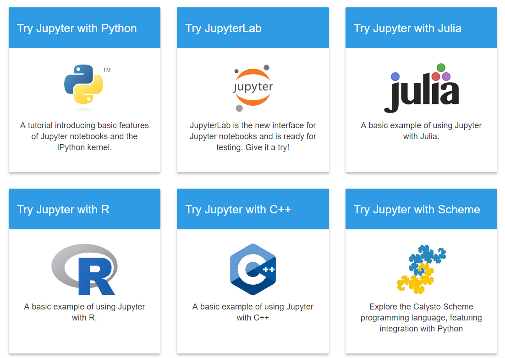     
* 支持包括Python, R, Julia, and Scala在内的超过40种编程语言。但是其本身是依赖Python的，需要安装Python环境才可以使用。  
* 可以通过邮件, Dropbox, GitHub和Jupyter Notebook Viewer与他人分享。  
* 丰富的输出格式，包括HTML、图片、视频、LaTeX印刷甚至自定义的MIME类型。  
* 大数据一体化，与Spark，pandas，scikit-learn，ggplot2，TensorFlow等工具和框架密切配合  

Jupyter专门为公司机构、班级和实验室人员提供了一个加强协作的版本，类似github取了个名字叫做Jupyterhub。它具有以下特性：  
* 热插拔的认证系统
* 集中部署  
* 容器友好  
* 代码与数据相邻  

Jupyter notebook基于一套用于交互式计算的开放标准。类似于网页上交互式计算中的HTML和CSS。第三方开发人员可以利用这些开放标准来构建带有嵌入式交互计算的自定义应用程序。  
* 文档格式：基于JSON的开放式文档。保存了用户会话的完整记录，包括代码、叙述性文本、公式和各种格式的输出。
* 交互式计算协议：使用交互式计算协议（一种基于ZMQ和WebSockets上的JSON数据的开放网络协议）与计算内核进行通信。  
* 内核：内核是以特定编程语言运行交互式代码并将输出返回给用户的进程。内核还响应tab自动完成和自省请求。  

## 1.1. nbviewer展示中心
Jupyter和许多框架一样，提供了一个集中共享和展示优秀作品的平台，也就是nbviewer。如果你缺乏艺术细胞，不知道怎么将自己的内容做得高大上、骚气满满，请多逛逛这里，它会给你带来灵感，最差也能照着做一份。  
   

## 1.2. 工具插件
通过一些工具和插件，在Jupyter中，用户可以可视化地控制数据中的更改，直观地看到改变模型的输入是如何影响结果的。有空的话，请一定多研究研究这些工具，你会发现它们非常棒！  
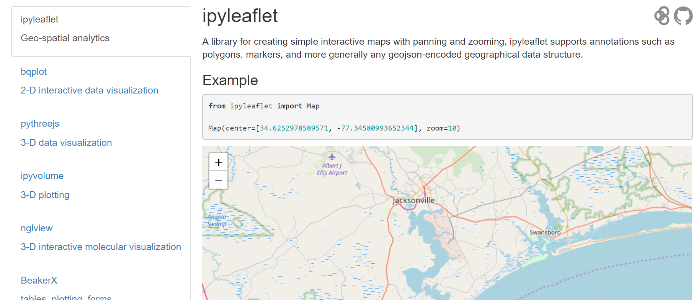   
## 1.3. 相关资源  
Jupyter项目是一个非盈利的开放源代码项目，因为它逐渐发展到支持跨编程语言的交互式数据科学和科学计算，2014年从IPython项目中独立出来。Jupyter承诺将始终是100%开源软件，免费供所有人使用，并根据修改后的BSD许可证的自由条款发布。Jupyter目前由一个指导委员会进行管理，其作用是通过与更广泛的Jupyter社区合作和服务，确保项目在技术上作为社区的长期福祉。  
# 2. 安装和文档  
依赖：Python环境  
虽然jupyter支持多种编程语言运行代码，但安装jupyter notebook本身却需要python（python 3.3或更高版本，或python 2.7）。  
## 2.1. 通过Anaconda安装Jupyter notebook 
这是我们强烈推荐的安装方法！  
如果一切无误，在Mac/Linux中打开终端，或者在Windows中打开命令行界面，运行：  
`jupyter notebook`  
>> 提示：因为系统路径的问题，有时候会提示你找不到可执行的命令。请将jupyter脚本或可执行文件的路径，添加到你的系统路径变量里。比如下面是Win10操作系统，并且使用的是Anaconda版本，那么在系统环境变量里添加如下图的条目：    

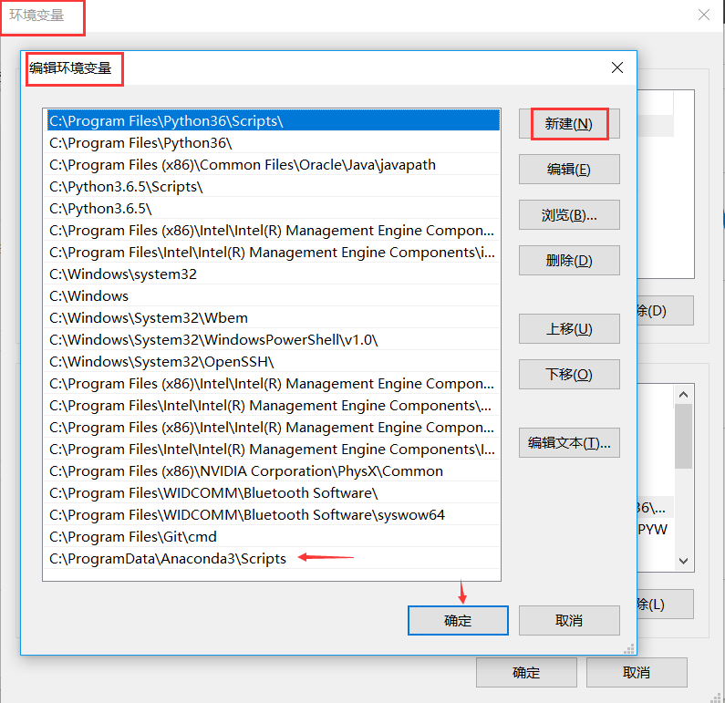  
## 2.2. 通过pip安装  
如果你不想安装Anaconda那么重量级的环境，只是想尽快、简简单单地使用Jupyter notebook，那么你也可以通过Python的pip工具来安装：  
如果你当前是Python3的环境（推荐）：  
```
python3 -m pip install --upgrade pip
python3 -m pip install jupyter
```
如果你当前是Python2的环境：  
```
python -m pip install --upgrade pip
python -m pip install jupyter
```
安装完成后，依然是执行下面的命令：  
`jupyter notebook`  

## 2.3. 文档
访问https://jupyter.org/documentation，你会看到有下面这么多的文档。事实上，作为使用者，我们不需要学习所有的内容，只需要学习那些基础的核心内容，其中有很多是给贡献者和二次开发人员查阅的。  
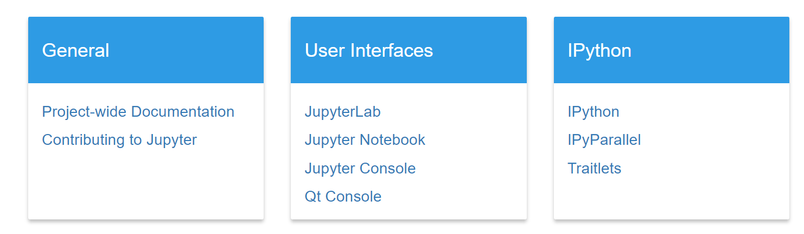   
访问https://jupyter.readthedocs.io/en/latest/，这里是整个文档的访问中心。  
# 3. 启动  
前面我们介绍过，在命令行或终端下，可以使用jupyter notebook命令，启动程序。这时会打印一些服务器的信息，默认的web应用url地址为http://localhost:8888。下面是Linux或mac中的信息节选：  
而在Windows环境下，我们双击快捷方式的图标后，会弹出下面的命令行界面，显示了服务器的信息：  
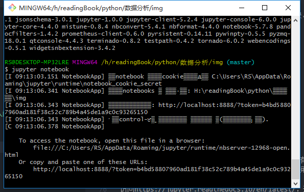   
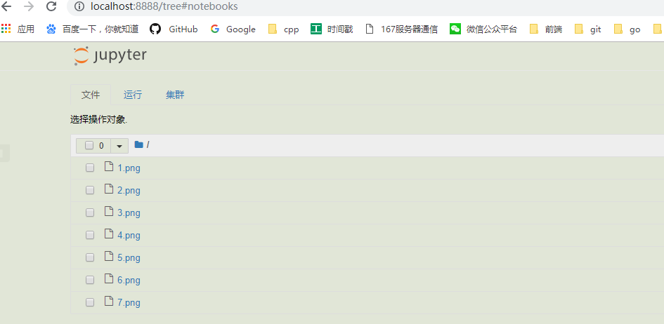   
当前显示的目录是你的notebook服务器所在的工作目录，这个是可以配置的。  
重要提示：由于本工具的使用在Windows下具有代表性，以后的内容介绍都使用Windows环境。  
下面介绍几个命令行运行方式下的小技巧：  
```
打开指定的notebook文件： jupyter notebook notebook.ipynb
指定运行的端口：jupyter notebook --port 9999
启动服务器但不打开浏览器：jupyter notebook --no-browser
查看服务器帮助内容：jupyter notebook --help
```
# 4. 运行机制  
Jupyter notebook本质上是一个基于BS结构的Web服务器，使用Tornado框架开发  
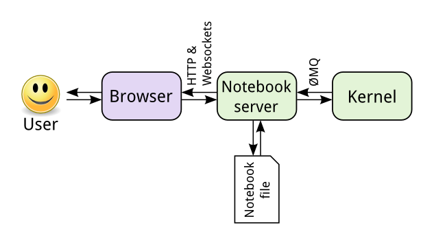   
用户只和浏览器前端页面进行交互。浏览器通过HTTP和Websocket协议与后台Notebook的web服务器交互。web服务器通过ZMQ与编程语言核心进行计算和通信。web服务器对磁盘存储器上的Notebook文件进行读写。一切都是围绕Notebook的web服务器展开的。  
web服务器维护了一个可读写的基于浏览器的编辑环境和存储服务，核心只是用来执行具体代码并返回结果的。  
这里的核心不限于Python语言，可以是R等40多种语言。你当前编辑的notebook文件使用哪种语言，就链接哪种语言的解释器核心！  
` jupyter kernelspec list 列出当前可用的核心`
notebook文件作为会话的完整记录，将可执行代码与丰富的解释性文本、数学公式和结果对象交织在一起。文档实际是JSON文件，但以.ipynb扩展名保存。由于JSON是纯文本格式，因此可以对其进行版本控制并与同事共享协作。  
下面是整体的框架体系结构图，供大家参考。  
   
# 5. 主界面
通常每次启动Jupyter notebook后，会自动打开浏览器进入下面的主界面：  
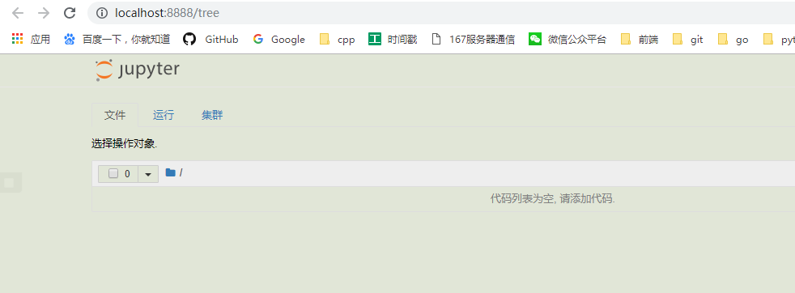   
让我们来看看各位置的具体作用：
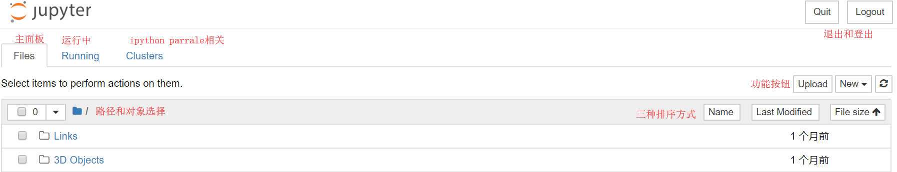   
当你选中不同的对象时，顶部会根据对象的不同显示不同的操作按钮，比如下面是选中notebook文档时的功能，按顺序分别为复制、关闭、查看、编辑和删除：  
# 6. 新建文档
从dashboard右上角，或者当前文档内File ‣ New。新的文档将保存在当前目录，并打开一个新的浏览器标签卡。  
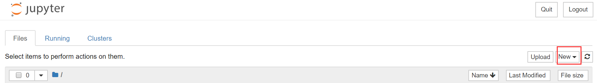  
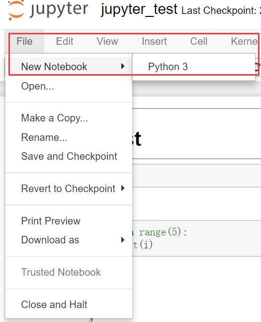  
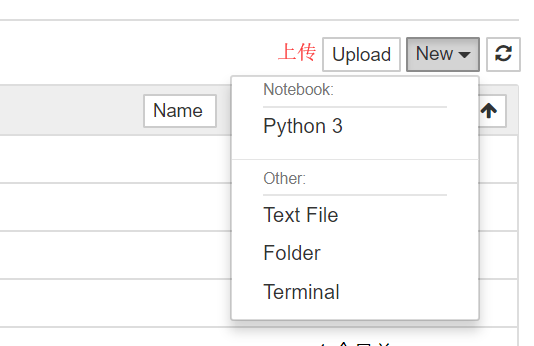  
我们在代码单元中输入1+2，并按下Shift+Enter。之后，单元中的代码就会被执行，光标也会被移动动一个新的单元格中。你会得到如下结果：  
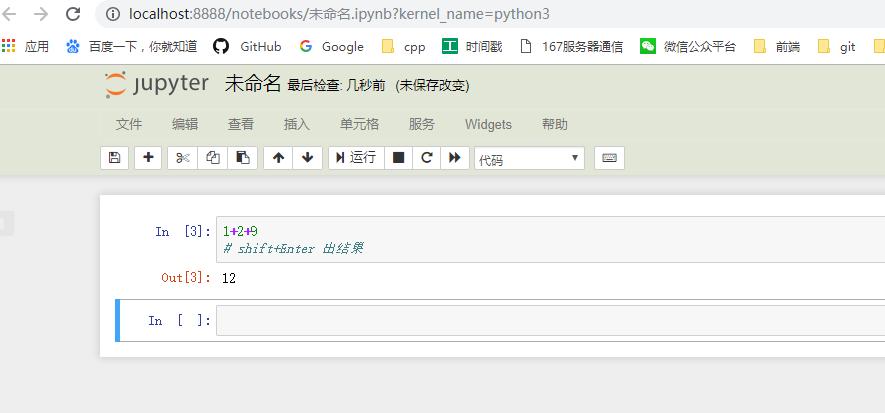  
接下来，我们在第二个单元中输入些其他代码：  
```
for x in range(5):
    print(x)
```
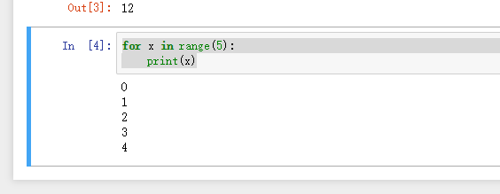  
和前面一样，代码被执行之后，马上就会显示结果。但这次没有出现类似Out[2]这样的输出提示符。这是因为我们将结果打印出来了，没有返回任何的值。
Jupyter notebook有一个非常有趣的特性，也是非常重要的特性！就是可以修改之前的单元内容，对其重新单独执行。试着把光标移回第一个单元，并将1+2修改成3+4，然后重新执行。你会发现结果马上就更新成了5。如果你不想重新运行整个脚本，只想用不同的参数测试某个代码片段的话，这个特性显得尤其强大。当然你也可以重新执行整个notebook。  
# 7. 工作界面  
当你创建了一个新的notebook文档后，你将进入下面的一个界面：  
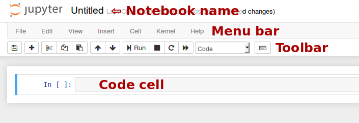  
* 文档名称：显示在页面顶部Jupyter徽标旁边的名称，反映.ipynb文件的名称。单击笔记本名称会弹出一个对话框，允许您重命名它。
* 菜单栏：菜单栏显示不同的选项，绝大多数功能都可以在这里找到。
* 工具栏：提供了最常用操作的快速执行方式。
* 代码单元：用于输入代码、文本等等。  
**顶部状态栏**  
    
显示Jupyter图标和文档名字，以及最近的检查点，保存模式，右侧则是当前使用的核心以及登出按钮。  
点击logout后，我们会退出当前文档，并跳转到下面的页面：
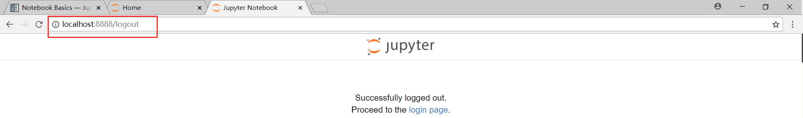    
如果再次打开刚才那个文档，或者点击login按钮，则会进入下面的页面，提示你输入密码令牌，如果不输入，则无法打开文档，只能重启整个程序。这个过程其实就是个web登录的概念，那么密码在哪里呢？  
每一次启动Jupyter notebook，程序都会随机生成一个token，比如在windows下：  
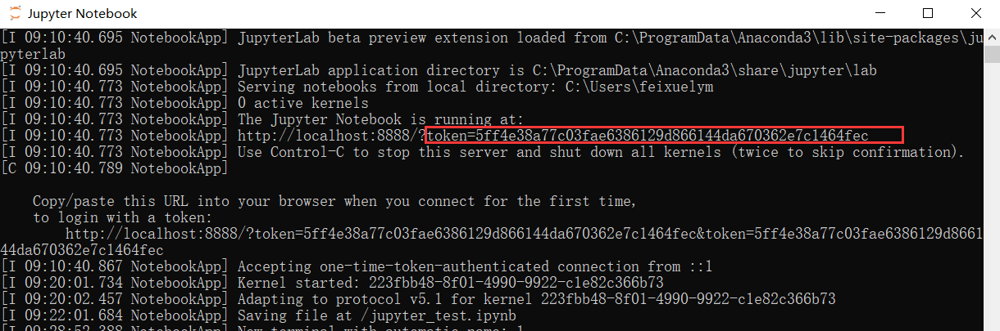    
复制这个字符串，输入就行了。这个动作在dashboard页面时也是一样的。Jupyter的多人协作模式，其实就是通过用户登录来实现的，多个用户可以同时使用一个服务器。  
**工具栏**  
  
从左至右，依次为：  
```
保存并检查
在下方插入单元
剪切
复制
粘贴
切换到上一个单元
切换到下一个单元
运行当前单元并跳转到下一个单元
停止内核
重启内核（带提示框）
重启内核并运行整个文档（带提示框）
单元类型选择下拉框
弹出命令查询框
```
**主菜单**  
文件:  
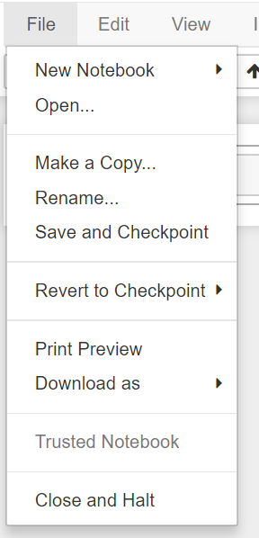    
按顺序，分别表示：  
```
新建文档
打开文档
复制文档
重命名
保存和检查
恢复到最近的保存点
打印预览
输出文档为不同的格式
是否被信任的文档指示
关闭并挂起文档
```  
编辑:  
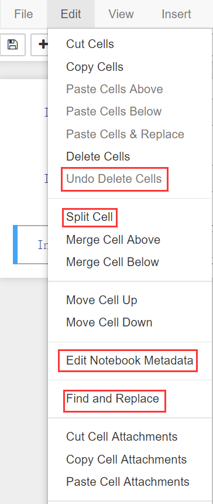   
此菜单中，主要是对单元的复制、剪切、粘贴、移动、删除、撤销、查找和替换等操作，比较好理解。  
需要注意的是Edit Notebook Metadata这个选项，它允许你修改文档的元数据，如下图所示：  
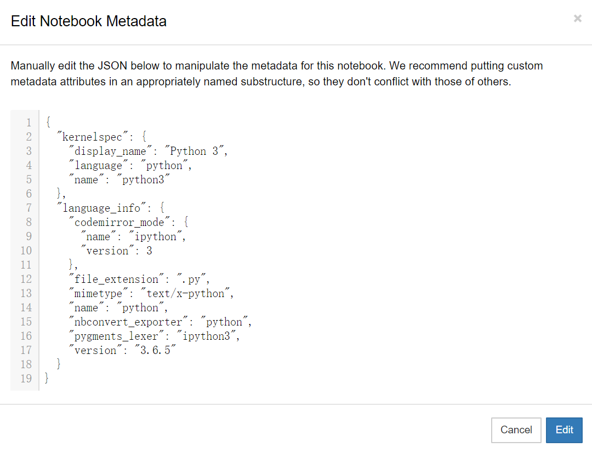   
查看:  
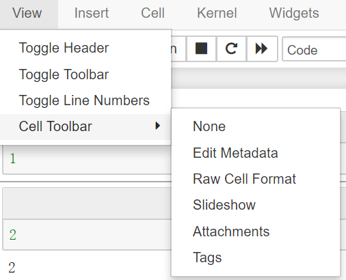   
四个选项分别是：  
```
顶部栏显示切换开关
工具栏显示切换开关
行号显示切换开关
单元工具栏选项
```
插入：  
这个比较好理解，就是在当前单元上方或下方插入单元。  
单元：  
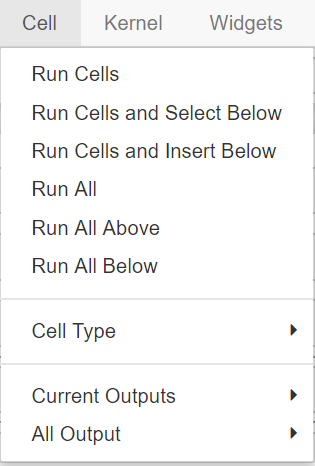   
前面几个选项无非就是运行方式的不同。下面几个二级选项可以选择单元的类型、当前单元的输出模式和所有单元的输出模式。  
内核：  
```
中断
重启
重启并清空输出
重启并运行所有单元
重新连接
关闭
切换内核
```
状态指示：  
在菜单栏的最右边有状态指示：  
```
Trusted表示当前文档是受信任的，可以运行JS代码
铅笔图标表示当前是编辑模式，否则为命令模式
Python3表示当前内核
中空圆圈表示当前内核的状态为空闲。实心圆表示当前核心正在运行中。
```  
# 文档结构  
Jupyter notebook的文档结构要点如下：  
* 文档由一系列单元组成。 
* 每个单元都是一个多行文本输入框
* 其内容可以通过使用shift+enter或单击工具栏上的“播放”按钮或菜单栏中的cell菜单中的命令来执行。 
* 单元的执行行为由单元的类型决定
* 有四种类型的单元：代码单元、Markdown标记语言文本单元、标题单元和原始raw单元。
* 单元开始时都是代码单元，但可以使用工具栏上的code下拉列表或通过键盘快捷键更改其类型。  
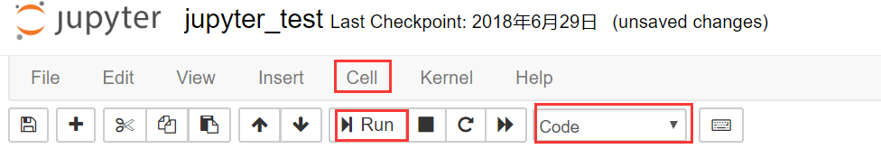   
代码单元：允许您编辑和编写新代码，具备语法高亮和tab自动完成功能。使用的编程语言取决于内核，默认运行python代码。  
当执行代码单元时，它包含的代码将发送到相关联的内核。内核计算后返回结果，并将输出显示在对应的单元后。输出不仅限于文本，还可以使用许多其他可能的输出形式，包括matplotlib图和HTML等等。  
Markdown单元：也就是可以编写Markdown标记文本的单元。具体的Markdown教程请大家自行搜索并学习，很简单，上手超快。  
标题单元：notebook提供的一种快速将单元设置为标题格式的单元。  
原始单元：用于直接写入输出结果。notebook不会对它进行任何处理，你编辑了什么，它就输出什么。  
# 编辑和命令模式  
Jupyter Notebook有两种工作状态：编辑模式和命令模式。  
编辑模式：意义很通俗，就是编辑内容的模式。单元以绿色边框线显示，其中有光标提示符闪烁。使用回车键或者鼠标点击可进入编辑模式。  
命令模式：此时被选中的单元左边是条蓝色的边框线，其它则是灰色的。命令模式下，不可以对单元的内容进行修改。ESC按键或者鼠标点击单元格外面，可以进入命令模式。  
# 快捷键  
Jupyter笔记本有两种不同的键盘输入模式. 编辑模式允许您将代码或文本输入到一个单元格中，并通过一个绿色的单元格来表示 命令模式将键盘与笔记本级命令绑定在一起，并通过一个灰色的单元格边界显示，该边框为蓝色的左边框。  
Jupyter notebook为我们提供了大量的快捷键，帮助我们提高工作效率。  
重要：类似vim，notebook快捷键分命令模式和编辑模式  
下面三个是最重要的快捷键：  
* Shift-Enter：执行当前单元的代码，并跳转到下一个单元。如果当前是最后一个单元，则在后面新增一个单元并进入。这个操作类似点击主菜单的cell-run，或工具栏中的play运行按钮。  
* Esc: 切换到命令模式，此时你可以通过快捷键在整个notebook中导航  
* Enter: 切换到编辑模式，可以在单元中编辑文本或代码  

要了解所有的快捷键，点击主菜单help-Keyboard Shortcuts，会弹出下面的窗口：  
  
  
# 执行和输出
## 代码执行
同时执行两个下面的代码。可以看到只有前一个执行完毕，下一个单元才能被执行。  
```
import time, sys
for i in range(18):
    print(i)
    time.sleep(0.5)
```
这就涉及一个单元状态的问题：  
* In []:表示未执行的单元
* In [ 4]:第4个被执行的单元
* In [ *]:正在执行的单元，或者内核连接中断，正在恢复连接中

## 输出折叠  
当输出内容较多，不利于查看的时候，可以在输出内容的左侧鼠标单击将其转换为可滚动的显示方式。或者双击将输出折叠起来。  
## Markdown单元
##  图片和视频
Jupyter 支持内嵌图片和视频功能。  
比如，我现在有一个django.jpg图片，那么在notebook文档的markdown单元中，可以这么引用它：  
```

```
##  幻灯片  
Jupyter Notebook还支持幻灯片的制作和播放。  
在菜单栏选择View > Cell Toolbar > Slideshow，这时在文档的每个单元右上角都会多出一个Slide Type 选项。通过设置不同的类型，可以控制幻灯片的格式。有如下五种类型：  
Slide：主页面，通过按左右方向键进行切换。  
Sub-Slide：副页面，通过按上下方向键进行切换。  
Fragment：一开始是隐藏的，按空格键或方向键后显示，实现动态效果。  
Skip：在幻灯片中不显示的单元。  
Notes：作为演讲者的备忘笔记，也不在幻灯片中显示。  
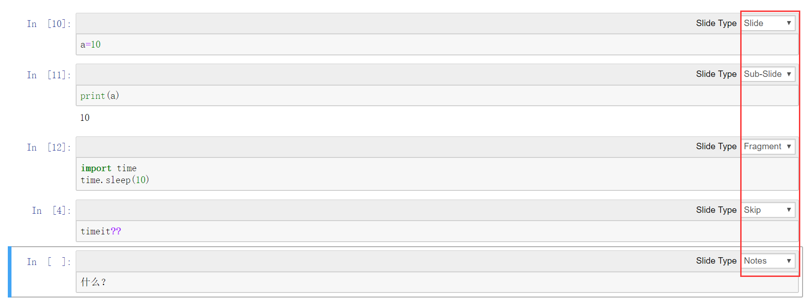  
演示幻灯片形式的notebook文档需要使用 nbconvert：  
```
jupyter nbconvert filename.ipynb --to slides --post serve  
```
当然也可以在web的终端模式中使用  
## 导出格式  
可以将notebook导出为多种格式： 
``` 
HTML
Markdown
ReST
PDF（通过 LaTeX）
原生Python代码
```
